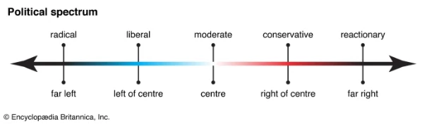
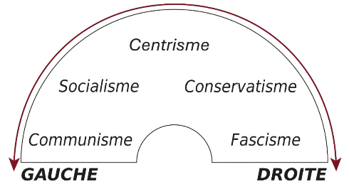
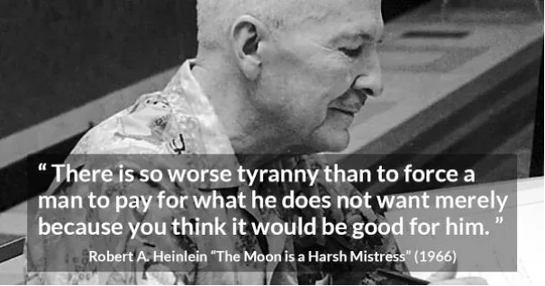
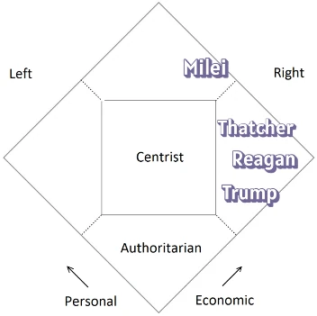
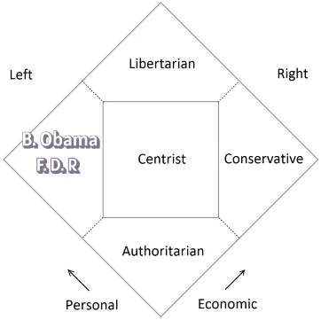
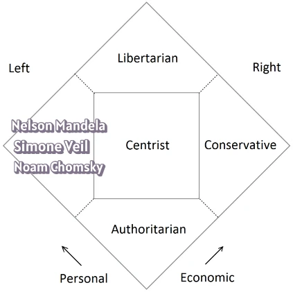
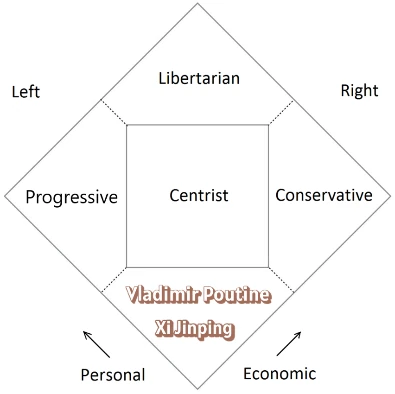
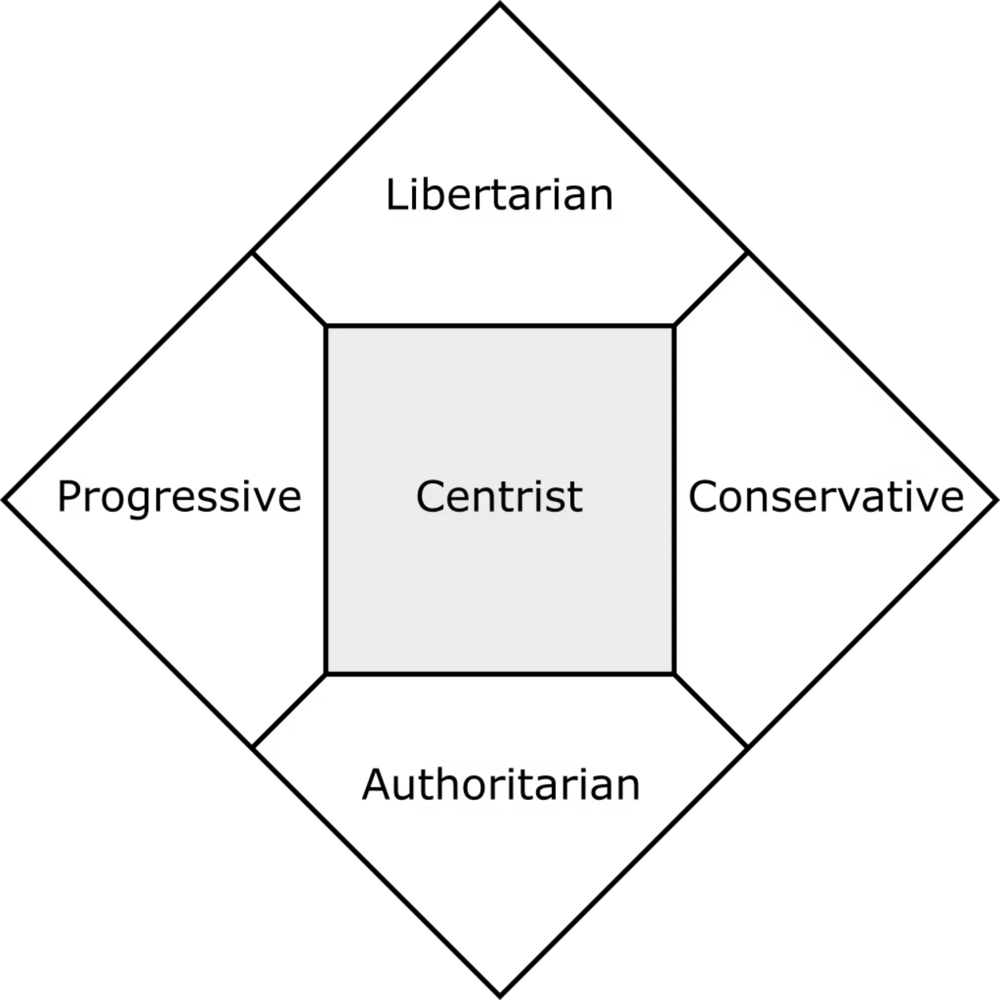
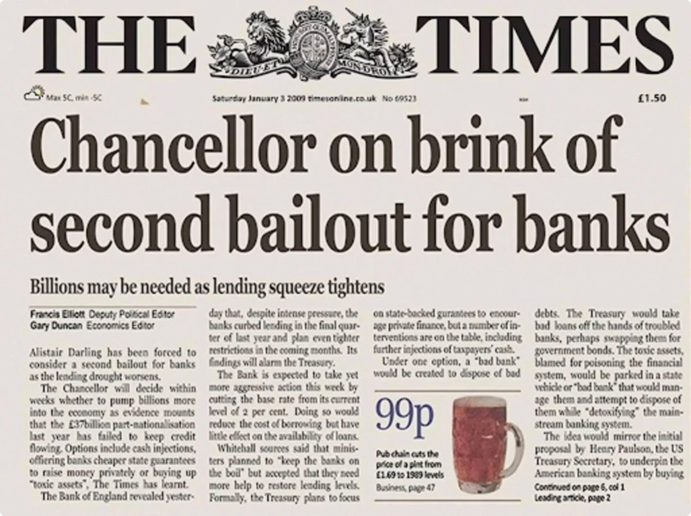
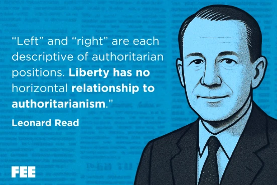

Does your political positioning boil down to right or left? This course proposes a different framework: **the fundamental Freedom-Coercion axis**. Using the Nolan Diagram, we analyze political families — socialists, conservatives, centrists, and libertarians — **not by their stated intentions, but by their confidence in government control**. Discover the logic of spontaneous order, explore the real philosophical fault lines, and **learn to define your own values** beyond traditional labels.

This course also reveals why **Bitcoin is a political project inherited from the Cypherpunks**. A decentralizing force that opposes state currency, Bitcoin redefines the essential political question: **do you decide your life, or does someone else?**

+++

# Introduction

<partId>8aef3eca-aa4c-405a-8b32-7fd7993b3e04</partId>

## Course overview

<chapterId>2209cf28-29ab-4092-88bd-9ffdc7942972</chapterId>

### Welcome

Welcome to this course on the great political families. Are you left-wing, right-wing, libertarian, conservative, socialist, centrist? Most of us have been trained to answer this question using a simple horizontal line running from far left to far right. The problem is that this line, inherited from the French Revolution of 1789, no longer describes political reality. It never truly did.

This course, developed by Damien Theillier, proposes a different framework: the freedom-coercion axis. Instead of asking where you sit between left and right, we ask a more fundamental question: do you trust individuals to organize their own lives, or do you believe a centralized authority must do it for them? This single shift in perspective transforms the way you read the news, evaluate policy proposals, and understand your own convictions.

### What you will learn

By the end of this course, you will be able to:

- **See through the left-right illusion.** You will understand why this classification, still dominant in the media, conceals more than it reveals, and why thinkers like Frederic Bastiat or innovations like Bitcoin simply cannot be placed on that line.
- **Map the political spectrum in two dimensions.** Using the Nolan Diagram, you will learn to distinguish economic freedom from personal freedom and to identify the four great political families that emerge from this distinction: socialists, conservatives, libertarians, and centrists.
- **Analyze political positions by their structure, not their slogans.** Politicians promise justice, order, progress, or balance. You will learn to look past stated intentions and examine the actual mechanism each family relies on: redistribution, tradition, voluntary exchange, or pragmatic compromise.
- **Recognize the philosophical roots behind political disagreements.** Freedom as principle versus freedom as opportunity, spontaneous order versus constructed order, individualism versus collectivism: these are the real fault lines, and this course equips you to identify them in any debate.
- **Understand why Bitcoin is a political project.** Far from being a neutral technology, Bitcoin inherits the cypherpunk tradition and poses the most fundamental political question of our time: who controls money, and therefore who controls your life?
- **Define your own political identity with precision.** Rather than accepting a label handed to you by a commentator or a quiz, you will build your own position from first principles, understanding exactly where you stand and why.

### Curriculum

The course is organized into six parts:

**Part 1, The right-left divide trap.** We begin by dismantling the traditional political axis. Through the cases of Frederic Bastiat and Bitcoin, we show that the most important political ideas of our time cannot be captured by a line running from left to right.

**Part 2, Towards a new divide: freedom-coercion.** We introduce the Nolan Diagram and its two dimensions, economic freedom and personal freedom, which reveal a far richer political landscape. You will discover where conservatives, socialists, libertarians, and centrists actually stand, and why labels like "far right" or "far left" obscure more than they clarify.

**Part 3, Political families under the microscope.** We examine each family in depth: their intellectual origins, their key thinkers, their internal tensions, and their blind spots. From democratic socialism to anarcho-capitalism, from Burkean conservatism to Rawlsian centrism, you will see each current from the inside.

**Part 4, Societal and economic issues.** We apply our framework to concrete debates: drug legalization, immigration, gun ownership, healthcare, taxation, subsidies, minimum wage. Each issue is examined through the lens of all four political families.

**Part 5, Philosophical differences between political families.** We go deeper into the intellectual foundations: freedom as principle versus as opportunity, spontaneous order versus constructed order, individualism versus collectivism. These distinctions reveal why political families that agree on goals so often disagree on means.

**Part 6, The political trend among bitcoiners.** We close by examining Bitcoin as a political project, tracing its roots to the cypherpunk movement and asking the question that runs through the entire course: who should decide?

Let's begin.

### About the course author

This course was developed by **[Damien Theillier](https://planb.academy/professors/damien-theillier)**, a philosophy professor in Paris and graduate of Sorbonne Paris IV. Theillier is the founder of the Institut Coppet and the Ecole de la Liberte, two institutions devoted to the rediscovery and dissemination of the French liberal tradition. He is the co-author of the preparatory class manual *General Culture* (Pearson, 2013) and *A Path to Freedom, the Philosophy from Antiquity to Our Days* (Berg International, 2013). His deep familiarity with the history of political philosophy gives this course a rare combination of conceptual rigor and practical relevance.

## The right-left divide trap

<chapterId>8aef3eca-aa4c-405a-8b32-7fd7993b3e04</chapterId>

Welcome to this course on the great political families. We begin with the figure of Socrates, the father of Western philosophy, who taught us to doubt and to question our own opinions. One of the most deeply rooted opinions in our modern thinking is the left-right divide. This course invites us to re-evaluate our political classifications and to focus on a distinction more fundamental than left versus right: the distinction between freedom and coercion.

### The trap of the left-right divide

Many believe that the most striking divide in the West today is between the political left and the political right. The media devote much of their coverage to this confrontation, which is presented as decisive for the future of civilization. To identify an individual's political leanings, we plot them on a simple horizontal line: far left, left, centre, right, far right.

This divide dates back to 1789. During the French Revolution, in the debates of August and September 1789, deputies who favored maintaining the king's power sat to the right of the Assembly president, while those who wanted to limit his powers sat to the left. The problem is that **this categorization has become largely inoperative in our time**.

Traditionally, the left is seen as reformist and the right as conservative. But this has become questionable, since the social-democratic left now fights to preserve acquired advantages, which effectively makes it, from that point of view, conservative. Most individuals who fall between the two extremes are called centrists, but this label also simplifies their position.

Have you ever felt that left or right, socialist or conservative, doesn't accurately describe your opinions? A person's position on the political spectrum is not static, and often depends on the issue at hand. If someone is for economic freedom but also for the right to immigrate, where would you place them on a simple left-right line?

The fundamental problem with this axis is that **it leaves no room for classical liberal thinking**, which cannot be lumped in with either the egalitarianism of the left or the nationalism of the right. Where do we place figures like Thomas Jefferson, Alexis de Tocqueville, Frédéric Bastiat, Ron Paul, or Javier Milei? Classical liberals and libertarians are sometimes falsely equated with the right, or even the far right. But more often than not, they simply do not exist in this frame of reference.

### The case of Frédéric Bastiat

Frédéric Bastiat (1801-1850), the emblematic figure of the French liberal school, was a deputy in the National Assembly. He had an entirely singular approach: he said he voted sometimes with the left, sometimes with the right, depending on the bill under discussion.

This did not indicate centrist opportunism. Bastiat could not sit with the royalists on the right, because he was himself a republican; nor did he want to sit with the socialists on the left. His votes were guided by a fundamental principle: **the promotion of individual and economic freedoms and the reduction of government interference**. He was convinced that social order and prosperity could emerge through private initiative and individual responsibility, with a minimum of laws.

For Bastiat, the real line of demarcation was not between left and right, but between those who believed in the coercive power of the state and those who trusted in freedom and voluntary association. He would vote with the left when its proposals aimed to abolish privileges, guarantee civil liberties, or oppose war; and with the right when its proposals protected private property or reduced taxes.

### The case of Bitcoin

Bitcoin is a fascinating current example of an innovation that transcends the traditional divide. It is undeniably **a political project that breaks with current monetary policy**, but it is impossible to place on a simple linear axis running from far left to far right.

We find supporters of Bitcoin across the entire political spectrum:

- For the liberal right, Bitcoin represents a tool of protection against state interference, guaranteeing private property and monetary freedom.
- For some on the left, Bitcoin represents a critique of the traditional banking system and a means of democratizing finance outside established institutions.
- Independently of any political ideology, many technophiles and investors are attracted by its decentralized nature and its disruptive potential.

In reality, the traditional dichotomy between left and right is inadequate and ill-suited to properly situate Bitcoin. A simple linear axis does not work well, since ideologies like fascism and communism share totalitarian characteristics that are not apparent on such an axis.

### A false division

Although left and right seem completely opposed, **they share a number of fundamental common points**. Both camps regularly criticize the free market: as a source of inequality (the left) or as a threat to sovereignty (the right). Both share a preference for state intervention, whether through the "strategic state" or the "emancipating state." Despite their apparent differences, all political parties, whether left, right, or centre, defend the right of the state to govern people's lives and intervene on all subjects through regulations and taxes.

This is precisely why the left-right opposition is ultimately an illusion. To illustrate this point, consider the following questions:

**Social issues**

- Should the government own or control newspapers, radio, or television?
- Should the government regulate sexual activity between consenting adults, including prostitution?
- Should drugs like marijuana, cocaine, and heroin be legalized?
- Should it be legal for people to travel or enter and leave a country without limitation?
- Should the government send troops to intervene in the affairs of other countries?
- Should children be legally obliged to go to school?
- Should parents be allowed to teach their children at home?
- Should gun ownership be restricted by law?
- What should the government's environmental policy be?
- Do we need a public institution to ensure that medicines are safe and effective?

**Economic issues**

- Should the government subsidize farmers and regulate what they grow?
- Should the government impose tariffs, quotas, embargoes, or other restrictions on international trade?
- Should the government introduce a mandatory minimum wage?
- Is taxation the only way to pay for necessary public services?
- Should the government help companies in difficult economic times with low-interest loans or subsidies?
- What is the best way to manage today's massive budget deficits?
- How can we solve the problem of the social security system's deficit?
- Should the government send financial aid to other countries?
- What should the government do about rising healthcare costs?
- What should the government's nuclear energy policy be?

In all these questions, one central issue emerges: **what degree of government control are you willing to tolerate?** And are you more or less forced to participate in financing that control? The fundamental political question is: who should decide? Do you make the important decisions about your personal and social life, or does someone else make them for you?

### Governors and governed

This partisan polarization masks a far deeper and more ancient divide: **the one that has separated those who govern from those who are governed** for centuries. On one side, the people, who endure inflation, fiscal pressure, and financial surveillance; on the other, the technocratic and political elite, who spend with other people's money, and very often with the printing press, that is, with fiat currency, supposedly for the good of the people.

The fiat money system benefits the wealthiest individuals and the most powerful financial entities, especially governments, which are the biggest borrowers. By borrowing, they push banks to print new money. The resulting inflation insidiously devalues money, destroying people's savings. Fiat currency is the cornerstone of this expansion of state power: it allows governments to finance unlimited spending, eliminating the budgetary constraints that existed under a gold standard.

As Frédéric Bastiat observed in the nineteenth century:

> "In all revolutions, there have always been only two opposing parties: that of the people who want to live by their own labor, and that of those who would live by the labor of others."

In other words: those who produce wealth and those who seize it to redistribute it to their supporters.

### Controllers and non-controllers

To conclude this introduction, let us turn to a science-fiction novel from the 1960s. In *The Moon is a Harsh Mistress* (1966), Robert Heinlein brilliantly synthesized what constitutes the true political fault line:

> "The human race divides politically into those who want people to be controlled and those who have no such desire."

The "controllers" include all those who, regardless of their stated ideology, from the far left to the far right, believe that the state or a higher entity must regulate, direct, and impose behaviors for the good of society. They favor top-down solutions, planning, and coercion.

The "non-controllers," by contrast, are those who do not wish to exercise power over others and who advocate for maximum individual freedom. They value personal responsibility, voluntary association, and the spontaneity of social order, minimizing government interference. It is here that we find figures like Frédéric Bastiat, or the principles of decentralization embodied by Bitcoin.

In this course, we will see that **the political landscape is far richer and more complex than left and right**, thanks to a visual model that will help us better understand the different political families and where we each stand.

# Towards a new divide: freedom-coercion

<partId>fb5cb390-67ad-41f3-903d-c208b84e6a0c</partId>

## The Nolan diagram

<chapterId>7b3aa120-6eee-45a1-9e46-856e26403e08</chapterId>

### From one dimension to two

Instead of dividing political doctrines along a right/left axis, it makes far more sense to look at things through the prism of freedom. The classical representation of the political spectrum is a horizontal line running from left to right.

This model oversimplifies the complexity of political ideologies, and above all, it omits an essential criterion: **the degree of state intervention**. As we discussed in the introduction, the fundamental question is: who decides? Is it you, or is it someone else?

This leads us to reject the one-dimensional model in favor of a two-dimensional one. David Nolan, founder of the Libertarian Party in 1971 and former student at MIT (Massachusetts Institute of Technology), devised a chart that far better represents the complexity of the political spectrum. His diagram uses two axes:

1. A vertical axis measuring **personal freedoms**
2. A horizontal axis measuring **economic freedoms**

The closer you are to the zero point (bottom left), the more your ideological position favors state intervention. Conversely, the further you move toward the opposite corner (top right), the more you favor minimal state intervention and maximum individual freedoms. From this perspective, the traditional left and right are relativized: the left tends to favor personal freedoms at the expense of economic freedoms, while the classical right favors economic freedom at the expense of personal freedoms.

### The five quadrants

When the diagram is presented in diamond form, we can identify five quadrants that precisely situate the different political philosophies:

- **Statism** (bottom): The most authoritarian, even totalitarian position. Those who support very little economic or personal freedom.
- **Socialism** (left): Those who support less economic freedom but greater personal liberty.
- **Conservatism** (right): Those who support greater economic freedom but less personal liberty.
- **Libertarianism** (top): The opposite of statism. Those who support the greatest economic and personal freedom.
- **Centrism** (middle): A pragmatic zone for those who favor a mix of freedom and regulation, implying the sacrifice of certain individual rights.

**The fundamental axis is therefore the vertical one**: between those who defend maximum individual freedoms (at the top) and those who favor maximum state control and intervention in people’s lives (at the bottom).

### Nuances within each family

Things are not simple, and it is always difficult to defend a completely monolithic political position. Within each political family, tensions and divergences exist:

- Among **socialists**, most are democrats attached to elections, civil liberties, and a degree of market economy. But some reject democracy and advocate revolution, the complete abolition of capitalism, and central economic planning.
- Among **conservatives**, some are strongly opposed to taxes and social programs, placing them closer to the libertarian summit. Others have more authoritarian tendencies and favor economic regulation; one could think here of the controversy around Donald Trump.
- Among **libertarians**, some want to abolish the state entirely and replace it with private services (anarcho-capitalists), while others prefer a minimal state that retains its core sovereign functions (the "minarchists").
- The **Greens** probably sit very low in the diagram. They consider that **individual interest must not take precedence over the collective interest of the planet**. In a sense, the Greens have replaced the Marxist class struggle with a struggle between man and nature, and they tend to defend economic control and even the abolition of private property in the name of planetary well-being.

## The two fundamental dimensions

<chapterId>e41d903d-26c9-425e-8a92-6aec48838b61</chapterId>

The diagram represents economic freedoms (tax levels, free market, private services) on the horizontal axis, and personal freedoms (freedom of movement, opinion, self-determination) on the vertical axis. This scheme is based on the idea that most political issues can be divided into two broad categories: economic and personal (or societal).

### Economic freedoms

**The economic freedom category includes what you do as a producer and consumer**: what you can buy, sell, or produce; where you work; who you hire; and what you do with your money.

*Examples of economic activity:* starting a business, buying a house, constructing a building, investing savings, hiring or dismissing employees.

- **To the right of the axis** (toward maximum economic freedom): preference for less state intervention in the economy, fewer regulations, lower taxes, and greater freedom for companies and individuals to produce, trade, and consume. The emphasis is on the free market, private property, and competition as engines of prosperity.
  - *Emblematic figures:* Margaret Thatcher (UK), Ronald Reagan (USA), Javier Milei (Argentina).

- **To the left of the axis** (toward maximum state control of the economy): preference for regulation, high taxes to finance public services (health, education, transport), nationalization, and redistribution of wealth. The aim is often to reduce inequalities and guarantee a degree of social justice.
  - *Emblematic figures:* Franklin D. Roosevelt (USA), Jean Jaurès (France), Bernie Sanders, Barack Obama.

### Personal and social freedoms

**The personal freedom category includes what you do in your private relationships**, with your opinions and beliefs. In general, it is everything you do with your own body and mind.

*Examples of personal activities:* marriage, choosing the books you read and the films you watch, the foods, medicines, and drugs you choose to consume, your religious choices, the organizations you join, the people you choose to associate with.

- **Top of the axis** (toward maximum personal freedom): preference for individual freedom and tolerance. The state should interfere as little as possible in the life choices of individuals (freedom of expression, legalization of certain substances, freedom of movement, etc.). We value autonomy and diversity.
  - *Emblematic figures:* Nelson Mandela, Simone Veil, Noam Chomsky.

- **Bottom of the axis** (toward maximum state control of personal life): preference for order, security, and traditional values. The state has a role in regulating morals, maintaining public order, and sometimes defending a certain vision of morality or tradition. These include positions in favor of the death penalty, restrictions on immigration, or government-led promotion of the traditional family.
  - *Emblematic figures:* Joseph de Maistre (French counter-revolutionary philosopher), and contemporary authoritarian leaders such as Vladimir Putin and Xi Jinping.

## Are you a right-wing or a left-wing statist?

<chapterId>06d903fc-9453-47d4-b0b1-38b6b82ccf99</chapterId>

### Statism as common ground

Contrary to appearances, left and right are not so opposed as they seem. They very often share a common desire for control: what we can call statism. Of course, their motivations, values, and priorities differ.

The left is less concerned with traditional moral requirements but gives priority to social justice and equality, particularly on the economic level. This is the source of its hostility to economic freedom, capitalism, and the free market: **the left wants to legislate and regulate the economy**.

The right, for its part, gives priority to personal morality and traditional values. It considers that civilization has been built on certain traditional institutions and social hierarchies, and that this heritage must be preserved. It is more favorable to economic freedom because it defends the morality of private property and individual responsibility, but **it wants to legislate on morality and religion**.

### The vertical axis reveals the truth

The central idea of the Nolan diagram is that the major difference between political philosophies is the degree of governmental control over human action, whether in the personal or economic sphere. In other words, there is not only a left-right axis reflecting your personal sensibilities, but also a top-bottom axis reflecting your willingness to use force to compel others to follow your values.

From this perspective, left and right share the same political objective: to win power in order to organize society according to their vision of the world and impose it on everyone. This is the very definition of statism: using legislation to control and shape society. For some, it is in the name of defending civilization; for others, it is in the name of defending the working class, nature, or the oppressed. And the centrists approve of this too, when it suits them.

This is why we can say that **some are right-wing statists, while others are left-wing statists**. The true political question is therefore not so much whether you are left or right, but rather to what extent you want the state to intervene in shaping society according to your values. Do you wish to impose your own sensibilities on others, or do you prefer that **each person be free to decide for themselves**?

## Are you a cultural conservative or a political conservative?

<chapterId>bef3d6f1-390a-472d-8f18-a559d38aea54</chapterId>

### Two distinct conservatisms

The term "conservatism" can give rise to confusion. We must absolutely **distinguish between cultural conservatism, which belongs to the realm of values**, and political conservatism, which is a political philosophy that relies on imposing those values on the whole of society.

**Political conservatism** is an ideology, often represented in right-wing or far-right political parties. It aims to preserve established political institutions and social order, opposing any major structural upheaval. Its proponents wish to use power and law to safeguard their heritage. In France, this tradition traces back to counter-revolutionary thinkers like Joseph de Maistre and Louis de Bonald, and more recently to Raymond Aron in the twentieth century.

**Cultural conservatism**, on the other hand, is a wisdom of life: the personal adherence to family, moral, aesthetic, and metaphysical values inherited from the past, whether Greco-Roman or Judeo-Christian. It is not a political philosophy. The cultural conservative believes that man, to be happy, needs elevation of the soul, spiritual values, and a certain nobility of feeling. These values are not imposed on others; they are lived as a personal and sometimes familial choice.

### You can be a cultural conservative and a libertarian

These two branches, though distinct, are sometimes confused because they can be adopted simultaneously or separately. **You can be a cultural conservative without being a political conservative.** An individual may defend cultural traditions (family, religion, local customs) in their personal or community life, while advocating limited government that does not impose these values by law. Such a person encourages conservative norms through persuasion, education, and example, while respecting the right of others to live differently.

The culturally conservative libertarian may morally disapprove of certain behaviors, but **does not advocate legal prohibition of consensual, non-aggressive actions**. He may dislike such actions, oppose them, and actively discourage them, but always without resorting to the coercive force of the law.

This synthesis between libertarianism and cultural conservatism has taken the name of "paleo-libertarianism" in the United States. This current distinguishes itself from neo-libertarianism (a strand more sympathetic to egalitarianism and the social evolutions of the 1970s) by combining **the rejection of the state as the institutional source of coercion** with a reinforcement of traditional institutions and a preference for voluntary social structures over state authority. In other words, the paleo-libertarian does not oppose the existence of socialist or communitarian communities; what he refuses is that such communities impose their values on everyone by force of law. Two major figures incarnate this approach:

- **Murray Rothbard**, an economist and philosopher who developed libertarian theory while recognizing the importance of traditional values, without ever advocating their imposition by the state.
- **Ron Paul**, a congressman from Texas for decades who ran for the Republican presidential nomination. Personally conservative in his values, he consistently defended a vision of limited government respecting individual liberties. For example, Ron Paul always advised against drug use but simultaneously opposed drug prohibition. He was personally opposed to abortion yet consistently argued that the choice should be left to the federal states rather than imposed from above.

## Are you a liberal or a libertarian?

<chapterId>d382c40b-78ce-416f-9f63-6ad43768406b</chapterId>

### A transatlantic confusion

The terms used to designate political families are not immutable. They can vary according to geographical and historical context, creating a major source of confusion. When the question is posed, "are you a liberal or a libertarian?", a European might answer that it is the same thing. But in Anglo-Saxon usage, these are radically different concepts.

In Europe, the term *liberalism* has remained relatively stable over time: it is associated with laissez-faire economic policies, reduced state intervention, and the defense of individual liberties. A position generally classified on the right.

In the United States, the same word has undergone a dramatic shift in meaning. **American *liberals* have become advocates of state intervention and *Big Government***. This evolution can be traced through key moments:

- In the 1930s, Franklin D. Roosevelt's *New Deal* marked a first major interventionist turn in response to the Great Depression: public works, public employment, subsidies. The meaning of *liberalism* began to slide toward a statist paradigm.
- In the 1960s, Lyndon B. Johnson's *Great Society* extended this to social programs and federal intervention.
- Today, American *liberals* are largely Democrats who defend public health insurance and anti-poverty plans. Someone like Bernie Sanders, who describes himself as a socialist or social democrat, claims the liberal label, but for him it is synonymous with state intervention to emancipate individuals.

We are very far from the European meaning of the term.

### The emergence of libertarianism

Faced with this linguistic drift, supporters of classical liberalism in the United States began calling themselves *libertarians* from the 1960s onward, precisely to distinguish themselves from American *liberals*. They are the heirs of nineteenth-century European classical liberalism.

A fundamental axis of libertarianism is the concept of **spontaneous order, owed notably to Friedrich Hayek** and the Austrian school of economics. According to Hayek, the rules and norms governing society should not be imposed from above by authoritarian planning, but should emerge from the free play of individual wills, contracts, and freely consented relationships between adults.

### Key intellectual figures

Several thinkers shaped the libertarian movement:

- **Murray Rothbard**, whom we have already mentioned regarding cultural conservatism, is also the theorist of anarcho-capitalism. In his 1973 book *For a New Liberty*, he advocated **the abolition of the state and the complete privatization of social activities**, opposing both economic and military interventionism.
- **Robert Nozick**, a professor of political philosophy at Harvard, responded to John Rawls's *A Theory of Justice* with *Anarchy, State, and Utopia* (1974). Nozick defended a minimal state in the Lockean tradition, and his rigorous analytical style contributed greatly to legitimizing libertarian thought in academic circles.

### Institutional structure

**The libertarian movement progressively organized itself**:

- The **Cato Institute** (1977), a think tank based in Washington, works on public policy proposals.
- The **Mises Institute** (1982), in Auburn, Alabama, focuses on education rather than political lobbying, functioning as a kind of online university with conferences and republished works.
- The **Libertarian Party** (1971), despite averaging around 2% in elections, constitutes the third largest American political party. Those 2% can tip an election, giving the party influence well beyond its electoral score.

### Libertarians and conservatives: a complex alliance

Libertarians are radically opposed to American *liberals* in the modern sense of the term. In this respect, they share certain common ground with conservatives: attachment to the limited government of the Founding Fathers, rejection of forced egalitarianism, opposition to public debt, and defense of states' rights against federal power. Ron Paul incarnates this convergence most clearly, though he remained a minority voice within the Republican Party.

Yet fundamental divergences persist. Libertarians reject the military interventionism of neoconservatives (one thinks of George W. Bush and the Iraq war), oppose conservative social policies and subsidies (whether to businesses or to families in the name of compassion), condemn drug prohibition as not only ineffective but immoral, and reject protectionism. On this last point, for example, **Trump's tariff policies drew sharp criticism from libertarians** who saw them as a betrayal of free-trade principles. The alliance between conservatives and libertarians, then, is real but inherently strained, united by a shared critique of American *liberalism* yet divided on the proper scope of state power.

## Are you a libertarian or a libertaire/anarchist (in French libertaire)?

<chapterId>fc761194-249f-4009-a20f-1f98b7226cf2</chapterId>

### A fundamental incompatibility

The two are not compatible. There is a major source of confusion between these terms, particularly in automatic translations where the Anglo-Saxon *libertarian* is often rendered as *libertaire*. Yet **these political philosophies, despite some superficial similarities, present fundamental differences**.

### Socialist anarchism (the *libertaires*)

The French *libertaires* are the heirs of socialist anarchism, a branch of socialism historically linked to thinkers such as Pierre-Joseph Proudhon and Mikhail Bakunin. Their fundamental principles are:

- The state must be abolished, as it is an oppressive structure.
- Private property and capitalism must also be abolished, because in anarchist doctrine, the state is the protector of private property and the rich. Hence Proudhon's famous formula: "Property is theft." (It should be noted that Proudhon himself evolved on this point: the early Proudhon was fiercely anti-capitalist, but **the later Proudhon moved closer to classical liberalism** and came to see private property as a guarantee of freedom.)
- They favor a return to a barter economy and an egalitarian society where goods belong to all.

Anarchists like Bakunin and Kropotkin (who was a strict anarcho-communist, rejecting even wages as a return to capitalism) saw private property and the state as twin sources of oppression. They advocated self-managed communes, cooperatives, and anti-hierarchical movements. Their economic vision rests on the labor theory of value; they condemn the wage system, reject profit and interest rates, and wish for **the radical disappearance of money and banks**.

### Libertarianism: property as the foundation of freedom

Libertarians diverge completely from the *libertaires* in that they defend private property as the very foundation of freedom. For them, private property is not a mere social convention protected by the state: **it is a natural right that precedes the law and the state**. If an individual owns their own body, they also own their labor and the fruits of their labor. Ownership of material goods is understood as an extension of self-ownership.

From this follows that taxation is understood as aggression akin to theft, since it forces an individual to cede part of their property for services they have not necessarily chosen. Voluntary consent constitutes the moral bedrock of libertarianism.

Regarding violence, libertarian doctrine rejects all forms of aggressive violence. However, it admits as legitimate defensive violence: self-defense and resistance to oppression.

### Strategies for abolishing the state

Here lies another fundamental difference. The *libertaires* historically advocate the destruction of the state and capitalism through violence, whether collective or individual. This approach rests historically on terror and targeted (or untargeted) attacks, as seen in Russia and later in Spain during the civil war.

For libertarians, aggressive violence is not legitimate. The principal strategy rests on **delegitimizing the state through the formation of collective beliefs**: argumentation, debate, discussion, and education. Libertarians advocate civil disobedience or actions that consist of deliberately ignoring the state.

### Anarcho-capitalism: historical roots

Anarcho-capitalism is not a recent doctrine. Its roots lie in the nineteenth century:

- **Gustave de Molinari**, a Belgian economist who worked in Paris alongside Frédéric Bastiat, wrote in 1849 an article entitled "The Production of Security," in which he argued that no government should have the right to prevent another from competing with it, or to require consumers of security to come exclusively to it for this product.
- **Lysander Spooner** and **Benjamin Tucker** in the United States were individualist anarchists who argued forcefully that the free market was capable of assuming sovereign state functions, notably security and justice.

In the twentieth century, Murray Rothbard took up the torch and theorized anarcho-capitalism comprehensively, notably in *Man, Economy, and State* and *For a New Liberty*. His thought rests on two principles: the non-aggression principle (it is illegitimate to initiate physical force against another individual or their property, a philosophical translation of the golden rule: do not do unto others what you would not have them do unto you) and the complete abolition of the state, understood as the principal aggressor.

Rothbard criticized the *libertaires* for adopting a naive and unrealistic vision of human nature, akin to Rousseau's "noble savage." For Rothbard, men are not naturally good, but they are guided by their interests. Society must therefore be organized so that good incentives guide behavior, which requires that private property be recognized and guaranteed. **Abolishing the state does not mean abolishing the functions of the state**: police and justice must not be eliminated, but managed by the free market on the basis of competition.

### A note on libertines

One should not confuse libertarians with *libertaires* or with libertines. Libertines are advocates of sexual freedom. It is less a political philosophy than a personal way of life, founded on a morality without taboos opposed to bourgeois morality. Politically, libertines often gravitate toward left-wing anarchism, that is, toward the *libertaires*. Yet one can also be both a libertine and a libertarian, since for libertarians, **each person has the right to live as they wish without aggressing against others**. Conversely, a libertine who sought to impose his morality on others through law would, by that very act, cease to be a libertarian.

# Political families under the microscope

<partId>2e1183f6-95d4-4d3c-9274-843993210624</partId>

## Structural and intentional definitions

<chapterId>ec5b13b7-4104-46a9-9c39-a810959a69ee</chapterId>

We now enter the heart of our analysis of political families. Before examining each one in detail, however, we must address a fundamental question: how should we define a political system? Take socialism as an example. Should we define it by its stated intentions (justice, well-being, emancipation), or should we instead define it by its fundamental structure, namely **whether it gives primacy to the individual or to the state**?

### The trap of intentional definitions

Milton Friedman wrote:

> One of the biggest mistakes is to judge policies and programs on their intentions rather than their results. We all know a famous road paved with good intentions. [...] Programs labeled as being for the poor or for those in need almost always have effects exactly opposite to what their well-intentioned sponsors hope to achieve.

In other words, Friedman gives priority to what we might call empirical analysis: focusing on the visible consequences of a system rather than on political promises and programs. This echoes what Frederic Bastiat taught when he argued that the good economist is one who sees the effects of a policy not only in the short term but also in the long term, and not only on a particular group but on the entire population.

Friedman warns us against the danger of relying solely on intentions. Policies motivated by generous intentions can have unforeseen or harmful consequences **when they neglect a rigorous analysis of human incentives and behavior**. For example, social assistance programs funded by the state (that is, by the taxpayer) risk producing perverse effects: they create no incentive to work, they generate economic dependency, and they amount to a form of spoliation since the money must first be taken from those who produced the wealth. For Friedman, measurable results, such as economic growth, poverty reduction, or efficiency, must take precedence over intentions, because the latter, however noble, do not guarantee success.

### The structural approach

**Structural or practical definitions focus on how political systems actually function** and on their observable characteristics. Socialism, for example, is characterized by the omnipresence of the state, which regulates, plans, and controls. That is a fact, and it matters far more than the declared intentions of fraternity or solidarity. Libertarianism, on the other hand, is defined by minimal state intervention in the economy and in private life, tending toward the primacy of individual freedom and the free market.

In contrast, **intentional definitions rely on the stated motivations, goals, or intentions** of individuals or groups. Socialism presents itself as pursuing "social justice" and solidarity. But if we rely on intentions, things become blurred, because everyone claims to favor justice; everyone invokes the sovereignty of the people. Yet "the people" remains an extremely abstract term, and therein lies the trap.

Our analysis will therefore privilege the structural approach, which allows for **a more objective evaluation of political systems based on their measurable results** and concrete means rather than their proclaimed intentions. On the Nolan Diagram, the bottom of the frame (pure statism, tending toward totalitarianism) will be treated somewhat separately, since it is less a political ideology than a social system. The three quadrants above (socialism on the left, centrism in the middle, conservatism on the right) and libertarianism at the top will each be examined through this structural lens.

### Beyond intentions

Structural analysis serves as a critical tool. It allows us to evaluate political systems according to their real results, not their promises. Intentional definitions, by contrast, create a conceptual confusion in which all systems claim to pursue similar objectives (justice, equity, freedom), making them impossible to distinguish from one another. We must therefore attend to the **empirical, measurable consequences of a political system**, as well as to the means it employs. It is through these that the true nature of a political system reveals itself, beyond the rhetoric of intentions or programs.

## The socialists

<chapterId>1ef34d7b-f813-458c-934c-1d404f882150</chapterId>

Socialism is a political and economic movement, and indeed a doctrine, that emerged in the nineteenth century with the critique of social inequalities and the alienation of workers in large-scale industry. From its very origins, it is also clearly an anti-capitalist movement, even though, as we shall see, modern socialists have progressively introduced moderations and compromises into their principles.

### Freedoms in the socialist framework

In socialist thought, freedoms are not considered uniformly. One observes **a fundamental dichotomy between the societal and economic spheres**:

- **Freedoms:** strong in the societal sphere, but weak in the economic sphere.
- **Cardinal values:** equality, progress, social justice, solidarity.
- **Philosophy and principles:** Primacy of collective organization. Socialism is a practice rooted in a holistic vision of society (holism), expressed through the state. The term "holism" comes from the Greek *holos*, meaning "the whole." The socialist state aims to take charge of and direct human activity to the maximum. Socialists have an almost unlimited faith in the possibility of building a new social order based on reason, what Hayek called "constructivism."
- **Politics:** Socialists advocate health programs, regulatory capture, tax increases, and subsidies to guarantee equity. This implies economic and social state direction, planning (the organization of production upstream). The most radical and fully realized socialism is totalitarian, as the state takes charge of all human activity.
- **Economics:** Socialism implies strong state control of the economy, in favor of equity. Socialists are suspicious of free markets, which they see as blind, instinctive forces. They favor wealth redistribution, centralized social programs, and progressive taxation that increases proportionally with income and becomes punitive for those who earn or produce wealth.

### Historical evolution

The concept of socialism was first used systematically by the Frenchman Pierre Leroux in 1833, in an article for the *Revue Encyclopedique*, explicitly in opposition to individualism. The term was then applied to the doctrines of Saint-Simon, Fourier, and Owen toward the middle of the nineteenth century, before Marx adopted it for his own purposes. Notably, the word "communism" that Marx would embrace also originated with a French socialist named Etienne Cabet.

By the end of the nineteenth century, a complete rupture emerged between Marxism and anarchism. From the early twentieth century onward, **a fundamental division separated revolutionary socialists from reformist socialists**:

1. **Revolutionary socialists** oppose property rights and seek to destroy capitalist bourgeois society. They aim to seize power through violence or the dictatorship of the proletariat. This current gave rise to Marxist communism and, ultimately, to the worst totalitarian regimes.

2. **Reformist socialists** are not prone to violence; they have understood that frontal opposition to the state does not pay. They pursue social justice through democratic elections and taxation, using the resources generated by the market economy. In other words, they temporarily accept capitalism in order to use it against itself. This tradition is represented by Jean Jaures, Leon Blum, Olof Palme (Sweden), Willy Brandt (Germany), and Francois Mitterrand (France).

### Marx and the revolutionary branch

Karl Marx drew a crucial distinction between utopian socialism and scientific socialism. He accused the early French socialists (Proudhon, Saint-Simon, Fourier) of being utopians, meaning they proposed purely imaginary solutions without genuine theoretical or practical foundations.

Marx's scientific socialism rests on historical materialism: the idea that **history progresses through class struggle and the appropriation of the means of production**. According to this approach, all cultural representations (law, political institutions, religions) are conditioned by the development of productive forces and relations of production. The state, the law, even culture itself are merely expressions of the interests of the dominant class. It is this materialist framework that led Marx to argue that the proletariat must become conscious of its oppression and liberate itself through revolution, by eliminating the oppressive class.

### Democratic socialism and the reformist tradition

Jean Jaures stands as one of the great thinkers of democratic socialism. A philosopher by training who entered politics at the turn of the twentieth century, Jaures founded the newspaper *L'Humanite*. His definition of socialism was the legitimate intervention of society and of power in human life, particularly in labor relations, in order to realize individual freedom and equity. In other words, **Jaures laid the theoretical foundations for justifying state intervention in the name of equality**.

Emile Durkheim, founder of the chair of sociology at the Sorbonne in 1913 and a friend of Jaures, explained that socialism is a protest against the current economic state of affairs that demands a transformation through the organization of economic forces. Both Jaures and Durkheim shared a strikingly economic conception of socialism: the economy must not be left to market forces (which they considered blind and instinctive) but should instead be managed rationally.

Modern socialism also owes a great deal to Roosevelt and the New Deal. In the 1930s, Franklin Delano Roosevelt implemented a set of reforms following the Great Depression that constitute a major reference for all contemporary defenders of democratic socialism:

- Creation of Social Security
- Introduction of the federal minimum wage
- Setting up of unemployment insurance
- Federal public employment programs

After the war, the United Kingdom adopted similar reforms (nationalizations, the welfare state), Germany's social democrats progressively abandoned Marxist references in favor of a social market economy, and the Nordic countries developed a model combining market economy, progressive taxation, and universal public services. Bernie Sanders, a contemporary American politician who identifies as a social democrat, **often cites France as an example of this model's success**, particularly its social security system.

### The holistic principle: primacy of the collective

Socialism is characterized by a holistic vision of society, considered as an indivisible whole rather than a simple sum of individuals. There are different ways of representing this collective: the social class (the Marxist approach), the nation (as in fascism, which subordinates the individual to the national interest), the race (as in National Socialism), or the gender (as in certain contemporary approaches). In each case, **the individual no longer defines himself; he is defined by his belonging to a group**.

### The Green New Deal: a contemporary synthesis

The Green New Deal represents a recent evolution of democratic socialism, fusing environmental concerns with social objectives. Politically, ecology aligns with the left and even the far left. This program combines ecological transition with social justice, employment guarantees, and reinforced public services. In every case, **individual interest is subordinated to the collective interest, defined by planetary health** and the challenge of climate change. At bottom, this is simply a new rhetorical envelope that justifies state intervention and the confiscation of private income, no longer solely in the name of equity and social justice but also in the name of the environment.

### Socialist thought in quotations

> We have come to a clear realization that true individual freedom cannot exist without economic security and independence. Necessitous men are not free men.
> Franklin D. Roosevelt, 1944

> The goal of socialism is the economic emancipation of all men.
> Leon Blum, *On a Human Scale*, 1945

> Socialism is the doctrine that teaches that society must be organized in such a way as to ensure the well-being of all its members.
> Emile Durkheim, *Socialism*, 1928

> For me, socialism is about people working together to create a society that works for all of us, not just a few rich people.
> Bernie Sanders, 2015

These quotations illustrate the noble intentions behind socialist thought. Yet **the fundamental question remains: what are the means, and where is the line?** If one pursues economic emancipation through coercion and power, is that not a contradiction in terms?

## Conservatives

<chapterId>4e068cd8-a5c3-44f8-ac77-309f249a59eb</chapterId>

Like every political family, conservatism is not a unified doctrine. It has adapted to different epochs and different cultures, and there are substantial differences between Anglo-Saxon conservatism and its continental European counterpart.

### Freedoms in the conservative vision

As the Nolan Diagram shows, conservatism exhibits a strong dichotomy between societal and economic freedoms, the mirror image of what we observed with the socialists:

- **Freedoms:** strong in the economic sphere but weak in the societal sphere. In the economic domain, conservatives defend the free market, entrepreneurship, and private property, largely for pragmatic reasons and in strong opposition to socialism. In the societal domain, restrictions are justified by **the preservation of traditional moral norms and social stability**.
- **Cardinal values:** virtue, order, tradition, civilization.
- **Philosophy and principles:** Conservatives believe that things are generally good as they are, and that any change could make them worse. At the heart of this philosophy lies a deep attachment to roots, to the past, and a fear of change that is too brutal. They hold a profound respect for long-established social institutions, seen as essential protections against chaos and the excesses of modernity. Everything that already exists and has proven itself over time is considered good in itself. As one American encyclopedia of conservatism puts it: conservatism is a philosophy that seeks to maintain and enrich societies through respect for inherited institutions, beliefs, and practices, in which individuals develop good character by cooperating with one another in primary and local associations such as families, churches, and social groups. Tocqueville observed this dynamic in *Democracy in America*: religion and local communities served as powerful counterweights to the risks of individualism.
- **Politics:** The nation-state is considered the principal axis of politics. Conservatives advocate traditional social controls, strong national defense, and more extensive police powers. They oppose all forms of socialism or communism, which they accuse of corrupting and weakening society.
- **Economy:** The economy remains a tool for reinforcing the established order and national power. Conservatives support free enterprise, low taxation, and minimal regulation of business. But they fear that **too much individual freedom could engender immorality or civilizational decline**. As Otto von Bismarck put it: "The economy is the surest path to national greatness." Even as partisans of the free market, conservatives view economic freedom not as an end in itself but as a lever for maintaining a strong state.

### A brief history of conservatism

The doctrine finds its philosophical roots in the eighteenth century, born in reaction to the French Revolution. Edmund Burke is often cited as the founding figure of this opposition, advocating the preservation of institutions and traditions against radical change. Burke championed prudence: even if he could embrace certain principles of the Revolution, he believed society should advance not by making a clean slate but through gradual reforms.

In nineteenth-century Europe, conservatism often manifested as support for the monarchy, the Church, and the established social order in the face of rising liberalism and nationalism. Figures like Joseph de Maistre in France represented a deeply reactionary strain. De Maistre harbored an absolute hostility toward reason, believing that men are not beings of reason and that **society can only be governed by appealing to deep instincts**, hence the crucial importance of religion. These reactionaries advocated a return to feudal, agricultural, and artisanal society, viewing industrialization as a threat to the traditional social order.

In the twentieth century, particularly in the United States, conservatism developed around the ideals of individual liberty, limited government, free markets, and Christian values, often in opposition to the progressive policies of the New Deal. This Anglo-Saxon conservatism was far more modern, having fully accepted scientific and technological progress while attempting to reconcile community and individual, freedom and responsibility. In Britain, Margaret Thatcher exemplified this tendency through her opposition to trade unions and centralized planning, always with the underlying goal of **restoring moral and religious values as a bulwark against the excesses of progressivism**.

### Great thinkers of conservatism

- **Edmund Burke (1729-1797):** Often considered the father of modern conservatism, Burke insisted on gradual, organic change rather than revolutionary rupture. His *Reflections on the Revolution in France* (1790) laid the intellectual foundations of Anglo-Saxon conservatism.
- **Michael Oakeshott (1901-1990):** A British philosopher known for his critique of rationalism in politics, Oakeshott defended **a conception of conservatism as temperament rather than systematic ideology**. His essay *On Being Conservative* (1956) remains an essential reference that also influenced Friedrich Hayek.
- **Roger Scruton (1944-2020):** A contemporary British philosopher who developed a sophisticated defense of conservative values in the context of late modernity, particularly in his book *The Meaning of Conservatism*.

### A problematic flexibility

Conservatism sometimes displays a troubling flexibility with regard to principles. During the 2008 financial crisis, George W. Bush declared: "I have abandoned free-market principles to save the free-market system." The following year, he added: "I have gone against my free-market instincts and approved a temporary government intervention." By intervening to bail out the major banks, Bush assumed **the conservative role of the state as ultimate guarantor of the national economy**, placing the power and continuity of the nation above the abstract principles of the market. This same logic can be found in Donald Trump's protectionist trade policies, pursued in the name of the national interest at the risk of fueling corporatism and crony capitalism.

### The emergence of neoconservatism

From the 2000s onwards, neoconservatives became increasingly involved in justifying military interventionism to implant democracy around the world, particularly after the September 11, 2001 attacks. This policy of "nation-building" broke with the traditional prudence of conservatives in matters of foreign policy. In reaction, traditional conservatives claimed the label "paleoconservative" to distinguish themselves from neoconservatives. They criticize military interventionism, defend a more isolationist foreign policy, and **place greater emphasis on questions of national and cultural identity**.

### Conservative thought in quotations

> A conservative is someone who believes that nothing has ever been done for the first time.
> Benjamin Disraeli

> Conservatism is not a rigid system of thought, but a disposition, an attitude toward life, a tradition.
> Michael Oakeshott

> Conservatism is the conviction that there exists a moral truth that we did not invent and that we cannot abolish.
> Roger Scruton

This last quotation is fundamental for understanding the strong opposition of conservatives to progressives. Conservatives hold that there is a human nature, and from that nature emerge moral rules. These rules are not arbitrary; they arise from what the human being fundamentally is. Consequently, any attempt to modify human nature is not only doomed to failure but is, above all, immoral.

## Libertarians

<chapterId>9ca743de-537b-42fb-87d2-212d5f478b22</chapterId>

The libertarian family distinguishes itself from all other political philosophies in a fundamental way: **it places at its center not the economy but ethics and law**. When libertarians defend the market economy, it is less for its capacity to produce wealth than for its promotion of individual freedom and responsibility.

### Freedoms and fundamental values

As the Nolan Diagram immediately shows, libertarians sit at the top of the frame because they accept no restriction on the defense of freedoms, whether societal or economic. This is precisely what distinguishes them from every other political family:

- **Freedoms:** strong in both the societal and economic spheres. On the societal level, libertarians defend maximal individual freedom, encompassing the decriminalization of certain substances, freedom of educational choice, and the non-interference of the state in citizens' private lives. On the economic level, this extends to the freedom to undertake, to hire, to set wages, and above all **the right to spend one's money as one sees fit** and to trade without restriction or surveillance.
- **Cardinal values:** legitimate private property, individual freedom, consent, responsibility. These values are intimately linked and entirely inseparable from one another.
- **Philosophy and principles:** Libertarianism is first and foremost a philosophy of law. The fundamental idea, found as early as the seventeenth century in John Locke, is that every individual possesses inalienable rights to life, liberty, and property. These rights are not granted by government but are intrinsic to the human being. Self-ownership is the concept that each individual is the rightful owner of his or her own body and life. As Bastiat wrote, man is first the owner of himself, then the owner of the things he has acquired. The principle of laissez-faire is not the absence of norms; it is **a fundamental norm that must be defended, including by force**.
- **Politics:** The principle of non-aggression postulates that a person is free to act as he or she wishes so long as no acts of violence are committed against the life, liberty, or property of another. This formulation recalls the golden rule found in all civilizations and religions: do not do unto others what you would not have them do unto you. Libertarians refuse to grant the state special permission to commit acts that most people would consider immoral if committed by individuals. In short, **there is a single moral code that applies to everyone, with no exceptions**. This naturally produces a deep suspicion of power, particularly state power, which can legally exercise coercion, including through the monopoly of monetary control. Taxation is qualified as theft or extortion, because it consists of seizing another's property without consent, in violation of the non-aggression principle.
- **Economics:** Freedom of enterprise and exchange flows directly from self-ownership and from ownership of the fruits of one's labor. Freedom produces a spontaneous order, more just and more efficient because it results from individual action and responsibility. The free market stands in opposition to corporatism (a system in which the state collaborates with organized groups to regulate the economy, creating monopolies and regulatory protections). **the free market is the natural process by which individuals interact peacefully**, without relying on the force of law to obtain advantages.

### Historical evolution

Libertarian ideas trace back to the eighteenth century with classical liberalism. The Physiocrats (Vincent de Gournay, Turgot, Quesnay), then Condillac, Jean-Baptiste Say, and Frederic Bastiat clearly formulated these principles. Over the course of the twentieth century, **a fundamental shift occurred with the progressive abandonment of laissez-faire principles** in favor of the welfare state and an increasingly regulated society. In response, classical liberals in the United States began calling themselves "libertarians" to distinguish themselves from American "liberalism," which had been co-opted by growing state interventionism. These libertarians recognized themselves in the [Austrian school of economics](https://planb.academy/resources/glossary/austrian-school), whose principal thinkers are Ludwig von Mises, Friedrich Hayek, and Murray Rothbard.

### Types of libertarians

In the twentieth century, two major tendencies emerged, though the divergences between them rest more on empirical questions than on fundamental ethical disagreements:

1. **Minarchists** consider that the powers of the state should be strictly limited to the defense of individual liberties. It is a minimal state regime (the "night-watchman state"), where power is legitimate only to ensure the core functions of police, justice, and territorial defense. Ron Paul is a prominent figure of this tendency: a physician and U.S. congressman who represented Texas for decades, he consistently voted against any bill that strayed from the Constitution, opposed all forms of foreign interventionism, and **championed the denationalization of money**, an idea advocated by Friedrich Hayek. Paul argues that the Federal Reserve is responsible for inflation and economic cycles through the manipulation of fiat money, and he has seen in Bitcoin a form of sound money that could replace the gold standard.

2. **Anarcho-capitalists** consider that state functions should be privatized and managed entirely by the market. This is not a society without rules, authority, or laws, but **a society in which rules would be established through voluntary adhesion and consent**. There could be governments and state-like functions, but there would be no monopoly; competing enterprises would offer their services to clients. Key thinkers include Murray Rothbard (*For a New Liberty*, 1973), David Friedman (Milton Friedman's son, who takes a more pragmatic, utilitarian approach arguing that the market can provide all services more efficiently, including law and order), and Hans-Hermann Hoppe (a disciple of Rothbard who develops an approach based on argumentation ethics).

### Libertarian thought in quotations

> The libertarian sees no contradiction in being "left" on some issues and "right" on others. On the contrary, he considers his position the only consistent one in practice, from the standpoint of the liberty of each individual.
> Murray Rothbard, *For a New Liberty*, 1973

> If you don't have the right to rob your neighbor, you shouldn't send the government to rob for you.
> Ron Paul, 2008

In other words, Rothbard underscores that libertarianism transcends the traditional left-right divide, and Paul highlights the rejection of the state as a tool of coercion. **the prohibition on theft applies not only to individuals but also to the state.**

## The centrists

<chapterId>d4f5c100-a791-45cf-bc7c-6e2353dc7a48</chapterId>

Centrism is more than a simple median position equidistant from all others. It is a genuine political philosophy, a method of governance that claims to be adapted to contemporary pluralist societies. It is an approach that **privileges efficiency, pragmatism, and tends toward a form of technocracy**: power should be entrusted to experts who must steer the economy and pilot monetary policy.

### Freedoms and cardinal values

The centrist approach is characterized by a constant search for balance between public authority and private autonomy:

- **Freedoms:** moderate in both the societal and economic spheres. In the societal domain, centrists aspire to reconcile governmental control and individual choice, favoring measured state intervention while preserving fundamental liberties. In the economic domain, freedoms are guaranteed but always tempered by a concern for social justice. Centrists are highly critical of laissez-faire, yet they remain both pro-business and favorable to correcting inequalities. An important distinction must be made here: being pro-business (as centrists tend to be) means favoring **a kind of alliance between large enterprises and the state**, which differs from being pro-market.
- **Cardinal values:** moderation, compromise, adaptation, public utility.
- **Philosophy:** Pragmatism is a political philosophy that privileges adaptation to particular contexts rather than the rigid application of ideological principles. This pragmatic thinking is founded on the idea that only technocrats are capable of making the right decisions to achieve the best socioeconomic results. In a technocratic governance model, political decisions arise from rationality and expertise rather than ideology or partisan debate. To calculate the utility of a decision, one must be able to measure all its consequences, and this requires expertise: sophisticated calculations, statistics, surveys, probabilities. Yet there is a paradox here: **this pragmatism itself rests on a form of dogmatism** (namely, that only experts are competent to steer society), a conviction that remains invisible and unexpressed.
- **Politics:** Centrists seek to transcend traditional divisions (left versus right) through coalition governance, uniting moderate parties from the conservative right to the social-democratic and ecological left into a central group that **transcends the historical cleavages between left and right**. This method suits modern societies characterized by diversity. Bill Clinton in the United States was recognized for his ability to pass laws by winning votes from both Republicans and Democrats; Emmanuel Macron in France was elected twice by forming a broad center composed of all the moderates.
- **Economy:** Centrists accept market mechanisms while recognizing the need for appropriate expert control and regulation. They advocate a regulated market economy where competition takes place within a framework protecting the general interest. One might call this a "soft dirigisme," since it does not seek to plan the economy completely but rather to cap bonuses, regulate practices, and manage the market in the name of social peace.

### Targeted social programs

Centrism recognizes the importance of **targeted social programs to correct inequalities without creating excessive dependence** on the state. This system of wealth redistribution aims less at dogmatic egalitarianism than at social peace and "living together."

### Is Keynesianism an economic centrism?

John Maynard Keynes, the great English economist of the twentieth century who has dominated economic thought and practice in Western societies to this day, can indeed be seen as representing a form of centrism. His approach seeks a balance between classical liberalism (the free market) and dirigiste socialism (maximum planning).

Rather than letting markets regulate themselves, Keynes argued that the state should use fiscal and monetary policies (public spending, taxation, interest rates) to stimulate aggregate demand in times of recession or curb it during periods of economic overheating. He is the originator of the well-known idea that consumption is good for growth. But for this mechanism to work, **experts are needed to manipulate the right levers**: monetary levers like interest rates and money creation. To finance social spending, the state must be able to borrow, and for borrowing to be feasible, money must be available and not too costly, hence the importance of central banks in maintaining a certain inflation rate.

### John Rawls: the philosophical dimension

John Rawls, the eminent political philosopher and author of *A Theory of Justice* (1971), represents the theoretical dimension of centrism. His conception of social justice proposes **a pragmatic balance between individual liberties and corrective interventions against inequalities**.

Rawls proposes two principles of justice:

1. **Equal liberty for all:** the foundation of democracy as Tocqueville had shown.
2. **The difference principle:** allowing inequalities only if they benefit the most disadvantaged. In other words, one has the right to grow rich, provided that redistribution allows the least favored to benefit as well.

The concept of **overlapping consensus is also central to Rawls's thought**, notably in his book *Political Liberalism* (1993):

> An overlapping consensus is reached when citizens, while adhering to different comprehensive, religious or philosophical doctrines, nevertheless converge on a set of political principles of justice that they can all endorse from their own perspectives.

This approach perfectly illustrates the centrist method: seeking rational, moderate agreements despite the diversity of opinions within a pluralist society, the very essence of centrist philosophy.

### Centrist thought in quotations

> The important thing for Government is not to do things which individuals are doing already, and to do them a little better or a little worse; but to do those things which at present are not done at all.
> John Maynard Keynes, *The End of Laissez-Faire*, 1926

What Keynes means here is that there are market failures (crises of overproduction, shortages, speculation), and when crises occur, only the state is in a position to intervene. **The market is not capable of self-regulation**, and so it must be protected, which falls to the state and therefore to experts and technocrats.

## Totalitarian regimes

<chapterId>7a5e9f5a-2be1-4497-892a-3da5f015faa0</chapterId>

We conclude our analysis of the great political families with totalitarian regimes, but here we are dealing with something fundamentally different. Totalitarianism is not, strictly speaking, a political philosophy; **it is rather the negation of all political philosophy**. This is what Hannah Arendt shows us when she draws the distinction between classical despotism and totalitarianism.

### Hannah Arendt's insight

In her major work *The Origins of Totalitarianism* (1951), Arendt writes: "Totalitarianism does not tend to subject men to despotic rules, but to a system in which men are superfluous." What she means is that a totalitarian regime is not simply a classical regime tending toward tyranny or despotism (as monarchy sometimes did, or even democracy, as Tocqueville warned). It is something else entirely.

According to Arendt, **totalitarianism is not a political family but the very negation of politics**, a system in which human beings are rendered incapable of independent action. Politics, in her conception, is the capacity of a people to take its destiny in hand and to act. In totalitarian regimes, this capacity is destroyed.

### Definition and fundamental characteristics

Mussolini declared in 1920: "Everything in the State, nothing outside the State, nothing against the State." This reveals precisely what "totalitarian" means: totality. Everything is absorbed into the state, meaning **there is no longer any separation between public and private space**. The state entirely absorbs society, which at that point loses all form of autonomy. If you want to open a table tennis club, you need the party's authorization. And this extends to absolutely everything, including the intimate life of the family.

- **Freedoms:** suppressed. Totalitarian regimes impose strong governmental control over both personal and economic life. Totalitarianism exists when the state controls everything in society and wields unlimited power, eliminating all forms of opposition through political policing.
- **Philosophy:** Totalitarian societies are distinguished by their use of an ideology, the promise of a "paradise" (the end of history for communism, or racial purity for Nazism). The party unifies the masses against an enemy both external and internal (the capitalist bourgeois for communism, the Jew for Nazism).
- **Politics:** a single-party system in which a tiny minority controls the entire population through ideology and terror. **All totalitarian regimes came to power through violent revolution**, a revolution that justifies violence by making a clean slate of the previous system.
- **Economy:** totalitarian regimes may tolerate private enterprise if it is forced to serve the interests of the state, or they may demand that the state control all means of production. They see the free market as a threat to general order, because ideal societies must be planned by the authorities.

### The pillars of totalitarian control

Totalitarianism is present when **all of the following characteristics are assembled simultaneously**: suppressed freedoms, unlimited authority founded on the single party and the cult of the leader, violent revolution, and a directed economy. This was already the case with the French Revolution, which is why some historians have identified a totalitarian dimension within it. It is important to note that modern democracies may exhibit some of these characteristics, but never all of them at the same time (at least, fortunately, not until now).

### Two models, one method: Hitler versus Stalin

The differences between Nazism and communism are more apparent than real. Despite their historical antagonism, Hitler and Stalin employed identical methods: the cult of personality, total social control through surveillance, censorship, indoctrination, and political policing, and **the systematic elimination of all forms of opposition or dissent**. As Raymond Aron, an astute observer of twentieth-century totalitarian regimes, wrote: "Nazi or communist totalitarianisms function in the same way, on two principles: the faith of the militants and the fear of the opponents." He speaks of "faith" in a quasi-religious sense; totalitarian regimes have been called secular religions, religions without God. A kind of fanaticism characterizes them beyond their different motivations.

- **Hitler (Nazism):** although the Nazi regime did not formally abolish private property, there was an appearance of a market economy while the private sector was completely subordinated to the objectives of the state (war and rearmament). Economic autarky was imposed, meaning there was no free trade. There was centralized economic planning to serve the regime's goals.

- **Stalin (Communism):** Stalinism exemplifies total state control of the economy. All private ownership of the means of production was abolished, the economy was fully planned (five-year plans), collectivization was forced, and the state controlled absolutely all aspects of production and distribution.

As Thierry Wolton, who has studied the comparison between these two regimes extensively, writes: "The twinship of Soviet communism and Nazism is a historical fact. The two totalitarianisms resemble each other in their mode of functioning and political practice: **hatred of democracy, of humanist values, of individual freedom** are traits common to both."

### Totalitarian thought in quotations

> The people do not need freedom, for freedom is one of the forms of bourgeois dictatorship.
> Vladimir Lenin, *What Is to Be Done?*, 1902

> The German people will be led not by reasoning, but by a leader who embodies the will of the people.
> Adolf Hitler, *Mein Kampf*, 1925

> Nazism and communism share a common opposition to liberal democracy and what they call the "capitalist bourgeoisie." [...] Both ideologies claim to be socialist and use that image against each other.
> Francois Furet, *The Passing of an Illusion*, 1995

These quotations reveal the common logic of totalitarian regimes: **the rejection of individual freedom in favor of absolute centralized authority**, whether communist or fascist. Indeed, the Nazi party's very name (National Socialism) signals this shared ideological matrix, even though the two movements detested each other.

# Societal and economic issues

<partId>ab160ddd-5c3a-436b-a77a-76d7089f1611</partId>

## Societal issues

<chapterId>bb2156da-7e10-4f0b-89c3-f6d53f5a79ef</chapterId>

After analyzing the major political families, we now turn to a series of debates on societal issues, followed by economic issues. The goal here is to offer a comparative analysis of socialist, conservative, libertarian, and centrist positions on five fundamental questions of society: marriage, immigration, firearms, drugs, and the tax on sugary drinks.

Societal issues are not about money. They concern the choices we make about what we read, eat, drink, smoke, wear, or with whom we choose to associate, sleep, or marry. For each question below, we will examine a short answer typical of each political family. These quick answers only offer a glimpse of each point of view, and since not everyone thinks the same way, the positions attributed to them are naturally open to debate. I have tried, however, to be fair and to accurately represent what most adherents of each family would say.

### Marriage

**Question:** Should the government legalize gay marriage in the same way as traditional marriage?

### The socialist position: yes

For socialists, all citizens must be treated equally under the law, without discrimination based on sexual orientation. In other words, an inclusive conception rooted in the principle of non-discrimination. Socialists denounce **the oppression of a homosexual minority by a heterosexual majority** that refuses them access to marriage. Here we find a worldview that runs through many socialist positions: society is structured by a conflict between dominants and dominated, oppressors and oppressed. This framework is reproduced across numerous domains. It can apply to gender relations between men and women, or between homosexuals and heterosexuals. It can apply to relations between racial groups, and even to the relationship between humanity and nature. Legalizing gay marriage is therefore, in their eyes, an act of social justice.

### The conservative position: no

For conservatives, traditional marriage is a fundamental institution spanning 2,500 years, defined as the union between a man and a woman. This definition is not arbitrary. It rests on a biological reality: **the natural capacity to procreate, which is the primary vocation of the family**. If we want to protect the social order and safeguard the future of humanity itself (since procreation is what ensures the very survival of the species), then marriage must be reserved for a man and a woman by virtue of its very definition. In other words, what conservatives seek to protect is the traditional definition of marriage itself.

### The libertarian position: mixed

For libertarians, the question is fundamentally misframed because it is posed in statist terms: who does the state authorize to marry? The state, they argue, has no business interfering in the private lives of individuals. The consistent libertarian approach is therefore to defend the separation of marriage and the state. **By imposing a single definition of marriage, the state creates conflicts.** Privatizing marriage respects both those who support traditional marriage and those who defend same-sex marriage. The solution: get rid of compulsory civil marriage and leave this role to private associations, churches, synagogues, mosques, or secular organizations. Let individuals, associations, and religions define marriage for themselves.

### The centrist position: yes

Centrists recognize the evolution of society and hold that the principle of non-discrimination must apply. The law must reflect the diversity of citizens and adapt to its era. Same-sex couples should enjoy the same legal rights and protections (inheritance, social protection, taxation) as heterosexual couples. Here we find **the centrist ideal of consensus, pragmatic adaptation, and modernization of the law**.

### Immigration

**Question:** Should the government open the borders unconditionally?

### The socialist position: yes

For socialists, discriminatory restrictions are contrary to human rights. The state has a duty to welcome people in need and to promote diversity. Here again we find the ideas of social justice, equality, and non-discrimination that characterize the socialist family. **Restrictions based on nationality or religion are seen as forms of oppression**, consistent with the dominant/dominated framework described above.

### The conservative position: no

The state has the sovereign right to control its borders to protect national security and cultural identity. For conservatives, **order, identity, and national sovereignty must take priority** over the unrestricted welcome of foreigners or refugees. Borders and a well-defined population are part of civilized values.

### The libertarian position: mixed

Yes to market immigration and no to state immigration. Why? Because in a heavily statist world, immigration is subsidized and creates claims on the labor of others. In other words, it falls on taxpayers, who must pay for healthcare, housing, and other expenses. From the perspective of the freedom/coercion axis, open borders give individuals the ability to vote with their feet, to choose their government freely. But **immigration cannot create rights over the work of others**. One has the right to settle in another country on the condition of not becoming a burden on its residents. The solution, as always for libertarians, is the market: let citizens decide contractually on their relationships with foreigners. Any immigration that is imposed and forced is incompatible with liberty.

### The centrist position: yes

Immigration allows employers to hire workers in sectors facing shortages, and open immigration enables the application of international conventions concerning refugees. Government must manage immigration in a balanced way, **conciliating economic needs, successful integration, and respect for international conventions**.

### Firearms

**Question:** Should law-abiding citizens be able to own firearms without strict regulation?

### The socialist position: no

Public safety must take precedence over the freedom to own guns. Strict regulation is necessary to reduce violence and guarantee collective safety, since the state has a constitutional duty to protect all its citizens. Socialists also emphasize the inequalities that could result from firearms freedom and the vulnerability it would create for the most fragile members of society. Ultimately, **only the state should be entrusted with the use of force**, under conditions that respect the public interest.

### The conservative position: mixed

The right to own a gun for self-defense is an important value. However, regulations to guarantee safety and public order are also necessary, and **these regulations must come from a public authority** charged with safeguarding the common good. In contrast to the libertarian view, the conservative insists that rules governing weapons must emanate from above, from a legitimate authority responsible for public order.

### The libertarian position: yes

The right to arm oneself is an essential component of the right to resist aggression. The state should not hold a monopoly on force, and individuals should be able to protect themselves freely in cases of legitimate self-defense. Libertarianism, it should be noted, is not the absence of rules as is often believed. Libertarians agree with conservatives that some form of regulation is necessary for carrying weapons, just as a driving license or a hunting permit is required. But the crucial difference lies in who establishes those rules. For libertarians, **regulation should emerge from those directly concerned**: security professionals, citizens’ associations, and market competition, not from a top-down governmental mandate.

### The centrist position: no

Regulation is essential. While the right to own firearms may exist for certain uses, **public safety and the reduction of violence require strict controls from the state**, which holds the monopoly on force: permits, background checks, and limitations on the types of weapons allowed.

### Drugs

**Question:** Should adults be allowed to use drugs freely for recreational purposes?

### The socialist position: yes

For socialists, penalization creates more problems than it solves. A state-controlled legalization would allow better quality management, generate public revenue, and favor health prevention over repression. It is worth noting the sharp dichotomy that exists within socialist thinking between economic and societal questions. **On this societal issue, socialists prove far more liberal than conservatives**, favoring individual freedom of consumption while maintaining state oversight of the process.

### The conservative position: no

Even so-called soft drugs are harmful to health and social order. Indeed, drug use creates dependency problems, but also family disruption and workplace difficulties. The state must firmly uphold the law to protect citizens and preserve the integrity of the nation and the family. Conservatives also point out that **prohibition carries an enormous cost for the taxpayer**, since it involves fighting traffickers, gangs, and cartels, but they consider this cost justified by the imperative of maintaining order.

### The libertarian position: mixed

Yes, but only on condition that the state’s role in society is reduced. First, the state has no business interfering in the personal decisions of individuals. Second, prohibition breeds black markets and criminality. But the solution to the problems of addiction, and the harms it generates for both the individual and society, lies in private initiative: voluntary support provided by individuals, families, and associations, not in state-managed care. In other words, **liberalization of drugs is desirable, but not if it is taken over by the state**. The citizen must be given back the responsibility of making choices and bearing their consequences. If someone chooses to use drugs and becomes dependent or ill, that person must take responsibility rather than asking the state to provide care. Nothing prevents charitable associations from offering help and support to those in need.

### The centrist position: neither yes nor no

Centrists want to know with certainty whether liberalization would unclog the justice system or improve public health. In practice, they rely on studies and expert evaluations to inform their decisions. **They demand concrete evidence of effectiveness** before committing to any policy change, calling for rigorous studies on both the health and economic impacts.

### Sugary drinks tax

**Question:** Should the government tax sugary drinks to reduce obesity?

### The socialist position: yes

The problem of obesity is, in the socialist view, the problem of manufacturers who profit from sugar addiction at the expense of public health. There exists an entire food industry that exploits this addiction and the vulnerability found within the population, particularly among those who are least protected and least educated. **The soda tax aims to prevent industrialists from profiting from obesity** and the problem of dependency.

### The conservative position: no

Conservatives are more favorable to personal responsibility and education. The task of educating children on these questions should be entrusted first to parents: prevention rather than taxation. Indeed, **taxation is often considered by conservatives to be not only ineffective but positively harmful**, since companies will simply seek to maintain their margins by raising the price of their products, transferring the burden to consumers.

### The libertarian position: no

A fundamental principle of libertarianism is that it is unjust to protect people from themselves. Here, the argument is less one of economic calculation than a moral argument, fundamentally. Citizens are adults, not children; they have the right to make their own decisions, even if those decisions may harm them. The problem of obesity must therefore be tackled by private initiative. This does not mean denying that obesity is a serious societal problem. Rather, it means **restoring to individuals the responsibility to make choices and bear their consequences**. If assistance is needed, it is the market, civil society, individuals, and families who are best placed to provide it, not the state.

### The centrist position: neither yes nor no

Yes, if effectiveness is proven. In other words, centrists demand concrete evidence that the tax would work before implementing it. They want rigorous studies on the health and economic impacts. **Their decision rests on expert evaluation rather than on principle**, which is characteristic of the centrist approach throughout these debates.

## Economic issues

<chapterId>f1d6c5de-fa05-4fb7-9d2e-73cc9791ea23</chapterId>

After the societal questions, we now turn to economic questions. These concern money: employment, buying and selling, investments, commercial transactions, and the law as well. We will examine the answers of each major political family on five fundamental issues: taxes, the minimum wage, healthcare, the environment, and subsidies. As before, these quick answers offer only a glimpse of each point of view.

### Taxes

**Question:** Should income taxes be reduced or replaced by simpler, lower forms of taxation?

### The socialist position: no

Progressive income taxes are a fundamental tool for redistributing wealth and financing public services (health, education, social protection). They are therefore essential for social justice. In other words, **progressivity is the mechanism through which the state corrects inequality** and funds the collective infrastructure that socialists consider indispensable.

### The conservative position: yes

Lower taxes encourage investment, job creation, and economic growth. They favor individual initiative and reduce government waste in the public sector. In the conservative view, **taxes must be fair and low** so as to reward effort and entrepreneurship rather than penalize success.

### The libertarian position: yes

Taxation is a form of state theft and an impediment to private property. It should be drastically reduced or abolished in favor of entirely private services. Libertarians tend toward the minimal state, or even zero state. For them, government should be limited to strictly sovereign functions (defense, justice), which would justify far fewer taxes than what currently exists. In other words, **the libertarian objection to taxation is moral before it is economic**: it is a violation of property rights.

### The centrist position: mixed

A certain degree of progressivity is necessary for solidarity, but taxes that are too high can discourage investment. Centrists rely not on a fixed principle but rather on an evaluation of consequences. For this, they need experts. This is why centrism is often associated with a form of technocracy: **the right level of taxation must be determined by empirical analysis**, not by ideological commitment.

### Minimum wage

**Question:** Should minimum wage laws be abolished to allow free negotiation between employers and workers?

### The socialist position: no

The minimum wage is essential to guarantee a dignified life for workers, reduce inequalities, and fight poverty. It is a tool of social justice that protects the most vulnerable. In the socialist framework, **the state must intervene to correct the power imbalance** inherent in the employer-employee relationship.

### The conservative position: yes, but

In principle, the market must play its role as regulator. A minimum wage may be tolerable, but only if it does not hinder the competitiveness of companies, and it must not be generalized. What matters most is individual responsibility and job creation rather than dependence on subsidies. In contrast to the libertarian position, **conservatives accept some state involvement in wage setting** while insisting it remain minimal and context-dependent.

### The libertarian position: yes

The minimum wage distorts the labor market, creates unemployment, and violates freedom of contract. The market should determine wages through free negotiation between employer and employee. Why does the minimum wage create unemployment? This is a technical problem, but what matters most is that for libertarians, the answer is first and foremost moral. **A minimum wage is an imposition on the freedom to hire and do business.** When libertarians say "the market," they mean the contract, freely negotiated between two parties without state interference.

### The centrist position: mixed

For centrists, the decision must rest on technical analysis. Yes, if the minimum wage does not destroy jobs; yes, if it promotes growth; but no if it does not. The minimum wage has an important social role, but **its level must be adjusted pragmatically**, taking into account the competitiveness of companies and the purchasing power of workers.

### Healthcare

**Question:** Should healthcare be entrusted to private markets rather than government programs?

### The socialist position: no

Access to healthcare is a fundamental right, not a commodity. The state must guarantee a universal, publicly funded healthcare system so that everyone has access to care, regardless of income. Here again we find **the socialist concern for equality, social justice, and the importance of the state** in organizing and planning services in the general interest.

### The conservative position: yes

Private markets can be more efficient and reduce the tax burden. The state can play a minimal role for the poorest, but individual responsibility and private insurance are preferable. There is always, in the conservative approach, **the idea of combining market mechanisms with limited state action**, rather than choosing one to the exclusion of the other.

### The libertarian position: yes

The private market is more efficient and innovative, but above all (and this is the fundamental moral argument), individuals have the right to choose their own system. It is a matter of individual sovereignty and the affirmation of private property rights. In other words, **the libertarian position is more emphatic because it rests on a moral principle**: the right to opt out of the social security system entirely, rather than merely advocating for more private involvement alongside state programs.

### The centrist position: mixed

A mixed system is often the best approach. The state guarantees universal access and solidarity (basic coverage), while the private sector can contribute diversification and innovation. Ideally, one would need a bit of both: **a blend carefully calibrated by experts** to optimize efficiency and quality.

### The environment

**Question:** Should environmental regulations be limited to allow companies to self-regulate?

### The socialist position: no

The state must impose strict rules to protect the environment and combat climate change. The market alone cannot solve these problems, which require collective action and planning. Indeed, there is also a more ideological dimension: not only can the market not solve climate change, but **in the socialist view, the market itself is responsible for the pollution** and environmental damage we observe. Subsidies are considered necessary to ensure the ecological transition, and international free trade must be regulated to protect the environment.

### The conservative position: mixed

In principle, yes, because freedom of enterprise is important. However, a certain level of regulation is necessary to protect the environment as a heritage and a resource. As is often the case with conservatives, **a principle must be nuanced according to context**: economic freedom is valued, but not at the cost of destroying the inherited natural patrimony.

### The libertarian position: yes

Environmental regulations are a hindrance to economic freedom and property rights. Libertarians hold that the best way to protect the environment is through private property, not through bureaucratic organizations. Indeed, **owners are more likely to take care of their property than any bureaucracy**. Environmental problems can be solved by the market, individual responsibility, and property rights. Polluters must be held responsible for the damage they cause; this is a matter of justice, not regulation.

### The centrist position: no

Self-regulation is not enough. Environmental regulations are necessary to protect the planet and public health. However, **they must be designed so as not to penalize business competitiveness excessively** and to encourage green innovation. The centrist position, as always, seeks to balance competing imperatives through carefully designed policy.

### Subsidies

**Question:** Should companies be deprived of subsidies and rescue plans?

### The socialist position: no

Subsidies support innovation, protect jobs, and develop strategic sectors. **The state is an essential economic actor and planner**, and its role is to steer the economy toward collectively defined priorities, including the ecological transition. Removing subsidies would mean abandoning the most vulnerable sectors and workers to the vagaries of the market.

### The conservative position: yes, but

In principle, yes, to encourage free competition and individual corporate responsibility. However, exceptions are possible for strategic national industries. One thinks, for example, of armaments, the pharmaceutical industry, or education. In contrast to the libertarian position, **conservatives accept targeted state intervention when national security or strategic interests are at stake**.

### The libertarian position: yes

Subsidies and bailouts distort the market, favor some companies over others, and create dependency on the state. Companies that fail should go bankrupt. Here again, there are moral considerations of respect for sovereignty and private property, but there are also considerations of efficiency. When companies are prevented from failing through subsidies, **this creates what is known as moral hazard**: an incentive toward irresponsibility and recklessness. In the end, it is the taxpayer who pays, which is profoundly unjust.

### The centrist position: targeted

Subsidies should be targeted and temporary, justified by a general interest (innovation, ecological transition, strategic sectors). Bailouts should only be considered in the event of a major systemic threat to the economy. For example, it might be necessary to bail out banks, because otherwise this would create the conditions for a general panic and recession. **The centrist approach demands that each case be evaluated on its merits**, with subsidies justified by demonstrated necessity rather than ideological preference.

# Philosophical differences between political families

<partId>a4c96533-ae9a-45be-8dc2-e0c2534eb89d</partId>

## Philosophical differences between political families

<chapterId>e48cff63-15d9-4789-ab6c-f1df06683fce</chapterId>

When we compare the different political families, points of convergence certainly emerge, but so do deep incompatibilities. This is especially visible when we set libertarians alongside other ideological profiles: conservatives, socialists, centrists. In this part of the course, we will explore a series of philosophical divergences that reveal the true fault lines running through political thought.

Let us begin with the most fundamental question: the nature of freedom itself.

### Freedom: principle or opportunity?

To understand what separates libertarians from all other political families, we must start with a distinction introduced by one of the great French liberal thinkers. In his 1849 work *Les Soirees de la rue Saint-Lazare*, Gustave de Molinari, a disciple of Frederic Bastiat, stages a dialogue between three characters, each representing a political family: the socialist, the conservative, and the economist.

What Molinari demonstrates through these dialogues is striking. **The economist stands in permanent disagreement with both the socialist and the conservative.** He is the only one who defends freedom as a fundamental principle, one that is not subordinated to any other objective. The socialist wants to reform society according to progressive ideals; the conservative wants to preserve society in its current state. Both are willing to restrict freedoms and call on the state to impose their respective agendas.

Molinari's vision proved prophetic. Since his time, in the mid-nineteenth century, conservatives and socialists have alternated in power and carried out precisely what he described: **the instrumentalization of freedom in service of political goals.**

### The conservative view: order before freedom

For conservatives, order and tradition take precedence over freedom. Too much freedom, they argue, generates chaos and social disorder. Freedom can be valued, but only once order has been firmly established.

In practice, this means that **freedom must be limited and cannot be left to operate on its own.** It becomes dangerous whenever it threatens social stability, the family, or inherited cultural values. The freedom to enterprise or to own property is defended, but always conditioned on respect for traditional values and duties toward the community. This implies a role for the state not only in societal matters, but also in the economic domain, where freedom must remain supervised.

### The socialist view: justice before freedom

For socialists, social justice comes before individual freedom. Freedom is understood not as independence from constraint, but as the capacity to act, a capacity that presupposes equitable material and social conditions.

In other words, **one is not truly free if one lacks food or access to essential services.** The political priority therefore falls on equalizing conditions. Freedom is intrinsically linked to social justice and equality; it manifests through emancipation from economic and social constraints such as poverty or exclusion. This logic regularly demands state intervention to guarantee social rights and redistribute wealth.

### The centrist view: efficiency before freedom

Centrists defend certain freedoms, but in an opportunistic and contextual manner, without applying any general principle of decision. They adapt their positions according to specific challenges and the compromises required for achieving results efficiently.

Consider, for example, the Green New Deal: centrists may push strongly for wind energy subsidies and support for green businesses, not out of principled commitment to freedom or even to ecology, but because such policies align with prevailing trends. **This pragmatic approach reveals an instrumental conception of freedom** that ultimately converges with the approaches of both conservatives and socialists. Freedom is always invoked, but always subordinated.

### The libertarian view: freedom as axiom

Libertarians define freedom as a general, unconditional principle of action and decision. It functions as an axiom from which everything else follows. Freedom must be posited at the outset as a fundamental right and, simultaneously, as a duty: **the right not to be aggressed against, and the responsibility not to aggress against others**, with restitution required in cases of fault.

Libertarians defend the integral protection of individual freedom and property rights, with a minimum of state intervention. They oppose constructivism (central planning), and regardless of where they fall on the libertarian spectrum, from classical liberals to anarcho-capitalists, they share the objective of privatizing everything that can be privatized.

### Convergence on goals, divergence on means

Here lies a crucial nuance. Libertarians can agree with socialists, conservatives, and centrists on certain objectives: defending the oppressed, protecting civilization, promoting social cohesion. The disagreement is not about ends but about means.

**Libertarians reject all coercive solutions that seek to uniformize practices, laws, and regulations.** They oppose wealth redistribution, imposed minimum wages, and the growing weight of the state in the economy. As an alternative, they defend the power of choice and the principle of responsible freedom through the market process: free, decentralized exchange founded on voluntary contracts.

## Spontaneous vs. constructed order

<chapterId>504aa7da-ecd5-4177-87d9-c8792f58c8e3</chapterId>

Another major fault line divides those who believe the political process is superior to the market process from those who hold the opposite view. The first group defends a constructed order, designed from the top down. The second defends a spontaneous order, emerging from the bottom up. This distinction is fundamental to understanding political sensibilities, and it places libertarians against virtually every other family.

### Constructivism: a transpartisan consensus

Constructivism is not the monopoly of any single political camp. It unites centrists, conservatives, and socialists around a shared conviction: **the superiority of the political process over the market process.** For all these currents, the state is better equipped to organize society in a just and efficient manner. They privilege central planning, though to varying degrees depending on the family.

If we summarize constructivism in a single sentence: it is the belief that a central government can create, by force of law, a social order that is good for the greatest number.

### Hayek's analysis of constructivism

To understand what is at stake, we can follow the analysis of Friedrich Hayek. Constructivists believe firmly that it is possible to build a society that conforms to their wishes and ideals. They consider deliberate, planned intervention necessary to shape society according to their vision, whether conservative or progressive.

Behind this belief lies an older assumption, traceable to Plato and his theory of the philosopher-king: **the idea that certain men are better equipped to direct others and organize society.** This is a fundamental belief in the superiority of some over others.

But Hayek shows that beyond this philosophical question, there is a practical impossibility.

### Spontaneous order: organization from below

Spontaneous order is not an argument against organization. On the contrary, for Hayek, it is one of the most powerful engines of economic and social progress. It is defined as the product of the free interactions of individuals in society, resulting from human action but not from deliberate human design.

Rules, institutions, and practices that emerge spontaneously are not planned or imposed by a central authority. Consider the following examples:

Language: French, English, German, none of these were constructed in a bureau where intellectuals gathered to decide the rules of grammar and spelling. **They are the fruit of a slow, organic organization built through historical interactions.**

Social codes: morality, politeness, customs, these too are the product of spontaneous coordination that developed progressively through human interaction.

Commodity money: from shells to metals, gold emerged as the best money chosen by the market, not by any central authority, through experience, competition, and the subjective valuations of individuals.

### The knowledge problem

Hayek's fundamental argument in favor of spontaneous order rests on the nature of information. In a 1945 article, *The Use of Knowledge in Society*, he wrote:

> Knowledge never exists in a concentrated or integrated form, but only as dispersed fragments of incomplete and frequently contradictory knowledge possessed by all distinct individuals.

The market depends on information, but only distinct individuals can know what their needs are and what things cost. Value rests in subjective appreciation, in the minds of individuals. **It cannot be decreed authoritatively or centrally.** Value is subjective, which is why it is known only in a limited, fragmented, and local way.

It is the price system that allows millions of people who do not know each other to coordinate their knowledge and skills. In a free market, prices transmit information about the needs and competencies of each participant. They enable people to enter into relationships and exchange. These are, of course, market prices, established through voluntary negotiation between individuals.

The central planner, sitting in a ministry or office, has no knowledge of the true price of things because he is not engaged in interaction and exchange. Thus, **any pretension to scientifically organizing society paradoxically aggravates problems rather than remedying them.**

When the state fixes prices, because it knows only a small part of consumer preferences and local specificities, it provokes crises. Consider rent controls: when rents are capped, landlords find it unprofitable to offer their properties for rental, and housing shortages follow.

### The free market as genuine regulation

For libertarians, the true regulation of society is not democracy (which has its uses as a mode of designating representatives) **but first and foremost the free market**.

The market serves three essential functions:

1. **Without a free market, there is no compass.** Prices are reliable indicators for guiding economic and social decisions.
2. **The market reveals preferences.** It is an optimal mechanism for discovering and aggregating authentic individual preferences. Prices reflect supply and demand.
3. **The market enables the full exercise of the right to decide.** Actors can freely determine their own affairs according to their personal values. There is an ethical dimension here: letting each person be the actor of his own life and make his own choices.

### Pro-business versus pro-market

It is important to distinguish clearly between pro-business and pro-market, two positions that are often confused.

Among socialists, centrists, and conservatives alike, one finds many pro-business politicians. For them, competition is an instrument of governance for achieving economic objectives. It is obtained through regulations that guarantee supposedly fair competition: anti-monopoly laws, sectoral and environmental norms. Stimulus plans and subsidies are justified by social consequences such as preventing job losses and recession. **In the pro-business view, the market is fragile and needs the state to rescue it.**

For pro-market advocates, competition is the natural result of free enterprise, which excludes the centralized power of the state. This implies deregulation (suppressing obstacles to freedom and regulations that constrain private property) and allowing businesses to fail, because **failure allows the market to reorganize naturally and opens the field to more capable actors.** If a business fails, it made poor choices and must bear the consequences.

The difference is significant. Pro-business advocates often seek an alliance with large corporations at the expense of smaller players. This is a capitalism of appearances that in reality considerably reduces freedom through its faith in constructivism and planning.

### The libertarian position

In conclusion, libertarians find themselves somewhat alone against the other political families, all of which are constructivist. Libertarians hold that **society organizes itself naturally through spontaneous mechanisms of coordination**, and that voluntary cooperation remains superior to organized constraint, even when well-intentioned, for building a just and prosperous society.

The political class in general is not favorable to spontaneous order because it threatens their power. Whether you are a conservative, centrist, or socialist politician, you will tend to be hostile to spontaneous order and the market because you want to control affairs. But for libertarians, the true power to improve society lies not in political power but in the power of choice: free and voluntary exchange, the market.

Two aspects must be held together. Efficiency: **free markets coordinate dispersed information better than centralized planning**, as Hayek demonstrated. And justice: mutual consent respects human dignity more than coercion and constructivism ever can.

All of this, however, requires that rights and duties be clearly defined. The market may be a spontaneous process, but it must conform to law, particularly property rights, and it requires the non-intervention of the state in economic and social affairs. The state should confine itself to enforcing fundamental rights such as property rights and abstain from intervening in everything else.

## Individualism vs. collectivism

<chapterId>ba205097-37f8-4503-9c1e-97eb31e7678c</chapterId>

A further line of cleavage between political families concerns the relationship between the individual and society. Is the collectivity an end or a means for the individual? And inversely, is the individual an end or a means for the collective? These two questions define the opposition between individualism and collectivism.

### Individualism according to Mises

The Austrian economist Ludwig von Mises gave a decisive clarification of this issue. He wrote: *Only the individual thinks, only he reasons, only he acts.*

This means that individualism, properly understood, opposes the notion that social entities such as "society" or "the nation" could exist independently of the individuals who compose them. **A collectivity has no existence of its own beyond the actions of its individual members.** We cannot meaningfully speak of the action of the state, a country, a company, or a trade union. Why? Simply because these entities have no will or thought of their own. They act only through the intermediary of individuals.

Consider a language: French, English, German. Each exists only through those who speak it. If no one speaks it, it ceases to exist. The same principle applies to all social bodies.

### The moral dimension

This methodological point of view can be transposed to the moral and political sphere. **The only moral agent is the individual.** It is the individual who can be qualified as good or bad, just or unjust. There is no just or unjust society in itself; one must examine the relationships between individuals. To judge morally, one must refer to acting individuals, not to collectivities.

Another point Mises emphasizes: the individual is not an isolated atom. Individualism should not be confused with self-sufficiency or misanthropy. The human being is a social creature. Individualism promotes cooperation and association, **provided that they rest on the free consent of the participants.** The human being can only develop his full potential in relationship with others, on the condition that this cooperation is voluntary.

### Kant and moral autonomy

This individualism has deep roots, traceable to Christianity, to Greek and Roman philosophy. But let us cite the Enlightenment philosopher Immanuel Kant. For him, individualism defends the capacity and the right of individuals to judge for themselves, to choose their own objectives, and to act accordingly.

This is the inalienable right of every being to remain master and possessor of his person and of the goods he has legitimately acquired, and **to be in a position to define his own ends and values.** This leads to the affirmation that the human being is an end in himself, not a mere means. A pen is a mere means, discarded when no longer needed. Only a being endowed with reason is an end in himself.

This is both an anthropological principle (grounded in the human capacity for autonomy and self-governance) and a moral principle. Kant's famous formula, *Sapere aude* ("Dare to think for yourself"), taken from the poet Horace, was made the motto of the Enlightenment in his 1784 essay *What is Enlightenment?* It symbolizes the exit from minority: a state in which people are incapable of using their understanding without the direction of a superior class or authority.

Kant encourages people to emancipate themselves, to think for themselves, to assume full responsibility for their thinking. One of the obstacles to this autonomy, Kant notes, is laziness and cowardice: **the temptation to take refuge in ready-made thinking**, which is also what leads to collectivism.

The consequence for institutions is clear: they exist to serve the flourishing of individuals, their protection, and the realization of their full potential. Society is a means, not an end.

### The collectivist philosophy

Collectivism emerges in part because it offers a kind of ease, a protection, a security that is seductive to many. The individualism that affirms each person's autonomy can seem frightening. Is everyone ready to assume full responsibility for their existence? Not always, and **it is sometimes simpler to rely on an authority that imposes a way of life.**

In the collectivist conception, the private interests of individuals must be systematically subordinated to decisions made in the name of a superior entity that supposedly embodies the general interest or the common good. This entity may be the state, the nation, the church, but today, with social democracy, it is above all the democratic majority. The rule of the majority determines right and wrong, true and false.

The collectivity becomes the priority. Collective objectives surpass individual goals, and institutions serve society even at the expense of persons.

### Marx and historical materialism

A major thinker of collectivism is Karl Marx, who justified the superiority of the collective over the individual through what he called historical materialism:

> It is not the consciousness of men that determines their existence; on the contrary, it is their social existence that determines their consciousness.

Consciousness is not primary but secondary, determined by social existence: the state of economic and social relations, the opposition between classes. **The individual is nothing outside this reality.** He thinks through his social class, lives, conducts himself, and acts as his class dictates, but unconsciously. Hence the Marxist imperative to become conscious of the interests of one's class in order to realize them.

### The multiple faces of collectivism

As Mises observed: *There is no uniform collectivist ideology, but many collectivist doctrines. Each exalts a different collective entity.*

We can classify collectivisms into two groups. Right-wing collectivisms, such as National Socialism and Mussolini's Fascism, exalt the nation and race as entities superior to the individual. Left-wing collectivisms, communism and socialism, give priority to the working class and social equality, treating the social class as the supreme entity that defines the individual.

The spectrum ranges from social democracy to National Socialism, but **these doctrines converge in a shared hostility toward individual freedom and a justification of violence.**

### Popper's open and closed societies

Karl Popper, the Austrian-born philosopher who emigrated first to New Zealand and then to Britain, analyzed these oppositions with particular clarity in *The Open Society and Its Enemies*:

> I call closed society the magical or tribal society, and open society that in which individuals are confronted with personal decisions.

Two models of society, two principles of social organization entirely at odds with each other. The closed society is collectivist, resting on tribal mentality: a refusal of critical freedom, of external exchanges and progress, and the idealization of a static order. **The open society recognizes the individual's right to judge for himself**, giving primacy to free choice of values, beliefs, and relationships.

### Totalitarianism as the modern closed society

Totalitarianism is the modern expression of the closed society. It represents the most radical form, relying on dogmatic ideology that leads to systematic censorship, state propaganda, cult of the leader, and mechanisms of control and surveillance. The individual does not exist as such; there is **a form of dehumanization in which the individual loses his roots**, his memory, and his beliefs, becoming totally absorbed by the community and therefore easily manipulated.

### The fragility of the open society

Popper emphasizes with great pertinence that **the open society remains inherently fragile.** This society that favors critical thinking, individual freedom, and responsibility can easily slide into collectivism through a fascination with authority.

Why? Perhaps through a lack of security. The responsibility that individualism implies can seem frightening and risky. One must make one's own choices and can fail. The temptation arises to seek refuge in communal protection or in nostalgic tendencies toward an idealized past. The open society faces challenges that threaten it still today, notably the communitarian impulses we see developing in our time, and the recurring temptation of violence.

# The political trend among bitcoiners

<partId>c0de3201-5c74-4854-b872-15a27165d228</partId>

## The political trend among bitcoiners

<chapterId>89b42c72-bd73-465d-b420-e35d7c5de07c</chapterId>

In this final part of the course, we turn to Bitcoin. What is its nature? Is it a political project? Is it right-wing, left-wing, or something else entirely? And what is the political tendency of those who use it? These are the questions we must now address.

### Is Bitcoin a political project?

Bitcoin is a decentralized [cryptocurrency](https://planb.academy/resources/glossary/cryptocurrency), created by Satoshi Nakamoto in 2008, which enables [peer-to-peer](https://planb.academy/resources/glossary/peertopeer-p2p) financial transactions without requiring trust in any intermediary.

It is governed by an [open source](https://planb.academy/resources/glossary/foss) software protocol. There is no CEO, no head office, no marketing plan, no designated authority. **No company stands behind Bitcoin, and no political entity or government controls it.**

### An apparently neutral technology

This decentralized nature can create the impression that Bitcoin is simply a technological innovation, neutral and apolitical, comparable to the Internet in the twentieth century or the printing press in the fourteenth. Yet we already know that both the Internet and the printing press, despite being technological innovations, **had profound social, economic, and political consequences**.

The same is true of Bitcoin, and Satoshi Nakamoto left us messages to make his intention clear.

### The flaw in the fiat system

> The fundamental problem with conventional currencies is the trust that has to be placed in them for them to work. You have to trust the central bank not to devalue the currency, but the history of fiat currencies is full of violations of this trust.

This quote from Satoshi Nakamoto is essential to understanding the philosophy behind Bitcoin. Fiat currencies are currencies not backed by a commodity, by something real and physical. They are paper money resting entirely on the authority of the institution that imposes them, and therefore on trust. **When an institution holds total control over money, the temptation to abuse is too strong.** History has shown this repeatedly.

### The genesis block message

**Bitcoin was born in direct reaction to the 2008 financial crisis** and the monetary interventionism that followed. In the first block ever mined, Satoshi Nakamoto inserted a symbolic headline from the London Times:

> The Times 03/Jan/2009 Chancellor on the brink of a second bank bailout.

The intention is unmistakable: to offer an alternative to centralized banking systems.

### The devastating consequences of monetary interventionism

Each time a crisis shakes the financial world, or a global event like the Covid-19 pandemic strikes, billions upon billions of dollars and euros are created to bail out banks, businesses, or individuals. These rescue plans have devastating consequences.

The injection of money into the system (monetary inflation) translates into a devaluation of the currency. With the same amount of money, one can buy less and less, because this fresh money does not reflect genuine economic growth. **This inflation is a hidden tax, imposed without the consent of citizens.** Most people do not see that it is government policy that led to rising prices, which are simply the reflection of currency devaluation. It amounts to legal theft, institutionalized spoliation.

The consequences follow logically: impoverishment of the middle class (while the wealthy can capture new money entering the system through banks and place it in speculative assets), fear of the future, social and political tensions, insecurity, and more broadly, a loss of trust in traditional institutions. This flood of money can also feed political and financial corruption, cronyism between the state and large corporations, and growing bureaucracy.

### Bitcoin as a project of social transformation

**Bitcoin therefore goes far beyond a simple financial or technological innovation.** It was conceived with three aims:

1. **To limit the power of governments over money**, preventing institutions from using currency for political ends such as public spending, wars, and ideological control.
2. **To emancipate the individual**, restoring control over one's patrimony and one's life. A government can take the euros from your bank account, your house, your shares, your gold. But it cannot take your bitcoins, because Bitcoin, through its decentralized nature, escapes surveillance and control. You hold it yourself, depending on no trusted third party.
3. **To protect against [inflation](https://planb.academy/resources/glossary/inflation).** Bitcoin is a deflationary currency; its supply is limited to 21 million units, and no institution, bank, or government can create more. Its value derives from both its utility and its scarcity.

### Bitcoin as individual sovereignty

In traditional finance, one cannot truly possess one's own assets. What we hold are always claims on financial intermediaries. **We depend entirely on banking institutions.** With Bitcoin, we have direct and sovereign ownership of our holdings. It is simply the act of being one's own banker, holding the private keys that give access to one's bitcoins. If we hold our own keys, no one can confiscate them, because they reside in our minds.

### A threat to the welfare state

Bitcoin also represents a challenge to the welfare state: a state that spends beyond its revenues to satisfy demands for economic and social rights (social security, unemployment benefits, pensions). Bitcoin calls into question the three pillars on which this system rests:

1. **The fiscal system**, which is insufficient to cover all expenditures.
2. **The monetary monopoly**, the capacity to issue money in order to finance spending through debt.
3. **Surveillance of transactions**, the ability to prevent people from using any currency other than the state-imposed fiat.

Consider the allegory of the cave, updated for our monetary age. Deep inside the cave, prisoners watch shadows on the wall and see the euro, imagining it to be the only possible currency, trusting the authority that issues it. Then some prisoners escape into the open air and discover Bitcoin. **Bitcoin is a way out, a means of emancipation from the cave of monetary illusions.**

### Protection for dissidents and victims of oppression

Bitcoin also serves as protection for dissidents and victims of oppression in countries experiencing war, dictatorship, or hyperinflation. This may seem remote to those of us in modern democracies, but **this capacity for censorship resistance and reinforced privacy is a precious advance** for individual freedoms.

### A moral project with political consequences

To conclude: **Bitcoin was not designed to make people rich, but to make them free.** It is not right-wing or left-wing. It is first and foremost a moral project with political consequences. One can embrace Bitcoin regardless of political affiliation, because it is tied to no ideology, no country, no religion.

Bitcoin achieves three things. First, it enables effective property, which is a fundamental incentive to individual responsibility: when one owns something, one takes care of it. Second, it protects the value created by work: when one owns the fruits of one's labor, one is encouraged to work and give one's best. Third, it preserves confidentiality and privacy, a fundamental right, because when one can reveal only what one chooses to reveal, one lives without fear and can establish genuine relationships of trust.

Without explicitly claiming any political camp, **Bitcoin carries within it the seeds of a quiet revolution**, one that is moral first and political second.

But Bitcoin did not appear out of nowhere. It rests on advances in mathematics, physics, computer science, and philosophy. Satoshi Nakamoto, though brilliant, built on ideas that were already in the air. Among the most important of these were the ideas of the [cypherpunk](https://planb.academy/resources/glossary/cypherpunks) movement.

## Who are the cypherpunks?

<chapterId>dc18ba9a-c242-472a-a717-531a5f125737</chapterId>

The cypherpunks are the pioneers of a movement defending human freedom in the digital age. Bitcoin's intellectual roots cannot be understood without them.

### The context of the 1990s

At the beginning of the 1990s, the context was distinctive. Businesses and governments were beginning to exert increasing control over information technologies and the emerging Internet. This period marked the rapid development of these technologies, but also a growing anxiety about mass surveillance and the systematic violation of citizens' privacy.

Faced with this anxiety, libertarian and anarchist thinkers came together to act. Their vision was clear: **to make anonymity and financial freedom accessible to everyone through digital cryptographic tools**, thereby escaping government control. They set out to develop technologies that would allow citizens to preserve their privacy and autonomy in their everyday online activities.

### The mailing list and the manifesto

In 1992, Tim May and Eric Hughes launched the first Cypherpunk mailing list. This platform quickly became the movement's nerve center, bringing together developers, cryptographers, and advocates of digital freedom. It was on this same list that Satoshi Nakamoto would share the Bitcoin [White Paper](https://planb.academy/resources/glossary/white-paper) for the first time in 2008.

In March 1993, Eric Hughes published *A Cypherpunk's Manifesto*, a relatively short but foundational text:

> Privacy is essential to an open society in the electronic age. We cannot expect governments, corporations, or other large organizations to guarantee our privacy.
>

> Eric Hughes, A Cypherpunk's Manifesto, March 23, 1993.

The fundamental motivation is clear: **confidentiality is a key element of freedom, and it must be built by individuals themselves**, not awaited as a gift from corporations or governments.

### Philosophy: [cryptography](https://planb.academy/resources/glossary/cryptography) over institutions

The cypherpunks place their trust in decentralized cryptographic systems rather than in centralized institutions such as banks or governments. This is a principle that reappears directly in Satoshi Nakamoto's design for Bitcoin.

Politically, they seek to build decentralized networks where decisions are made collectively, without any single entity being able to impose its will. **All centralization is perceived as founded on coercion rather than on consent.** This echoes the libertarian philosophy that consent is the fundamental norm of justice. Nothing can be just if it is imposed by a centralized authority through force.

The manifesto also states that confidentiality in an open society requires anonymous transaction systems. Until now, cash has been the primary system of this type. But in a digital society where cash is disappearing, **a digital currency with the same properties of anonymity must be invented.** And that is precisely what would arrive with Bitcoin.

### "Cypherpunks write code"

The cypherpunks do not content themselves with hopes. They actively intervene to create spaces of freedom and autonomy. Hence the formula that concludes the manifesto:

> Cypherpunks write code.

For Eric Hughes, the path to freedom passes through the active construction of anonymous systems that render arbitrary political divisions irrelevant. **Code becomes the fundamental tool for transforming an abstract idea of freedom into reality.** This is why Satoshi Nakamoto would say that he wrote the entire Bitcoin code before even writing the white paper.

### The legacy: Bitcoin as cypherpunk achievement

From 2008 onward, Bitcoin became the first successful concretization of an electronic currency that is uncensorable and sovereign. It offers a decentralized, pseudonymous monetary alternative that is difficult for authorities to control. Whether adopted by right-wing or left-wing activists, by defenders of freedom or equality, or simply by savers with no political label, **it gives every individual the possibility of emancipating from the traditional financial system** and regaining mastery over their money, and therefore over their freedom.

From this point of view, without explicitly claiming to belong to any political camp, Bitcoin bears the seeds of a silent revolution and joins the top of the dial in Nolan's diagram.

## Who should decide?

<chapterId>cfc7688e-d647-4af1-880d-c70d3ae7d823</chapterId>

Throughout this course, I have tried to show that the real divide is not between left, right, and center, all of which share a statist postulate. Ultimately, all the classic political families share a distrust of the free market and a penchant for state interventionism.

But what about those who want less government and less centralization? Bitcoin users, for example, who want to end the monopoly on money creation. How do we place them on the political spectrum?

### The real divide

In fact, **the real political divide lies in fundamental philosophical principles**: freedom or coercion, voluntary consent or compulsion, the responsible individual or the collective.

The right way to think about politics is to start from ethical principles rather than labels. The political question then becomes: *do you want to make the important decisions in your life, or do you want someone else to make them for you?*

On a more general level, the philosophical question is this: *should social organization be the product of a deliberate plan devised and imposed by the political class, or the result of a free evolution that emerges from voluntary interactions between all the players in economic and social life?*

### An ignored political family: the libertarians

This new political divide, based on opposition between principles, brings to light a political family that is very real but often ignored by the general public: the libertarians.

From a libertarian point of view, **individuals have both the right and the responsibility to make their own decisions.** In contrast, conventional political families, from left to right, believe that government should make some or many of the important decisions in an individual's life and in economic life in general.

But why should some impose their lifestyle and worldview on others?

### Freedom as the framework for coexistence

In a genuine regime of freedom, those who adhere to the ideals of the left can live according to their principles. They are free to give up their possessions, to share the means of production they own, or to donate their wages to an organization of their choice, which could redistribute these funds to the most disadvantaged or support cultural initiatives and businesses that promote employment.

By the same token, those who share right-wing values have the right to live according to their convictions: to work hard, to save, to pass on family and national values to their children, to avoid content contrary to their morals, or to choose whom to employ. **No one should impose their way of life on others.** It is through the freedom of the market and the power of choice that our goals can be achieved peacefully.

In short, the fundamental divergence between political trends lies in the role of the centralized state: socialists and conservatives use the state to impose their vision of society, while libertarians advocate decentralization, leaving individuals and private communities to define and organize society according to their preferences and in line with property rights.

### And what about Bitcoin?

That is why Bitcoin is also a political rupture. It is a peaceful revolt against the politicization of money and its confiscation by a small minority. Bitcoin is not about right and left. On the contrary, **it is a market currency opposed to state money.**

State or fiat money is a coercive, centralized system that is easy to create, inexpensive, and has an unfortunate tendency to lose value. Conversely, market money, illustrated historically by gold and currently by Bitcoin, is a healthy, hard-to-produce currency that emerges voluntarily, spontaneously, and retains its value over the long term.

Thus Bitcoin, thanks to its fixed supply and decentralized nature, **represents the healthiest form of currency ever invented**, offering a potential alternative to the expansion of state power and the unlimited financing of wars.

Finally, Bitcoin is not a classic political project in the sense of a state or coercive initiative. It is a technology that allows individuals to decide for themselves, which paradoxically has far-reaching political consequences in limiting centralized, domineering powers.

# Final section

<partId>d886a919-12b0-4e38-86de-7159b98b1864</partId>

## Evaluate this course

<chapterId>f0b8398c-7c15-417e-83b0-42e7aab533dc</chapterId>

<isCourseReview>true</isCourseReview>

## Final examination

<chapterId>230ddc56-ceb8-11f0-bf47-6f8dd2541da1</chapterId>

<isCourseExam>true</isCourseExam>

## Conclusion

<chapterId>1dfe6e4a-47d5-48e1-94d0-6ac29b31e161</chapterId>

<isCourseConclusion>true</isCourseConclusion>
