Poziționarea ta politică se reduce la dreapta sau stânga? Acest curs propune un cadru diferit: axa fundamentală Libertate-Constrângere. Folosind Diagrama Nolan, analizăm familiile politice (socialiști, conservatori, centriști și libertarieni) nu după intențiile lor declarate, ci după încrederea lor în controlul guvernamental. **Descoperă logica ordinii spontane, explorează adevăratele linii de fractură filosofice și învață să-ți definești propriile valori dincolo de etichetele tradiționale.**

Acest curs dezvăluie și de ce Bitcoin este un proiect politic moștenit de la Cypherpunks. O forță descentralizatoare care se opune monedei statului, Bitcoin redefinește întrebarea politică esențială: **îți decizi tu viața, sau o decide altcineva?**

+++

# Introducere

<partId>8aef3eca-aa4c-405a-8b32-7fd7993b3e04</partId>

## Prezentarea cursului

<chapterId>2209cf28-29ab-4092-88bd-9ffdc7942972</chapterId>

### Bun venit

Bun venit la acest curs despre marile familii politice. Ești de stânga, de dreapta, libertarian, conservator, socialist, centrist? Cei mai mulți dintre noi am fost învățați să răspundem la această întrebare folosind o simplă linie orizontală care merge de la extrema stângă la extrema dreaptă. Problema este că această linie, moștenită de la Revoluția Franceză din 1789, nu mai descrie realitatea politică. De fapt, nu a descris-o niciodată cu adevărat.

Acest curs, dezvoltat de Damien Theillier, propune un cadru diferit: axa libertate-constrângere. În loc să întrebăm unde te situezi între stânga și dreapta, punem o întrebare mai fundamentală: ai încredere că indivizii își pot organiza singuri viața, sau crezi că o autoritate centralizată trebuie să o facă pentru ei? Această unică schimbare de perspectivă transformă felul în care citești știrile, evaluezi propunerile de politici publice și îți înțelegi propriile convingeri.

### Ce vei învăța

Până la finalul acestui curs, vei putea:

- **Să vezi prin iluzia stânga-dreapta.** Vei înțelege de ce această clasificare, încă dominantă în mass-media, ascunde mai mult decât dezvăluie și de ce gânditori precum Frederic Bastiat sau inovații precum Bitcoin pur și simplu nu pot fi plasate pe acea linie.
- **Să cartografiezi spectrul politic în două dimensiuni.** Folosind Diagrama Nolan, vei învăța să distingi libertatea economică de libertatea personală și să identifici cele patru mari familii politice care emerg din această distincție: socialiștii, conservatorii, libertarienii și centriștii.
- **Să analizezi pozițiile politice după structura lor, nu după sloganurile lor.** Politicienii promit dreptate, ordine, progres sau echilibru. Vei învăța să privești dincolo de intențiile declarate și să examinezi mecanismul real pe care se bazează fiecare familie: redistribuire, tradiție, schimb voluntar sau compromis pragmatic.
- **Să recunoști rădăcinile filosofice din spatele dezacordurilor politice.** Libertatea ca principiu versus libertatea ca oportunitate, ordinea spontană versus ordinea construită, individualismul versus colectivismul: acestea sunt adevăratele linii de fractură, iar acest curs te echipează să le identifici în orice dezbatere.
- **Să înțelegi de ce Bitcoin este un proiect politic.** Departe de a fi o tehnologie neutră, Bitcoin moștenește tradiția cypherpunk și pune cea mai fundamentală întrebare politică a timpului nostru: cine controlează banii și, prin urmare, cine îți controlează viața?
- **Să-ți definești propria identitate politică cu precizie.** În loc să accepți o etichetă oferită de un comentator sau de un chestionar, îți vei construi propria poziție pornind de la principii prime, înțelegând exact unde te situezi și de ce.

### Curriculum

Cursul este organizat în șase părți:

**Partea 1, Capcana clivajului dreapta-stânga.** Începem prin a demonta axa politică tradițională. Prin cazurile lui Frederic Bastiat și Bitcoin, arătăm că cele mai importante idei politice ale timpului nostru nu pot fi captate de o linie care merge de la stânga la dreapta.

**Partea 2, Către un nou clivaj: libertate-constrângere.** Introducem Diagrama Nolan și cele două dimensiuni ale sale, libertatea economică și libertatea personală, care dezvăluie un peisaj politic mult mai bogat. Vei descoperi unde se situează de fapt conservatorii, socialiștii, libertarienii și centriștii și de ce etichete precum „extrema dreaptă” sau „extrema stângă” ascund mai mult decât clarifică.

**Partea 3, Familiile politice sub microscop.** Examinăm fiecare familie în profunzime: originile ei intelectuale, gânditorii-cheie, tensiunile interne și unghiurile moarte. De la socialismul democratic la anarho-capitalism, de la conservatorismul burkean la centrismul rawlsian, vei vedea fiecare curent din interior.

**Partea 4, Probleme societale și economice.** Aplicăm cadrul nostru la dezbateri concrete: legalizarea drogurilor, imigrație, deținerea armelor de foc, sănătate, impozitare, subvenții, salariu minim. Fiecare problemă este examinată prin lentila tuturor celor patru familii politice.

**Partea 5, Diferențe filosofice între familiile politice.** Mergem mai adânc în fundamentele intelectuale: libertatea ca principiu versus ca oportunitate, ordinea spontană versus ordinea construită, individualismul versus colectivismul. Aceste distincții dezvăluie de ce familiile politice care sunt de acord asupra scopurilor sunt atât de des în dezacord asupra mijloacelor.

**Partea 6, Tendința politică în rândul bitcoinerilor.** Încheiem examinând Bitcoin ca proiect politic, urmărindu-i rădăcinile până la mișcarea cypherpunk și punând întrebarea care traversează întregul curs: cine ar trebui să decidă?

Să începem.

### Despre autorul cursului

Acest curs a fost dezvoltat de **[Damien Theillier](https://planb.academy/professors/damien-theillier)**, profesor de filosofie la Paris și absolvent al Sorbonne Paris IV. Theillier este fondatorul Institut Coppet și al Ecole de la Liberte, două instituții dedicate redescoperirii și diseminării tradiției liberale franceze. Este coautor al manualului pentru clasele pregătitoare *General Culture* (Pearson, 2013) și al lucrării *A Path to Freedom, the Philosophy from Antiquity to Our Days* (Berg International, 2013). Familiaritatea sa profundă cu istoria filosofiei politice conferă acestui curs o combinație rară de rigoare conceptuală și relevanță practică.

## Capcana clivajului dreapta-stânga

<chapterId>8aef3eca-aa4c-405a-8b32-7fd7993b3e04</chapterId>

Bun venit la acest curs despre marile familii politice. Începem cu figura lui Socrate, părintele filosofiei occidentale, care ne-a învățat să ne îndoim și să ne chestionăm propriile opinii. Una dintre opiniile cele mai adânc înrădăcinate în gândirea noastră modernă este clivajul stânga-dreapta. Acest curs ne invită să reevaluăm clasificările noastre politice și să ne concentrăm asupra unei distincții mai fundamentale decât stânga versus dreapta: distincția dintre libertate și constrângere.

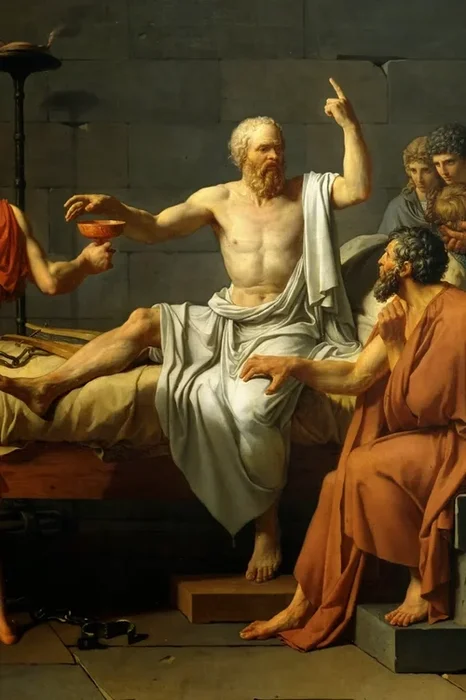

### Capcana clivajului stânga-dreapta

Mulți cred că cel mai izbitor clivaj din Occidentul de astăzi este între stânga politică și dreapta politică. Mass-media dedică o mare parte din acoperirea sa acestei confruntări, prezentată ca decisivă pentru viitorul civilizației. Pentru a identifica înclinațiile politice ale unui individ, îl plasăm pe o simplă linie orizontală: extrema stângă, stânga, centru, dreapta, extrema dreaptă.

Acest clivaj datează din 1789. În timpul Revoluției Franceze, în dezbaterile din august și septembrie 1789, deputații care favorizau menținerea puterii regelui s-au așezat la dreapta președintelui Adunării, în timp ce cei care voiau să-i limiteze puterile s-au așezat la stânga. Problema este că **această categorizare a devenit în mare parte inoperantă în epoca noastră**.

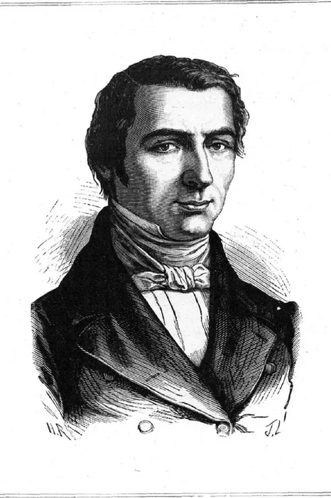

Tradițional, stânga este văzută ca reformistă, iar dreapta ca conservatoare. Dar acest lucru a devenit discutabil, deoarece stânga social-democrată luptă acum pentru a păstra avantajele dobândite, ceea ce o face, din acest punct de vedere, conservatoare. Majoritatea indivizilor care se află între cele două extreme sunt numiți centriști, dar și această etichetă le simplifică poziția.

Ai simțit vreodată că stânga sau dreapta, socialist sau conservator, nu îți descrie corect opiniile? Poziția unei persoane pe spectrul politic nu este statică și depinde adesea de problema discutată. Dacă cineva este pentru libertate economică, dar și pentru dreptul de a imigra, unde l-ai plasa pe o simplă linie stânga-dreapta?

Problema fundamentală a acestei axe este că **nu lasă loc gândirii liberale clasice**, care nu poate fi amestecată nici cu egalitarismul stângii, nici cu naționalismul dreptei. Unde plasăm figuri precum Thomas Jefferson, Alexis de Tocqueville, Frédéric Bastiat, Ron Paul sau Javier Milei? Liberalii clasici și libertarienii sunt uneori echivalați în mod fals cu dreapta, sau chiar cu extrema dreaptă. Dar, de cele mai multe ori, ei pur și simplu nu există în acest cadru de referință.

### Cazul lui Frédéric Bastiat

Frédéric Bastiat (1801-1850), figura emblematică a școlii liberale franceze, a fost deputat în Adunarea Națională. Avea o abordare cu totul singulară: spunea că vota uneori cu stânga, alteori cu dreapta, în funcție de proiectul de lege discutat.

Acest lucru nu indica oportunism centrist. Bastiat nu putea sta alături de regaliștii de dreapta, pentru că era el însuși republican; nici nu voia să stea alături de socialiștii de stânga. Voturile sale erau ghidate de un principiu fundamental: **promovarea libertăților individuale și economice și reducerea ingerinței guvernamentale**. Era convins că ordinea socială și prosperitatea pot apărea prin inițiativă privată și responsabilitate individuală, cu un minimum de legi.

Pentru Bastiat, adevărata linie de demarcație nu era între stânga și dreapta, ci între cei care credeau în puterea coercitivă a statului și cei care aveau încredere în libertate și asociere voluntară. El vota cu stânga atunci când propunerile ei urmăreau abolirea privilegiilor, garantarea libertăților civile sau opoziția față de război; și cu dreapta atunci când propunerile ei protejau proprietatea privată sau reduceau taxele.

### Cazul Bitcoin

Bitcoin este un exemplu actual fascinant de inovație care transcende clivajul tradițional. Este incontestabil **un proiect politic care rupe cu politica monetară actuală**, dar este imposibil de plasat pe o simplă axă liniară care merge de la extrema stângă la extrema dreaptă.

Găsim susținători ai Bitcoin pe întregul spectru politic:

- Pentru dreapta liberală, Bitcoin reprezintă un instrument de protecție împotriva ingerinței statului, garantând proprietatea privată și libertatea monetară.
- Pentru unii de stânga, Bitcoin reprezintă o critică a sistemului bancar tradițional și un mijloc de democratizare a finanțelor în afara instituțiilor consacrate.
- Independent de orice ideologie politică, mulți tehnofili și investitori sunt atrași de natura sa descentralizată și de potențialul său disruptiv.

În realitate, dihotomia tradițională dintre stânga și dreapta este inadecvată și nepotrivită pentru a situa corect Bitcoin. O simplă axă liniară nu funcționează bine, deoarece ideologii precum fascismul și comunismul împărtășesc caracteristici totalitare care nu sunt vizibile pe o asemenea axă.

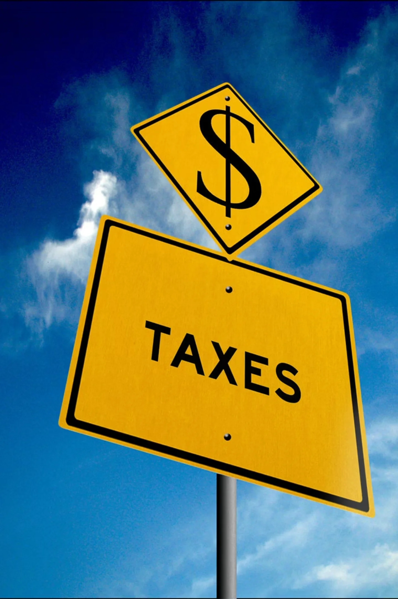

### O diviziune falsă

Deși stânga și dreapta par complet opuse, **ele împărtășesc o serie de puncte comune fundamentale**. Ambele tabere critică în mod regulat piața liberă: ca sursă de inegalitate (stânga) sau ca amenințare la adresa suveranității (dreapta). Ambele împărtășesc o preferință pentru intervenția statului, fie prin „statul strategic”, fie prin „statul emancipator”. În ciuda diferențelor aparente, toate partidele politice, fie de stânga, de dreapta sau de centru, apără dreptul statului de a guverna viețile oamenilor și de a interveni în toate domeniile prin reglementări și taxe.

Tocmai de aceea opoziția stânga-dreapta este, în cele din urmă, o iluzie. Pentru a ilustra acest punct, ia în considerare următoarele întrebări:

**Probleme sociale**

- Ar trebui guvernul să dețină sau să controleze ziare, radio sau televiziune?
- Ar trebui guvernul să reglementeze activitatea sexuală între adulți consimțitori, inclusiv prostituția?
- Ar trebui droguri precum marijuana, cocaina și heroina să fie legalizate?
- Ar trebui să fie legal ca oamenii să călătorească sau să intre și să iasă dintr-o țară fără limitări?
- Ar trebui guvernul să trimită trupe pentru a interveni în treburile altor țări?
- Ar trebui copiii să fie obligați prin lege să meargă la școală?
- Ar trebui părinților să li se permită să-și educe copiii acasă?
- Ar trebui deținerea armelor de foc să fie restricționată prin lege?
- Care ar trebui să fie politica de mediu a guvernului?
- Avem nevoie de o instituție publică pentru a se asigura că medicamentele sunt sigure și eficiente?

**Probleme economice**

- Ar trebui guvernul să subvenționeze fermierii și să reglementeze ce cultivă?
- Ar trebui guvernul să impună tarife, cote, embargouri sau alte restricții asupra comerțului internațional?
- Ar trebui guvernul să introducă un salariu minim obligatoriu?
- Este impozitarea singura modalitate de a plăti serviciile publice necesare?
- Ar trebui guvernul să ajute companiile aflate în dificultate economică prin împrumuturi cu dobândă redusă sau subvenții?
- Care este cel mai bun mod de a gestiona deficitele bugetare masive de astăzi?
- Cum putem rezolva problema deficitului sistemului de securitate socială?
- Ar trebui guvernul să trimită ajutor financiar altor țări?
- Ce ar trebui să facă guvernul în privința creșterii costurilor din sănătate?
- Care ar trebui să fie politica guvernului privind energia nucleară?

În toate aceste întrebări apare o problemă centrală: **ce grad de control guvernamental ești dispus să tolerezi?** Și ești mai mult sau mai puțin forțat să participi la finanțarea acelui control? Întrebarea politică fundamentală este: cine ar trebui să decidă? Iei tu deciziile importante despre viața ta personală și socială, sau le ia altcineva pentru tine?

### Guvernanți și guvernați

Această polarizare partizană maschează un clivaj mult mai profund și mai vechi: **cel care i-a separat timp de secole pe cei care guvernează de cei care sunt guvernați**. De o parte, oamenii, care suportă inflația, presiunea fiscală și supravegherea financiară; de cealaltă parte, elita tehnocratică și politică, care cheltuie bani ai altora și foarte des prin tiparniță, adică prin monedă fiat, presupus pentru binele poporului.

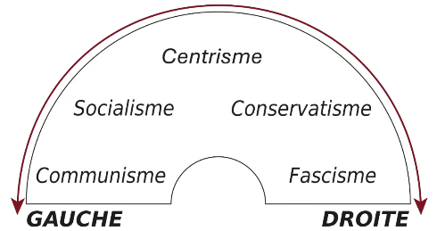

Sistemul banilor fiat îi avantajează pe cei mai bogați indivizi și pe cele mai puternice entități financiare, mai ales guvernele, care sunt cei mai mari debitori. Împrumutând, ele împing băncile să tipărească bani noi. Inflația rezultată devalorizează insidios banii, distrugând economiile oamenilor. Moneda fiat este piatra de temelie a acestei extinderi a puterii statului: le permite guvernelor să finanțeze cheltuieli nelimitate, eliminând constrângerile bugetare care existau sub standardul aur.

După cum observa Frédéric Bastiat în secolul al XIX-lea:

> „În toate revoluțiile au existat întotdeauna doar două partide opuse: cel al oamenilor care vor să trăiască din propria muncă și cel al celor care ar vrea să trăiască din munca altora.”

Cu alte cuvinte: cei care produc bogăție și cei care o confiscă pentru a o redistribui susținătorilor lor.

### Controlori și non-controlori

Pentru a încheia această introducere, să ne întoarcem la un roman science-fiction din anii 1960. În *The Moon is a Harsh Mistress* (1966), Robert Heinlein a sintetizat strălucit ceea ce constituie adevărata linie de fractură politică:

> „Rasa umană se împarte politic între cei care vor ca oamenii să fie controlați și cei care nu au o asemenea dorință.”

„Controlorii” îi includ pe toți cei care, indiferent de ideologia declarată, de la extrema stângă la extrema dreaptă, cred că statul sau o entitate superioară trebuie să reglementeze, să dirijeze și să impună comportamente pentru binele societății. Ei favorizează soluții de sus în jos, planificarea și constrângerea.

„Non-controlorii”, dimpotrivă, sunt cei care nu doresc să exercite putere asupra altora și care pledează pentru libertate individuală maximă. Ei prețuiesc responsabilitatea personală, asocierea voluntară și spontaneitatea ordinii sociale, minimizând ingerința guvernamentală. Aici găsim figuri precum Frédéric Bastiat sau principiile descentralizării întruchipate de Bitcoin.

În acest curs, vom vedea că **peisajul politic este mult mai bogat și mai complex decât stânga și dreapta**, datorită unui model vizual care ne va ajuta să înțelegem mai bine diferitele familii politice și locul în care se situează fiecare dintre noi.

# Către un nou clivaj: libertate-constrângere

<partId>fb5cb390-67ad-41f3-903d-c208b84e6a0c</partId>

## Diagrama Nolan

<chapterId>7b3aa120-6eee-45a1-9e46-856e26403e08</chapterId>

### De la o dimensiune la două

În loc să împărțim doctrinele politice de-a lungul unei axe dreapta/stânga, are mult mai mult sens să privim lucrurile prin prisma libertății. Reprezentarea clasică a spectrului politic este o linie orizontală care merge de la stânga la dreapta.

Acest model simplifică excesiv complexitatea ideologiilor politice și, mai ales, omite un criteriu esențial: **gradul de intervenție a statului**. După cum am discutat în introducere, întrebarea fundamentală este: cine decide? Ești tu sau este altcineva?

Acest lucru ne conduce să respingem modelul unidimensional în favoarea unuia bidimensional. David Nolan, fondator al Libertarian Party în 1971 și fost student la MIT (Massachusetts Institute of Technology), a conceput o diagramă care reprezintă mult mai bine complexitatea spectrului politic. Diagrama sa folosește două axe:

1. O axă verticală care măsoară **libertățile personale**
2. O axă orizontală care măsoară **libertățile economice**

Cu cât ești mai aproape de punctul zero (stânga jos), cu atât poziția ta ideologică favorizează mai mult intervenția statului. Invers, cu cât te deplasezi mai mult către colțul opus (dreapta sus), cu atât favorizezi mai mult intervenția minimă a statului și libertățile individuale maxime. Din această perspectivă, stânga și dreapta tradiționale sunt relativizate: stânga tinde să favorizeze libertățile personale în detrimentul libertăților economice, în timp ce dreapta clasică favorizează libertatea economică în detrimentul libertăților personale.

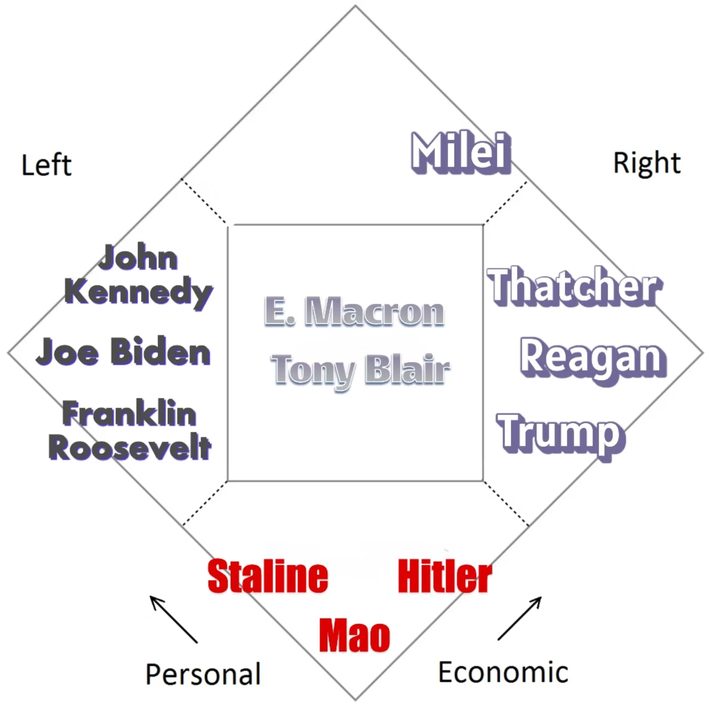

### Cele cinci cadrane

Când diagrama este prezentată în formă de diamant, putem identifica cinci cadrane care situează precis diferitele filosofii politice:

- **Statism** (jos): Poziția cea mai autoritară, chiar totalitară. Cei care susțin foarte puțină libertate economică sau personală.
- **Socialism** (stânga): Cei care susțin mai puțină libertate economică, dar o libertate personală mai mare.
- **Conservatorism** (dreapta): Cei care susțin o libertate economică mai mare, dar o libertate personală mai mică.
- **Libertarianism** (sus): Opusul statismului. Cei care susțin cea mai mare libertate economică și personală.
- **Centrism** (mijloc): O zonă pragmatică pentru cei care favorizează un amestec de libertate și reglementare, implicând sacrificarea anumitor drepturi individuale.

**Axa fundamentală este așadar cea verticală**: între cei care apără libertățile individuale maxime (sus) și cei care favorizează controlul și intervenția maxime ale statului în viețile oamenilor (jos).

### Nuanțe în interiorul fiecărei familii

Lucrurile nu sunt simple și este întotdeauna dificil să aperi o poziție politică complet monolitică. În interiorul fiecărei familii politice există tensiuni și divergențe:

- Printre **socialiști**, majoritatea sunt democrați atașați de alegeri, libertăți civile și un anumit grad de economie de piață. Dar unii resping democrația și pledează pentru revoluție, abolirea completă a capitalismului și planificare economică centrală.
- Printre **conservatori**, unii se opun puternic taxelor și programelor sociale, plasându-se mai aproape de vârful libertarian. Alții au tendințe mai autoritare și favorizează reglementarea economică; ne putem gândi aici la controversa din jurul lui Donald Trump.
- Printre **libertarieni**, unii vor să abolească statul complet și să îl înlocuiască prin servicii private (anarho-capitaliști), în timp ce alții preferă un stat minimal care își păstrează funcțiile suverane de bază („minarhiștii”).

- **Verzii** se situează probabil foarte jos în diagramă. Ei consideră că **interesul individual nu trebuie să prevaleze asupra interesului colectiv al planetei**. Într-un sens, Verzii au înlocuit lupta de clasă marxistă cu o luptă între om și natură și tind să apere controlul economic și chiar abolirea proprietății private în numele bunăstării planetare.

## Cele două dimensiuni fundamentale

<chapterId>e41d903d-26c9-425e-8a92-6aec48838b61</chapterId>

Diagrama reprezintă libertățile economice (niveluri de impozitare, piață liberă, servicii private) pe axa orizontală și libertățile personale (libertate de circulație, opinie, autodeterminare) pe axa verticală. Această schemă se bazează pe ideea că majoritatea problemelor politice pot fi împărțite în două categorii largi: economice și personale (sau societale).

### Libertăți economice

**Categoria libertății economice include ceea ce faci ca producător și consumator**: ce poți cumpăra, vinde sau produce; unde lucrezi; pe cine angajezi; și ce faci cu banii tăi.

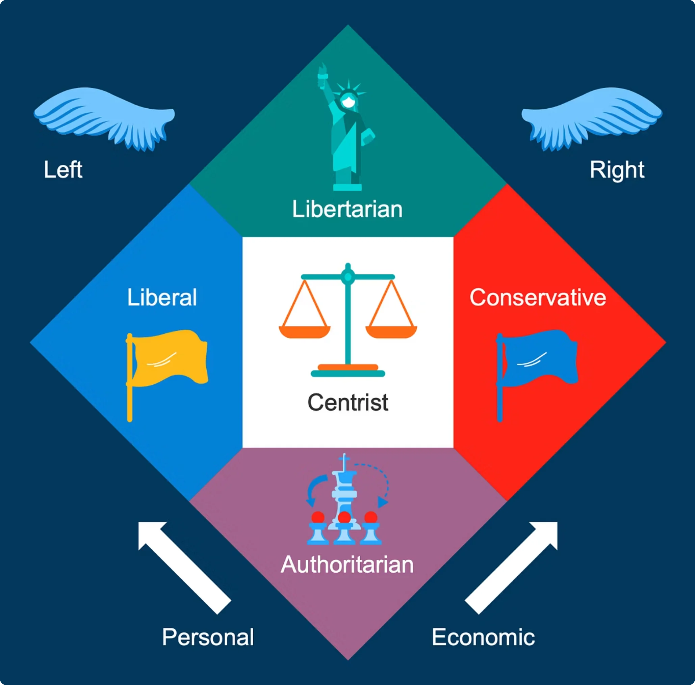

*Exemple de activitate economică:* deschiderea unei afaceri, cumpărarea unei case, construirea unei clădiri, investirea economiilor, angajarea sau concedierea angajaților.

- **La dreapta axei** (către libertate economică maximă): preferință pentru mai puțină intervenție a statului în economie, mai puține reglementări, taxe mai mici și o libertate mai mare pentru companii și indivizi de a produce, tranzacționa și consuma. Accentul este pus pe piața liberă, proprietatea privată și concurență ca motoare ale prosperității.
  - *Figuri emblematice:* Margaret Thatcher (UK), Ronald Reagan (USA), Javier Milei (Argentina).

- **La stânga axei** (către control maxim al economiei de către stat): preferință pentru reglementare, taxe ridicate pentru finanțarea serviciilor publice (sănătate, educație, transport), naționalizare și redistribuirea bogăției. Scopul este adesea reducerea inegalităților și garantarea unui anumit grad de dreptate socială.
  - *Figuri emblematice:* Franklin D. Roosevelt (USA), Jean Jaurès (France), Bernie Sanders, Barack Obama.

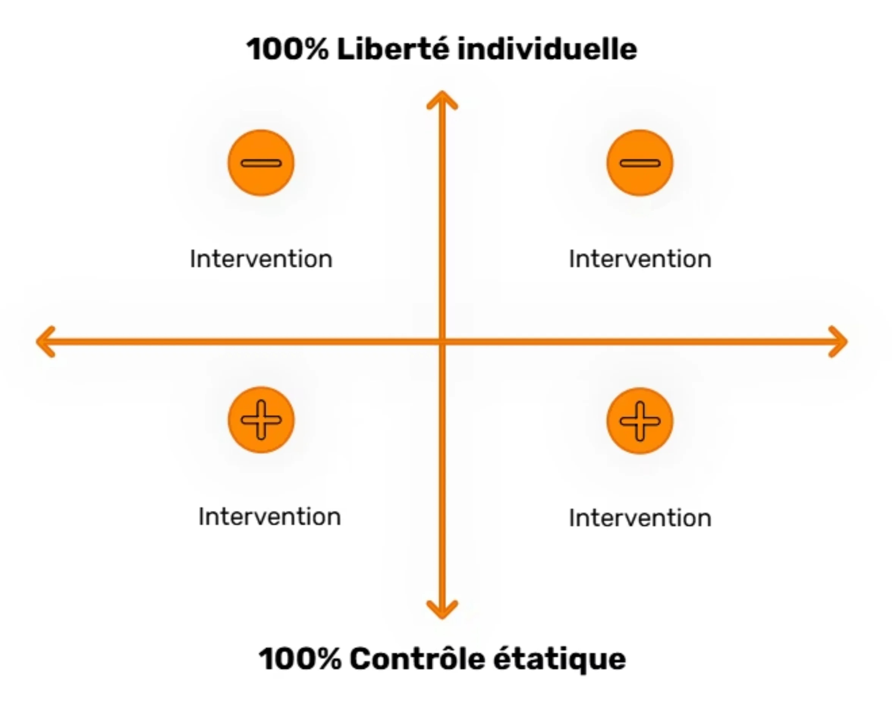

### Libertăți personale și sociale

**Categoria libertății personale include ceea ce faci în relațiile tale private**, cu opiniile și credințele tale. În general, este tot ceea ce faci cu propriul corp și propria minte.

*Exemple de activități personale:* căsătoria, alegerea cărților pe care le citești și a filmelor pe care le urmărești, alimentele, medicamentele și drogurile pe care alegi să le consumi, alegerile tale religioase, organizațiile la care aderi, oamenii cu care alegi să te asociezi.

- **Partea de sus a axei** (către libertate personală maximă): preferință pentru libertate individuală și toleranță. Statul ar trebui să interfereze cât mai puțin posibil în alegerile de viață ale indivizilor (libertate de exprimare, legalizarea anumitor substanțe, libertate de circulație etc.). Prețuim autonomia și diversitatea.
  - *Figuri emblematice:* Nelson Mandela, Simone Veil, Noam Chomsky.

- **Partea de jos a axei** (către control maxim al vieții personale de către stat): preferință pentru ordine, securitate și valori tradiționale. Statul are un rol în reglementarea moravurilor, menținerea ordinii publice și uneori apărarea unei anumite viziuni morale sau tradiționale. Acestea includ poziții favorabile pedepsei cu moartea, restricțiilor asupra imigrației sau promovării de către guvern a familiei tradiționale.
  - *Figuri emblematice:* Joseph de Maistre (filosof contrarevoluționar francez) și lideri autoritari contemporani precum Vladimir Putin și Xi Jinping.

## Ești statist de dreapta sau de stânga?

<chapterId>06d903fc-9453-47d4-b0b1-38b6b82ccf99</chapterId>

### Statismul ca teren comun

Contrar aparențelor, stânga și dreapta nu sunt atât de opuse pe cât par. Ele împărtășesc foarte des o dorință comună de control: ceea ce putem numi statism. Desigur, motivațiile, valorile și prioritățile lor diferă.

Stânga este mai puțin preocupată de exigențele morale tradiționale, dar acordă prioritate dreptății sociale și egalității, în special la nivel economic. Aceasta este sursa ostilității sale față de libertatea economică, capitalism și piața liberă: **stânga vrea să legifereze și să reglementeze economia**.

Dreapta, la rândul ei, acordă prioritate moralei personale și valorilor tradiționale. Ea consideră că civilizația a fost construită pe anumite instituții tradiționale și ierarhii sociale și că această moștenire trebuie păstrată. Este mai favorabilă libertății economice deoarece apără moralitatea proprietății private și responsabilitatea individuală, dar **vrea să legifereze asupra moralei și religiei**.

### Axa verticală dezvăluie adevărul

Ideea centrală a diagramei Nolan este că diferența majoră dintre filosofiile politice este gradul de control guvernamental asupra acțiunii umane, fie în sfera personală, fie în cea economică. Cu alte cuvinte, nu există doar o axă stânga-dreapta care reflectă sensibilitățile tale personale, ci și o axă sus-jos care reflectă disponibilitatea ta de a folosi forța pentru a-i constrânge pe alții să-ți urmeze valorile.

Din această perspectivă, stânga și dreapta împărtășesc același obiectiv politic: să câștige puterea pentru a organiza societatea după viziunea lor asupra lumii și a o impune tuturor. Aceasta este însăși definiția statismului: folosirea legislației pentru a controla și modela societatea. Pentru unii, este în numele apărării civilizației; pentru alții, este în numele apărării clasei muncitoare, naturii sau oprimaților. Iar centriștii aprobă și ei acest lucru, atunci când le convine.

De aceea putem spune că **unii sunt statiști de dreapta, în timp ce alții sunt statiști de stânga**. Adevărata întrebare politică nu este deci atât dacă ești de stânga sau de dreapta, ci mai degrabă în ce măsură vrei ca statul să intervină în modelarea societății după valorile tale. Dorești să-ți impui propriile sensibilități altora sau preferi ca **fiecare persoană să fie liberă să decidă pentru sine**?

## Ești conservator cultural sau conservator politic?

<chapterId>bef3d6f1-390a-472d-8f18-a559d38aea54</chapterId>

### Două conservatorisme distincte

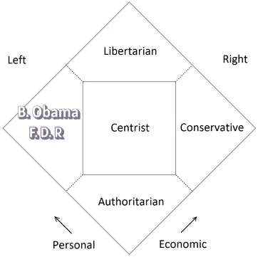

Termenul „conservatorism” poate genera confuzie. Trebuie neapărat să **distingem între conservatorismul cultural, care aparține domeniului valorilor**, și conservatorismul politic, care este o filosofie politică bazată pe impunerea acelor valori asupra întregii societăți.

**Conservatorismul politic** este o ideologie, reprezentată adesea în partide politice de dreapta sau de extremă dreapta. Ea urmărește păstrarea instituțiilor politice consacrate și a ordinii sociale, opunându-se oricărei răsturnări structurale majore. Susținătorii ei vor să folosească puterea și legea pentru a-și proteja moștenirea. În Franța, această tradiție își are originea în gânditori contrarevoluționari precum Joseph de Maistre și Louis de Bonald și, mai recent, în Raymond Aron în secolul al XX-lea.

**Conservatorismul cultural**, pe de altă parte, este o înțelepciune de viață: aderarea personală la valori familiale, morale, estetice și metafizice moștenite din trecut, fie greco-romane, fie iudeo-creștine. Nu este o filosofie politică. Conservatorul cultural crede că omul, pentru a fi fericit, are nevoie de înălțarea sufletului, de valori spirituale și de o anumită noblețe a sentimentului. Aceste valori nu sunt impuse altora; ele sunt trăite ca o alegere personală și uneori familială.

### Poți fi conservator cultural și libertarian

Aceste două ramuri, deși distincte, sunt uneori confundate deoarece pot fi adoptate simultan sau separat. **Poți fi conservator cultural fără să fii conservator politic.** Un individ poate apăra tradiții culturale (familie, religie, obiceiuri locale) în viața sa personală sau comunitară, în timp ce pledează pentru un guvern limitat care nu impune aceste valori prin lege. O astfel de persoană încurajează normele conservatoare prin persuasiune, educație și exemplu, respectând în același timp dreptul altora de a trăi diferit.

Libertarianul conservator cultural poate dezaproba moral anumite comportamente, dar **nu pledează pentru interzicerea legală a acțiunilor consensuale, neagresive**. Poate să nu îi placă asemenea acțiuni, să li se opună și să le descurajeze activ, dar întotdeauna fără a recurge la forța coercitivă a legii.

Această sinteză între libertarianism și conservatorism cultural a primit numele de „paleo-libertarianism” în Statele Unite. Acest curent se distinge de neo-libertarianism (o ramură mai simpatetică față de egalitarism și evoluțiile sociale ale anilor 1970) prin combinarea **respingerii statului ca sursă instituțională a constrângerii** cu consolidarea instituțiilor tradiționale și o preferință pentru structurile sociale voluntare în locul autorității statului. Cu alte cuvinte, paleo-libertarianul nu se opune existenței unor comunități socialiste sau comunitariene; ceea ce refuză este ca asemenea comunități să-și impună valorile tuturor prin forța legii. Două figuri majore întruchipează această abordare:

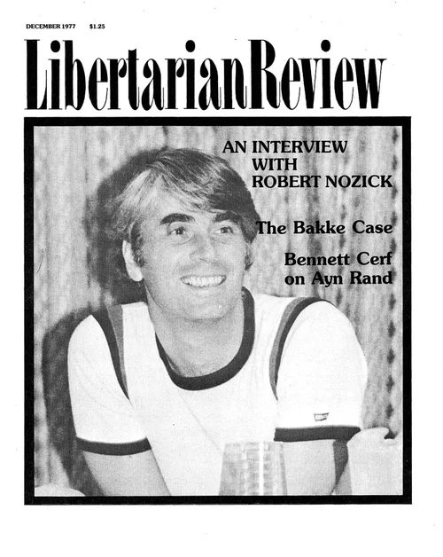

- **Murray Rothbard**, economist și filosof care a dezvoltat teoria libertariană recunoscând în același timp importanța valorilor tradiționale, fără a pleda vreodată pentru impunerea lor de către stat.
- **Ron Paul**, congresman din Texas timp de decenii, care a candidat pentru nominalizarea prezidențială republicană. Conservator personal în valorile sale, el a apărat constant o viziune a guvernului limitat care respectă libertățile individuale. De exemplu, Ron Paul a sfătuit întotdeauna împotriva consumului de droguri, dar s-a opus simultan interzicerii drogurilor. Era personal opus avortului, dar a susținut constant că alegerea ar trebui lăsată statelor federale, nu impusă de sus.

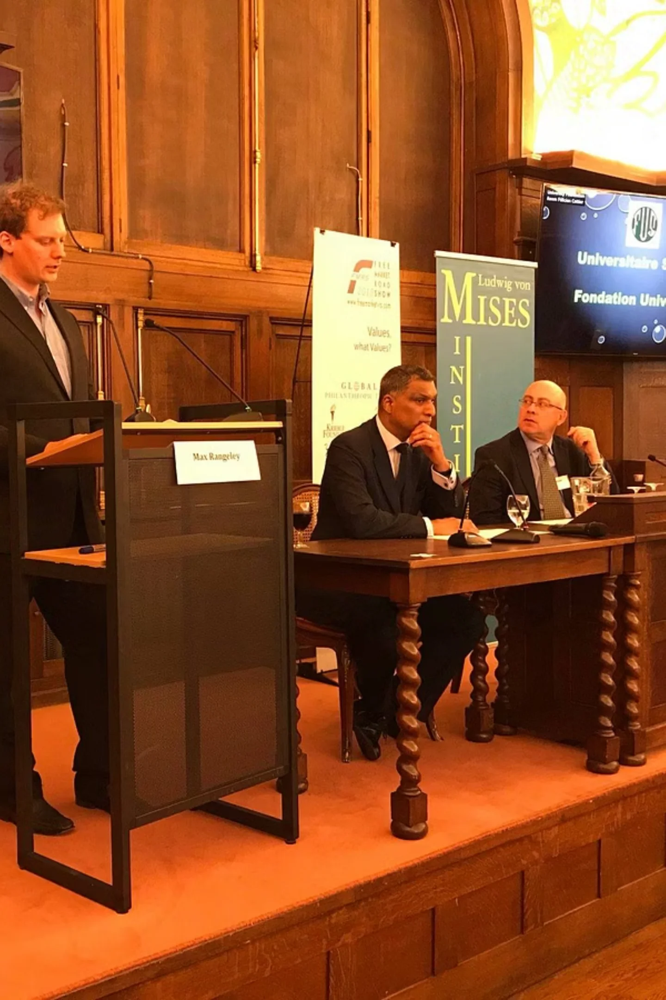

## Ești liberal sau libertarian?

<chapterId>d382c40b-78ce-416f-9f63-6ad43768406b</chapterId>

### O confuzie transatlantică

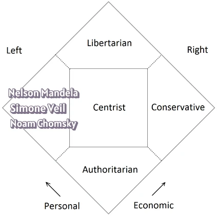

Termenii folosiți pentru a desemna familiile politice nu sunt imuabili. Ei pot varia în funcție de contextul geografic și istoric, creând o sursă majoră de confuzie. Când se pune întrebarea „ești liberal sau libertarian?”, un european ar putea răspunde că este același lucru. Dar în uzul anglo-saxon, acestea sunt concepte radical diferite.

În Europa, termenul *liberalism* a rămas relativ stabil în timp: este asociat cu politici economice laissez-faire, intervenție redusă a statului și apărarea libertăților individuale. O poziție clasificată în general la dreapta.

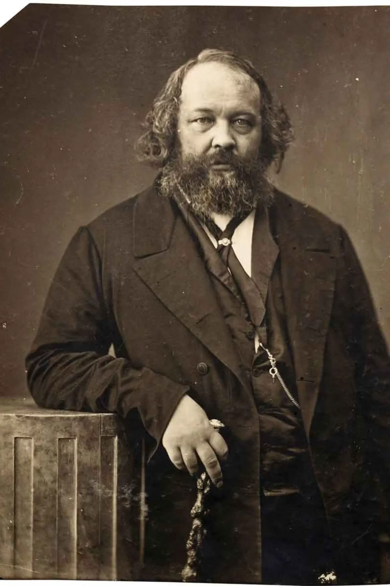

În Statele Unite, același cuvânt a suferit o schimbare dramatică de sens. **Liberalii americani au devenit susținători ai intervenției statului și ai *Big Government***. Această evoluție poate fi urmărită prin momente-cheie:

- În anii 1930, *New Deal*-ul lui Franklin D. Roosevelt a marcat o primă mare cotitură intervenționistă ca răspuns la Marea Depresiune: lucrări publice, angajare publică, subvenții. Sensul lui *liberalism* a început să alunece către o paradigmă statistă.
- În anii 1960, *Great Society* a lui Lyndon B. Johnson a extins acest lucru la programe sociale și intervenție federală.
- Astăzi, *liberalii* americani sunt în mare parte democrați care apără asigurarea publică de sănătate și planurile anti-sărăcie. Cineva precum Bernie Sanders, care se descrie drept socialist sau social-democrat, revendică eticheta liberală, dar pentru el ea este sinonimă cu intervenția statului pentru emanciparea indivizilor.

Suntem foarte departe de sensul european al termenului.

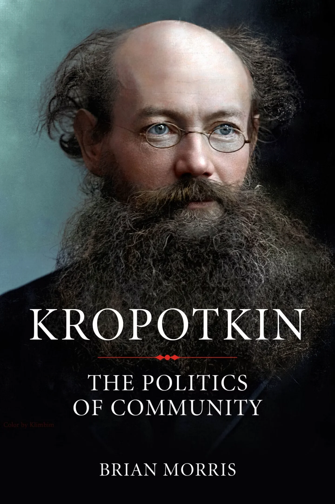

### Apariția libertarianismului

Confruntați cu această derivă lingvistică, susținătorii liberalismului clasic din Statele Unite au început să se numească *libertarians* începând cu anii 1960, tocmai pentru a se distinge de *liberalii* americani. Ei sunt moștenitorii liberalismului clasic european din secolul al XIX-lea.

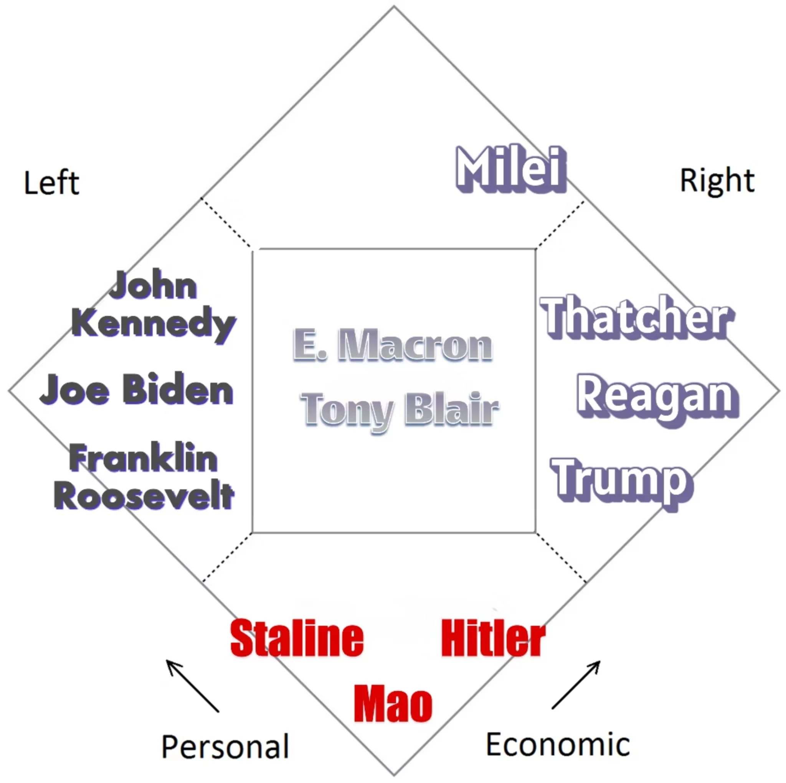

O axă fundamentală a libertarianismului este conceptul de **ordine spontană, datorat în special lui Friedrich Hayek** și școlii austriece de economie. Potrivit lui Hayek, regulile și normele care guvernează societatea nu ar trebui impuse de sus prin planificare autoritară, ci ar trebui să apară din jocul liber al voințelor individuale, al contractelor și al relațiilor liber consimțite între adulți.

### Figuri intelectuale-cheie

Mai mulți gânditori au modelat mișcarea libertariană:

- **Murray Rothbard**, pe care l-am menționat deja în legătură cu conservatorismul cultural, este și teoreticianul anarho-capitalismului. În cartea sa din 1973 *For a New Liberty*, el a pledat pentru **abolirea statului și privatizarea completă a activităților sociale**, opunându-se atât intervenționismului economic, cât și celui militar.
- **Robert Nozick**, profesor de filosofie politică la Harvard, a răspuns lucrării lui John Rawls *A Theory of Justice* cu *Anarchy, State, and Utopia* (1974). Nozick a apărat un stat minimal în tradiția lockeană, iar stilul său analitic riguros a contribuit mult la legitimarea gândirii libertariene în cercurile academice.

### Structură instituțională

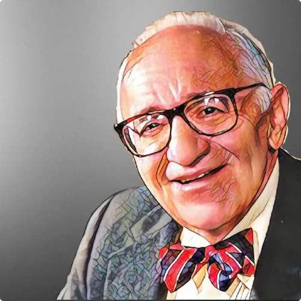

**Mișcarea libertariană s-a organizat progresiv**:

- **Cato Institute** (1977), un think tank cu sediul la Washington, lucrează la propuneri de politici publice.
- **Mises Institute** (1982), din Auburn, Alabama, se concentrează pe educație mai degrabă decât pe lobby politic, funcționând ca un fel de universitate online cu conferințe și lucrări republicate.
- **Libertarian Party** (1971), deși obține în medie aproximativ 2% la alegeri, constituie al treilea cel mai mare partid politic american. Acei 2% pot decide o alegere, oferind partidului o influență mult peste scorul său electoral.

### Libertarieni și conservatori: o alianță complexă

Libertarienii se opun radical *liberalilor* americani în sensul modern al termenului. În această privință, ei împărtășesc anumite puncte comune cu conservatorii: atașamentul față de guvernul limitat al Părinților Fondatori, respingerea egalitarismului forțat, opoziția față de datoria publică și apărarea drepturilor statelor împotriva puterii federale. Ron Paul întruchipează cel mai clar această convergență, deși a rămas o voce minoritară în cadrul Partidului Republican.

Totuși, divergențe fundamentale persistă. Libertarienii resping intervenționismul militar al neoconservatorilor (ne gândim la George W. Bush și războiul din Irak), se opun politicilor sociale conservatoare și subvențiilor (fie pentru afaceri, fie pentru familii în numele compasiunii), condamnă interzicerea drogurilor ca nu doar ineficientă, ci imorală, și resping protecționismul. În acest ultim punct, de exemplu, **politicile tarifare ale lui Trump au atras critici aspre din partea libertarienilor**, care le-au văzut ca pe o trădare a principiilor comerțului liber. Alianța dintre conservatori și libertarieni este, așadar, reală, dar inerent tensionată, unită de o critică comună a *liberalismului* american, dar divizată asupra întinderii corecte a puterii statului.

## Ești libertarian sau libertar/anarhist (în franceză libertaire)?

<chapterId>fc761194-249f-4009-a20f-1f98b7226cf2</chapterId>

### O incompatibilitate fundamentală

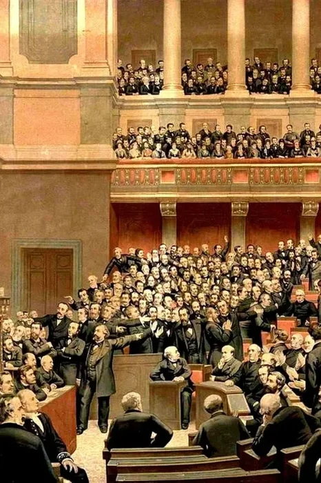

Cele două nu sunt compatibile. Există o sursă majoră de confuzie între acești termeni, mai ales în traducerile automate, unde anglo-saxonul *libertarian* este adesea redat ca *libertaire*. Totuși **aceste filosofii politice, în ciuda unor asemănări superficiale, prezintă diferențe fundamentale**.

### Anarhismul socialist (*libertarii*)

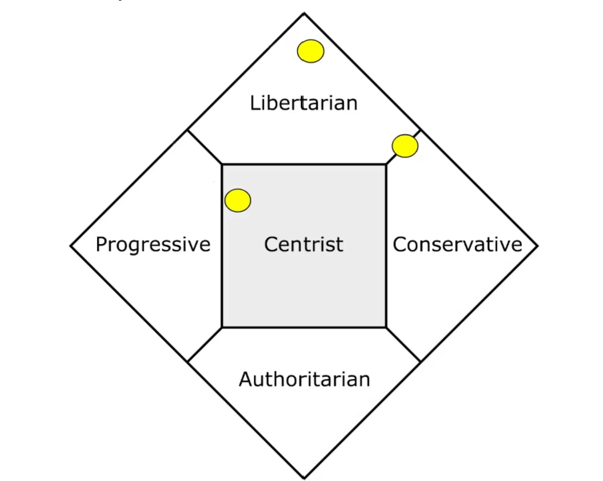

*Libertarii* francezi sunt moștenitorii anarhismului socialist, o ramură a socialismului legată istoric de gânditori precum Pierre-Joseph Proudhon și Mikhail Bakunin. Principiile lor fundamentale sunt:

- Statul trebuie abolit, deoarece este o structură opresivă.
- Proprietatea privată și capitalismul trebuie de asemenea abolite, pentru că în doctrina anarhistă statul este protectorul proprietății private și al bogaților. De aici formula celebră a lui Proudhon: „Proprietatea este furt.” (Trebuie remarcat că Proudhon însuși a evoluat pe acest punct: Proudhon cel timpuriu era feroce anti-capitalist, dar **Proudhon cel târziu s-a apropiat de liberalismul clasic** și a ajuns să vadă proprietatea privată ca pe o garanție a libertății.)
- Ei favorizează o revenire la economia de troc și la o societate egalitară în care bunurile aparțin tuturor.

Anarhiști precum Bakunin și Kropotkin (care era un anarho-comunist strict, respingând chiar și salariile ca o întoarcere la capitalism) vedeau proprietatea privată și statul ca surse gemene de opresiune. Ei pledau pentru comune autogestionate, cooperative și mișcări anti-ierarhice. Viziunea lor economică se bazează pe teoria valorii-muncă; condamnă sistemul salarial, resping profitul și ratele dobânzii și doresc **dispariția radicală a banilor și băncilor**.

### Libertarianismul: proprietatea ca fundament al libertății

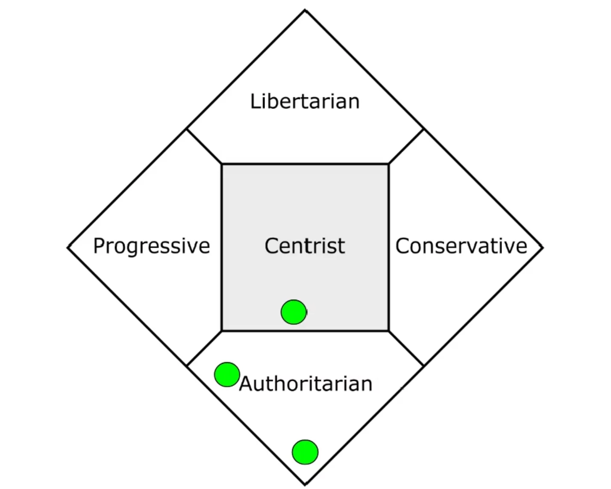

Libertarienii diverg complet de *libertari* prin faptul că apără proprietatea privată ca fundament însuși al libertății. Pentru ei, proprietatea privată nu este o simplă convenție socială protejată de stat: **este un drept natural care precedă legea și statul**. Dacă un individ își deține propriul corp, el își deține și munca și roadele muncii sale. Proprietatea asupra bunurilor materiale este înțeleasă ca o extensie a proprietății de sine.

De aici rezultă că impozitarea este înțeleasă ca agresiune asemănătoare furtului, deoarece forțează un individ să cedeze o parte din proprietatea sa pentru servicii pe care nu le-a ales neapărat. Consimțământul voluntar constituie temelia morală a libertarianismului.

În privința violenței, doctrina libertariană respinge toate formele de violență agresivă. Totuși, admite ca legitimă violența defensivă: autoapărarea și rezistența la opresiune.

### Strategii pentru abolirea statului

Aici se află o altă diferență fundamentală. *Libertarii* au pledat istoric pentru distrugerea statului și capitalismului prin violență, fie colectivă, fie individuală. Această abordare se bazează istoric pe teroare și atacuri țintite (sau nețintite), așa cum s-a văzut în Rusia și mai târziu în Spania în timpul războiului civil.

Pentru libertarieni, violența agresivă nu este legitimă. Strategia principală se bazează pe **delegitimarea statului prin formarea de credințe colective**: argumentare, dezbatere, discuție și educație. Libertarienii pledează pentru nesupunere civilă sau acțiuni care constau în ignorarea deliberată a statului.

### Anarho-capitalismul: rădăcini istorice

Anarho-capitalismul nu este o doctrină recentă. Rădăcinile sale se află în secolul al XIX-lea:

- **Gustave de Molinari**, economist belgian care a lucrat la Paris alături de Frédéric Bastiat, a scris în 1849 un articol intitulat „The Production of Security”, în care susținea că niciun guvern nu ar trebui să aibă dreptul de a împiedica un altul să concureze cu el sau să ceară consumatorilor de securitate să vină exclusiv la el pentru acest produs.
- **Lysander Spooner** și **Benjamin Tucker** în Statele Unite au fost anarhiști individualiști care au susținut cu fermitate că piața liberă era capabilă să preia funcțiile suverane ale statului, în special securitatea și justiția.

În secolul al XX-lea, Murray Rothbard a preluat torța și a teoretizat anarho-capitalismul în mod cuprinzător, mai ales în *Man, Economy, and State* și *For a New Liberty*. Gândirea sa se bazează pe două principii: principiul non-agresiunii (este ilegitim să inițiezi forță fizică împotriva altui individ sau a proprietății sale, o traducere filosofică a regulii de aur: nu le face altora ceea ce nu ai vrea să-ți facă ei ție) și abolirea completă a statului, înțeles ca agresor principal.

Rothbard i-a criticat pe *libertari* pentru adoptarea unei viziuni naive și nerealiste asupra naturii umane, asemănătoare „bunului sălbatic” al lui Rousseau. Pentru Rothbard, oamenii nu sunt buni în mod natural, dar sunt ghidați de interesele lor. Societatea trebuie deci organizată astfel încât stimulentele bune să ghideze comportamentul, ceea ce cere ca proprietatea privată să fie recunoscută și garantată. **Abolirea statului nu înseamnă abolirea funcțiilor statului**: poliția și justiția nu trebuie eliminate, ci gestionate de piața liberă pe baza concurenței.

### O notă despre libertini

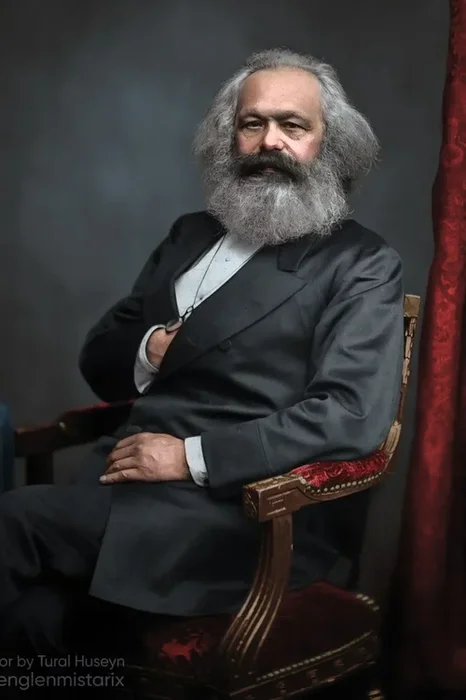

Nu trebuie confundați libertarienii cu *libertarii* sau cu libertinii. Libertinii sunt susținători ai libertății sexuale. Este mai puțin o filosofie politică decât un mod personal de viață, fondat pe o morală fără tabuuri opusă moralei burgheze. Politic, libertinii gravitează adesea spre anarhismul de stânga, adică spre *libertari*. Totuși, cineva poate fi și libertin, și libertarian, deoarece pentru libertarieni **fiecare persoană are dreptul să trăiască așa cum dorește fără să agreseze pe alții**. Invers, un libertin care ar căuta să-și impună moralitatea altora prin lege ar înceta, prin chiar acel act, să fie libertarian.

# Familiile politice sub microscop

<partId>2e1183f6-95d4-4d3c-9274-843993210624</partId>

## Definiții structurale și intenționale

<chapterId>ec5b13b7-4104-46a9-9c39-a810959a69ee</chapterId>

Intrăm acum în inima analizei noastre a familiilor politice. Totuși, înainte de a le examina pe fiecare în detaliu, trebuie să abordăm o întrebare fundamentală: cum ar trebui să definim un sistem politic? Să luăm socialismul ca exemplu. 

Ar trebui să-l definim prin intențiile sale declarate (dreptate, bunăstare, emancipare), sau ar trebui să-l definim mai degrabă prin structura sa fundamentală, și anume **dacă acordă primat individului sau statului**?

### Capcana definițiilor intenționale

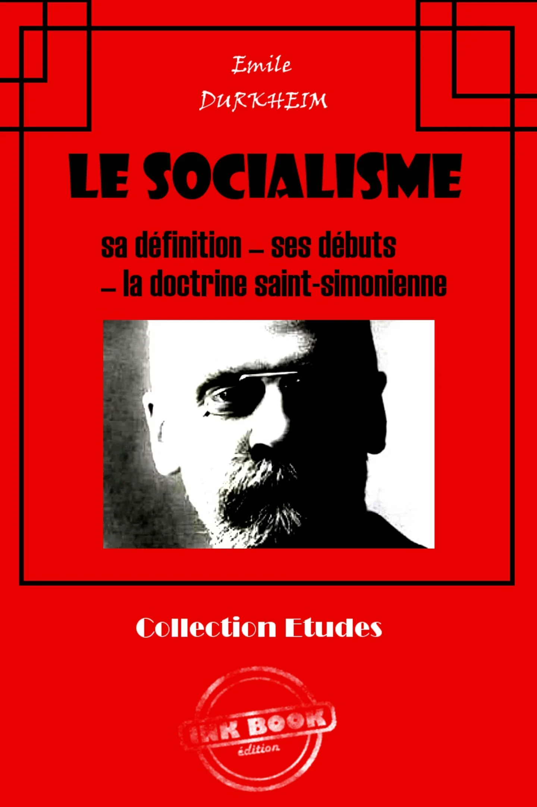

Milton Friedman a scris:

> Una dintre cele mai mari greșeli este să judeci politicile și programele după intențiile lor, nu după rezultatele lor. Cu toții știm un drum celebru pavat cu bune intenții. [...] Programele etichetate ca fiind pentru săraci sau pentru cei aflați în nevoie au aproape întotdeauna efecte exact opuse celor pe care sponsorii lor bine intenționați speră să le obțină.

Cu alte cuvinte, Friedman acordă prioritate la ceea ce am putea numi analiză empirică: concentrarea asupra consecințelor vizibile ale unui sistem, nu asupra promisiunilor și programelor politice. Aceasta rezonează cu ceea ce preda Frederic Bastiat când susținea că bunul economist este cel care vede efectele unei politici nu doar pe termen scurt, ci și pe termen lung, și nu doar asupra unui grup anume, ci asupra întregii populații.

Friedman ne avertizează împotriva pericolului de a ne baza exclusiv pe intenții. Politicile motivate de intenții generoase pot avea consecințe neprevăzute sau dăunătoare **atunci când neglijează o analiză riguroasă a stimulentelor și comportamentului uman**. De exemplu, programele de asistență socială finanțate de stat (adică de contribuabil) riscă să producă efecte perverse: nu creează niciun stimulent pentru muncă, generează dependență economică și constituie o formă de spoliere, deoarece banii trebuie mai întâi luați de la cei care au produs bogăția. Pentru Friedman, rezultatele măsurabile, precum creșterea economică, reducerea sărăciei sau eficiența, trebuie să aibă prioritate asupra intențiilor, deoarece acestea din urmă, oricât de nobile, nu garantează succesul.

### Abordarea structurală

**Definițiile structurale sau practice se concentrează pe felul în care sistemele politice funcționează efectiv** și pe caracteristicile lor observabile. Socialismul, de exemplu, este caracterizat de omniprezența statului, care reglementează, planifică și controlează. Acesta este un fapt și contează mult mai mult decât intențiile declarate de fraternitate sau solidaritate. Libertarianismul, pe de altă parte, este definit prin intervenție minimală a statului în economie și în viața privată, tindând către primatul libertății individuale și al pieței libere.

În contrast, **definițiile intenționale se bazează pe motivațiile, scopurile sau intențiile declarate** ale indivizilor sau grupurilor. Socialismul se prezintă ca urmărind „dreptatea socială” și solidaritatea. Dar dacă ne bazăm pe intenții, lucrurile devin neclare, deoarece toată lumea pretinde că favorizează dreptatea; toată lumea invocă suveranitatea poporului. Totuși, „poporul” rămâne un termen extrem de abstract și aici se află capcana.

Analiza noastră va privilegia așadar abordarea structurală, care permite **o evaluare mai obiectivă a sistemelor politice pe baza rezultatelor lor măsurabile** și a mijloacelor concrete, mai degrabă decât a intențiilor proclamate. Pe Diagrama Nolan, partea de jos a cadrului (statismul pur, care tinde spre totalitarism) va fi tratată oarecum separat, deoarece este mai puțin o ideologie politică decât un sistem social. Cele trei cadrane de deasupra (socialismul la stânga, centrismul la mijloc, conservatorismul la dreapta) și libertarianismul în partea de sus vor fi examinate fiecare prin această lentilă structurală.

### Dincolo de intenții

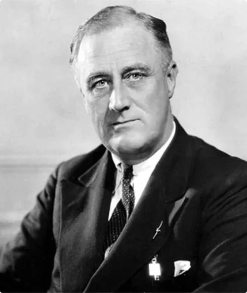

Analiza structurală servește ca instrument critic. Ne permite să evaluăm sistemele politice după rezultatele lor reale, nu după promisiunile lor. Definițiile intenționale, dimpotrivă, creează o confuzie conceptuală în care toate sistemele pretind că urmăresc obiective similare (dreptate, echitate, libertate), făcându-le imposibil de distins unele de altele. Trebuie deci să acordăm atenție **consecințelor empirice, măsurabile ale unui sistem politic**, precum și mijloacelor pe care le folosește. Prin acestea se dezvăluie adevărata natură a unui sistem politic, dincolo de retorica intențiilor sau programelor.

## Socialiștii

<chapterId>1ef34d7b-f813-458c-934c-1d404f882150</chapterId>

Socialismul este o mișcare politică și economică și, într-adevăr, o doctrină care a apărut în secolul al XIX-lea odată cu critica inegalităților sociale și a alienării muncitorilor în industria de mare scară. Încă de la origini, este și o mișcare clar anti-capitalistă, deși, după cum vom vedea, socialiștii moderni au introdus progresiv moderări și compromisuri în principiile lor.

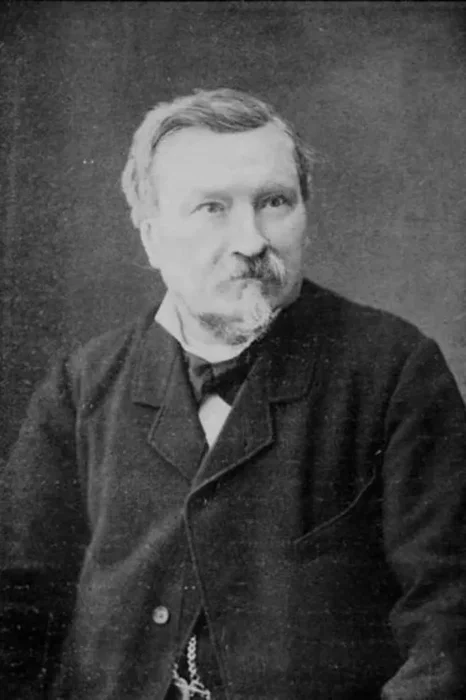

### Libertăți în cadrul socialist

În gândirea socialistă, libertățile nu sunt considerate uniform. Se observă **o dihotomie fundamentală între sferele societală și economică**:

- **Libertăți:** puternice în sfera societală, dar slabe în sfera economică.
- **Valori cardinale:** egalitate, progres, dreptate socială, solidaritate.
- **Filosofie și principii:** Primatul organizării colective. Socialismul este o practică înrădăcinată într-o viziune holistică asupra societății (holism), exprimată prin stat. Termenul „holism” vine din grecescul *holos*, care înseamnă „întregul”. Statul socialist urmărește să preia și să dirijeze activitatea umană la maximum. Socialiștii au o credință aproape nelimitată în posibilitatea de a construi o nouă ordine socială bazată pe rațiune, ceea ce Hayek numea „constructivism”.
- **Politică:** Socialiștii susțin programe de sănătate, captură reglementară, creșteri de taxe și subvenții pentru a garanta echitatea. Aceasta implică direcționare economică și socială de către stat, planificare (organizarea producției în amonte). Socialismul cel mai radical și pe deplin realizat este totalitar, deoarece statul preia întreaga activitate umană.
- **Economie:** Socialismul implică un control puternic al economiei de către stat, în favoarea echității. Socialiștii sunt suspicioși față de piețele libere, pe care le văd ca forțe oarbe, instinctive. Ei favorizează redistribuirea bogăției, programe sociale centralizate și impozitare progresivă, care crește proporțional cu venitul și devine punitivă pentru cei care câștigă sau produc bogăție.

### Evoluție istorică

Conceptul de socialism a fost folosit sistematic pentru prima dată de francezul Pierre Leroux în 1833, într-un articol pentru *Revue Encyclopedique*, explicit în opoziție cu individualismul. Termenul a fost apoi aplicat doctrinelor lui Saint-Simon, Fourier și Owen spre mijlocul secolului al XIX-lea, înainte ca Marx să-l adopte pentru propriile scopuri. În mod notabil, cuvântul „comunism”, pe care Marx avea să-l îmbrățișeze, își are originea tot la un socialist francez numit Etienne Cabet.

Până la sfârșitul secolului al XIX-lea, între marxism și anarhism a apărut o ruptură completă. De la începutul secolului al XX-lea, **o diviziune fundamentală i-a separat pe socialiștii revoluționari de socialiștii reformiști**:

1. **Socialiștii revoluționari** se opun drepturilor de proprietate și caută să distrugă societatea burgheză capitalistă. Ei urmăresc să preia puterea prin violență sau dictatura proletariatului. Acest curent a dat naștere comunismului marxist și, în cele din urmă, celor mai rele regimuri totalitare.

2. **Socialiștii reformiști** nu sunt înclinați spre violență; au înțeles că opoziția frontală față de stat nu dă roade. Ei urmăresc dreptatea socială prin alegeri democratice și impozitare, folosind resursele generate de economia de piață. Cu alte cuvinte, acceptă temporar capitalismul pentru a-l folosi împotriva lui însuși. Această tradiție este reprezentată de Jean Jaures, Leon Blum, Olof Palme (Suedia), Willy Brandt (Germania) și Francois Mitterrand (Franța).

### Marx și ramura revoluționară

Karl Marx a trasat o distincție crucială între socialismul utopic și socialismul științific. I-a acuzat pe primii socialiști francezi (Proudhon, Saint-Simon, Fourier) că sunt utopici, adică propun soluții pur imaginare, fără fundamente teoretice sau practice autentice.

Socialismul științific al lui Marx se bazează pe materialismul istoric: ideea că **istoria progresează prin lupta de clasă și aproprierea mijloacelor de producție**. Potrivit acestei abordări, toate reprezentările culturale (dreptul, instituțiile politice, religiile) sunt condiționate de dezvoltarea forțelor productive și a relațiilor de producție. Statul, dreptul, chiar cultura însăși nu sunt decât expresii ale intereselor clasei dominante. Acest cadru materialist l-a condus pe Marx să susțină că proletariatul trebuie să devină conștient de opresiunea sa și să se elibereze prin revoluție, eliminând clasa opresoare.

### Socialismul democratic și tradiția reformistă

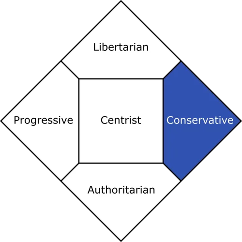

Jean Jaures rămâne unul dintre marii gânditori ai socialismului democratic. Filosof de formație, intrat în politică la începutul secolului al XX-lea, Jaures a fondat ziarul *L'Humanite*. Definiția sa a socialismului era intervenția legitimă a societății și a puterii în viața umană, în special în relațiile de muncă, pentru a realiza libertatea individuală și echitatea. Cu alte cuvinte, **Jaures a pus bazele teoretice pentru justificarea intervenției statului în numele egalității**.

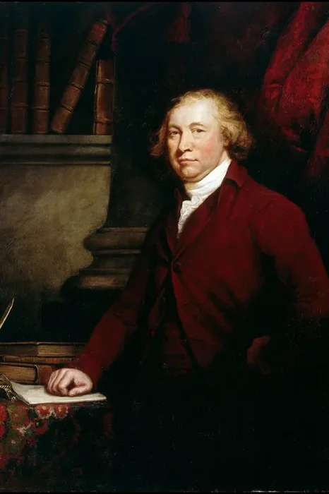

Emile Durkheim, fondator al catedrei de sociologie de la Sorbona în 1913 și prieten al lui Jaures, a explicat că socialismul este un protest împotriva stării economice actuale, care cere o transformare prin organizarea forțelor economice. Atât Jaures, cât și Durkheim împărtășeau o concepție izbitor de economică asupra socialismului: economia nu trebuie lăsată forțelor pieței (pe care le considerau oarbe și instinctive), ci ar trebui gestionată rațional.

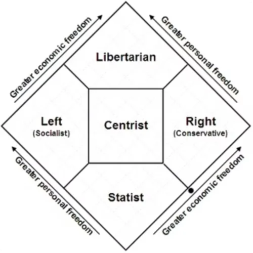

Socialismul modern datorează foarte mult și lui Roosevelt și New Deal-ului. În anii 1930, Franklin Delano Roosevelt a implementat un set de reforme după Marea Depresiune, care constituie o referință majoră pentru toți apărătorii contemporani ai socialismului democratic:

- Crearea Social Security
- Introducerea salariului minim federal
- Înființarea asigurării de șomaj
- Programe federale de angajare publică

După război, Regatul Unit a adoptat reforme similare (naționalizări, statul-providență), social-democrații germani au abandonat progresiv referințele marxiste în favoarea unei economii sociale de piață, iar țările nordice au dezvoltat un model care combină economia de piață, impozitarea progresivă și serviciile publice universale. Bernie Sanders, politician american contemporan care se identifică drept social-democrat, **citează adesea Franța ca exemplu al succesului acestui model**, în special sistemul său de securitate socială.

### Principiul holistic: primatul colectivului

Socialismul este caracterizat de o viziune holistică asupra societății, considerată ca un întreg indivizibil, nu ca o simplă sumă de indivizi. Există moduri diferite de a reprezenta acest colectiv: clasa socială (abordarea marxistă), națiunea (ca în fascism, care subordonează individul interesului național), rasa (ca în național-socialism) sau genul (ca în anumite abordări contemporane). În fiecare caz, **individul nu se mai definește singur; el este definit prin apartenența sa la un grup**.

### Green New Deal: o sinteză contemporană

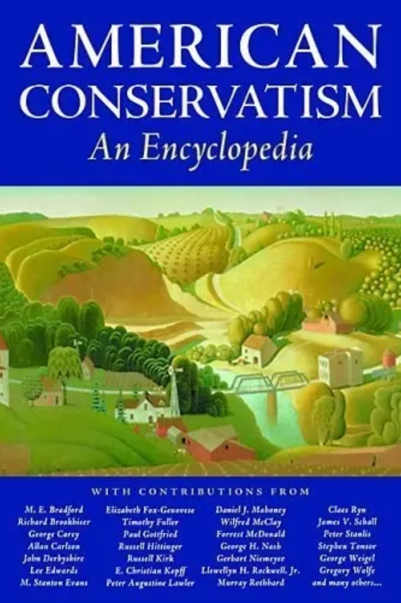

Green New Deal reprezintă o evoluție recentă a socialismului democratic, fuzionând preocupările de mediu cu obiectivele sociale. Politic, ecologia se aliniază cu stânga și chiar cu extrema stângă. Acest program combină tranziția ecologică cu dreptatea socială, garanții de ocupare și servicii publice consolidate. În fiecare caz, **interesul individual este subordonat interesului colectiv, definit de sănătatea planetară** și de provocarea schimbărilor climatice. În fond, este pur și simplu un nou înveliș retoric care justifică intervenția statului și confiscarea veniturilor private, nu doar în numele echității și dreptății sociale, ci și în numele mediului.

### Gândirea socialistă în citate

> Am ajuns să ne dăm seama clar că adevărata libertate individuală nu poate exista fără securitate și independență economică. Oamenii aflați în nevoie nu sunt oameni liberi.
> Franklin D. Roosevelt, 1944

> Scopul socialismului este emanciparea economică a tuturor oamenilor.
> Leon Blum, *On a Human Scale*, 1945

> Socialismul este doctrina care învață că societatea trebuie organizată astfel încât să asigure bunăstarea tuturor membrilor săi.
> Emile Durkheim, *Socialism*, 1928

> Pentru mine, socialismul înseamnă oameni care lucrează împreună pentru a crea o societate care funcționează pentru noi toți, nu doar pentru câțiva oameni bogați.
> Bernie Sanders, 2015

Aceste citate ilustrează intențiile nobile din spatele gândirii socialiste. Totuși **întrebarea fundamentală rămâne: care sunt mijloacele și unde este limita?** Dacă urmărești emanciparea economică prin constrângere și putere, nu este aceasta o contradicție în termeni?

## Conservatori

<chapterId>4e068cd8-a5c3-44f8-ac77-309f249a59eb</chapterId>

Ca orice familie politică, conservatorismul nu este o doctrină unificată. S-a adaptat la epoci și culturi diferite și există diferențe substanțiale între conservatorismul anglo-saxon și omologul său continental european.

### Libertăți în viziunea conservatoare

Așa cum arată Diagrama Nolan, conservatorismul prezintă o dihotomie puternică între libertățile societale și cele economice, imaginea în oglindă a ceea ce am observat la socialiști:

- **Libertăți:** puternice în sfera economică, dar slabe în sfera societală. În domeniul economic, conservatorii apără piața liberă, antreprenoriatul și proprietatea privată, în mare parte din motive pragmatice și în opoziție puternică față de socialism. În domeniul societal, restricțiile sunt justificate prin **păstrarea normelor morale tradiționale și a stabilității sociale**.
- **Valori cardinale:** virtute, ordine, tradiție, civilizație.
- **Filosofie și principii:** Conservatorii cred că lucrurile sunt în general bune așa cum sunt și că orice schimbare le-ar putea face mai rele. În centrul acestei filosofii se află un atașament profund față de rădăcini, față de trecut și o teamă de schimbarea prea brutală. Ei au un respect profund pentru instituțiile sociale consacrate, văzute ca protecții esențiale împotriva haosului și exceselor modernității. Tot ceea ce există deja și și-a dovedit valoarea în timp este considerat bun în sine. După cum formulează o enciclopedie americană a conservatorismului: conservatorismul este o filosofie care caută să mențină și să îmbogățească societățile prin respectul pentru instituțiile, credințele și practicile moștenite, în cadrul cărora indivizii își dezvoltă un caracter bun cooperând unii cu alții în asociații primare și locale precum familii, biserici și grupuri sociale. Tocqueville a observat această dinamică în *Democracy in America*: religia și comunitățile locale serveau ca puternice contragreutăți la riscurile individualismului.

- **Politică:** Statul-națiune este considerat axa principală a politicii. Conservatorii pledează pentru controale sociale tradiționale, apărare națională puternică și puteri polițienești mai extinse. Ei se opun tuturor formelor de socialism sau comunism, pe care le acuză că corup și slăbesc societatea.
- **Economie:** Economia rămâne un instrument pentru întărirea ordinii stabilite și a puterii naționale. Conservatorii susțin libera întreprindere, impozitarea redusă și reglementarea minimă a afacerilor. Dar se tem că **prea multă libertate individuală ar putea genera imoralitate sau declin civilizațional**. După cum spunea Otto von Bismarck: „Economia este cea mai sigură cale către măreția națională.” Chiar ca partizani ai pieței libere, conservatorii văd libertatea economică nu ca un scop în sine, ci ca o pârghie pentru menținerea unui stat puternic.

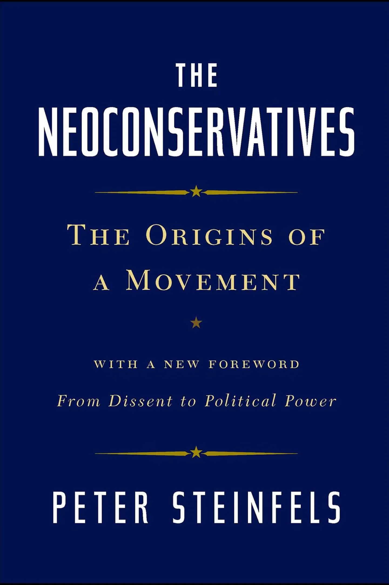

### O scurtă istorie a conservatorismului

Doctrina își găsește rădăcinile filosofice în secolul al XVIII-lea, născută ca reacție la Revoluția Franceză. Edmund Burke este citat adesea ca figura fondatoare a acestei opoziții, pledând pentru păstrarea instituțiilor și tradițiilor împotriva schimbării radicale. Burke a susținut prudența: chiar dacă putea îmbrățișa anumite principii ale Revoluției, credea că societatea ar trebui să înainteze nu făcând tabula rasa, ci prin reforme graduale.

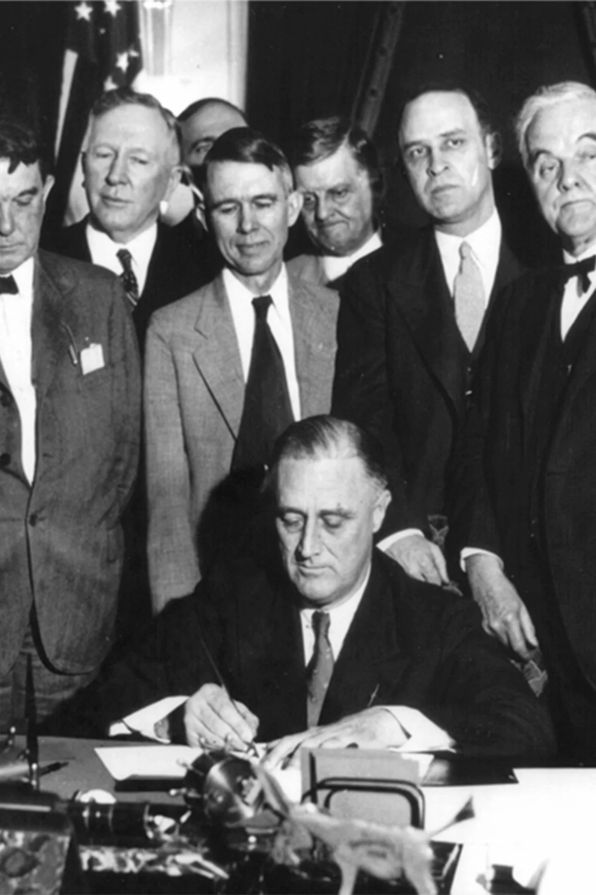

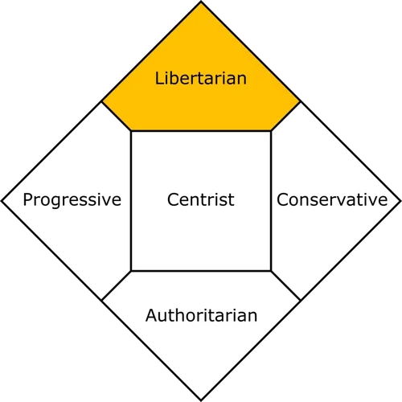

În Europa secolului al XIX-lea, conservatorismul s-a manifestat adesea ca sprijin pentru monarhie, Biserică și ordinea socială consacrată în fața ascensiunii liberalismului și naționalismului. Figuri precum Joseph de Maistre în Franța au reprezentat o tulpină profund reacționară. De Maistre nutrea o ostilitate absolută față de rațiune, crezând că oamenii nu sunt ființe ale rațiunii și că **societatea poate fi guvernată doar apelând la instincte profunde**, de unde importanța crucială a religiei. Acești reacționari pledau pentru o întoarcere la societatea feudală, agricolă și artizanală, văzând industrializarea ca o amenințare la adresa ordinii sociale tradiționale.

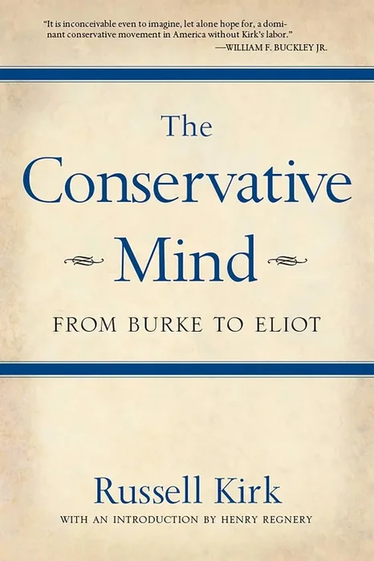

În secolul al XX-lea, mai ales în Statele Unite, conservatorismul s-a dezvoltat în jurul idealurilor de libertate individuală, guvern limitat, piețe libere și valori creștine, adesea în opoziție cu politicile progresiste ale New Deal-ului. Acest conservatorism anglo-saxon era mult mai modern, acceptând pe deplin progresul științific și tehnologic în timp ce încerca să reconcilieze comunitatea și individul, libertatea și responsabilitatea. În Marea Britanie, Margaret Thatcher a exemplificat această tendință prin opoziția ei față de sindicate și planificare centralizată, mereu cu obiectivul subiacent de **a restaura valorile morale și religioase ca bastion împotriva exceselor progresismului**.

### Mari gânditori ai conservatorismului

- **Edmund Burke (1729-1797):** Considerat adesea părintele conservatorismului modern, Burke a insistat asupra schimbării graduale, organice, mai degrabă decât asupra rupturii revoluționare. *Reflections on the Revolution in France* (1790) a pus fundamentele intelectuale ale conservatorismului anglo-saxon.
- **Michael Oakeshott (1901-1990):** Filosof britanic cunoscut pentru critica raționalismului în politică, Oakeshott a apărat **o concepție a conservatorismului ca temperament, nu ca ideologie sistematică**. Eseul său *On Being Conservative* (1956) rămâne o referință esențială care l-a influențat și pe Friedrich Hayek.
- **Roger Scruton (1944-2020):** Filosof britanic contemporan care a dezvoltat o apărare sofisticată a valorilor conservatoare în contextul modernității târzii, în special în cartea sa *The Meaning of Conservatism*.

### O flexibilitate problematică

Conservatorismul manifestă uneori o flexibilitate tulburătoare față de principii. În timpul crizei financiare din 2008, George W. Bush a declarat: „Am abandonat principiile pieței libere pentru a salva sistemul pieței libere.” În anul următor, a adăugat: „Am mers împotriva instinctelor mele de piață liberă și am aprobat o intervenție guvernamentală temporară.” Intervenind pentru a salva marile bănci, Bush și-a asumat **rolul conservator al statului ca garant ultim al economiei naționale**, plasând puterea și continuitatea națiunii deasupra principiilor abstracte ale pieței. Aceeași logică poate fi găsită în politicile comerciale protecționiste ale lui Donald Trump, urmărite în numele interesului național, cu riscul de a alimenta corporatismul și crony capitalism.

### Apariția neoconservatorismului

Începând cu anii 2000, neoconservatorii s-au implicat tot mai mult în justificarea intervenționismului militar pentru a implanta democrația în lume, mai ales după atacurile din 11 septembrie 2001. Această politică de „nation-building” a rupt cu prudența tradițională a conservatorilor în materie de politică externă. Ca reacție, conservatorii tradiționali au revendicat eticheta „paleoconservator” pentru a se distinge de neoconservatori. Ei critică intervenționismul militar, apără o politică externă mai izolaționistă și **pun un accent mai mare pe chestiunile de identitate națională și culturală**.

### Gândirea conservatoare în citate

> Un conservator este cineva care crede că nimic nu a fost făcut vreodată pentru prima dată.
> Benjamin Disraeli

> Conservatorismul nu este un sistem rigid de gândire, ci o dispoziție, o atitudine față de viață, o tradiție.
> Michael Oakeshott

> Conservatorismul este convingerea că există un adevăr moral pe care nu l-am inventat și pe care nu îl putem aboli.
> Roger Scruton

Acest ultim citat este fundamental pentru înțelegerea opoziției puternice a conservatorilor față de progresiști. Conservatorii susțin că există o natură umană, iar din acea natură emerg reguli morale. Aceste reguli nu sunt arbitrare; ele apar din ceea ce este fundamental ființa umană. În consecință, orice încercare de a modifica natura umană nu este doar sortită eșecului, ci este, mai presus de toate, imorală.

## Libertarieni

<chapterId>9ca743de-537b-42fb-87d2-212d5f478b22</chapterId>

Familia libertariană se distinge de toate celelalte filosofii politice într-un mod fundamental: **ea plasează în centru nu economia, ci etica și dreptul**. Când libertarienii apără economia de piață, o fac mai puțin pentru capacitatea ei de a produce bogăție decât pentru promovarea libertății și responsabilității individuale.

### Libertăți și valori fundamentale

Așa cum arată imediat Diagrama Nolan, libertarienii se află în partea de sus a cadrului deoarece nu acceptă nicio restricție în apărarea libertăților, fie societale, fie economice. Tocmai acest lucru îi distinge de orice altă familie politică:

- **Libertăți:** puternice atât în sfera societală, cât și în cea economică. La nivel societal, libertarienii apără libertatea individuală maximă, incluzând dezincriminarea anumitor substanțe, libertatea alegerii educaționale și neintervenția statului în viețile private ale cetățenilor. La nivel economic, aceasta se extinde la libertatea de a întreprinde, de a angaja, de a stabili salarii și, mai ales, **dreptul de a-ți cheltui banii așa cum consideri potrivit** și de a tranzacționa fără restricții sau supraveghere.
- **Valori cardinale:** proprietate privată legitimă, libertate individuală, consimțământ, responsabilitate. Aceste valori sunt intim legate și complet inseparabile unele de altele.
- **Filosofie și principii:** Libertarianismul este înainte de toate o filosofie a dreptului. Ideea fundamentală, găsită încă din secolul al XVII-lea la John Locke, este că fiecare individ posedă drepturi inalienabile la viață, libertate și proprietate. Aceste drepturi nu sunt acordate de guvern, ci sunt intrinseci ființei umane. Proprietatea de sine este conceptul potrivit căruia fiecare individ este proprietarul legitim al propriului corp și al propriei vieți. După cum scria Bastiat, omul este mai întâi proprietarul lui însuși, apoi proprietarul lucrurilor pe care le-a dobândit. Principiul laissez-faire nu este absența normelor; este **o normă fundamentală care trebuie apărată, inclusiv prin forță**.
- **Politică:** Principiul non-agresiunii postulează că o persoană este liberă să acționeze așa cum dorește atâta timp cât nu comite acte de violență împotriva vieții, libertății sau proprietății altuia. Această formulare amintește de regula de aur prezentă în toate civilizațiile și religiile: nu le face altora ceea ce nu ai vrea să-ți facă ei ție. Libertarienii refuză să acorde statului o permisiune specială de a comite acte pe care majoritatea oamenilor le-ar considera imorale dacă ar fi comise de indivizi. Pe scurt, **există un singur cod moral care se aplică tuturor, fără excepții**. Acest lucru produce în mod natural o suspiciune profundă față de putere, în special puterea statului, care poate exercita legal constrângere, inclusiv prin monopolul controlului monetar. Impozitarea este calificată drept furt sau extorcare, deoarece constă în confiscarea proprietății altuia fără consimțământ, încălcând principiul non-agresiunii.
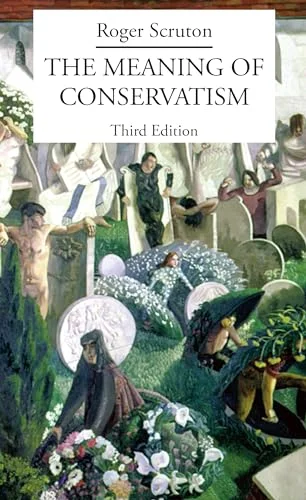

- **Economie:** Libertatea de întreprindere și de schimb decurge direct din proprietatea de sine și din proprietatea asupra roadelor muncii proprii. Libertatea produce o ordine spontană, mai justă și mai eficientă deoarece rezultă din acțiunea și responsabilitatea individuală. Piața liberă se află în opoziție cu corporatismul (un sistem în care statul colaborează cu grupuri organizate pentru a reglementa economia, creând monopoluri și protecții reglementare). **piața liberă este procesul natural prin care indivizii interacționează pașnic**, fără a se baza pe forța legii pentru a obține avantaje.

### Evoluție istorică

Ideile libertariene își au originea în secolul al XVIII-lea, odată cu liberalismul clasic. Fiziocrații (Vincent de Gournay, Turgot, Quesnay), apoi Condillac, Jean-Baptiste Say și Frederic Bastiat au formulat clar aceste principii. De-a lungul secolului al XX-lea, **a avut loc o schimbare fundamentală odată cu abandonarea progresivă a principiilor laissez-faire** în favoarea statului-providență și a unei societăți tot mai reglementate. Ca răspuns, liberalii clasici din Statele Unite au început să se numească „libertarieni” pentru a se distinge de „liberalismul” american, care fusese capturat de intervenționismul statal în creștere. Acești libertarieni s-au recunoscut în [școala austriacă de economie](https://planb.academy/resources/glossary/austrian-school), ai cărei principali gânditori sunt Ludwig von Mises, Friedrich Hayek și Murray Rothbard.

### Tipuri de libertarieni

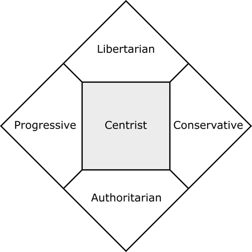

În secolul al XX-lea, au apărut două tendințe majore, deși divergențele dintre ele se bazează mai mult pe chestiuni empirice decât pe dezacorduri etice fundamentale:

1. **Minarhiștii** consideră că puterile statului ar trebui limitate strict la apărarea libertăților individuale. Este un regim de stat minimal („statul paznic de noapte”), în care puterea este legitimă doar pentru a asigura funcțiile de bază ale poliției, justiției și apărării teritoriale. Ron Paul este o figură proeminentă a acestei tendințe: medic și congresman american care a reprezentat Texasul timp de decenii, el a votat consecvent împotriva oricărui proiect de lege care se îndepărta de Constituție, s-a opus tuturor formelor de intervenționism extern și **a susținut denaționalizarea banilor**, idee apărată de Friedrich Hayek. Paul argumentează că Federal Reserve este responsabilă pentru inflație și cicluri economice prin manipularea banilor fiat, iar în Bitcoin a văzut o formă de bani sănătoși care ar putea înlocui standardul aur.

2. **Anarho-capitaliștii** consideră că funcțiile statului ar trebui privatizate și gestionate integral de piață. Aceasta nu este o societate fără reguli, autoritate sau legi, ci **o societate în care regulile ar fi stabilite prin adeziune voluntară și consimțământ**. Ar putea exista guverne și funcții asemănătoare statului, dar nu ar exista monopol; întreprinderi concurente și-ar oferi serviciile clienților. Gânditori-cheie includ Murray Rothbard (*For a New Liberty*, 1973), David Friedman (fiul lui Milton Friedman, care adoptă o abordare mai pragmatică, utilitaristă, argumentând că piața poate furniza toate serviciile mai eficient, inclusiv legea și ordinea) și Hans-Hermann Hoppe (discipol al lui Rothbard, care dezvoltă o abordare bazată pe etica argumentării).

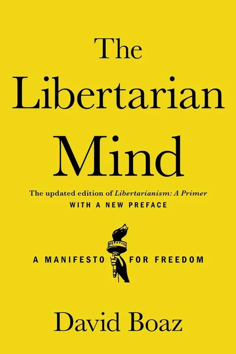

### Gândirea libertariană în citate

> Libertarianul nu vede nicio contradicție în a fi „de stânga” în unele probleme și „de dreapta” în altele. Dimpotrivă, el consideră poziția sa singura consecventă în practică, din punctul de vedere al libertății fiecărui individ.
> Murray Rothbard, *For a New Liberty*, 1973

> Dacă nu ai dreptul să-ți jefuiești vecinul, nu ar trebui să trimiți guvernul să jefuiască în locul tău.
> Ron Paul, 2008

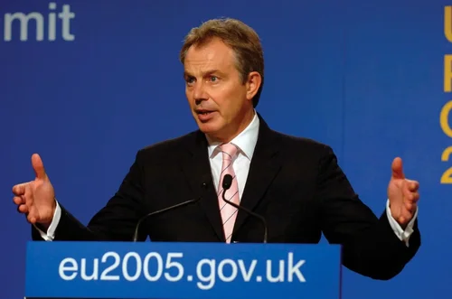

Cu alte cuvinte, Rothbard subliniază că libertarianismul transcende clivajul tradițional stânga-dreapta, iar Paul evidențiază respingerea statului ca instrument de constrângere. **interdicția furtului se aplică nu doar indivizilor, ci și statului.**

## Centriștii

<chapterId>d4f5c100-a791-45cf-bc7c-6e2353dc7a48</chapterId>

Centrismul este mai mult decât o simplă poziție mediană echidistantă de toate celelalte. Este o filosofie politică autentică, o metodă de guvernare care pretinde că este adaptată societăților pluraliste contemporane. Este o abordare care **privilegiază eficiența, pragmatismul și tinde către o formă de tehnocrație**: puterea ar trebui încredințată experților care trebuie să dirijeze economia și să piloteze politica monetară.

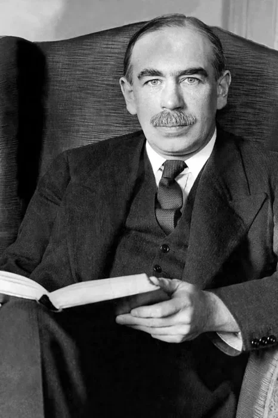

### Libertăți și valori cardinale

Abordarea centristă este caracterizată de o căutare constantă a echilibrului între autoritatea publică și autonomia privată:

- **Libertăți:** moderate atât în sfera societală, cât și în cea economică. În domeniul societal, centriștii aspiră să reconcilieze controlul guvernamental și alegerea individuală, favorizând intervenția măsurată a statului, dar păstrând libertățile fundamentale. În domeniul economic, libertățile sunt garantate, dar întotdeauna temperate de preocuparea pentru dreptate socială. Centriștii sunt foarte critici față de laissez-faire, dar rămân atât pro-business, cât și favorabili corectării inegalităților. Aici trebuie făcută o distincție importantă: a fi pro-business (cum tind să fie centriștii) înseamnă a favoriza **un fel de alianță între marile întreprinderi și stat**, ceea ce diferă de a fi pro-piață.
- **Valori cardinale:** moderație, compromis, adaptare, utilitate publică.
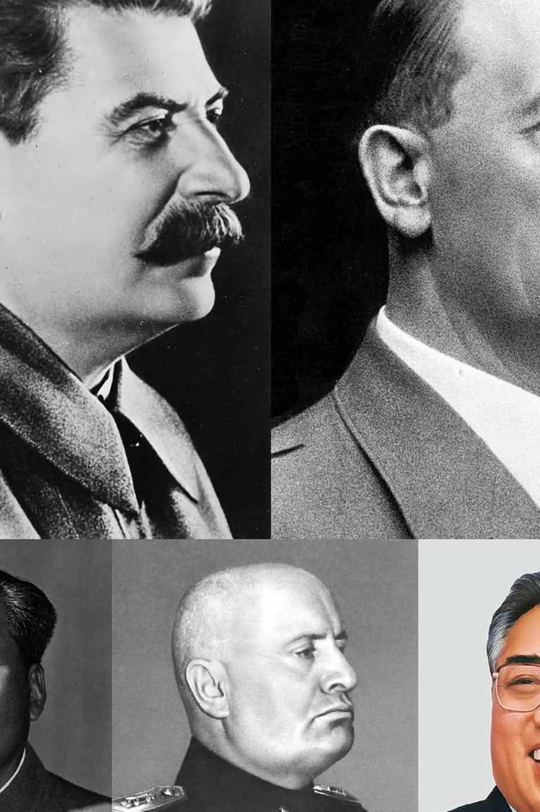

- **Filosofie:** Pragmatismul este o filosofie politică ce privilegiază adaptarea la contexte particulare în locul aplicării rigide a principiilor ideologice. Această gândire pragmatică se bazează pe ideea că doar tehnocrații sunt capabili să ia deciziile corecte pentru a obține cele mai bune rezultate socioeconomice. Într-un model de guvernanță tehnocratică, deciziile politice decurg din raționalitate și expertiză, nu din ideologie sau dezbatere partizană. Pentru a calcula utilitatea unei decizii, trebuie să poți măsura toate consecințele ei, iar acest lucru cere expertiză: calcule sofisticate, statistici, sondaje, probabilități. Totuși, există aici un paradox: **acest pragmatism însuși se sprijină pe o formă de dogmatism** (și anume, că doar experții sunt competenți să conducă societatea), o convingere care rămâne invizibilă și neexprimată.
- **Politică:** Centriștii caută să transcendă diviziunile tradiționale (stânga versus dreapta) prin guvernare de coaliție, unind partide moderate de la dreapta conservatoare până la stânga social-democrată și ecologică într-un grup central care **transcende clivajele istorice dintre stânga și dreapta**. Această metodă se potrivește societăților moderne caracterizate de diversitate. Bill Clinton în Statele Unite a fost recunoscut pentru capacitatea sa de a adopta legi câștigând voturi atât de la republicani, cât și de la democrați; Emmanuel Macron în Franța a fost ales de două ori formând un centru larg compus din toți moderații.
- **Economie:** Centriștii acceptă mecanismele pieței, recunoscând în același timp necesitatea unui control expert și a unei reglementări adecvate. Ei pledează pentru o economie de piață reglementată, în care concurența are loc într-un cadru care protejează interesul general. Am putea numi acest lucru un „dirijism soft”, deoarece nu caută să planifice economia complet, ci mai degrabă să plafoneze bonusurile, să reglementeze practicile și să gestioneze piața în numele păcii sociale.

### Programe sociale țintite

Centrismul recunoaște importanța **programelor sociale țintite pentru a corecta inegalitățile fără a crea dependență excesivă** de stat. Acest sistem de redistribuire a bogăției urmărește mai puțin egalitarismul dogmatic decât pacea socială și „traiul împreună”.

### Este keynesianismul un centrism economic?

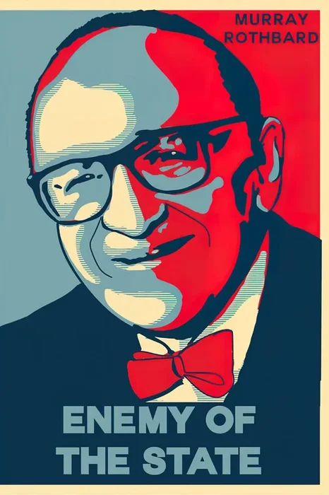

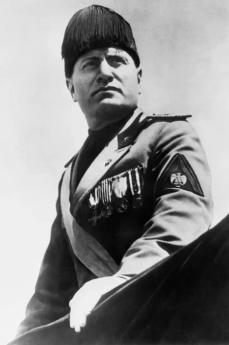

John Maynard Keynes, marele economist englez al secolului al XX-lea care a dominat gândirea și practica economică în societățile occidentale până astăzi, poate fi într-adevăr văzut ca reprezentând o formă de centrism. Abordarea sa caută un echilibru între liberalismul clasic (piața liberă) și socialismul dirijist (planificare maximă).

În loc să lase piețele să se regleze singure, Keynes a susținut că statul ar trebui să folosească politici fiscale și monetare (cheltuieli publice, impozitare, rate ale dobânzii) pentru a stimula cererea agregată în perioade de recesiune sau pentru a o frâna în perioade de supraîncălzire economică. El este inițiatorul ideii binecunoscute că consumul este bun pentru creștere.

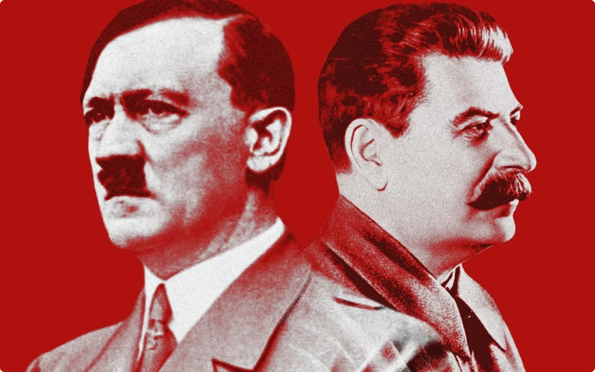 Dar pentru ca acest mecanism să funcționeze, **sunt necesari experți care să manipuleze pârghiile potrivite**: pârghii monetare precum ratele dobânzii și crearea de bani. Pentru a finanța cheltuielile sociale, statul trebuie să se poată împrumuta, iar pentru ca împrumutul să fie fezabil, banii trebuie să fie disponibili și nu prea costisitori, de aici importanța băncilor centrale în menținerea unei anumite rate a inflației.

### John Rawls: dimensiunea filosofică

John Rawls, eminentul filosof politic și autor al *A Theory of Justice* (1971), reprezintă dimensiunea teoretică a centrismului. Concepția sa despre dreptatea socială propune **un echilibru pragmatic între libertățile individuale și intervențiile corective împotriva inegalităților**.

Rawls propune două principii ale dreptății:

1. **Libertate egală pentru toți:** fundamentul democrației, așa cum arătase Tocqueville.
2. **Principiul diferenței:** permite inegalități numai dacă ele aduc beneficii celor mai dezavantajați. Cu alte cuvinte, cineva are dreptul să se îmbogățească, cu condiția ca redistribuirea să permită și celor mai puțin favorizați să beneficieze.

Conceptul de **consens suprapus este, de asemenea, central în gândirea lui Rawls**, în special în cartea sa *Political Liberalism* (1993):

> Un consens suprapus este atins atunci când cetățenii, deși aderă la doctrine cuprinzătoare, religioase sau filosofice diferite, converg totuși asupra unui set de principii politice ale dreptății pe care le pot susține cu toții din propriile perspective.

Această abordare ilustrează perfect metoda centristă: căutarea unor acorduri raționale, moderate, în ciuda diversității opiniilor într-o societate pluralistă, însăși esența filosofiei centriste.

### Gândirea centristă în citate

> Lucrul important pentru Guvern nu este să facă lucruri pe care indivizii le fac deja și să le facă puțin mai bine sau puțin mai rău; ci să facă acele lucruri care în prezent nu sunt făcute deloc.
> John Maynard Keynes, *The End of Laissez-Faire*, 1926

Ceea ce vrea să spună Keynes aici este că există eșecuri ale pieței (crize de supraproducție, penurii, speculație), iar atunci când apar crize, doar statul este în poziția de a interveni. **Piața nu este capabilă de autoreglementare**, așa că trebuie protejată, sarcină care revine statului și deci experților și tehnocraților.

## Regimuri totalitare

<chapterId>7a5e9f5a-2be1-4497-892a-3da5f015faa0</chapterId>

Încheiem analiza marilor familii politice cu regimurile totalitare, dar aici avem de-a face cu ceva fundamental diferit. Totalitarismul nu este, strict vorbind, o filosofie politică; **este mai degrabă negarea oricărei filosofii politice**. Aceasta este ceea ce ne arată Hannah Arendt când trasează distincția dintre despotismul clasic și totalitarism.

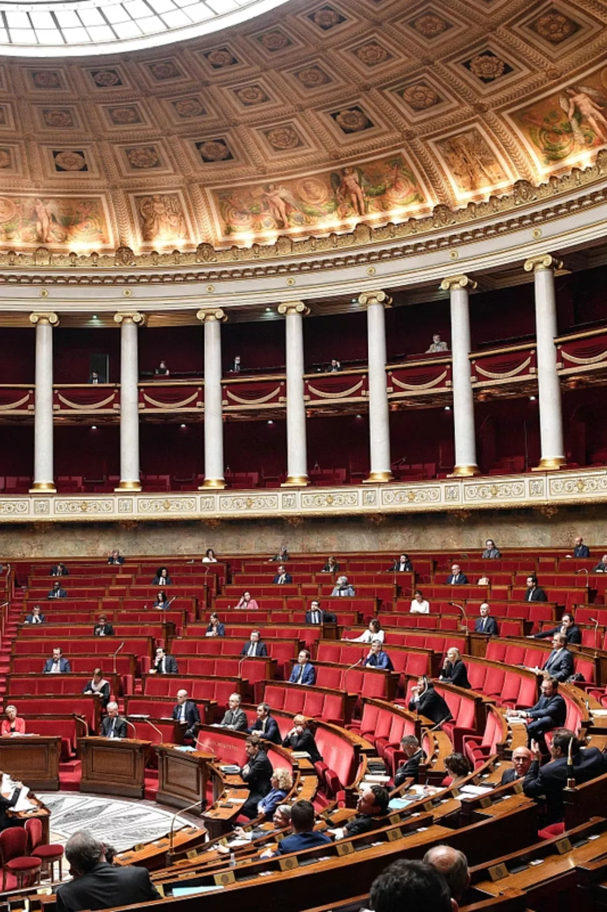

### Intuiția Hannei Arendt

În lucrarea sa majoră *The Origins of Totalitarianism* (1951), Arendt scrie: „Totalitarismul nu tinde să-i supună pe oameni unor reguli despotice, ci unui sistem în care oamenii sunt superflui.” Ceea ce vrea să spună este că un regim totalitar nu este pur și simplu un regim clasic care tinde spre tiranie sau despotism (așa cum făcea uneori monarhia, sau chiar democrația, după cum avertiza Tocqueville). Este cu totul altceva.

Potrivit lui Arendt, **totalitarismul nu este o familie politică, ci negarea însăși a politicii**, un sistem în care ființele umane sunt făcute incapabile de acțiune independentă. Politica, în concepția ei, este capacitatea unui popor de a-și lua destinul în mâini și de a acționa. În regimurile totalitare, această capacitate este distrusă.

### Definiție și caracteristici fundamentale

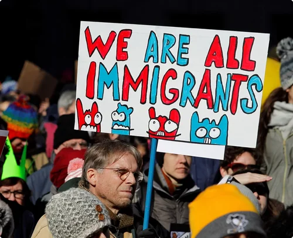

Mussolini declara în 1920: „Totul în Stat, nimic în afara Statului, nimic împotriva Statului.” Acest lucru dezvăluie precis ce înseamnă „totalitar”: totalitate. Totul este absorbit în stat, ceea ce înseamnă că **nu mai există nicio separare între spațiul public și cel privat**. Statul absoarbe complet societatea, care în acel moment își pierde orice formă de autonomie. Dacă vrei să deschizi un club de tenis de masă, ai nevoie de autorizarea partidului. Și acest lucru se extinde la absolut tot, inclusiv la viața intimă a familiei.

- **Libertăți:** suprimate. Regimurile totalitare impun un control guvernamental puternic atât asupra vieții personale, cât și asupra celei economice. Totalitarismul există când statul controlează totul în societate și exercită putere nelimitată, eliminând toate formele de opoziție prin poliție politică.
- **Filosofie:** Societățile totalitare se disting prin folosirea unei ideologii, promisiunea unui „paradis” (sfârșitul istoriei pentru comunism sau puritatea rasială pentru nazism). Partidul unifică masele împotriva unui inamic atât extern, cât și intern (burghezul capitalist pentru comunism, evreul pentru nazism).
- **Politică:** un sistem de partid unic în care o minoritate infimă controlează întreaga populație prin ideologie și teroare. **Toate regimurile totalitare au ajuns la putere prin revoluție violentă**, o revoluție care justifică violența făcând tabula rasa din sistemul anterior.
- **Economie:** regimurile totalitare pot tolera întreprinderea privată dacă este forțată să servească interesele statului sau pot cere ca statul să controleze toate mijloacele de producție. Ele văd piața liberă ca pe o amenințare la adresa ordinii generale, deoarece societățile ideale trebuie planificate de autorități.

### Pilonii controlului totalitar

Totalitarismul este prezent atunci când **toate caracteristicile următoare sunt reunite simultan**: libertăți suprimate, autoritate nelimitată întemeiată pe partidul unic și cultul liderului, revoluție violentă și economie dirijată. Acesta era deja cazul Revoluției Franceze, motiv pentru care unii istorici au identificat în ea o dimensiune totalitară. Este important de notat că democrațiile moderne pot prezenta unele dintre aceste caracteristici, dar niciodată pe toate în același timp (cel puțin, din fericire, nu până acum).

### Două modele, o metodă: Hitler versus Stalin

Diferențele dintre nazism și comunism sunt mai aparente decât reale. În ciuda antagonismului lor istoric, Hitler și Stalin au folosit metode identice: cultul personalității, control social total prin supraveghere, cenzură, îndoctrinare și poliție politică și **eliminarea sistematică a tuturor formelor de opoziție sau disidență**. După cum a scris Raymond Aron, observator pătrunzător al regimurilor totalitare ale secolului XX: „Totalitarismele nazist sau comunist funcționează în același fel, pe două principii: credința militanților și frica adversarilor.” El vorbește despre „credință” într-un sens cvasi-religios; regimurile totalitare au fost numite religii seculare, religii fără Dumnezeu. Un fel de fanatism le caracterizează dincolo de motivațiile lor diferite.

- **Hitler (Nazism):** deși regimul nazist nu a abolit formal proprietatea privată, exista aparența unei economii de piață, în timp ce sectorul privat era complet subordonat obiectivelor statului (război și reînarmare). A fost impusă autarhia economică, ceea ce înseamnă că nu exista comerț liber. Exista planificare economică centralizată pentru a servi obiectivele regimului.

- **Stalin (Comunism):** stalinismul exemplifică controlul total al economiei de către stat. Toată proprietatea privată asupra mijloacelor de producție a fost abolită, economia a fost complet planificată (planuri cincinale), colectivizarea a fost forțată, iar statul controla absolut toate aspectele producției și distribuției.

După cum scrie Thierry Wolton, care a studiat extensiv comparația dintre aceste două regimuri: „Gemelitatea comunismului sovietic și a nazismului este un fapt istoric. Cele două totalitarisme se aseamănă în modul lor de funcționare și practica politică: **ura față de democrație, față de valorile umaniste, față de libertatea individuală** sunt trăsături comune ambelor.”

### Gândirea totalitară în citate

> Poporul nu are nevoie de libertate, căci libertatea este una dintre formele dictaturii burgheze.
> Vladimir Lenin, *What Is to Be Done?*, 1902

> Poporul german va fi condus nu prin raționament, ci de un lider care întruchipează voința poporului.
> Adolf Hitler, *Mein Kampf*, 1925

> Nazismul și comunismul împărtășesc o opoziție comună față de democrația liberală și față de ceea ce ele numesc „burghezia capitalistă”. [...] Ambele ideologii pretind că sunt socialiste și folosesc acea imagine una împotriva celeilalte.
> Francois Furet, *The Passing of an Illusion*, 1995

Aceste citate dezvăluie logica comună a regimurilor totalitare: **respingerea libertății individuale în favoarea autorității centralizate absolute**, fie comunistă, fie fascistă. Într-adevăr, chiar numele partidului nazist (Național-Socialism) semnalează această matrice ideologică comună, chiar dacă cele două mișcări se detestau reciproc.

# Probleme societale și economice

<partId>ab160ddd-5c3a-436b-a77a-76d7089f1611</partId>

## Probleme societale

<chapterId>bb2156da-7e10-4f0b-89c3-f6d53f5a79ef</chapterId>

După ce am analizat marile familii politice, ne îndreptăm acum către o serie de dezbateri pe probleme societale, urmate de probleme economice. Scopul aici este de a oferi o analiză comparativă a pozițiilor socialiste, conservatoare, libertariene și centriste asupra a cinci întrebări fundamentale ale societății: căsătoria, imigrația, armele de foc, drogurile și taxa pe băuturi zaharoase.

Problemele societale nu sunt despre bani. Ele privesc alegerile pe care le facem despre ce citim, mâncăm, bem, fumăm, purtăm sau cu cine alegem să ne asociem, să dormim sau să ne căsătorim. Pentru fiecare întrebare de mai jos, vom examina un răspuns scurt tipic fiecărei familii politice. Aceste răspunsuri rapide oferă doar o privire asupra fiecărui punct de vedere și, deoarece nu toată lumea gândește la fel, pozițiile atribuite lor sunt în mod natural deschise dezbaterii. Am încercat însă să fiu corect și să reprezint cu acuratețe ceea ce ar spune majoritatea adepților fiecărei familii.

### Căsătoria

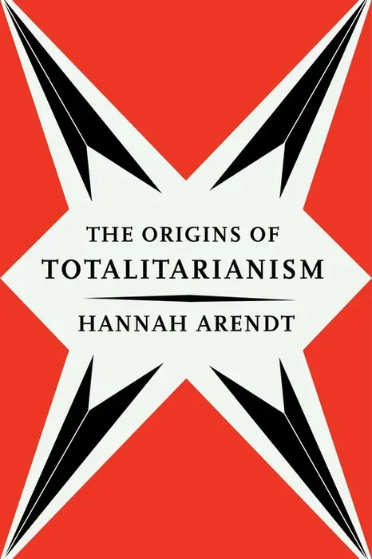

**Întrebare:** Ar trebui guvernul să legalizeze căsătoria gay în același fel ca pe căsătoria tradițională?

### Poziția socialistă: da

Pentru socialiști, toți cetățenii trebuie tratați egal în fața legii, fără discriminare bazată pe orientare sexuală. Cu alte cuvinte, o concepție incluzivă înrădăcinată în principiul non-discriminării. Socialiștii denunță **opresiunea unei minorități homosexuale de către o majoritate heterosexuală** care îi refuză accesul la căsătorie. Aici găsim o viziune asupra lumii care traversează multe poziții socialiste: societatea este structurată de un conflict între dominanți și dominați, opresori și oprimați. Acest cadru este reprodus în numeroase domenii. Se poate aplica relațiilor de gen dintre bărbați și femei sau dintre homosexuali și heterosexuali. Se poate aplica relațiilor dintre grupuri rasiale și chiar relației dintre umanitate și natură. Legalizarea căsătoriei gay este, așadar, în ochii lor, un act de dreptate socială.

### Poziția conservatoare: nu

Pentru conservatori, căsătoria tradițională este o instituție fundamentală care se întinde pe 2.500 de ani, definită ca uniunea dintre un bărbat și o femeie. Această definiție nu este arbitrară. Ea se sprijină pe o realitate biologică: **capacitatea naturală de procreare, care este vocația primară a familiei**. Dacă vrem să protejăm ordinea socială și să salvgardăm viitorul umanității însăși (deoarece procrearea este ceea ce asigură supraviețuirea speciei), atunci căsătoria trebuie rezervată unui bărbat și unei femei prin însăși definiția ei. Cu alte cuvinte, ceea ce conservatorii caută să protejeze este însăși definiția tradițională a căsătoriei.

### Poziția libertariană: mixtă

Pentru libertarieni, întrebarea este fundamental pusă greșit, deoarece este formulată în termeni statiști: pe cine autorizează statul să se căsătorească? Statul, susțin ei, nu are ce căuta în viața privată a indivizilor. Abordarea libertariană consecventă este deci apărarea separării căsătoriei de stat. **Impunând o singură definiție a căsătoriei, statul creează conflicte.** Privatizarea căsătoriei îi respectă atât pe cei care susțin căsătoria tradițională, cât și pe cei care apără căsătoria între persoane de același sex. Soluția: eliminarea căsătoriei civile obligatorii și lăsarea acestui rol asociațiilor private, bisericilor, sinagogilor, moscheilor sau organizațiilor seculare. Să lăsăm indivizii, asociațiile și religiile să definească singure căsătoria.

### Poziția centristă: da

Centriștii recunosc evoluția societății și susțin că principiul non-discriminării trebuie să se aplice. Legea trebuie să reflecte diversitatea cetățenilor și să se adapteze epocii sale. Cuplurile de același sex ar trebui să se bucure de aceleași drepturi și protecții legale (moștenire, protecție socială, impozitare) ca perechile heterosexuale. Aici găsim **idealul centrist al consensului, adaptării pragmatice și modernizării legii**.

### Imigrația

**Întrebare:** Ar trebui guvernul să deschidă necondiționat granițele?

### Poziția socialistă: da

Pentru socialiști, restricțiile discriminatorii sunt contrare drepturilor omului. Statul are datoria de a primi oamenii aflați în nevoie și de a promova diversitatea. Aici regăsim din nou ideile de dreptate socială, egalitate și non-discriminare care caracterizează familia socialistă. **Restricțiile bazate pe naționalitate sau religie sunt văzute ca forme de opresiune**, în concordanță cu cadrul dominanți/dominați descris mai sus.

### Poziția conservatoare: nu

Statul are dreptul suveran de a-și controla granițele pentru a proteja securitatea națională și identitatea culturală. Pentru conservatori, **ordinea, identitatea și suveranitatea națională trebuie să aibă prioritate** asupra primirii nelimitate a străinilor sau refugiaților. Granițele și o populație bine definită fac parte din valorile civilizate.

### Poziția libertariană: mixtă

Da imigrației de piață și nu imigrației de stat. De ce? Pentru că într-o lume puternic statistă, imigrația este subvenționată și creează pretenții asupra muncii altora. Cu alte cuvinte, cade pe umerii contribuabililor, care trebuie să plătească pentru sănătate, locuințe și alte cheltuieli. Din perspectiva axei libertate/constrângere, granițele deschise le oferă indivizilor capacitatea de a vota cu picioarele, de a-și alege liber guvernul. Dar **imigrația nu poate crea drepturi asupra muncii altora**. Cineva are dreptul să se stabilească într-o altă țară cu condiția să nu devină o povară pentru rezidenții ei. Soluția, ca întotdeauna pentru libertarieni, este piața: să lăsăm cetățenii să decidă contractual relațiile lor cu străinii. Orice imigrație impusă și forțată este incompatibilă cu libertatea.

### Poziția centristă: da

Imigrația le permite angajatorilor să angajeze lucrători în sectoare care se confruntă cu penurii, iar imigrația deschisă permite aplicarea convențiilor internaționale privind refugiații. Guvernul trebuie să gestioneze imigrația într-un mod echilibrat, **conciliind nevoile economice, integrarea reușită și respectarea convențiilor internaționale**.

### Arme de foc

**Întrebare:** Ar trebui cetățenii care respectă legea să poată deține arme de foc fără reglementare strictă?

### Poziția socialistă: nu

Siguranța publică trebuie să aibă prioritate asupra libertății de a deține arme. Reglementarea strictă este necesară pentru a reduce violența și a garanta siguranța colectivă, deoarece statul are o datorie constituțională de a-și proteja toți cetățenii. Socialiștii subliniază și inegalitățile care ar putea rezulta din libertatea armelor de foc și vulnerabilitatea pe care ar crea-o pentru cei mai fragili membri ai societății. În cele din urmă, **doar statului ar trebui să i se încredințeze folosirea forței**, în condiții care respectă interesul public.

### Poziția conservatoare: mixtă

Dreptul de a deține o armă pentru autoapărare este o valoare importantă. Totuși, reglementările pentru garantarea siguranței și ordinii publice sunt de asemenea necesare, iar **aceste reglementări trebuie să vină de la o autoritate publică** însărcinată cu protejarea binelui comun. Spre deosebire de viziunea libertariană, conservatorul insistă că regulile care guvernează armele trebuie să emane de sus, de la o autoritate legitimă responsabilă pentru ordinea publică.

### Poziția libertariană: da

Dreptul de a te înarma este o componentă esențială a dreptului de a rezista agresiunii. Statul nu ar trebui să dețină monopolul forței, iar indivizii ar trebui să se poată proteja liber în cazuri de autoapărare legitimă. Libertarianismul, trebuie remarcat, nu este absența regulilor, așa cum se crede adesea. Libertarienii sunt de acord cu conservatorii că o anumită formă de reglementare este necesară pentru purtarea armelor, la fel cum este necesar un permis de conducere sau de vânătoare. Dar diferența crucială constă în cine stabilește acele reguli. Pentru libertarieni, **reglementarea ar trebui să apară de la cei direct vizați**: profesioniști în securitate, asociații de cetățeni și concurență de piață, nu dintr-un mandat guvernamental de sus în jos.

### Poziția centristă: nu

Reglementarea este esențială. Deși dreptul de a deține arme de foc poate exista pentru anumite utilizări, **siguranța publică și reducerea violenței cer controale stricte din partea statului**, care deține monopolul forței: permise, verificări de antecedente și limitări privind tipurile de arme permise.

### Droguri

**Întrebare:** Ar trebui adulților să li se permită să consume droguri liber în scopuri recreative?

### Poziția socialistă: da

Pentru socialiști, penalizarea creează mai multe probleme decât rezolvă. O legalizare controlată de stat ar permite o mai bună gestionare a calității, ar genera venituri publice și ar favoriza prevenția sanitară în locul represiunii. Merită notată dihotomia accentuată care există în gândirea socialistă între chestiunile economice și cele societale. **În această chestiune societală, socialiștii se dovedesc mult mai liberali decât conservatorii**, favorizând libertatea individuală de consum, menținând în același timp supravegherea procesului de către stat.

### Poziția conservatoare: nu

Chiar și așa-numitele droguri ușoare sunt dăunătoare sănătății și ordinii sociale. Într-adevăr, consumul de droguri creează probleme de dependență, dar și dezorganizare familială și dificultăți la locul de muncă. Statul trebuie să susțină ferm legea pentru a proteja cetățenii și a păstra integritatea națiunii și a familiei. Conservatorii subliniază și că **prohibiția are un cost enorm pentru contribuabil**, deoarece implică lupta împotriva traficanților, bandelor și cartelurilor, dar consideră acest cost justificat de imperativul menținerii ordinii.

### Poziția libertariană: mixtă

Da, dar numai cu condiția ca rolul statului în societate să fie redus. În primul rând, statul nu are ce căuta în deciziile personale ale indivizilor. În al doilea rând, prohibiția generează piețe negre și criminalitate. Dar soluția la problemele dependenței și la daunele pe care le generează atât pentru individ, cât și pentru societate, se află în inițiativa privată: sprijin voluntar oferit de indivizi, familii și asociații, nu în îngrijire administrată de stat. Cu alte cuvinte, **liberalizarea drogurilor este dezirabilă, dar nu dacă este preluată de stat**. Cetățeanului trebuie să i se redea responsabilitatea de a face alegeri și de a suporta consecințele lor. Dacă cineva alege să consume droguri și devine dependent sau bolnav, acea persoană trebuie să-și asume responsabilitatea, mai degrabă decât să ceară statului să-i ofere îngrijire. Nimic nu împiedică asociațiile caritabile să ofere ajutor și sprijin celor aflați în nevoie.

### Poziția centristă: nici da, nici nu

Centriștii vor să știe cu certitudine dacă liberalizarea ar debloca sistemul de justiție sau ar îmbunătăți sănătatea publică. În practică, se bazează pe studii și evaluări ale experților pentru a-și informa deciziile. **Ei cer dovezi concrete de eficacitate** înainte de a se angaja în orice schimbare de politică, solicitând studii riguroase atât asupra impactului sanitar, cât și economic.

### Taxa pe băuturi zaharoase

**Întrebare:** Ar trebui guvernul să taxeze băuturile zaharoase pentru a reduce obezitatea?

### Poziția socialistă: da

Problema obezității este, în viziunea socialistă, problema producătorilor care profită de dependența de zahăr în detrimentul sănătății publice. Există o întreagă industrie alimentară care exploatează această dependență și vulnerabilitatea existentă în populație, în special printre cei mai puțin protejați și mai puțin educați. **Taxa pe sucuri urmărește să împiedice industriașii să profite de obezitate** și de problema dependenței.

### Poziția conservatoare: nu

Conservatorii sunt mai favorabili responsabilității personale și educației. Sarcina de a educa copiii în aceste chestiuni ar trebui încredințată mai întâi părinților: prevenție mai degrabă decât taxare. Într-adevăr, **taxarea este adesea considerată de conservatori nu doar ineficientă, ci pozitiv dăunătoare**, deoarece companiile vor căuta pur și simplu să-și mențină marjele crescând prețul produselor, transferând povara către consumatori.

### Poziția libertariană: nu

Un principiu fundamental al libertarianismului este că este nedrept să protejezi oamenii de ei înșiși. Aici, argumentul este mai puțin unul de calcul economic decât un argument moral, în mod fundamental. Cetățenii sunt adulți, nu copii; au dreptul să ia propriile decizii, chiar dacă acele decizii le pot face rău. Problema obezității trebuie deci abordată prin inițiativă privată. Aceasta nu înseamnă negarea faptului că obezitatea este o problemă societală serioasă. Mai degrabă înseamnă **restituirea către indivizi a responsabilității de a face alegeri și de a le suporta consecințele**. Dacă este nevoie de asistență, piața, societatea civilă, indivizii și familiile sunt cei mai bine plasați să o ofere, nu statul.

### Poziția centristă: nici da, nici nu

Da, dacă eficacitatea este dovedită. Cu alte cuvinte, centriștii cer dovezi concrete că taxa ar funcționa înainte de a o implementa. Ei vor studii riguroase asupra impactului sanitar și economic. **Decizia lor se bazează pe evaluarea experților, nu pe principiu**, ceea ce este caracteristic abordării centriste de-a lungul acestor dezbateri.

## Probleme economice

<chapterId>f1d6c5de-fa05-4fb7-9d2e-73cc9791ea23</chapterId>

După întrebările societale, ne îndreptăm acum către întrebările economice. Acestea privesc banii: ocuparea forței de muncă, cumpărarea și vânzarea, investițiile, tranzacțiile comerciale și legea. Vom examina răspunsurile fiecărei mari familii politice la cinci probleme fundamentale: taxele, salariul minim, sănătatea, mediul și subvențiile. Ca înainte, aceste răspunsuri rapide oferă doar o privire asupra fiecărui punct de vedere.

### Taxe

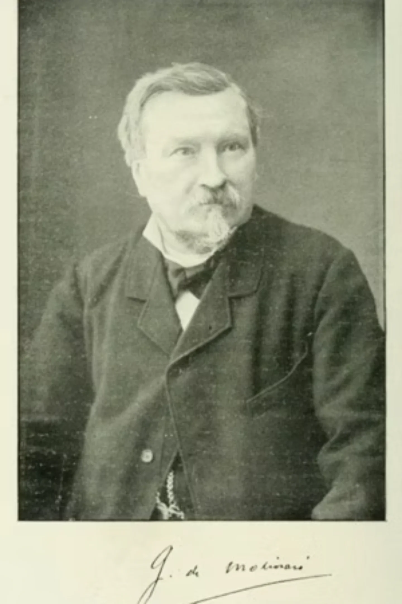

**Întrebare:** Ar trebui impozitele pe venit să fie reduse sau înlocuite cu forme de taxare mai simple și mai mici?

### Poziția socialistă: nu

Impozitele progresive pe venit sunt un instrument fundamental pentru redistribuirea bogăției și finanțarea serviciilor publice (sănătate, educație, protecție socială). Ele sunt deci esențiale pentru dreptatea socială. Cu alte cuvinte, **progresivitatea este mecanismul prin care statul corectează inegalitatea** și finanțează infrastructura colectivă pe care socialiștii o consideră indispensabilă.

### Poziția conservatoare: da

Taxele mai mici încurajează investițiile, crearea de locuri de muncă și creșterea economică. Ele favorizează inițiativa individuală și reduc risipa guvernamentală din sectorul public. În viziunea conservatoare, **taxele trebuie să fie juste și mici** pentru a recompensa efortul și antreprenoriatul, nu pentru a penaliza succesul.

### Poziția libertariană: da

Impozitarea este o formă de furt de stat și un impediment pentru proprietatea privată. Ar trebui redusă drastic sau abolită în favoarea unor servicii complet private. Libertarienii tind spre statul minimal sau chiar spre stat zero. Pentru ei, guvernul ar trebui limitat la funcții strict suverane (apărare, justiție), ceea ce ar justifica mult mai puține taxe decât există în prezent. Cu alte cuvinte, **obiecția libertariană față de impozitare este morală înainte de a fi economică**: este o încălcare a drepturilor de proprietate.

### Poziția centristă: mixtă

Un anumit grad de progresivitate este necesar pentru solidaritate, dar taxele prea mari pot descuraja investițiile. Centriștii nu se bazează pe un principiu fix, ci mai degrabă pe o evaluare a consecințelor. Pentru aceasta, au nevoie de experți. De aceea centrismul este adesea asociat cu o formă de tehnocrație: **nivelul corect al impozitării trebuie determinat prin analiză empirică**, nu prin angajament ideologic.

### Salariul minim

**Întrebare:** Ar trebui legile privind salariul minim să fie abolite pentru a permite negocierea liberă între angajatori și lucrători?

### Poziția socialistă: nu

Salariul minim este esențial pentru a garanta o viață demnă lucrătorilor, a reduce inegalitățile și a lupta împotriva sărăciei. Este un instrument de dreptate socială care îi protejează pe cei mai vulnerabili. În cadrul socialist, **statul trebuie să intervină pentru a corecta dezechilibrul de putere** inerent relației angajator-angajat.

### Poziția conservatoare: da, dar

În principiu, piața trebuie să-și joace rolul de regulator. Un salariu minim poate fi tolerabil, dar numai dacă nu împiedică competitivitatea companiilor și nu trebuie generalizat. Ceea ce contează cel mai mult este responsabilitatea individuală și crearea de locuri de muncă, nu dependența de subvenții. Spre deosebire de poziția libertariană, **conservatorii acceptă o anumită implicare a statului în stabilirea salariilor**, insistând totuși ca aceasta să rămână minimă și dependentă de context.

### Poziția libertariană: da

Salariul minim distorsionează piața muncii, creează șomaj și încalcă libertatea contractuală. Piața ar trebui să determine salariile prin negociere liberă între angajator și angajat. De ce creează salariul minim șomaj? Aceasta este o problemă tehnică, dar ceea ce contează cel mai mult este că pentru libertarieni răspunsul este, înainte de toate, moral. **Un salariu minim este o impunere asupra libertății de a angaja și de a face afaceri.** Când libertarienii spun „piața”, ei se referă la contractul liber negociat între două părți, fără ingerință a statului.

### Poziția centristă: mixtă

Pentru centriști, decizia trebuie să se bazeze pe analiză tehnică. Da, dacă salariul minim nu distruge locuri de muncă; da, dacă promovează creșterea; dar nu dacă nu o face. Salariul minim are un rol social important, dar **nivelul său trebuie ajustat pragmatic**, ținând cont de competitivitatea companiilor și de puterea de cumpărare a lucrătorilor.

### Sănătate

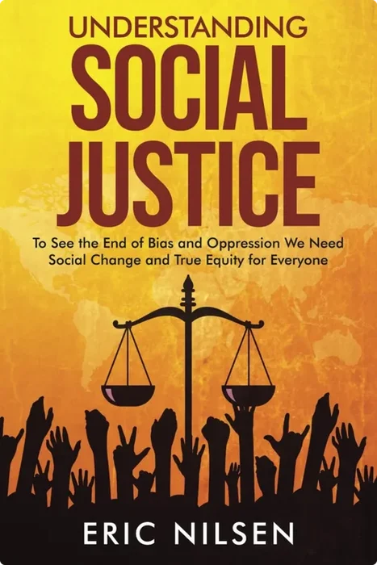

**Întrebare:** Ar trebui sănătatea să fie încredințată piețelor private, mai degrabă decât programelor guvernamentale?

### Poziția socialistă: nu

Accesul la sănătate este un drept fundamental, nu o marfă. Statul trebuie să garanteze un sistem universal de sănătate finanțat public, astfel încât toată lumea să aibă acces la îngrijire, indiferent de venit. Aici regăsim din nou **preocuparea socialistă pentru egalitate, dreptate socială și importanța statului** în organizarea și planificarea serviciilor în interesul general.

### Poziția conservatoare: da

Piețele private pot fi mai eficiente și pot reduce povara fiscală. Statul poate juca un rol minimal pentru cei mai săraci, dar responsabilitatea individuală și asigurările private sunt preferabile. În abordarea conservatoare există întotdeauna **ideea de a combina mecanismele pieței cu acțiune limitată a statului**, mai degrabă decât de a alege una cu excluderea celeilalte.

### Poziția libertariană: da

Piața privată este mai eficientă și mai inovatoare, dar mai presus de toate (iar acesta este argumentul moral fundamental), indivizii au dreptul să-și aleagă propriul sistem. Este o chestiune de suveranitate individuală și de afirmare a drepturilor de proprietate privată. Cu alte cuvinte, **poziția libertariană este mai emphatică deoarece se bazează pe un principiu moral**: dreptul de a ieși complet din sistemul de securitate socială, nu doar de a pleda pentru mai multă implicare privată alături de programele statului.

### Poziția centristă: mixtă

Un sistem mixt este adesea cea mai bună abordare. Statul garantează acces universal și solidaritate (acoperire de bază), în timp ce sectorul privat poate contribui cu diversificare și inovație. Ideal, ar fi nevoie de câte puțin din ambele: **un amestec calibrat atent de experți** pentru a optimiza eficiența și calitatea.

### Mediul

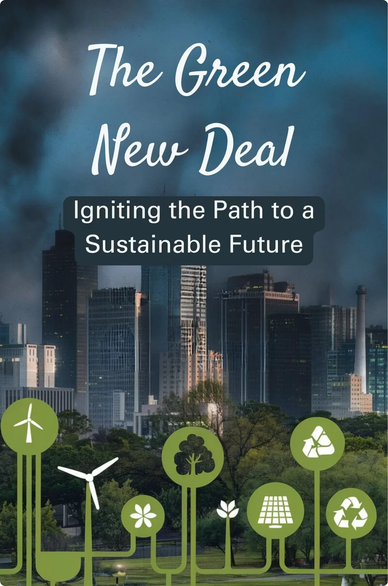

**Întrebare:** Ar trebui reglementările de mediu să fie limitate pentru a permite companiilor să se autoreglementeze?

### Poziția socialistă: nu

Statul trebuie să impună reguli stricte pentru a proteja mediul și a combate schimbările climatice. Piața singură nu poate rezolva aceste probleme, care cer acțiune colectivă și planificare. Într-adevăr, există și o dimensiune mai ideologică: nu doar că piața nu poate rezolva schimbările climatice, dar **în viziunea socialistă, piața însăși este responsabilă pentru poluarea** și daunele de mediu pe care le observăm. Subvențiile sunt considerate necesare pentru a asigura tranziția ecologică, iar liberul schimb internațional trebuie reglementat pentru a proteja mediul.

### Poziția conservatoare: mixtă

În principiu, da, deoarece libertatea de întreprindere este importantă. Totuși, un anumit nivel de reglementare este necesar pentru a proteja mediul ca patrimoniu și resursă. Așa cum se întâmplă adesea cu conservatorii, **un principiu trebuie nuanțat în funcție de context**: libertatea economică este valorizată, dar nu cu prețul distrugerii patrimoniului natural moștenit.

### Poziția libertariană: da

Reglementările de mediu sunt o piedică pentru libertatea economică și drepturile de proprietate. Libertarienii susțin că cel mai bun mod de a proteja mediul este prin proprietate privată, nu prin organizații birocratice. Într-adevăr, **proprietarii sunt mai predispuși să aibă grijă de proprietatea lor decât orice birocrație**. Problemele de mediu pot fi rezolvate de piață, responsabilitate individuală și drepturi de proprietate. Poluatorii trebuie trași la răspundere pentru daunele pe care le cauzează; aceasta este o chestiune de dreptate, nu de reglementare.

### Poziția centristă: nu

Autoreglementarea nu este suficientă. Reglementările de mediu sunt necesare pentru a proteja planeta și sănătatea publică. Totuși, **ele trebuie concepute astfel încât să nu penalizeze excesiv competitivitatea afacerilor** și să încurajeze inovația verde. Poziția centristă, ca întotdeauna, caută să echilibreze imperative concurente prin politici atent proiectate.

### Subvenții

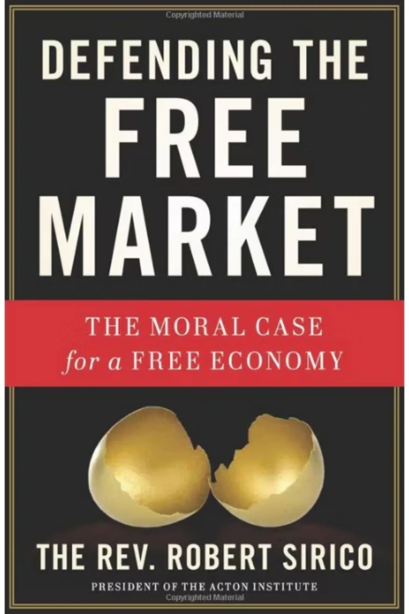

**Întrebare:** Ar trebui companiile să fie private de subvenții și planuri de salvare?

### Poziția socialistă: nu

Subvențiile sprijină inovația, protejează locurile de muncă și dezvoltă sectoare strategice. **Statul este un actor economic și planificator esențial**, iar rolul său este să orienteze economia către priorități definite colectiv, inclusiv tranziția ecologică. Eliminarea subvențiilor ar însemna abandonarea celor mai vulnerabile sectoare și a lucrătorilor la capriciile pieței.

### Poziția conservatoare: da, dar

În principiu, da, pentru a încuraja concurența liberă și responsabilitatea individuală a companiilor. Totuși, sunt posibile excepții pentru industriile naționale strategice. Ne gândim, de exemplu, la armament, industria farmaceutică sau educație. Spre deosebire de poziția libertariană, **conservatorii acceptă intervenția țintită a statului atunci când sunt în joc securitatea națională sau interese strategice**.

### Poziția libertariană: da

Subvențiile și bailouts distorsionează piața, favorizează unele companii în detrimentul altora și creează dependență de stat. Companiile care eșuează ar trebui să falimenteze. Aici din nou există considerații morale privind respectul pentru suveranitate și proprietate privată, dar există și considerații de eficiență. Când companiile sunt împiedicate să eșueze prin subvenții, **se creează ceea ce este cunoscut drept hazard moral**: un stimulent spre iresponsabilitate și imprudență. În cele din urmă, contribuabilul este cel care plătește, ceea ce este profund nedrept.

### Poziția centristă: țintită

Subvențiile ar trebui să fie țintite și temporare, justificate de un interes general (inovație, tranziție ecologică, sectoare strategice). Bailouts ar trebui luate în considerare doar în cazul unei amenințări sistemice majore la adresa economiei. De exemplu, ar putea fi necesar să fie salvate băncile, pentru că altfel s-ar crea condițiile unei panici generale și ale unei recesiuni. **Abordarea centristă cere ca fiecare caz să fie evaluat pe meritele sale**, cu subvenții justificate de necesitate demonstrată, nu de preferință ideologică.

# Diferențe filosofice între familiile politice

<partId>a4c96533-ae9a-45be-8dc2-e0c2534eb89d</partId>

## Diferențe filosofice între familiile politice

<chapterId>e48cff63-15d9-4789-ab6c-f1df06683fce</chapterId>

Când comparăm diferitele familii politice, apar cu siguranță puncte de convergență, dar și incompatibilități profunde. Acest lucru este mai ales vizibil când îi așezăm pe libertarieni lângă alte profiluri ideologice: conservatori, socialiști, centriști. În această parte a cursului, vom explora o serie de divergențe filosofice care dezvăluie adevăratele linii de fractură ce traversează gândirea politică.

Să începem cu întrebarea cea mai fundamentală: natura libertății însăși.

### Libertatea: principiu sau oportunitate?

Pentru a înțelege ce îi separă pe libertarieni de toate celelalte familii politice, trebuie să pornim de la o distincție introdusă de unul dintre marii gânditori liberali francezi. În lucrarea sa din 1849 *Les Soirees de la rue Saint-Lazare*, Gustave de Molinari, discipol al lui Frederic Bastiat, pune în scenă un dialog între trei personaje, fiecare reprezentând o familie politică: socialistul, conservatorul și economistul.

Ceea ce demonstrează Molinari prin aceste dialoguri este izbitor. **Economistul se află în dezacord permanent atât cu socialistul, cât și cu conservatorul.** El este singurul care apără libertatea ca principiu fundamental, unul care nu este subordonat niciunui alt obiectiv. Socialistul vrea să reformeze societatea potrivit idealurilor progresiste; conservatorul vrea să păstreze societatea în starea ei actuală. Amândoi sunt dispuși să restrângă libertățile și să apeleze la stat pentru a-și impune agendele respective.

Viziunea lui Molinari s-a dovedit profetică. Din vremea sa, la mijlocul secolului al XIX-lea, conservatorii și socialiștii au alternat la putere și au realizat exact ceea ce descria el: **instrumentalizarea libertății în serviciul obiectivelor politice.**

### Viziunea conservatoare: ordinea înaintea libertății

Pentru conservatori, ordinea și tradiția au prioritate față de libertate. Prea multă libertate, susțin ei, generează haos și dezordine socială. Libertatea poate fi valorizată, dar numai după ce ordinea a fost ferm stabilită.

În practică, aceasta înseamnă că **libertatea trebuie limitată și nu poate fi lăsată să opereze de una singură.** Ea devine periculoasă ori de câte ori amenință stabilitatea socială, familia sau valorile culturale moștenite. Libertatea de a întreprinde sau de a deține proprietate este apărată, dar întotdeauna condiționată de respectul pentru valorile tradiționale și îndatoririle față de comunitate. Aceasta implică un rol al statului nu doar în chestiuni societale, ci și în domeniul economic, unde libertatea trebuie să rămână supravegheată.

### Viziunea socialistă: dreptatea înaintea libertății

Pentru socialiști, dreptatea socială vine înaintea libertății individuale. Libertatea este înțeleasă nu ca independență față de constrângere, ci ca o capacitate de a acționa, o capacitate care presupune condiții materiale și sociale echitabile.

Cu alte cuvinte, **nu ești cu adevărat liber dacă îți lipsesc hrana sau accesul la servicii esențiale.** Prioritatea politică cade deci pe egalizarea condițiilor. Libertatea este intrinsec legată de dreptatea socială și egalitate; ea se manifestă prin emanciparea de constrângeri economice și sociale precum sărăcia sau excluderea. Această logică cere în mod regulat intervenția statului pentru a garanta drepturi sociale și a redistribui bogăția.

### Viziunea centristă: eficiența înaintea libertății

Centriștii apără anumite libertăți, dar într-un mod oportunist și contextual, fără a aplica vreun principiu general de decizie. Ei își adaptează pozițiile în funcție de provocări specifice și de compromisurile necesare pentru obținerea eficientă a rezultatelor.

Să luăm, de exemplu, Green New Deal: centriștii pot împinge puternic subvenții pentru energia eoliană și sprijin pentru afaceri verzi, nu din angajament principial față de libertate sau chiar față de ecologie, ci pentru că asemenea politici se aliniază cu tendințele dominante. **Această abordare pragmatică dezvăluie o concepție instrumentală asupra libertății**, care converge în cele din urmă cu abordările atât ale conservatorilor, cât și ale socialiștilor. Libertatea este invocată întotdeauna, dar întotdeauna subordonată.

### Viziunea libertariană: libertatea ca axiomă

Libertarienii definesc libertatea ca principiu general, necondiționat, al acțiunii și deciziei. Ea funcționează ca o axiomă din care decurge orice altceva. Libertatea trebuie postulată de la început ca drept fundamental și, simultan, ca datorie: **dreptul de a nu fi agresat și responsabilitatea de a nu agresa pe alții**, cu restituție cerută în caz de culpă.

Libertarienii apără protecția integrală a libertății individuale și a drepturilor de proprietate, cu un minimum de intervenție a statului. Ei se opun constructivismului (planificării centrale) și, indiferent unde se situează pe spectrul libertarian, de la liberali clasici la anarho-capitaliști, împărtășesc obiectivul de a privatiza tot ceea ce poate fi privatizat.

### Convergență asupra scopurilor, divergență asupra mijloacelor

Aici se află o nuanță crucială. Libertarienii pot fi de acord cu socialiștii, conservatorii și centriștii asupra anumitor obiective: apărarea oprimaților, protejarea civilizației, promovarea coeziunii sociale. Dezacordul nu este despre scopuri, ci despre mijloace.

**Libertarienii resping toate soluțiile coercitive care caută să uniformizeze practicile, legile și reglementările.** Ei se opun redistribuirii bogăției, salariilor minime impuse și greutății tot mai mari a statului în economie. Ca alternativă, apără puterea alegerii și principiul libertății responsabile prin procesul de piață: schimb liber, descentralizat, întemeiat pe contracte voluntare.

## Ordine spontană vs. ordine construită

<chapterId>504aa7da-ecd5-4177-87d9-c8792f58c8e3</chapterId>

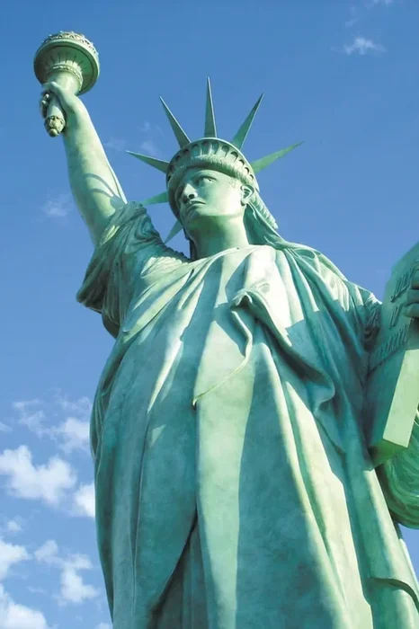

O altă linie majoră de fractură îi separă pe cei care cred că procesul politic este superior procesului de piață de cei care susțin viziunea opusă. Primul grup apără o ordine construită, proiectată de sus în jos. Al doilea apără o ordine spontană, care emerge de jos în sus. Această distincție este fundamentală pentru înțelegerea sensibilităților politice și îi plasează pe libertarieni împotriva practic tuturor celorlalte familii.

### Constructivismul: un consens transpartinic

Constructivismul nu este monopolul unei singure tabere politice. El îi unește pe centriști, conservatori și socialiști în jurul unei convingeri comune: **superioritatea procesului politic asupra procesului de piață.** Pentru toate aceste curente, statul este mai bine echipat să organizeze societatea într-un mod just și eficient. Ele privilegiază planificarea centrală, deși în grade diferite în funcție de familie.

Dacă rezumăm constructivismul într-o singură propoziție: este credința că un guvern central poate crea, prin forța legii, o ordine socială bună pentru cel mai mare număr.

### Analiza lui Hayek asupra constructivismului

Pentru a înțelege miza, putem urma analiza lui Friedrich Hayek. Constructiviștii cred ferm că este posibil să construiești o societate conformă dorințelor și idealurilor lor. Ei consideră intervenția deliberată, planificată, necesară pentru a modela societatea după viziunea lor, fie conservatoare, fie progresistă.

În spatele acestei credințe se află o presupunere mai veche, care poate fi urmărită până la Platon și teoria sa a filosofului-rege: **ideea că anumiți oameni sunt mai bine echipați să-i conducă pe alții și să organizeze societatea.** Aceasta este o credință fundamentală în superioritatea unora asupra altora.

Dar Hayek arată că, dincolo de această chestiune filosofică, există o imposibilitate practică.

### Ordine spontană: organizare de jos

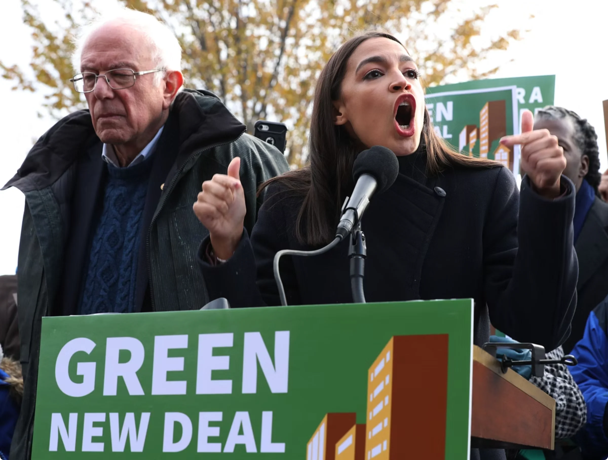

Ordinea spontană nu este un argument împotriva organizării. Dimpotrivă, pentru Hayek, este unul dintre cele mai puternice motoare ale progresului economic și social. Ea este definită ca produsul interacțiunilor libere ale indivizilor în societate, rezultând din acțiunea umană, dar nu din proiectarea umană deliberată.

Regulile, instituțiile și practicile care emerg spontan nu sunt planificate sau impuse de o autoritate centrală. Ia în considerare următoarele exemple:

Limba: franceza, engleza, germana, niciuna dintre acestea nu a fost construită într-un birou în care intelectuali s-au adunat să decidă regulile gramaticii și ortografiei. **Ele sunt rodul unei organizări lente, organice, construite prin interacțiuni istorice.**

Coduri sociale: moralitatea, politețea, obiceiurile sunt și ele produsul unei coordonări spontane care s-a dezvoltat progresiv prin interacțiune umană.

Banii-marfă: de la scoici la metale, aurul a apărut ca cel mai bun ban ales de piață, nu de vreo autoritate centrală, prin experiență, concurență și evaluările subiective ale indivizilor.

### Problema cunoașterii

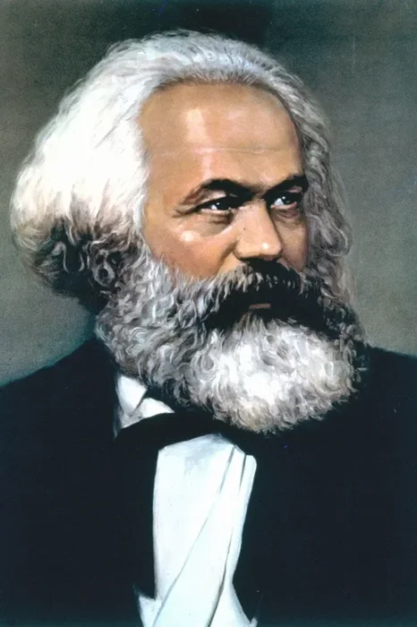

Argumentul fundamental al lui Hayek în favoarea ordinii spontane se bazează pe natura informației. Într-un articol din 1945, *The Use of Knowledge in Society*, el scria:

> Cunoașterea nu există niciodată într-o formă concentrată sau integrată, ci doar ca fragmente dispersate de cunoaștere incompletă și frecvent contradictorie deținute de toți indivizii distincți.

Piața depinde de informație, dar numai indivizii distincți pot ști care sunt nevoile lor și cât costă lucrurile. Valoarea se sprijină în aprecierea subiectivă, în mințile indivizilor. **Ea nu poate fi decretată autoritar sau central.** Valoarea este subiectivă, motiv pentru care este cunoscută doar într-un mod limitat, fragmentat și local.

Sistemul prețurilor este cel care permite milioanelor de oameni care nu se cunosc să-și coordoneze cunoștințele și competențele. Într-o piață liberă, prețurile transmit informații despre nevoile și competențele fiecărui participant. Ele le permit oamenilor să intre în relații și să facă schimb. Acestea sunt, desigur, prețuri de piață, stabilite prin negociere voluntară între indivizi.

Planificatorul central, așezat într-un minister sau birou, nu cunoaște adevăratul preț al lucrurilor deoarece nu este angajat în interacțiune și schimb. Astfel, **orice pretenție de a organiza științific societatea agravează paradoxal problemele în loc să le remedieze.**

Când statul fixează prețurile, pentru că nu cunoaște decât o mică parte din preferințele consumatorilor și specificitățile locale, provoacă crize. Ia în considerare controlul chiriilor: când chiriile sunt plafonate, proprietarilor nu le mai este profitabil să-și ofere proprietățile spre închiriere, iar penuria de locuințe urmează.

### Piața liberă ca reglementare autentică

Pentru libertarieni, adevărata reglementare a societății nu este democrația (care își are utilitatea ca mod de desemnare a reprezentanților), **ci înainte de toate piața liberă**.

Piața îndeplinește trei funcții esențiale:

1. **Fără o piață liberă, nu există busolă.** Prețurile sunt indicatori fiabili pentru ghidarea deciziilor economice și sociale.
2. **Piața dezvăluie preferințe.** Este un mecanism optim pentru descoperirea și agregarea preferințelor individuale autentice. Prețurile reflectă oferta și cererea.
3. **Piața permite exercitarea deplină a dreptului de a decide.** Actorii își pot determina liber propriile afaceri potrivit valorilor lor personale. Există aici o dimensiune etică: a lăsa fiecare persoană să fie actorul propriei vieți și să-și facă propriile alegeri.

### Pro-business versus pro-piață

Este important să distingem clar între pro-business și pro-piață, două poziții care sunt adesea confundate.

Printre socialiști, centriști și conservatori deopotrivă, găsim mulți politicieni pro-business. Pentru ei, concurența este un instrument de guvernanță pentru atingerea obiectivelor economice. Ea este obținută prin reglementări care garantează o concurență presupus echitabilă: legi anti-monopol, norme sectoriale și de mediu. Planurile de stimulare și subvențiile sunt justificate prin consecințe sociale precum prevenirea pierderilor de locuri de muncă și a recesiunii. **În viziunea pro-business, piața este fragilă și are nevoie de stat pentru a o salva.**

Pentru susținătorii pro-piață, concurența este rezultatul natural al liberei întreprinderi, care exclude puterea centralizată a statului. Aceasta implică dereglementare (suprimarea obstacolelor la libertate și a reglementărilor care constrâng proprietatea privată) și permisiunea ca afacerile să eșueze, deoarece **eșecul permite pieței să se reorganizeze natural și deschide terenul pentru actori mai capabili.** Dacă o afacere eșuează, a făcut alegeri proaste și trebuie să suporte consecințele.

Diferența este semnificativă. Susținătorii pro-business caută adesea o alianță cu marile corporații în detrimentul actorilor mai mici. Acesta este un capitalism de aparență care, în realitate, reduce considerabil libertatea prin credința sa în constructivism și planificare.

### Poziția libertariană

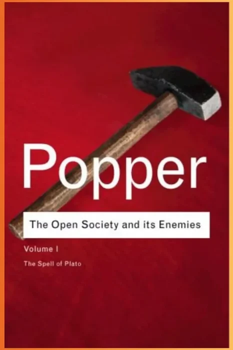

În concluzie, libertarienii se găsesc oarecum singuri împotriva celorlalte familii politice, toate constructiviste. Libertarienii susțin că **societatea se organizează natural prin mecanisme spontane de coordonare** și că cooperarea voluntară rămâne superioară constrângerii organizate, chiar și atunci când este bine intenționată, pentru construirea unei societăți juste și prospere.

Clasa politică în general nu este favorabilă ordinii spontane deoarece aceasta îi amenință puterea. Fie că ești politician conservator, centrist sau socialist, vei tinde să fii ostil ordinii spontane și pieței pentru că vrei să controlezi treburile. Dar pentru libertarieni, adevărata putere de a îmbunătăți societatea nu se află în puterea politică, ci în puterea alegerii: schimb liber și voluntar, piața.

Două aspecte trebuie ținute împreună. Eficiența: **piețele libere coordonează informația dispersată mai bine decât planificarea centralizată**, așa cum a demonstrat Hayek. Și dreptatea: consimțământul reciproc respectă demnitatea umană mai mult decât constrângerea și constructivismul ar putea-o face vreodată.

Toate acestea cer însă ca drepturile și îndatoririle să fie clar definite. Piața poate fi un proces spontan, dar trebuie să se conformeze dreptului, în special drepturilor de proprietate, și necesită neintervenția statului în treburile economice și sociale. Statul ar trebui să se limiteze la aplicarea drepturilor fundamentale precum drepturile de proprietate și să se abțină de la intervenția în orice altceva.

## Individualism vs. colectivism

<chapterId>ba205097-37f8-4503-9c1e-97eb31e7678c</chapterId>

O altă linie de clivaj între familiile politice privește relația dintre individ și societate. Este colectivitatea un scop sau un mijloc pentru individ? Și invers, este individul un scop sau un mijloc pentru colectiv? Aceste două întrebări definesc opoziția dintre individualism și colectivism.

### Individualismul potrivit lui Mises

Economistul austriac Ludwig von Mises a oferit o clarificare decisivă a acestei probleme. El a scris: *Doar individul gândește, doar el raționează, doar el acționează.*

Aceasta înseamnă că individualismul, înțeles corect, se opune noțiunii că entități sociale precum „societatea” sau „națiunea” ar putea exista independent de indivizii care le compun. **O colectivitate nu are o existență proprie dincolo de acțiunile membrilor săi individuali.** Nu putem vorbi în mod semnificativ despre acțiunea statului, a unei țări, a unei companii sau a unui sindicat. De ce? Pur și simplu pentru că aceste entități nu au voință sau gândire proprie. Ele acționează doar prin intermediul indivizilor.

Ia în considerare o limbă: franceză, engleză, germană. Fiecare există doar prin cei care o vorbesc. Dacă nimeni nu o vorbește, ea încetează să existe. Același principiu se aplică tuturor corpurilor sociale.

### Dimensiunea morală

Acest punct de vedere metodologic poate fi transpus în sfera morală și politică. **Singurul agent moral este individul.** Individul este cel care poate fi calificat drept bun sau rău, drept sau nedrept. Nu există o societate dreaptă sau nedreaptă în sine; trebuie examinate relațiile dintre indivizi. Pentru a judeca moral, trebuie să ne referim la indivizi care acționează, nu la colectivități.

Un alt punct pe care Mises îl subliniază: individul nu este un atom izolat. Individualismul nu trebuie confundat cu autosuficiența sau mizantropia. Ființa umană este o creatură socială. Individualismul promovează cooperarea și asocierea, **cu condiția ca acestea să se bazeze pe consimțământul liber al participanților.** Ființa umană își poate dezvolta potențialul deplin doar în relație cu alții, cu condiția ca această cooperare să fie voluntară.

### Kant și autonomia morală

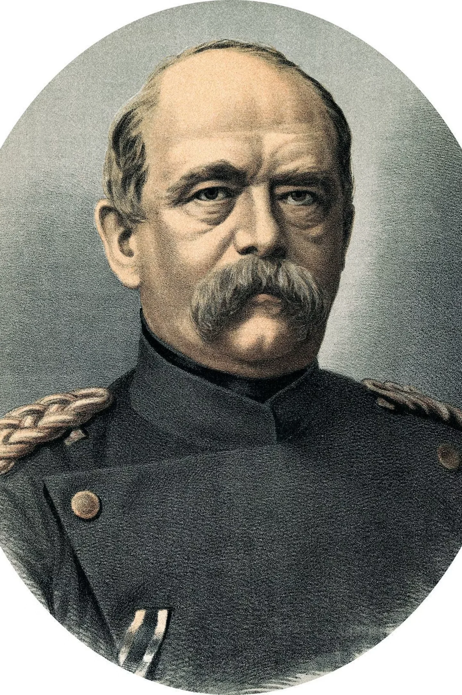

Acest individualism are rădăcini profunde, care pot fi urmărite până la creștinism, la filosofia greacă și romană. Dar să-l cităm pe filosoful iluminist Immanuel Kant. Pentru el, individualismul apără capacitatea și dreptul indivizilor de a judeca pentru ei înșiși, de a-și alege propriile obiective și de a acționa în consecință.

Acesta este dreptul inalienabil al fiecărei ființe de a rămâne stăpân și posesor al persoanei sale și al bunurilor pe care le-a dobândit legitim și **de a fi în poziția de a-și defini propriile scopuri și valori.** Aceasta conduce la afirmația că ființa umană este un scop în sine, nu un simplu mijloc. Un stilou este un simplu mijloc, aruncat când nu mai este necesar. Numai o ființă înzestrată cu rațiune este un scop în sine.

Acesta este atât un principiu antropologic (întemeiat pe capacitatea umană de autonomie și autoguvernare), cât și un principiu moral. Formula celebră a lui Kant, *Sapere aude* („Îndrăznește să gândești pentru tine”), preluată de la poetul Horațiu, a fost făcută motto-ul Iluminismului în eseul său din 1784 *What is Enlightenment?* Ea simbolizează ieșirea din minorat: o stare în care oamenii sunt incapabili să-și folosească înțelegerea fără direcția unei clase sau autorități superioare.

Kant îi încurajează pe oameni să se emancipeze, să gândească pentru ei înșiși, să-și asume întreaga responsabilitate pentru gândirea lor. Unul dintre obstacolele în calea acestei autonomii, notează Kant, este lenea și lașitatea: **tentația de a te refugia în gândirea gata făcută**, care este și ceea ce conduce la colectivism.

Consecința pentru instituții este clară: ele există pentru a servi înflorirea indivizilor, protecția lor și realizarea potențialului lor deplin. Societatea este un mijloc, nu un scop.

### Filosofia colectivistă

Colectivismul apare în parte deoarece oferă un fel de ușurință, o protecție, o securitate seducătoare pentru mulți. Individualismul care afirmă autonomia fiecărei persoane poate părea înfricoșător. Este toată lumea pregătită să-și asume întreaga responsabilitate pentru existența sa? Nu întotdeauna, iar **uneori este mai simplu să te bazezi pe o autoritate care impune un mod de viață.**

În concepția colectivistă, interesele private ale indivizilor trebuie subordonate sistematic deciziilor luate în numele unei entități superioare care se presupune că întruchipează interesul general sau binele comun. Această entitate poate fi statul, națiunea, biserica, dar astăzi, odată cu social-democrația, este mai ales majoritatea democratică. Regula majorității determină binele și răul, adevărul și falsul.

Colectivitatea devine prioritatea. Obiectivele colective depășesc obiectivele individuale, iar instituțiile servesc societatea chiar în detrimentul persoanelor.

### Marx și materialismul istoric

Un mare gânditor al colectivismului este Karl Marx, care a justificat superioritatea colectivului asupra individului prin ceea ce numea materialism istoric:

> Nu conștiința oamenilor le determină existența; dimpotrivă, existența lor socială le determină conștiința.

Conștiința nu este primară, ci secundară, determinată de existența socială: starea relațiilor economice și sociale, opoziția dintre clase. **Individul nu este nimic în afara acestei realități.** El gândește prin clasa sa socială, trăiește, se comportă și acționează așa cum îi dictează clasa, dar inconștient. De aici imperativul marxist de a deveni conștient de interesele propriei clase pentru a le realiza.

### Multiplele fețe ale colectivismului

După cum observa Mises: *Nu există o ideologie colectivistă uniformă, ci multe doctrine colectiviste. Fiecare exaltă o entitate colectivă diferită.*

Putem clasifica colectivismele în două grupuri. Colectivismele de dreapta, precum național-socialismul și fascismul lui Mussolini, exaltă națiunea și rasa ca entități superioare individului. Colectivismele de stânga, comunismul și socialismul, acordă prioritate clasei muncitoare și egalității sociale, tratând clasa socială ca entitate supremă care definește individul.

Spectrul merge de la social-democrație la național-socialism, dar **aceste doctrine converg într-o ostilitate comună față de libertatea individuală și o justificare a violenței.**

### Societățile deschise și închise ale lui Popper

Karl Popper, filosoful născut în Austria care a emigrat mai întâi în Noua Zeelandă și apoi în Marea Britanie, a analizat aceste opoziții cu o claritate deosebită în *The Open Society and Its Enemies*:

> Numesc societate închisă societatea magică sau tribală, iar societate deschisă aceea în care indivizii sunt confruntați cu decizii personale.

Două modele de societate, două principii de organizare socială complet opuse. Societatea închisă este colectivistă, sprijinită pe mentalitate tribală: un refuz al libertății critice, al schimburilor externe și al progresului, și idealizarea unei ordini statice. **Societatea deschisă recunoaște dreptul individului de a judeca pentru sine**, acordând primat alegerii libere a valorilor, credințelor și relațiilor.

### Totalitarismul ca societate închisă modernă

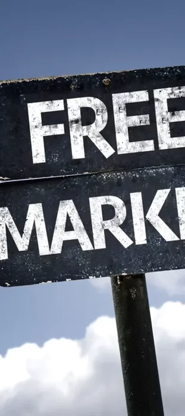

Totalitarismul este expresia modernă a societății închise. Reprezintă forma cea mai radicală, bazându-se pe o ideologie dogmatică ce duce la cenzură sistematică, propagandă de stat, cultul liderului și mecanisme de control și supraveghere. Individul nu există ca atare; există **o formă de dezumanizare în care individul își pierde rădăcinile**, memoria și credințele, devenind complet absorbit de comunitate și deci ușor de manipulat.

### Fragilitatea societății deschise

Popper subliniază cu mare pertinență că **societatea deschisă rămâne inerent fragilă.** Această societate care favorizează gândirea critică, libertatea individuală și responsabilitatea poate aluneca ușor în colectivism printr-o fascinație față de autoritate.

De ce? Poate dintr-o lipsă de securitate. Responsabilitatea pe care individualismul o implică poate părea înfricoșătoare și riscantă. Trebuie să-ți faci propriile alegeri și poți eșua. Apare tentația de a căuta refugiu în protecția comunitară sau în tendințe nostalgice către un trecut idealizat. Societatea deschisă se confruntă cu provocări care o amenință și astăzi, în special impulsurile comunitariene pe care le vedem dezvoltându-se în timpul nostru și tentația recurentă a violenței.

# Tendința politică în rândul bitcoinerilor

<partId>c0de3201-5c74-4854-b872-15a27165d228</partId>

## Tendința politică în rândul bitcoinerilor

<chapterId>89b42c72-bd73-465d-b420-e35d7c5de07c</chapterId>

În această ultimă parte a cursului, ne îndreptăm către Bitcoin. Care este natura lui? Este un proiect politic? Este de dreapta, de stânga sau cu totul altceva? Și care este tendința politică a celor care îl folosesc? Acestea sunt întrebările pe care trebuie să le abordăm acum.

### Este Bitcoin un proiect politic?

Bitcoin este o [criptomonedă](https://planb.academy/resources/glossary/cryptocurrency) descentralizată, creată de Satoshi Nakamoto în 2008, care permite tranzacții financiare [peer-to-peer](https://planb.academy/resources/glossary/peertopeer-p2p) fără a necesita încredere în vreun intermediar.

Este guvernat de un protocol software [open source](https://planb.academy/resources/glossary/foss). Nu există CEO, nici sediu central, nici plan de marketing, nici autoritate desemnată. **Nicio companie nu stă în spatele Bitcoin și nicio entitate politică sau guvern nu îl controlează.**

#### O tehnologie aparent neutră

Această natură descentralizată poate crea impresia că Bitcoin este pur și simplu o inovație tehnologică, neutră și apolitică, comparabilă cu Internetul în secolul al XX-lea sau cu tiparul în secolul al XIV-lea. Totuși, știm deja că atât Internetul, cât și tiparul, deși au fost inovații tehnologice, **au avut consecințe sociale, economice și politice profunde**.

Același lucru este valabil pentru Bitcoin, iar Satoshi Nakamoto ne-a lăsat mesaje pentru a-și clarifica intenția.

#### Defectul sistemului fiat

> Problema fundamentală a monedelor convenționale este încrederea care trebuie acordată în ele pentru ca ele să funcționeze. Trebuie să ai încredere că banca centrală nu va devaloriza moneda, dar istoria monedelor fiat este plină de încălcări ale acestei încrederi.

Acest citat din Satoshi Nakamoto este esențial pentru înțelegerea filosofiei din spatele Bitcoin. Monedele fiat sunt monede care nu sunt susținute de o marfă, de ceva real și fizic. Sunt bani de hârtie care se sprijină integral pe autoritatea instituției care îi impune și, prin urmare, pe încredere. **Când o instituție deține control total asupra banilor, tentația de a abuza este prea puternică.** Istoria a arătat acest lucru în mod repetat.

#### Mesajul blocului genesis

**Bitcoin s-a născut în reacție directă la criza financiară din 2008** și la intervenționismul monetar care a urmat. În primul bloc minat vreodată, Satoshi Nakamoto a inserat un titlu simbolic din London Times:

> The Times 03/Jan/2009 Chancellor on the brink of a second bank bailout.

Intenția este inconfundabilă: să ofere o alternativă la sistemele bancare centralizate.

#### Consecințele devastatoare ale intervenționismului monetar

De fiecare dată când o criză zdruncină lumea financiară sau când lovește un eveniment global precum pandemia Covid-19, miliarde peste miliarde de dolari și euro sunt create pentru a salva bănci, afaceri sau indivizi. Aceste planuri de salvare au consecințe devastatoare.

Injectarea de bani în sistem (inflație monetară) se traduce prin devalorizarea monedei. Cu aceeași sumă de bani, poți cumpăra din ce în ce mai puțin, deoarece acești bani proaspeți nu reflectă o creștere economică autentică. **Această inflație este un impozit ascuns, impus fără consimțământul cetățenilor.** Majoritatea oamenilor nu văd că politica guvernamentală a dus la creșterea prețurilor, care sunt pur și simplu reflectarea devalorizării monedei. Este echivalentul unui furt legal, o spoliere instituționalizată.

Consecințele urmează logic: sărăcirea clasei de mijloc (în timp ce bogații pot captura banii noi care intră în sistem prin bănci și îi pot plasa în active speculative), frica de viitor, tensiuni sociale și politice, insecuritate și, mai larg, o pierdere a încrederii în instituțiile tradiționale. Acest potop de bani poate alimenta și corupția politică și financiară, cronyism-ul dintre stat și marile corporații și birocrația în creștere.

### Bitcoin ca proiect de transformare socială

**Bitcoin merge așadar mult dincolo de o simplă inovație financiară sau tehnologică.** A fost conceput cu trei scopuri:

1. **Să limiteze puterea guvernelor asupra banilor**, împiedicând instituțiile să folosească moneda în scopuri politice precum cheltuielile publice, războaiele și controlul ideologic.
2. **Să emancipeze individul**, restabilind controlul asupra patrimoniului și vieții sale. Un guvern poate lua euro din contul tău bancar, casa ta, acțiunile tale, aurul tău. Dar nu îți poate lua bitcoinii, deoarece Bitcoin, prin natura sa descentralizată, scapă supravegherii și controlului. Îi deții tu însuți, fără să depinzi de vreo terță parte de încredere.
3. **Să protejeze împotriva [inflației](https://planb.academy/resources/glossary/inflation).** Bitcoin este o monedă deflaționistă; oferta sa este limitată la 21 de milioane de unități și nicio instituție, bancă sau guvern nu poate crea mai mult. Valoarea sa derivă atât din utilitatea, cât și din raritatea sa.

#### Bitcoin ca suveranitate individuală

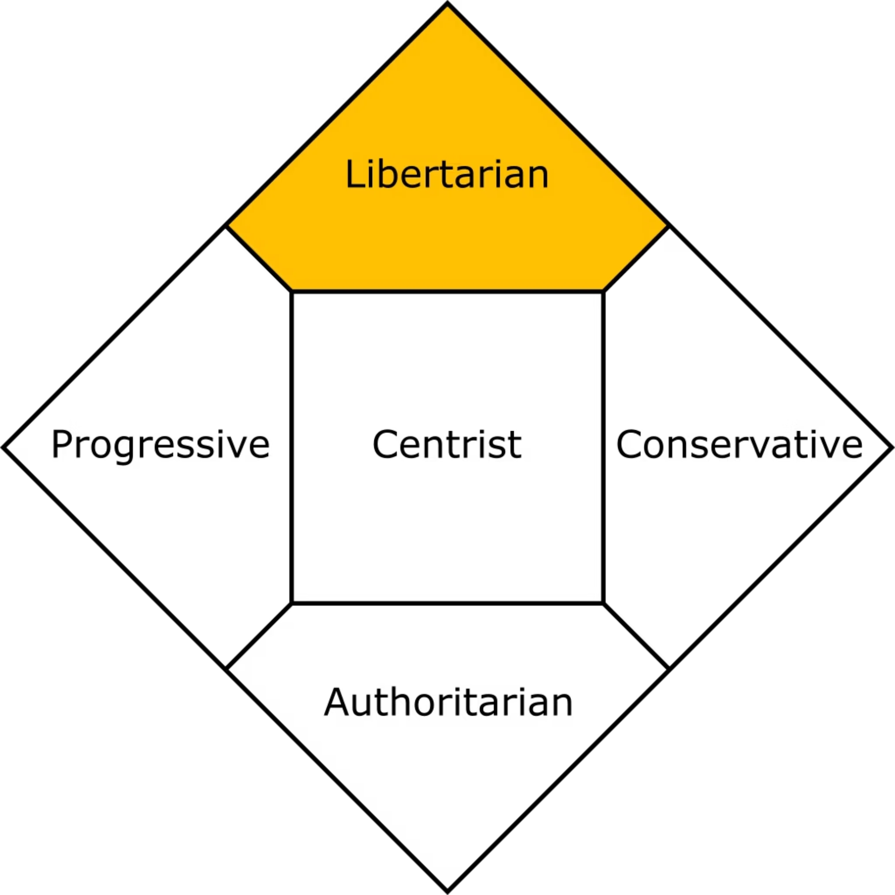

În finanțele tradiționale, nu poți poseda cu adevărat propriile active. Ceea ce deținem sunt întotdeauna creanțe asupra intermediarilor financiari. **Depindem în întregime de instituțiile bancare.** Cu Bitcoin, avem proprietate directă și suverană asupra deținerilor noastre. Este pur și simplu actul de a fi propria bancă, deținând cheile private care dau acces la bitcoinii proprii. Dacă ne deținem propriile chei, nimeni nu le poate confisca, pentru că ele rezidă în mintea noastră.

#### O amenințare la adresa statului-providență

Bitcoin reprezintă și o provocare la adresa statului-providență: un stat care cheltuiește peste venituri pentru a satisface cereri de drepturi economice și sociale (securitate socială, ajutoare de șomaj, pensii). Bitcoin pune sub semnul întrebării cei trei piloni pe care se sprijină acest sistem:

1. **Sistemul fiscal**, care este insuficient pentru a acoperi toate cheltuielile.
2. **Monopolul monetar**, capacitatea de a emite bani pentru a finanța cheltuielile prin datorie.
3. **Supravegherea tranzacțiilor**, capacitatea de a împiedica oamenii să folosească orice monedă alta decât fiat-ul impus de stat.

Ia în considerare alegoria peșterii, actualizată pentru epoca noastră monetară. Adânc în peșteră, prizonierii privesc umbrele de pe perete și văd euro, imaginându-și că este singura monedă posibilă, având încredere în autoritatea care o emite. Apoi, unii prizonieri scapă în aer liber și descoperă Bitcoin. **Bitcoin este o ieșire, un mijloc de emancipare din peștera iluziilor monetare.**

#### Protecție pentru disidenți și victime ale opresiunii

Bitcoin servește și ca protecție pentru disidenți și victime ale opresiunii în țări care experimentează război, dictatură sau hiperinflație. Acest lucru poate părea îndepărtat pentru cei dintre noi din democrațiile moderne, dar **această capacitate de rezistență la cenzură și confidențialitate consolidată este un progres prețios** pentru libertățile individuale.

### Un proiect moral cu consecințe politice

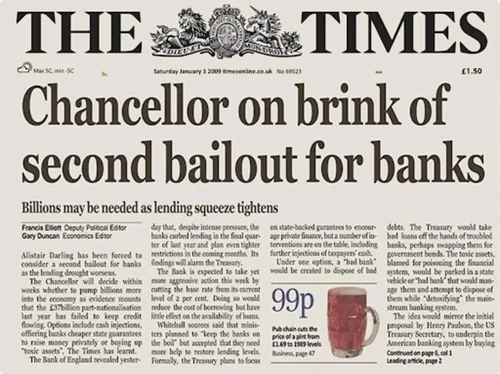

În concluzie: **Bitcoin nu a fost proiectat pentru a-i face pe oameni bogați, ci pentru a-i face liberi.** Nu este de dreapta sau de stânga. Este înainte de toate un proiect moral cu consecințe politice. Cineva poate îmbrățișa Bitcoin indiferent de afilierea politică, deoarece nu este legat de nicio ideologie, nicio țară, nicio religie.

Bitcoin realizează trei lucruri. În primul rând, permite proprietate efectivă, care este un stimulent fundamental pentru responsabilitatea individuală: când cineva deține ceva, are grijă de acel lucru. În al doilea rând, protejează valoarea creată prin muncă: când cineva deține roadele muncii sale, este încurajat să muncească și să dea ce are mai bun. În al treilea rând, păstrează confidențialitatea și viața privată, un drept fundamental, deoarece atunci când cineva poate dezvălui doar ceea ce alege să dezvăluie, trăiește fără frică și poate stabili relații autentice de încredere.

Fără a revendica explicit vreo tabără politică, **Bitcoin poartă în el semințele unei revoluții tăcute**, una care este mai întâi morală și apoi politică.

Dar Bitcoin nu a apărut din neant. Se sprijină pe progrese în matematică, fizică, informatică și filosofie. Satoshi Nakamoto, deși strălucit, a construit pe idei care erau deja în aer. Printre cele mai importante dintre acestea se numărau ideile mișcării [cypherpunk](https://planb.academy/resources/glossary/cypherpunks).

## Cine sunt cypherpunks?

<chapterId>dc18ba9a-c242-472a-a717-531a5f125737</chapterId>

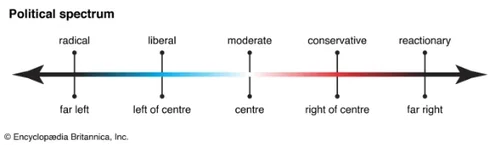

Cypherpunks sunt pionierii unei mișcări care apără libertatea umană în era digitală. Rădăcinile intelectuale ale Bitcoin nu pot fi înțelese fără ei.

### Contextul anilor 1990

La începutul anilor 1990, contextul era distinctiv. Afacerile și guvernele începeau să exercite un control tot mai mare asupra tehnologiilor informației și asupra Internetului emergent. Această perioadă a marcat dezvoltarea rapidă a acestor tehnologii, dar și o anxietate crescândă față de supravegherea în masă și încălcarea sistematică a vieții private a cetățenilor.

În fața acestei anxietăți, gânditori libertarieni și anarhiști s-au unit pentru a acționa. Viziunea lor era clară: **să facă anonimatul și libertatea financiară accesibile tuturor prin instrumente criptografice digitale**, scăpând astfel de controlul guvernamental. Ei și-au propus să dezvolte tehnologii care să permită cetățenilor să-și păstreze viața privată și autonomia în activitățile lor online cotidiene.

#### Lista de discuții și manifestul

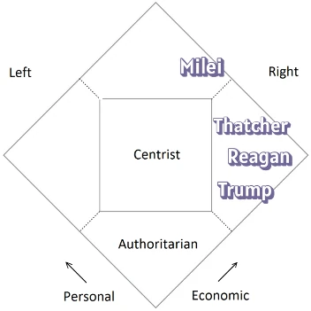

În 1992, Tim May și Eric Hughes au lansat prima listă de discuții Cypherpunk. Această platformă a devenit rapid centrul nervos al mișcării, reunind dezvoltatori, criptografi și apărători ai libertății digitale. Pe aceeași listă avea să distribuie Satoshi Nakamoto pentru prima dată [Cartea albă](https://planb.academy/resources/glossary/white-paper) Bitcoin în 2008.

În martie 1993, Eric Hughes a publicat *A Cypherpunk's Manifesto*, un text relativ scurt, dar fondator:

> Confidențialitatea este esențială pentru o societate deschisă în era electronică. Nu ne putem aștepta ca guvernele, corporațiile sau alte organizații mari să ne garanteze confidențialitatea.
>

> Eric Hughes, A Cypherpunk's Manifesto, 23 martie 1993.

Motivația fundamentală este clară: **confidențialitatea este un element-cheie al libertății și trebuie construită de indivizii înșiși**, nu așteptată ca un cadou din partea corporațiilor sau guvernelor.

#### Filosofie: [criptografia](https://planb.academy/resources/glossary/cryptography) înaintea instituțiilor

Cypherpunks își pun încrederea în sisteme criptografice descentralizate, nu în instituții centralizate precum bănci sau guverne. Acesta este un principiu care reapare direct în designul lui Satoshi Nakamoto pentru Bitcoin.

Politic, ei caută să construiască rețele descentralizate în care deciziile sunt luate colectiv, fără ca o singură entitate să-și poată impune voința. **Orice centralizare este percepută ca întemeiată pe constrângere, nu pe consimțământ.** Aceasta rezonează cu filosofia libertariană potrivit căreia consimțământul este norma fundamentală a dreptății. Nimic nu poate fi just dacă este impus prin forță de o autoritate centralizată.

Manifestul afirmă, de asemenea, că într-o societate deschisă confidențialitatea cere sisteme de tranzacții anonime. Până acum, numerarul a fost principalul sistem de acest tip. Dar într-o societate digitală în care numerarul dispare, **trebuie inventată o monedă digitală cu aceleași proprietăți de anonimat.** Și exact aceasta avea să sosească odată cu Bitcoin.

#### „Cypherpunks write code”

Cypherpunks nu se mulțumesc cu speranțe. Ei intervin activ pentru a crea spații de libertate și autonomie. De aici formula care încheie manifestul:

> Cypherpunks write code.

Pentru Eric Hughes, drumul către libertate trece prin construirea activă a sistemelor anonime care fac diviziunile politice arbitrare irelevante. **Codul devine instrumentul fundamental pentru transformarea unei idei abstracte de libertate în realitate.** De aceea Satoshi Nakamoto avea să spună că a scris întregul cod Bitcoin înainte de a scrie măcar white paper-ul.

### Moștenirea: Bitcoin ca realizare cypherpunk

Începând cu 2008, Bitcoin a devenit prima concretizare reușită a unei monede electronice necenzurabile și suverane. Oferă o alternativă monetară descentralizată, pseudonimă, dificil de controlat de autorități. Fie adoptat de activiști de dreapta sau de stânga, de apărători ai libertății sau egalității, sau pur și simplu de economisitori fără etichetă politică, **el oferă fiecărui individ posibilitatea de a se emancipa de sistemul financiar tradițional** și de a-și recăpăta controlul asupra banilor și, prin urmare, asupra libertății.

Din acest punct de vedere, fără să pretindă explicit apartenența la vreo tabără politică, Bitcoin poartă semințele unei revoluții tăcute și se alătură părții de sus a cadranului în diagrama lui Nolan.

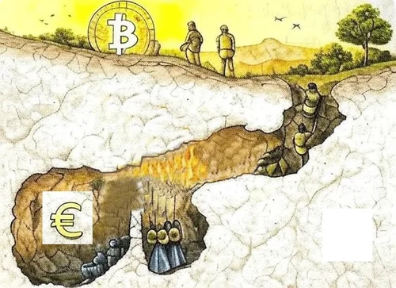

## Cine ar trebui să decidă?

<chapterId>cfc7688e-d647-4af1-880d-c70d3ae7d823</chapterId>

De-a lungul acestui curs, am încercat să arăt că adevăratul clivaj nu este între stânga, dreapta și centru, toate împărtășind un postulat statist. În cele din urmă, toate familiile politice clasice împărtășesc o neîncredere față de piața liberă și o înclinație pentru intervenționismul statal.

Dar ce facem cu cei care vor mai puțin guvern și mai puțină centralizare? Utilizatorii Bitcoin, de exemplu, care vor să pună capăt monopolului asupra creării de bani. Cum îi plasăm pe spectrul politic?

### Adevăratul clivaj

De fapt, **adevăratul clivaj politic se află în principiile filosofice fundamentale**: libertate sau constrângere, consimțământ voluntar sau compulsiune, individul responsabil sau colectivul.

Modul corect de a gândi politica este să pornești de la principii etice, nu de la etichete. Întrebarea politică devine atunci: *vrei să iei deciziile importante din viața ta sau vrei ca altcineva să le ia pentru tine?*

La un nivel mai general, întrebarea filosofică este aceasta: *ar trebui organizarea socială să fie produsul unui plan deliberat conceput și impus de clasa politică, sau rezultatul unei evoluții libere care emerge din interacțiuni voluntare între toți actorii vieții economice și sociale?*

#### O familie politică ignorată: libertarienii

Acest nou clivaj politic, bazat pe opoziția dintre principii, scoate la lumină o familie politică foarte reală, dar adesea ignorată de publicul larg: libertarienii.

Dintr-un punct de vedere libertarian, **indivizii au atât dreptul, cât și responsabilitatea de a-și lua propriile decizii.** În contrast, familiile politice convenționale, de la stânga la dreapta, cred că guvernul ar trebui să ia unele sau multe dintre deciziile importante din viața unui individ și din viața economică în general.

Dar de ce ar trebui unii să-și impună stilul de viață și viziunea asupra lumii altora?

#### Libertatea ca cadru pentru coexistență

Într-un regim autentic de libertate, cei care aderă la idealurile stângii pot trăi potrivit principiilor lor. Sunt liberi să renunțe la posesiunile lor, să împartă mijloacele de producție pe care le dețin sau să-și doneze salariile unei organizații la alegere, care ar putea redistribui aceste fonduri celor mai dezavantajați sau sprijini inițiative culturale și afaceri care promovează ocuparea forței de muncă.

În același fel, cei care împărtășesc valorile dreptei au dreptul să trăiască potrivit convingerilor lor: să muncească din greu, să economisească, să transmită valori familiale și naționale copiilor lor, să evite conținutul contrar moralei lor sau să aleagă pe cine să angajeze. **Nimeni nu ar trebui să-și impună modul de viață altora.** Prin libertatea pieței și puterea alegerii pot fi atinse pașnic obiectivele noastre.

Pe scurt, divergența fundamentală dintre tendințele politice se află în rolul statului centralizat: socialiștii și conservatorii folosesc statul pentru a-și impune viziunea asupra societății, în timp ce libertarienii pledează pentru descentralizare, lăsând indivizii și comunitățile private să definească și să organizeze societatea potrivit preferințelor lor și în conformitate cu drepturile de proprietate.

### Și Bitcoin?

De aceea Bitcoin este și o ruptură politică. Este o revoltă pașnică împotriva politizării banilor și confiscării lor de către o mică minoritate. Bitcoin nu este despre dreapta și stânga. Dimpotrivă, **este o monedă de piață opusă banilor de stat.**

Banii de stat sau fiat sunt un sistem coercitiv, centralizat, ușor de creat, ieftin și cu o tendință nefericită de a-și pierde valoarea. Invers, banii de piață, ilustrați istoric de aur și în prezent de Bitcoin, sunt o monedă sănătoasă, greu de produs, care emerge voluntar, spontan și își păstrează valoarea pe termen lung.

Astfel, Bitcoin, datorită ofertei sale fixe și naturii descentralizate, **reprezintă cea mai sănătoasă formă de monedă inventată vreodată**, oferind o alternativă potențială la expansiunea puterii statului și la finanțarea nelimitată a războaielor.

În cele din urmă, Bitcoin nu este un proiect politic clasic în sensul unei inițiative statale sau coercitive. Este o tehnologie care le permite indivizilor să decidă pentru ei înșiși, ceea ce, paradoxal, are consecințe politice de mare amploare în limitarea puterilor centralizate și dominatoare.

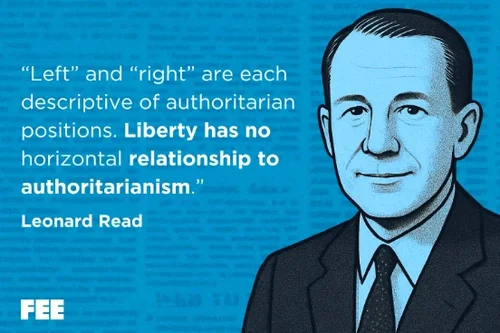

# Secțiune finală

<partId>d886a919-12b0-4e38-86de-7159b98b1864</partId>

## Evaluează acest curs

<chapterId>f0b8398c-7c15-417e-83b0-42e7aab533dc</chapterId>

<isCourseReview>true</isCourseReview>

## Examen final

<chapterId>f776853b-8303-47d9-8327-d925c594564d</chapterId>

<isCourseExam>true</isCourseExam>

## Concluzie

<chapterId>1dfe6e4a-47d5-48e1-94d0-6ac29b31e161</chapterId>

<isCourseConclusion>true</isCourseConclusion>
