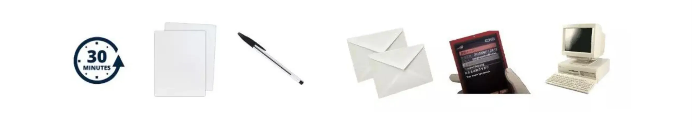

# Introduction

<partId>introduction-sov102</partId>

## Welcome to SOV102

<chapterId>welcome-ch01</chapterId>

<!-- NEW -->

Welcome to this course on Bitcoin inheritance planning.

You've taken important steps in your Bitcoin journey: you've acquired bitcoin, secured it in your own wallet, and protected your seed phrase. But there's one crucial step that many Bitcoiners overlook: ensuring your loved ones can access your bitcoin if something happens to you.

Unlike traditional bank accounts, there's no institution that will contact your family after you're gone. There's no "forgot password" option. If your heirs don't know how to access your bitcoin, it could be lost forever.

This course will guide you through creating a practical inheritance plan using a proven methodology developed by Pamela Morgan, author of *Cryptoasset Inheritance Planning*. By the end, you'll have a clear, actionable plan that protects both your wealth and your loved ones.

**Prerequisites**: Before starting this course, you should have already:
- Acquired some bitcoin (see BTC105 - How to Acquire Bitcoin)
- Secured your bitcoin in a wallet you control (see BTC104 - How to Secure Your Bitcoin)
- A basic understanding of seed phrases and wallet recovery

Let's begin.

<!-- END NEW -->

## Why Bitcoin Inheritance Matters

<chapterId>why-inheritance-ch02</chapterId>

<!-- ORIGINAL: btc102/en.md lines 2202-2228 -->

Ensuring the transmission of your bitcoins is a responsibility that is often overlooked but is crucial. The financial sovereignty that Bitcoin offers also comes with the need for careful estate management. Without this, your heirs could find themselves unable to access your hard-earned funds. In this chapter, we will explore the fundamentals of estate planning as it applies to Bitcoin.

### Why it's necessary to prepare a Bitcoin succession plan?

Imagine a sudden event (an accident or unforeseen circumstance) and you're no longer here. Your family, already grieving, is now faced with another challenge: accessing your bitcoins. They may have heard you talk about private keys, mnemonic phrases, and the irreversibility of transactions, but these concepts may be unclear to them. They're left trying to figure it out on their own.

You then have two options:

- Taking time to set up a clear, structured plan that will allow your loved ones to access your bitcoins easily and securely;
- Doing nothing, hoping they'll figure it out on their own. But if they make a mistake, lose access to a wallet or accidentally send the funds to the wrong address, your wealth could be lost forever.

Spending just 15 minutes to an hour on an inheritance plan could make all the difference. It's not only a matter of being cautious but also a way to show responsibility to those who may rely on you.

### The Goals of a Bitcoin Succession Plan

Pamela Morgan, in her book *[Cryptoasset Inheritance Planning](https://www.amazon.com/gp/product/1947910116/)*, outlines four key goals for a solid inheritance plan:

- Ensure your heirs can access your bitcoins at the right time (but not before);
- Minimize the risk of theft or compromise before they inherit the bitcoins;
- Make sure your heirs know how to secure the bitcoins long-term if they wish;
- Avoid family disputes and limit legal complications when passing down crypto-assets.

A well-thought-out plan isn't just about transferring wealth; it is also about protecting your loved ones from common mistakes and potential threats.

This course is inspired by the work of [Pamela Morgan](https://x.com/pamelawjd). [Her book](https://www.amazon.com/gp/product/1947910116/) offers a detailed and expert-validated method for creating a Bitcoin inheritance plan. However, **this content does not constitute legal advice**. It's a proven approach, but each person should do their own research and adapt the recommendations to fit their personal situation and jurisdiction.

[Pamela Morgan](https://x.com/pamelawjd) has generously authorized the use of [her work](https://www.amazon.com/gp/product/1947910116/) for this course, and we will follow her approach to create a concrete Bitcoin inheritance plan.

<!-- END ORIGINAL -->

# Preparation

<partId>preparation-sov102</partId>

## Common Misconceptions

<chapterId>misconceptions-ch03</chapterId>

<!-- ORIGINAL: btc102/en.md lines 2263-2274 -->

Many people delay this step because of misconceptions that prevent them from taking action. Here are some common myths, outlined by Pamela Morgan in _Cryptoasset Inheritance Planning_ (page 18):

- **"*I need to hire a lawyer.*"** → **False**. While a lawyer may be helpful for legal matters, a technical Bitcoin inheritance plan can be set up without one. The most important thing is to have clear and accessible instructions;
- **"*I need to trust a third party.*"** → **False**. Your plan can be designed in such a way that minimizes the need for trust, such as distributing information across multiple parties or using multi-signature solutions, with or without a timelock;
- **"*Planning will make my assets easy to steal.*"** → **False**. A well-thought-out plan protects against theft attempts while ensuring that your heirs can recover your funds safely. However, it's important to note that no solution is foolproof: an inheritance plan does increase the risk of theft, depending on what information is shared. We'll discuss this in more detail later;
- **"*The value of my bitcoins is too small to plan.*"** → **False**. It's always better to plan ahead. Your loved ones likely don't know the exact amount of Bitcoin you own, and that's a good thing. But if something happens to you, wouldn't they want to recover it, even if they don't know the exact amount? The value of Bitcoin can grow significantly over time, so it's wise to make it easier for them to access your funds, and to avoid giving them false hope about the value or leaving them searching for something that might not exist.
- **"*My heirs will figure it out on their own.*"** → **False**. Bitcoin isn't like a regular bank account. Without clear instructions, your loved ones might never be able to access your funds, or only find part of them. Unlike bank accounts, where financial institutions or notaries contact family members upon death, there's no intermediary that will inform your family about your Bitcoin wallet. Therefore, it's up to you to explicitly include it in your estate plan;
- **"*A smart contract can manage everything.*"** → **False**. A smart contract, such as a multi-sig wallet with a timelock, can be part of the solution, but it will never replace a well-structured plan, especially for people unfamiliar with Bitcoin. Both solutions are complementary.

It's time to take action. Spend these 30 minutes setting up your inheritance plan. It's a simple step, but it could make all the difference for your loved ones.

<!-- END ORIGINAL -->

## What You'll Need

<chapterId>what-you-need-ch04</chapterId>

<!-- ORIGINAL: btc102/en.md lines 2246-2260 -->

Take 30 minutes of your time. Not for yourself, but for those who depend on you. Estate planning is an important task, yet one that is often postponed, neglected or even ignored. Too many people, even the most cautious ones, put it off... until it's too late. Thousands of bitcoins have already been lost through lack of foresight. Don't make this mistake! This is **the FINAL STEP** in your journey to financial sovereignty: securing your Bitcoin wealth for your loved ones.

### What do you need?

Make sure you have a calm, distraction-free environment, then gather these few tools:

- 4 to 5 sheets of white paper;
- Pen;
- 2 envelopes;
- A phone or address book;
- A computer (optional).

<!-- END ORIGINAL -->

## Understanding Your Profile

<chapterId>your-profile-ch05</chapterId>

<!-- ORIGINAL: btc102/en.md lines 2230-2244 -->

To better understand how to create a Bitcoin succession plan, we'll look at the example of Cédric, a typical Bitcoin user who needs to organize how his wealth will be passed on if something unexpected happens.

His Profile:

- Long-term investor who does not trade frequently;
- Owns a hardware wallet and a mobile wallet for occasional use;
- Uses a single KYC exchange platform to buy his bitcoins;
- Introduced to Bitcoin by his cousin;
- Does not have altcoins or use Lightning network.

Our goal is to create a simple, effective plan tailored to Cédric's profile before we move on to more complex scenarios involving other types of users.

Think about your own profile as you go through this course. Consider:

- What types of wallets do you use?
- Where are your seed phrase backups stored?
- Who in your life knows you own bitcoin?
- What level of technical knowledge do your potential heirs have?

Your answers will shape the specific details of your inheritance plan.

<!-- END ORIGINAL -->

# Creating Your Plan

<partId>creating-plan-sov102</partId>

## Step 1 - Select Trusted Assistants

<chapterId>trusted-assistants-ch06</chapterId>

<!-- ORIGINAL: btc102/en.md lines 2276-2299 -->

When it comes to passing on an inheritance in Bitcoin, your loved ones will likely be unfamiliar with managing private keys or recovering wallets. They will need external assistance from competent and trustworthy individuals. The ideal approach is to select at least two distinct people:

- **A trusted relative**, who will ensure the smooth execution of your plan. They don't necessarily need deep knowledge of Bitcoin, but they must be someone your heirs can rely on.
- **An experienced Bitcoin user**, who can provide technical support for recovering the funds, managing wallets, and understanding the processes involved.

The people you choose should never have direct access to your private keys (or your mnemonic phrase), but they need to be able to:

- Guide your heirs in recovering and securing the funds;
- Explain the basics of Bitcoin wallets, recovery phrases, and transactions;
- Help avoid common mistakes.

On the paper that will become your Bitcoin inheritance plan, create a comparison table of potential candidates, evaluating their level of trust, their knowledge of Bitcoin, and how to contact them. For example:

| Person               | Trust Level     | Bitcoin Knowledge   | Contact Methods         | Notes                                                                                                                   |
|----------------------|-----------------|----------------------|--------------------------|------------------------------------------------------------------------------------------------------------------------|
| My brother Bob       | Very high       | Low                  | Phone & email            | Bob doesn't know Bitcoin well, but he's 100% reliable. He can ensure the process goes smoothly.                        |
| My cousin Nathan     | High            | Medium               | Phone & Instagram        | Has some Bitcoin knowledge and can guide my heirs. Aware of the plan. #1 to talk to in case of need.                   |
| Ricco (Bitcoiner friend) | Medium      | Very high            | Twitter, email & photo   | Very technically skilled, but should never have access to the funds. To be contacted for technical support.            |
| Bitcoin YouTuber     | Low             | High                 | YouTube channel          | Good information source for learning, but cannot intervene directly.                                                   |

If you don't have a reliable or competent family member, you can also consider hiring a professional, such as a lawyer specializing in Bitcoin inheritance, or a specialized estate planning service. The key is that your heirs have access to reliable technical help while maintaining the security and confidentiality of your funds.

<!-- END ORIGINAL -->

## Step 2 - Create Your Inventory

<chapterId>inventory-ch07</chapterId>

<!-- ORIGINAL: btc102/en.md lines 2300-2324 -->

Before thinking about securing or transmitting your bitcoins, it's important to make a clear inventory of your Bitcoin assets. This inventory will serve as the foundation for organizing your inheritance plan and will help your heirs understand where your assets are located and how to access them.

The goal here is not to immediately improve your security, but simply to catalog your current situation. It's a snapshot of your bitcoins and the means to access them. You can adjust and strengthen security later, once this first inventory is complete.

Consider all the places where you have bitcoins or fiat currency associated with Bitcoin. This may include:

- **Exchange platforms**:  Accounts with BTC or fiat linked to your Bitcoin purchases.
- **Hot wallets (mobile or desktop)**: Apps installed on your phone, used for everyday transactions;
- **Hardware wallets**: Physical devices that store your private keys offline;
- **Other solutions**: Multisig, paper wallets, specially stored private keys, etc.

Use a table to structure this inventory. The idea is not to store this document online but to keep it in a secure place, ideally on paper. For example:

| General | Storage type | Assets held | Localization | Mnemonic backup | Password (PIN, passphrase...) | Notes |
| --------------------- | ---------------- | -------------- | --------------------------------- | ------------------------------------------------------------------------ | ----------------------------------------------------------------------------------------------- | --------------------------------------------------------------------------------------------------------------- |
| Bitfinex | BTC & Euros | Accessible online | None (custodial platform) | | Bitwarden & 2FA password manager with Authy app on my phone | I bought my BTC here. Funds must be withdrawn after purchase |
| Physical wallet | Jade Plus | BTC | Personal safe at home | Copy at my Uncle Bob's and in a bank safe at BNP Paribas | passphrase stored at my mother's. PIN code stored on Bitwarden password manager. | I use 2 separate wallets: a normal one with only the mnemonic phrase and one with a passphrase. |
| Green Wallet | BTC | On my Iphone 15 | Copy of the seed in my safe at home | PIN code stored on the Bitwarden password manager. | The application is in hidden mode. | The application is in hidden mode |

At this stage, you might feel the urge to immediately adjust your fund distribution, improve your security, or even buy or sell more bitcoins. Don't act yet! The goal here is not to take action but to establish a snapshot of your current situation. You can always improve your plan later, but for now, stay focused on completing the inventory as thoroughly as possible.

Once this inventory is done, it will be much easier to identify weak points and organize a secure and effective transmission process.

<!-- END ORIGINAL -->

## Step 3 - Write the Inheritance Letter

<chapterId>write-letter-ch08</chapterId>

<!-- ORIGINAL: btc102/en.md lines 2325-2397 -->

### Why a handwritten letter?

It's crucial that your inheritance plan be clear, readable, and secure. To achieve this, write the letter by hand in ink on paper, and avoid digital documents that could be compromised. This letter is not a will or a legal declaration, but a practical guide to help your loved ones recover your bitcoins safely.

The letter should be simple, direct, and contain the following essential elements:

- An introduction explaining the nature of the assets to be recovered;
- Contacts of trusted people who can assist your heirs in the recovery process;
- A clear inventory of assets, including the storage methods and access details;
- Specific security instructions to avoid errors or scams;
- A final message, along with any legal instructions if applicable.

### Sample Inheritance Letter

Here's a model inspired by Pamela Morgan's Cryptoasset Inheritance Planning. You should, of course, adapt it to your personal situation:

---
**Date: `Indicate date`**

Dear `Names of heirs`,

If you are reading this letter, I am no longer here. First of all, know that I love you and have taken the time to prepare this document to help you manage my bitcoins, which may have value. This is not a complicated task, but it requires care and caution. Bitcoin is a peer-to-peer system: there is no recourse if a mistake is made. Please take the time to read this letter fully before taking any action.

#### 1. Contact Trusted Individuals

I have designated several people to assist you in understanding Bitcoin and recovering my assets. They should never have direct access to the funds but can guide you through the process:

- My brother Bob: +33 6 00 00 00 00; bobmybrother@supermail.com. You can trust Bob to help you in this process. While he's not the most technically knowledgeable about Bitcoin, he's the right person to question everything and ensure caution to guarantee your success safely.
- My cousin Nathan: +33 6 00 00 00 00; nathandelacroix@supermail.com. Nathan introduced me to Bitcoin. He's very skilled in computing and can answer most of your questions. He also owns some Bitcoin and can guide you technically. You've met him at family gatherings, and I've included a photo of him here.
- Ricco: @RiccoSuperBitcoiner on Twitter; ricco425@supermail.com. I've worked closely with Ricco for years. You've never met him, so make sure you contact the right person by asking him "What is Cédric's dog's name?" If he answers "12," it's him. Ricco is a very friendly and skilled Bitcoin expert. He will answer all your questions and you can trust his judgment about Bitcoin security. Don't hesitate to contact him, but never give him direct access to the funds.

It may sound strange, but contact them all. In addition, you can learn more by listening to Andreas Antonopoulos on YouTube and by buying the book *Cryptoasset Inheritance Planning* by Pamela Morgan.

Contact all these people and cross-check their opinions before making important decisions. **Don't trust anyone blindly.**

#### 2. Where Are My Bitcoins?

Here's a detailed inventory of my holdings, their location, and how to access them.

- I use my phone (Samsung Galaxy S8) to access my Samourai wallet. The recovery phrase for this wallet is saved in two copies: one is stored in the bank vault, the other with Uncle Bob. The PIN needed to unlock both my phone and the wallet is kept at my home and with my grandmother.
- I access the online exchange platform Bitfinex via my Dell 2018 laptop. There might still be bitcoins or dollars. To recover these funds, you'll either need to contact Bitfinex directly or try to access my account. (**Be careful, this might be illegal—check your local laws**).
- I've secured access to my online accounts using a password manager. A backup of this manager is stored in the bank vault. My Bitfinex account is also protected by two-factor authentication, which can be accessed either via my phone (Samsung Galaxy S8, Authy app) or by using the backup code I've kept at home.
- I own a Trezor Model One hardware wallet, accessed via my PC using Sparrow Wallet software. The recovery phrase for this wallet is stored in two copies: one in the bank vault, the other with Uncle Bob. The PIN for this wallet is stored at my home and with my mother. The device itself is likely stored in a safe at my office. I use a BIP39 passphrase on my Trezor Model One. This passphrase is crucial for accessing the funds on the device. A backup of this passphrase is stored in two locations: at my home and with my mother.

Take all necessary precautions before handling these funds. Never disclose the full recovery phrase to one person and only share these details if absolutely necessary.

#### 3. Safety precautions and instructions

- **Don't rush**. Take time to learn before you act. Bitcoin is safe when used correctly.
- **Never give the 24-word sentence to just one person**. If someone asks you for full access, be wary.
- **Don't connect my wallets to an unknown computer**. Use a secure environment, offline if possible.
- **Beware of scams**. There are many scams surrounding the Bitcoin. Only trust the people mentioned in this letter.
- **Save everything you do**.  Take notes, record important steps, and protect access.

#### 4. Legal information and final message

You will find a copy of my will in my personal file and with my notary. This letter does not replace an official will, but it will guide you in managing my bitcoins.

Take care of yourselves and remember that I love you. My wish is for these assets to be useful to you and help you move forward with peace of mind.

Handwritten Signature

Your Name

Date

---

This is a concrete example of an inheritance letter. Be sure to adapt it to your personal situation. It's also important to decide how much detail to include in the recovery process. If you fear your heirs won't be able to recover your bitcoins with this minimal information, consider writing a step-by-step tutorial explaining the process in detail.

### Balancing Security and Accessibility

Moreover, you'll need to balance how much information you reveal in this inheritance plan. The more you share about your security methods, the more you risk compromising your security while you're alive if this letter falls into the wrong hands. For example, a burglar finding this letter would immediately know where to look for critical wallet information. On the other hand, if you share too little, you expose your heirs to the risk of not being able to access your bitcoins. Therefore, you must find a middle ground.

Ultimately, the inheritance plan dilemma mirrors the security strategies: it's always about balancing the risk of loss with the risk of theft. Not documenting enough information increases the risk of your heirs losing access to the bitcoins, while sharing too much could elevate the risk of theft now.

<!-- END ORIGINAL -->

# Finalize and Maintain

<partId>finalize-sov102</partId>

## Step 4 - Review and Store

<chapterId>review-store-ch09</chapterId>

<!-- ORIGINAL: btc102/en.md lines 2398-2419 -->

Before wrapping up, make sure your letter includes:

- A clear list of trusted individuals with their contact information
- A detailed inventory of your assets and where to find them
- Precise instructions regarding access and security
- A thoughtful and compassionate message to your heirs

Depending on your personal situation, create multiple handwritten copies of this letter and store them in secure places (a safe, with a trusted person, etc.). Inform your heirs that this inheritance plan exists, without necessarily revealing its contents right away. For added protection, you may want to place the letter in a tamper-evident opaque envelope to ensure that it hasn't been accessed without your permission.

If needed, consult with a lawyer or notary to formally integrate your plan into a legal framework.

**Congratulations!** You've completed a critical step in securing your bitcoin wealth. You can now refine your inheritance plan by reviewing it periodically and exploring more advanced solutions like decreasing multisig setups with timelocks.

Reference: [*Cryptoasset Inheritance Planning, A Simple Guide for Owners* - Pamela Morgan, 2018.](https://www.amazon.com/gp/product/1947910116/)

Special thanks to [Pamela Morgan](https://x.com/pamelawjd) for her work and for allowing this content to be adapted.

<!-- END ORIGINAL -->

## Going Further

<chapterId>going-further-ch10</chapterId>

<!-- NEW + ORIGINAL refs -->

You've now created the foundation of your Bitcoin inheritance plan. Here are some ways to continue improving and maintaining it:

### Review Periodically

Your inheritance plan should be a living document. Review and update it:

- When you acquire new bitcoin or change wallets
- When your family situation changes (marriage, children, etc.)
- When trusted contacts change their information
- At least once per year as a regular check-up

### Advanced Solutions

For those wanting more sophisticated inheritance setups, consider exploring:

**Decreasing Multisig with Timelocks**: Using tools like Liana wallet, you can create a setup where your heirs gain access to your bitcoin automatically after a period of inactivity. This combines the security of multisig with automatic inheritance transfer.

Tutorial: https://planb.academy/tutorials/wallet/desktop/liana-306ef457-700c-4fdd-b07a-8fb7a8a29f04

### What You've Learned

In this course, you've learned:

1. **Why inheritance planning matters** - Bitcoin has no "forgot password" recovery; without a plan, your wealth could be lost forever
2. **How to select trusted assistants** - Choose people with the right combination of trust and technical knowledge
3. **How to create an inventory** - Document all your Bitcoin holdings and access methods
4. **How to write an inheritance letter** - Create clear instructions that balance security with accessibility
5. **How to store your plan** - Keep multiple copies in secure locations

### Recommended Resources

- *Cryptoasset Inheritance Planning* by Pamela Morgan - The definitive guide on this topic
- BTC104 (How to Secure Your Bitcoin) - Ensure your bitcoin is properly secured before planning inheritance
- SCU102 (Financial Fraud, Scams & Online Security) - Help your heirs recognize and avoid scams

<!-- END NEW -->

# Conclusion

<partId>conclusion-sov102</partId>

## Conclusion

<chapterId>conclusion-ch11</chapterId>
<isCourseConclusion>true</isCourseConclusion>
