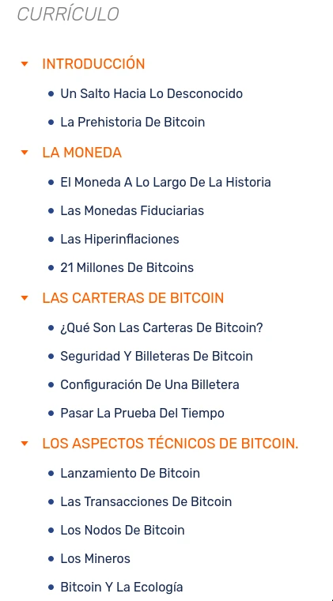

# Esta Parte se utiliza como Página de Descripción del Curso

En este curso, explicaré cómo crear un curso utilizando el Formato de Red PlanB.

Deberías indicar aquí el volumen de tiempo aproximado que se tarda en completar todo el curso.
El curso debería tomar aproximadamente 1 hora.
A lo largo del viaje, se disponen de esquemas explicativos y recursos adicionales.

También es mejor indicar los requisitos previos aquí.
¡No necesitas ningún conocimiento específico para comenzar, el curso es accesible para todos!

En esta página de descripción también mostraremos la imagen `thumbnail.webp` presente en la carpeta `assets/`.

+++

# Esta es una Parte del curso
<partId>97ccb669-12a0-5eed-83ac-c2f51839d998</partId>

## Este es un Capítulo del curso
<chapterId>4dc58281-5179-507c-afde-8c9204cbd3fd</chapterId>

### Esta es una Sección del curso

El curso está compuesto por 3 sub-elementos diferentes que son:
- Parte, definida por el nivel `# ` y útil para separar el curso en tema o asunto principal
- Capítulo, definido por el nivel `## ` y útil para separar el contenido de la parte en varias páginas ya que en la Red PlanB cada capítulo se muestra en su propia página
- Sección, definida por el nivel `### ` y útil para separar el Capítulo en subtemas para mayor claridad

Estos tres objetos se utilizan para crear el currículo en la plataforma PBN. Aquí hay un ejemplo para [BTC101](https://planb.network/es/courses/btc101)

Puedes ver que aquí hemos utilizado 2 sintaxis del lenguaje Markdown para redirigir a un enlace y para mostrar una imagen que está ubicada en la carpeta `assets/` del curso.

Puede que hayas notado que la imagen está en la subcarpeta `assets/es/`, es porque es una imagen que contiene texto en inglés que será traducido a otros idiomas. Si la imagen no contiene texto, debería estar en la subcarpeta `assets/no-txt/`.

Aunque todos los formatos de imagen son válidos, preferimos por razones de eficiencia de almacenamiento convertir cada imagen en formato `.webp`. Si no sabes cómo hacerlo, tenemos un script de python que hace el trabajo y nuestros revisores de código también podrían hacerlo mientras revisan tu PR.

## Este es el 2do Capítulo
<chapterId>3ff2a050-c311-55ce-a3c6-3cc450cad1ce</chapterId>

Un capítulo no necesariamente contiene secciones (`###`) pero una parte debe contener al menos un capítulo.

Si quieres aprender más sobre la sintaxis de markdown, puedes leer la [documentación de github](https://docs.github.com/es/get-started/writing-on-github/getting-started-with-writing-and-formatting-on-github/basic-writing-and-formatting-syntax) al respecto.

Un truco interesante es incrustar videos de esta manera:

## UUIDs de Parte y Capítulo
<chapterId>eac81877-db9b-5027-87e2-2b28b59459a0</chapterId>

Para identificar mejor cada elemento del curso, hemos decidido agregar UUIDs para cada Capítulo y Parte. Aquí también hay disponible un script de python para ello, pero los revisores también podrían hacerlo.
Los UUIDs son idénticos entre 2 idiomas del mismo contenido.
