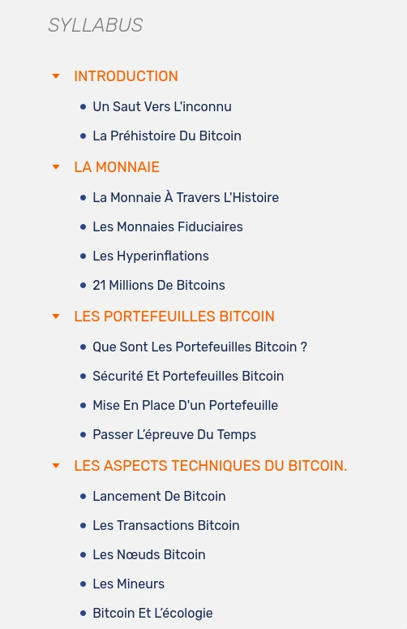

# Cette partie est utilisée comme page de description du cours

Dans ce cours, je vais expliquer comment créer un cours en utilisant le format de réseau PlanB.

Vous devriez indiquer ici le volume de temps approximatif nécessaire pour terminer l'ensemble du cours.
Le cours devrait prendre environ 1 heure.
Tout au long du parcours, un schéma explicatif et des ressources supplémentaires sont disponibles.

Il est également préférable de mentionner les prérequis ici.
Vous n'avez besoin d'aucune connaissance spécifique pour commencer, le cours est accessible à tous !

Dans cette page de description, nous afficherons également l'image `thumbnail.webp` présente dans le dossier `assets/`.

+++

# Ceci est une partie du cours
<partId>97ccb669-12a0-5eed-83ac-c2f51839d998</partId>

## Ceci est un chapitre du cours
<chapterId>4dc58281-5179-507c-afde-8c9204cbd3fd</chapterId>

### Ceci est une section du cours

Le cours est composé de 3 sous-éléments différents qui sont :
- Partie, définie par le niveau `# ` et utile pour séparer le cours en thème ou sujet principal
- Chapitre, défini par le niveau `## ` et utile pour séparer le contenu de la partie en plusieurs pages comme sur le réseau PlanB où chaque chapitre est affiché sur sa propre page
- Section, définie par le niveau `### ` et utile pour séparer le chapitre en sous-sujet pour plus de clarté

Ces trois objets sont utilisés pour créer le curriculum sur la plateforme PBN. Voici un exemple pour [BTC101](https://planb.network/fr/courses/btc101)

Vous pouvez voir que nous avons utilisé ici 2 syntaxes de la syntaxe Markdown pour rediriger vers un lien et pour afficher une image qui se trouve dans le dossier `assets/` du dossier du cours.

Vous remarquerez que l'image se trouve dans le sous-dossier `assets/fr/`, c'est parce qu'il s'agit d'une image qui contient du texte en anglais qui sera traduit dans d'autres langues. Si l'image ne contient pas de texte, elle devrait être dans le sous-dossier `assets/no-txt/`.

Bien que tous les formats d'image soient valides, nous préférons, pour des raisons d'efficacité de stockage, convertir chaque image au format `.webp`. Si vous ne savez pas comment faire, nous avons un script python qui fait le travail et nos réviseurs de code pourraient également le faire lors de la révision de votre PR.

## Ceci est le 2ème chapitre
<chapterId>3ff2a050-c311-55ce-a3c6-3cc450cad1ce</chapterId>

Un chapitre ne contient pas nécessairement des sections (`###`) mais une partie doit contenir au moins un chapitre.

Si vous souhaitez en savoir plus sur la syntaxe markdown, vous pouvez lire la [documentation github](https://docs.github.com/fr/get-started/writing-on-github/getting-started-with-writing-and-formatting-on-github/basic-writing-and-formatting-syntax) à ce sujet.

Une astuce intéressante est d'intégrer une vidéo comme celle-ci :

## UUIDs de partie et de chapitre
<chapterId>eac81877-db9b-5027-87e2-2b28b59459a0</chapterId>

Pour mieux identifier chaque élément du cours, nous avons décidé d'ajouter des UUIDs pour chaque chapitre et partie. Là encore, un script python est disponible pour cela, mais les réviseurs pourraient le faire aussi.
Les UUIDs sont identiques entre 2 langues du même contenu.
