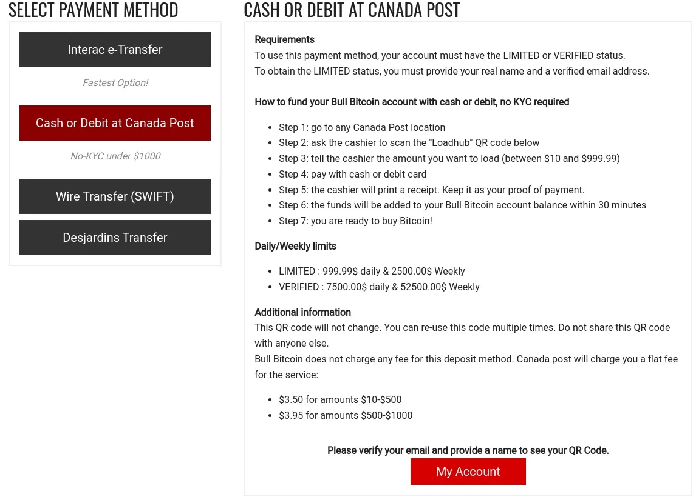

Bull Bitcoin (https://www.bullbitcoin.com) è uno scambio non custodiale e un servizio di pagamento - solo Bitcoin, senza compromessi!

Come acquistare Bitcoin in Canada: Bull Bitcoin di BTCsession

# Acquista Bitcoin senza KYC in Canada con Bull Bitcoin

## Vai a un ufficio postale in Canada e acquista Bitcoin in contanti tramite Bull Bitcoin.

**Questo tutorial è offerto da WINTER ☩ HODLER come parte di Agora256, grazie per il suo lavoro**

Una delle proposte più entusiasmanti delle valute fiduciarie (fiat) è sicuramente quella di poterle scambiare in favore di Bitcoin, idealmente senza dover nemmeno identificarsi troppo; un metodo spesso indicato come no-KYC o KYC-free. L'acronimo 'KYC' si riferisce al processo di verifica dell'identità di un individuo o di un'entità specifica in conformità con determinate normative emesse a livello governativo.

La maggior parte degli scambi di Bitcoin sono regolamentati e quindi sono tenuti a verificare l'identità dei loro clienti al fine di consentire loro di acquistare Bitcoin sulla loro piattaforma. Gli utenti devono quindi fornire diverse informazioni personali come nome, indirizzo, numero di telefono, uno o più documenti di identità, ecc., per ottenere il permesso di effettuare un ordine di acquisto di Bitcoin.

Questa pratica è senza dubbio un'ingerenza nella privacy e nella riservatezza dei cittadini che cercano semplicemente di acquisire una valuta, nel caso di Bitcoin, completamente separata dal sistema fiduciario controllato dai desideri di una banca centrale onnisciente.

## Utilizzare Bull Bitcoin per acquistare Bitcoin in contanti in Canada

In Canada, è ora possibile utilizzare uno di questi scambi per acquistare Bitcoin in contanti, il tutto senza KYC. Infatti, Bull Bitcoin, una rinomata azienda canadese operativa dal 2015 e guidata da Francis Pouliot, offre il metodo di pagamento 'Contanti o Bancomat presso il Canada Post' ai propri utenti che hanno ottenuto lo stato 'Limitato', che viene loro assegnato una volta che hanno fornito il loro nome e un indirizzo email verificato.

## Approvvigionamento dell'account tramite Poste Canada

Il metodo di pagamento 'Contanti o Bancomat presso il Canada Post' per approvvigionare l'account al fine di acquistare Bitcoin si trova nella sezione 'Finanzia il tuo account' del sito web (anche disponibile in versione mobile sul browser web). In questa sezione troverai il metodo di pagamento e le relative istruzioni, nonché il codice QR associato all'account Bull Bitcoin (una volta raggiunto lo stato 'Limitato').

Il funzionamento è molto semplice: è necessario recarsi in uno dei 5948 sportelli di Postes Canada e presentare il proprio codice QR all'impiegato, il quale dovrà semplicemente scansionarlo con lo scanner regolare di Postes Canada.

Successivamente, è sufficiente specificare l'importo che si desidera pagare (tra $10.00 e $999.99) e pagarlo in contanti o con carta di debito. Dopo 10 minuti, la transazione verrà completata su Bull Bitcoin. Si applicano commissioni da $3.50 a $3.95, a seconda dell'importo, durante la transazione presso l'ufficio postale. Inoltre, queste commissioni sono notevolmente inferiori a quelle dei Bitcoin ATM, un'altra opzione popolare senza KYC.

Si noti che si applicano limiti di transazione giornalieri e settimanali di $999.99 e $2500.00, rispettivamente. Se si tenta di superare questi limiti durante un pagamento presso l'ufficio postale, la transazione verrà semplicemente annullata automaticamente.

## Acquista bitcoin direttamente nel tuo portafoglio su Bull Bitcoin

Quando i fondi sono disponibili sul conto Bull Bitcoin, è il momento di passare alla fase di acquisto dei bitcoin! Vai alla pagina "Acquista Bitcoin" nel menu principale. Da lì, dovrai inserire l'importo del saldo che desideri spendere, così come la rete di tua scelta (Bitcoin, Lightning Network, Liquid).

Per le reti Bitcoin e Liquid, dovrai condividere un indirizzo per poter creare l'ordine di acquisto. Per quanto riguarda la rete Lightning, Bull Bitcoin offre due metodi di pagamento diversi: LNURL (opzione predefinita) o Bolt11, una volta creato l'ordine.

Essenzialmente, l'opzione LNURL è la più semplice: viene generato un codice QR e l'utente deve utilizzare un portafoglio Lightning che supporta questo protocollo per scansionarlo e richiedere i bitcoin. Bull Bitcoin richiede un indirizzo Bitcoin "fallback" per confermare la transazione. Questo viene utilizzato nel caso in cui la transazione Lightning non vada a buon fine, per vari motivi. Quindi è l'opzione consigliata.

Per quanto riguarda Bolt11, si tratta del metodo tradizionale della rete Lightning. A differenza di LNURL, è l'utente che deve creare la fattura (invoice) con il proprio portafoglio Lightning, per poi fornire i dettagli a Bull Bitcoin prima di confermare l'ordine di acquisto. Questa opzione comporta un certo rischio di errore da parte dell'utente, che deve inserire manualmente l'importo in bitcoin fornito da Bull Bitcoin nel proprio portafoglio durante la creazione della fattura, per poi condividerla con Bull Bitcoin. Tuttavia, il metodo funziona molto bene quando viene utilizzato correttamente.

> 💡 Consulta questi articoli Agora256 per saperne di più sulle diverse soluzioni di portafogli disponibili:
> '
>
> - I 6 migliori portafogli Bitcoin su dispositivi mobili nel 2023
> - Creazione, backup e utilizzo di una chiave privata Bitcoin con un dispositivo Coldcard e Bitcoin Core

Ecco, una volta confermato l'ordine di acquisto, Bull Bitcoin invierà i bitcoin direttamente al tuo portafoglio. Non c'è alternativa; Bull Bitcoin è una piattaforma non custodiale che non offre alcun servizio di custodia dei bitcoin per i suoi utenti, ed è perfetto così! Imparare a conservare i propri bitcoin è semplicemente la pratica migliore.

## Conclusioni

Mentre molti altri servizi, tra cui Binance e Bybit, hanno abbandonato il mercato canadese, Bull Bitcoin, fedele alla sua reputazione all'avanguardia, si è posizionato per rispondere alla crescente domanda di bitcoiners in cerca di maggiore privacy e riservatezza. Poiché Bull Bitcoin offre solo servizi non custodiali per Bitcoin, le regolamentazioni sempre più rigorose non hanno gli stessi effetti delle piattaforme custodiali che supportano una moltitudine di shitcoin.

Se non hai ancora un account Bull Bitcoin, utilizza il nostro link di riferimento https://mission.bullbitcoin.com/agora256 per registrarti e ricevere un bonus di $21.

Nel frattempo, come sempre, se hai domande, non esitare a condividerle con la comunità Agora256, impariamo insieme per essere migliori domani di quanto non siamo oggi!

> **Grazie ad Agora256 per la loro guida. Il link di affiliazione qui sotto non riguarda l'università; link originale: https://agora256.com/acheter-du-bitcoin-sans-kyc-au-canada-avec-bull-bitcoin/**
