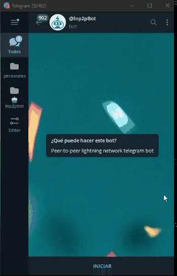

O Bitcoin é uma tecnologia de economia acessível e equitativa e é um meio de troca resistente à censura. O Lightning nos permite ter acesso imediato ao Bitcoin a um custo muito baixo sem perder todas as propriedades que tornam o Bitcoin o melhor dinheiro ao qual podemos ter acesso.

website: https://lnp2pbot.com/

HitHub: https://github.com/lnp2pBot/bot

Todos os recursos: https://lnp2pbot.com/learn/

## Guia de Início Rápido

- Baixe uma carteira compatível com a Lightning Network (breez, phoenix, blixt).

- Obtenha um nome de usuário no Telegram.

- Inicie @lnp2pBot

- Encontre ofertas no canal @lnp2pbot Exchange.

- Comece a comprar e vender.

E é isso! Para mais informações, verifique a página de documentação incrível deles em https://lnp2pbot.com/learn/
