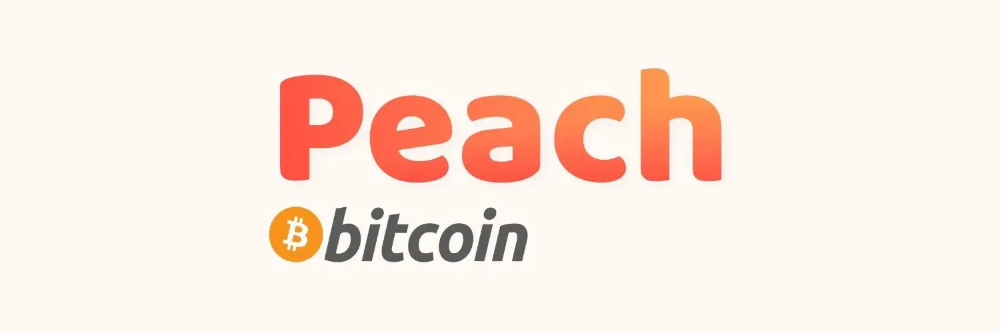

Peach (https://peachbitcoin.com/) é um aplicativo móvel que conecta diretamente compradores e vendedores de Bitcoin. Compre ou venda Bitcoin peer-to-peer em qualquer lugar, a qualquer momento. Use o método de pagamento de sua escolha entre várias opções. Venda pelo preço que desejar, pois os mercados peer-to-peer são os verdadeiros mercados. O Bitcoin sem KYC é o melhor Bitcoin.

Vamos analisar em detalhes essa solução no BTC 205 oferecido por @pivi/\_, aqui estão os vídeos tutoriais:

_Artigo ainda não disponível, por favor, forneça-o se você tiver._
