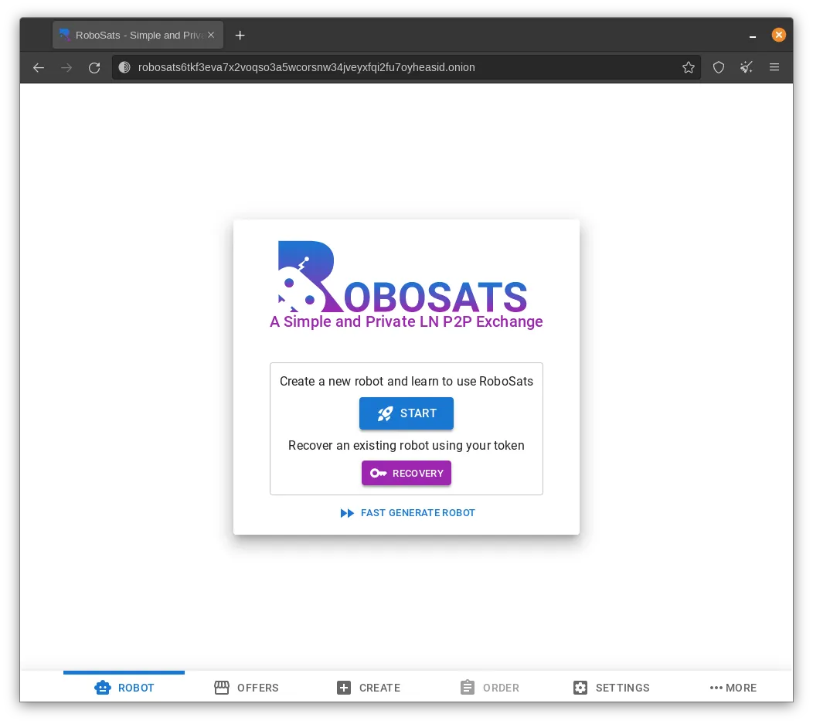
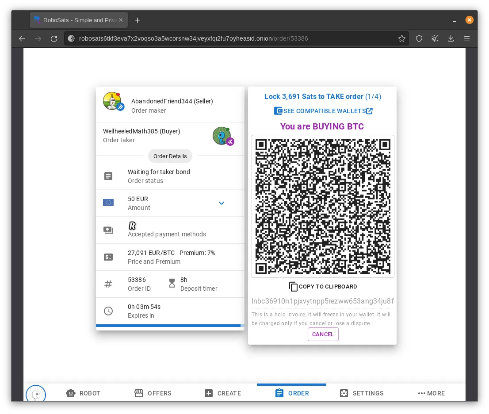
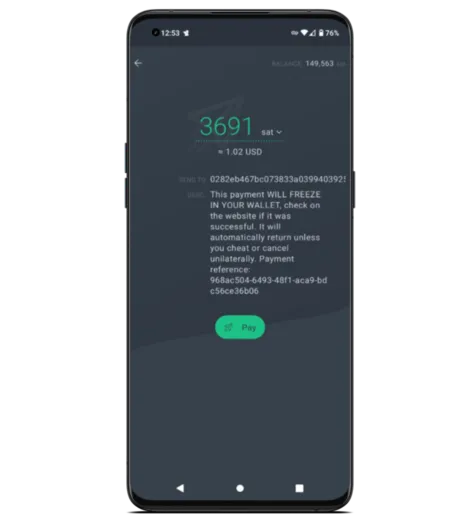
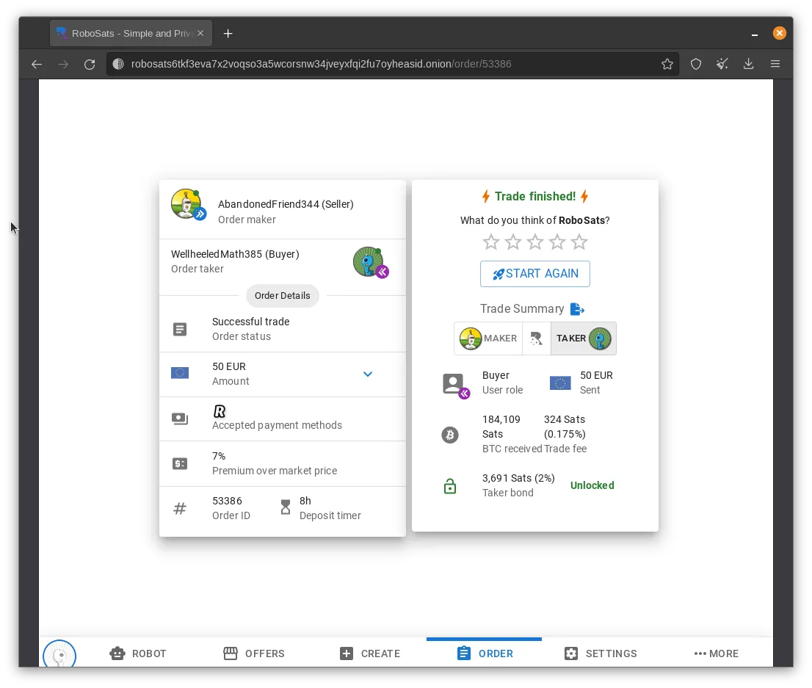
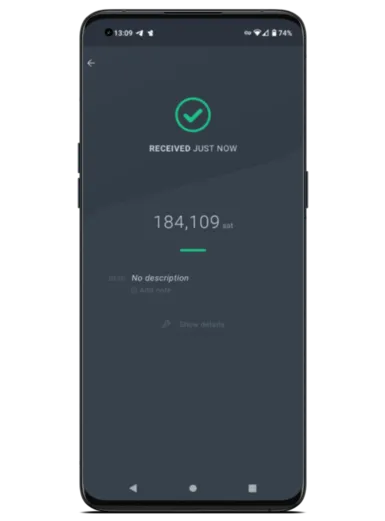
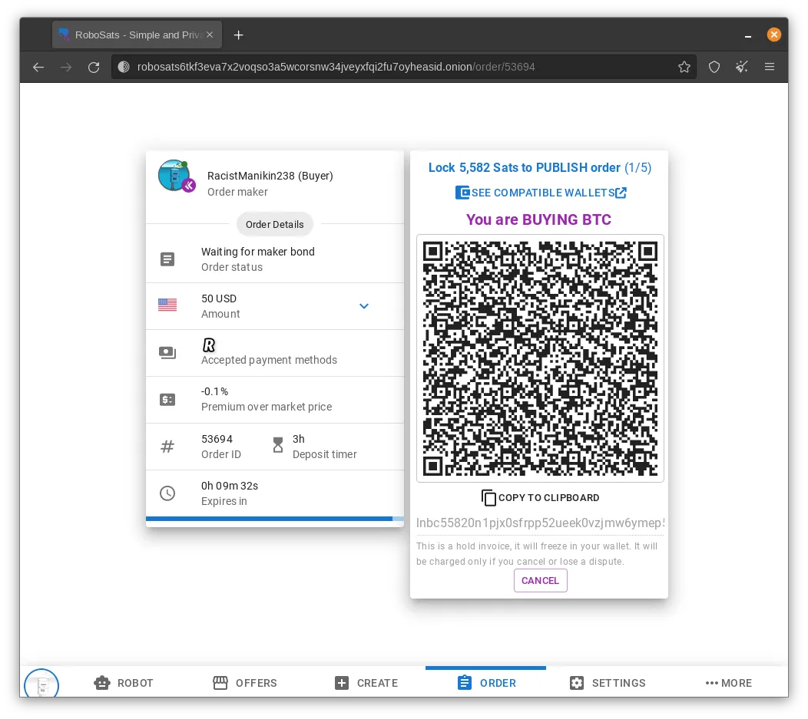
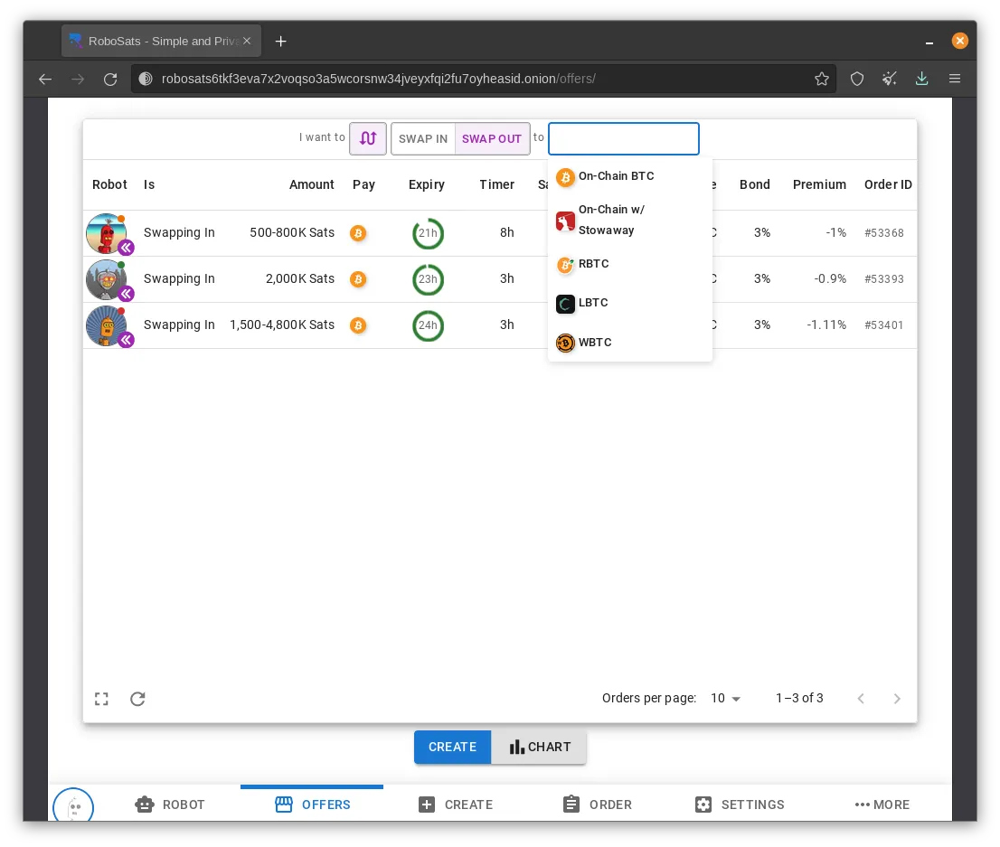
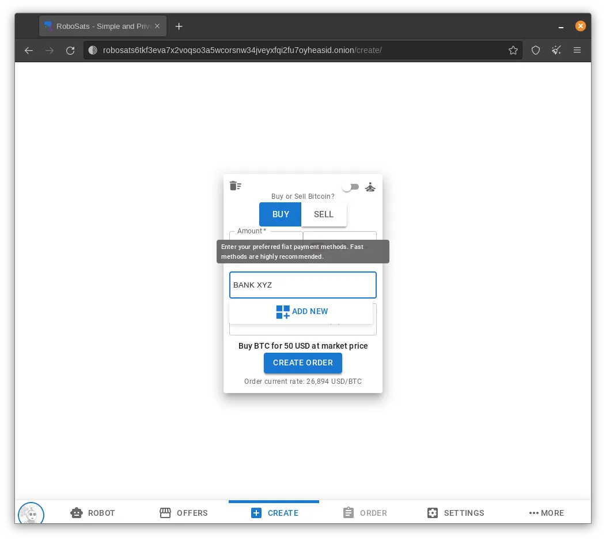

RoboSats (https://learn.robosats.com/) est un moyen facile d'échanger privément des Bitcoins contre des devises nationales. Il simplifie l'expérience pair-à-pair et utilise des factures Lightning pour minimiser les exigences de garde et de confiance.

## Guide

> Ce guide provient de Bitcoin Q&A (https://bitcoiner.guide/robosats/). Tout le crédit lui revient, soutenez-le là-bas (https://bitcoiner.guide/contribute) ; BitcoinQ&A est également un mentor en Bitcoin. Contactez-le pour du mentorat !

RoboSats - Un échange P2P simple et privé basé sur Lightning

## Avant de commencer

### Ce que vous devez savoir

| Jargon       | Définition                                                                                                                                                                                                                                                                  |
| ------------ | --------------------------------------------------------------------------------------------------------------------------------------------------------------------------------------------------------------------------------------------------------------------------- |
| Robot        | Votre identité de transaction privée générée automatiquement. Ne réutilisez pas le même robot plus d'une fois, car cela peut compromettre votre vie privée.                                                                                                                 |
| Token        | Une chaîne de caractères aléatoires utilisée pour générer votre robot unique.                                                                                                                                                                                               |
| Maker        | Un utilisateur qui crée une offre d'achat ou de vente de Bitcoins.                                                                                                                                                                                                          |
| Taker        | Un utilisateur qui accepte l'offre d'un autre utilisateur d'acheter ou de vendre des Bitcoins.                                                                                                                                                                              |
| Bond         | Une quantité de Bitcoins bloquée par les deux parties en tant qu'engagement à jouer le jeu équitablement et à remplir leur part de la transaction. Les engagements représentent généralement 3% du montant total de la transaction et sont alimentés par des factures Hodl. |
| Trade Escrow | Utilisé par le vendeur comme méthode de détention du montant de la transaction en Bitcoins, en utilisant à nouveau des factures Hodl.                                                                                                                                       |
| Frais        | RoboSats facture 0,2% du montant de la transaction, qui est réparti entre le créateur et l'accepteur. L'accepteur paie 0,175% et le créateur paie 0,025%.                                                                                                                   |

## Ce dont vous avez besoin

### Un portefeuille Lightning

RoboSats est natif à Lightning, vous aurez donc besoin d'un portefeuille Lightning pour financer l'engagement et recevoir les sats achetés en tant qu'acheteur. Vous devez faire attention lorsque vous choisissez votre portefeuille, car en raison de la technologie utilisée pour faire fonctionner RoboSats, tous ne sont pas compatibles.

Si vous êtes un opérateur de nœud, Zeus est de loin la meilleure option. Si vous n'avez pas votre propre nœud, je vous recommande vivement Phoenix, un portefeuille mobile multiplateforme avec une configuration simple et un accès à Lightning. Phoenix a été utilisé dans la production de ce guide.

### Un peu de Bitcoin

Les acheteurs et les vendeurs doivent financer un engagement avant que toute transaction puisse avoir lieu. Il s'agit généralement d'un montant très faible (~3% du montant de la transaction), mais c'est une condition préalable néanmoins.

Utilisez RoboSats pour acheter vos premiers sats ? Pourquoi ne pas demander à un ami de vous prêter la petite somme nécessaire pour commencer !? Si vous êtes seul, voici d'autres excellentes options pour obtenir quelques sats sans KYC pour vous lancer.

### Accès à RoboSats

Évidemment, vous devrez accéder à RoboSats ! Il existe quatre principales façons de le faire :

1. Via le navigateur Tor (recommandé !)
2. Via un navigateur web classique (non recommandé !)
3. Via l'APK Android
4. Votre propre client

Si vous êtes nouveau sur le navigateur Tor, en apprenez plus et téléchargez-le [ici](https://www.torproject.org/download/).
Une petite note pour les utilisateurs iOS qui souhaitent accéder à RoboSats via Tor depuis leur téléphone. "Onion Browser" n'est pas Tor Browser. Utilisez plutôt Orbot + Safari et Orbot + DuckDuckGo.

## Achat de Bitcoin

Les étapes suivantes ont été réalisées en mai 2023 en utilisant la version 0.5.0, accessible via le navigateur Tor. Les étapes devraient être identiques pour les utilisateurs accédant à RoboSats via l'APK Android.

Au moment de la rédaction, RoboSats est toujours en développement actif, donc l'interface peut changer un peu à l'avenir, mais les étapes de base nécessaires pour effectuer la transaction devraient rester largement inchangées.

> Lorsque vous chargez RoboSats pour la première fois, vous serez accueilli par cette page d'accueil. Cliquez sur Démarrer.

Générez votre jeton et stockez-le quelque part en sécurité, comme dans une application de notes chiffrées ou un gestionnaire de mots de passe. Ce jeton peut être utilisé pour récupérer votre identifiant de robot temporaire en cas de fermeture de votre navigateur ou de votre application en cours de transaction.

Rencontrez votre nouvelle identité de robot, puis cliquez sur Continuer.

Cliquez sur Offres pour parcourir le carnet de commandes. En haut de la page, vous pouvez ensuite filtrer selon vos préférences. Assurez-vous de prendre note des pourcentages de caution et de la prime par rapport au taux de change moyen.

- Choisissez Acheter
- Choisissez votre devise
- Choisissez votre(s) méthode(s) de paiement

> Cliquez sur l'offre que vous souhaitez accepter. Entrez le montant (dans votre devise fiduciaire choisie) que vous souhaitez acheter auprès du vendeur, puis vérifiez une dernière fois les détails et cliquez sur Prendre la commande.

Si le vendeur n'est pas en ligne (indiqué par un point rouge sur son image de profil), vous verrez un avertissement indiquant que la transaction pourrait prendre plus de temps que d'habitude. Si vous continuez et que le vendeur ne procède pas à temps, vous serez indemnisé à hauteur de 50 % du montant de leur caution pour le temps perdu.

Ensuite, vous devez bloquer votre caution de transaction en payant la facture à l'écran. Il s'agit d'une facture de réserve qui se fige dans votre portefeuille. Elle ne sera débitée que si vous ne parvenez pas à effectuer votre part de la transaction.

Dans votre portefeuille Lightning, scannez le code QR et payez la facture.

Ensuite, dans votre portefeuille Lightning, générez une facture pour le montant indiqué et collez-la dans l'espace prévu.

Attendez que le vendeur bloque le montant de sa transaction. Lorsque cela se produit, RoboSats passera automatiquement à l'étape suivante où la fenêtre de discussion s'ouvrira. Dites bonjour et demandez au vendeur ses informations de paiement en devise fiduciaire. Une fois fournies, envoyez le paiement via la méthode choisie, puis confirmez cela dans RoboSats. Toutes les discussions dans RoboSats sont chiffrées PGP, ce qui signifie que seuls vous et votre pair commercial pouvez lire les messages.

Une fois que le vendeur confirme la réception du paiement, RoboSats libère automatiquement le paiement en utilisant la facture fournie précédemment.

Lorsque la facture est payée, la transaction est terminée et votre caution est débloquée. Vous verrez alors un récapitulatif de la transaction.

Vérifiez votre portefeuille Lightning pour confirmer que les sats sont arrivés.

## Fonctionnalités supplémentaires

En plus de l'achat et de la vente évidents de Bitcoin, RoboSats dispose de quelques autres fonctionnalités que vous devriez connaître.
Garage des robots
Vous voulez avoir plusieurs transactions en cours en même temps, mais vous ne voulez pas partager la même identité pour toutes ? Pas de problème ! Cliquez sur l'onglet Robot, générez un autre Robot et créez ou prenez votre prochaine commande.

### Création de commandes

En plus de prendre l'offre de quelqu'un d'autre, vous pouvez créer la vôtre et attendre qu'un autre Robot vienne à vous.

- Ouvrez la page de création.
- Définissez si votre commande est d'acheter ou de vendre du Bitcoin.
- Entrez le montant et la devise que vous souhaitez acheter/vendre.
- Entrez la ou les méthodes de paiement que vous êtes prêt à utiliser.
- Entrez le pourcentage de "Prime sur le marché" que vous êtes prêt à accepter. Notez que ce chiffre peut être négatif pour enchérir à un prix inférieur au prix actuel du marché.
- Cliquez sur Créer une commande.
- Payez la facture Lightning pour verrouiller votre caution de créateur.
- Votre commande est maintenant active. Asseyez-vous et attendez que quelqu'un l'accepte.

### Paiements sur chaîne

RoboSats est axé sur Lightning, mais les acheteurs ont la possibilité de recevoir leurs sats sur une adresse Bitcoin sur chaîne. Les acheteurs peuvent sélectionner cette option après avoir bloqué leur caution. Après avoir sélectionné sur chaîne, l'acheteur verra un aperçu des frais. Les frais supplémentaires pour ce service comprennent :

- Des frais de swap collectés par RoboSats - Ces frais sont dynamiques et varient en fonction de l'activité du réseau Bitcoin.
- Des frais de minage pour la transaction de paiement - Cela peut être configuré par l'acheteur.

### Échanges P2P

RoboSats permet aux utilisateurs d'échanger des sats dans leur portefeuille Lightning. Il suffit de cliquer sur le bouton d'échange en haut de la page des offres pour voir les offres d'échange actuelles.

En tant qu'acheteur d'une offre "Swap In", vous envoyez du Bitcoin sur chaîne à votre pair et recevez des sats en retour, moins les frais et/ou primes annoncés, dans votre portefeuille Lightning. En tant qu'acheteur d'une offre "Swap Out", vous envoyez des sats via Lightning et recevez du Bitcoin, moins les frais et/ou primes, sur votre adresse sur chaîne. Les utilisateurs de Samourai ou Sparrow Wallet peuvent également utiliser la fonction Stowaway pour effectuer un échange.

Les offres d'échange RoboSats peuvent également inclure des alternatives adossées au Bitcoin telles que RBTC, LBTC et WBTC. Vous devez faire très attention si vous interagissez avec ces jetons car ils comportent tous différents compromis. Le Bitcoin adossé n'est pas du Bitcoin !

### Exécutez votre propre client RoboSats

Les utilisateurs de nœuds Umbrel, Citadel et Start9 peuvent installer leur propre client RoboSats directement sur leur nœud. Les avantages de le faire sont les suivants :

- Temps de chargement considérablement plus rapides.
- Plus sûr : vous contrôlez l'application client RoboSats que vous exécutez.
- Accédez à RoboSats en toute sécurité depuis n'importe quel navigateur/appareil. Pas besoin d'utiliser TOR si vous êtes sur votre réseau local ou si vous utilisez un VPN : votre backend de nœud gère la torification nécessaire pour l'anonymisation.
- Permet de contrôler à quel coordinateur de marché P2P vous vous connectez (par défaut robosats6tkf3eva7x2voqso3a5wcorsnw34jveyxfqi2fu7oyheasid.onion)

## FAQ

### Est-ce que je peux être victime d'une arnaque ?

En tant qu'acheteur, si vous avez envoyé la monnaie fiduciaire requise pour votre côté de l'échange, mais que le vendeur ne vous libère pas les sats, vous pouvez ouvrir un litige. Si, au cours de ce processus de litige, vous pouvez prouver aux arbitres de RoboSats que vous avez bien envoyé la monnaie fiduciaire, les fonds encaissés par le vendeur et leur caution commerciale vous seront restitués. Comment puis-je annuler un échange ?

Vous pouvez annuler un échange après avoir posté votre caution en cliquant sur le bouton Annulation collaborative dans le menu de l'échange. Si votre partenaire d'échange est d'accord pour annuler, vous ne supporterez aucun frais. Mais si votre partenaire d'échange souhaite finaliser l'échange et que vous décidez d'annuler quand même, vous perdrez votre caution commerciale.

### Est-ce que RoboSats fonctionne avec la méthode de paiement 'X' ?

Il n'y a aucune restriction sur les méthodes de paiement dans RoboSats. Si vous ne voyez pas d'offres dans votre méthode de paiement souhaitée, créez votre propre offre en l'utilisant !

### Que sait RoboSats de moi lorsque je l'utilise ?

Si vous utilisez RoboSats via Tor ou l'application Android, absolument rien ! En savoir plus ici.

- Tor protège votre vie privée sur le réseau.
- Le chiffrement PGP garde votre discussion commerciale privée.
- Pas de compte signifie un Robot par échange. Cela signifie que RoboSats ne peut pas corréler plusieurs échanges à une seule entité.

Cependant, il y a quelques exceptions ! Lightning est assez privé en tant qu'expéditeur, mais pas en tant que destinataire. Si vous recevez sur votre propre nœud Lightning, votre ID de nœud est partagé dans vos factures. Cet ID de nœud donne à quiconque le connaissant un point de départ pour essayer de relier votre activité on-chain. Cela est également vrai si un utilisateur choisit de recevoir son échange via un paiement on-chain.

Pour atténuer cela, les utilisateurs peuvent choisir d'utiliser une solution telle qu'un Portefeuille Proxy pour Lightning ou Coinjoin pour on-chain.

### Fédération

Actuellement, il existe un seul coordinateur RoboSats exploité par l'équipe de développement de RoboSats. Dans Bitcoin, toute forme de centralisation facilite la cible pour les gouvernements ou les régulateurs qui pourraient ne pas regarder favorablement un service spécifique.

Avec RoboSats étant un projet Open Source, n'importe qui pourrait prendre le code et commencer à exécuter son propre coordinateur. Bien que cela décentralise quelque peu le risque d'une cible unique, cela fragmente également un marché de liquidité déjà mince.

L'équipe de RoboSats en est consciente et a commencé à travailler sur un modèle fédéré. En tant qu'utilisateur final, cela ne devrait pas changer beaucoup le flux d'échange démontré ci-dessus, mais il y aura des vues ou des écrans supplémentaires pour vous permettre d'ajouter ou de supprimer différents coordinateurs qui apparaissent.

FIN du guide
https://bitcoiner.guide/robosats/
