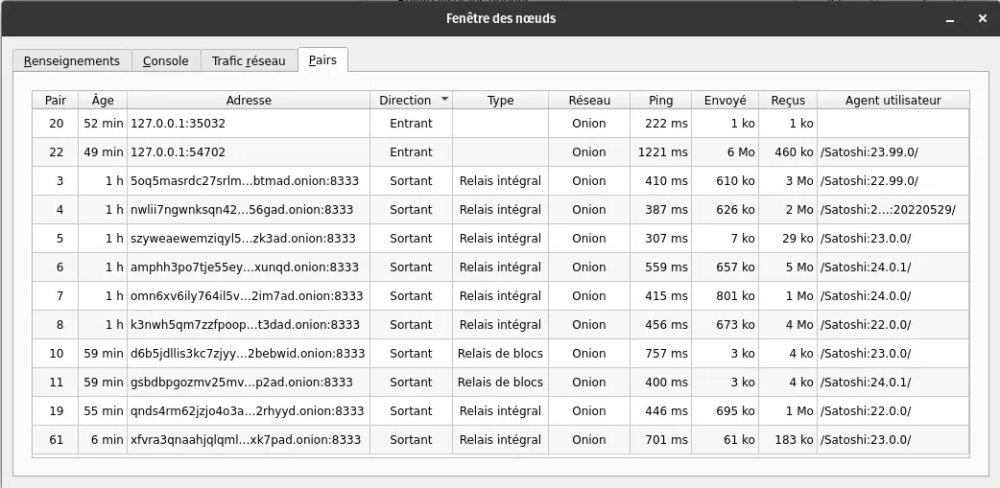

# Führen Sie Ihren eigenen Knotenpunkt mit Bitcoin Core aus

Einführung in Bitcoin und das Konzept des Knotenpunkts, ergänzt durch eine umfassende Installationsanleitung für Linux.

Einer der faszinierendsten Vorschläge von Bitcoin ist die Möglichkeit, das Programm selbst auszuführen und somit auf granularer Ebene am Netzwerk und an der Überprüfung des öffentlichen Transaktionsregisters teilzunehmen.

Bitcoin, ein Open-Source-Projekt, wird seit 2009 öffentlich verteilt und ist kostenlos verfügbar. Fast 15 Jahre nach seiner Einführung ist Bitcoin heute ein umfangreiches und unaufhaltsames digitales Währungsnetzwerk mit einer starken organischen Netzwerkwirkung. Für seine Bemühungen und Vision verdient Satoshi Nakamoto unseren Dank. Übrigens, wir hosten das Bitcoin-Whitepaper hier auf Agora 256 (Hinweis: auch an der Universität).

## Ihre eigene Bank werden

Das Führen eines eigenen Knotenpunkts ist für Bitcoin-Anhänger unerlässlich geworden. Ohne die Erlaubnis von jemand anderem können Sie die Blockchain von Anfang an herunterladen und alle Transaktionen gemäß dem Bitcoin-Protokoll von A bis Z überprüfen.

Das Programm enthält auch eine Geldbörse. Auf diese Weise haben wir die Kontrolle über die Transaktionen, die wir an das restliche Netzwerk senden, ohne Vermittler oder Dritte. Sie sind Ihre eigene Bank.

Der Rest dieses Artikels ist daher eine Installationsanleitung für Bitcoin Core - die am weitesten verbreitete Bitcoin-Softwareversion - speziell für Debian-kompatible Linux-Distributionen wie Ubuntu und Pop!/\_OS. Folgen Sie dieser Anleitung, um einen Schritt näher zu Ihrer individuellen Souveränität zu gelangen.

## Installationsanleitung für Bitcoin Core auf Debian/Ubuntu

> Voraussetzungen
>
> - Mindestens 6 GB Speicherplatz für Daten (beschnittener Knotenpunkt/pruned node) - 1 TB Speicherplatz für Daten (vollständiger Knotenpunkt/full node)
> - Planen Sie mindestens 24 Stunden für den Abschluss des IBD (Initial Block Download oder Initialer Blockdownload) ein. Dieser Vorgang ist auch für einen beschnittenen Knotenpunkt erforderlich.
> - Planen Sie ~600 GB Bandbreite für den IBD ein, auch für einen beschnittenen Knotenpunkt.

> 💡 Die folgenden Befehle sind für die Version 24.1 von Bitcoin Core vorgegeben.

## Herunterladen und Überprüfen der Dateien

1. Laden Sie bitcoin-24.1-x86_64-linux-gnu.tar.gz sowie die Dateien SHA256SUMS und SHA256SUMS.asc herunter. (https://bitcoincore.org/bin/bitcoin-core-24.1/bitcoin-24.1-x86_64-linux-gnu.tar.gz)

2. Öffnen Sie ein Terminal im Verzeichnis, in dem sich die heruntergeladenen Dateien befinden. Z.B. cd ~/Downloads/.
3. Überprüfen Sie, ob die Prüfsumme der Versionsdatei in der Prüfsummen-Datei aufgeführt ist, indem Sie den Befehl sha256sum --ignore-missing --check SHA256SUMS verwenden.
4. Die Ausgabe dieses Befehls sollte den Namen der heruntergeladenen Versionsdatei sowie "OK" enthalten. Beispiel: bitcoin-24.0.1-x86_64-linux-gnu.tar.gz: OK.

5. Installieren Sie Git mit dem Befehl sudo install git. Klonen Sie dann das Repository mit den PGP-Schlüsseln der Bitcoin Core-Unterzeichner mit dem Befehl git clone https://github.com/bitcoin-core/guix.sigs.
6. Importieren Sie die PGP-Schlüssel aller Unterzeichner mit dem Befehl gpg --import guix.sigs/builder-keys//\*
7. Überprüfen Sie, ob die Prüfsummen-Datei mit den PGP-Schlüsseln der Unterzeichner signiert ist, indem Sie den Befehl gpg --verify SHA256SUMS.asc verwenden.

Jede Signatur liefert eine Zeile, die mit "gpg: Good signature" beginnt, und eine andere, die mit "Primary key fingerprint: 133E AC17 9436 F14A 5CF1 B794 860F EB80 4E66 9320" endet (Beispiel für den Fingerabdruck des PGP-Schlüssels von Pieter Wuille).

> 💡 Es ist nicht erforderlich, dass alle Unterzeichnerschlüssel ein "OK" zurückgeben. Tatsächlich könnte nur einer erforderlich sein. Es liegt am Benutzer, seinen eigenen Validierungsschwellenwert in Bezug auf die PGP-Überprüfung festzulegen.
>
> Sie können die Warnmeldungen "WARNING: This key is not certified with a trusted signature!" ignorieren.

> There is no indication that the signature belongs to the owner.

## Installation der grafischen Benutzeroberfläche von Bitcoin Core

1. Verwenden Sie im Terminal weiterhin das Verzeichnis, in dem sich die Bitcoin Core-Versionsdatei befindet, den Befehl tar xzf bitcoin-24.1-x86_64-linux-gnu.tar.gz, um die Dateien aus dem Archiv zu extrahieren.

2. Installieren Sie die zuvor extrahierten Dateien mit dem Befehl sudo install -m 0755 -o root -g root -t /usr/local/bin bitcoin-24.1/bin//\*

3. Installieren Sie die erforderlichen Abhängigkeiten mit dem Befehl sudo apt-get install libqt5gui5 libqt5core5a libqt5dbus5 qttools5-dev qttools5-dev-tools qtwayland5 libqrencode-dev

4. Starten Sie bitcoin-qt (die grafische Benutzeroberfläche von Bitcoin Core) mit dem Befehl bitcoin-qt.

5. Um einen pruned node auszuwählen, aktivieren Sie "Limit blockchain storage" und konfigurieren Sie die Datenbegrenzung:


## Fazit Teil 1: Installationsanleitung

Nach der Installation von Bitcoin Core wird empfohlen, es so lange wie möglich laufen zu lassen, um dem Bitcoin-Netzwerk bei der Überprüfung von Transaktionen und der Übertragung neuer Blöcke an andere Peers zu helfen.

Es ist jedoch eine gute Praxis, den Knotenpunkt gelegentlich laufen und synchronisieren zu lassen, auch nur um empfangene und gesendete Transaktionen zu validieren.

'

# Konfiguration von Tor für einen Bitcoin Core Knoten

> 💡 Diese Anleitung ist für Bitcoin Core 24.0.1 auf Ubuntu/Debian kompatiblen Linux-Distributionen gedacht.

## Installation und Konfiguration von Tor für Bitcoin Core

Zunächst müssen wir den Tor-Dienst (The Onion Router) installieren, ein Netzwerk für anonyme Kommunikation, das es uns ermöglicht, unsere Interaktionen mit dem Bitcoin-Netzwerk zu anonymisieren. Eine Einführung in Tools zum Schutz der Privatsphäre im Internet, einschließlich Tor, finden Sie in unserem Artikel zu diesem Thema.

Um Tor zu installieren, öffnen Sie ein Terminal und geben Sie sudo apt -y install tor ein. Sobald die Installation abgeschlossen ist, wird der Dienst normalerweise automatisch im Hintergrund gestartet. Überprüfe, ob er korrekt läuft, indem du den Befehl sudo systemctl status tor eingibst. Die Antwort sollte Active: active (exited) enthalten. Drücken Sie Strg+C, um diese Funktion zu beenden.

> In jedem Fall kannst du die folgenden Befehle im Terminal verwenden, um Tor zu starten, zu stoppen oder neu zu starten:

```
sudo systemctl start tor
sudo systemctl stop tor
sudo systemctl restart tor
```

Als nächstes starten wir die grafische Oberfläche von Bitcoin Core mit dem Befehl bitcoin-qt. Dann aktivieren wir die automatische Funktion der Software, um unsere Verbindungen über einen Tor-Proxy zu leiten: Einstellungen > Netzwerk, und von dort aus können wir die Option Über SOCKS5-Proxy verbinden (Standard-Proxy) sowie einen separaten SOCKS5-Proxy verwenden, um Peers über Tor-Zwiebel-Dienste zu erreichen.


Bitcoin Core erkennt automatisch, ob Tor installiert ist und wenn ja, wird es standardmäßig ausgehende Verbindungen zu anderen Knoten herstellen, die ebenfalls Tor benutzen, zusätzlich zu Verbindungen zu Knoten, die IPv4/IPv6-Netzwerke (clearnet) benutzen.

> Um die Anzeigesprache auf Französisch zu ändern, gehe in den Einstellungen auf den Reiter Anzeige.

## Erweiterte Tor-Konfiguration (optional)

Es ist möglich, Bitcoin Core so zu konfigurieren, dass es nur das Tor-Netzwerk verwendet, um sich mit Peers zu verbinden und so die Anonymität durch unseren Knoten zu optimieren. Da es dafür keine Funktion in der grafischen Oberfläche gibt, müssen wir manuell eine Konfigurationsdatei erstellen. Gehe zu Einstellungen und dann zu Optionen.


Klicken Sie hier auf Konfigurationsdatei öffnen. In der Textdatei bitcoin.conf fügen Sie einfach die Zeile onlynet=onion ein und speichern die Datei. Sie müssen Bitcoin Core neu starten, damit dieser Befehl wirksam wird.

Wir werden nun den Tor-Dienst so konfigurieren, dass Bitcoin Core eingehende Verbindungen über einen Proxy empfangen kann. Dadurch können andere Knoten im Netzwerk unseren Knoten nutzen, um Blockchain-Daten herunterzuladen, ohne die Sicherheit unserer Maschine zu gefährden.

Geben Sie im Terminal sudo nano /etc/tor/torrc ein, um auf die Konfigurationsdatei des Tor-Dienstes zuzugreifen. Suchen Sie in dieser Datei die Zeile #ControlPort 9051 und entfernen Sie das #, um es zu aktivieren. Fügen Sie nun zwei neue Zeilen zur Datei hinzu: HiddenServiceDir /var/lib/tor/bitcoin-service/ und HiddenServicePort 8333 127.0.0.1:8334. Um die Datei zu verlassen und dabei Änderungen zu speichern, drücken Sie Strg+X > Y > Eingabe. Gehen Sie zurück zum Terminal und starten Sie Tor neu, indem Sie den Befehl sudo systemctl restart tor eingeben.

Mit dieser Konfiguration kann Bitcoin Core nun eingehende und ausgehende Verbindungen nur über das Tor-Netzwerk (Onion) herstellen. Um dies zu bestätigen, klicken Sie auf das Fenster-Tab und dann auf "Peers".



## Weitere Ressourcen

Letztendlich könnte die Verwendung des Tor-Netzwerks (onlynet=onion) Sie anfällig für einen Sybil-Angriff machen. Aus diesem Grund wird empfohlen, eine Multi-Netzwerk-Konfiguration beizubehalten, um dieses Risiko zu mindern. Wie zuvor erwähnt, werden alle IPv4/IPv6-Verbindungen nach der Konfiguration des Tor-Proxys umgeleitet.

Alternativ können Sie, um ausschließlich im Tor-Netzwerk zu bleiben und das Risiko eines Sybil-Angriffs zu verringern, die Adresse eines anderen vertrauenswürdigen Knotens zu Ihrer bitcoin.conf-Datei hinzufügen, indem Sie die Zeile addnode=vertrauenswürdige_adresse.onion hinzufügen. Sie können diese Zeile mehrmals hinzufügen, wenn Sie sich mit mehreren vertrauenswürdigen Knoten verbinden möchten.

Um die Protokolle Ihres Bitcoin-Knotens in Bezug auf die Interaktion mit Tor genauer zu überprüfen, fügen Sie debug=tor zu Ihrer bitcoin.conf-Datei hinzu. Sie erhalten nun relevante Informationen zu Tor in Ihrem Debug-Protokoll, das Sie im Informationsfenster mit der Schaltfläche "Debug-Protokolldatei" einsehen können. Sie können diese Protokolle auch direkt im Terminal mit dem Befehl bitcoind -debug=tor anzeigen.

> 💡 Einige interessante Links:
>
> - Wiki-Seite, die Tor und seine Beziehung zu Bitcoin erklärt
> - Bitcoin Core-Konfigurationsgenerator von Jameson Lopp
> - Tor-Konfigurationsanleitung von Jon Atack

Wie immer, wenn Sie Fragen haben, zögern Sie nicht, sie mit der Agora256-Community zu teilen. Gemeinsam lernen wir, um morgen besser zu sein als heute!
