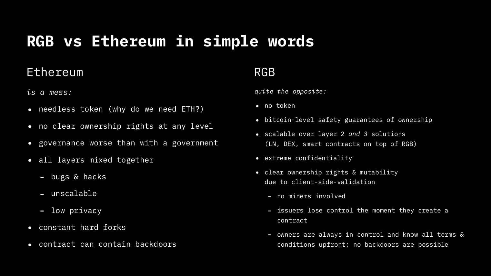

## Introdução

Em 3 de janeiro de 2009, Satoshi Nakamoto lançou o primeiro nó do Bitcoin, a partir desse momento novos nós se juntaram e o Bitcoin começou a se comportar como se fosse uma nova forma de vida, uma forma de vida que não parou de evoluir, aos poucos se tornou a rede mais segura do mundo como resultado de seu design único, muito bem pensado por Satoshi, pois, por meio de incentivos econômicos, atrai usuários comumente chamados de mineradores para investir em energia e poder de computação, o que contribui para a segurança da rede.

À medida que o Bitcoin continua seu crescimento e adoção, enfrenta problemas de escalabilidade, a rede Bitcoin permite que um novo bloco com transações seja minerado em um tempo aproximado de 10 minutos, supondo que tenhamos 144 blocos em um dia com valores máximos de 2700 transações por bloco, o Bitcoin permitiria apenas 4,5 transações por segundo, Satoshi estava ciente dessa limitação, podemos ver isso em um e-mail1 enviado a Mike Hearn em março de 2011, onde ele explica como o que conhecemos hoje como um canal de pagamento funciona. micropagamentos de forma rápida e segura, sem esperar por confirmações. É aqui que entram os protocolos off-chain.

De acordo com Christian Decker2, os protocolos off-chain são geralmente sistemas nos quais os usuários usam dados de uma blockchain e os gerenciam sem tocar na própria blockchain até o último minuto. Com base nesse conceito, nasceu a Lightning Network, uma rede que usa protocolos off-chain para permitir pagamentos em Bitcoin quase instantâneos e, como nem todas essas operações são registradas na cadeia de blocos, permite milhares de transações por segundo e escala o Bitcoin.

A pesquisa e o desenvolvimento na área de protocolos off-chain no Bitcoin abriram uma caixa de Pandora, hoje sabemos que podemos alcançar muito mais do que a transferência de valor de forma descentralizada, a Associação de Padrões LNP/BP sem fins lucrativos concentra-se no desenvolvimento de protocolos de camada 2 e 3 no Bitcoin e na Lightning Network, entre esses projetos, o RGB se destaca.

## O que é o RGB?

O RGB surgiu a partir da pesquisa de Peter Todd3 sobre selos de uso único e validação do lado do cliente, que foi cunhado em 2016-2019 por Giacomo Zucco e pela comunidade em um protocolo de ativos melhor para o Bitcoin e a Lightning Network. A evolução dessas ideias levou ao desenvolvimento do RGB em um sistema de contratos inteligentes completo por Maxim Orlovsky, que lidera sua implementação desde 2019 com a participação da comunidade.

Podemos definir o RGB como um conjunto de protocolos de código aberto que nos permite executar contratos inteligentes complexos de maneira escalável e confidencial. Não é uma rede específica (como o Bitcoin ou a Lightning); cada contrato inteligente é apenas um conjunto de participantes do contrato que podem interagir usando diferentes canais de comunicação (por padrão, a Lightning Network). O RGB usa a blockchain do Bitcoin como uma camada de compromisso de estado e mantém o código do contrato inteligente e os dados off-chain, o que o torna escalável, aproveitando as transações do Bitcoin (e o Script) como um sistema de controle de propriedade para contratos inteligentes; enquanto a evolução do contrato inteligente é definida por um esquema off-chain, finalmente é importante observar que tudo é validado no lado do cliente.
Em termos simples, RGB é um sistema que permite ao usuário auditar um contrato inteligente, executá-lo e verificá-lo individualmente a qualquer momento sem ter um custo adicional, uma vez que não utiliza uma blockchain como os sistemas "tradicionais" fazem. Sistemas complexos de contratos inteligentes foram pioneiros no Ethereum, mas devido à necessidade do usuário de gastar quantidades significativas de gás para cada operação, eles nunca alcançaram a escalabilidade prometida, consequentemente, nunca foi uma opção para bancar os usuários excluídos do sistema financeiro atual.
Atualmente, a indústria de blockchain promove que tanto o código dos contratos inteligentes quanto os dados devem ser armazenados na blockchain e executados por cada nó da rede, independentemente do aumento excessivo de tamanho ou do uso indevido de recursos computacionais. O esquema proposto pelo RGB é muito mais inteligente e eficiente, pois corta com o paradigma da blockchain, tendo contratos inteligentes e dados separados da blockchain e, assim, evita a saturação da rede vista em outras plataformas, por sua vez, não força cada nó a executar cada contrato, mas sim as partes envolvidas, o que adiciona confidencialidade a um nível nunca antes visto.



## Contratos inteligentes no RGB

No RGB, o desenvolvedor de contratos inteligentes define um esquema especificando regras de como o contrato evolui ao longo do tempo. O esquema é o padrão para a construção de contratos inteligentes no RGB, e tanto um emissor ao definir um contrato para emissão quanto uma carteira ou exchange devem aderir a um esquema específico contra o qual devem validar o contrato. Somente se a validação estiver correta, cada parte pode aceitar solicitações e trabalhar com o ativo.

Um contrato inteligente no RGB é um grafo acíclico direcionado (DAG) de mudanças de estado, onde apenas uma parte do grafo é sempre conhecida e não há acesso ao restante. O esquema RGB é um conjunto central de regras para a evolução deste grafo com o qual o contrato inteligente começa. Cada participante do contrato pode adicionar a essas regras (se isso for permitido pelo esquema) e o grafo resultante é construído a partir da aplicação iterativa dessas regras.

## Ativos fungíveis

Os ativos fungíveis no RGB seguem a especificação LNPBP RGB-20, quando um RGB-20 é definido, os dados do ativo conhecidos como "dados de gênese" são distribuídos através da Lightning Network, que contém o necessário para usar o ativo. A forma mais básica de ativos não permite emissão secundária, queima de tokens, renomeação ou substituição.

Às vezes, o emissor precisará emitir mais tokens no futuro, ou seja, stablecoins como USDT, que mantêm o valor de cada token vinculado ao valor de uma moeda inflacionária, como o dólar americano. Para alcançar isso, existem esquemas RGB-20 mais complexos, e além dos dados de gênese, eles exigem que o emissor produza remessas, que também circularão na rede Lightning; com essas informações, podemos conhecer o fornecimento total em circulação do ativo. O mesmo se aplica para queimar ativos ou alterar seu nome.

As informações relacionadas ao ativo podem ser públicas ou privadas: se o emissor requer confidencialidade, ele pode optar por não compartilhar informações sobre o token e realizar operações em total privacidade, mas também temos o caso oposto em que o emissor e os detentores precisam que todo o processo seja transparente. Isso é alcançado compartilhando os dados do token.

## Procedimentos RGB-20

O procedimento de queima desativa os tokens, os tokens queimados não podem mais ser usados.

O procedimento de substituição ocorre quando os tokens são queimados e uma nova quantidade do mesmo token é criada. Isso ajuda a reduzir o tamanho dos dados históricos do ativo, o que é importante para manter a velocidade do ativo.

Para suportar o caso de uso em que é possível queimar ativos sem precisar substituí-los, é usado um sub-esquema do RGB-20 que permite apenas a queima de ativos.

## Ativos não fungíveis

Os ativos não fungíveis em RGB seguem a especificação LNPBP RGB-21, quando trabalhamos com NFTs também temos um esquema principal e um subesquema. Esses esquemas possuem um procedimento de gravação, que nos permite anexar dados personalizados por parte do proprietário do token, o exemplo mais comum que vemos em NFTs hoje é arte digital vinculada ao token. O emissor do token pode proibir essa gravação de dados usando o subesquema RGB-21. Ao contrário de outros sistemas de blockchain NFT, o RGB permite distribuir dados de token de mídia de grande tamanho de forma completamente descentralizada e resistente à censura, utilizando uma extensão para a rede P2P Lightning chamada Bifrost, que também é usada para construir muitas outras formas de funcionalidades de contrato inteligente específicas do RGB.

Além dos ativos fungíveis e NFTs, o RGB e o Bifrost podem ser usados para produzir outras formas de contratos inteligentes, incluindo DEXes, pools de liquidez, stablecoins algorítmicas, etc., que abordaremos em artigos futuros.

## NFT do RGB vs NFT de outras plataformas

- Não há necessidade de armazenamento caro em blockchain
- Não há necessidade de IPFS, uma extensão da rede Lightning (chamada Bifrost) é usada em seu lugar (e é totalmente criptografada de ponta a ponta)
- Não há necessidade de uma solução especial de gerenciamento de dados - novamente, o Bifrost assume esse papel
- Não há necessidade de confiar em sites para manter dados de tokens NFT ou sobre ativos / ABIs de contratos
- Criptografia DRM embutida e gerenciamento de propriedade
- Infraestrutura para backups usando a Lightning Network (Bifrost)
- Formas de monetizar conteúdo (não apenas vendendo o próprio NFT, mas também o acesso ao conteúdo, várias vezes)

## Conclusões

Desde o lançamento do Bitcoin, há quase 13 anos, houve muita pesquisa e experimentação na área, tanto os sucessos quanto os erros nos permitiram entender um pouco mais como os sistemas descentralizados se comportam na prática, o que os torna realmente descentralizados e quais ações tendem a levá-los à centralização, tudo isso nos levou a concluir que a descentralização real é um fenômeno raro e difícil de alcançar, a descentralização real só foi alcançada pelo Bitcoin e é por isso que concentramos nossos esforços em construir em cima dele.

O RGB tem sua própria toca de coelho dentro da toca de coelho do Bitcoin, enquanto estou caindo por eles, vou postar o que aprendi, no próximo artigo teremos uma introdução aos nós LNP e RGB e como usá-los.

- 1 https://plan99.net/~mike/satoshi-emails/thread4.html
- 2 https://btctranscripts.com/chaincode-labs/chaincode-residency/2018-10-22-christian-decker-history-of-lightning/
- 3 https://lists.linuxfoundation.org/pipermail/bitcoin-dev/2016-June/012773.html
- 4 https://github.com/LNP-BP/LNPBPs/blob/master/lnpbp-0020.md

- 5 https://github.com/LNP-BP/LNPBPs/blob/master/lnpbp-0021.md

# Tutorial do RGB-node

## Introdução

Neste tutorial, explicamos como usar o RGB-node para criar um token fungível e como transferi-lo, este documento é baseado na demonstração do RGB-node e difere no fato de que este tutorial usa dados reais da testnet e, para isso, devemos construir nossa própria Transação Bitcoin Parcialmente Assinada, psbt a partir de agora.

Francisco Calderón publicado em
01 de março de 2022
https://grunch.dev/blog/rgbnode-tutorial/

## Requisitos

O uso de uma distribuição Linux é recomendado, este tutorial foi escrito usando o Pop!/\_OS, que é baseado no Ubuntu e você precisará de:

- cargo
- Bitcoin core
- git

Nota: Este tutorial mostra a execução de comandos em um terminal Linux, para diferenciar o que o usuário escreve e a resposta que ele recebe no terminal, incluímos o símbolo $ simbolizando o prompt bash.

Você precisará instalar algumas dependências:

```
$ sudo apt install -y build-essential pkg-config libzmq3-dev libssl-dev libpq-dev libsqlite3-dev cmake
```

Compilar e Executar

RGB-node está em andamento (WIP), por isso devemos nos localizar em um commit específico (3f3c520c19d84c66d430e76f0fc68c5a66d79c84) para poder compilar e usá-lo corretamente, para isso executamos os seguintes comandos.

```
$ git clone https://github.com/rgb-org/rgb-node.git
$ cd rgb-node
$ git checkout 3f3c520c19d84c66d430e76f0fc68c5a66d79c84
```

Agora compilamos, não se esqueça de usar a flag --locked porque há uma mudança quebrada introduzida em uma versão do clap.

```
$ cargo install --path . --all-features --locked

....
....
    Finished release [optimized] target(s) in 2m 14s
  Installing /home/user/.cargo/bin/fungibled
  Installing /home/user/.cargo/bin/rgb-cli
  Installing /home/user/.cargo/bin/rgbd
  Installing /home/user/.cargo/bin/stashd
   Installed package `rgb_node v0.4.2 (/home/user/dev/rgb-node)` (executables `fungibled`, `rgb-cli`, `rgbd`, `stashd`)

```

Como o compilador rust nos diz, os binários foram copiados para o diretório $HOME/.cargo/bin, se o seu compilador os copiou para um local diferente, você deve garantir que esse diretório seja incluído no $PATH.

Entre os binários instalados, podemos ver três daemons ou serviços (os arquivos que terminam em d) e um cli (interface de linha de comando), o cli nos permite interagir com o daemon principal rgbd. Como neste tutorial vamos executar dois nós, também precisaremos de dois clientes, cada um deve se conectar ao seu próprio nó, para isso criamos dois aliases.

```
alias rgb0-cli="$HOME/.cargo/bin/rgb-cli -d $HOME/rgbdata/data0 -n testnet"
alias rgb1-cli="$HOME/.cargo/bin/rgb-cli -d $HOME/rgbdata/data1 -n testnet"
```

Podemos simplesmente executar os aliases ou adicioná-los ao final do arquivo $HOME/.bashrc e executar source $HOME/.bashrc.
Premissa

RGB-node não lida com nenhum tipo de funcionalidade relacionada a carteiras, ele apenas realiza tarefas específicas do RGB nos dados que serão fornecidos por uma carteira externa como o bitcoin core. Em particular, para demonstrar um fluxo de trabalho básico com emissão e transferência, precisaremos de:

- Uma issuance_utxo à qual o rgb-node-0 vinculará o novo ativo emitido
- Uma receive_utxo onde o rgb-node-1 recebe o ativo
- Uma change_utxo onde o rgb-node-0 recebe a mudança do ativo
- Uma transação bitcoin parcialmente assinada (tx.psbt), cuja chave pública de saída será ajustada para incluir um compromisso com a transferência.
  'Vamos usar a interface de linha de comando do bitcoin core, precisamos ter o daemon bitcoind em execução na testnet, isso nos dará interoperabilidade e no final poderemos enviar nossos próprios ativos para outros usuários RGB que seguiram este tutorial.
  Para simplificar, adicionaremos esse alias ao final do nosso arquivo ~/.bashrc.

```
alias bcli="bitcoin-cli -testnet"
```

Vamos listar nossas transações de saída não gastas e selecionar duas, uma será a issuance_utxo e a outra será a change_utxo, não importa qual é qual, o importante é que o emissor tenha controle dessas duas UTXO.

```
$ bcli listunspent
[
  {
    "txid": "4c1785210d8930959f530072cffea7f9606e0599b0de9e89aed60f2e9f133893",
    "vout": 1,
    "address": "tb1qn4w9u5x0hxgm30hx6q2rhdwz58xr4ekqdq0vgm",
    "label": "",
    "scriptPubKey": "00149d5c5e50cfb991b8bee6d0143bb5c2a1cc3ae6c0",
    "amount": 0.01703963,
    "confirmations": 62432,
    "spendable": true,
    "solvable": true,
    "desc": "wpkh([ec924f82/0'/0'/5']031e0fc9a03e69326c3deeabfd749a7f7b094e3151ada90cd13019efac663c5663)#dj7rhpdt",
    "safe": true
  },
  {
    "txid": "cd66d3b77dfc1c2ecf958847c16a8a1311bba84ee7bf9dd55592a7b97b13028f",
    "vout": 1,
    "address": "tb1qyd537gf0xmm9ehmhaf3nv0a230crg56mhp9ap3",
    "scriptPubKey": "001423691f212f36f65cdf77ea63363faa8bf034535b",
    "amount": 0.02877504,
    "confirmations": 189184,
    "spendable": true,
    "solvable": true,
    "desc": "wpkh([ec924f82/0'/1'/0']03ae333417e86840145e95ab2852c8f7ca8b8f82cd910883f7ce0c69649403cef2)#jlcj23vw",
    "safe": true
  }
]
```

Antes de prosseguir, precisamos falar sobre outpoints, uma única transação pode incluir várias saídas, o outpoint inclui tanto um TXID de 32 bytes quanto um número de índice de saída de 4 bytes (vout) para se referir a uma saída específica separada por dois pontos :. Em nossa saída listunspent, podemos encontrar duas UTXOs, em cada uma podemos ver txid e vout, esses são os outpoints issuance_utxo e change_utxo.'
'receive_utxo' é uma UTXO controlada pelo destinatário, neste caso, usaremos e40d9037e31d3f440552b30af16e764cf25ffda3899b4851cc4e38fd64718b09:0, que é um outpoint de outra carteira.

- issuance_utxo: 4c1785210d8930959f530072cffea7f9606e0599b0de9e89aed60f2e9f133893:1
- change_utxo: cd66d3b77dfc1c2ecf958847c16a8a1311bba84ee7bf9dd55592a7b97b13028f:1
- receive_utxo: e40d9037e31d3f440552b30af16e764cf25ffda3899b4851cc4e38fd64718b09:0

Agora vamos criar uma transação parcialmente assinada (tx.psbt) cuja saída será ajustada para incluir uma transferência de compromisso, lembre-se de substituir o txid e vout pelos seus próprios, o endereço de destino não importa realmente, pode ser seu ou pode ser de outra pessoa, não importa para onde esses sats vão, o que importa é que usemos issuance_utxo.

```
$ bcli walletcreatefundedpsbt "[{/"txid/":/"4c1785210d8930959f530072cffea7f9606e0599b0de9e89aed60f2e9f133893/",/"vout/":1}]" "[{/"tb1q9crtjp0y6rt00c4fcrmuamrylzkcalcxls80j9/":/"0.00050000/"}]"
{
  "psbt": "cHNidP8BAHECAAAAAZM4E58uD9auiZ7esJkFbmD5p/7PcgBTn5UwiQ0hhRdMAQAAAAD/////ArM7GQAAAAAAFgAU4xQr/g1lgG2P9+gZudpFD8mOGGRQwwAAAAAAABYAFC4GuQXk0Nb34qnA987sZPitjv8GAAAAAAABAHECAAAAAYiK0TdTiaEs4oDovRokqspfLZr5EHYH8Pnj/Tv5GFB5AQAAAAD+////Av8Bh80AAAAAFgAUsLjOd30aRkUna41LAT5c3CnAz5obABoAAAAAABYAFJ1cXlDPuZG4vubQFDu1wqHMOubAyw8gAAEBHxsAGgAAAAAAFgAUnVxeUM+5kbi+5tAUO7XCocw65sAiBgMeD8mgPmkybD3uq/10mn97CU4xUa2pDNEwGe+sZjxWYxDskk+CAAAAgAAAAIAFAACAACICA2J21wOqW6bj7/ePTVI7QGvU6e4Sk8DhN5pmd9hrwSd7EOyST4IAAACAAQAAgAcAAIAAAA==",
  "fee": 0.00000280,
  "changepos": 0'
```

O resultado nos deu um psbt codificado em base64 que usaremos para criar tx.psbt.

```
$ echo "cHNidP8BAHECAAAAAZM4E58uD9auiZ7esJkFbmD5p/7PcgBTn5UwiQ0hhRdMAQAAAAD/////ArM7GQAAAAAAFgAU4xQr/g1lgG2P9+gZudpFD8mOGGRQwwAAAAAAABYAFC4GuQXk0Nb34qnA987sZPitjv8GAAAAAAABAHECAAAAAYiK0TdTiaEs4oDovRokqspfLZr5EHYH8Pnj/Tv5GFB5AQAAAAD+////Av8Bh80AAAAAFgAUsLjOd30aRkUna41LAT5c3CnAz5obABoAAAAAABYAFJ1cXlDPuZG4vubQFDu1wqHMOubAyw8gAAEBHxsAGgAAAAAAFgAUnVxeUM+5kbi+5tAUO7XCocw65sAiBgMeD8mgPmkybD3uq/10mn97CU4xUa2pDNEwGe+sZjxWYxDskk+CAAAAgAAAAIAFAACAACICA2J21wOqW6bj7/ePTVI7QGvU6e4Sk8DhN5pmd9hrwSd7EOyST4IAAACAAQAAgAcAAIAAAA==" | base64 -d > tx.psbt
```

Vamos criar um novo diretório chamado rgbdata no qual o diretório de dados de cada nó será armazenado.

```
$ mkdir $HOME/rgbdata
$ cd $HOME/rgbdata
```

Já localizado em $HOME/rgbdata, iniciamos cada nó em terminais diferentes, onde ~/.cargo/bin é o diretório onde o cargo copiou todos os binários após a instalação do rgb-node.

```
$ rgbd -vvvv -b ~/.cargo/bin -d ./data0 -n testnet
$ rgbd -vvvv -b ~/.cargo/bin -d ./data1 -n testnet
```

## Emissão

Para emitir um ativo, executamos o rgb0-cli com os subcomandos de emissão fungível, em seguida, os argumentos, o ticker USDT, o nome "USD Tether" e na alocação usaremos a quantidade de emissão e o issuance_utxo como vemos abaixo:

```
$ rgb0-cli fungible issue USDT "USD Tether" 1000@4c1785210d8930959f530072cffea7f9606e0599b0de9e89aed60f2e9f133893:1
```

Ativo emitido com sucesso. Use estas informações para compartilhar:
Informações do ativo:

```
'genesis: genesis1qyfe883hey6jrgj2xvk5g3dfmfqfzm7a4wez4pd2krf7ltsxffd6u6nrvjvvnc8vt9llmp7663pgututl9heuwaudet72ay9j6thc6cetuvhxvsqqya5xjt2w9y4u6sfkuszwwctnrpug5yjxnthmr3mydg05rdrpspcxysnqvvqpfvag2w8jxzzsz9pf8pjfwf0xvln5z7w93yjln3gcnyxsa04jsf2p8vu4sxgppfv0j9qerppqxhvztpqscnjsxvq5gdfy5v6j3wvpjxxqzcerxuglngnfvpxjkgqusct7cyx8zzezcfpqv3nxjxm2kjj4d0zu0ta6fjmpr8a0calk6h88h4ap5e4nucj0ch07aa73qsh3lj5sd89a32kwy0eq7tsa5zqqjpdqvqq5s46r0id: rgb1tadqzve7vwfh39sl6gvqenp8wegsrzreekhhu0dhthx08ppzj9wq8p0je6
ticker: USDT
name: USD Tether
description: ~
knownCirculating: 1000
isIssuedKnown: ~
issueLimit: 0
chain: testnet
decimalPrecision: 0
date: "2022-02-23T20:53:26"
knownIssues:
  - id: 5c912284f3cc5db73d7eafcd798801517627cc0c18d21f967893633e33015a5f
    amount: 1000
    origin: ~
knownInflation: {}
knownAllocations:
  - nodeId: 5c912284f3cc5db73d7eafcd798801517627cc0c18d21f967893633e33015a5f
    index: 0
    outpoint: "4c1785210d8930959f530072cffea7f9606e0599b0de9e89aed60f2e9f133893:1"
    revealedAmount:
      value: 1000
      blinding: "0000000000000000000000000000000000000000000000000000000000000001"'
```

Obtemos o assetId, precisamos dele para transferir o ativo.

```
$ rgb0-cli fungible list

- name: USD Tether
  id: rgb1tadqzve7vwfh39sl6gvqenp8wegsrzreekhhu0dhthx08ppzj9wq8p0je6
  ticker: USDT
```

## Gerar UTXO cegado

Para receber o novo USDT, rgb-node-1 precisa gerar um UTXO cegado correspondente a receive_utxo para manter o ativo.

```
$ rgb1-cli fungible blind e40d9037e31d3f440552b30af16e764cf25ffda3899b4851cc4e38fd64718b09:0

Blinded outpoint: utxob16az597vp5nkr66nfzsykf8ngdnvzep5050rm00l7vv8wm7vew4jqj7jhhf
Outpoint blinding secret: 1679197189805229975
```

Para poder aceitar transferências relacionadas a este UTXO, precisaremos do receive_utxo original e do blinding_factor.

## Transferência

Para transferir uma certa quantidade do ativo para rgb-node-1, precisamos enviá-lo para o UTXO cegado, rgb-node-0 precisa criar um consignment e uma disclosure, e comprometê-lo em uma transação bitcoin. Em seguida, precisaremos de um psbt que modificaremos para incluir o commit. Além disso, as opções -i e -a nos permitem fornecer um outpoint de entrada que seria a origem do ativo e uma alocação onde receberemos o troco, devemos indicá-lo da seguinte maneira @<change_utxo>.

```
'$ rgb0-cli fungible transfer utxob16az597vp5nkr66nfzsykf8ngdnvzep5050rm00l7vv8wm7vew4jqj7jhhf 100 rgb1tadqzve7vwfh39sl6gvqenp8wegsrzreekhhu0dhthx08ppzj9wq8p0je6 tx.psbt consignment.rgb disclosure.rgb witness.psbt -i 4c1785210d8930959f530072cffea7f9606e0599b0de9e89aed60f2e9f133893:1 -a 900@cd66d3b77dfc1c2ecf958847c16a8a1311bba84ee7bf9dd55592a7b97b13028f:1
Transferência bem-sucedida, os envios e a divulgação estão escritos em "consignment.rgb" e "disclosure.rgb", transação de testemunha parcialmente assinada em "witness.psbt"'
Dados de remessa para compartilhar: consignment1qxz4g7ec6da33llaxe97u9hx8p9wcgp2yv46ycudwy7ytjf4gdh88x6upcdmjfy3mp4y0n669j5ar5y6e04zfr7255kynff6eymx9tdfc7jux5jk6tgn4xm6lttlh3lh08070ltuh60l07mamlns2qyy984mg4m5dz0x6s5sy5edls2zjlmnvw708sh7fy2vuph745jcpgp92qrw27s73vm4ghrx57vammyf8wautwu5euujd8w3dupdtgp4px36gz8z0ywnuty45uqdwk672qqzjp3j77yl7urft6gewqksqgppczezn5c7gyux6gzgpye0wgyjp85ufdqlzy5cd8zwfg3q9550xq2hyf24qqz92wqskpgq8qsr8kp5p9dt49evmqlze9ylrx2sqpwpvpqp45lpvgjkgk542pks9850w5jquq3qqsj4xsqn9nu6w30lgpmrhdqs6jj0ez3myhj74kp223f0wg2y7vupczdq5pa23mzhzc6l647nl6ftrru0mjrh739yhgztsdhl2cdmhf0qm7du9n20up4rnnsp0tlp8665xldkq9z9u85tgh6nxmkfg3pc6wzk2t90pekj2d6l0km09vyt4vut24vhzg9qhrdsgr7dws828p6ejk7ddy0zkz3a2fq5648664w3se2egwvh904lzmpnc7a7wy4fayznunt6j4ndmm68y24tjje4qxnxs70w4lr9vz9q9qca903edtjd6c5f37jagafsqnhnlsuwvnqwc7uly4dw2rnlyxp4zcfqrfpkpez54c0lc3tmvppmv06ge97heevgt0acrq0ezgjr6ck9waqpanypl8dzrqdzjd05h735tdgv2wjjjucheur40h4wjw4pcdpc8pqlh7ef95rj2al8v3eexkgty8j2ne7kk2zxpe0wypq8ra0x76rt6cu00cw4w05v0u3ng6zhfrttz2c3m5nx64s8w98wa26dx79jwhne44gp9lmg6vkhxq98meslyr4zqtxjsg27xzj80m0csd77lr047vwycvdw0z8mwudm3uvlry9p9da4su72k9q84pphw4n0fyeet0ujzrdgacm6p777jun0y0v397mp4drafr6q7994kdl96m388xp6ggf5arn4d4ed53rv9tlkerckqvkng92uhdvngwcl3m6yqhxdjjnkca62tckxfnrae4cx4e6wx6ww5649v4hvuwkkajanllc38wavqy83xhn555l708354nt2quscchexsxjgezdxfnmxgue0cn4ktghd6xd2le76k5cw3t0p0nurs4h5rjz0j7twj9ulwkp7cmhhgl23r7g677gk36r5jw8panh2sq5966m08sa5632egd5ms6h0e504dtwskct3x6a93uutaumtc8aam8yyt66lrmrhcssw9ga2yg0496s6sdmaexa49064g3syc888egnwa8racrwwwwemknqamarpqlmqa5mg8zgt0dts8ehuwmgz4j3cjltr8gv78e7p84zm8pylann7dmss5suf4htqc04qx5trnk59m305ah2qp4mvkxwy6ts84sa30d80jzk9s6n40e4j8dcvq79ncg5e3z5g4esxyawmxk7lvm5efc30vtw8qqhe9xx3773djez6hjjx0x962z2radnvdmazkrmlqw7guxz29qvahcx79h33ncqhzhvekwaqqnrz3wxnp2qy3u83zdgdcgq27n5n22h7jjedrh28m8c6mn42xhfjasm5njsxtufqjxefnhc2n5zr0um0xlqk62cu25cjwuwwrcv3e4vhh2tdzn8rnlaefj98fvslg7sun95wpt2a4vcg4ua62v97aeqstvjegmlem5crnsamrhm3a2pcma2s22atr43lgx9vh7kn9lzymfe83a4vhe9rc6xl5pmy5hjw4t88k0fwh6lzmjtjvqtczq47ny7hv8ytdqdy2c7ce3gegnufkzwphkwtz6xqzklyw7e7f76fwfewfuyqal7dl8r9476jerrl40mav38sun2u8jvftw33x3r20dmeka34znmkgaz29ppk5hz3ldttw8zyz4k6q0gts8utqh53tuc7vtajl26rq2fnxr0vxcwlx9rfvn6v8ar8c73qkc3zca4mlgl7qu36sk7e'
```

Isso irá escrever três novos arquivos, consignment, disclosure e o psbt incluindo o ajuste, este psbt é chamado de transação de testemunha, a consignment é enviada para rgb-node-1.

## Testemunha

A transação de testemunha deve ser assinada e transmitida, para isso precisamos codificá-la novamente em base64.

```
$ base64 -w0 witness.psbt

cHNidP8BAHECAAAAAe2pydT0BqfK5nBCdBSbm3W/vNKE/QxTr4eJcjwjDLDjAQAAAAD/////AiWbAAAAAAAAFgAUO1Bi4v2VHUJPmq5iyYhDv1tyTCcQJwAAAAAAABYAFPwfm3skdSeMnOfcDqBpgVjwuwESAAAAAAABAHECAAAAAeSwUiZ+p3/NM7yt3BAoDkm/afi//lplsffwwpTqjd+CAQAAAAD/////AlDDAAAAAAAAFgAULga5BeTQ1vfiqcD3zuxk+K2O/wbDwgAAAAAAABYAFLsvLLowx0NR5NyFKj9wl3IFvNcPAAAAAAEBH8PCAAAAAAAAFgAUuy8sujDHQ1Hk3IUqP3CXcgW81w8iBgKIYFEbYKvRj25inaA0/c0PMIZD/BFAgFbjrBJe8cZ+cxDskk+CAAAAgAEAAIADAACAACICAsnwAXsMVlPXi/2ExgqtLoIN4TncWVW0EImSo9YwyhNmEOyST4IAAACAAQAAgAUAAIAG/ANSR0IBIQLJ8AF7DFZT14v9hMYKrS6CDeE53FlVtBCJkqPWMMoTZgb8A1JHQgIgMD8j8bQGB8NgEobv3NUJr7aERA/FkGgQ5w2KwF+daDgAAA==
```

Assine-o com o subcomando walletprocesspsbt.

```
`$ bcli walletprocesspsbt "cHNidP8BAHECAAAAAe2pydT0BqfK5nBCdBSbm3W/vNKE/QxTr4eJcjwjDLDjAQAAAAD/////AiWbAAAAAAAAFgAUO1Bi4v2VHUJPmq5iyYhDv1tyTCcQJwAAAAAAABYAFPwfm3skdSeMnOfcDqBpgVjwuwESAAAAAAABAHECAAAAAeSwUiZ+p3/NM7yt3BAoDkm/afi//lplsffwwpTqjd+CAQAAAAD/////AlDDAAAAAAAAFgAULga5BeTQ1vfiqcD3zuxk+K2O/wbDwgAAAAAAABYAFLsvLLowx0NR5NyFKj9wl3IFvNcPAAAAAAEBH8PCAAAAAAAAFgAUuy8sujDHQ1Hk3IUqP3CXcgW81w8iBgKIYFEbYKvRj25inaA0/c0PMIZD/BFAgFbjrBJe8cZ+cxDskk+CAAAAgAEAAIADAACAACICAsnwAXsMVlPXi/2ExgqtLoIN4TncWVW0EImSo9YwyhNmEOyST4IAAACAAQAAgAUAAIAG/ANSR0IBIQLJ8AF7DFZT14v9hMYKrS6CDeE53FlVtBCJkqPWMMoTZgb8A1JHQgIgMD8j8bQGB8NgEobv3NUJr7aERA/FkGgQ5w2KwF+daDgAAA=="{'`

`$ bcli walletprocesspsbt "cHNidP8BAHECAAAAAe2pydT0BqfK5nBCdBSbm3W/vNKE/QxTr4eJcjwjDLDjAQAAAAD/////AiWbAAAAAAAAFgAUO1Bi4v2VHUJPmq5iyYhDv1tyTCcQJwAAAAAAABYAFPwfm3skdSeMnOfcDqBpgVjwuwESAAAAAAABAHECAAAAAeSwUiZ+p3/NM7yt3BAoDkm/afi//lplsffwwpTqjd+CAQAAAAD/////AlDDAAAAAAAAFgAULga5BeTQ1vfiqcD3zuxk+K2O/wbDwgAAAAAAABYAFLsvLLowx0NR5NyFKj9wl3IFvNcPAAAAAAEBH8PCAAAAAAAAFgAUuy8sujDHQ1Hk3IUqP3CXcgW81w8iBgKIYFEbYKvRj25inaA0/c0PMIZD/BFAgFbjrBJe8cZ+cxDskk+CAAAAgAEAAIADAACAACICAsnwAXsMVlPXi/2ExgqtLoIN4TncWVW0EImSo9YwyhNmEOyST4IAAACAAQAAgAUAAIAG/ANSR0IBIQLJ8AF7DFZT14v9hMYKrS6CDeE53FlVtBCJkqPWMMoTZgb8A1JHQgIgMD8j8bQGB8NgEobv3NUJr7aERA/FkGgQ5w2KwF+daDgAAA=="{'`
'"psbt": "cHNidP8BAHECAAAAAe2pydT0BqfK5nBCdBSbm3W/vNKE/QxTr4eJcjwjDLDjAQAAAAD/////AiWbAAAAAAAAFgAUO1Bi4v2VHUJPmq5iyYhDv1tyTCcQJwAAAAAAABYAFPwfm3skdSeMnOfcDqBpgVjwuwESAAAAAAABAHECAAAAAeSwUiZ+p3/NM7yt3BAoDkm/afi//lplsffwwpTqjd+CAQAAAAD/////AlDDAAAAAAAAFgAULga5BeTQ1vfiqcD3zuxk+K2O/wbDwgAAAAAAABYAFLsvLLowx0NR5NyFKj9wl3IFvNcPAAAAAAEBH8PCAAAAAAAAFgAUuy8sujDHQ1Hk3IUqP3CXcgW81w8BCGsCRzBEAiAZud+YVf1FyZq0IDQ+/oAE34TKypedrJGUcYx0QIpaygIgZJO7xvN0dOQXbXTRYE0QxGIWsfo85Dhwne0/whoO06kBIQKIYFEbYKvRj25inaA0/c0PMIZD/BFAgFbjrBJe8cZ+cwAiAgLJ8AF7DFZT14v9hMYKrS6CDeE53FlVtBCJkqPWMMoTZhDskk+CAAAAgAEAAIAFAACABvwDUkdCASECyfABewxWU9eL/YTGCq0ugg3hOdxZVbQQiZKj1jDKE2YG/ANSR0ICIDA/I/G0BgfDYBKG79zVCa+2hEQPxZBoEOcNisBfnWg4AAA=",  "complete": true
}
```

Agora finalize e obtenha o hexadecimal.

```
$ bcli finalizepsbt "cHNidP8BAHECAAAAAe2pydT0BqfK5nBCdBSbm3W/vNKE/QxTr4eJcjwjDLDjAQAAAAD/////AiWbAAAAAAAAFgAUO1Bi4v2VHUJPmq5iyYhDv1tyTCcQJwAAAAAAABYAFPwfm3skdSeMnOfcDqBpgVjwuwESAAAAAAABAHECAAAAAeSwUiZ+p3/NM7yt3BAoDkm/afi//lplsffwwpTqjd+CAQAAAAD/////AlDDAAAAAAAAFgAULga5BeTQ1vfiqcD3zuxk+K2O/wbDwgAAAAAAABYAFLsvLLowx0NR5NyFKj9wl3IFvNcPAAAAAAEBH8PCAAAAAAAAFgAUuy8sujDHQ1Hk3IUqP3CXcgW81w8BCGsCRzBEAiAZud+YVf1FyZq0IDQ+/oAE34TKypedrJGUcYx0QIpaygIgZJO7xvN0dOQXbXTRYE0QxGIWsfo85Dhwne0/whoO06kBIQKIYFEbYKvRj25inaA0/c0PMIZD/BFAgFbjrBJe8cZ+cwAiAgLJ8AF7DFZT14v9hMYKrS6CDeE53FlVtBCJkqPWMMoTZhDskk+CAAAAgAEAAIAFAACABvwDUkdCASECyfABewxWU9eL/YTGCq0ugg3hOdxZVbQQiZKj1jDKE2YG/ANSR0ICIDA/I/G0BgfDYBKG79zVCa+2hEQPxZBoEOcNisBfnWg4AAA="{
  "hex": "02000000000101eda9c9d4f406a7cae6704274149b9b75bfbcd284fd0c53af8789723c230cb0e30100000000ffffffff02259b0000000000001600143b5062e2fd951d424f9aae62c98843bf5b724c271027000000000000160014fc1f9b7b2475278c9ce7dc0ea0698158f0bb011202473044022019b9df9855fd45c99ab420343efe8004df84caca979dac9194718c74408a5aca02206493bbc6f37474e4176d74d1604d10c46216b1fa3ce438709ded3fc21a0ed3a90121028860511b60abd18f6e629da034fdcd0f308643fc11408056e3ac125ef1c67e7300000000",
  "complete": true
}
```

## Transmitir

Transmita-o usando o subcomando sendrawtransaction para que seja confirmado na blockchain.

## Aceitar

Para aceitar uma transferência recebida, o rgb-node-1 deve ter recebido o arquivo de consignação do rgb-node-0, ter o receive_utxo e o fator de cegamento correspondente gerado durante a geração de UTXO cegos.

```
$ rgb1-cli fungible accept consignment.rgb e40d9037e31d3f440552b30af16e764cf25ffda3899b4851cc4e38fd64718b09:0 1679197189805229975
```

Transferência de ativos aceita com sucesso.

Agora podemos ver (no campo knownAllocations) a nova alocação de 100 unidades de ativos em <receive_utxo> executando:

```
$ rgb1-cli fungible list -l

- genesis: genesis1qyfe883hey6jrgj2xvk5g3dfmfqfzm7a4wez4pd2krf7ltsxffd6u6nrvjvvnc8vt9llmp7663pgututl9heuwaudet72ay9j6thc6cetuvhxvsqqya5xjt2w9y4u6sfkuszwwctnrpug5yjxnthmr3mydg05rdrpspcxysnqvvqpfvag2w8jxzzsz9pf8pjfwf0xvln5z7w93yjln3gcnyxsa04jsf2p8vu4sxgppfv0j9qerppqxhvztpqscnjsxvq5gdfy5v6j3wvpjxxqzcerxuglngnfvpxjkgqusct7cyx8zzezcfpqv3nxjxm2kjj4d0zu0ta6fjmpr8a0calk6h88h4ap5e4nucj0ch07aa73qsh3lj5sd89a32kwy0eq7tsa5zqqjpdqvqq5s46r0
  id: rgb1tadqzve7vwfh39sl6gvqenp8wegsrzreekhhu0dhthx08ppzj9wq8p0je6
  ticker: USDT'
name: USD Tether
description: ~
circulação conhecida: 1000
é emitido conhecido: ~
limite de emissão: 0
rede: testnet
precisão decimal: 0
data: "2022-02-23T20:53:26"
problemas conhecidos:
  - id: 5c912284f3cc5db73d7eafcd798801517627cc0c18d21f967893633e33015a5f
    quantidade: 1000
    origem: ~
inflação conhecida: {}
alocações conhecidas:
  - nodeId: 5c912284f3cc5db73d7eafcd798801517627cc0c18d21f967893633e33015a5f
    índice: 0
    outpoint: "4c1785210d8930959f530072cffea7f9606e0599b0de9e89aed60f2e9f133893:1"
    quantidade revelada:
      valor: 1000
      ofuscação: "0000000000000000000000000000000000000000000000000000000000000001"
  - nodeId: 28f82e2dcfa91282c28a8805ff0c7fde4bd4e0bdbd40c6ba55e191666e45327b
    índice: 1
    outpoint: "e40d9037e31d3f440552b30af16e764cf25ffda3899b4851cc4e38fd64718b09:0"
    quantidade revelada:
      valor: 100
      ofuscação: 224561f10229eb9ebbdf05f497132d2b8344d70971c80510eddc607d615ee2a0
```

Como receive_utxo foi ofuscado quando a transferência foi feita, o pagador rgb-node-0 não tem informações sobre para onde os 100 USDT foram enviados, portanto, a localização não é mostrada em knownAllocations.

````
$ rgb0-cli fungible list -l

- genesis: genesis1qyfe883hey6jrgj2xvk5g3dfmfqfzm7a4wez4pd2krf7ltsxffd6u6nrvjvvnc8vt9llmp7663pgututl9heuwaudet72ay9j6thc6cetuvhxvsqqya5xjt2w9y4u6sfkuszwwctnrpug5yjxnthmr3mydg05rdrpspcxysnqvvqpfvag2w8jxzzsz9pf8pjfwf0xvln5z7w93yjln3gcnyxsa04jsf2p8vu4sxgppfv0j9qerppqxhvztpqscnjsxvq5gdfy5v6j3wvpjxxqzcerxuglngnfvpxjkgqusct7cyx8zzezcfpqv3nxjxm2kjj4d0zu0ta6fjmpr8a0calk6h88h4ap5e4nucj0ch07aa73qsh3lj5sd89a32kwy0eq7tsa5zqqjpdqvqq5s46r0
'id: rgb1tadqzve7vwfh39sl6gvqenp8wegsrzreekhhu0dhthx08ppzj9wq8p0je6  ticker: USDT\nname: USD Tether\ndescription: ~\nknownCirculating: 1000\nisIssuedKnown: ~\nissueLimit: 0\nchain: testnet\ndecimalPrecision: 0\ndate: "2022-02-23T20:53:26"\nknownIssues:\n- id: 5c912284f3cc5db73d7eafcd798801517627cc0c18d21f967893633e33015a5f\n  amount: 1000\n  origin: ~\nknownInflation: {}\nknownAllocations:\n- nodeId: 5c912284f3cc5db73d7eafcd798801517627cc0c18d21f967893633e33015a5f\n  index: 0\n  outpoint: "4c1785210d8930959f530072cffea7f9606e0599b0de9e89aed60f2e9f133893:1"\n  revealedAmount:\n    value: 1000\n    blinding: "0000000000000000000000000000000000000000000000000000000000000001"\n\nBut as you can see rgb-node-0 can't see the 900 asset change that we supplied to the transfer command with the -a argument. To register the change rgb-node-0 needs to accept the disclosure.\n\n```\n$ rgb0-cli fungible enclose disclosure.rgb\n\nDisclosure data successfully enclosed.\n```\n\nIf rgb-node-0 was successful you can see the change by listing the asset.\n\n```\n$ rgb0-cli fungible list -l\n\n- genesis: genesis1qyfe883hey6jrgj2xvk5g3dfmfqfzm7a4wez4pd2krf7ltsxffd6u6nrvjvvnc8vt9llmp7663pgututl9heuwaudet72ay9j6thc6cetuvhxvsqqya5xjt2w9y4u6sfkuszwwctnrpug5yjxnthmr3mydg05rdrpspcxysnqvvqpfvag2w8jxzzsz9pf8pjfwf0xvln5z7w93yjln3gcnyxsa04jsf2p8vu4sxgppfv0j9qerppqxhvztpqscnjsxvq5gdfy5v6j3wvpjxxqzcerxuglngnfvpxjkgqusct7cyx8zzezcfpqv3nxjxm2kjj4d0zu0ta6fjmpr8a0calk6h88h4ap5e4nucj0ch07aa73qsh3lj5sd89a32kwy0eq7tsa5zqqjpdqvqq5s46r0\n  id: rgb1tadqzve7vwfh39sl6gvqenp8wegsrzreekhhu0dhthx08ppzj9wq8p0je6\n  ticker: USDT\n  name: USD Tether'
'description: ~  knownCirculating: 1000
  isIssuedKnown: ~
  issueLimit: 0
  chain: testnet
  decimalPrecision: 0
  date: "2022-02-23T20:53:26"
  knownIssues:
    - id: 5c912284f3cc5db73d7eafcd798801517627cc0c18d21f967893633e33015a5f
      amount: 1000
      origin: ~
  knownInflation: {}
  knownAllocations:
    - nodeId: 5c912284f3cc5db73d7eafcd798801517627cc0c18d21f967893633e33015a5f
      index: 0
      outpoint: "4c1785210d8930959f530072cffea7f9606e0599b0de9e89aed60f2e9f133893:1"
      revealedAmount:
        value: 1000
        blinding: "0000000000000000000000000000000000000000000000000000000000000001"
    - nodeId: 28f82e2dcfa91282c28a8805ff0c7fde4bd4e0bdbd40c6ba55e191666e45327b
      index: 0
      outpoint: "cd66d3b77dfc1c2ecf958847c16a8a1311bba84ee7bf9dd55592a7b97b13028f:1"
      revealedAmount:
        value: 900
        blinding: ddba9e0efdd614614420fa0b68ecd2d3376a05dd3d809b2ad1f5fe0f6ed75ea2
````

## Conclusões

Conseguimos criar um ativo fungível e movê-lo de uma transação para outra de forma privada, se verificarmos a transação confirmada em um explorador de blocos, não encontraríamos nada diferente de uma transação regular, isso se deve ao fato de que o RGB usa selos de uso único para ajustar as transações. Neste post, faço uma introdução sobre como o RGB funciona.

Este post pode conter erros, se você encontrar algo, por favor, me avise para melhorar este guia, sugestões e críticas também são bem-vindas, feliz hacking! 🖖
