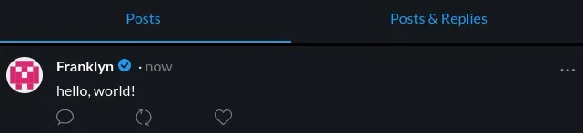
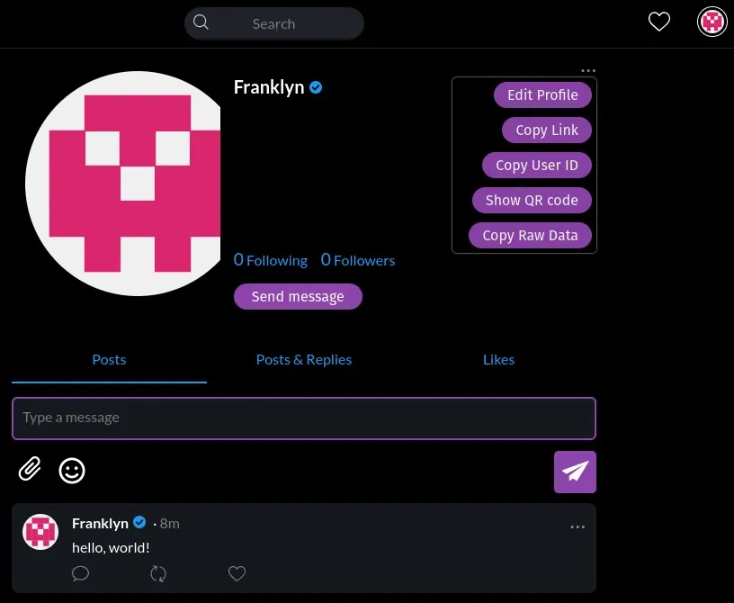

Am Ende dieses Leitfadens wirst du verstehen, was Nostr ist, du wirst ein Konto erstellt haben und in der Lage sein, es zu verwenden.

## Was ist Nostr?

Nostr ist ein Protokoll, das Twitter, Telegram und andere soziale Medien ersetzen kann. Es handelt sich um ein einfaches und offenes Protokoll, das ein zensurresistentes globales soziales Netzwerk schaffen kann.

## Wie funktioniert es?

Nostr basiert auf drei Komponenten: Schlüsselpaare, Clients und Relais.

Jeder Benutzer hat eine oder mehrere Identitäten, wobei jede Identität durch ein kryptographisches Schlüsselpaar bestimmt wird.

Um auf das Netzwerk zuzugreifen, muss man eine Client-Software verwenden und sich mit Relais verbinden, um Inhalte zu empfangen und zu senden.

## 1. Kryptographische Schlüssel

Im Gegensatz zu Facebook oder Twitter, wo der Benutzer eine E-Mail-Adresse und eine Vielzahl von Informationen an ein privates Unternehmen weitergeben muss, funktioniert Nostr ohne eine zentrale Autorität. Der Benutzer generiert ein kryptographisches Schlüsselpaar, einen geheimen Schlüssel (auch als privater Schlüssel bezeichnet) und einen öffentlichen Schlüssel.

Der geheime Schlüssel, nsec, der nur dem Benutzer bekannt ist, dient zur Authentifizierung und Veröffentlichung von Inhalten.

Der öffentliche Schlüssel, npub, ist eine eindeutige Kennung, die allen Inhalten zugeordnet ist, die von einem Benutzer veröffentlicht werden. Dein öffentlicher Schlüssel ist eine Art Benutzername, der es anderen Benutzern ermöglicht, dich zu finden und deinem Nostr-Feed zu folgen.

## 2. Clients

Clients sind Softwareprogramme, mit denen man mit Nostr interagieren kann. Die wichtigsten Clients sind:

> iOS: damus
> Android: amethyst
> Web: iris.to; snort.social; astral.ninja

Die Clients ermöglichen es einem Benutzer, ein neues Schlüsselpaar zu generieren (ähnlich wie das Erstellen eines Kontos) oder sich mit einem vorhandenen Schlüsselpaar zu authentifizieren.

## 3. Relais

Relais sind einfache Server, die du jederzeit verlassen kannst, wenn dir der von ihnen übermittelte Inhalt nicht gefällt. Du kannst auch dein eigenes Relais betreiben, wenn du möchtest.

> 💡 Pro-Tipp: Bezahlte Relais sind in der Regel effektiver beim Filtern von Spam und unerwünschten Inhalten.

# Leitfaden

Jetzt weißt du genug über Nostr, um loszulegen und deine erste Identität in diesem Protokoll zu erstellen.

Für die Zwecke dieses Leitfadens werden wir iris.to (https://iris.to/) verwenden, da dieser Webclient auf jeder Plattform funktioniert.

## Schritt 1: Generierung von Schlüsseln

ris wird für dich einen Schlüsselsatz generieren, ohne dass du etwas weiter tun musst, als einen Namen (echt oder fiktiv) für dein Profil einzugeben. Klicke dann auf GO und das war's!

> ⚠️ Achtung! Du musst deine Schlüssel aufbewahren, wenn du nach dem Schließen deiner Sitzung erneut auf dein Profil zugreifen möchtest. Ich zeige dir am Ende dieses Leitfadens, wie das geht.

## Schritt 2: Inhalt veröffentlichen

Um Inhalte zu veröffentlichen, ist nichts einfacher und intuitiver, als ein paar Worte in das Veröffentlichungsfeld zu schreiben.

Da hast du es! Du hast deine erste Notiz auf Nostr veröffentlicht.

## Schritt 3: Einen Freund finden

Finde mich auf Nostr und sei nie wieder allein. Ich werde allen folgen, die meinem Feed folgen. Dazu musst du nur meinen öffentlichen Schlüssel

npub1hartx53w6t3q5wv9xdqdwrk7h6r5866t8u775q0304zedpn5zgssasp7d3 in die Suchleiste eingeben.

Klicke auf "folgen" und in ein paar Tagen werde ich auch deinem Feed folgen. Wir werden Freunde sein. Es würde mich auch freuen, von dir zu lesen, wenn du mir eine Nachricht schreiben möchtest.

Stelle außerdem sicher, dass du dem Feed von Agora256 folgst, um eine Benachrichtigung zu erhalten, wenn wir etwas Neues veröffentlichen: npub1ag0rawstycy7nanuc6sz4v287rneen2yapcq3fd06972f8ncrhzqx

## Schritt 4: Personalisiere dein Profil

Du hast noch ein wenig Arbeit, um dein Profil anzupassen. Klicke dazu auf den Avatar, den Iris automatisch für dich in der oberen rechten Ecke des Bildschirms generiert hat, und klicke dann auf "Profil bearbeiten".

Du musst Iris nur noch mitteilen, wo sie dein Profilbild und dein Banner im Internet finden kann. Ich empfehle dir, deinen Inhalt selbst zu hosten: Schütze, was dir gehört.

Wenn du möchtest, kannst du auch Bilder hochladen. Diese werden von Iris für dich auf nostr.build gespeichert, einem kostenlosen Dienst zur visuellen Inhaltsbereitstellung für Nostr.

Wie du sehen kannst, kannst du auch deinen Client konfigurieren, um Sats zu empfangen und zu senden. So kannst du die Autoren von Inhalten belohnen, die dir gefallen haben, oder noch besser, selbst Sats für großartige Inhalte sammeln, die du veröffentlichen wirst.

## Schritt 5: Sicherung des Schlüsselpaars

Dieser Schritt ist entscheidend, wenn du den Zugriff auf dein Profil behalten möchtest, nachdem du dich vom Client abgemeldet hast oder deine Sitzung abgelaufen ist.
'D'abord, clique sur l'icône "settings" représentée par un engrenage

Puis, copie-colle à tour de rôle tes npub, npub hex, nsec et nsec hex dans un fichier texte que tu garderas en sécurité. Je te recommande de crypter ce fichier, si tu sais comment le faire.

> ⚠️ Remarque bien l'avertissement que te donne iris. Si tu peux partager ta clé publique sans crainte, il en est tout autrement de ta clé privée. Quiconque possède cette dernière pourra accéder à ton compte.

## Conclusion

Ça y est, petite autruche, tu as fait tes premiers pas sur Nostr. Maintenant, il te faudra apprendre à courir à la vitesse de l'éclair. Nous publierons prochainement des guides qui te montreront à gérer tes clés et comment intégrer lightning à ton expérience Nostr à l'aide de getalby.
