La misión de PlanB es proporcionar recursos educativos de primer nivel sobre Bitcoin, en tantos idiomas como sea posible. Todo el contenido publicado en el sitio es de código abierto y alojado en GitHub, ofreciendo así a cualquier persona la oportunidad de participar en el enriquecimiento de la plataforma. Las contribuciones pueden tomar diversas formas: corregir y revisar textos existentes, traducir a otros idiomas, actualizar información o crear nuevos tutoriales aún no disponibles en nuestro sitio.

Si deseas contribuir a la Red PlanB, pero no te sientes cómodo usando GitHub, este tutorial está diseñado especialmente para ti. Detallaremos cómo contribuir a la Red PlanB a través de GitHub, mientras usamos Obsidian, una herramienta diseñada para facilitar la escritura.

Verás que configurar todo el proceso de trabajo es bastante largo, especialmente si nunca has usado GitHub antes. Sin embargo, el uso de Git facilita la colaboración en la escritura de contenido, ya que permite un seguimiento preciso de los cambios, una gestión eficiente de versiones y también permite la revisión y mejora del contenido por otros colaboradores. Además, una vez que el proceso de trabajo esté configurado en tu PC, encontrarás que Git facilita mucho tu trabajo. Incluso podrías salir con el deseo de usar Git para tus otros proyectos personales porque este software es tan efectivo.

## Glosario de Git
- **Fetch origin:** Comando que recupera información reciente y cambios de un repositorio remoto sin fusionarlos con tu trabajo local.
- **Pull origin:** Comando que recupera actualizaciones de un repositorio remoto e inmediatamente las integra en tu rama local para sincronizarla.
- **Sync Fork:** Comando en GitHub que actualiza tu bifurcación de un proyecto con los últimos cambios del repositorio fuente.
- **Push origin:** Comando utilizado para enviar tus modificaciones locales a un repositorio remoto.
- **Pull Request:** Una solicitud enviada por un colaborador para indicar que han realizado modificaciones en una rama de un repositorio remoto y desean que estas modificaciones sean revisadas y potencialmente integradas (fusionadas) en la rama principal del repositorio.
- **Commit:** Guardar tus modificaciones. Un commit es como una instantánea instantánea de tu trabajo en un momento dado, lo que ayuda a mantener un historial de cambios.
- **Branch:** Una versión paralela del repositorio, que te permite trabajar en modificaciones sin afectar la rama principal (llamada "`dev`" en el repositorio de PlanB).
- **Merge:** Fusionar consiste en integrar las modificaciones de una rama en otra. Se utiliza, por ejemplo, para añadir las modificaciones de una rama de trabajo a la rama principal.
- **Fork:** Hacer un fork de un repositorio significa crear una copia de ese repositorio en tu propia cuenta de GitHub, lo que te permite trabajar en el proyecto sin afectar al repositorio original.
- **Clone:** Clonar un repositorio significa hacer una copia local en tu computadora, dándote acceso a todos los archivos y al historial de modificaciones.

- **Repository:** Un espacio de almacenamiento para un proyecto en GitHub. Contiene todos los archivos del proyecto así como el historial de todas las modificaciones que se han realizado.

## ¿Qué tipo de contenido escribir en la Red PlanB?
Estamos buscando principalmente tutoriales sobre herramientas relacionadas con Bitcoin o su ecosistema. Estos contenidos pueden estructurarse alrededor de seis categorías principales:
- Cartera;
- Nodo;
- Minería;
- Comerciante;
- Intercambio;
- Privacidad.

Más allá de estos temas específicamente relacionados con Bitcoin, PlanB también busca contribuciones sobre temas que resalten la soberanía individual, tales como:
- Herramientas de código abierto;
- Computación;
- Criptografía;
- Energía;
- Matemáticas;
- Economía;
- Hazlo tú mismo (DIY);
- LifeHacking...
Por ejemplo, actualmente tenemos tutoriales sobre Tails, Nostr o GrapheneOS. Estas herramientas no están directamente relacionadas con Bitcoin, pero son sistemas que pueden interesarnos desde un enfoque de soberanía en el mundo digital, o en aprender a lograrlo. Estos contenidos pueden integrarse en una subcategoría de la sección "Otros".
Tienes la opción de diseñar un tutorial desde cero o republicar un tutorial previamente publicado en tu sitio web (siempre y cuando poseas los derechos de autor) para compartirlo también en PlanB Network, añadiendo un enlace al artículo original.

Independientemente de tu elección, ten en cuenta que todo el contenido publicado en PlanB Network está bajo la licencia libre [CC-BY-SA](https://creativecommons.org/licenses/by-sa/4.0/). Esta licencia permite a cualquiera copiar y, potencialmente, modificar tu contenido, siempre que se acredite debidamente la fuente original.

## Proceso de Contribución
Para añadir un tutorial al sitio de PlanB Network, necesitas hacer un Pull Request en el repositorio de GitHub actualmente llamado [sovereign-university-data](https://github.com/DecouvreBitcoin/sovereign-university-data). Tu contribución debe ajustarse a la estructura estándar e incluir todos los archivos necesarios. Esto es precisamente lo que detallaremos en las siguientes partes.

Luego, un administrador revisará tu tutorial. Si se requieren ajustes, te informarán para que las modificaciones puedan realizarse. Una vez aprobado, el tutorial será integrado en el repositorio.

## Paso 1: Crear una Cuenta de GitHub
Si aún no te has registrado en GitHub, necesitarás crear una cuenta. Para hacerlo, ve a [https://github.com/signup](https://github.com/signup). Ingresa tu dirección de correo electrónico, luego elige una contraseña fuerte. 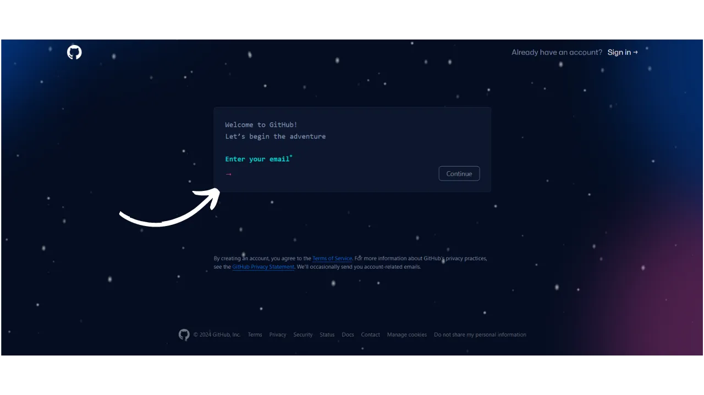
A continuación, elige tu nombre de usuario. Tienes la opción de revelar tu identidad real o preferir el uso de un seudónimo. Haz clic en `Continuar` y completa el Captcha. Se te enviará un correo electrónico con un código de confirmación; necesitarás ingresarlo para finalizar la creación de tu cuenta.

Rellena las preguntas si quieres que GitHub te guíe hacia ciertas herramientas, o haz clic en `omitir personalización` para saltar.
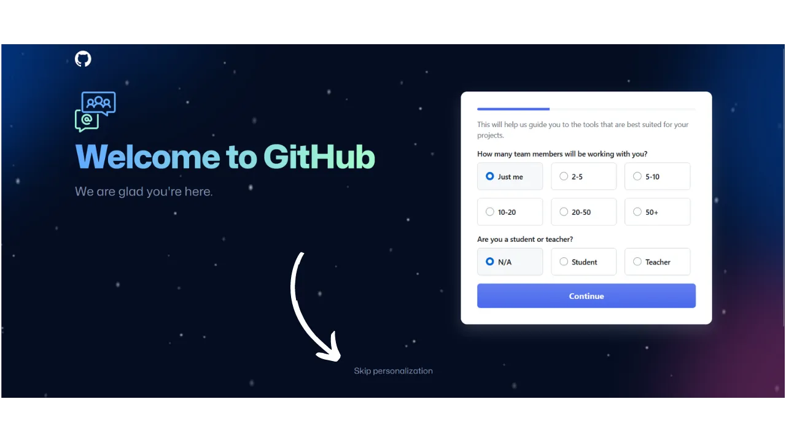
Elige el plan gratuito haciendo clic en el botón `Continuar de forma gratuita`.

Luego serás redirigido a tu panel de control. Si lo deseas, puedes personalizar tu cuenta haciendo clic en tu foto de perfil ubicada en la parte superior derecha de la pantalla, luego accediendo al menú `Configuración`.
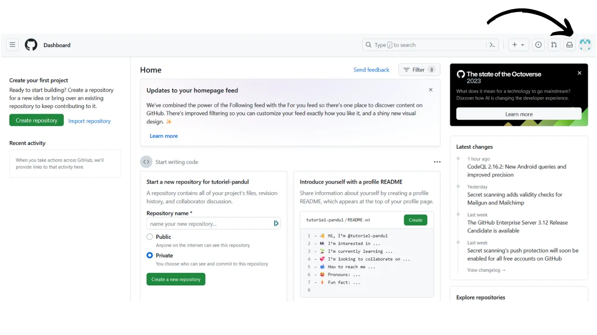
En esta sección, tienes la opción de añadir una nueva foto de perfil, seleccionar un nombre, personalizar tu biografía o añadir un enlace a tu sitio web personal.

También te aconsejo que eches un vistazo al menú `Contraseña y autenticación`, para configurar la autenticación de dos factores.

## Paso 2: Instalar GitHub Desktop
Ve a https://desktop.github.com/ para descargar el software GitHub Desktop. Este software te permite interactuar fácilmente con GitHub, sin tener que usar un terminal.
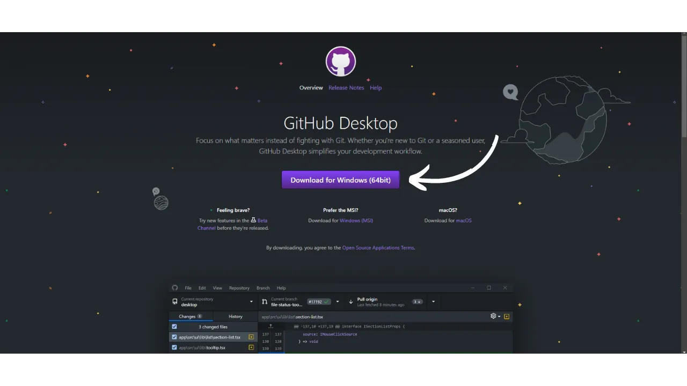
En el primer lanzamiento del software, se te pedirá que conectes tu cuenta de GitHub. Para hacerlo, haz clic en `Iniciar sesión en GitHub.com`.

Se abrirá una página de autenticación en tu navegador. Ingresa tu dirección de correo electrónico y la contraseña elegida en el paso anterior, luego haz clic en el botón `Iniciar sesión`.

Haz clic en `Authorize desktop` para confirmar la conexión entre tu cuenta y el software. 
Serás redirigido automáticamente al software GitHub Desktop. Haz clic en `Finish`.

Si acabas de crear tu cuenta de GitHub, serás redirigido a una página que indica que aún no has creado ningún repositorio. En esta etapa, deja de lado el software GitHub Desktop; volveremos a él más tarde.

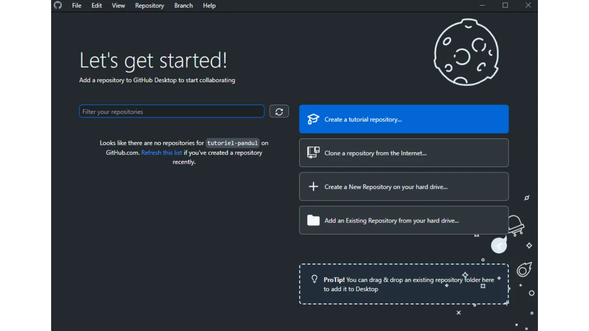

## Paso 3: Instalar Obsidian
Pasemos a instalar el software de escritura. Aquí, tienes varias opciones. Existe una multitud de software especializado en editar archivos Markdown, como Typora, diseñado específicamente para escribir. Aunque no es ideal, también es posible elegir un editor de código, como Visual Studio Code (VSC) o Sublime Text. Sin embargo, como escritor, prefiero usar el software Obsidian. Veamos juntos cómo instalarlo y comenzar. 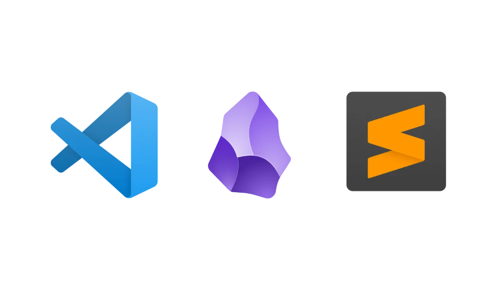
Ve a https://obsidian.md/download y descarga el software. Instálalo, elige tu idioma, luego haz clic en `Quick Start`.

Llegarás al software Obsidian. En este momento, no tienes ningún archivo abierto.

## Paso 4: Hacer un Fork del repositorio de PlanB Network
Ve al repositorio de datos de PlanB Network en la siguiente dirección: [https://github.com/DecouvreBitcoin/sovereign-university-data](https://github.com/DecouvreBitcoin/sovereign-university-data). Si no has iniciado sesión en tu cuenta de GitHub, por favor, inicia sesión de nuevo.
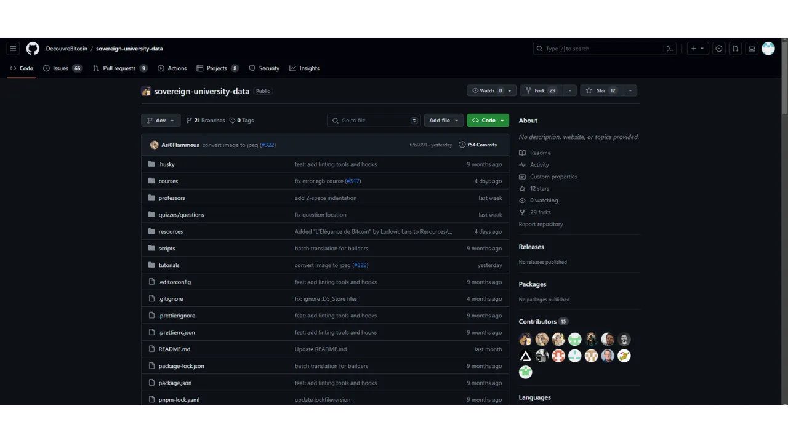
Desde esta página, haz clic en el botón `Fork` en la parte superior derecha de la ventana.

En el menú de creación, puedes dejar la configuración predeterminada. Asegúrate de que la casilla `Copy the dev branch only` esté marcada, luego haz clic en el botón `Create fork`.

Luego llegarás a tu propio fork del repositorio de PlanB Network. 
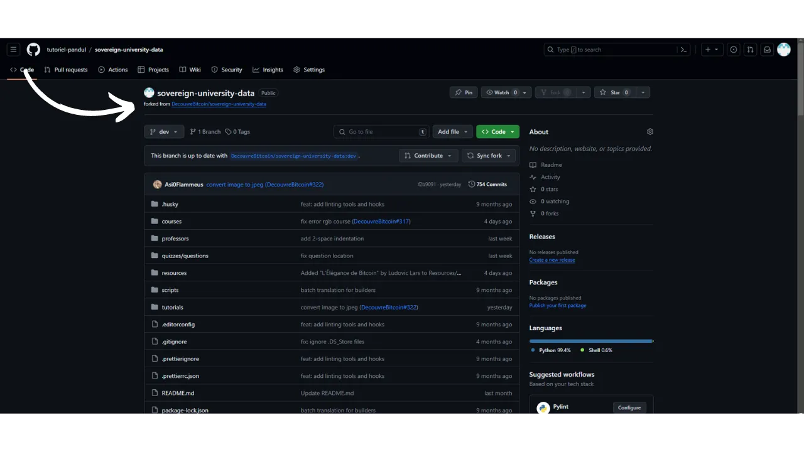
Este fork constituye así un repositorio separado del original, aunque actualmente contiene los mismos datos. Ahora trabajarás en este nuevo repositorio.

## Paso 5: Clonar tu repositorio
Regresa al software GitHub Desktop. Para este momento, tu fork debería aparecer en la sección `Your repositories`. Si no lo ves inmediatamente, usa el botón de doble flecha para actualizar la lista. Cuando tu fork aparezca, haz clic en él para seleccionarlo.

Luego haz clic en el botón azul: `Clone [username]/sovereign-university-data`.

Después, tienes la opción de modificar la ruta de acceso local en tu computadora donde se almacenará el clon de tu repositorio. Puedes mantener la ruta predeterminada. Para confirmar, haz clic en el botón azul `Clone`.

Espera mientras GitHub Desktop clona tu fork localmente.

Después de clonar el repositorio, el software te ofrece dos opciones. Debes seleccionar la primera: `To contribute to the parent project`. Esta elección te permitirá presentar tu trabajo futuro como una contribución al proyecto padre (`DecouvreBitcoin/sovereign-university-data`), y no exclusivamente como una modificación de tu fork personal (`[username]/sovereign-university-data`). Una vez seleccionada la opción, haz clic en `Continue`.

Tu GitHub Desktop ahora está correctamente configurado. Ahora, puedes dejar el software abierto en segundo plano para seguir las modificaciones que haremos.
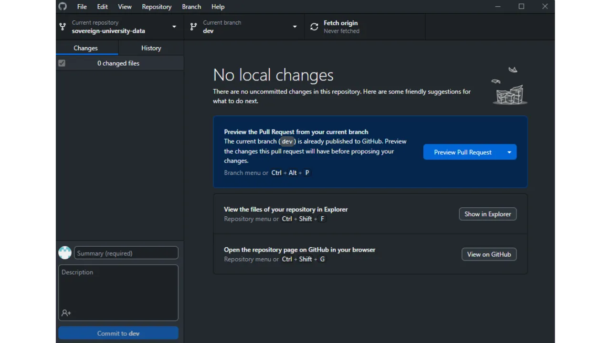

## Paso 6: Crear una nueva bóveda en Obsidian
Abre el software Obsidian y haz clic en el pequeño icono de bóveda en la parte inferior izquierda de la ventana.

Haz clic en el botón `Open` para abrir una carpeta existente como una bóveda.

Se abrirá tu explorador de archivos. Necesitas localizar y seleccionar la carpeta titulada `GitHub`, que debería estar en tu directorio `Documentos` entre tus archivos. Esta ruta corresponde a la que estableciste durante el paso 5. Después de elegir la carpeta, confirma su selección. La creación de tu bóveda en Obsidian se lanzará entonces en una nueva página del software.

-> **Atención**, es importante no elegir la carpeta `sovereign-university-data` al crear una nueva bóveda en Obsidian. En su lugar, selecciona la carpeta padre, `GitHub`. Si seleccionas la carpeta `sovereign-university-data`, la carpeta de configuración `.obsidian`, que contiene tus configuraciones locales de Obsidian, se integrará automáticamente en el repositorio. Queremos evitar esto, ya que no es necesario transferir tus configuraciones de Obsidian al repositorio de PlanB Network. Una alternativa es añadir la carpeta `.obsidian` al archivo `.gitignore`, pero este método también resultaría en una modificación del archivo `.gitignore` del repositorio fuente, lo cual no es deseable.

En el lado izquierdo de la ventana, puedes ver el árbol de archivos con tus diferentes repositorios de GitHub que han sido clonados localmente. Al hacer clic en las flechas junto a los nombres de las carpetas, puedes expandirlas para acceder a las subcarpetas de los repositorios y sus documentos.

No olvides configurar Obsidian en modo oscuro: "*La luz atrae a los insectos*" ;)

## Paso 7: Instalar un editor de código
La mayoría de tus modificaciones serán en archivos en formato Markdown (`.md`). Para editar estos documentos, puedes usar Obsidian, el software del que hablamos anteriormente. Sin embargo, PlanB Network utiliza otros formatos de archivo, y necesitarás modificar algunos de ellos.
Por ejemplo, al crear un nuevo tutorial, necesitarás crear un archivo YAML (`.yml`) para incluir las etiquetas de tu tutorial, su título, así como tu identificador de profesor. Obsidian no ofrece la posibilidad de modificar este tipo de archivos, por lo que necesitarás un editor de código.
Para esto, varias opciones están disponibles para ti. Aunque el bloc de notas estándar en tu computadora puede ser utilizado para hacer estas modificaciones, esta solución no es ideal para un trabajo pulcro. Más bien recomiendo elegir software específicamente diseñado para este propósito, como [VS Code](https://code.visualstudio.com/download) o [Sublime Text](https://www.sublimetext.com/download). Sublime Text, siendo particularmente ligero, será más que suficiente para nuestras necesidades.

Instala uno de estos programas, y guárdalo para más tarde.

## Paso 8: Añadir un nuevo profesor (opcional)
Si previamente has contribuido a PlanB Network, ya tienes un identificador de contribuidor. Puedes encontrarlo en tu carpeta de profesor accesible vía [esta página](https://github.com/DecouvreBitcoin/sovereign-university-data/tree/dev/professors). Si este es el caso, puedes saltarte este paso e ir directamente al paso 9.

Si aún no has contribuido a la Red PlanB, necesitarás crear tu perfil para que tu nombre aparezca en tus futuros tutoriales. Para hacer esto, comenzaremos creando una nueva rama dedicada a agregar tu perfil de profesor. Una rama en Git es una versión paralela del proyecto, que te permite hacer cambios sin afectar la rama principal, hasta que el trabajo esté listo para ser fusionado.
Antes de proceder a crear una nueva rama, es importante asegurarse de que estás trabajando en la versión más reciente del proyecto para reducir el riesgo de conflictos al fusionar tus cambios. Para hacer esto, abre tu navegador y dirígete a la página de tu bifurcación del repositorio PlanB. Esta es la bifurcación que estableciste en GitHub en el paso 4. La URL de tu bifurcación debería verse así:

`https://github.com/[nombre_de_usuario]/sovereign-university-data`

Asegúrate de estar en la rama principal `dev` y luego haz clic en el botón `Sync fork`. Si tu bifurcación no está actualizada, GitHub ofrecerá actualizar tu rama. Procede con esta sincronización. Si, por el contrario, tu rama ya está actualizada, GitHub te informará.
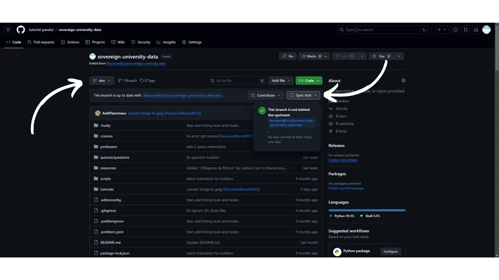
Ahora que tu bifurcación en GitHub está sincronizada con el repositorio fuente de la Red PlanB, es hora de también refrescar el repositorio local en tu computadora. Abre el software GitHub Desktop y asegúrate de que tu bifurcación esté correctamente seleccionada en la esquina superior izquierda de la ventana.
Haz clic en el botón `Fetch origin`. Si tu repositorio local ya está actualizado, GitHub Desktop no sugerirá ninguna acción adicional. De lo contrario, aparecerá la opción `Pull origin`. Haz clic en este botón para actualizar tu repositorio local.

Después de sincronizar tu repositorio con las últimas contribuciones, estás listo para crear una nueva rama de trabajo. Aún utilizando GitHub Desktop, asegúrate de que estás en la rama principal `dev`.

Haz clic en esta rama, luego haz clic en el botón `New Branch`.

Asegúrate de que la nueva rama esté basada en el repositorio fuente, es decir, `DecouvreBitcoin/sovereign-university-data`. Nombra tu rama de manera que el título sea claro sobre su propósito, utilizando guiones para separar cada palabra. Dado que esta rama está destinada para agregar un perfil de profesor, un nombre de ejemplo podría ser: `add-professor-[tu-nombre]`. Después de ingresar el nombre, haz clic en `Create branch` para confirmar su creación.

Ahora haz clic en el botón `Publish branch` para guardar tu nueva rama de trabajo en tu bifurcación en línea en GitHub.

En este punto, en GitHub Desktop, deberías encontrarte en tu nueva rama. Esto significa que todas las modificaciones hechas localmente en tu computadora se registrarán exclusivamente en esta rama específica. Además, mientras esta rama permanezca seleccionada en GitHub Desktop, los archivos visibles localmente en tu máquina corresponden a los de esta rama (`add-professor-tu-nombre`), y no a los de la rama principal (`dev`).

Para agregar tu perfil de profesor, abre tu explorador de archivos y dirígete a tu repositorio local, en la carpeta `professors`. La encontrarás bajo la ruta: `\GitHub\sovereign-university-data\professors`.

Dentro de esta carpeta, crea una nueva carpeta nombrada con tu nombre o pseudónimo. Asegúrate de que no haya espacios en el nombre de la carpeta. Así, si tu nombre es "Loic Pandul" y ningún otro profesor tiene este nombre, la carpeta a crear se nombrará `loic-pandul`.

Para facilitar la tarea, ya puedes copiar y pegar todos los documentos de otro profesor en tu propia carpeta. Luego procederemos a modificar estos documentos para personalizarlos según tu perfil.
Comience navegando hacia la carpeta `assets`. Elimine la foto de perfil del profesor que previamente copió y reemplácela con su propia foto de perfil. Es imperativo que esta imagen esté en formato `.webp` y que se nombre `profile`, dando así el nombre completo del archivo `profile.webp`. Tenga en cuenta que esta imagen se publicará en Internet y será accesible para todos. 

A continuación, abra el archivo `professor.yml` con su editor de código (VSC o Sublime Text). Llegará al archivo copiado de un profesor existente.

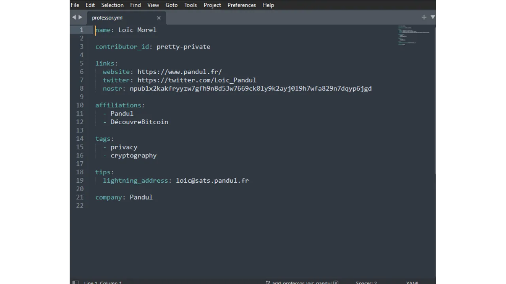

Luego debe actualizar la información existente con la suya:
- **name:** ingrese su nombre o su pseudónimo;
- **links:** indique sus cuentas en redes sociales como Twitter y Nostr, así como la URL de su sitio web personal (opcional);
- **affiliation:** mencione el nombre de la empresa que lo emplea (opcional);
- **tags:** especifique sus áreas de especialización de la siguiente lista, sabiendo que puede agregar sus propios temas. Sin embargo, asegúrese de limitar el número de etiquetas a 4 como máximo para garantizar una buena UI:
	- privacy (privacidad),
	- cryptography (criptografía),
	- bitcoin,
	- mining (minería),
	- lightning-network (red lightning),
	- economy (economía),
	- history (historia),
	- merchants (comerciantes),
	- security (seguridad),
	- ...
- **tips:** proporcione su dirección Lightning para donaciones para permitir que los lectores de sus futuros tutoriales le envíen algunos sats (opcional);
- **company:** si posee una, indique el nombre de su empresa (opcional).

También debe modificar el `contributor-id`. Este identificador se utiliza para reconocerlo en el sitio web, pero no se hace público fuera de GitHub. Es libre de elegir cualquier combinación de dos palabras, refiriéndose a la lista en inglés de 2048 palabras de BIP39, accesible aquí: [https://github.com/bitcoin/bips/blob/master/bip-0039/english.txt](https://github.com/bitcoin/bips/blob/master/bip-0039/english.txt). No olvide insertar un guión entre las dos palabras elegidas. Por ejemplo, aquí, elegí `crazy-cactus`.

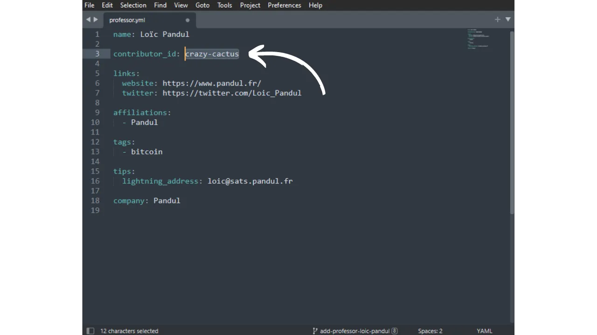

Una vez que haya terminado de modificar el documento `professor.yml`, haga clic en `File > Save` para guardar su archivo. Luego puede salir de su editor de código.

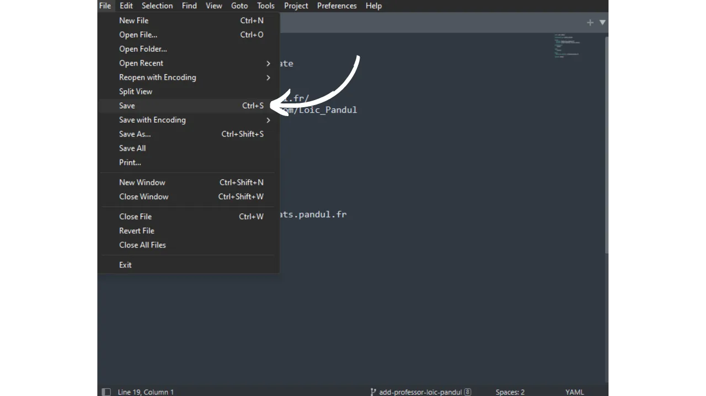
Es hora de proceder a escribir su biografía. Dentro de su archivo de profesor, puede eliminar documentos escritos en idiomas que no le conciernen, que inicialmente fueron copiados de otro profesor. Mantenga exclusivamente el archivo correspondiente a su lengua materna. Por ejemplo, en mi caso, solo mantuve el archivo `fr.yml`, dado que mi idioma es el francés.

Haga doble clic en este archivo para abrirlo con su editor de código. En este archivo, tiene la oportunidad de escribir su biografía completa bajo la sección `bio` y un resumen o un título sucinto bajo `short_bio`.

Después de guardar su documento `fr.yml`, es necesario crear una copia de este archivo para cada uno de los siguientes seis idiomas:
- Alemán (DE);
- Inglés (EN);
- Francés (FR);
- Español (ES);
- Italiano (IT);
- Portugués (PT).
Proceda a copiar y pegar su archivo original, luego traduzca cada documento al idioma correspondiente. Si tiene dominio del idioma, puede realizar la traducción manualmente. De lo contrario, siéntase libre de usar una herramienta de traducción automática o un chatbot. Si lo prefiere, también es posible mantener solo la biografía en su idioma nativo; nosotros nos encargaremos de la traducción después de la presentación de su Pull Request.

Su carpeta de profesor debería verse así:

Ahora regrese a GitHub Desktop. En el lado izquierdo de su ventana, debería observar todas las modificaciones hechas a los documentos, específicas de su rama. Asegúrese de que estas modificaciones sean correctas.

Si las modificaciones le parecen correctas, agregue un título para su commit. Un commit es un guardado de las modificaciones hechas a la rama, acompañado de un mensaje descriptivo, que permite seguir la evolución de un proyecto a lo largo del tiempo. Una vez ingresado el título, presione el botón azul `Commit to [su rama]` para validar estas modificaciones.

Luego haga clic en el botón `Push origin`. Esto enviará su commit a su fork.

Si ha terminado sus modificaciones para esta rama, haga clic ahora en el botón `Preview Pull Request`.

Puede verificar una última vez que sus modificaciones son correctas, luego haga clic en el botón `Create pull request`.

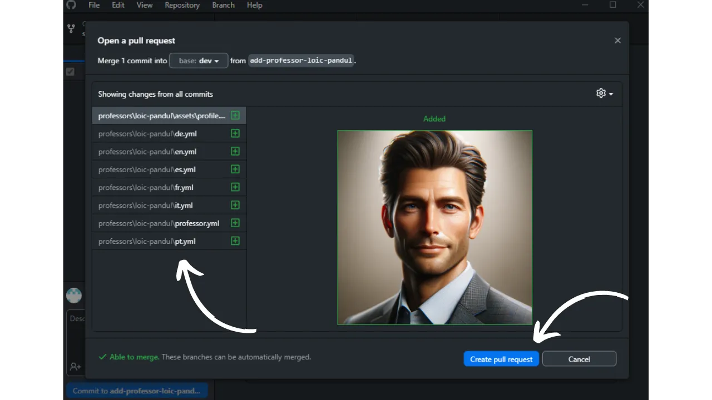

Será redirigido automáticamente a su navegador en GitHub a la página para preparar su Pull Request. Un Pull Request es una solicitud hecha para integrar las modificaciones de su rama en la rama principal del repositorio de PlanB Network, lo que permite la revisión y discusión de cambios antes de su fusión.
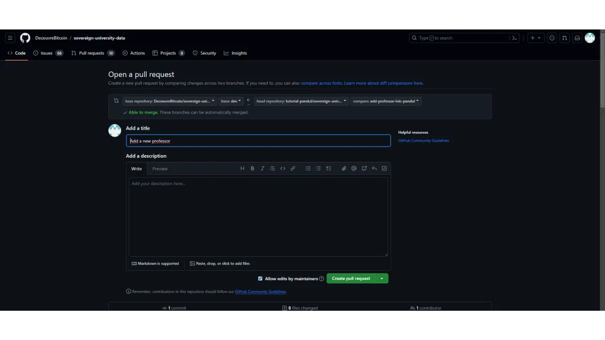
En esta página de preparación, indique un título que resuma brevemente los cambios que desea fusionar con el repositorio fuente. Agregue un breve comentario describiendo estos cambios. Después de completar estos pasos, haga clic en el botón verde `Create pull request` para confirmar la solicitud de fusión. 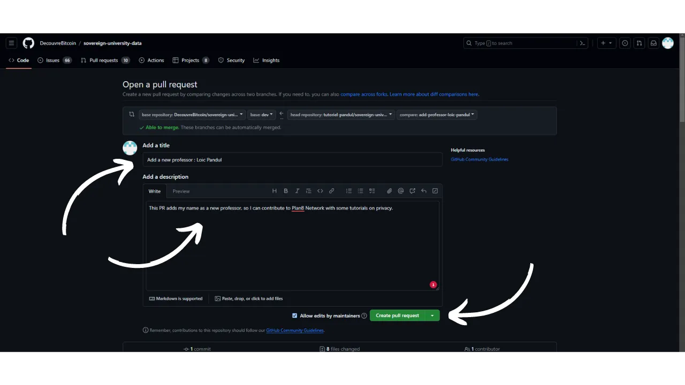
Su PR será entonces visible en la pestaña `Pull Request` del repositorio principal de PlanB Network. Solo tiene que esperar hasta que un administrador se comunique con usted para confirmar la fusión de su contribución o para solicitar cualquier modificación adicional.

Después de fusionar su PR con la rama principal, se recomienda eliminar su rama de trabajo (`add-professor-your-name`) para mantener un historial limpio en su fork. GitHub le ofrecerá automáticamente esta opción en su página de PR:

En el software GitHub Desktop, puede volver a la rama principal de su fork (`dev`).

Si desea hacer cambios en su contribución después de haber enviado su PR, el procedimiento a seguir depende del estado actual de su PR:
- Si su PR aún está abierto y no ha sido fusionado, realice los cambios localmente mientras permanece en la misma rama. Una vez finalizadas las modificaciones, use el botón `Push origin` para agregar un nuevo commit a su PR aún abierto;
- En el caso de que su PR ya haya sido fusionado con la rama principal, necesitará comenzar el proceso desde el principio creando una nueva rama, luego enviando un nuevo PR. Asegúrese de que su repositorio local esté sincronizado con el repositorio fuente de PlanB Network antes de proceder.

## Paso 9: Agregar un Nuevo Tutorial
¡Felicidades, has completado todos los pasos de preparación! Ahora estás listo para contribuir a la Red PlanB. A partir de ahora, para cada nuevo artículo que desees publicar, necesitarás crear una nueva rama desde `dev`. Una rama en Git es una versión paralela del proyecto, que te permite realizar cambios sin afectar la rama principal, hasta que el trabajo esté listo para ser fusionado.
Antes de proceder a crear una nueva rama, es importante asegurarse de que estás trabajando en la versión más reciente del proyecto para reducir el riesgo de conflictos al fusionar tus modificaciones. Para hacer esto, abre tu navegador y dirígete a la página de tu fork del repositorio PlanB. Este es el fork que estableciste en GitHub en el paso 4. La URL de tu fork debería verse así: `https://github.com/[tu-nombre-de-usuario]/sovereign-university-data`.

Asegúrate de estar en la rama principal `dev` y luego haz clic en el botón `Sync fork`. Si tu fork no está actualizado, GitHub ofrecerá actualizar tu rama. Procede con esta actualización. Si, por el contrario, tu rama ya está actualizada, GitHub te informará. 
Ahora que tu fork en GitHub está sincronizado con el repositorio fuente de la Red PlanB, es hora de también refrescar el repositorio local en tu computadora. Abre el software GitHub Desktop y asegúrate de que tu fork esté correctamente seleccionado en la esquina superior izquierda de la ventana.

Haz clic en el botón `Fetch origin`. Si tu repositorio local ya está actualizado, GitHub Desktop no sugerirá ninguna acción adicional. De lo contrario, aparecerá la opción `Pull origin`. Haz clic en este botón para actualizar tu repositorio local.

Después de sincronizar tu repositorio con las últimas contribuciones, estás listo para crear una nueva rama de trabajo. Aún desde GitHub Desktop, verifica que efectivamente estás en la rama principal `dev`.

Haz clic en esta rama, luego haz clic en el botón `New Branch`.

Asegúrate de que la nueva rama se base en el repositorio fuente, a saber, `DecouvreBitcoin/sovereign-university-data`. Nombra tu rama de manera que el título sea claro sobre su propósito, utilizando guiones para separar cada palabra. Por ejemplo, digamos que nuestro objetivo es escribir un tutorial sobre el uso del software Sparrow Wallet. En este caso, la rama de trabajo dedicada a escribir este tutorial podría llamarse: `tuto-sparrow-wallet-loic`. Una vez ingresado el nombre apropiado, solo necesitarás hacer clic en `Create branch` para confirmar la creación de la rama.

Ahora haz clic en el botón `Publish branch` para guardar tu nueva rama de trabajo en tu fork en línea en GitHub.

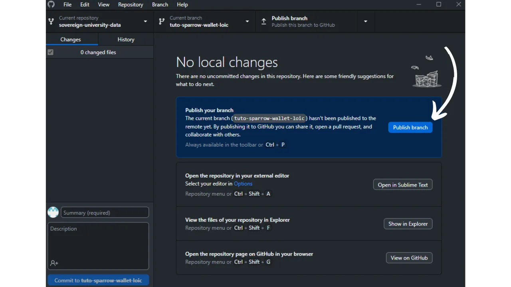

En este punto, en GitHub Desktop, deberías encontrarte en tu nueva rama. Esto significa que todas las modificaciones realizadas localmente en tu computadora se registrarán exclusivamente en esta rama específica. Además, mientras esta rama permanezca seleccionada en GitHub Desktop, los archivos visibles localmente en tu máquina corresponden a los de esta rama (`tuto-sparrow-wallet-loic`), y no a los de la rama principal (`dev`).

Ahora que se ha creado la rama de trabajo, es momento de integrar tu nuevo tutorial. Para hacer esto, abre tu gestor de archivos y navega hasta la carpeta `sovereign-university-data`, que representa el clon local de tu repositorio. Normalmente deberías encontrarla bajo `Documents\GitHub\sovereign-university-data`. Dentro de este directorio, será necesario localizar la subcarpeta apropiada para colocar tu tutorial. La organización de las carpetas refleja las diferentes secciones del sitio web de la Red PlanB. En nuestro ejemplo, dado que queremos agregar un tutorial sobre Sparrow Wallet, es apropiado ir al siguiente camino: `sovereign-university-data\tutorials\wallet` que corresponde a la sección `WALLET` en el sitio web.

Dentro de la carpeta `wallet`, necesitas crear un nuevo directorio específicamente dedicado a tu tutorial. El nombre de esta carpeta debe evocar el software cubierto en el tutorial, asegurándote de conectar las palabras con guiones. Para mi ejemplo, la carpeta se titulará `sparrow-wallet`.

En esta nueva carpeta dedicada a tu tutorial, es apropiado preparar varios elementos:
- Crear una carpeta `assets`, destinada a recibir todas las ilustraciones necesarias para tu tutorial;
	- Dentro de esta carpeta `assets`, necesitas crear 6 subcarpetas nombradas `fr`, `de`, `en`, `it`, `es`, y `pt`, para clasificar los visuales según los idiomas correspondientes.
- Se debe crear un archivo `tutorial.yml` para registrar los detalles relacionados con tu tutorial;
- Se debe crear un archivo en formato markdown para escribir el contenido real de tu tutorial. Este archivo debe titularse según el código de idioma de la escritura. Por ejemplo, para un tutorial escrito en francés, el archivo debe llamarse `fr.md`.

La organización de tu carpeta debería verse así:

Para comenzar, abre tu archivo `tutorial.yml` usando tu editor de código. Llénalo con la información especificada a continuación:
- **builder**: Ingresa el título de tu tutorial, que debe ser tanto preciso como evocativo del contenido que presentarás;
- **tags**: Determina una serie de palabras clave estrechamente relacionadas con el tema de tu artículo, para facilitar su búsqueda e indexación;
- **category**: Selecciona una subcategoría apropiada entre las disponibles en el sitio de PlanB, basada en el contenido de tu tutorial. Por ejemplo, para un tutorial relacionado con la sección `WALLET`, las opciones disponibles son `Desktop`, `Hardware`, y `Mobile`;
- **level**: Indica el nivel de dificultad de tu tutorial optando por una de las siguientes cuatro categorías:
	- Principiante (`beginner`),
	- Intermedio (`intermediary`),
	- Avanzado (`advanced`),
- Experto (`expert`).- **professor**: Ingresa tu ID de contribuyente tal como aparece en tu perfil de profesor. Para más detalles, consulta el paso 8 de este artículo;
- **link** (opcional): Si deseas dar crédito a un sitio web fuente para el tutorial que estás desarrollando, como tu propio sitio personal, aquí es donde puedes agregar el enlace relevante.

Una vez que hayas terminado de modificar tu archivo `tutorial.yml`, guarda tu documento haciendo clic en `Archivo > Guardar`. Ahora puedes cerrar tu editor de código.

Dentro de la carpeta `assets`, necesitas agregar un archivo llamado `logo.webp`, que servirá como miniatura para tu artículo. Esta imagen, que debe estar en formato `.webp`, debería tener una dimensión cuadrada para alinearse con la interfaz de usuario. Eres libre de elegir el logo del software cubierto en el tutorial o cualquier otra imagen relevante, siempre y cuando esté libre de derechos.
Además, también agrega una imagen titulada `cover.webp` en la misma ubicación. Esta imagen se mostrará en la parte superior de tu tutorial. Asegúrate de que esta imagen, al igual que el logo, respete los derechos de uso y sea adecuada para el contexto de tu tutorial.

Las subcarpetas de idiomas ubicadas en la carpeta `assets` se utilizan para organizar los diagramas y visuales que acompañarán tu tutorial. Si tus imágenes contienen texto, considera traducirlas para cada idioma concerniente, para hacer tu contenido accesible a una audiencia internacional.

**-> Consejo:** Al compartir archivos públicamente, como imágenes, es importante eliminar metadatos superfluos. Estos pueden contener información sensible, como datos de ubicación, fechas de creación o detalles sobre el autor. Para proteger tu privacidad, es aconsejable eliminar estos metadatos. Para simplificar esta operación, puedes usar herramientas especializadas como [Exif Cleaner](https://exifcleaner.com/), que permite limpiar los metadatos de un documento a través de un simple arrastrar y soltar.

Ahora, puedes abrir tu archivo que albergará tu tutorial, nombrado con el código de tu idioma, como `en.md`. Ve a Obsidian, en el lado izquierdo de la ventana, desplázate por el árbol de carpetas hasta llegar a la carpeta de tu tutorial y el archivo que estás buscando.

Haz clic en el archivo para abrirlo.

Comenzaremos llenando la sección `Properties` en la parte superior del documento. En el caso de que esta sección falte en tu archivo (si el documento está completamente en blanco), puedes reproducirla copiándola de otro tutorial existente.

También puedes agregarla manualmente de esta manera usando tu editor de código:

Llena el nombre de tu tutorial así como una breve descripción del mismo.

Luego agrega tu imagen de portada al inicio de tu tutorial. Para hacer esto, escribe:

``

Esta sintaxis será útil siempre que sea necesario agregar una imagen a tu tutorial. El signo de exclamación indica que es una imagen, con el texto alternativo (alt) especificado entre los corchetes. El camino hacia la imagen se indica entre los paréntesis.

Continúa escribiendo tu tutorial redactando tu contenido. Cuando quieras integrar un subtítulo, aplica el formato markdown apropiado prefijando el texto con `##`.

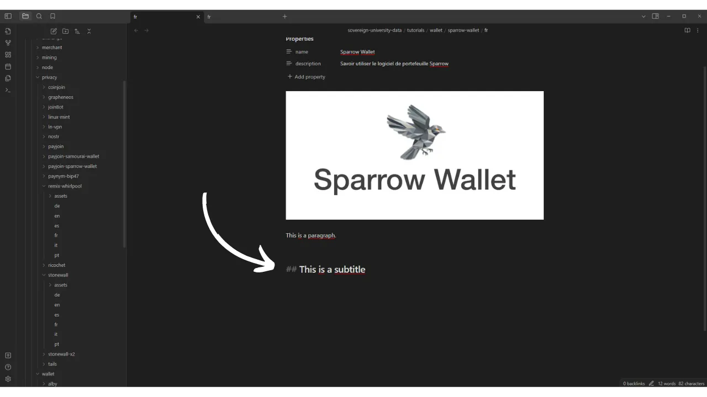

Al agregar elementos visuales a tu tutorial, asegúrate de seleccionar el camino correspondiente al idioma de tu contenido. Por ejemplo:

``

Si tu visual contiene texto, como un diagrama, es aconsejable traducirlo a los seis idiomas propuestos (alemán, inglés, francés, italiano, español y portugués) y colocar cada versión traducida en su subcarpeta lingüística dedicada dentro de la carpeta `assets`.
Las imágenes deben ser numeradas secuencialmente de acuerdo a su orden de aparición en el tutorial. Así, la primera visual será nombrada `1.webp`, la segunda `2.webp`, y así sucesivamente. Puedes usar diferentes formatos de imagen como `jpeg`, `png`, o `webp`. 
Una vez que hayas terminado de escribir tu tutorial en el idioma de tu elección, el siguiente paso es enviar un Pull Request. El administrador entonces añadirá las cinco traducciones faltantes de tu tutorial, gracias a nuestro método de traducción automatizado. Para proceder con el Pull Request, abre el software GitHub Desktop. Debería detectar automáticamente los cambios que has realizado localmente en comparación con el repositorio original. Antes de continuar, verifica cuidadosamente en el lado izquierdo de la interfaz que estos cambios correspondan exactamente a lo que esperabas.

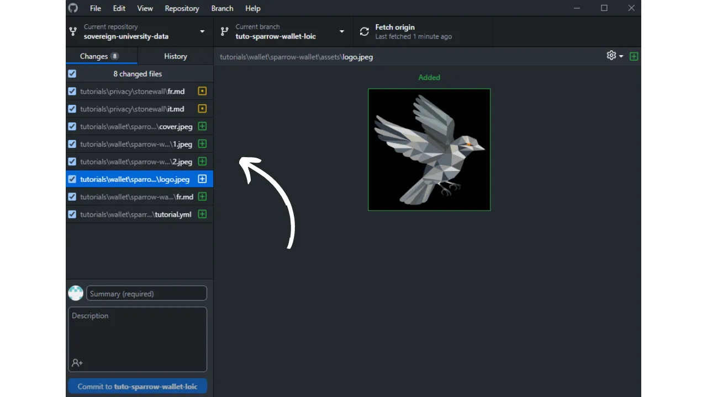

Si los cambios te parecen correctos, añade un título para tu commit. Un commit es un guardado de los cambios realizados en la rama, acompañado por un mensaje descriptivo, permitiendo seguir la evolución de un proyecto a lo largo del tiempo. Una vez ingresado el título, presiona el botón azul `Commit to [tu rama]` para validar estos cambios.

Luego haz clic en el botón `Push origin`. Esto enviará tu commit a tu fork.

Si has terminado tus ediciones para esta rama, haz clic ahora en el botón `Preview Pull Request`.

Puedes verificar una última vez que tus modificaciones son correctas, luego haz clic en el botón `Create pull request`.

Serás redirigido automáticamente a tu navegador en GitHub a la página de preparación de tu Pull Request. Un Pull Request es una solicitud hecha para integrar los cambios de tu rama a la rama principal del repositorio de PlanB Network, lo que permite la revisión y discusión de los cambios antes de su fusión.

En esta página de preparación, indica un título que resuma brevemente las modificaciones que deseas fusionar con el repositorio fuente. Añade un breve comentario describiendo estos cambios. Después de completar estos pasos, haz clic en el botón verde `Create pull request` para confirmar la solicitud de fusión.
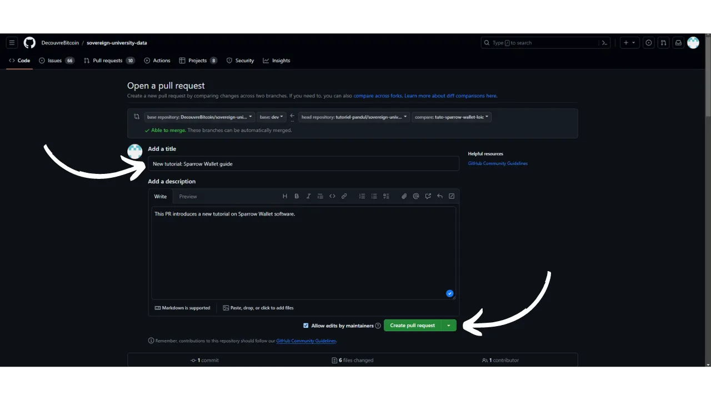
Tu PR será entonces visible en la pestaña `Pull Request` del repositorio principal de PlanB Network. Todo lo que tienes que hacer ahora es esperar hasta que un administrador te contacte para confirmar la fusión de tu contribución o para solicitar cualquier modificación adicional.
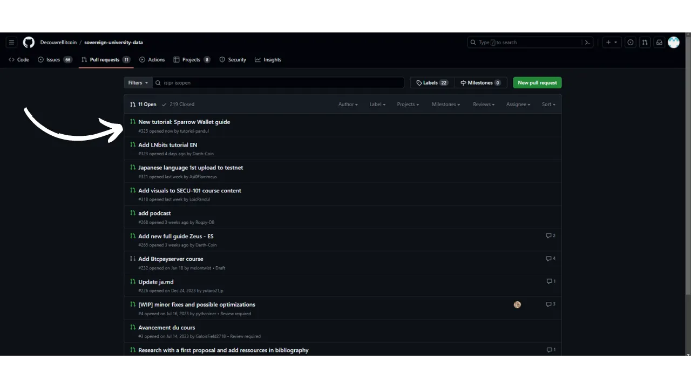
Después de la fusión de tu PR con la rama principal, se recomienda eliminar tu rama de trabajo (`tuto-sparrow-wallet`) para mantener un historial limpio en tu fork. GitHub te ofrecerá automáticamente esta opción en la página de tu PR:

En el software GitHub Desktop, puedes volver a la rama principal de tu fork (`dev`).

Si deseas hacer modificaciones a tu contribución después de haber ya enviado tu PR, el procedimiento a seguir depende del estado actual de tu PR:
- Si tu PR aún está abierto y no ha sido fusionado, realiza las modificaciones localmente mientras permaneces en la misma rama. Una vez finalizadas las modificaciones, usa el botón `Push origin` para añadir un nuevo commit a tu PR aún abierto;
- En el caso de que tu PR ya haya sido fusionado con la rama principal, necesitarás comenzar el proceso desde el principio creando una nueva rama, y luego enviando un nuevo PR. Asegúrate de que tu repositorio local esté sincronizado con el repositorio fuente de PlanB Network antes de proceder.