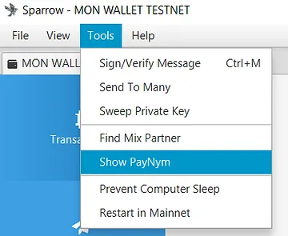
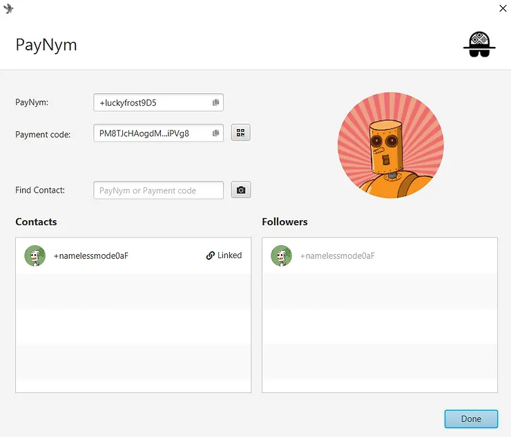
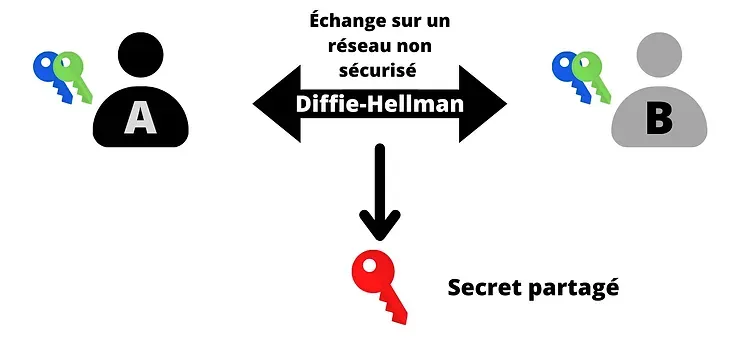
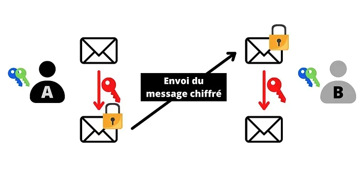
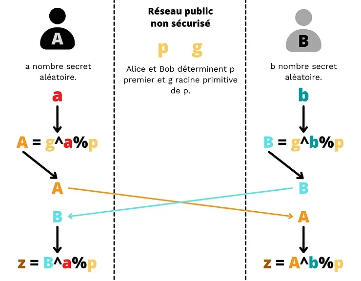
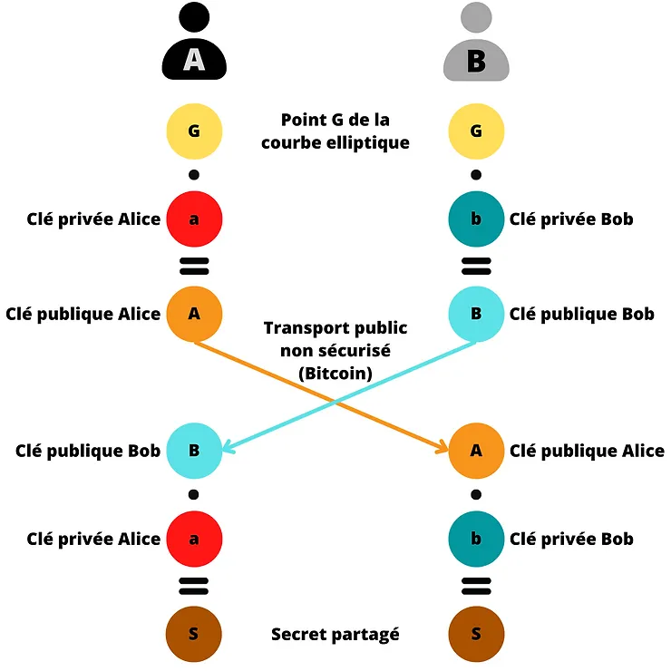
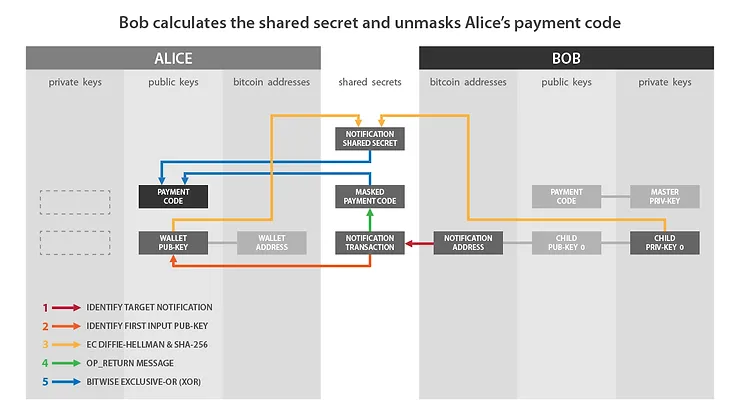
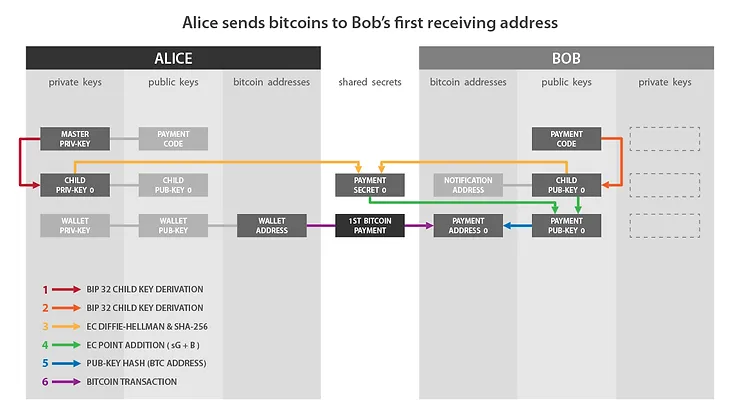
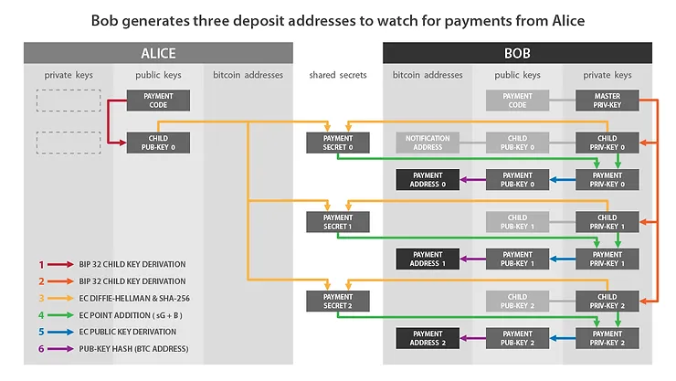

***WARNING:** Following the arrest of the founders of Samourai Wallet and the seizure of their servers on April 24th, the application can no longer be used by users who do not have their own Dojo. BIP47 remains usable on Sparrow Wallet for all users and **on Samourai Wallet only for users who have a Dojo**.*

_We are closely following the developments of this case as well as developments concerning the associated tools. Rest assured that we will update this tutorial as new information becomes available._

_This tutorial is provided for educational and informational purposes only. We do not endorse or encourage the use of these tools for criminal purposes. It is the responsibility of each user to comply with the laws in their jurisdiction._

---

> "He's too big," they all said, and the turkey cock, who had been born with spurs and thought he was an emperor, swelled up like a ship with all sails set, and marched straight up to him in great fury, his eyes as red as fire. The poor little duckling didn't know whether to stand his ground or run away, and was very unhappy because he was despised by all the ducks in the yard.

One of the most significant issues on the Bitcoin protocol is address reuse. The transparency and distribution of the network make this practice dangerous for user privacy. To avoid problems related to this, it is recommended to use a new blank receiving address for every new incoming payment to a wallet, which can be complicated to achieve in some cases.

This compromise is as old as the White Paper. Satoshi already warned us about this risk in his work published in late 2008:

> "As an additional firewall, a new key pair should be used for each transaction to keep them from being linked to a common owner."

There are many solutions available to receive multiple payments without address reuse. Each of them has its compromises and drawbacks. Among all these solutions, there is [BIP47](https://github.com/bitcoin/bips/blob/master/bip-0047.mediawiki), a proposal developed by Justus Ranvier and published in 2015, which allows for the generation of reusable payment codes. Its goal is to enable multiple transactions to be made to the same person without reusing an address.

Initially, this proposal was met with disdain by part of the community, and it was never added to Bitcoin Core. However, some software still chose to implement it on their own. For example, Samourai Wallet developed its own implementation of BIP47: PayNym. Today, this implementation is available on Samourai Wallet for smartphones, as well as on [Sparrow Wallet](https://sparrowwallet.com/) for PCs.

Over time, Samourai has programmed new features directly related to PayNym. Now, there is a whole ecosystem of tools available to optimize user privacy based on PayNym and BIP47.
In this article, you will discover the principle of BIP47 and PayNym, the mechanisms of these protocols, and the practical applications that result from them. I will only address the first version of BIP47, which is currently used for PayNym, but versions 2, 3, and 4 work practically the same way.

> The only major difference is found in the notification transaction. Version 1 uses a simple address with OP_RETURN for notification, version 2 uses a multisig script (bloom-multisig) with OP_RETURN, and versions 3 and 4 simply use a multisig script (cfilter-multisig). The mechanisms discussed in this article, including the cryptographic methods studied, are therefore applicable to all four versions. To date, the PayNym implementation on Samourai Wallet and Sparrow uses the first version of BIP47.

## Summary:

1- The problem of address reuse.

2- Principles of BIP47 and PayNym.

3- Tutorials: Using PayNym.

- Building a BIP47 transaction with Samourai Wallet.
- Building a BIP47 transaction with Sparrow Wallet.

4- The workings of BIP47.

- The reusable payment code.
- The cryptographic method: Diffie-Hellman key exchange established on elliptic curves (ECDH).
- The notification transaction.
- Constructing the notification transaction.
- Receiving the notification transaction.
- The BIP47 payment transaction.
- Receiving the BIP47 payment and deriving the private key.
- Refunding the BIP47 payment.

5- Derived uses of PayNym.

6- My personal opinion on BIP47.

## The problem of address reuse.

A receiving address is used to receive bitcoins. It is generated from a public key by hashing it and applying a specific format. Thus, it allows for the creation of a new spending condition on a coin in order to change its owner.

> To learn more about generating a receiving address, I recommend reading the last part of this article: The Bitcoin Wallet - excerpt from [ebook Bitcoin Démocratisé 2](https://www.pandul.fr/post/le-portefeuille-bitcoin-extrait-ebook-bitcoin-d%C3%A9mocratis%C3%A9-2#viewer-epio7).

Furthermore, you have probably already heard from a knowledgeable bitcoiner that receiving addresses are for one-time use, and that you should generate a new one for each new incoming payment to your wallet. Okay, but why?
Fundamentally, address reuse does not directly endanger your funds. The use of cryptography on elliptic curves allows you to prove to the network that you are in possession of a private key without revealing that key. Therefore, you can lock multiple different UTXOs (Unspent Transaction Outputs) on the same address and spend them at different times. If you do not reveal the private key associated with that address, no one can access your funds. The issue with address reuse is more related to privacy.

As mentioned in the introduction, the transparency and distribution of the Bitcoin network mean that any user with access to a node can observe the transactions of the payment system. As a result, they can see the different balances of addresses. Satoshi Nakamoto then mentioned the possibility of generating new key pairs, and thus new addresses, for each new incoming payment to a wallet. The goal would be to have an additional firewall in case of an association between the user's identity and one of their key pairs.

Today, with the presence of chain analysis companies and the development of KYC (Know Your Customer), the use of blank addresses is no longer an additional firewall, but an obligation for anyone who cares even a little about their privacy.

The pursuit of privacy is not a comfort or a fantasy of maximalist Bitcoiners. It is a specific parameter that directly affects your personal security and the security of your funds. To help you understand this, here is a very concrete example:

- Bob buys Bitcoin through Dollar Cost Averaging (DCA), meaning he acquires a small amount of Bitcoin at regular intervals to average his entry price. Bob systematically sends the purchased funds to the same receiving address. He buys 0.01 Bitcoin every week and sends it to this same address. After two years, Bob has accumulated a whole Bitcoin on this address.

- The baker on the corner accepts Bitcoin payments. Excited to be able to spend Bitcoin, Bob goes to buy his baguette in satoshis. To pay, he uses the funds locked with his address. His baker now knows that he owns a Bitcoin. This significant amount could attract envy, and Bob potentially risks a physical attack in the future.

Address reuse allows an observer to make an undeniable link between your different UTXOs and sometimes between your identity and your entire wallet.
This is why the majority of Bitcoin wallet software automatically generates a new receiving address when you click on the "Receive" button. For regular users, getting into the habit of using new addresses is not a big inconvenience. However, for an online business, an exchange, or a donation campaign, this constraint can quickly become unmanageable.
There are many solutions for these organizations. Each of them has its advantages and disadvantages, but to date, and as we will see later, BIP47 truly stands out from the others.

This issue of address reuse is far from negligible in Bitcoin. As you can see in the graph below taken from the oxt.me website, the overall address reuse rate by Bitcoin users is currently 52%:
Graph from OXT.me showing the evolution of the overall address reuse rate on the Bitcoin network.

Credit: OXT

The majority of these reuses come from exchanges, which, for efficiency and convenience reasons, reuse the same address many times. To date, BIP47 would be the best solution to stem this phenomenon among exchanges. This would help reduce the overall address reuse rate without causing too much friction for these entities.

This global measure across the entire network is particularly relevant in this case. Indeed, address reuse is not only a problem for the person who engages in this practice, but also for anyone who transacts with them. The loss of privacy on Bitcoin acts like a virus, spreading from user to user. Studying a global measure on all network transactions allows us to understand the extent of this phenomenon.

## Principles of BIP47 and PayNym.

BIP47 aims to provide a simple way to receive multiple payments without address reuse. Its operation is based on the use of a reusable payment code.

Thus, multiple senders can send multiple payments to a single reusable payment code of another user, without the recipient needing to provide a new blank address for each new transaction.

A user can freely share their payment code (on social networks, on their website...) without the risk of privacy loss, unlike a regular receiving address or a public key.
To carry out an exchange, both users must have a Bitcoin wallet with a BIP47 implementation, such as PayNym on Samourai Wallet or Sparrow Wallet. The association of the payment codes of the two users will establish a secret channel between them. To properly establish this channel, the sender must make a transaction on the Bitcoin blockchain: the notification transaction (I will explain more about this later).

The association of the payment codes of the two users generates shared secrets that themselves generate a large number of unique Bitcoin receiving addresses (exactly 2^32). Thus, in reality, the payment with BIP47 is not sent to the payment code, but to completely normal addresses, derived from the payment codes of the parties involved.

The payment code acts as a virtual identifier, derived from the wallet seed. In the HD wallet derivation structure, the payment code is located at depth 3, at the wallet account level.

Its derivation purpose is noted as 47' (0x8000002F) in reference to BIP47. For example, a derivation path for a reusable payment code would be:

> m/47'/0'/0'/

To give you an idea of what a payment code looks like, here is mine:

> PM8TJSBiQmNQDwTogMAbyqJe2PE2kQXjtgh88MRTxsrnHC8zpEtJ8j7Aj628oUFk8X6P5rJ7P5qDudE4Hwq9JXSRzGcZJbdJAjM9oVQ1UKU5j2nr7VR5

It can also be encoded as a QR code to facilitate communication:

As for PayNym Bots, those robots you see on Twitter, they are simply visual representations of your payment code, created by Samourai Wallet. They are generated using a hash function, which makes them almost unique. Here is mine with its identifier:

> +throbbingpond8B1

These Bots do not have any real technical utility. Instead, they facilitate interactions between users by creating a virtual visual identity.

For the user, the process of making a BIP47 payment with the PayNym implementation is extremely simple. Let's imagine that Alice wants to send payments to Bob:

1. Bob shares his QR code or directly his reusable payment code. He can place it on his website, on his various public social networks, or send it to Alice through another means of communication.
2. Alice opens her Samourai or Sparrow software and scans or pastes Bob's payment code.
3. Alice links her PayNym with Bob's ("Follow" in English). This operation is done off-chain and remains completely free.

4. Alice connects her PayNym with Bob's ("Connect" in English). This operation is done "on-chain". Alice must pay the transaction mining fees as well as a fixed fee of 15,000 sats for the service on Samourai. The service fees are waived on Sparrow. This step is what we call the notification transaction.

5. Once the notification transaction is confirmed, Alice can create a BIP47 payment transaction to Bob. Her wallet will automatically generate a new blank receiving address for which only Bob has the private key.

Performing the notification transaction, i.e., connecting her PayNym, is a mandatory prerequisite for making BIP47 payments. However, once this is done, the sender can make multiple payments to the recipient (exactly 2^32) without needing to perform a new notification transaction.

You may have noticed that there are two different operations to link PayNyms together: "follow" and "connect". The connection operation ("connecter") corresponds to the BIP47 notification transaction, which is simply a Bitcoin transaction with certain information transmitted through an OP_RETURN output. Thus, it helps establish encrypted communication between the two users to produce the shared secrets necessary for generating new blank receiving addresses.

On the other hand, the linking operation ("follow" or "relier") allows for a link on Soroban, an encrypted communication protocol based on Tor, specially developed by the Samourai teams.

To summarize:

- Linking two PayNyms ("follow") is completely free. It helps establish off-chain encrypted communications, particularly for using Samourai's collaborative transaction tools (Stowaway or StonewallX2). This operation is specific to PayNym and is not described in BIP47.

- Connecting two PayNyms incurs a cost. This involves performing the notification transaction to initiate the connection. The cost consists of any service fees, transaction mining fees, and 546 sats sent to the recipient's notification address to notify them of the tunnel opening. This operation is related to BIP47. Once completed, the sender can make multiple BIP47 payments to the recipient.

In order to connect two PayNyms, they must already be linked.

## Tutorials: Using PayNym.

Now that we have seen the theory, let's study the practice together. The idea of the tutorials below is to link my PayNym on my Sparrow wallet with my PayNym on my Samourai wallet. The first tutorial shows you how to make a transaction using the reusable payment code from Samourai to Sparrow, and the second tutorial describes the same mechanism from Sparrow to Samourai.

> I performed these tutorials on the Testnet. These are not real bitcoins.

### Building a BIP47 transaction with Samourai Wallet.

To start, you obviously need the Samourai Wallet application. You can directly download it from the Google Play Store or with the APK file available on the official Samourai website.

Once the wallet is initialized, if you haven't already, request your PayNym by clicking on the plus (+) at the bottom right, then on "PayNym".

The first step to make a BIP47 payment is to retrieve the reusable payment code from our recipient. Then, we will be able to connect with them and subsequently link:

Once the notification transaction is confirmed, I can send multiple payments to my recipient. Each transaction will automatically be made with a new blank address for which the recipient has the keys. The recipient does not need to take any action, everything is calculated on my side.

Here's how to make a BIP47 transaction on Samourai Wallet:

### Building a BIP47 transaction with Sparrow Wallet.

Just like with Samourai, you obviously need to have the Sparrow software. This is available on your computer. You can download it from their [official website](https://sparrowwallet.com/).

Make sure to verify the developer's signature and the integrity of the downloaded software before installing it on your machine.

Create a wallet and request your PayNym by clicking on "Show PayNym" from the "Tool" menu in the top bar:

Then, you will need to link and connect your PayNym with that of your recipient. To do this, enter their reusable payment code in the "Find Contact" window, follow them, and then perform the notification transaction by clicking on "Link Contact":

Once the notification transaction is confirmed, you can send payments to the reusable payment code. Here's how to do it:

Now that we have been able to study the practical aspect of the PayNym implementation of BIP47, let's see how all these mechanisms work and what cryptographic methods are used.

## The inner workings of BIP47.

To study the mechanisms of BIP47, it is essential to understand the structure of the hierarchical deterministic (HD) wallet, the mechanisms for deriving child key pairs, as well as the principles of elliptic curve cryptography. Fortunately, you can find all the necessary information to understand this part on my blog:

- [Understanding the derivation paths of a Bitcoin wallet](https://www.pandul.fr/post/comprendre-les-chemins-de-d%C3%A9rivation-d-un-portefeuille-bitcoin)

- [The Bitcoin wallet - excerpt from the ebook Bitcoin Democratized 2](https://www.pandul.fr/post/le-portefeuille-bitcoin-extrait-ebook-bitcoin-d%C3%A9mocratis%C3%A9-2)

### The reusable payment code.

As explained in the second part of this paper, the reusable payment code is located at depth three of the HD wallet. It is somewhat comparable to an xpub, both in its placement and structure, as well as in its role.

Here are the different parts that make up an 80-byte payment code:

- Byte 0: The version. If using the first version of BIP47, this byte will be equal to 0x01.

- Byte 1: The bit field. This space is reserved for providing additional indications in case of specific use. If simply using PayNym, this byte will be equal to 0x00.

- Byte 2: The y parity. This byte indicates 0x02 or 0x03 depending on the parity (even or odd number) of the value of the y-coordinate of our public key. For more information on this practice, please read step 1 of the "address derivation" section of this article.

- From byte 3 to byte 34: The x value. These bytes indicate the x-coordinate of our public key. The concatenation of x and the y parity gives us our compressed public key.

- From byte 35 to byte 66: The chain code. This space is reserved for the chain code associated with the aforementioned public key.

- From byte 67 to byte 79: Padding. This space is reserved for possible future developments. For version 1, we simply fill it with zeros to reach 80 bytes, which is the size of the data for an OP_RETURN output.

Here is the hexadecimal representation of my reusable payment code, presented in the previous section, with colors corresponding to the bytes presented above:
Next, you also need to add the prefix byte "P" to quickly identify that we are dealing with a payment code. This byte is 0x47.

> 0x47010002a0716529bae6b36c5c9aa518a52f9c828b46ad8d907747f0d09dcd4d9a39e97c3c5f37c470c390d842f364086362f6122f412e2b0c7e7fc6e32287e364a7a36a00000000000000000000000000

Finally, we calculate the checksum of this payment code using HASH256, which means double hashing with the SHA256 function. We retrieve the first four bytes of this digest and concatenate them at the end (in pink).

> 0x47010002a0716529bae6b36c5c9aa518a52f9c828b46ad8d907747f0d09dcd4d9a39e97c3c5f37c470c390d842f364086362f6122f412e2b0c7e7fc6e32287e364a7a36a00000000000000000000000000567080c4

The payment code is ready, now we just need to convert it to Base 58:

> PM8TJSBiQmNQDwTogMAbyqJe2PE2kQXjtgh88MRTxsrnHC8zpEtJ8j7Aj628oUFk8X6P5rJ7P5qDudE4Hwq9JXSRzGcZJbdJAjM9oVQ1UKU5j2nr7VR5

As you can see, this construction closely resembles the structure of an extended public key of type "xpub".

During this process to obtain our payment code, we used a compressed public key and a chain code. These two elements are the result of a deterministic and hierarchical derivation from the wallet seed, following the following derivation path: m/47'/0'/0'/
In concrete terms, to obtain the public key and chain code of the reusable payment code, we will calculate the master private key from the seed, then derive a child pair with the index 47 + 2^31 (hardened derivation). Then, we derive two more child pairs with the index 2^31 (hardened derivation).

> If you want to learn more about deriving child key pairs within a hierarchical deterministic Bitcoin wallet, I recommend taking CRYPTO301.

### The cryptographic method: Elliptic Curve Diffie-Hellman key exchange (ECDH).

The cryptographic method used at the core of BIP47 is ECDH (Elliptic-Curve Diffie-Hellman). This protocol is a variant of the classic Diffie-Hellman key exchange.

Diffie-Hellman, in its first version, is a key agreement protocol presented in 1976 that allows two parties, each with a pair of public and private keys, to determine a shared secret by exchanging information over an insecure communication channel.

This shared secret (the red key) can then be used for other tasks. Typically, this shared secret can be used to encrypt and decrypt communication over an insecure network:

To achieve this exchange, Diffie-Hellman uses modular arithmetic to calculate the shared secret. Here is a simplified explanation of how it works:

- Alice and Bob agree on a common color, in this case, yellow. This color is known to everyone. It is public information.

- Alice chooses a secret color, in this case, red. She mixes the two colors, resulting in orange.

- Bob chooses a secret color, in this case, teal blue. He mixes the two colors, resulting in sky blue.

- Alice and Bob can exchange the colors they obtained: orange and sky blue. This exchange can happen over an insecure network and can be observed by attackers.

- Alice mixes the sky blue color received from Bob with her secret color (red). She obtains brown.

- Bob mixes the orange color received from Alice with his secret color (teal blue). He also obtains brown.

> Credit: Original idea: A.J. Han VinckVector version: FlugaalTranslation: Dereckson, Public domain, via Wikimedia Commons. https://commons.wikimedia.org/wiki/File:Diffie-Hellman_Key_Exchange_(fr).svg

In this simplification, the brown color represents the secret shared between Alice and Bob. It should be imagined that in reality, it is impossible for the attacker to separate the orange and sky blue colors in order to retrieve Alice or Bob's secret colors.

Now, let's study its actual functioning. At first glance, Diffie-Hellman may seem complex to grasp. In reality, the operating principle is almost childlike. Before detailing its mechanisms, I will quickly remind you of two mathematical concepts that we will need (and incidentally, are also used in many other cryptographic methods).

1. A prime number is a natural number that has only two divisors: 1 and itself. For example, the number 7 is prime because it can only be divided by 1 and 7 (itself). On the other hand, the number 8 is not prime because it can be divided by 1, 2, 4, and 8. It therefore has not only two divisors, but four whole and positive divisors.

2. "Modulo" (denoted "mod" or "%") is a mathematical operation that allows two integers to return the remainder of the Euclidean division of the first number by the second number. For example, 16 mod 5 is equal to 1.

The Diffie-Hellman key exchange between Alice and Bob works as follows:

- Alice and Bob determine two common numbers: p and g. p is a prime number. The larger this number p is, the more secure Diffie-Hellman will be. g is a primitive root of p. These two numbers can be communicated in plain text over an insecure network, they are the equivalents of the yellow color in the simplification above. Alice and Bob just need to have exactly the same values for p and g.

- Once the parameters are chosen, Alice and Bob each determine a secret random number on their own. The random number obtained by Alice is named a (equivalent to the red color) and the random number obtained by Bob is named b (equivalent to the teal color). These two numbers must remain secret.

- Instead of exchanging these numbers a and b, each party will calculate A (uppercase) and B (uppercase) such that:

> A is equal to g raised to the power of a modulo p:
> A = g^a % p

> B is equal to g raised to the power of b modulo p:
> B = g^b % p

- These numbers A (equivalent to the orange color) and B (equivalent to the sky blue color) will be exchanged between the two parties. The exchange can be done in plain text over an insecure network.

- Alice, who now knows B, will calculate the value of z such that:

> z is equal to B raised to the power of a modulo p:
> z = B^a % p

- As a reminder, B = g^b % p. Therefore:

  > z = B^a % p
  > z = (g^b)^a % p
  >
  > According to the rules of exponentiation:
  >
  > (x^n)^m = x^nm
  >
  > Therefore:
  >
  > z = g^ba % p

- Bob, who now knows A, will also calculate the value of z as follows:

> z is equal to A raised to the power of b modulo p:
>
> z = A^b % p
>
> Therefore:
>
> z = (g^a)^b % p
> z = g^ab % p
> z = g^ba % p

Thanks to the distributivity of the modulo operator, Alice and Bob find exactly the same value for z. This number represents their shared secret, which is equivalent to the color brown in the previous explanation. They can use this shared secret to encrypt communication between them on an insecure network.

An attacker in possession of p, g, A, and B will be unable to calculate a, b, or z. Performing this operation would require reversing exponentiation, which is impossible to do other than by trying all possibilities one by one since we are working with a finite field. This would be equivalent to calculating the discrete logarithm, which is the reciprocal of exponentiation in a cyclic finite group.

Therefore, as long as we choose sufficiently large values for a, b, and p, Diffie-Hellman is secure. Typically, with parameters of 2,048 bits (a number with 600 digits in decimal), testing all possibilities for a and b would be impractical. To date, with numbers of this size, the algorithm is considered secure.

This is precisely where the main drawback of the Diffie-Hellman protocol lies. To be secure, the algorithm must use large numbers. As a result, the ECDH algorithm is now preferred, which is a variant of Diffie-Hellman that uses an algebraic curve, specifically an elliptic curve. This allows us to work with much smaller numbers while maintaining equivalent security, thus reducing the computational and storage resources required.

The general principle of the algorithm remains the same. However, instead of using a random number a and a number A calculated from a using modular exponentiation, we will use a pair of keys established on an elliptic curve. Instead of relying on the distributivity of the modulo operator, we will use the group law on elliptic curves, specifically the associativity of this law.
If you have no knowledge of how private and public keys work on an elliptic curve, I will explain the basics of this method in the first six parts of this article.

To summarize roughly, a private key is a random number between 1 and n-1 (where n is the order of the curve), and a public key is a unique point on the curve determined by the private key through point addition and doubling from the generator point, as follows:

> K = k·G

Where K is the public key, k is the private key, and G is the generator point.

One of the properties of this key pair is that it is very easy to determine K if you know k and G, but it is currently impossible to determine k if you know K and G. It is a one-way function.

In other words, you can easily calculate the public key if you know the private key, but it is impossible to calculate the private key if you know the public key. This security is once again based on the impossibility of calculating the discrete logarithm.

We will use this property to adapt our Diffie-Hellman algorithm. Thus, the operation principle of ECDH is as follows:

- Alice and Bob agree on a cryptographically secure elliptic curve and its parameters. This information is public.

- Alice generates a random number ka, which will be her private key. This private key must remain secret. She determines her public key Ka by adding and doubling points on the chosen elliptic curve.

> Ka = ka·G

- Bob also generates a random number kb, which will be his private key. He calculates the associated public key Kb.

> Kb = kb·G

- Alice and Bob exchange their public keys Ka and Kb over an insecure public network.

- Alice calculates a point (x, y) on the curve by applying her private key ka to Bob's public key Kb.

> (x, y) = ka·Kb

- Bob calculates a point (x, y) on the curve by applying his private key kb to Alice's public key Ka.

> (x, y) = kb·Ka

- Alice and Bob obtain the same point on the elliptic curve. The shared secret will be the x-coordinate of this point.

They do obtain the same shared secret because:

> (x, y) = ka·Kb = ka·kb·G = kb·ka·G = kb·Ka

A potential attacker observing the insecure public network can only obtain the public keys of each party and the chosen curve parameters. As explained earlier, these two pieces of information alone do not allow for the determination of the private keys, so the attacker cannot access the secret.
ECDH is an algorithm that allows for key exchange. It is often used alongside other cryptographic methods to define a protocol. For example, ECDH is used in the core of TLS (Transport Layer Security), a encryption and authentication protocol used for the internet transport layer. TLS uses ECDHE for key exchange, a variant of ECDH where the keys are ephemeral to provide persistent confidentiality. In addition to ECDHE, TLS also uses an authentication algorithm like ECDSA, an encryption algorithm like AES, and a hash function like SHA256.

TLS defines the "s" in "https" and the small lock icon you see on your internet browser in the top left corner, which guarantee encrypted communication. So, you are currently using ECDH by reading this article, and you probably use it daily without realizing it.

### The notification transaction.

As we discovered in the previous section, ECDH is a variant of the Diffie-Hellman exchange involving key pairs established on an elliptic curve. Luckily, we have plenty of key pairs that meet this standard in our Bitcoin wallets!

The idea is to use the key pairs from the hierarchical deterministic Bitcoin wallets of both parties to establish shared and ephemeral secrets between them. Within BIP47, ECDHE (Elliptic Curve Diffie-Hellman Ephemeral) is used instead.

ECDHE is used initially in BIP47 to transmit the sender's payment code to the recipient. This is the famous notification transaction. In order for BIP47 to be used, both parties (the sender who sends payments and the recipient who receives payments) need to be aware of each other's payment code. This is necessary to derive the ephemeral public keys and therefore the dedicated receiving addresses.

Before this exchange, the sender logically already knows the recipient's payment code since they could have obtained it off-chain, for example, from their website or social media. However, the recipient may not necessarily know the sender's payment code. It needs to be transmitted to them, otherwise they will not be able to derive their ephemeral keys and therefore will be unable to know where their bitcoins are and unlock their funds. It could be transmitted to them off-chain, using another communication system, but this would pose a problem if the wallet is recovered from the seed.
Indeed, as I have already mentioned, BIP47 addresses are not derived from the recipient's seed (otherwise, it would be better to use one of their xpubs directly), but are the result of a calculation involving both the recipient's payment code and the sender's payment code. Therefore, if the recipient loses their wallet and tries to recover it from their seed, they will necessarily need to have all the payment codes of the people who have sent them bitcoins via BIP47.

It would be possible to use BIP47 without this notification transaction, but each user would need to backup the payment codes of their peers. This situation will remain unmanageable until a simple and resilient way to create, store, and update these backups is found. The notification transaction is therefore almost mandatory in the current state of things.

In addition to its role of backing up payment codes, as its name suggests, this transaction also serves as a notification to the recipient. It informs their client that a tunnel has just been opened.

Before explaining in more detail the technical functioning of the notification transaction, I would like to talk a little about the privacy model. Indeed, the BIP47 privacy model justifies certain precautions taken when constructing this initial transaction.

The payment code itself does not directly pose a risk to privacy. Unlike the classic Bitcoin model, which allows breaking the flow of information between the user's identity and transactions, especially by keeping the public keys anonymous, the payment code can be directly associated with an identity. This is not obligatory, but this link is not dangerous.

Indeed, the payment code does not directly derive the addresses used to receive BIP47 payments. Instead, the addresses are obtained by applying ECDHE between child keys of the payment codes of both parties.

Therefore, a payment code alone does not pose a direct risk to privacy since only the notification address is derived from it. Some information can be inferred from it, but normally one cannot know with whom you are transacting.

It is therefore essential to maintain a strict separation between users' payment codes. In this regard, the initial communication step of the code is a critical moment for payment privacy, and yet it is mandatory for the proper functioning of the protocol. If one of the payment codes can be publicly retrieved (for example, from a website), the second code, i.e., the sender's code, should not be associated with the first.

For example, let's imagine that I want to make a donation with BIP47 to a peaceful protest movement in Canada:

- This organization has published its payment code directly on its website or social media platforms.
- This code is therefore associated with the movement.

- I retrieve this payment code.

- Before I can send them a transaction, I must ensure that they are aware of my personal payment code, which is also associated with my identity since I use it to receive transactions from my social networks.

How can I transmit it to them? If I send it to them using a conventional means of communication, the information may leak, and I may be identified as a person supporting peaceful movements.

The notification transaction is certainly not the only solution for secretly transmitting the sender's payment code, but it currently fulfills this role perfectly by applying multiple layers of security.

In the diagram below, the red lines represent the moment when the flow of information must be broken, and the black arrows represent the undeniable links that can be made by an external observer:

In reality, for the classic privacy model of Bitcoin, it is often difficult to completely break the flow of information between the key pair and the user, especially when conducting remote transactions. For example, in the case of a donation campaign, the recipient will be required to reveal an address or public key on their website or social media platforms. The proper use of BIP47, i.e., with the notification transaction, solves this issue through ECDHE and the encryption layer that we will study.

Obviously, the classic privacy model of Bitcoin is still observed at the level of the ephemeral public keys derived from the association of the two payment codes. The two models are interdependent. I simply wish to highlight here that, unlike the classic use of a public key to receive bitcoins, the payment code can be associated with an identity because the information "Bob is making a transaction with Alice" is broken at another moment. The payment code is used to generate payment addresses, but by only observing the blockchain, it is impossible to associate a BIP47 payment transaction with the payment codes used to make it.

### Construction of the notification transaction.

Now, let's see how this notification transaction works. Let's imagine that Alice wants to send funds to Bob using BIP47. In my example, Alice acts as the sender and Bob as the recipient. Bob has already published his payment code on his website, so Alice is already aware of Bob's payment code.

1. Alice calculates a shared secret with ECDH:

- She selects a pair of keys from her HD wallet located on a different branch than her payment code. Note that this pair should not be easily associated with Alice's notification address or Alice's identity (see previous section).
- Alice selects the private key from this pair. We will call it "a" (lowercase).

> a

- Alice retrieves the public key associated with Bob's notification address. This key is the first child derived from Bob's payment code (index 0). We will call this public key "B" (uppercase). The private key associated with this public key is called "b" (lowercase). "B" is determined by point addition and doubling on the elliptic curve from "G" (the generator point) with "b" (the private key).

> B = b·G

- Alice computes a secret point "S" (uppercase) on the elliptic curve by point addition and doubling, applying her private key "a" to Bob's public key "B".

> S = a·B

- Alice computes the blinding factor "f" that will be used to encrypt her payment code. To do this, she will generate a pseudo-random number using the HMAC-SHA512 function. As the second input to this function, she uses a value that only Bob will be able to retrieve: (x), which is the x-coordinate of the previously calculated secret point. The first input is (o), which is the UTXO consumed as an input to this transaction (outpoint).

> f = HMAC-SHA512(o, x)

2. Alice converts her personal payment code to base 2 (binary).

3. She uses this blinding factor as a key to perform symmetric encryption on the payload of her payment code. The encryption algorithm used is simply XOR. The operation performed is similar to the Vernam cipher, also known as the "one-time pad":

- Alice first splits her blinding factor into two parts: the first 32 bytes are called "f1" and the last 32 bytes are called "f2". So we have:

> f = f1 || f2

- Alice computes the ciphertext (x') of the x-coordinate of the public key (x) of her payment code, and separately computes the ciphertext (c') of her chain code (c). "f1" and "f2" act as encryption keys, and the XOR operation is used.

> x' = x XOR f1
>
> c' = c XOR f2

- Alice replaces the actual values of the public key's abscissa (x) and the chain code (c) in her payment code with the encrypted values (x') and (c').

Before continuing with the technical description of this notification transaction, let's take a moment to discuss the XOR operation. XOR is a bitwise logical operator based on Boolean algebra. Given two bit operands, it returns 1 if the corresponding bits are different, and it returns 0 if the corresponding bits are equal. Here is the truth table for XOR based on the values of operands D and E:

| D   | E   | D XOR E |
| --- | --- | ------- |
| 0   | 0   | 0       |
| 0   | 1   | 1       |
| 1   | 0   | 1       |
| 1   | 1   | 0       |

For example:

> 0110 XOR 1110 = 1000

Or:

> 010011 XOR 110110 = 100101

With ECDH, the use of XOR as an encryption layer is particularly coherent. First, thanks to this operator, the encryption is symmetric. This allows the recipient to decrypt the payment code with the same key used for encryption. The encryption and decryption key is calculated from the shared secret using ECDH.

This symmetry is enabled by the commutativity and associativity properties of the XOR operator:

- Other properties:
  -> D ⊕ D = 0
  -> D ⊕ 0 = D

- Commutativity:
  D ⊕ E = E ⊕ D

- Associativity:
  D ⊕ (E ⊕ Z) = (D ⊕ E) ⊕ Z = D ⊕ E ⊕ Z

- Symmetry:
  If: D ⊕ E = L
  Then: D ⊕ L = D ⊕ (D ⊕ E) = D ⊕ D ⊕ E = 0 ⊕ E = E
  -> D ⊕ L = E
  Next, this encryption method is very similar to the Vernam cipher (One-Time Pad), the only encryption algorithm known to date that has unconditional (or absolute) security. For the Vernam cipher to have this characteristic, the encryption key must be perfectly random, be the same size as the message, and be used only once. In the encryption method used here for BIP47, the key is indeed the same size as the message, the blinding factor is exactly the same size as the concatenation of the x-coordinate of the public key with the payment code chain code. This encryption key is indeed used only once. However, this key is not derived from a perfect random source as it is an HMAC. It is rather pseudo-random. Therefore, it is not a Vernam cipher, but the method is similar.

Let's go back to our notification transaction construction:

4. Alice currently has her payment code with an encrypted payload. She will construct and broadcast a transaction involving her public key "A" as input, an output to Bob's notification address, and an OP_RETURN output consisting of her payment code with the encrypted payload. This transaction is the notification transaction.

OP_RETURN is an Opcode, which is a script that marks a Bitcoin transaction output as invalid. Today, it is used to broadcast or anchor information on the Bitcoin blockchain. It can store up to 80 bytes of data that are recorded on the chain and therefore visible to all other users.

As we saw in the previous section, Diffie-Hellman is used to generate a shared secret between two users communicating over an insecure network, potentially observed by attackers. In BIP47, ECDH is used to communicate on the Bitcoin network, which by nature is a transparent communication network observed by many attackers. The shared secret calculated through the Diffie-Hellman key exchange on the elliptic curve is then used to encrypt the secret information to be transmitted: the sender's (Alice's) payment code.

Here is a diagram extracted from BIP47 that illustrates what we just described:

Credit: Reusable Payment Codes for Hierarchical Deterministic Wallets, Justus Ranvier. https://github.com/bitcoin/bips/blob/master/bip-0047.mediawiki

If we match this diagram with what I described earlier:

- "Wallet Priv-Key" on Alice's side corresponds to: a.

- "Child Pub-Key 0" on Bob's side corresponds to: B.
- "Notification Shared Secret" corresponds to: f.
- "Masked Payment Code" corresponds to the encrypted payment code, i.e., with the encrypted payload: x' and c'.

- "Notification Transaction" is the transaction that contains the OP_RETURN.

Let's recap the steps we just went through to perform a notification transaction:

- Alice retrieves Bob's payment code and notification address.

- Alice selects a UTXO that belongs to her in her HD wallet with the corresponding key pair.

- She calculates a secret point on the elliptic curve using ECDH.

- She uses this secret point to calculate an HMAC, which is the blinding factor.

- She uses this blinding factor to encrypt the payload of her personal payment code.

- She uses an OP_RETURN transaction output to transfer the masked payment code to Bob.

To better understand its operation, especially the use of OP_RETURN, let's study a real notification transaction together. I performed a transaction of this type on the Testnet, which you can find by clicking here:

https://mempool.space/fr/testnet/tx/0e2e4695a3c49272ef631426a9fd2dae6ec3a469e3a39a3db51aa476cd09de2e

TXID:

> 0e2e4695a3c49272ef631426a9fd2dae6ec3a469e3a39a3db51aa476cd09de2e

Credit: https://blockstream.info/

By observing this transaction, we can already see that it has a single input and 4 outputs:

- The first output is the OP_RETURN that contains my masked payment code.

- The second output of 546 sats points to the recipient's notification address.

- The third output of 15,000 sats represents the service fee, as I used Samourai Wallet to construct this transaction.

- The fourth output of two million sats represents the change, i.e., the remaining difference from my input that goes back to another address belonging to me.

The most interesting to study is obviously output 0 using OP_RETURN. Let's take a closer look at what it contains:

Credit: https://blockstream.info/

We discover the hexadecimal script of the output:

> 6a4c50010002b13b2911719409d704ecc69f74fa315a6cb20fdd6ee39bc9874667703d67b164927b0e88f89f3f8b963549eab2533b5d7ed481a3bea7e953b546b4e91b6f50d800000000000000000000000000

In this script, we can break down several parts:
Among the opcodes, we can recognize 0x6a which refers to OP_RETURN and 0x4c which refers to OP_PUSHDATA1. The byte following this opcode indicates the size of the payload that follows. It indicates 0x50, which is 80 bytes.

Next comes the payment code with the encrypted payload.

Here is my payment code used in this transaction:

> In base 58:
>
> PM8TJQCyt6ovbozreUCBrfKqmSVmTzJ5vjqse58LnBzKFFZTwny3KfCDdwTqAEYVasn11tTMPc2FJsFygFd3YzsHvwNXLEQNADgxeGnMK8Ugmin62TZU
>
> In base 16 (HEX):
> 4701000277507c9c17a89cfca2d3af554745d6c2db0e7f6b2721a3941a504933103cc42add94881210d6e752a9abc8a9fa0070e85184993c4f643f1121dd807dd556d1dc000000000000000000000000008604e4db

If we compare my payment code with the OP_RETURN, we can see that the HRP (in brown) and the checksum (in pink) are not transmitted. This is normal, as this information is intended for humans.
Next, we can recognize (in green) the version (0x01), the bit field (0x00), and the public key parity (0x02). And, at the end of the payment code, the empty bytes in black (0x00) that allow padding to reach a total of 80 bytes. All of this metadata is transmitted in plaintext (unencrypted).
Finally, we can observe that the x-coordinate of the public key (in blue) and the chain code (in red) have been encrypted. This constitutes the payload of the payment code.

### Receiving the notification transaction.

Now that Alice has sent the notification transaction to Bob, let's see how he interprets it.

As a reminder, Bob must be able to access Alice's payment code. Without this information, as we will see in the next section, he will not be able to derive the key pairs created by Alice, and therefore, he will not be able to access his bitcoins received with BIP47. For now, Alice's payment code payload is encrypted. Let's see together how Bob decrypts it.

1. Bob monitors transactions that create outputs with his notification address.

2. When a transaction has an output to his notification address, Bob analyzes it to see if it contains an OP_RETURN output that complies with the BIP47 standard.

3. If the first byte of the OP_RETURN payload is 0x01, Bob starts his search for a possible shared secret with ECDH:

- Bob selects the public key in the transaction input. That is, Alice's public key named "A" with:

> A = a·G

- Bob selects the private key "b" associated with his personal notification address:

> b

- Bob calculates the secret point "S" (ECDH shared secret) on the elliptic curve by adding and doubling points, applying his private key "b" to Alice's public key "A":

> S = b·A

- Bob determines the blinding factor "f" that will allow him to decrypt Alice's payment code payload. In the same way that Alice calculated it previously, Bob will find "f" by applying HMAC-SHA512 to (x) the x-coordinate value of the secret point "S", and to (o) the UTXO consumed as input in this notification transaction:

> f = HMAC-SHA512(o, x)

4. Bob interprets the data in the OP_RETURN of the notification transaction as a payment code. He simply decrypts the payload of this potential payment code using the blinding factor "f".

- Bob separates the blinding factor "f" into two parts: the first 32 bytes of "f" will be "f1" and the last 32 bytes will be "f2".
- Bob decrypts the encrypted x-coordinate value (x') of Alice's payment code public key:

> x = x' XOR f1

- Bob decrypts the encrypted chain code value (c') of Alice's payment code:

> c = c' XOR f2

5. Bob checks if the value of Alice's payment code public key is part of the secp256k1 group. If it is, he interprets it as a valid payment code. Otherwise, he ignores the transaction.

Now that Bob knows Alice's payment code, she can send him up to 2^32 payments without ever needing to perform a notification transaction like this again.

Why does this work? How can Bob determine the same blinding factor as Alice and decrypt her payment code? Let's examine the ECDH process in more detail based on what we just described.

Firstly, we are dealing with symmetric encryption. This means that the encryption key and decryption key are the same value. In this case, the key in the notification transaction is the blinding factor (f = f1 || f2). Alice and Bob need to obtain the same value for f without transmitting it directly, as an attacker could intercept it and decrypt the secret information.

This blinding factor is obtained by applying HMAC-SHA512 to two values: the x-coordinate of a secret point and the consumed UTXO in the transaction input. Therefore, Bob needs to have these two pieces of information to decrypt Alice's payment code payload.

For the input UTXO, Bob can simply retrieve it by observing the notification transaction. For the secret point, Bob will have to use ECDH.

As seen in the section on Diffie-Hellman, by exchanging their respective public keys and secretly applying their private keys to the other's public key, Alice and Bob can find a specific and secret point on the elliptic curve. The notification transaction relies on this mechanism:

> Bob's key pair:
>
> B = b·G
>
> Alice's key pair:
>
> A = a·G
>
> For a secret point S (x,y):
>
> S = a·B = a·b·G = b·a·G = b·A

Now that Bob knows Alice's payment code, he will be able to detect her BIP47 payments and derive the private keys blocking the received bitcoins.

Credit: Reusable Payment Codes for Hierarchical Deterministic Wallets, Justus Ranvier. https://github.com/bitcoin/bips/blob/master/bip-0047.mediawiki

If we match this diagram with what I described to you earlier:

- "Wallet Pub-Key" on Alice's side corresponds to: A.

- "Child Priv-Key 0" on Bob's side corresponds to: b.

- "Notification Shared Secret" corresponds to: f.

- "Masked Payment Code" corresponds to Alice's masked payment code, i.e., with the encrypted payload: x' and c'.

- "Notification Transaction" is the transaction that contains the OP_RETURN.

Let me summarize the steps we have just seen together to receive and interpret a notification transaction:

- Bob monitors transaction outputs to his notification address.

- When he detects one, he retrieves the information contained in the OP_RETURN.

- Bob selects the input public key and calculates a secret point using ECDH.

- He uses this secret point to calculate an HMAC, which is the blinding factor.

- He uses this blinding factor to decrypt Alice's payment code payload contained in the OP_RETURN.

### The BIP47 payment transaction.

Let's now study the payment process with BIP47. To remind you of the current state of the situation:

- Alice is aware of Bob's payment code, which she simply retrieved from his website.

- Bob is aware of Alice's payment code thanks to the notification transaction.

- Alice will make an initial payment to Bob. She can make many more in the same way.

Before explaining this process to you, I think it is important to remind you of which indexes we are currently working on:

We describe the derivation path of a payment code as follows: m/47'/0'/0'/.

The next depth distributes the indexes as follows:

- The first normal (non-hardened) child pair is used to generate the notification address we discussed in the previous section: m/47'/0'/0'/0/.

- Normal child key pairs are used within ECDH to generate BIP47 payment receiving addresses, as we will see in this section: m/47'/0'/0'/ from 0 to 2,147,483,647/.

- Hardened child key pairs are ephemeral payment codes: m/47'/0'/0'/ from 0' to 2,147,483,647'/.
  Every time Alice wants to send a payment to Bob, she derives a new unique blank address, once again thanks to the ECDH protocol:
- Alice selects the first private key derived from her personal reusable payment code:

> a

- Alice selects the first unused public key derived from Bob's payment code. This public key, we will call it "B". It is associated with the private key "b" that only Bob knows.

> B = b·G

- Alice calculates a secret point "S" on the elliptic curve by adding and doubling points, applying her private key "a" to Bob's public key "B":

> S = a·B

- From this secret point, Alice will calculate the shared secret "s" (lowercase). To do this, she selects the x-coordinate of the secret point "S" called "Sx", and she passes this value into the SHA256 hash function.

> s = SHA256(Sx)

Don't trust. Verify! If you want to understand the basic principles of a hash function, you will find what you need in this article. And if you don't trust the NIST (you're right), and you want to be able to understand in detail how SHA256 works, I explain everything in this article in French.

- Alice uses this shared secret "s" to calculate a Bitcoin payment receiving address. First, she checks that "s" is within the order of the secp256k1 curve. If not, she increments the index of Bob's public key to derive another shared secret.

- Secondly, she calculates a public key "K0" by adding the points "B" and "s·G" on the elliptic curve. In other words, Alice adds the public key derived from Bob's payment code "B" with another point calculated on the elliptic curve by adding and doubling points with the shared secret "s" from the generator point of the secp256k1 curve "G". This new point represents a public key, and we call it "K0":

> K0 = B + s·G

- With this public key "K0", Alice can derive a blank receiving address in a standard way (for example, SegWit V0 in Bech32).

Once Alice has this receiving address "K0" belonging to Bob, she can construct a standard Bitcoin transaction by selecting a UTXO that belongs to her on another branch of her HD wallet, and spending it to Bob's "K0" address.

Credit: Reusable Payment Codes for Hierarchical Deterministic Wallets, Justus Ranvier. https://github.com/bitcoin/bips/blob/master/bip-0047.mediawiki
If we match this diagram with what I described to you earlier:

- "Child Priv-Key" on Alice's side corresponds to: a.
- "Child Pub-Key 0" on Bob's side corresponds to: B.
- "Payment Secret 0" corresponds to: s.
- "Payment Pub-Key 0" corresponds to: K0.

Let me summarize the steps we just went through together to send a BIP47 payment:

- Alice selects the first derived child private key from her personal payment code.
- She calculates a secret point on the elliptic curve using ECDH from the first unused derived child public key from Bob's payment code.
- She uses this secret point to calculate a shared secret with SHA256.
- She uses this shared secret to calculate a new secret point on the elliptic curve.
- She adds this new secret point to Bob's public key.
- She obtains a new ephemeral public key for which only Bob has the associated private key.
- Alice can send a regular transaction to Bob with the derived ephemeral receiving address.

If she wants to make a second payment, she will repeat the above steps, except she will select the second derived public key from Bob's payment code. That is, the next unused key. She will then have a second receiving address belonging to Bob, "K1".

Credit: Reusable Payment Codes for Hierarchical Deterministic Wallets, Justus Ranvier. https://github.com/bitcoin/bips/blob/master/bip-0047.mediawiki

She can continue like this and derive up to 2^32 blank addresses belonging to Bob.

From an external perspective, by observing the Bitcoin blockchain, it is theoretically impossible to differentiate a BIP47 payment from a regular payment. Here is an example of a BIP47 payment transaction on the Testnet:

https://blockstream.info/testnet/tx/94b2e59510f2e1fa78411634c98a77bbb638e28fb2da00c9f359cd5fc8f87254

TXID:

> 94b2e59510f2e1fa78411634c98a77bbb638e28fb2da00c9f359cd5fc8f87254

It looks like a regular transaction with a spent input, a payment output of 210,000 sats, and change.

Credit: https://blockstream.info/

### Receiving the BIP47 payment and deriving the private key.

Alice has just made her first payment to a blank BIP47 address owned by Bob. Now let's see how Bob receives this payment. We will also see why Alice does not have access to the private key of the address she just generated, and how Bob retrieves this key to spend the bitcoins he has just received.

As soon as Bob receives the notification transaction from Alice, he derives the BIP47 public key "K0" even before she sends any payment to it. He therefore observes any payment to the associated address. In fact, he immediately derives several addresses that he will observe (K0, K1, K2, K3...). Here's how he derives this public key "K0":

- Bob selects the first child private key derived from his payment code. This private key is named "b". It is associated with the public key "B" that Alice used in the previous step:

> b

- Bob selects Alice's first derived public key from her payment code. This key is named "A". It is associated with the private key "a" that Alice used in her calculations, and of which only Alice is aware. Bob can perform this process because he knows Alice's payment code that was transmitted to him with the notification transaction.

> A = a·G

- Bob calculates the secret point "S" by adding and doubling points on the elliptic curve, applying his private key "b" to Alice's public key "A". Here we use ECDH, which guarantees that this point "S" will be the same for both Bob and Alice.

> S = b·A

- Just like Alice did, Bob isolates the x-coordinate of this point "S". We have named this value "Sx". He passes this value through the SHA256 function to find the shared secret "s" (lowercase).

> s = SHA256(Sx)

- In the same way as Alice, Bob calculates the point "s·G" on the elliptic curve. Then, he adds this secret point to his public key "B". He then obtains a new point on the elliptic curve that he interprets as a public key "K0":

> K0 = B + s·G

Once Bob has this public key "K0", he can derive the associated private key in order to spend his bitcoins. He is the only one who can generate this number.

- Bob adds his derived child private key "b" from his personal payment code. He is the only one who can obtain the value of "b". Then, he adds "b" to the shared secret "s" to obtain k0, the private key of K0:

> k0 = b + s
> Thanks to the group law of the elliptic curve, Bob obtains exactly the private key corresponding to the public key used by Alice. So we have:
> K0 = k0·G

Credit: Reusable Payment Codes for Hierarchical Deterministic Wallets, Justus Ranvier. https://github.com/bitcoin/bips/blob/master/bip-0047.mediawiki

If we match this diagram with what I described to you earlier:

- "Child Priv-Key 0" on Bob's side corresponds to: b.

- "Child Pub-Key 0" on Alice's side corresponds to: A.

- "Payment Secret 0" corresponds to: s.

- "Payment Pub-Key 0" corresponds to: K0.

- "Payment Priv-Key 0" corresponds to: k0.

Let me summarize the steps we have just seen together to receive a BIP47 payment and calculate the corresponding private key:

- Bob selects the first derived child private key from his personal payment code.

- He calculates a secret point on the elliptic curve using ECDH from the first derived child public key from Alice's chain code.

- He uses this secret point to calculate a shared secret with SHA256.

- He uses this shared secret to calculate a new secret point on the elliptic curve.

- He adds this new secret point to his personal public key.

- He obtains a new ephemeral public key, to which Alice will send her first payment.

- Bob calculates the private key associated with this ephemeral public key by adding his derived child private key from his payment code and the shared secret.

Since Alice cannot obtain "b," Bob's private key, she is unable to determine k0, the private key associated with Bob's BIP47 receiving address.

Schematically, we can represent the calculation of the shared secret "S" as follows:

Once the shared secret is found with ECDH, Alice and Bob calculate the BIP47 payment public key "K0," and Bob also calculates the associated private key "k0":

### Refunding the BIP47 payment.

Since Bob is aware of Alice's reusable payment code, he already has all the necessary information to send her a refund. He will not need to contact Alice to ask for any information. He will simply notify her with a notification transaction, especially so that she can recover her BIP47 addresses with her seed, and then he can also send her up to 2^32 payments.
Bob can then reimburse Alice in the same way she sent him payments. The roles are reversed:

Credit: Reusable Payment Codes for Hierarchical Deterministic Wallets, Justus Ranvier. https://github.com/bitcoin/bips/blob/master/bip-0047.mediawiki

You now know all the ins and outs of this magnificent solution that BIP47 represents.

## Derived uses of PayNym.

The implementation of this BIP47 on Samourai Wallet has resulted in PayNyms, identifiers calculated from users' payment codes. Today, their usefulness goes far beyond the use of BIP47.

The Samourai team is gradually developing a whole ecosystem of tools and services based on the user's PayNym. Among these, there are obviously all the spending tools that allow optimizing the user's privacy by adding entropy to a transaction, and thus adding plausible deniability.

The combined use of Soroban, the encrypted communication network based on Tor, and PayNyms has greatly optimized the user experience when building collaborative transactions, while maintaining a good level of security. Thus, it is easy to perform Stowaway (PayJoin) and StonewallX2 transactions without manually performing the numerous exchanges of unsigned transactions required to set up such a collaborative transaction.

Unlike the use of BIP47, since these collaborative transactions do not require a notification transaction, it is sufficient to link the PayNyms to use these tools. There is no need to connect them.

If you want to learn more about collaborative transactions, and more broadly about all the spending tools of Samourai Wallet, you can read the "Spending Tools" section in this article. You will find a technical explanation and a detailed tutorial for each tool.

In addition to these collaborative transactions, it has recently been observed that the Samourai team is working on an authentication protocol linked to PayNym: Auth47. This tool is already implemented and allows, for example, authentication with a PayNym on a website that accepts this method. In the future, I think that beyond this possibility of authentication on the web, Auth47 will be part of a larger project around the BIP47/PayNym/Samourai ecosystem. Perhaps this protocol will be used to further optimize the user experience of the Samourai Wallet, especially in the use of spending tools. It remains to be seen...

## My personal opinion on BIP47.

Obviously, the main disadvantage of BIP47 is the notification transaction. It leads the user to have to spend fees for its mining, which can be annoying for some. However, the argument of "spam" on the Bitcoin blockchain is absolutely unacceptable. Anyone who pays the fees for their transaction must be able to record it on the ledger, regardless of its purpose. To claim otherwise is to advocate for censorship.

It is possible that in the future, other less expensive solutions will be found to communicate the sender's payment code to the recipient, and for the recipient to securely store it. But for now, the notification transaction remains the solution with the fewest compromises.

This disadvantage remains negligible when considering all the benefits of BIP47. Among all the existing proposals to solve this address reuse problem, it appears to me as the best solution.

As explained earlier, the majority of address reuse comes from exchanges. BIP47 is the only reasonable solution that actually solves this problem at its source. Any proposal aiming to reduce the number of address reuses should focus on this aspect and adapt the solution to the main source of the problem.

In terms of usability, although its inner workings are quite complex, the BIP47 payment procedure is straightforward. Reusable payment codes can therefore be easily adopted, even by novice users.

In terms of privacy, BIP47 is very interesting. As I explained in the section on the notification transaction, the payment code does not reveal any information about the derived ephemeral addresses. It therefore breaks the flow of information between the Bitcoin transaction and the recipient's identifier, unlike the traditional use of a receiving address.

And above all, the PayNym implementation of BIP47 works! It has been available on Samourai Wallet since 2016 and on Sparrow Wallet since the beginning of this year. It is not a scientific project, but a solution that has been tested yesterday and is fully functional today.

Hopefully, in the future, these reusable payment codes will be adopted by ecosystem actors, implemented in wallet software, and used by Bitcoiners.

Any truly positive solution for user privacy must be debated, pushed, and defended, so that Bitcoin does not become the playground of CAs and the surveillance tool of governments.
He thought about how he had been persecuted and insulted everywhere, and now he heard everyone saying that he was the most beautiful of all these beautiful birds! And even the elderberry bent its branches towards him, and the sun spread such warm and benevolent light! Then his feathers swelled, his slender neck straightened, and he exclaimed with all his heart, "How could I have dreamed of so much happiness when I was just an ugly little duckling."

## To go further:

- Understanding and using CoinJoin on Bitcoin.

- Understanding the derivation paths of a Bitcoin wallet.

- Installing and using your RoninDojo Bitcoin node.

### External resources and acknowledgments:

Thanks to LaurentMT and Théo Pantamis for the numerous concepts they explained to me, which I used in this article. I hope I have accurately conveyed them.

Thanks to Fanis Michalakis for proofreading this text and his expert advice.

- https://bitcoiner.guide/paynym/
- https://github.com/bitcoin/bips/blob/master/bip-0047.mediawiki
- https://fr.wikipedia.org/wiki/%C3%89change_de_cl%C3%A9s_Diffie-Hellman
- https://fr.wikipedia.org/wiki/%C3%89change_de_cl%C3%A9s_Diffie-Hellman_bas%C3%A9_sur_les_courbes_elliptiques
- https://security.stackexchange.com/questions/46802/what-is-the-difference-between-dhe-and-ecdh#:~:text=The%20difference%20between%20DHE%20and%20ECDH%20in%20two%20bullet%20points,a%20type%20of%20algebraic%20curve).
- https://commandlinefanatic.com/cgi-bin/showarticle.cgi?article=art060
- https://ee.stanford.edu/~hellman/publications/24.pdf
- https://www.researchgate.net/publication/317339928_A_study_on_diffie-hellman_key_exchange_protocols
