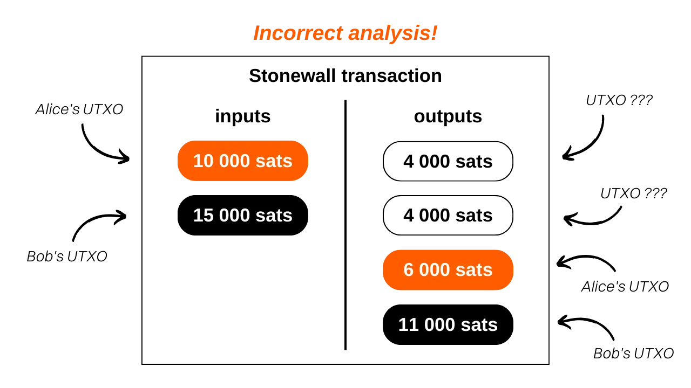

***WARNING:** Following the arrest of the founders of Samourai Wallet and the seizure of their servers on April 24th, using the Samourai Wallet app now requires a connection to your own Dojo to function properly. Aside from this, Stonewall transactions are not affected at all and can still be performed without any issues. Indeed, these types of transactions are carried out autonomously, without the need for external collaboration or connection via Soroban.*

_We are closely following the developments of this case as well as developments concerning the associated tools. Rest assured that we will update this tutorial as new information becomes available._

_This tutorial is provided for educational and informational purposes only. We do not endorse or encourage the use of these tools for criminal purposes. It is the responsibility of each user to comply with the laws in their jurisdiction._

---

> *"Break the assumptions of blockchain analysis with mathematically provable doubt between sender and recipient of your transactions."*

## What is a Stonewall transaction?
Stonewall is a specific form of Bitcoin transaction aimed at increasing user privacy during a transaction by mimicking a coinjoin between two parties, without actually being one. In fact, this transaction is not collaborative. A user can construct it alone, only involving their own UTXOs as inputs. Therefore, you can create a Stonewall transaction for any occasion without needing to coordinate with another user.

The operation of a Stonewall transaction is as follows: as input, the sender uses 2 UTXOs that belong to them. As output, the transaction produces 4 outputs, including 2 that will be exactly the same amount. The other 2 will be change. Among the 2 outputs of the same amount, only one will actually go to the payment recipient.

There are only 2 roles in a Stonewall transaction:
- The sender, who makes the actual payment;
- The recipient, who may be unaware of the specific nature of the transaction and simply expects a payment from the sender.

Let's take an example to understand this transaction structure. Alice is at the bakery to buy her baguette, which costs `4,000 sats`. She wants to pay in bitcoins while maintaining a certain level of privacy in her payment. Therefore, she decides to create a Stonewall transaction for the payment.

Analyzing this transaction, we can see that the baker did indeed receive `4,000 sats` as payment for the baguette. Alice used 2 UTXOs as inputs: one of `10,000 sats` and one of `15,000 sats`. As output, she received 3 UTXOs: one of `4,000 sats`, one of `6,000 sats`, and one of `11,000 sats`. Alice has a net balance of `-4,000 sats` in this transaction, which corresponds to the price of the baguette.

In this example, I intentionally omitted mining fees to facilitate understanding. In reality, transaction fees are fully covered by the sender.

## What is the difference between Stonewall and Stonewall x2?
The Stonewall transaction operates in the same way as the StonewallX2 transaction, with the only difference being that the latter requires collaboration, unlike the classic Stonewall transaction, hence the "x2" designation. Indeed, the Stonewall transaction can be executed without requiring external cooperation: the sender can carry it out without the assistance of another person. However, for a Stonewall x2 transaction, an additional participant, called the "collaborator," joins the process. The collaborator contributes their own bitcoins as input, alongside those of the sender, and receives the entire sum as output (minus mining fees).

Let's revisit our example with Alice at the bakery. If she had wanted to make a Stonewall x2 transaction, Alice would have had to collaborate with Bob (a third party) when creating the transaction. They would each have provided an input UTXO. Bob would then have received the full amount of his input as output. The baker would have received payment for his baguette in the same way as in the Stonewall transaction, while Alice would have received her initial balance back, minus the cost of the baguette.

From an external perspective, the pattern of the transaction would have remained exactly the same.

In summary, Stonewall and Stonewall x2 transactions share an identical structure. The distinction between the two lies in their collaborative nature. The Stonewall transaction is developed individually, without the need for collaboration. In contrast, the Stonewall x2 transaction relies on cooperation between two individuals for its implementation.

[**-> Learn more about Stonewall x2 transactions**](https://planb.network/tutorials/privacy/stonewall-x2)

## What is the purpose of a Stonewall transaction?
The Stonewall structure adds a significant amount of entropy to the transaction and obscures the chain analysis. From an external perspective, such a transaction can be interpreted as a small coinjoin between two people. But in reality, just like the Stonewall x2 transaction, it is a payment. This method therefore creates uncertainties in chain analysis, and may even lead to false leads.

Let's revisit Alice's example at the bakery. The transaction on the blockchain would appear as follows:

An external observer relying on common chain analysis heuristics could mistakenly conclude that "*two people have performed a small coinjoin, with one UTXO each as input and two UTXOs each as output*".

This interpretation is incorrect because, as you know, a UTXO was sent to the baker, the 2 UTXOs in the input come from Alice, and she received 3 change outputs.

Even if an outside observer manages to identify the pattern of the Stonewall transaction, they will not have all the information. They will not be able to determine which of the two UTXOs of the same amounts corresponds to the payment. Furthermore, they will not be able to determine if the two UTXOs in the input come from two different people or if they belong to a single person who merged them. This last point is due to the fact that Stonewall x2 transactions, which we talked about above, follow exactly the same pattern as Stonewall transactions. From the outside and without additional information about the context, it is impossible to differentiate a Stonewall transaction from a Stonewall x2 transaction. However, the former are not collaborative transactions, whereas the latter are. This adds even more doubts about this expenditure.

## How to make a Stonewall transaction on Samourai Wallet?
Unlike Stowaway or Stonewall x2 (cahoots) transactions, the Stonewall transaction does not require the use of Paynyms. It can be done directly, without any preparation steps. To do this, follow our video tutorial on Samourai Wallet: 

## How to make a Stonewall transaction on Sparrow Wallet?
Unlike Stowaway or Stonewall x2 (cahoots) transactions, the Stonewall transaction does not require the use of Paynyms. It can be done directly, without any preparation steps. To do this, follow our video tutorial on Sparrow Wallet: 

**External Resources:**
- https://docs.samourai.io/en/spend-tools#stonewall.
