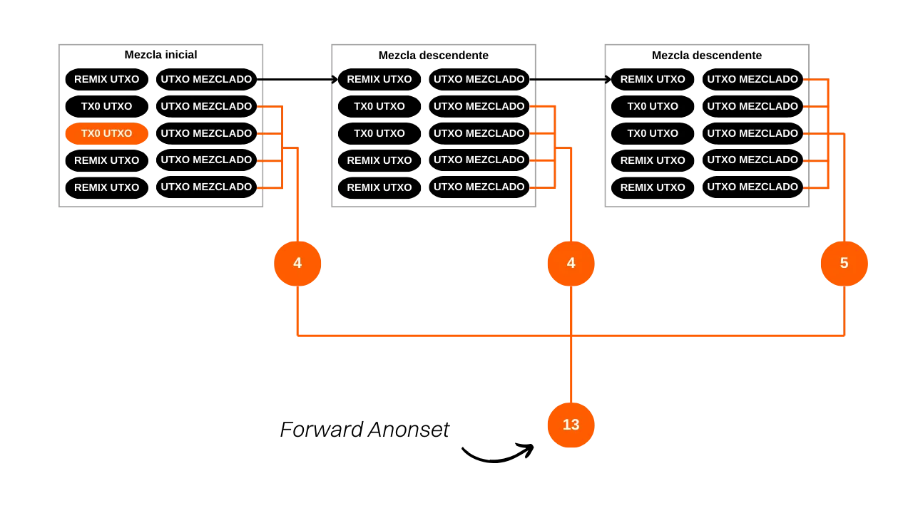
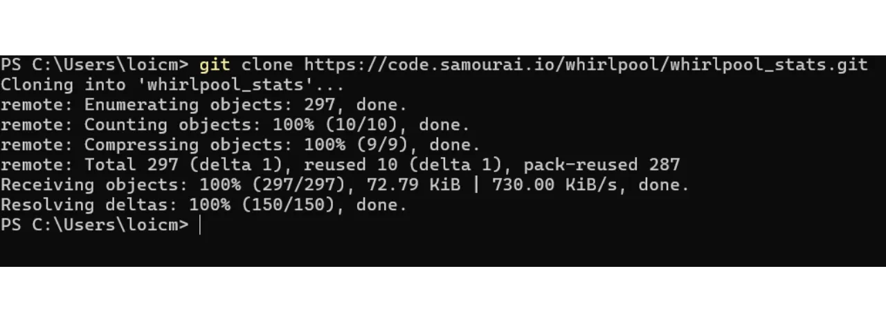
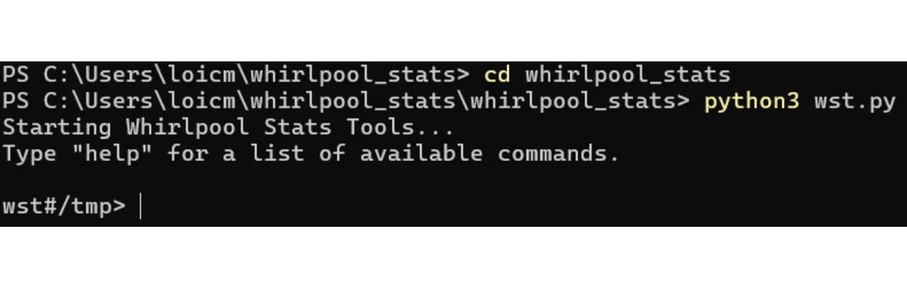

***ADVERTENCIA:** Tras la detención de los fundadores de Samourai Wallet y la incautación de sus servidores el 24 de abril, la herramienta Whirlpool Stats Tool ya no está disponible para descargar, ya que estaba alojada en el Gitlab de Samourai. Incluso si había descargado previamente esta herramienta localmente en su máquina, o estaba instalada en su nodo RoninDojo, WST no funcionará por el momento. Dependía de los datos proporcionados por OXT.me para su funcionamiento, y este sitio ya no está accesible. Actualmente, WST no es particularmente útil ya que el protocolo Whirlpool está inactivo. Sin embargo, es posible que estos softwares se reactiven en las próximas semanas. Además, la parte teórica de este artículo sigue siendo relevante para entender los principios y objetivos de los coinjoins en general (no solo Whirlpool), así como la eficacia del modelo Whirlpool. También puede aprender a cuantificar la privacidad proporcionada por los ciclos de coinjoin.*

_Estamos siguiendo de cerca la evolución de este caso así como los desarrollos relacionados con las herramientas asociadas. Ten la seguridad de que actualizaremos este tutorial a medida que estén disponibles nuevas informaciones._

_Este tutorial se proporciona únicamente con fines educativos e informativos. No respaldamos ni alentamos el uso de estas herramientas para fines criminales. Es responsabilidad de cada usuario cumplir con las leyes en su jurisdicción._

---

*"Rompe el rastro que dejan tus monedas"*

En este tutorial, estudiaremos el concepto de anonsets, indicadores que nos permiten estimar la calidad de un proceso de coinjoin en Whirlpool. Cubriremos el método de cálculo e interpretación de estos indicadores. Después de la parte teórica, pasaremos a la práctica aprendiendo a calcular los anonsets de una transacción específica usando la herramienta Python *Whirlpool Stats Tools* (WST).

## ¿Qué es un coinjoin en Bitcoin?
**Coinjoin es una técnica que rompe la trazabilidad de los bitcoins en la blockchain**. Se basa en una transacción colaborativa con una estructura específica del mismo name: la transacción coinjoin.

Las transacciones coinjoin mejoran la privacidad de los usuarios de Bitcoin complicando el análisis de cadena para observadores externos. Su estructura permite fusionar múltiples monedas de diferentes usuarios en una sola transacción, oscureciendo así los rastros y dificultando determinar los enlaces entre direcciones de entrada y salida.

El principio de coinjoin se basa en un enfoque colaborativo: varios usuarios que desean mezclar sus bitcoins depositan cantidades idénticas como entradas de la misma transacción. Estas cantidades se redistribuyen luego en salidas de valor equivalente. Al final de la transacción, se vuelve imposible asociar una salida específica con un usuario dado. No existe un vínculo directo entre las entradas y las salidas, rompiendo así la asociación entre los usuarios y su UTXO, así como el historial de cada moneda.


Ejemplo de una transacción coinjoin:
[323df21f0b0756f98336437aa3d2fb87e02b59f1946b714a7b09df04d429dec2](https://mempool.space/tx/323df21f0b0756f98336437aa3d2fb87e02b59f1946b714a7b09df04d429dec2)

Para llevar a cabo un coinjoin asegurando que cada usuario mantenga el control sobre sus fondos en todo momento, el proceso comienza con la construcción de la transacción por un coordinador, quien luego la transmite a cada participante. Cada usuario firma entonces la transacción después de verificar que les conviene. Todas las firmas recopiladas finalmente se integran en la transacción. Si un usuario o el coordinador intentan desviar fondos modificando las salidas de la transacción coinjoin, las firmas resultarán inválidas, llevando al rechazo de la transacción por los nodos.

Existen varias implementaciones de coinjoin, como Whirlpool, JoinMarket o Wabisabi, cada una con el objetivo de gestionar la coordinación entre participantes y aumentar la eficiencia de las transacciones coinjoin.
En este tutorial, nos centraremos en mi implementación favorita: Whirlpool, que está disponible en Samourai Wallet y Sparrow Wallet. En mi opinión, es la implementación más eficiente para coinjoins en Bitcoin.
## ¿Cuál es la utilidad de coinjoin en Bitcoin?
La utilidad de coinjoin radica en su capacidad para producir negación plausible, ahogando tu moneda dentro de un grupo de monedas indistinguibles. El objetivo de esta acción es romper los enlaces de trazabilidad, tanto del pasado al presente como del presente al pasado.

En otras palabras, un analista que conozca tu transacción inicial en la entrada de los ciclos de coinjoin no debería poder identificar con certeza tu UTXO en la salida de los ciclos de remezcla (análisis de la entrada del ciclo a la salida del ciclo).


Por el contrario, un analista que conozca tu UTXO en la salida de los ciclos de coinjoin debería ser incapaz de determinar la transacción original en la entrada de los ciclos (análisis de la salida del ciclo a la entrada del ciclo). 


Para evaluar la dificultad para un analista de vincular el pasado con el presente y viceversa, es necesario cuantificar el tamaño de los grupos dentro de los cuales tu moneda está oculta. Esta medida nos indica el número de análisis que tienen una probabilidad idéntica. Así, si el análisis correcto está ahogado entre 3 otros análisis de igual probabilidad, tu nivel de ocultamiento es muy bajo. Por otro lado, si el análisis correcto está dentro de un conjunto de 20,000 análisis todos igualmente probables, tu moneda está muy bien oculta.

Y precisamente, el tamaño de estos grupos representa indicadores que se llaman "anonsets".

## Entendiendo los anonsets
Los anonsets sirven como indicadores para evaluar el grado de privacidad de un UTXO particular. Más específicamente, miden el número de UTXOs indistinguibles dentro del conjunto que incluye la moneda estudiada. El requisito de un conjunto de UTXO homogéneo significa que los anonsets generalmente se calculan sobre ciclos de coinjoin. El uso de estos indicadores es particularmente relevante para los coinjoins de Whirlpool debido a su uniformidad.

Los anonsets permiten, cuando es apropiado, juzgar la calidad de los coinjoins. Un tamaño grande de anonset significa un nivel aumentado de anonimato, ya que se vuelve difícil distinguir un UTXO específico dentro del conjunto.

Hay dos tipos de anonsets:
- **El conjunto de anonimato prospectivo;**
- **El conjunto de anonimato retrospectivo.**
El primer indicador muestra el tamaño del grupo entre el cual el UTXO estudiado está oculto al final del ciclo, conociendo el UTXO en la entrada, es decir, el número de monedas indistinguibles presentes dentro de este grupo. Este indicador permite medir la resistencia de la confidencialidad de la moneda contra un análisis de pasado a presente (entrada a salida). En inglés, el nombre de este indicador es "*forward anonset*", o "*forward-looking metrics*". 


Esta métrica estima hasta qué punto tu UTXO está protegido contra intentos de reconstruir su historia desde su punto de entrada hasta su punto de salida en el proceso de coinjoin.

Por ejemplo, si tu transacción participó en su primer ciclo de coinjoin y se completaron otros dos ciclos descendientes, el anonset prospectivo de tu moneda sería `13`:



El segundo indicador muestra el número de fuentes posibles para una moneda dada, conociendo el UTXO al final del ciclo. Este indicador mide la resistencia de la confidencialidad de la moneda contra un análisis de presente a pasado (salida a entrada), es decir, cuán difícil es para un analista rastrear hasta el origen de tu moneda, antes de los ciclos de coinjoin. En inglés, el nombre de este indicador es "*backward anonset*", o "*backward-looking metrics*".


Conociendo tu UTXO en la salida de los ciclos, el anonset retrospectivo determina el número de posibles transacciones Tx0 que podrían haber constituido tu entrada en los ciclos de coinjoin. En el diagrama a continuación, esto corresponde a la suma de todas las burbujas naranjas.


## Calculando anonsets con Whirlpool Stats Tools (WST)
Para calcular estos indicadores en tus propias monedas que han pasado por ciclos de coinjoin, puedes usar una herramienta especialmente desarrollada por Samourai Wallet: *Whirlpool Stats Tools*.
Si tienes un RoninDojo, WST ya está preinstalado en tu nodo. Por lo tanto, puedes saltarte los pasos de instalación y seguir directamente los pasos de uso. Para aquellos que no tienen un nodo RoninDojo, veamos cómo proceder con la instalación de esta herramienta en una computadora.
Necesitarás: Tor Browser (o Tor), Python 3.4.4 o superior, git y pip. Abre un terminal. Para verificar la presencia y versión de estos programas en tu sistema, introduce los siguientes comandos:
```bash
python --version
git --version
pip --version
```

Si es necesario, puedes descargarlos desde sus respectivos sitios web:
- https://www.python.org/downloads/ (pip viene directamente con Python desde la versión 3.4);
- https://www.torproject.org/download/;
- https://git-scm.com/downloads.
Una vez que todos estos programas estén instalados, desde un terminal, clona el repositorio de WST:
```bash
git clone https://code.samourai.io/whirlpool/whirlpool_stats.git
```



Navega al directorio de WST:
```bash
cd whirlpool_stats
```

Instala las dependencias:
```bash
pip3 install -r ./requirements.txt
```


También puedes instalarlas manualmente (opcional):
```bash
pip install PySocks
pip install requests[socks]
pip install plotly
pip install datasketch
pip install numpy
pip install python-bitcoinrpc
```

Navega al subdirectorio `/whirlpool_stats`:
```bash
cd whirlpool_stats
```

Inicia WST:
```bash
python3 wst.py
```



Inicia Tor o Tor Browser en segundo plano.

**-> Para usuarios de RoninDojo, pueden retomar el tutorial directamente aquí.**

Configura el proxy a Tor (RoninDojo),
```bash
socks5 127.0.0.1:9050
```

o a Tor Browser dependiendo de lo que estés usando:
```bash
socks5 127.0.0.1:9150
```

Esta manipulación te permitirá descargar datos en OXT a través de Tor, para no revelar información sobre tus transacciones. Si eres un novato y este paso parece complejo, debes saber que simplemente implica dirigir tu tráfico de internet a través de Tor. El método más simple consiste en lanzar el Tor Browser en segundo plano en tu computadora, luego ejecutar solo el segundo comando para conectarte a través de este navegador (`socks5 127.0.0.1:9150`).


A continuación, navega al directorio de trabajo desde el cual tienes la intención de descargar los datos de WST usando el comando `workdir`. Esta carpeta servirá para almacenar los datos transaccionales que recuperarás de OXT en forma de archivos `.csv`. Esta información es esencial para calcular los indicadores que buscas obtener. Eres libre de elegir la ubicación de este directorio. Podría ser prudente crear una carpeta específicamente para los datos de WST. Como ejemplo, optemos por la carpeta de descargas. Si estás usando RoninDojo, este paso no es necesario:
```bash
workdir path/to/your/directory
```

El indicador del comando debería haber cambiado para indicar tu directorio de trabajo.


Luego descarga los datos del pool que contiene tu transacción. Por ejemplo, si estoy en el pool de `100,000 sats`, el comando es:
```bash
download 0001
```


Los códigos de denominación en WST son los siguientes:
- Pool de 0.5 bitcoins: `05`
- Pool de 0.05 bitcoins: `005`
- Pool de 0.01 bitcoins: `001`
- Pool de 0.001 bitcoins: `0001`
Una vez descargados los datos, cárgalos. Por ejemplo, si estoy en el pool de `100,000 sats`, el comando es:
```bash
load 0001
```

Este paso tarda unos minutos dependiendo de tu computadora. ¡Ahora es un buen momento para hacerte un café! :)


Después de cargar los datos, escribe el comando `score` seguido de tu TXID (identificador de transacción) para obtener sus anonsets:
```bash
score TXID
```

**Atención**, la elección del TXID a usar varía dependiendo del anonset que desees calcular. Para evaluar el anonset prospectivo de una moneda, es necesario ingresar, a través del comando `score`, el TXID correspondiente a su primer coinjoin, que es la mezcla inicial realizada con este UTXO. Por otro lado, para determinar el anonset retrospectivo, debes ingresar el TXID del último coinjoin realizado. Para resumir, el anonset prospectivo se calcula a partir del TXID de la primera mezcla, mientras que el anonset retrospectivo se calcula a partir del TXID de la última mezcla.

WST luego muestra el puntaje retrospectivo (*Métricas retrospectivas*) y el puntaje prospectivo (*Métricas prospectivas*). Por ejemplo, tomé el TXID de una moneda aleatoria en Whirlpool que no me pertenece.


La transacción en cuestión: [7fe6081fa4f4382be629fb2ef59029d058a22b6fd59cb31d1511fe9e0e7f32be](https://mempool.space/tx/7fe6081fa4f4382be629fb2ef59029d058a22b6fd59cb31d1511fe9e0e7f32be)

Si consideramos esta transacción como el primer coinjoin realizado para la moneda en cuestión, entonces se beneficia de un anonset prospectivo de `86,871`. Esto significa que está oculta entre `86,871` monedas indistinguibles. Para un observador externo que conoce esta moneda al inicio de los ciclos de coinjoin e intenta rastrear su salida, se enfrentará a `86,871` posibles UTXOs, cada uno con una probabilidad idéntica de ser la moneda buscada.

Si consideramos esta transacción como el último coinjoin de la moneda, entonces tiene un anonset retrospectivo de `42,185`. Esto significa que hay `42,185` fuentes potenciales para este UTXO. Si un observador externo identifica esta moneda al final de los ciclos y busca rastrear su origen, se enfrentará a `42,185` posibles fuentes, todas con igual probabilidad de ser el origen buscado.
Además de las puntuaciones de anonset, WST también te proporciona la tasa de difusión de tu salida dentro del grupo basada en el anonset. Este otro indicador simplemente te permite evaluar el potencial de mejora de tu pieza. Esta tasa es particularmente útil para el anonset prospectivo. De hecho, si tu pieza tiene una tasa de difusión del 15%, significa que puede confundirse con el 15% de las piezas en el grupo. Eso es bueno, pero aún tienes un margen muy grande para mejorar continuando con el remix. Por otro lado, si tu pieza tiene una tasa de difusión del 95%, entonces te estás acercando a los límites del grupo. Puedes continuar con el remix, pero tu anonset no aumentará mucho.

Es importante señalar que los anonsets calculados por WST no son perfectamente precisos. Dado el enorme volumen de datos a procesar, WST utiliza el algoritmo *HyperLogLogPlusPlus* para reducir significativamente la carga asociada con el procesamiento de datos locales y la memoria necesaria. Este es un algoritmo que permite estimar el número de valores distintos en conjuntos de datos muy grandes mientras mantiene una alta precisión en el resultado. Por lo tanto, las puntuaciones proporcionadas son lo suficientemente buenas para ser utilizadas en tus análisis, ya que son estimaciones muy cercanas a la realidad, pero no deben interpretarse como valores exactos al unitario.

En conclusión, ten en cuenta que no es imperativo calcular sistemáticamente los anonsets para cada una de tus piezas en coinjoins. El propio diseño de Whirlpool ya proporciona garantías. De hecho, el anonset retrospectivo rara vez es una preocupación. Desde tu mezcla inicial, obtienes una puntuación retrospectiva particularmente alta gracias al legado de mezclas anteriores desde el coinjoin Génesis. En cuanto al anonset prospectivo, es suficiente mantener tu pieza en la cuenta post-mezcla durante un período suficientemente largo.

Es por esto que considero el uso de Whirlpool como particularmente relevante en una estrategia de *Hodl -> Mix -> Spend -> Replace*. En mi opinión, el enfoque más lógico es mantener la mayor parte de los ahorros en bitcoin de uno en una billetera fría, mientras se mantiene continuamente un cierto número de piezas en coinjoins en Samourai para cubrir los gastos diarios. Una vez que se gastan los bitcoins de los coinjoins, se reemplazan por otros nuevos, con el fin de volver al umbral definido de piezas mezcladas. Este método permite liberarse de la preocupación de nuestros anonsets de UTXO, mientras hace que el tiempo necesario para la efectividad de los coinjoins sea mucho menos restrictivo.

**Recursos Externos:**

- [Podcast en francés sobre análisis de cadena](https://fountain.fm/episode/6nNoQEUHBCQR8hAXAkEx)
- [Artículo de Wikipedia sobre HyperLogLog](https://en.wikipedia.org/wiki/HyperLogLog)
- Repositorio de Samourai para Estadísticas de Whirlpool
- Sitio web de Whirlpool por Samourai
- [Artículo en Medium en inglés sobre privacidad y Bitcoin por Samourai](https://medium.com/oxt-research/understanding-bitcoin-privacy-with-oxt-part-1-4-8177a40a5923)
- [Artículo en Medium en inglés sobre el concepto de conjunto de anonimato por Samourai](https://medium.com/samourai-wallet/diving-head-first-into-whirlpool-anonymity-sets-4156a54b0bc7)