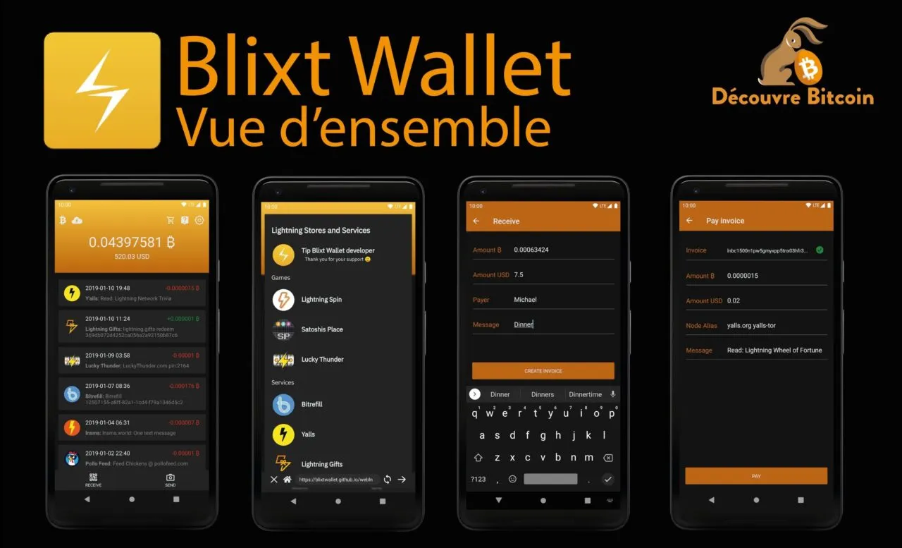

## Um poderoso nó BTC/Lightning no seu bolso, onde quer que você esteja

Gostaria de apresentar a você um novo nó e carteira móvel BTC/LN interessante e também poderoso - Blixt. O nome vem do sueco e significa "relâmpago".

## Como descobri essa joia?

Eu tenho um nó Umbrel LND e queria ter um plano de backup para restaurar meu nó rapidamente em caso de SHTF1. Então, encontrei esta carteira móvel que permite restaurar todos os fundos do nó a partir de backups SCB. Em seguida, comecei a testá-lo mais detalhadamente e descobri que É UM NÓ COMPLETO NO SEU PRÓPRIO BOLSO.

Não se esqueça disso, pois é muito importante!

> No final deste artigo, você encontrará alguns tutoriais simples e rápidos sobre como usá-lo e como se conectar a outros nós.

É um aplicativo incrível para Android e iOS que permite executar um nó BTC-LND no seu próprio bolso. Incrível, não é? No seu próprio telefone, você pode ter um nó BTC LN pronto em menos de 10 minutos, com recursos ricos para usuários experientes, mas também para novos usuários ou aqueles que não são tão familiarizados com tecnologia, pois o uso é simples e harmonioso.

A carteira Blixt é um projeto de código aberto licenciado sob a licença MIT e se concentra em um nicho de usuários que desejam começar com BTC/LN, mas não têm os recursos para executar uma máquina completa ou simplesmente desejam executar um nó móvel.
Links

Aqui estão alguns links sobre este novo aplicativo de nó/carteira:

> Site oficial - com também uma encantadora demonstração interativa
> Repositório GitHub: verifique o estágio de desenvolvimento e/ou faça o download do código-fonte
>
> Grupo de ajuda no Telegram - onde você pode fazer perguntas diretamente ao desenvolvedor e à comunidade
>
> Download do aplicativo Android Blixt
>
> Download do aplicativo Testflight para iOS
> Feed do Twitter com demonstrações

# Principais funcionalidades disponíveis

## Nó Neutrino

O Blixt se conecta por padrão ao servidor Blixt para sincronizar blocos e índices com o Neutrino (modo SPV para Verificação Simplificada de Pagamento), mas o usuário também pode se conectar ao seu próprio nó. É surpreendente constatar que a sincronização de um nó SPV leva menos de 5 minutos, no meu caso no Android 11, para estar pronto para usar a carteira do nó completo (on-chain e LN).

# Nó Completo Não-Custodial

O usuário pode gerenciar seus próprios canais com uma interface fácil e com informações suficientes exibidas para ter uma boa experiência. No menu lateral esquerdo, você pode acessar os canais Lightning para começar a abrir com outros nós, como desejar. Não se esqueça de ativar o Tor nas configurações. É muito melhor para a privacidade e também porque, como um nó móvel, se você mudar muito sua conexão com a internet / IP clearnet, seus pares podem ser perturbados. Com o URI do nó Tor, você sempre terá o mesmo identificador privado, independentemente de sua localização / IP.

## Fazer Backup/Restaurar um nó LND

Uma funcionalidade poderosa, fácil de gerenciar e útil é a restauração de outros nós LND mortos, com apenas a lista de 24 palavras-semente e o arquivo channels.backup.

> Aqui está um guia sobre como restaurar nós Umbrel mortos no Blixt em caso de SHTF.

O usuário também tem a opção de salvar o backup dos canais Blixt no Google Drive e/ou armazenamento local em seu próprio celular (para posteriormente movê-lo para um local seguro, fora do seu telefone).

O procedimento de restauração é bastante simples: insira a semente de 24 palavras, adicione o arquivo de backup (previamente copiado para a memória do celular) e clique em restaurar. Isso levará algum tempo para sincronizar e escanear todos os blocos para suas transações passadas. Os canais serão automaticamente fechados e os fundos retornados para sua carteira onchain (consulte o menu lateral esquerdo - onchain).

> Se você tiver canais abertos anteriormente com seu antigo nó por trás do Tor, você deve primeiro ativar a opção Tor (e reiniciar o aplicativo) nas configurações do menu. Dessa forma, o procedimento de fechamento não falhará e/ou a opção de fechamento forçado não será usada.

Não se esqueça de fazer backup de seus canais LN depois de abrir e/ou fechar canais. Isso leva apenas alguns segundos para ficar seguro. Mais tarde, você pode mover o arquivo de backup para um local seguro fora do seu celular.
Para testar sua semente em um cenário de restauração, antes de adicionar fundos, basta usar a mesma semente de 24 palavras (aezeed) no BlueWallet. Se o endereço BTC gerado for o mesmo no Blixt, você está pronto. Não é necessário usar o BlueWallet depois disso, você pode simplesmente excluir a carteira testada para a restauração.
Tor integrado
Une vez ativado, o aplicativo reiniciará por trás da rede Tor. A partir desse momento, você pode ver nas configurações do menu o seu ID de nó com um endereço onion, para que outros nós possam abrir canais para o seu pequeno nó móvel Blixt. Ou digamos que você tenha o seu próprio nó em casa e queira ter pequenos canais com o seu nó móvel Blixt. Uma combinação perfeita.

## Dunder LSP - Liquidity Service Provider ou Provedor de Serviços de Liquidez

Uma funcionalidade simples e fantástica que oferece ao novo usuário a possibilidade de começar a aceitar BTC na Lightning Network imediatamente, sem precisar depositar fundos na carteira on-chain para depois abrir canais LN.

Para novos usuários, isso é uma ótima notícia, pois eles podem começar do zero, diretamente na LN. Para isso, basta criar uma fatura (ou invoice) LN a partir da tela principal no botão "receber", inserir o valor, a descrição, etc. e pagar a partir de outra carteira. O Blixt abrirá um canal de no máximo 500k sats por transação recebida. Você pode abrir vários, se necessário.

Um caso interessante e útil é o seguinte: digamos que o seu primeiro valor recebido seja de 200k. O Blixt abrirá um canal de 500k sats e você já terá 200k (menos as taxas de abertura) do seu lado, mas como você ainda tem 300k de "espaço" disponível, você pode receber mais. Portanto, o próximo pagamento, digamos, de 100k, chegará diretamente por esse canal, sem mais taxas, e você ainda terá 200k de espaço para receber mais.

Mas se você escolher receber o terceiro pagamento, digamos, de 300k, ele criará outro novo canal de 500k e empurrará esses 300k para o seu lado.

Se houver muitas solicitações, o nó Blixt pode ajustar a capacidade do canal durante a abertura.

## Abertura automática de canal

Nas configurações, o usuário pode ativar essa opção e ter um serviço automatizado que abre canais com os melhores nós e rotas a partir do saldo disponível na carteira onchain do aplicativo Blixt. Isso é vantajoso para novos usuários que não sabem muito bem com qual nó fazer um canal e/ou como abrir um canal LN. É como um piloto automático para LN.

> Lembre-se: essa opção é usada apenas uma vez, quando você cria sua nova carteira Blixt, e é ativada por padrão. Portanto, se o novo usuário escanear o código QR on-chain na tela principal e depositar seus primeiros sats nesse endereço, o Blixt abrirá automaticamente um canal com esses sats, com o nó público Blixt.

## Serviços de liquidez entrantes

'Funcionalidade dedicada a comerciantes que precisam de mais liquidez ENTRANTE, fácil de usar. Para isso, basta selecionar um dos provedores de liquidez na lista, pagar a quantia desejada para o canal e fornecer o ID do seu nó e, a partir daí, um canal será aberto para o seu nó Blixt.

## Listas de contatos

Recurso útil se você deseja ter uma lista duradoura de destinatários com os quais você negocia a maior parte do tempo. Essa lista pode ser composta por LNURL, endereços Lightning ou futuras informações de pagamento estáticas/faturas. Por enquanto, essa lista não pode ser salva fora do aplicativo, mas está prevista uma opção para exportá-la.

## Enviar para um endereço Lightning

Você pode enviar para qualquer endereço LN se ele não estiver na sua lista de contatos. Em breve, talvez haja uma opção para ter seu próprio endereço LN do tipo @blixtwallet.com.

Suporte ao LNURL

Você pode escanear/pagar/conectar-se com LNURL, mas no momento isso não funciona se o LNURL estiver por trás do Tor.

## Keysend

Um recurso muito poderoso que poucas carteiras móveis possuem. Você pode enviar/enviar fundos diretamente por um canal ou apontar para outro nó, adicionando uma mensagem, se necessário. Esse recurso é muito útil para exibir mensagens no painel Amboss.space (aqui está um guia sobre esse painel Amboss).

## Assinatura de mensagens

Ferramenta muito útil para assinar mensagens com sua chave privada do nó Blixt, mensagens de autenticação de login e assim por diante. Muito poucas carteiras móveis possuem esse recurso, praticamente nenhuma.

## Pagamentos multi-canais - Multi-Path Payments (MPP)

Recurso útil para pagamentos LN, permitindo dividir um pagamento LN em várias partes, através de vários canais. É uma boa maneira de equilibrar a liquidez na rede e melhorar a privacidade.

## Navegador Lightning

Uma série de serviços de terceiros com LN, organizados em um navegador simples, acessível e conveniente para o usuário. Também é uma boa maneira de promover empresas que aceitam BTC na LN. Este é um recurso que será mais desenvolvido no futuro. Por enquanto, não funciona por trás do Tor, então a navegação nesses aplicativos será em texto simples (clearnet).

## Exploradores de Logs

Esta é uma ferramenta poderosa para verificar os logs LND e o estado do seu nó em geral. Há uma opção para fazer backup do arquivo de logs. É muito útil ter esses logs à mão caso você precise da ajuda do desenvolvedor para identificar alguns problemas.

## Segurança'

Você pode definir nas configurações do aplicativo, para uma maior segurança da sua carteira/nó, a possibilidade de iniciar o aplicativo com um código PIN e/ou impressão digital.

## Carteira On-chain

Essa funcionalidade está um pouco escondida, no menu lateral superior esquerdo. Como ela não é frequentemente utilizada por um usuário da LN, ela não é visível na tela principal. Mas não se preocupe, você pode tê-la em uma carteira separada onde pode gerenciar os endereços e ver o histórico de transações, importando sua seed para o Sparrow, por exemplo. Talvez no futuro, a carteira Blixt também inclua uma funcionalidade para gerenciar os UTxO. Mas por enquanto, use SOMENTE essa carteira on-chain para abrir ou fechar canais na LN.

"Ovos de Páscoa"

Sim, no aplicativo Blixt, existem algumas funcionalidades escondidas, pequenas coisas que tornam o aplicativo cativante, ativando ações e respostas divertidas/interessantes.
Dica: tente clicar duas vezes no logotipo Blixt no menu lateral 🙂 Deixo você descobrir o resto.

# Mini guia para casos de uso típicos com o Blixt

A. Abrindo canais para o seu mini-nó Blixt a partir do seu nó umbrel

## Para usuários Android:

1. Vá para as configurações do Blixt - ative o Tor - reinicie o aplicativo (force o fechamento se ele não reiniciar automaticamente).

2. Aguarde o Blixt abrir por trás do Tor e sincronizar os últimos blocos.

3. Vá para as configurações - clique em "Mostrar serviço de cebola Tor", copie-o, é o URI do seu nó Blixt.

4a. Vá para o seu aplicativo Umbrel RideTheLightning ou ThunderHub (eu prefiro este) - adicione um par e cole o endereço de cebola, o URI do Blixt.

4b. Vá para o painel de controle do seu nó Umbrel ou RTL/TH - abra um canal e selecione um par conhecido na lista procurando pelo seu ID de nó Blixt.

5. Insira a quantidade de sats para o canal, clique em abrir.

6. Aguarde 3 confirmações para ter um novo canal com o seu "mini nó" Blixt.

## Para usuários iOS:

1. Vá para as configurações do Blixt - ative o Tor - reinicie o aplicativo.

2. Aguarde o Blixt abrir por trás do Tor e sincronizar os últimos blocos.

3. Vá para o seu nó Umbrel, copie o URI Tor ou mostre o código QR.

4. No Blixt Wallet, vá para Configurações - Mostrar Pares Lightning - Adicionar par e digitalize ou cole o URI do seu nó Umbrel. Ele será adicionado como um par conhecido.
5. Retorne para o aplicativo Thunderhub do Umbrel, abra o menu de canais e selecione um par na lista suspensa de pares existentes.
6. Preencha todos os outros detalhes para abrir o canal, clique em Abrir.

7. Aguarde 3 confirmações para abrir este canal e pronto, agora você tem mais liquidez de entrada no seu lado Blixt.

## B. Abrindo canais para um nó Umbrel

Desta vez, vamos abrir um canal DO seu nó Blixt para o seu próprio nó Umbrel (por exemplo), para testar a conexão e o uso do Tor. Mais tarde, uma vez aberto, você pode equilibrar esse canal empurrando metade ou a quantidade desejada para o lado Umbrel. Isso também pode ser usado como uma "válvula de escape" quando o seu nó principal Umbrel precisa de mais liquidez.

1. Vá para o seu nó Umbrel e copie o URI do seu nó, ou simplesmente exiba o código QR para o URI do endereço onion.

2. Vá para Blixt - Configurações - Pares Lightning - adicionar novo par.

3. Escaneie o código QR do seu nó Umbrel ou cole o URI da cebola e o seu nó Umbrel será adicionado como par.

4. Volte para a tela principal - gaveta superior esquerda - canais Lightning.

5. Clique no sinal "+" para abrir um novo canal e cole o URI ou escaneie o código QR do seu nó Umbrel. Adicione a quantidade de sats para o canal, as taxas e clique em abrir.

6. Pronto! O canal levará 3 confirmações para ser aberto e ... Feliz Lightning com o seu próprio nó Umbrel.

C. Receba fundos diretamente na carteira LN

Esta é uma experiência simples e agradável de receber fundos diretamente em sua carteira de nós Blixt recém-aberta, sem precisar depositar fundos antecipadamente e abrir manualmente canais com nós específicos.

1. Depois de criar a carteira e fazer o backup da semente, vá para as configurações e ative a funcionalidade Dunder LSP.

2. Volte para a tela principal - clique em receber, insira o valor, testei com 200k sats.

3. Ele criará uma fatura LN para pagar de outra carteira LN.

4. O serviço LSP Dunder criará um canal de no máximo 500k sats e empurrará os fundos que você enviou (200k no nosso caso) para o lado do seu canal. Assim, você terá um canal bonito pronto para enviar e receber.
5. Se você quiser receber mais, os próximos pagamentos serão recebidos no mesmo canal, até que o limite máximo de 500k seja atingido. Se não houver mais "espaço" para receber no mesmo canal, o Dunder LSP criará um novo canal, seguindo o mesmo procedimento.
6. Faça backup dos seus novos canais abertos. Sempre faça isso depois de abrir ou fechar um novo canal. É muito fácil e rápido e pode evitar muitos problemas.

Este é um caso de uso perfeito para novos pequenos comerciantes que desejam começar a aceitar BTC.

Observações importantes

> Antes de começar a usar seus canais através do Tor e se o aplicativo Blixt ficou fechado/desatualizado por muito tempo, aguarde o ícone de sincronização no topo da tela desaparecer e verifique se todos os seus canais estão ativos. Se estiver tudo certo, vá em frente e faça suas transações.
>
> Se os canais ainda não estiverem ativos, adicione novamente a chave pública (URI) dos seus pares nas opções do Blixt - Mostrar pares. Você também pode tentar atualizar essa lista, se o gossip sob o Tor encontrar seus pares, os canais serão reativados. Caso contrário, adicione-os novamente, o que incentivará o gossip a se comunicar.
>
> Mas lembre-se: não faça uma transação imediatamente após abrir o aplicativo Blixt. Leva alguns instantes para verificar se seus canais estão ativos e para alertá-lo se houver algum erro na rota de pagamento ou falta de liquidez na rota.
>
> Abrir canais LN com o Blixt tem um custo, assim como qualquer outro nó LN abrindo canais. Isso tem um nome: "commit_fees" (ou taxas de compromisso), que são como uma reserva para fechar os canais, a fim de poder pagar as taxas dos mineradores. Portanto, esteja ciente de que quando você deposita em sua carteira on-chain Blixt e abre canais (não importa se você está usando o LSP Dunder, a abertura automática de canais ou manualmente), o valor disponível será ligeiramente menor do que o valor total com o qual você abriu o canal. É por isso que NÃO É RECOMENDADO abrir canais muito pequenos, como 20-50-100k sats.
>
> Além disso, cada transação LN tem pequenas taxas para a rede. Essas não são taxas para o Blixt, é um custo que torna suas transações seguras e protegidas pela rede. Mas elas são muito pequenas, às vezes até em milli-sats, geralmente menos de 0,5% do valor da sua transação.
> Sendo um nó LN, é altamente desaconselhável usar a mesma semente em dois dispositivos diferentes. Este procedimento só pode ser feito SE você estiver em um processo de recuperação. Quando a carteira on-chain é gerada a partir da semente, ela começará a sincronizar as transações anteriores e os saldos. Se você não tiver o LN.backup de seus canais, isso não iniciará o processo de restauração completa. Portanto, sim, você verá a mesma carteira on-chain nos dois dispositivos, mas NÃO o saldo do LN. E acima de tudo, NÃO TENTE restaurar os mesmos canais LN nos dois dispositivos, pois você perderá todos os seus fundos LN!

> Tenha em mente que o fechamento dos canais leva tempo, até que os fundos sejam liberados. É assim que o LN funciona (para saber mais, vá aqui). Portanto, em geral, se você tiver um fechamento cooperativo (normal), levará pelo menos 40 blocos até que os fundos sejam liberados em sua carteira on-chain. Para canais fechados à força, esse bloqueio é de 144 blocos ou até mais às vezes. Portanto, seja paciente e não se preocupe, os fundos estão seguros.

## Conclusão

Bem, aqui estão algumas das principais funcionalidades (para uma carteira móvel, é muito, não é?) entre muitas outras e em breve haverá ainda mais.

A experiência com este aplicativo de carteira/nó LN é muito agradável e fácil de usar, um aplicativo muito responsivo, sem grandes problemas, apenas pequenas coisas que precisam ser adicionadas (mas não tão importantes assim). Ainda é um aplicativo jovem e precisa de muitos testes em condições reais. Então, não hesite em experimentá-lo e informar o desenvolvedor de qualquer problema que possa ser corrigido ou melhorado.

Não esqueçamos também que este é um projeto de código aberto e sua manutenção é feita por um único desenvolvedor, que faz todo o trabalho! Portanto, por favor, ajude-o com testes e comentários e, o mais importante, seja paciente e relate com muitos detalhes se encontrar problemas ou se o aplicativo precisar de mais melhorias.

Espero que você aproveite o uso dele. Pessoalmente, eu adoro e é muito útil para mim (veja aqui um caso de uso onde esta carteira é uma ótima ferramenta).

Que o ₿ITCOIN esteja com você!
