Beschreibung für Electrum

https://twitter.com/ElectrumWallet
https://electrum.org/
https://electrum.readthedocs.io/

> "Ich muss sagen, als ich auf diesen Leitfaden gestoßen bin, war ich schockiert. Glückwunsch an Arman the Parman dafür. Es wäre schade gewesen, ihn nicht hier zu hosten und in so viele Sprachen wie möglich zu übersetzen. Ehrlich gesagt, Tipps für diesen Kerl." Rogzy


## Warum Electrum?

Dies ist ein ausführlicher Leitfaden zur Verwendung der Electrum Bitcoin Wallet mit Lösungen für alle ihre Fallen und Eigenheiten - etwas, das ich nach mehreren Jahren der Nutzung und des Unterrichts von Studenten über Bitcoin-Sicherheit/Privatsphäre entwickelt habe. Electrum ist nicht die beste Bitcoin-Wallet für Personen, die alles so einfach wie möglich halten möchten und lieber auf Anfängerebene bleiben. Stattdessen ist es für Personen gedacht, die bereits "Power"-Benutzer sind oder werden möchten.

Für den neuen Bitcoiner ist es ausgezeichnet, solange er unter Aufsicht eines erfahrenen Benutzers steht, der ihm den Weg zeigt. Wenn man alleine lernt, ist es sicher, vorausgesetzt, man nimmt sich Zeit und verwendet es in einer Testumgebung mit nur einer kleinen Anzahl von Sats zuerst. Dieser Leitfaden unterstützt dieses Vorhaben, ist aber auch eine gute Referenz für alle anderen.

> Warnung: Dieser Leitfaden ist umfangreich. Versuchen Sie nicht, dies alles an einem Tag zu erledigen. Es ist am besten, den Leitfaden zu speichern und im Laufe der Zeit daran zu arbeiten.

## Electrum herunterladen

Idealerweise verwenden Sie einen dedizierten Bitcoin-Computer für Ihre Bitcoin-Transaktionen (Mein Leitfaden dazu: https://armantheparman.com/mint/) _(AUCH im Abschnitt zur Privatsphäre verfügbar)_. Es ist in Ordnung, mit kleinen Beträgen auf einem "schmutzigen" Computer zu üben, wenn Sie gerade erst lernen (wer weiß, wie viel versteckte Malware Ihr regulärer Computer im Laufe der Jahre angesammelt hat - Sie möchten Ihre Bitcoin-Wallets nicht ihnen aussetzen).

Holen Sie sich Electrum von https://electrum.org/.

Klicken Sie auf den Download-Tab oben.

Klicken Sie auf den Download-Link, der Ihrem Computer entspricht. Jeder Linux- oder Mac-Computer kann den Python-Link verwenden (roter Kreis). Ein Linux-Computer mit einem Intel- oder AMD-Chip kann die Appimage-Version verwenden (grüner Kreis; dies ist ähnlich wie eine ausführbare Windows-Datei). Ein Raspberry Pi-Gerät hat einen ARM-Mikroprozessor und kann nur die Python-Version verwenden (roter Kreis), nicht Appimage, obwohl Pi's Linux ausführen. Der blaue Kreis ist für Windows und der schwarze Kreis ist für Mac.

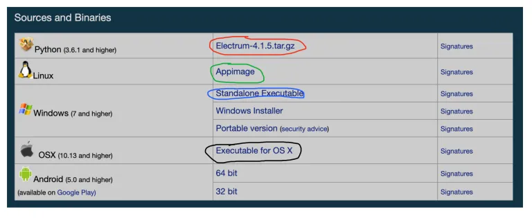

## Electrum überprüfen

Der Zweck der "Überprüfung" des Downloads besteht darin, sicherzustellen, dass kein einziges Datenbit manipuliert wurde. Es verhindert, dass Sie eine "gehackte" bösartige Version der Software verwenden. Es ist in Ordnung, dies zu überspringen, vorausgesetzt, Sie verwenden die heruntergeladene Kopie nur zum Üben, d.h. verwenden Sie keine Wallets, die ernsthaftes Geld enthalten. Wenn Sie dann bereit sind, Electrum für Ihre echten Gelder zu verwenden, sollten Sie Ihre Kopie löschen und von vorne beginnen, diesmal Ihre Download-Datei zu überprüfen.

Um dies zu tun, verwenden wir öffentliche/private Schlüssel-Kryptografie-Tools - gpg, über die wir hier eine Anleitung geschrieben haben (https://armantheparman.com/gpg/). Das gpg-Tool wird mit allen Linux-Betriebssystemen geliefert. Für Mac und Windows finden Sie unter dem gpg-Link Anweisungen zum Herunterladen.

Zusätzlich zum Herunterladen der Electrum-Software benötigen Sie aus Sicherheitsgründen auch die digitale SIGNATUR der Software. Dies ist eine Zeichenkette (eigentlich eine mit Text codierte Zahl), die der Entwickler mit seinem PRIVATEN gpg-Schlüssel erstellt hat. Mit dem gpg-Programm können wir dann die SIGNATUR mit seinem ÖFFENTLICHEN Schlüssel (der aus dem privaten Schlüssel des Entwicklers erstellt wurde) überprüfen, auf den jeder Zugriff hat, im Vergleich zur heruntergeladenen DATEI.

Mit anderen Worten, mit den drei Eingaben (Signatur, öffentlicher Schlüssel und Datei) erhalten wir eine Ausgabe "wahr" oder "falsch", um zu bestätigen, dass die Datei nicht manipuliert wurde.

Um die Signatur zu erhalten, klicken Sie auf den Link, der der heruntergeladenen Datei entspricht (siehe farbige Pfeile):


Wenn Sie auf den Link klicken, wird die Datei möglicherweise automatisch in Ihren Download-Ordner heruntergeladen oder sie wird im Browser geöffnet. Wenn sie im Browser geöffnet wird, müssen Sie die Datei speichern. Sie können mit der rechten Maustaste klicken und "Speichern unter" auswählen. Je nach Betriebssystem oder Browser müssen Sie möglicherweise mit der rechten Maustaste auf den Bereich außerhalb des Textes klicken.

Unten sehen Sie, wie der heruntergeladene Text aussieht. Sie können sehen, dass es mehrere Signaturen gibt - dies sind Signaturen von verschiedenen Personen. Sie können jede einzelne überprüfen. Ich zeige Ihnen, wie Sie nur die des Entwicklers überprüfen können.


Als nächstes müssen Sie den öffentlichen Schlüssel von ThomasV erhalten - er ist der Hauptentwickler. Sie können ihn direkt von ihm, seinem Keybase-Konto, Github oder von jemand anderem, von einem Schlüsselserver oder von der Electrum-Website erhalten.

Es ist tatsächlich der unsicherste Weg, ihn von der Electrum-Website zu erhalten, denn wenn diese Website böswillig ist (das ist genau das, was wir überprüfen), warum sollten wir dann einen öffentlichen Schlüssel von dort beziehen (der öffentliche Schlüssel könnte gefälscht sein)?

Um es vorerst einfach zu halten, zeige ich Ihnen trotzdem, wie Sie ihn von der Website erhalten können, aber behalten Sie dies im Hinterkopf. Hier ist die Kopie (https://github.com/spesmilo/electrum/blob/master/pubkeys/ThomasV.asc) auf GitHub, mit der Sie sie vergleichen können.

Scrollen Sie auf der Seite ein wenig nach unten, um den Link zum öffentlichen Schlüssel von ThomasV (roter Kreis unten) zu finden. Klicken Sie darauf und laden Sie ihn herunter, oder wenn er im Browser einen Text öffnet, klicken Sie mit der rechten Maustaste, um ihn zu speichern.


Sie haben jetzt 3 neue Dateien, wahrscheinlich alle im Download-Ordner. Es spielt keine Rolle, wo sie sich befinden, aber der Vorgang wird einfacher, wenn Sie sie alle in denselben Ordner legen.

Die drei Dateien:

1. Der Electrum-Download
2. Die Signaturdatei (normalerweise hat sie denselben Dateinamen wie der Electrum-Download mit der Erweiterung ".asc")
3. ThomasV's öffentlicher Schlüssel.

Öffnen Sie ein Terminal in Mac oder Linux oder die Eingabeaufforderung (CMD) in Windows.

Navigieren Sie zum Download-Verzeichnis (oder zu dem Ort, an dem Sie die drei Dateien abgelegt haben). Wenn Sie keine Ahnung haben, was das bedeutet, lernen Sie es aus diesem kurzen Video für Linux/Mac (https://www.youtube.com/watch?v=AO0jzD1hpXc) und diesem für Windows (https://www.youtube.com/watch?v=9zMWXD-xoxc). Denken Sie daran, dass auf Linux-Computern die Verzeichnisnamen Groß- und Kleinschreibung beachten.

Im Terminal geben Sie Folgendes ein, um den öffentlichen Schlüssel von ThomasV in den "Schlüsselbund" Ihres Computers zu importieren (der Schlüsselbund ist ein abstrakter Begriff - tatsächlich handelt es sich nur um eine Datei auf Ihrem Computer):

```
gpg --import ThomasV.asc
```

Stellen Sie sicher, dass der Dateiname mit dem übereinstimmt, was Sie heruntergeladen haben. Beachten Sie auch, dass es sich um einen doppelten Bindestrich handelt, nicht um einen einfachen Bindestrich. Beachten Sie außerdem, dass vor und nach "--import" ein Leerzeichen vorhanden ist. Drücken Sie dann die Eingabetaste.

Die Datei sollte importiert werden. Wenn Sie einen Fehler erhalten, überprüfen Sie, ob Sie sich im Verzeichnis befinden, in dem die Datei tatsächlich vorhanden ist. Um zu überprüfen, in welchem Verzeichnis Sie sich befinden (auf Mac oder Linux), geben Sie "pwd" ein. Um zu sehen, welche Dateien sich im aktuellen Verzeichnis befinden (auf Mac oder Linux), geben Sie "ls" ein. Sie sollten die Textdatei "ThomasV.asc" sehen, möglicherweise zusammen mit anderen Dateien.

Dann führen wir den Befehl zur Überprüfung der Signatur aus.

```
gpg --verify Electrum-4.1.5.tar.gz.asc Electrum-4.1.5.tar.gz
```

Beachten Sie, dass hier 4 "Elemente" vorhanden sind, die jeweils durch ein Leerzeichen getrennt sind. Ich habe den Text abwechselnd fett markiert, um Ihnen zu helfen, es zu sehen. Die vier Elemente sind:

1. das gpg-Programm
2. die Option "--verify"
3. der Dateiname der Signatur
4. der Dateiname des Programms

Interessanterweise können Sie manchmal das vierte Element weglassen und der Computer errät, was Sie meinen. Ich bin mir nicht sicher, aber ich glaube, es funktioniert nur, wenn sich die Dateinamen nur durch das "asc" am Ende unterscheiden.

Kopieren Sie nicht einfach die Dateinamen, die ich hier gezeigt habe - stellen Sie sicher, dass sie mit dem Dateinamen übereinstimmen, den Sie auf Ihrem System haben.

Drücken Sie die Eingabetaste, um den Befehl auszuführen. Sie sollten eine "gültige Signatur von ThomasV" sehen, um den Erfolg anzuzeigen. Es wird einige Fehler geben, weil wir die öffentlichen Schlüssel für die Signaturen der anderen Personen nicht haben, die in der Signaturdatei enthalten sind (dieses System, Signaturen in einer Datei zu kombinieren, kann sich in späteren Versionen ändern). Außerdem gibt es eine Warnung am Ende, die wir ignorieren können (dies weist uns darauf hin, dass wir dem Computer nicht explizit mitgeteilt haben, dass wir dem öffentlichen Schlüssel von ThomasV vertrauen).

Jetzt haben wir eine verifizierte Kopie von Electrum, die sicher verwendet werden kann.

## Ausführen von Electrum

### Ausführen von Electrum bei Verwendung von Python

Wenn Sie die Python-Version heruntergeladen haben, funktioniert dies folgendermaßen. Sie sehen auf der Download-Seite Folgendes:

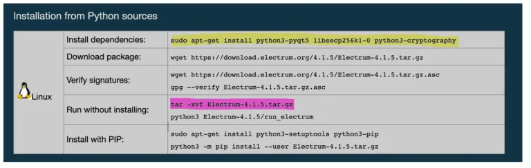

Für Linux ist es eine gute Idee, zuerst Ihr System zu aktualisieren:

```
sudo apt-get update
sudo apt-get upgrade
```

Kopieren Sie den markierten gelben Text, fügen Sie ihn in das Terminal ein und drücken Sie die Eingabetaste. Sie werden nach Ihrem Passwort gefragt, möglicherweise nach einer Bestätigung, um fortzufahren, und dann werden diese Dateien ("Abhängigkeiten") installiert.

Sie müssen auch die ZIP-Datei in ein Verzeichnis Ihrer Wahl extrahieren. Sie können dies mit der grafischen Benutzeroberfläche oder über die Befehlszeile (pink markierter Befehl) tun - denken Sie daran, dass Ihre Dateinamen unterschiedlich sein können. (Beachten Sie, dass wir in dem vorherigen Abschnitt die heruntergeladene Datei überprüft haben, nicht das extrahierte Verzeichnis.)

Es gibt eine Option zur "Installation" mit dem PIP-Programm, aber dies ist unnötig und führt zu zusätzlichen Schritten und der Installation von Dateien. Führen Sie das Programm einfach über das Terminal aus, um dies zu umgehen.

Die Schritte (Linux) sind:

1. Navigieren Sie zum Verzeichnis, in dem die Dateien extrahiert sind.
2. Geben Sie ein: ./run_electrum

Auf einem Mac sind die Schritte die gleichen, aber Sie müssen möglicherweise zuerst Python3 installieren und diesen Befehl verwenden, um es auszuführen:

````
'```python3 ./run_electrum```
````

Sobald Electrum läuft, bleibt das Terminalfenster geöffnet. Wenn Sie es schließen, wird das Electrum-Programm beendet. Minimieren Sie es einfach, während Sie Electrum verwenden.

### Ausführen von Electrum mit der Appimage

Dies ist etwas einfacher, aber nicht so einfach wie eine ausführbare Windows-Datei. Je nach Version von Linux, die Sie verwenden, können Appimage-Dateien standardmäßig so eingestellt sein, dass die Ausführung vom System nicht erlaubt ist. Wir müssen dies ändern. Wenn Ihre Appimages funktionieren, können Sie diesen Schritt überspringen. Navigieren Sie mit dem Terminal zu dem Ort, an dem sich die Datei befindet, und führen Sie dann diesen Befehl aus:

```
sudo chmod ug+x Electrum-4.1.5-x86_64.AppImage
```

"sudo" gibt Superuser-Berechtigungen; "chmod" ist ein Befehl zum Ändern des Modus, der festlegt, wer lesen, schreiben oder ausführen kann; "ug+x" bedeutet, dass wir den Benutzer und die Gruppe ändern, um die Ausführung zu ermöglichen.

Passen Sie den Dateinamen an Ihre Version an.

Dann wird Electrum durch Doppelklicken auf das Appimage-Symbol ausgeführt.

### Ausführen von Electrum mit Mac

Doppelklicken Sie einfach auf die heruntergeladene Datei (es handelt sich um ein "Laufwerk"). Ein Fenster wird geöffnet. Ziehen Sie das Electrum-Symbol in das Fenster auf Ihren Desktop oder an den Ort, an dem Sie das Programm speichern möchten. Sie können dann das Laufwerk "auswerfen" und das Laufwerk (die heruntergeladene Datei) löschen.

Um das Programm auszuführen, doppelklicken Sie einfach darauf. Es können einige Mac-spezifische "Nanny"-Fehler auftreten, die umgangen werden müssen.

### Ausführen von Electrum mit Windows

Trotz der Tatsache, dass ich Windows am meisten hasse, ist dies die einfachste Methode. Doppelklicken Sie einfach auf die ausführbare Datei, um sie auszuführen.

## Beginnen Sie mit einer Dummy-Wallet

Wenn Sie Electrum zum ersten Mal laden, wird ein Fenster wie dieses geöffnet:

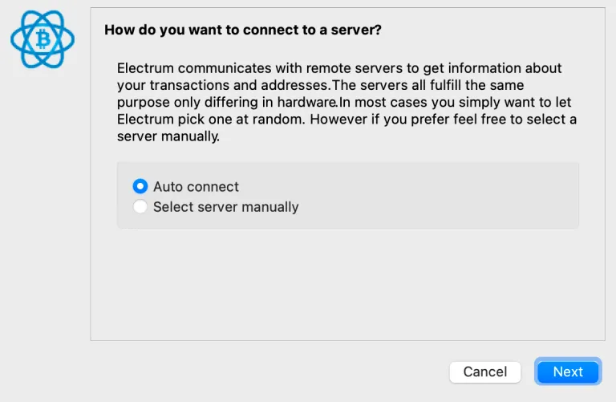

Wir werden später Ihren Server manuell auswählen, aber vorerst lassen Sie den Standardwert und die automatische Verbindung.

Erstellen Sie als nächstes eine Dummy-Wallet - legen Sie niemals Geld in diese Wallet. Der Zweck dieser Dummy-Wallet besteht darin, durch die Software zu navigieren und sicherzustellen, dass alles gut funktioniert, bevor Sie Ihre echte Wallet laden. Wir versuchen, versehentlich die Privatsphäre mit einer echten Wallet preiszugeben. Wenn Sie nur üben, kann die Wallet, die Sie erstellen, ohnehin als Dummy-Wallet betrachtet werden.

Sie können den Namen als "default_wallet" belassen oder ihn nach Belieben ändern und auf "Weiter" klicken. Später können Sie, wenn Sie mehrere Wallets haben, diese in diesem Stadium finden und öffnen, indem Sie zuerst auf "Auswählen..." klicken.


Wählen Sie "Standard Wallet" und <Weiter>:


Wählen Sie dann "Ich habe bereits einen Seed". Ich möchte nicht, dass Sie sich angewöhnen, einen Electrum Seed zu erstellen, da er sein eigenes Protokoll verwendet, das nicht mit anderen Wallets kompatibel ist - deshalb klicken wir nicht auf "neuen Seed".

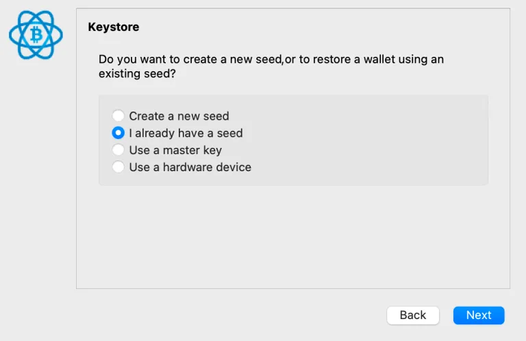

Gehen Sie zu https://iancoleman.io/bip39/ und erstellen Sie einen Dummy Seed. Ändern Sie zuerst die Wortanzahl auf 12 (was gängige Praxis ist), klicken Sie dann auf "generieren" und kopieren Sie die Wörter in das Feld in Ihre Zwischenablage.


Fügen Sie dann die Wörter in Electrum ein. Hier ist ein Beispiel:


Electrum sucht nach Wörtern, die seinem eigenen Protokoll entsprechen. Das müssen wir umgehen. Klicken Sie auf "Optionen" und wählen Sie "BIP39 Seed":

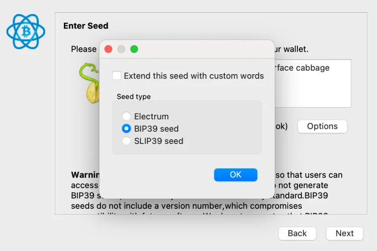'
Der Samen wird dann gültig. (Bevor dies geschieht, erwartete Electrum einen Electrum-Samen, daher wurde dieser Samen als ungültig angesehen). Bevor Sie auf Weiter klicken, beachten Sie den Text, der "Checksum OK" sagt. Es ist wichtig (für die echte Brieftasche, die Sie später verwenden können), dass Sie dies sehen, bevor Sie fortfahren, da dies die Gültigkeit des eingegebenen Samens bestätigt. Die Warnung unten kann ignoriert werden, es handelt sich um die Beschwerde des Electrum-Entwicklers über BIP39 und ihre "FUD'ey"-Behauptungen, dass ihre Version (die nicht mit anderen Brieftaschen kompatibel ist) überlegen ist.

> Ein kurzer Umweg für eine wichtige Warnung. Der Zweck der Prüfsumme besteht darin, sicherzustellen, dass Sie Ihren Samen ohne Tippfehler eingegeben haben. Die Prüfsumme ist der letzte Teil des Samens (das 12. Wort ist das Prüfsummenwort), das mathematisch durch den ersten Teil des Samens (11 Wörter) bestimmt wird. Wenn Sie am Anfang etwas falsch eingeben würden, stimmt das Prüfsummenwort mathematisch nicht überein und die Brieftaschensoftware warnt Sie. Das bedeutet nicht, dass der Samen nicht verwendet werden kann, um eine funktionierende Bitcoin-Brieftasche zu erstellen. Stellen Sie sich vor, Sie erstellen eine Brieftasche mit einem Tippfehler, laden die Brieftasche mit Bitcoin und eines Tages müssen Sie die Brieftasche wiederherstellen, aber wenn Sie dies tun, stellen Sie den Tippfehler nicht wieder her - Sie stellen die falsche Brieftasche wieder her! Es ist ziemlich gefährlich, dass Electrum Sie weitermachen lässt und eine Brieftasche erstellt, wenn Ihre Prüfsumme ungültig ist, also seien Sie gewarnt, es liegt in Ihrer Verantwortung, sicherzustellen. Andere Brieftaschen lassen Sie nicht weitermachen, was viel sicherer ist. Das ist einer der Punkte, die ich meine, wenn ich sage, dass Electrum in Ordnung ist, wenn Sie lernen, es richtig zu verwenden (die Electrum-Entwickler sollten das beheben).

Beachten Sie, dass Sie, wenn Sie eine Passphrase hinzufügen möchten, die Möglichkeit haben, dies im Optionsfenster oben auszuwählen.

Nachdem Sie auf OK geklickt haben, gelangen Sie zurück zu dem Ort, an dem Sie die Samenphrase eingegeben haben. Wenn Sie eine Passphrase-Option ausgewählt haben, geben Sie diese NICHT zusammen mit den Samenwörtern ein (die Aufforderung dazu erfolgt als nächstes).

Wenn Sie keine Passphrase angefordert haben, sehen Sie als Nächstes diesen Bildschirm - weitere Optionen für Ihren Brieftaschenskripttyp und den Ableitungspfad, über die Sie hier mehr erfahren können (https://armantheparman.com/public-and-private-keys/), aber lassen Sie die Standardeinstellungen unverändert und fahren Sie fort.


> Zusätzliche Informationen: Die erste Option ermöglicht es Ihnen, zwischen Legacy (Adressen, die mit "1" beginnen), Pay-to-Script-Hash (Adressen, die mit "3" beginnen) oder Bech32/Native SegWit (Adressen, die mit "bc1q" beginnen) zu wählen. Zum Zeitpunkt des Schreibens unterstützt Electrum noch nicht Taproot (Adressen, die mit "bc1p" beginnen). Die zweite Option in diesem Fenster ermöglicht es Ihnen, den Ableitungspfad zu ändern. Ich schlage vor, dass Sie dies niemals ändern, insbesondere bevor Sie verstehen, was es bedeutet. Die Leute werden die Bedeutung des Aufschreibens des Ableitungspfads betonen, damit Sie Ihre Brieftasche bei Bedarf wiederherstellen können, aber wenn Sie ihn als Standard belassen, werden Sie wahrscheinlich in Ordnung sein, also keine Panik - aber es ist trotzdem eine gute Praxis, den Ableitungspfad aufzuschreiben.

Als Nächstes haben Sie die Möglichkeit, ein PASSWORT hinzuzufügen. Dies darf nicht mit "PASSPHRASE" verwechselt werden. Ein Passwort sperrt die Datei auf Ihrem Computer. Eine Passphrase ist Teil des Aufbaus des privaten Schlüssels. Da dies eine Dummy-Brieftasche ist, können Sie das Passwort leer lassen und fortfahren.

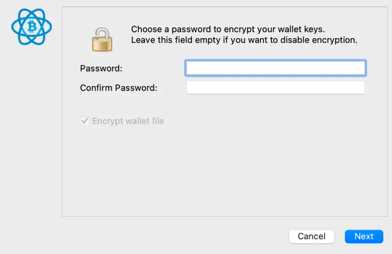
Du erhältst ein Pop-up über Benachrichtigungen zu neuen Versionen (ich schlage vor, dass du "nein" auswählst). Die Wallet wird sich dann generieren und bereit zur Verwendung sein (aber denke daran, dass diese Wallet zur Löschung bestimmt ist, sie ist nur eine Dummy-Wallet).


Es gibt einige Dinge, die ich vorschlage, um die Softwareumgebung einzurichten (nur einmal erforderlich):

### Ändere die Einheiten in BTC

Gehe zum oberen Menü, Werkzeuge -> Electrum-Einstellungen, und dort unter dem Allgemein-Tab findest du die Option, die "Basis-Einheit" in BTC zu ändern.
Aktiviere den Adressen- und Coins-Tab

Gehe zum oberen Menü, Ansicht, und wähle "Adressen anzeigen". Gehe dann zurück zu Ansicht und wähle "Coins anzeigen".

### Aktiviere Oneserver

Standardmäßig verbindet sich Electrum mit einem zufälligen Knoten. Es verbindet sich auch mit vielen anderen sekundären Knoten. Ich bin mir nicht sicher, welche Daten mit diesen sekundären Knoten ausgetauscht werden, aber wir möchten nicht, dass dies aus Datenschutzgründen geschieht. Selbst wenn du einen Knoten angibst, z.B. deinen eigenen Knoten, werden auch diese vielen anderen Knoten verbunden, und ich bin mir nicht sicher, welche Informationen geteilt werden. Unabhängig davon ist es einfach zu verhindern. Bevor ich dir zeige, wie du deinen eigenen Knoten angibst, werden wir Electrum dazu zwingen, sich immer nur mit einem Server zu verbinden.

> Es gibt eine Möglichkeit, dies zu tun, indem du "oneserver" über die Befehlszeile angibst, aber ich empfehle diese Methode nicht. Ich werde eine Alternative zeigen, die meiner Meinung nach langfristig einfacher ist und weniger wahrscheinlich ist, dass du versehentlich mit anderen Knoten verbunden wirst.

Der Grund, warum wir eine Dummy-Wallet verwenden, ist, dass wir, wenn wir unsere echte Wallet mit unseren echten Bitcoins geladen hätten, jetzt versehentlich mit einem zufälligen Knoten verbunden wären (auch wenn wir am Anfang "Server manuell festlegen" ausgewählt haben, verbindet es sich trotzdem aus irgendeinem Grund mit diesen anderen sekundären Knoten (hey Electrum-Entwickler, ihr solltet das beheben). Wenn unsere Wallet privat wäre, wäre das eine Katastrophe.

Wir können auch die unten gezeigten Schritte nicht ausführen, ohne zuerst eine Art Wallet zu laden. (Wir werden eine Konfigurationsdatei bearbeiten, die nur geladen und zur Bearbeitung bereit ist, sobald eine Wallet geladen ist).

**Schalte Electrum aus (WICHTIG, wenn du das nicht tust, werden die folgenden Änderungen, die du vornimmst, gelöscht).**

### LINUX/MAC Konfigurationsdatei

Öffne das Terminal in Linux oder Mac (Windows-Anweisungen später):

Du solltest automatisch im Home-Verzeichnis sein. Von dort aus navigiere zum versteckten Electrum-Einstellungsordner (dies ist ein anderer Ort als die Anwendung).

```
cd .electrum
```

Beachte den Punkt vor "electrum", der anzeigt, dass es sich um einen versteckten Ordner handelt.

Eine andere Möglichkeit dorthin zu gelangen ist, Folgendes einzugeben:

```
cd ~/.electrum
```

wobei "~" den Pfad deines Home-Verzeichnisses repräsentiert. Du kannst den vollständigen Pfad deines aktuellen Verzeichnisses mit dem Befehl "pwd" sehen.

Sobald du im ".electrum"-Verzeichnis bist, gib "nano config" ein und drücke <Enter>.

Ein Texteditor (namens nano) wird geöffnet und die Konfigurationsdatei wird geöffnet. Die Maus funktioniert hier nicht viel. Verwende die Pfeiltasten, um zur Zeile zu gelangen, die sagt:

```
"oneserver": false,
```

Ändere "false" in "true"; und störe die Syntax nicht (lösche kein Komma oder Semikolon).

Drücke <Strg> x, um zu beenden, dann "y", um zu speichern, dann <Enter>, um die Änderung ohne Bearbeitung des Dateinamens zu bestätigen.
Führen Sie Electrum jetzt erneut aus. Klicken Sie dann auf den Kreis unten rechts, um die Netzwerkeinstellungen zu öffnen. In der Übersichtsregisterkarte oben sehen Sie "Mit 1 Knoten verbunden" - dies zeigt den Erfolg an.
Direkt darunter sehen Sie ein Textfeld, in dem die Adresse des Servers steht. Sie sind derzeit mit diesem zufälligen Knoten verbunden. Weitere Informationen zum Verbinden mit einem Knoten finden Sie im nächsten Abschnitt.

### Windows-Konfigurationsdatei

Die Windows-Konfigurationsdatei ist etwas schwieriger zu finden. Das Verzeichnis lautet:

```
C:/Benutzer/Parman/AppData/Roaming/Electrum
```

Natürlich müssen Sie "Parman" durch Ihren eigenen Benutzernamen für den Computer ersetzen.

In diesem Ordner finden Sie die Konfigurationsdatei. Öffnen Sie sie mit einem Texteditor und bearbeiten Sie die Zeile:

```
"oneserver": false,
```

Ändern Sie "false" in "true"; stören Sie die Syntax nicht (löschen Sie kein Komma oder Semikolon).

Speichern Sie dann die Datei und beenden Sie sie.

## Verbinden Sie Electrum mit einem Knoten

Als nächstes möchten wir unsere Dummy-Brieftasche mit einem Knoten unserer Wahl verbinden. Wenn Sie noch nicht bereit sind, einen Knoten auszuführen, können Sie Folgendes tun:

1. Verbinden Sie sich mit dem persönlichen Knoten eines Freundes (erfordert Tor).
2. Verbinden Sie sich mit dem Knoten eines vertrauenswürdigen Unternehmens.
3. Verbinden Sie sich mit einem zufälligen Knoten (nicht empfohlen).

Übrigens, hier sind Anweisungen zum Ausführen Ihres eigenen Knotens, und das sind die Gründe, warum Sie es tun sollten. (Alle Anleitungen im Knotenabschnitt oder in unseren kostenlosen Kursen)

### Verbinden Sie sich mit dem Knoten eines Freundes über Tor (Anleitung folgt in Kürze.)

### Verbinden Sie sich mit dem Knoten eines vertrauenswürdigen Unternehmens

Der einzige Grund, dies zu tun, wäre, wenn Sie auf die Blockchain zugreifen müssen und keinen eigenen Knoten (oder den eines Freundes) zur Verfügung haben.

Lassen Sie uns mit Bitaroo's Knoten verbinden - Wir haben gehört, dass sie keine Daten sammeln. Sie sind eine Bitcoin-Only-Börse, die von einem leidenschaftlichen Bitcoiner betrieben wird. Die Verbindung zu ihnen erfordert ein wenig Vertrauen, ist aber besser als die Verbindung zu einem zufälligen Knoten, der ein Überwachungsunternehmen sein könnte.

Gehen Sie zu den Netzwerkeinstellungen, indem Sie auf den Kreis im unteren rechten Teil des Wallet-Fensters klicken (Rot bedeutet nicht verbunden, Grün bedeutet verbunden und Blau bedeutet über Tor verbunden).

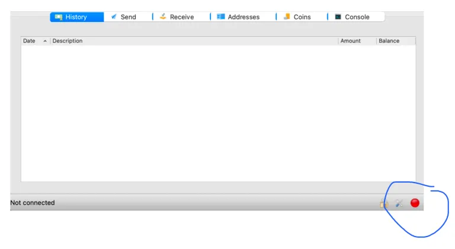

Sobald Sie auf das Kreissymbol klicken, wird ein Popup-Fenster angezeigt: Ihre Brieftasche zeigt "Mit 1 Knoten verbunden" an, da wir das zuvor erzwungen haben.

Deaktivieren Sie das Kontrollkästchen "Server automatisch auswählen" und geben Sie dann im Serverfeld Bitaroo's Details wie gezeigt ein:

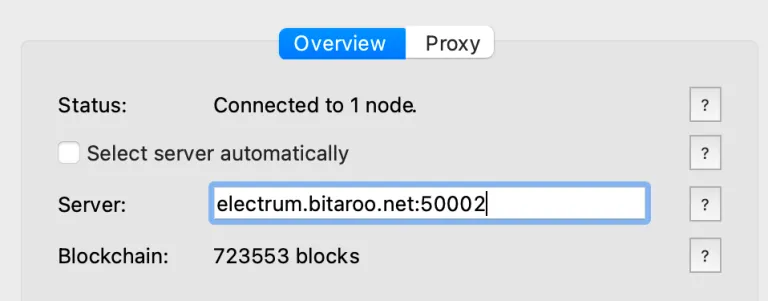

Schließen Sie das Fenster, und jetzt sollten wir mit Bitaroo's Knoten verbunden sein. Zur Bestätigung sollte der Kreis grün sein. Klicken Sie erneut darauf und überprüfen Sie, ob sich die Serverdetails nicht wieder auf einen zufälligen Knoten geändert haben.

### Verbinden Sie sich mit Ihrem eigenen Knoten

Wenn Sie Ihren eigenen Knoten haben, ist das großartig. Wenn Sie nur Bitcoin Core haben und keinen Electrum SERVER, können Sie noch keine Electrum WALLET mit Ihrem Knoten verbinden.

> Hinweis: Electrum Server und Electrum Wallet sind unterschiedliche Dinge. Der Server ist die Software, die für die Kommunikation der Electrum Wallet mit der Bitcoin-Blockchain erforderlich ist - warum dies so konzipiert wurde, weiß ich nicht - möglicherweise für Geschwindigkeit, aber ich könnte mich irren.
> Wenn Sie ein Knoten-Softwarepaket wie MyNode (dasjenige, das ich empfehle, um anzufangen), Raspiblitz (empfohlen für fortgeschrittene Benutzer) oder Umbrel (persönlich empfehle ich es noch nicht, da ich zu viele Probleme hatte) ausführen, können Sie Ihre Brieftasche einfach verbinden, indem Sie die IP-Adresse des Computers (Raspberry Pi), auf dem der Knoten ausgeführt wird, plus ein Doppelpunkt und 50002 eingeben, wie im Bild im vorherigen Abschnitt gezeigt. (Weiter unten zeige ich Ihnen, wie Sie die IP-Adresse Ihres Knotens finden können).

Öffnen Sie die Netzwerkeinstellungen (klicken Sie auf den grünen oder roten Kreis unten rechts). Deaktivieren Sie das Kontrollkästchen "Server automatisch auswählen" und geben Sie dann Ihre IP-Adresse ein, wie ich es getan habe. Ihre Adresse wird anders sein, aber der Doppelpunkt und "50002" sollten gleich bleiben.


Schließen Sie das Fenster, und jetzt sollten wir mit Ihrem Knoten verbunden sein. Um dies zu bestätigen, klicken Sie erneut auf den Kreis und überprüfen Sie, ob sich die Serverdetails nicht wieder auf einen zufälligen Knoten geändert haben.

Manchmal weigert sich die Verbindung trotz korrekter Vorgehensweise zu funktionieren. Hier sind einige Lösungsansätze...

- Aktualisieren Sie auf eine neuere Version von Electrum und Ihrer Knoten-Software.
- Versuchen Sie, den Cache-Ordner im Verzeichnis ".electrum" zu löschen.
- Versuchen Sie, den Port in den Netzwerkeinstellungen von 50002 auf 50001 zu ändern.
- Verwenden Sie diese Anleitung, um eine Verbindung über Tor herzustellen (https://armantheparman.com/tor/).
- Installieren Sie den Electrum Server auf dem Knoten neu.

## ERMITTELN DER IP-ADRESSE IHRES KNOTENS

Eine IP-Adresse ist etwas, das ein normaler Benutzer normalerweise nicht weiß, wie man sie nachschlägt und verwendet. Ich habe vielen Menschen geholfen, einen Knoten auszuführen und dann ihre Brieftaschen mit dem Knoten zu verbinden - ein häufiges Problem scheint das Auffinden der IP-Adresse zu sein.

Für MyNode können Sie Folgendes in einem Browserfenster eingeben:

```
mynode.local
```

Manchmal funktioniert "mynode.local" nicht (stellen Sie sicher, dass Sie es nicht in einer Google-Suchleiste eingeben). Um die Navigationsleiste dazu zu zwingen, Ihren Text als Adresse und nicht als Suche zu erkennen, fügen Sie dem Text http:// voran, wie hier:

```
http://mynode.local
```

Wenn das nicht funktioniert, versuchen Sie es mit einem "s", wie hier:

```
https://mynode.local
```

Dadurch wird auf das Gerät zugegriffen, und Sie können auf den Einstellungslink klicken (siehe meinen blauen "Kreis" unten), um diesen Bildschirm anzuzeigen, auf dem sich die IP-Adresse befindet:


Diese Seite wird geladen, und Sie sehen die IP-Adresse des Knotens (blauer "Kreis").


Dann können Sie in Zukunft 192.168.0.150 oder http://192.168.0.150 in Ihren Browser eingeben.

Für den Raspiblitz (wenn kein Bildschirm angeschlossen ist) benötigen Sie eine andere Methode (die auch für MyNode funktioniert):

Melden Sie sich auf der Webseite Ihres Routers an - hier finden Sie die IP-Adresse aller verbundenen Geräte. Die Webseite des Routers ist eine IP-Adresse, die Sie in einen Webbrowser eingeben. Meine sieht so aus:

> http://192.168.0.1

Um die Anmeldeinformationen für den Router zu erhalten, können Sie im Benutzerhandbuch nachsehen oder manchmal sogar auf einem Aufkleber am Router selbst. Suchen Sie nach Benutzername und Passwort. Wenn Sie es nicht finden können, versuchen Sie es mit Benutzer: "admin" Passwort: "password".
Wenn Sie sich anmelden können, sehen Sie Ihre verbundenen Geräte und anhand ihrer Namen kann klar sein, welches Ihr Knoten ist. Die IP-Adresse wird dort angezeigt.

### Wenn die ersten beiden Methoden fehlschlagen, funktioniert die letzte, aber sie ist mühsam:

Zuerst finden Sie die IP-Adresse eines beliebigen Geräts in Ihrem Netzwerk (der aktuelle Computer reicht aus).

Auf einem Mac finden Sie dies in den Netzwerkeinstellungen:


Wir interessieren uns für die ersten 4 Elemente (192.168.0), nicht das 4. Element, die "166", die Sie auf dem Bild sehen (Ihre wird unterschiedlich sein).

Für Linux verwenden Sie die Befehlszeile:

```
ifconfig | grep inet
```

Dieser senkrechte Strich ist das "Pipe"-Symbol und Sie finden es unter der <delete>-Taste. Sie sehen einige Ausgaben und eine IP-Adresse. (Ignorieren Sie 127.0.0.1, das ist es nicht, und ignorieren Sie die Netzmaske)

Für Windows öffnen Sie die Eingabeaufforderung (cmd) und geben Sie ein:

```
ipconfig/all
```

und drücken Sie Enter. Die IP-Adresse befindet sich in der Ausgabe.

Das war der einfache Teil. Der schwierige Teil besteht darin, die IP-Adresse Ihres Knotens zu finden - wir müssen sie durch Brute-Force erraten. Nehmen wir zum Beispiel an, die IP-Adresse Ihres Computers beginnt mit 192.168.0.xxx, dann versuchen Sie für Ihren Knoten in einem Browser:

```
https://192.168.0.2
```

Die kleinste mögliche Zahl ist 2 (0 bedeutet jedes Gerät und 1 gehört zum Router) und die höchste, glaube ich, ist 255 (das ist zufällig 11111111 in binär, die größte Zahl, die von 1 Byte gehalten wird).

Arbeiten Sie sich nacheinander bis zur Zahl 255 vor. Schließlich bleiben Sie bei der richtigen Zahl stehen, die Ihre MyNode-Seite (oder RaspiBlitz-Seite) lädt. Dann wissen Sie, welche Zahl Sie in Ihren Electrum-Netzwerkeinstellungen eingeben müssen, um sich mit Ihrem Knoten zu verbinden.

Es wird ungefähr so aussehen (stellen Sie sicher, dass Sie den Doppelpunkt und die Nummer danach angeben):

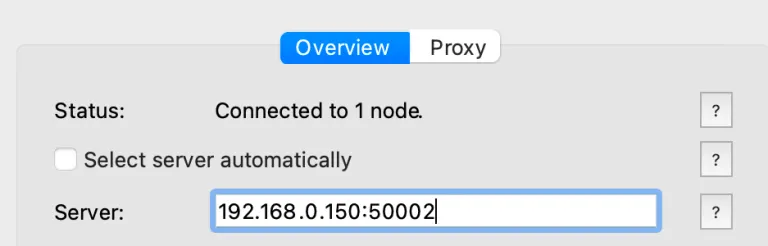

> Es ist nützlich zu wissen, dass diese IP-Adressen INTERN in Ihrem Heimnetzwerk sind. Niemand außerhalb kann sie sehen und sie sind nicht sensibel. Sie sind so etwas wie Telefonerweiterungen in einer großen Organisation, die Sie zu verschiedenen Telefonen weiterleiten.

## Dummy-Wallet löschen

Jetzt haben wir erfolgreich eine Verbindung zu einem einzigen Knoten hergestellt. So wird Electrum standardmäßig geladen. Sie sollten nun das Dummy-Wallet löschen (Menü: Datei -> Löschen), falls Sie versehentlich Geld an dieses unsichere Wallet senden (es ist unsicher, weil wir es nicht auf sichere Weise erstellt haben).

## Übungswallet erstellen

Nach dem Löschen des Dummy-Wallets starten Sie erneut und erstellen Sie ein neues Wallet auf die gleiche Weise, nur diesmal notieren Sie sich die Seed-Wörter und bewahren sie relativ sicher auf.

Es ist eine gute Idee, mit diesem Übungswallet zu lernen, wie Electrum funktioniert, ohne das umständliche Hardware-Wallet (für hohe Sicherheit) zu verwenden. Legen Sie nur eine kleine Menge Bitcoin in dieses Wallet - Gehen Sie davon aus, dass Sie dieses Geld verlieren werden. Sobald Sie sich sicher fühlen, lernen Sie, Electrum mit einem Hardware-Wallet zu verwenden.

In dem neuen Wallet, das Sie erstellt haben, sehen Sie eine Liste von Adressen. Die grünen Adressen werden "Empfangsadressen" genannt. Sie sind das Ergebnis von 3 Dingen:

- Die Seed-Phrase
- Die Passphrase
- Der Ableitungspfad

Deine neue Brieftasche hat eine Reihe von Empfangsadressen, die mathematisch und reproduzierbar von jeder Software-Brieftasche erstellt werden können, die den Seed, den Passphrase und den Ableitungspfad hat. Es gibt 4,3 Milliarden davon! Mehr als du brauchen wirst. Electrum zeigt dir nur die ersten 20 an und dann mehr, wenn du die ersten aufgebraucht hast.

Weitere Informationen zu Bitcoin-Privatschlüsseln findest du in diesem Leitfaden.


Das ist sehr unterschiedlich zu einigen anderen Brieftaschen, die jeweils nur eine Adresse anzeigen.

Da du den Seed-Phrasen bei der Erstellung dieser Brieftasche eingegeben hast, hat Electrum den privaten Schlüssel für jede dieser Adressen und das Ausgeben von diesen Adressen ist möglich.

Beachte auch, dass es gelbe Adressen gibt, die "Wechseladressen" genannt werden - dies sind nur eine weitere Reihe von Adressen aus einem anderen mathematischen Zweig (es gibt weitere 4,3 Milliarden davon). Sie werden von der Brieftasche verwendet, um überschüssige Gelder automatisch als Wechselgeld zurück in die Brieftasche zu senden. Zum Beispiel, wenn du 1,5 Bitcoin nimmst und 0,5 an einen Händler ausgibst, müssen die 1,0 Rest irgendwohin gehen. Deine Brieftasche wird es an die nächste leere gelbe Wechseladresse senden - sonst geht es an den Miner! Für weitere Informationen dazu (UTXOs) siehe diesen Leitfaden. (https://armantheparman.com/utxo/)

Als nächstes gehe zurück zur Ian Colman Private Key-Website und gib den Seed ein (anstatt einen zu generieren). Du wirst sehen, dass sich die Informationen zum privaten und öffentlichen Schlüssel ändern; alles darunter hängt von den oben auf der Seite stehenden Dingen ab.

> Denke daran, du solltest den Seed "niemals" auf einem Computer für deine echte Bitcoin-Brieftasche eingeben - Malware kann ihn stehlen. Wir verwenden nur eine Übungsbrieftasche zum Lernen, also ist es vorerst in Ordnung.

Scrolle nach unten und ändere den Ableitungspfad zu BIP84 (segwit), um ihn mit deiner Electrum-Brieftasche abzugleichen, indem du auf den BIP84-Tab klickst.

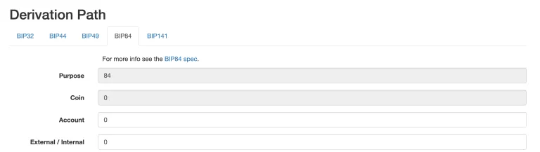

Darunter siehst du den erweiterten privaten Schlüssel des Kontos und den erweiterten öffentlichen Schlüssel des Kontos:


Gehe zu Electrum und vergleiche, ob sie übereinstimmen. Es gibt ein Menü oben, Brieftasche -> Informationen:


Dies erscheint:

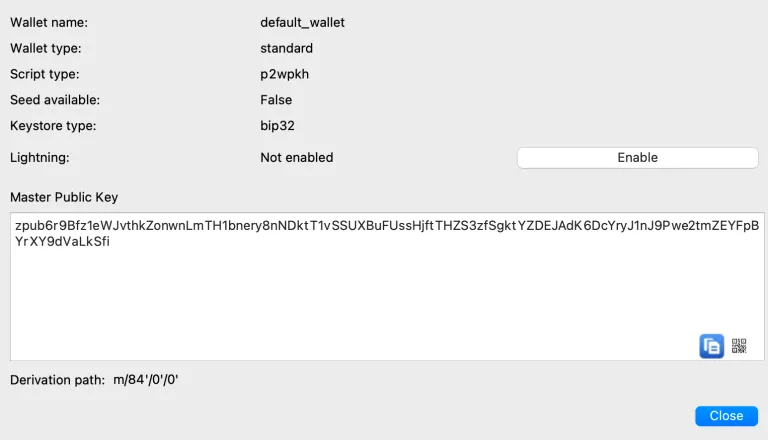

Beachte, dass die beiden öffentlichen Schlüssel übereinstimmen.

Als nächstes vergleiche die Adressen. Gehe zurück zur Website von Ian Coleman und scrolle nach unten:


Beachte, dass sie mit den Adressen in Electrum übereinstimmen.

Jetzt überprüfen wir die Wechseladressen. Scrolle etwas nach oben zum Ableitungspfad und ändere die letzte 0 in eine 1:


Scrolle nun nach unten und vergleiche, ob die Adressen mit den gelben Adressen in Electrum übereinstimmen.

Warum haben wir das alles gemacht?

Wir haben die Seed-Wörter durch zwei verschiedene unabhängige Softwareprogramme geschickt, um sicherzustellen, dass sie uns die gleichen Informationen geben. Dadurch wird das Risiko erheblich reduziert, dass bösartiger Code im Hintergrund lauert und uns falsche private oder öffentliche Schlüssel oder Adressen gibt.

Als nächstes werden wir einen kleinen Test durchführen und ihn innerhalb der Brieftasche von einer Adresse auf eine andere ausgeben.

## Testen der Brieftasche (Lerne sie zu benutzen)

Hier zeige ich dir, wie du eine UTXO in deine Brieftasche empfängst und sie dann (ausgibst) an eine andere Adresse innerhalb der Brieftasche. Es handelt sich um einen sehr kleinen Betrag, den wir bereit sind zu riskieren, zu verlieren.

Dies hat mehrere Zwecke.

- Es wird beweisen, dass du die Möglichkeit hast, Münzen in der neuen Brieftasche auszugeben.
- Es wird demonstriert, wie die Electrum-Software verwendet wird, um eine Ausgabe (und einige Funktionen) zu tätigen, bevor wir zusätzliche Komplexität für die Sicherheit hinzufügen (Verwendung einer Hardware-Wallet oder eines luftisolierten Computers).
- Es wird die Idee verstärken, dass Sie viele Adressen zur Auswahl haben, um innerhalb der gleichen Brieftasche zu empfangen und auszugeben.

Öffnen Sie Ihre Test-Electrum-Brieftasche und klicken Sie auf den Tab "Adressen", klicken Sie dann mit der rechten Maustaste auf die erste Adresse und wählen Sie Kopieren -> Adresse:


Die Adresse befindet sich nun im Speicher Ihres Computers.

Gehen Sie nun zu einer Börse, auf der Sie einige Bitcoins haben, und lassen Sie uns einen kleinen Betrag an diese Adresse abheben, sagen wir 50.000 Sats. Ich werde Coinbase als Beispiel verwenden, weil es die am häufigsten verwendete Börse ist, obwohl sie ein Feind von Bitcoin sind und ich mich ekelhaft fühle, mich in ein altes verlassenes Konto einzuloggen, um diesen Zweck zu erfüllen.

Melden Sie sich an und klicken Sie auf die Schaltfläche "Senden/Empfangen", die sich heute oben rechts auf der Webseite befindet.


Offensichtlich habe ich keine Mittel bei Coinbase, aber stellen Sie sich vor, hier sind Mittel und folgen Sie weiter: Fügen Sie die Adresse aus Electrum in das Feld "An" ein, wie ich es getan habe. Sie müssen auch einen Betrag auswählen (ich schlage etwa 50.000 Sats vor). Geben Sie keine "optionale Nachricht" ein - Coinbase sammelt bereits genug Ihrer Daten (und verkauft sie), es besteht keine Notwendigkeit, ihnen zu helfen. Klicken Sie abschließend auf "Weiter". Danach weiß ich nicht, welche anderen Pop-ups Sie erhalten, Sie sind auf sich allein gestellt, aber die Methode ist für alle Börsen ähnlich.

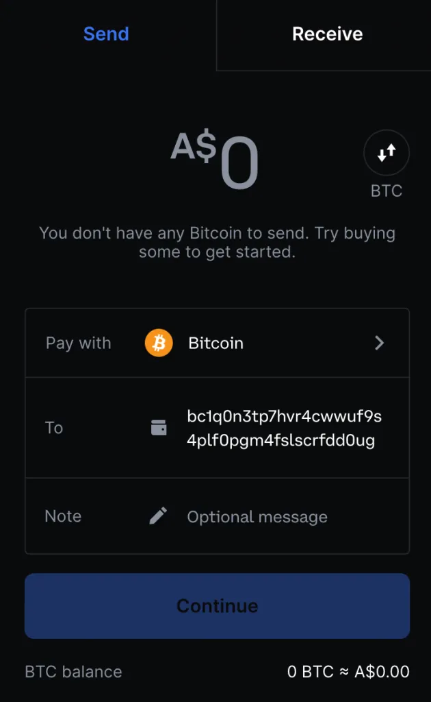

Je nach Börse sehen Sie möglicherweise die Sats in Ihrer Brieftasche sofort oder mit einer Verzögerung von Stunden/Tagen.

Beachten Sie, dass Electrum Ihnen empfangene Münzen anzeigt, auch wenn sie noch nicht in der Blockchain bestätigt wurden. Die Münzen, die Sie haben, werden aus der Warteliste oder dem "Mempool" eines Bitcoin-Knotens gelesen. Wenn sie in einen Block gelangen, sehen Sie die Mittel als bestätigt.

Jetzt, da wir eine UTXO in unserer Brieftasche haben, sollten wir sie beschriften. Nur wir können dieses Etikett sehen, es hat nichts mit dem öffentlichen Hauptbuch zu tun. Alle unsere Electrum-Etiketten sind nur auf dem Computer sichtbar, den wir verwenden. Wir können tatsächlich eine Datei speichern und sie verwenden, um alle unsere Etiketten auf einem anderen Computer mit derselben Brieftasche wiederherzustellen.

### Erstellen Sie ein Etikett für eine UTXO

Ich brauchte eine Spende für diese Test-Brieftasche, danke an @Sathoarder, der mir eine lebendige UTXO (10.000 Sats) zur Verfügung gestellt hat, und eine andere Person (anon) hat an dieselbe Adresse gespendet (5000 Sats). Beachten Sie, dass sich 15.000 Sats im Guthaben der ersten Adresse befinden und insgesamt 2 Transaktionen (ganz rechte Spalte) vorhanden sind. Unten ist das Guthaben 10.000 Sats bestätigt und weitere 5.000 Sats sind unbestätigt (befinden sich noch im Mempool).


Wenn wir nun zum Tab "Coins" wechseln, können wir zwei "empfangene Münzen" oder UTXOs sehen. Sie befinden sich beide in derselben Adresse.

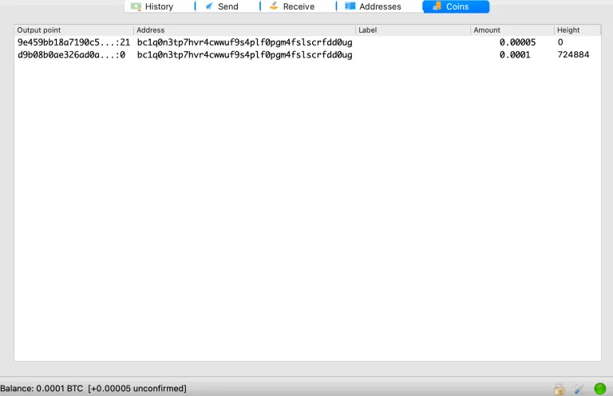

Wenn wir zum Adress-Tab zurückkehren und auf den Bereich "Labels" neben der Adresse doppelklicken, können Sie einen Text eingeben und dann <Enter> drücken, um zu speichern:


Dies ist eine gute Übung, damit Sie verfolgen können, woher Ihre Münzen stammen, ob sie KYC-frei sind oder nicht und wie viel jeder UTXO Sie gekostet hat (falls Sie verkaufen und die Steuer berechnen müssen, die Ihnen von Ihrer Regierung gestohlen wird).

Idealerweise sollten Sie vermeiden, mehrere Münzen an derselben Adresse anzusammeln. Wenn Sie sich dennoch dafür entscheiden (tun Sie das nicht), können Sie statt alle Münzen mit demselben Etikett zu versehen, jede Münze mit einem Etikett versehen, indem Sie die Adressmethode verwenden. Sie können tatsächlich nicht zum "Münzen"-Tab gehen und die Etiketten dort bearbeiten (nein, das wäre zu intuitiv!). Sie müssen zum Tab "Verlauf" gehen, die Transaktion finden, diese kennzeichnen und dann sehen Sie die Etiketten im Münzen-Bereich. Alle Etiketten, die Sie im Münzen-Bereich sehen, stammen entweder von den Adressetiketten oder den Verlaufsetiketten, aber jedes Verlaufsetikett hat Vorrang vor einem Adressetikett. Um Ihre Etiketten in einer Datei zu sichern, können Sie sie über das Menü oben exportieren, Wallet -> Etiketten -> Exportieren.

Als nächstes verwenden wir die Münzen von der ersten Adresse für die zweite Adresse. Klicken Sie mit der rechten Maustaste auf die erste Adresse und wählen Sie "Ausgeben von" (Dies ist in diesem Szenario eigentlich nicht erforderlich, aber stellen Sie sich vor, wir haben viele Münzen in vielen Adressen; mit dieser Funktion können wir das Wallet zwingen, nur die gewünschten Münzen auszugeben. Wenn wir mehrere Münzen in mehreren Adressen auswählen möchten, können wir die Adressen mit einem Linksklick bei gedrückter Befehlstaste auswählen, dann mit der rechten Maustaste klicken und "Ausgeben von" auswählen:

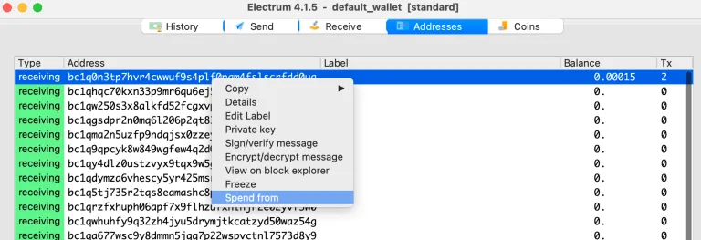

Sobald Sie das getan haben, erscheint eine grüne Leiste am unteren Rand des Wallet-Fensters, die die Anzahl der ausgewählten Münzen und den insgesamt verfügbaren Betrag anzeigt.

Sie können auch einzelne Münzen innerhalb einer Adresse ausgeben und andere ausschließen, die sich in derselben Adresse befinden, aber dies wird nicht empfohlen, da Sie Münzen in einer Adresse belassen, die aufgrund der Ausgabe einer der Münzen kryptografisch geschwächt wurde (ein weiterer Grund, keine mehreren Münzen an einer Adresse zu haben, abgesehen von Datenschutzgründen, ist, dass Sie, wenn Sie eine Münze ausgeben, alle ausgeben sollten, was unnötig teuer wird). So wählen Sie eine einzelne Münze aus einer gemeinsam genutzten Adresse aus, aber tun Sie das nicht:

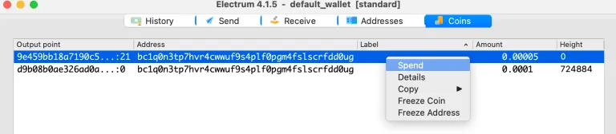

Nun haben wir die beiden Münzen zum Ausgeben ausgewählt. Als nächstes entscheiden wir, wohin wir sie senden möchten. Lassen Sie uns sie an die zweite Adresse senden. Wir müssen die Adresse wie folgt kopieren:


Gehen Sie dann zum Tab "Senden" und fügen Sie die zweite Adresse in das Feld "An" ein. Es ist nicht notwendig, eine Beschreibung hinzuzufügen; Sie könnten es tun, aber Sie können dies später durch Bearbeiten der Etiketten tun. Wählen Sie für den Betrag "Max" aus, um alle ausgewählten Münzen auszugeben. Klicken Sie dann auf "Bezahlen" und anschließend auf die Schaltfläche "Erweitert" in dem angezeigten Popup.

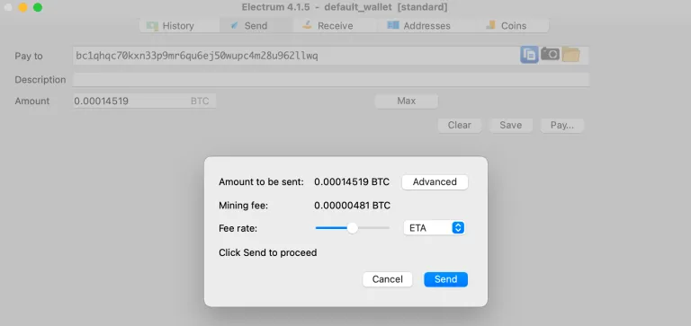

Klicken Sie in diesem Stadium immer auf "Erweitert", damit wir eine feine Kontrolle haben und genau überprüfen können, was in der Transaktion enthalten ist. Hier ist die Transaktion:

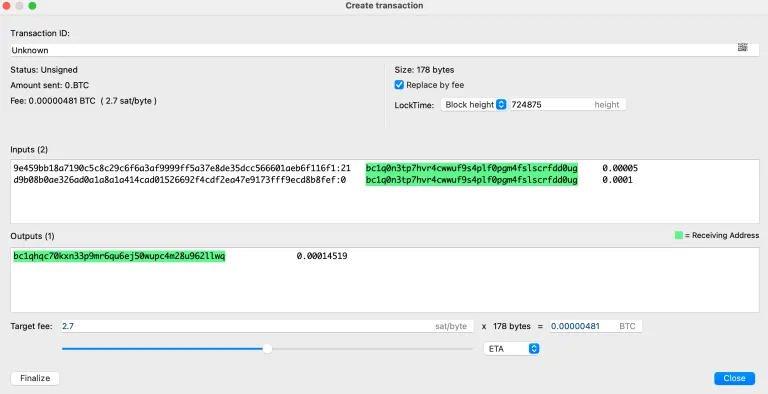

Wir sehen zwei interne weiße Kästchen/Fenster. Das obere ist das Eingabefenster (welche Münzen ausgegeben werden) und das untere ist das Ausgabefenster (wohin die Münzen gehen).
Beachte, der Status (oben links) ist vorerst "nicht signiert". Der "Gesendete Betrag" beträgt 0, da die Münzen innerhalb der Brieftasche übertragen werden. Die Gebühr beträgt 481 Sats. Beachte, dass wenn es 480 Sats wären, die letzte Null weggelassen würde, wie folgt: 0,0000048 und für das müde Auge kann dies wie 48 Sats aussehen - sei vorsichtig (etwas, das die Electrum-Entwickler beheben sollten).

Die Größe der Transaktion bezieht sich auf die Datenmenge in Bytes, nicht auf die Menge an Bitcoin. "Ersetzen durch Gebühr" ist standardmäßig aktiviert und ermöglicht es Ihnen, die Transaktion bei Bedarf mit einer höheren Gebühr erneut zu senden. Die LockTime ermöglicht es Ihnen, festzulegen, wann die Transaktion gültig ist - ich habe noch nicht damit gespielt, aber ich rate davon ab, es zu verwenden, es sei denn, Sie verstehen vollständig, was Sie tun, und haben mit kleinen Beträgen geübt.

Unten haben wir einige ausgeklügelte Werkzeuge zur Anpassung der Mining-Gebühr. Alles, was Sie für interne Überweisungen tun müssen, ist, sie auf die Mindestgebühr von 1 Sat/Byte einzustellen. Geben Sie einfach die Zahl manuell in das Feld "Zielgebühr" ein. Um eine angemessene Gebühr für eine externe Zahlung zu überprüfen, können Sie https://mempool.space konsultieren, um zu sehen, wie ausgelastet der Mempool ist, und es werden einige vorgeschlagene Gebühren angezeigt.


Ich habe 1 Sat/Byte ausgewählt.

Im Eingabefenster sehen wir zwei Einträge. Der erste ist die Spende von 5000 Sats. Wir sehen links den Transaktionshash (den wir in der Blockchain nachschlagen können). Daneben steht eine "21" - dies zeigt an, dass es sich um die Ausgabe mit der Bezeichnung 21 in dieser Transaktion handelt (tatsächlich ist es die 22. Ausgabe, da die erste mit Null bezeichnet ist).

Etwas, das hier zu beachten ist: UTXOs existieren nur innerhalb einer Transaktion. Um eine UTXO auszugeben, müssen wir darauf verweisen und diese Referenz in den Eingang einer neuen Transaktion setzen. Die Ausgaben werden dann zu neuen UTXOs und der alte UTXO wird zu einem STXO (ausgegebene Transaktionsausgabe).

Die zweite Zeile ist die Spende von 10.000 Sats. Es steht eine "0" neben dem Transaktionshash, von dem sie stammt, da es die erste (und möglicherweise einzige) Ausgabe für diese Transaktion ist.

Im unteren Fenster sehen wir unsere Adresse. Beachten Sie, dass die Bitcoin-Gesamtsumme der Eingänge nicht ganz der Gesamtsumme der Ausgänge entspricht. Der Unterschied geht an den Miner. Der Miner betrachtet die Diskrepanz in allen Transaktionen im Block, den er zu minen versucht, und fügt diese Zahl zu seiner Belohnung hinzu. (Mining-Gebühren sind auf diese Weise völlig von der Kette der Transaktionen getrennt und beginnen ein neues Leben).

Wenn wir die Mining-Gebühr anpassen, ändert sich der Ausgabewert automatisch.

> Es ist hier erwähnenswert: Beachten Sie die Farbe der Adressen im Transaktionsfenster. Denken Sie daran, dass die grünen Adressen in Ihrem Adressregister aufgeführt sind. Wenn eine Adresse in einem Transaktionsfenster grün (oder gelb) markiert ist, hat Electrum die Adresse als eine seiner eigenen erkannt. Wenn die Adresse keine Markierung hat, handelt es sich um eine externe Adresse (extern zur derzeit geöffneten Brieftasche), und Sie sollten sie besonders sorgfältig überprüfen.

Sobald Sie alles in der Transaktion überprüft haben und sicher sind, dass Sie mit den Münzen, die Sie ausgeben, zufrieden sind und wohin die Münzen gehen, können Sie auf "Finalisieren" klicken.


Nachdem Sie auf "Finalisieren" geklickt haben, können Sie keine Änderungen mehr vornehmen - Wenn Sie dies tun müssen, müssen Sie dies schließen und erneut beginnen. Beachten Sie, dass die Schaltfläche "Finalisieren" in "Exportieren" geändert wurde und neue Schaltflächen angezeigt werden: "Speichern", "Kombinieren", "Unterzeichnen" und "Übertragen". Die Schaltfläche "Übertragen" ist ausgegraut, da die Transaktion nicht signiert ist und daher in diesem Stadium ungültig ist.

Nachdem Sie auf "Unterzeichnen" geklickt haben, werden Sie aufgefordert, das Passwort für die Brieftasche einzugeben, und der Status (oben rechts) ändert sich von "Nicht signiert" in "Signiert". Dann wird die Schaltfläche "Übertragen" verfügbar sein.

Nachdem Sie übertragen haben, können Sie das Transaktionsfenster schließen. Wenn Sie zum Adressregister gehen, sehen Sie, dass die erste Adresse leer ist und die zweite Adresse 1 UTXO hat.

Hinweis: Sie sehen all diese Änderungen, auch bevor die Transaktion in einen Block abgebaut oder "bestätigt" wurde. Dies liegt daran, dass Electrum Kontostände/Transaktionen basierend nicht nur auf den Blockchain-Daten, sondern auch auf den Mempool-Daten aktualisiert. Nicht alle Brieftaschen tun dies.

Etwas, das erwähnt werden sollte, ist, dass wir anstelle einer Übertragung die Transaktion für später speichern können. Sie kann entweder im nicht signierten oder signierten Zustand gespeichert werden.

Klicken Sie auf die Schaltfläche "Exportieren" (paradoxerweise klicken Sie NICHT auf die Schaltfläche "Speichern"), und es werden Ihnen verschiedene Optionen angezeigt. Die Transaktion ist mit Text codiert und kann daher auf verschiedene Arten gespeichert werden.

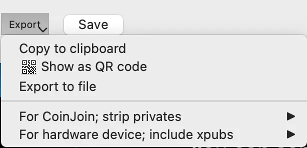

Das Speichern als QR-Code ist sehr interessant. Wenn Sie dies wählen, wird ein QR-Code angezeigt:


Sie können dann ein Foto des QR-Codes machen. Es gibt verschiedene Dinge, die Sie damit tun können, aber vorerst nehmen wir an, dass Sie ihn später wieder in die Brieftasche laden. Sie können Electrum schließen, die Brieftasche erneut laden und zum Menü "Tools" gehen:


Dadurch wird die Kamera Ihres Computers aktiviert. Zeigen Sie dann der Kamera das Foto des QR-Codes auf Ihrem Telefon, und die Transaktion wird genau so geladen, wie Sie sie verlassen haben.

Es ist nicht intuitiv, wie man gespeicherte Transaktionen lädt, also beachten Sie dies besonders. Das Laden einer Transaktion ist kein "Werkzeug", sondern die Option ist im Menü "Tools" versteckt (eine weitere Sache, die die Entwickler von Electrum beheben sollten).

Ein ähnlicher Vorgang ist mit einer als Datei gespeicherten Transaktion möglich. Versuchen Sie, mit einer der beiden Methoden in derselben Brieftasche zu üben. Ich werde es hier nicht durchgehen, aber Sie können diese Funktion verwenden, um eine Transaktion zwischen derselben Brieftasche auf verschiedenen Computern, zwischen Multisignatur-Brieftaschen und zu und von Hardware-Brieftaschen weiterzugeben. Hier sind einige Anweisungen.

Nun, zurück zur Schaltfläche "Speichern" - so speichern Sie nicht den Transaktionstext. Was dies tatsächlich bewirkt, ist, dass die Electrum-Brieftasche erkennt, dass diese Transaktion auf dem lokalen Computer als Zahlung eingereicht wurde. Wenn Sie dies versehentlich tun, sehen Sie die Transaktion mit einem kleinen Computer-Symbol. Sie können mit der rechten Maustaste darauf klicken und die Transaktion löschen - keine Sorge, Sie können Bitcoin auf diese Weise nicht löschen. Electrum vergisst dann, dass diese Transaktion jemals stattgefunden hat, und gibt die Sats zurück und zeigt die Sats an der richtigen Stelle an, wo sie tatsächlich vorhanden sind.

### Änderungsadressen

Änderungsadressen sind interessant. Um diese Erklärung zu verstehen, müssen Sie UTXOs verstehen. Wenn Sie an eine Adresse einen Betrag senden, der kleiner ist als der UTXO, wird der übrig gebliebene Bitcoin an den Miner gehen, es sei denn, eine Änderungsausgabe wird angegeben.
Du könntest eine 6,15 Bitcoin UTXO haben und 0,15 Bitcoin spenden wollen, um einige Demonstranten zu unterstützen, die von einer tyrannischen "demokratischen" Regierung irgendwo auf der Welt unterdrückt werden. Du würdest dann die 6,15 Bitcoin (mit der Funktion "Ausgeben von" in Electrum) nehmen und sie in einer Transaktion platzieren.
Du würdest die Adresse der Demonstranten im Feld "An" einfügen, vielleicht würdest du "EndTheFed & WEF" in das Feld "Beschreibung" setzen und für den Betrag würdest du 0,15 Bitcoin eingeben und auf "Bezahlen" und dann auf "Erweitert" klicken.

Auf dem Transaktionsbildschirm siehst du im Eingabefenster die 6,15 Bitcoin UTXO. Im Ausgabefenster siehst du eine Adresse, die nicht markiert ist (das ist die Adresse der Demonstranten) mit 0,15 Bitcoin daneben. Du siehst auch eine gelbe Adresse mit etwas weniger als 6,0 Bitcoin. Dies ist die automatisch vom Wallet ausgewählte Wechseladresse aus einer seiner eigenen gelben Wechseladressen. Der Zweck der Wechseladresse besteht darin, dass das Wallet Wechselmünzen darin ablegen kann, ohne die Verfügbarkeit der Empfangsadressen zu beeinträchtigen, für die du möglicherweise Pläne hast oder Rechnungen gesendet hast. Wenn sie später von Kunden verwendet werden sollen, möchtest du nicht, dass dein Wallet sie automatisch verwendet und auffüllt. Das ist unordentlich und schlecht für die Privatsphäre.

Beachte, dass sich der Betrag der Wechselausgabe automatisch anpasst, nicht der Zahlungsbetrag, wenn du die Mining-Gebühr anpasst.

### Manuelle Wechseladresse oder Zahlung an viele

Dies ist eine wirklich interessante Funktion von Electrum. Du greifst darauf wie folgt zu.

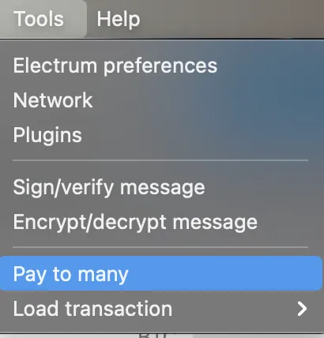

Du kannst dann mehrere Ziele für das UTXO-Guthaben angeben, das du ausgibst, wie folgt:


Füge die Adresse ein, gib ein Komma, dann ein Leerzeichen, dann den Betrag ein, dann <Enter> ein und wiederhole es. GIB DIE BETRÄGE NICHT IN DIE "BETRAG"-FENSTER EIN - Electrum füllt hier automatisch den Gesamtbetrag ein, während du die einzelnen Beträge im "An" -Fenster eingibst.

Dies ermöglicht es dir, manuell zu bestimmen, wohin das Wechselgeld geht (z. B. eine bestimmte Adresse in deinem Wallet oder ein anderes Wallet), oder du kannst gleichzeitig viele Personen bezahlen. Wenn dein Gesamtbetrag nicht hoch genug ist, um die Größe des UTXO zu erreichen, erstellt Electrum trotzdem eine zusätzliche Wechselausgabe für dich.

Die Funktion "Zahlung an viele" ermöglicht auch die Möglichkeit, eigene "PayJoins" oder "CoinJoins" zu erstellen - außerhalb des Rahmens dieses Artikels, aber ich habe hier eine Anleitung. (https://armantheparman.com/cj/)

## Wallets

Ich möchte eine "Nur Beobachten"-Wallet mit Electrum demonstrieren. Dazu muss ich zuerst "Wallet" definieren. Es gibt zwei Arten, wie "Wallet" in Bitcoin verwendet wird:

- Typ A, "Wallet" - bezieht sich auf die Software, die dir deine Adressen und Guthaben anzeigt, z. B. Electrum, Blue Wallet, Sparrow Wallet usw.

- Typ B, "Wallet" - bezieht sich auf die eindeutige Sammlung von Adressen, die mit der Kombination aus unserem Seed-Phrase/Passphrase/Ableitungspfad verbunden sind. Es gibt 8,6 Milliarden Adressen in einem Wallet (4,3 Milliarden Empfangsadressen und 4,3 Milliarden Wechseladressen). Wenn du etwas in der Seed-Phrase, Passphrase oder Ableitungspfad änderst, erhältst du ein unbenutztes Wallet mit neuen und allen eindeutigen 8,6 Milliarden leeren Adressen.

Welche Art von Wallet gemeint ist, wenn das Wort "Wallet" verwendet wird, ist im Kontext offensichtlich.

## Beobachtungs-Wallet - eine Übung

Es ist nicht ganz offensichtlich, wofür eine beobachtende Geldbörse ist, aber ich werde damit beginnen zu erklären, was es ist, wie man eine Übungsbörse erstellt, und dann werden wir später auf ihren Zweck zurückkommen, wenn ich mehr über Hardware-Geldbörsen erkläre. (Für eine ausführliche Anleitung zur Verwendung einer Hardware-Geldbörse und verschiedene spezifische Marken siehe hier.)

Wir werden eine Dummy-Standardbörse erstellen (diesmal mit einer etwas komplexeren Passphrase) und dann die entsprechende beobachtende Geldbörse. Wenn Sie möchten, können Sie die von mir erstellte genau kopieren oder Ihre eigene erstellen - diese Geldbörse soll verworfen werden; verwenden Sie sie tatsächlich nicht. Beginnen Sie damit, einen 12-Wort-Schlüssel über die Ian Coleman-Website zu generieren.

Beachten Sie die 12 zufälligen Wörter im folgenden Screenshot und dass ich eine Passphrase im Passphrase-Feld eingegeben habe:

PASSPHRASE: "Craig Wright ist ein Lügner und Betrüger und gehört ins Gefängnis. Außerdem sollte Ross Ulbricht sofort aus dem Gefängnis entlassen werden."

Die Passphrase kann bis zu 100 Zeichen lang sein und sollte idealerweise eindeutig und nicht zu kurz sein - die von mir verwendete ist nur zum Spaß - ich empfehle im Allgemeinen, Großbuchstaben und Symbole zu vermeiden, um Ihren Stress beim Ausprobieren von Kombinationen zu reduzieren, falls Sie jemals Probleme haben, sich an Ihre Passphrase zu erinnern.

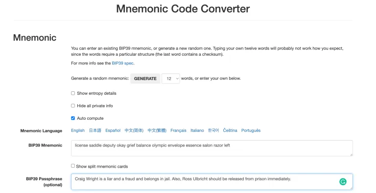

Als nächstes gehen Sie in Electrum zum Menü Datei -> Neu/Wiederherstellen. Geben Sie einen eindeutigen Namen ein, um eine neue Geldbörse zu erstellen, und klicken Sie auf "Weiter".


Die nächsten Schritte sollten Ihnen mittlerweile vertraut sein, daher werde ich sie ohne Bilder auflisten:

- Standard-Geldbörse
- Ich habe bereits einen Schlüssel
- Kopieren und fügen Sie die 12 Wörter in das Feld ein oder geben Sie sie manuell ein.
- Klicken Sie auf "Optionen" und wählen Sie BIP39 aus, und aktivieren Sie auch das Kontrollkästchen für die Passphrase ("Diesen Schlüssel mit benutzerdefinierten Wörtern erweitern")
- Geben Sie Ihre Passphrase genau so ein, wie Sie es auf der Ian Coleman-Seite getan haben
- Lassen Sie die Standardeinstellungen für das Skript und den Ableitungspfad
- Es ist nicht erforderlich, ein Passwort hinzuzufügen (sperrt die Geldbörse)

Gehen Sie nun zurück zur Ian Coleman-Website, scrollen Sie zum Abschnitt "Ableitungspfad" und klicken Sie auf die Registerkarte "BIP 84", um die gleichen Skript- und Semantikeinstellungen wie in Electrum (Native Segwit) auszuwählen.

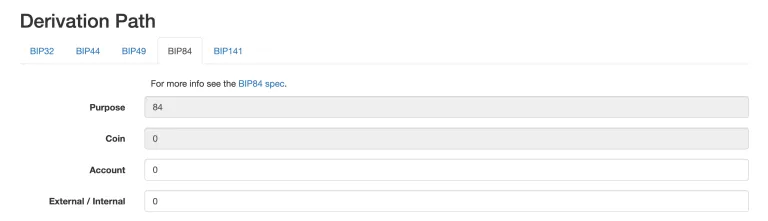

Die erweiterten privaten und öffentlichen Schlüssel befinden sich direkt darunter und ändern sich, wenn Sie Änderungen am Ableitungspfad (oder an etwas anderem weiter oben auf der Seite) vornehmen.


Sie werden auch "BIP32 erweiterte private/öffentliche" Schlüssel sehen - diese sollen vorerst ignoriert werden.

Der erweiterte private Kontoschlüssel kann verwendet werden, um Ihre Geldbörse vollständig wiederherzustellen. Der erweiterte öffentliche Kontoschlüssel kann jedoch nur eine begrenzte Version derselben Geldbörse (beobachtende Geldbörse) erstellen - Wenn Sie diesen Schlüssel in Electrum eingeben, werden immer noch alle 8,6 Milliarden Adressen generiert, die der Schlüssel oder der erweiterte private Schlüssel hätte, aber Electrum verfügt über keine privaten Schlüssel, sodass keine Ausgaben möglich sind. Lassen Sie uns dies jetzt tun, um den Punkt zu verdeutlichen:

Kopieren Sie den "erweiterten öffentlichen Kontoschlüssel" in die Zwischenablage.

Gehen Sie dann zu Electrum, lassen Sie die aktuelle Geldbörse, die wir erstellt haben, geöffnet, und gehen Sie zu Datei -> Neu/Wiederherstellen. Der Prozess zur Erstellung der Geldbörse unterscheidet sich etwas von zuvor:

- Standard-Geldbörse
- Verwenden Sie einen Master-Schlüssel
- Fügen Sie den erweiterten öffentlichen Schlüssel in das Feld ein und fahren Sie fort
- Es ist nicht erforderlich, eine Passphrase einzugeben; sie ist bereits Teil des erweiterten öffentlichen Schlüssels
- Es ist nicht erforderlich, die Skript- und Semantikeinstellungen und den Ableitungspfad einzugeben
- Es ist nicht erforderlich, ein Passwort hinzuzufügen (sperrt die Geldbörse)
  Wenn das Wallet geladen wird, sollten Sie feststellen, dass genau die gleichen Adressen geladen werden wie zuvor, als der Seed eingegeben wurde. Sie sollten auch oben in der Titelleiste sehen, dass dort "watching wallet" steht. Dieses Wallet kann Ihnen Ihre Adressen und Guthaben anzeigen (indem es die Guthaben über einen Knoten überprüft), aber Sie können keine Transaktionen UNTERSCHREIBEN (weil das watching wallet keine privaten Schlüssel hat).
  Was ist dann der Sinn davon?

Ein Grund, und nicht der Hauptgrund, ist, dass Sie Ihr Wallet und den Kontostand potenziell auf einem Computer beobachten können, ohne Ihre privaten Schlüssel Malware auf dem Computer auszusetzen.

Ein weiterer Grund ist, dass es ERFORDERLICH ist, um Zahlungen zu leisten, wenn Sie sich dafür entscheiden, Ihre privaten Schlüssel vom Computer fernzuhalten. Ich erkläre es Ihnen:

> Hardware Wallets (HWW) wurden entwickelt, damit ein Gerät Ihre privaten Schlüssel sicher aufbewahren kann (mit einer PIN gesperrt), die Schlüssel niemals einem Computer aussetzt (auch nicht, wenn es über ein Kabel mit einem Computer verbunden ist) und selbst keine Verbindung zum Internet herstellen kann. Ein solches Gerät kann keine Transaktionen eigenständig durchführen, da alle Bitcoin-Transaktionen damit beginnen, auf eine UTXO(s) in der Blockchain zu verweisen (die sich auf einem Knoten befindet). Ein Wallet muss angeben, in welcher Transaktions-ID sich die UTXO befindet und welcher Ausgang der Transaktion ausgegeben werden soll. Erst nachdem der Eingang spezifiziert wurde, kann überhaupt eine neue Transaktion erstellt und unterschrieben werden. Hardware Wallets können keine Transaktionen erstellen, da sie keinen Zugriff auf UTXOs haben - sie sind mit nichts verbunden! In der Regel wird ein erweiterter öffentlicher Schlüssel aus dem HWW extrahiert und die Adressen werden dann auf einem Computer angezeigt - viele Menschen sind mit der Ledger-Software oder der Trezor Suite vertraut, die Adressen und Kontostände auf ihrem Computer anzeigen - dies ist ein watching wallet. Diese Programme können Transaktionen erstellen, aber sie können sie nicht unterschreiben. Sie können nur Transaktionen von HWWs unterschreiben lassen, die mit ihnen verbunden sind. Das HWW nimmt die neu generierte Transaktion vom watching wallet, unterschreibt sie und sendet sie dann zur Übertragung an einen Knoten zurück an den Computer. Das HWW kann nicht eigenständig übertragen, das erledigt das zugehörige watching wallet. Auf diese Weise arbeiten die beiden Wallets (das öffentliche Schlüssel-Wallet auf dem Computer und das private Schlüssel-Wallet im HWW) zusammen, um Transaktionen zu generieren, zu unterschreiben und zu übertragen, während sichergestellt wird, dass die privaten Schlüssel isoliert bleiben und von einem mit dem Internet verbundenen Gerät ferngehalten werden.

## Teilweise signierte Bitcoin-Transaktionen (PSBTs)

Es ist möglich, eine Transaktion zu erstellen und in einer Datei zu speichern, sie später neu zu laden, zu unterschreiben, erneut zu speichern und schließlich zu übertragen - ich sage nicht, dass dies jemand tun müsste; es ist nur etwas, das möglich ist.

Nehmen wir nun ein 3-von-5-Multisignatur-Wallet - 5 private Schlüssel erzeugen ein Wallet und 3 werden benötigt, um eine Transaktion vollständig zu unterschreiben (Weitere Informationen zu Multisignatur-Wallet-Schlüsseln finden Sie hier). Es ist möglich, 5 verschiedene Computer zu haben, von denen jeder einen der fünf privaten Schlüssel besitzt.

Computer eins könnte eine Transaktion generieren und unterschreiben. Anschließend könnte er sie in einer Datei speichern und per E-Mail an Computer zwei senden. Computer zwei kann sie dann unterschreiben und die Datei möglicherweise in einen QR-Code umwandeln und den QR-Code über einen Zoom-Anruf an Computer drei auf der anderen Seite der Welt übertragen. Computer drei kann den QR-Code erfassen, die Transaktion in Electrum laden und die Transaktion unterschreiben. Nach den ersten beiden Signaturen handelte es sich um eine PSBT (teilweise signierte Bitcoin-Transaktion). Nach der dritten Signatur wurde die Transaktion vollständig signiert und gültig und bereit zur Übertragung.
Um mehr über PSBTS zu erfahren, siehe diese Anleitung. (https://armantheparman.com/psbt/)

## Verwendung von Hardware-Wallets mit Electrum

Ich habe eine Anleitung zur Verwendung von Hardware-Wallets im Allgemeinen, die ich für wichtig halte, dass sie von Personen, die neu bei HWWs sind, gelesen wird. (https://armantheparman.com/using-hwws/)

Es gibt auch Anleitungen zu verschiedenen Marken von HWWs, die mit der Sparrow Bitcoin Wallet verbunden sind, die hier zu finden sind. (https://armantheparman.com/hwws/)

Dies wird meine erste Anleitung sein, die zeigt, wie man ein Hardware-Wallet mit Electrum verwendet - ich werde das ColdCard Hardware-Wallet zur Demonstration verwenden. Dies soll keine detaillierte Anleitung zum ColdCard speziell sein, diese Anleitung ist hier zu finden. Ich zeige nur spezifische Punkte zu Electrum. (https://armantheparman.com/cc/)

### Verbindung über die micro SD-Karte (air-gapped)

Bevor Sie Ihr echtes Wallet über das ColdCard verbinden, hoffe ich, dass Sie die früheren Schritte zum Laden eines Dummy-Wallets in Electrum und zur Einrichtung der Netzwerkparameter durchgeführt haben.

Dann legen Sie die SD-Karte in das ColdCard ein. Ich gehe davon aus, dass Sie Ihren Seed bereits erstellt haben. Wenn Sie auf das Wallet mit einem Passwort zugreifen, geben Sie es jetzt ein. Scrollen Sie nach unten und wählen Sie das Menü Erweitert/Tools –> Wallet exportieren –> Electrum Wallet.

Sie können die Nachricht lesen, indem Sie nach unten scrollen. Es bietet Ihnen immer die Möglichkeit, "1" auszuwählen, um eine nicht-null Kontonummer (Teil des Ableitungspfads) einzugeben, aber wenn Sie meinem Rat gefolgt sind, haben Sie nicht mit den Standard-Ableitungspfaden herumgespielt, sodass Sie keine nicht-null Kontonummer möchten; drücken Sie einfach das Häkchen, um fortzufahren.

Wählen Sie dann die Skriptsemantik aus. Die meisten Leute werden "Native Segwit" auswählen.

Es wird "Electrum Wallet-Datei geschrieben" angezeigt und der Dateiname wird angezeigt. Machen Sie sich eine geistige Notiz davon.

Nehmen Sie dann die micro SD-Karte heraus und stecken Sie sie in den Computer mit Electrum.

Einige Betriebssysteme öffnen automatisch den Datei-Explorer, wenn Sie die microSD-Karte einlegen. Viele Leute sehen die neue Wallet-Datei und doppelklicken darauf und fragen sich, warum es nicht funktioniert. Es ist kein gutes Design. Sie müssen den Datei-Explorer tatsächlich ignorieren (schließen) und die Wallet-Datei mit Electrum öffnen:

Öffnen Sie Electrum. Wenn es bereits mit einem anderen Wallet geöffnet ist, wählen Sie Datei –> Neu. Wir suchen nach diesem Fenster:


Hier ist der Trick, er ist nicht intuitiv. Klicken Sie auf "Auswählen". Navigieren Sie dann im Dateisystem auf der microSD-Karte und finden Sie die Wallet-Datei und öffnen Sie sie.

Jetzt haben Sie das entsprechende Beobachtungs-Wallet Ihres Hardware-Wallets geöffnet. Schön.

### Verbindung über das USB-Kabel.

Dieser Weg sollte einfacher sein, aber für Linux-Computer ist es viel schwieriger. Etwas namens "Udev-Regeln" muss aktualisiert werden. Hier ist wie (detaillierte Anleitung https://armantheparman.com/gpg-articles/ ), und kurz:

Es ist eine gute Idee, sicherzustellen, dass das System auf dem neuesten Stand ist. Dann:

```
sudo apt-get install libusb-1.0-0-dev libudev-dev
```

dann...

```
python3 -m pip install ckcc-protocol
```

Wenn Sie einen Fehler erhalten, stellen Sie sicher, dass pip installiert ist. Sie können mit (pip –version) überprüfen und es mit (sudo apt install pythron3-pip) installieren.

Erstellen oder ändern Sie die Datei /etc/udev/rules.d/

So:

```
sudo nano /etc/udev/rules.d
```

Ein Texteditor wird geöffnet. Kopieren Sie den Text von hier und fügen Sie ihn in die Datei rules.d ein, speichern Sie und beenden Sie den Editor.


Führen Sie dann nacheinander diese Befehle aus:

```
sudo groupadd plugdev

sudo usermod -aG plugdev $(whoami)

sudo udevadm control –reload-rules && sudo udevadm trigger
```

Wenn Sie die Meldung "Gruppe plugdev" bereits vorhanden erhalten, ist das in Ordnung, fahren Sie fort. Nach dem zweiten Befehl erhalten Sie keine Rückmeldung, fahren Sie einfach mit dem dritten Befehl fort.

Möglicherweise müssen Sie den ColdCard vom Computer trennen und dann erneut anschließen.

Wenn Sie nach all dem immer noch keine Verbindung zur ColdCard herstellen können, empfehle ich Ihnen, die Firmware zu aktualisieren (Anleitung folgt bald, aber vorerst finden Sie Anweisungen auf der Website des Herstellers).

Erstellen Sie als Nächstes eine neue Brieftasche:

- Standard-Brieftasche
- Verwenden Sie ein Hardware-Gerät
- Es wird Ihre ColdCard scannen und erkennen. Fahren Sie fort.
- Wählen Sie die Skriptsemantik und den Ableitungspfad aus
- Entscheiden Sie, ob die Brieftaschendatei verschlüsselt werden soll (empfohlen)

### Transaktionen mit der ColdCard

Mit dem angeschlossenen Kabel sind Transaktionen einfach. Das Signieren von Transaktionen erfolgt nahtlos.

Wenn Sie das Gerät auf eine luftdichte Weise verwenden, müssen Sie die gespeicherte Transaktion manuell über die microSD-Karte zwischen den Geräten übertragen. Es gibt einige Tricks.

Nachdem Sie eine Transaktion erstellt und abgeschlossen haben, müssen Sie auf die Export-Schaltfläche in der unteren linken Ecke klicken. Sie sehen "In Datei speichern", was paradoxerweise nicht das ist, was wir wollen. Tatsächlich müssen Sie zuerst zur letzten Menüoption gehen, die "Für Hardware-Brieftaschen" sagt, und dann innerhalb dieser Auswahl die andere "In Datei speichern" finden und auswählen. Speichern Sie dann die Datei auf der microSD-Karte, nehmen Sie die Karte heraus und legen Sie sie in die ColdCard ein. Denken Sie daran, dass Sie möglicherweise eine Passphrase anwenden müssen, um die richtige Brieftasche auszuwählen. Der Bildschirm zeigt "Bereit zum Signieren" an. Klicken Sie auf das Häkchen, überprüfen Sie die Transaktion und bestätigen Sie mit dem Häkchen. Sobald dies erledigt ist, nehmen Sie die Karte heraus und stecken Sie sie wieder in den Computer.

Dann müssen wir die Transaktion mit Electrum öffnen. Die Funktion ist im Menü unter "Werkzeuge" versteckt -> "Transaktion laden". Navigieren Sie durch das Dateisystem und finden Sie die Datei. Es werden jedes Mal drei Dateien erstellt, wenn Sie signieren. Die ursprünglich gespeicherte Datei, die von der Watching Wallet erstellt wurde, und zwei Dateien, die von der ColdCard erstellt wurden (ich weiß nicht, warum sie das tut). Eine wird "signiert" und eine wird "endgültig" sagen. Es ist nicht intuitiv, aber die "signierte" ist nicht nützlich, wir müssen die "endgültige" Transaktion öffnen.

Sobald Sie das geladen haben, können Sie auf "Senden" klicken und die Zahlung wird durchgeführt.

## Aktualisierung von Electrum und dem versteckten ".electrum"-Verzeichnis

Electrum befindet sich auf Ihrem Computer an zwei Stellen. Es gibt die Anwendung selbst und es gibt einen versteckten Konfigurationsordner. Dieser Ordner befindet sich an verschiedenen Orten, abhängig von Ihrem Betriebssystem:

Windows:

> C:/Benutzer/Dein_Benutzername/AppData/Roaming/Electrum

Mac:

> /Benutzer/Dein_Benutzername/.electrum

Linux:

> /home/Dein_Benutzername/.electrum

Beachten Sie das "." vor "electrum" in Linux und Mac - das zeigt an, dass das Verzeichnis versteckt ist. Beachten Sie auch, dass dieses Verzeichnis nur (automatisch) erstellt wird, wenn Sie Electrum zum ersten Mal ausführen. Das Verzeichnis enthält die Electrum-Konfigurationsdatei und auch das Verzeichnis, in dem alle gespeicherten Brieftaschen abgelegt sind.

'Wenn Sie das Electrum-Programm von Ihrem Computer löschen, bleibt das versteckte Verzeichnis erhalten, es sei denn, Sie löschen es aktiv.

Um Electrum zu aktualisieren, gehen Sie durch das gleiche Verfahren, wie ich es am Anfang beschrieben habe, um es herunterzuladen und zu überprüfen. Sie haben dann zwei Kopien des Programms auf Ihrem Computer und können entweder eines ausführen - jedes Programm greift auf denselben versteckten Electrum-Ordner für seine Konfiguration und den Zugriff auf das Wallet zu. Alle gespeicherten Dinge wie die Basiseinheit, der Standardknoten zum Verbinden, andere Einstellungen und der Zugriff auf Wallets bleiben erhalten, da all dies in diesem Ordner gespeichert ist.

### Verschieben von Electrum und Wallets auf einen anderen Computer

Dazu können Sie die Programmdateien auf einen USB-Stick kopieren und auch das .electrum-Verzeichnis kopieren. Kopieren oder verschieben Sie sie dann auf den neuen Computer. Sie müssen das Programm nicht erneut überprüfen. Stellen Sie sicher, dass Sie das .electrum-Verzeichnis an den Standardort kopieren (denken Sie daran, es VOR dem ersten Ausführen von Electrum auf diesem Computer zu kopieren, da sonst ein leeres Standard-.electrum-Verzeichnis erstellt wird und Sie möglicherweise verwirrt werden).

## Labels

Wie ich bereits erklärt habe, gibt es auf dem Adress-Tab eine Spalte für Labels. Sie können dort doppelklicken und Notizen für sich selbst eingeben (es ist nur auf Ihrem Computer, nicht öffentlich und nicht in der Blockchain).


Wenn Sie Ihr Electrum-Wallet auf einen anderen Computer verschieben, möchten Sie möglicherweise nicht alle diese Notizen verlieren. Sie können sie über das Menü "Wallet" -> "Labels" -> "Exportieren" in eine Datei sichern und dann auf dem neuen Computer über "Wallet" -> "Labels" -> "Importieren" verwenden.

## Tipps:

Wenn Sie diese Ressource nützlich finden und das, was ich für Bitcoin tue, unterstützen möchten, können Sie hier einige Sats spenden:
