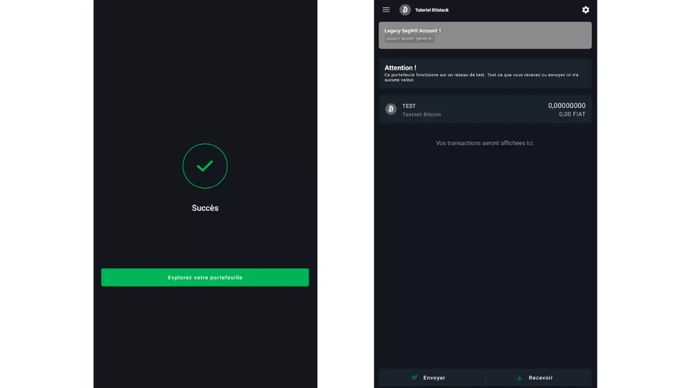
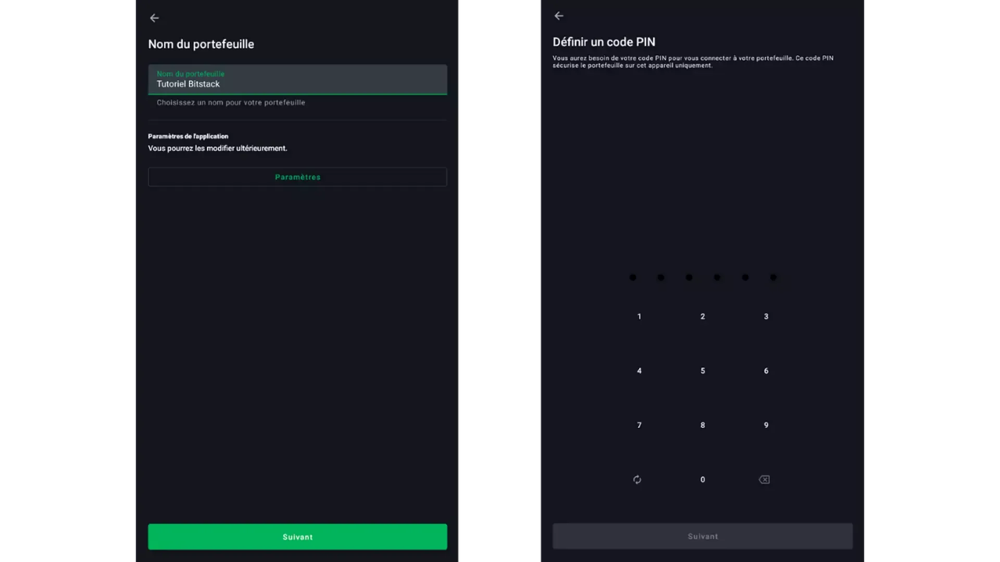
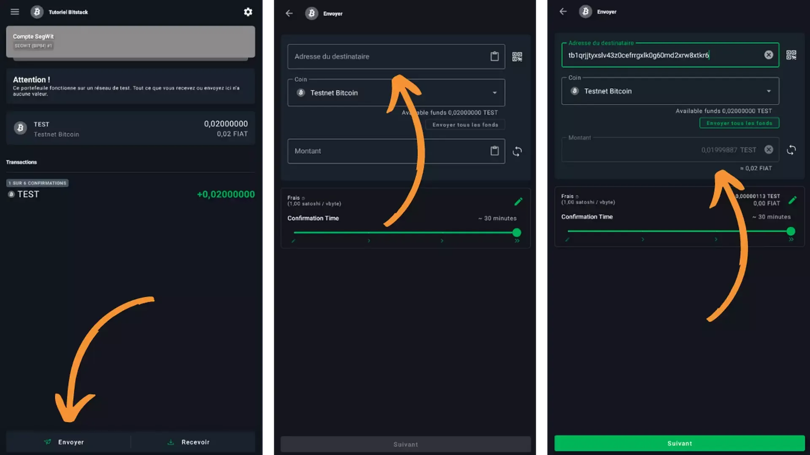

Mobiles Warm Wallet - Anfänger - Kostenlos - Zur Sicherung von 0 bis 1.000 €

Um Beträge unter 1.000 € abzusichern, ist ein kostenloses Warm Wallet (mit Internetverbindung) perfekt für den Einstieg. Die Einrichtung ist einfach und die Benutzeroberfläche ist für Anfänger konzipiert.

Wenn du die Website besuchen möchtest, klicke hier (https://blockstream.com/green/)!

## Video-Tutorial

## Schriftliches Tutorial

> Dieses Handbuch wurde von Bitstack erstellt und gehört ihnen. Bitstack ist eine Bitcoin-Neo-Bank mit Sitz in Paris, die Bitcoin-DCA ermöglicht. Geschrieben von Loic Morel am 15.02.2023. Dies gehört ihnen. https://www.bitstack-app.com/blog/installer-portefeuille-bitcoin-green-wallet

Wie installiere ich meine erste Bitcoin Wallet? Green Wallet Tutorial

Wenn Sie die zahlreichen Vorteile des Bitcoin-Systems nutzen möchten, einschließlich der Unzensierbarkeit und Unantastbarkeit Ihrer Gelder, müssen Sie Ihre Schlüssel, die Zugriff auf Ihre Bitcoins gewähren, unbedingt selbst aufbewahren.

In diesem Tutorial erkläre ich Ihnen, wie Sie Ihre erste Wallet mit Green Wallet einrichten können. Diese Software ist besonders für Anfänger geeignet. Sie ist sehr einfach zu bedienen, auch wenn Sie keine fortgeschrittenen Kenntnisse über Bitcoin haben.

Green Wallet ist auf allen Arten von Geräten verfügbar. In diesem Tutorial werden wir sehen, wie es auf einem Mobilgerät verwendet wird, aber Sie können es auch auf einem Computer herunterladen.

Der erste Schritt besteht natürlich darin, die Green Wallet Software oder App herunterzuladen. Wenn Sie ein Mobilgerät verwenden, können Sie sie einfach aus Ihrem Store herunterladen. Stellen Sie sicher, dass Sie sich auf der Seite des offiziellen App-Downloads befinden. Hier sind die Seiten je nach Ihrem System:

> - Google Play Store
>
> - Apple App Store

Wenn Sie die Software auf einem Computer herunterladen, empfehle ich Ihnen dringend, die Authentizität und Integrität der Binärdatei zu überprüfen, bevor Sie sie auf Ihrem Gerät installieren. Ich werde Ihnen in einem zukünftigen Tutorial erklären, wie Sie diese Operation durchführen können.

## Auswahl der App-Einstellungen

Beim Start der App gelangen Sie zum Startbildschirm. Im Moment haben Sie noch keine Wallets. Später können Sie hier Ihre erstellten Wallets finden.

Der erste Schritt, bevor Sie Ihre Wallet erstellen, besteht darin, die App-Einstellungen zu öffnen und diejenigen auszuwählen, die am besten zu Ihnen passen.

- « Enhanced Privacy » ermöglicht es Ihnen, die Möglichkeit zum Erstellen von Bildschirmfotos in der Anwendung zu deaktivieren. Diese Option verbirgt auch Vorschauen und sichert automatisch die Anwendung, wenn Sie Ihr Telefon sperren. Sie ist nur auf Android verfügbar.
- Sie können dann wählen, Ihren Datenverkehr über Tor zu leiten, um alle Ihre Verbindungen zu verschlüsseln. Dies verlangsamt den Betrieb Ihrer Anwendung leicht, aber ich empfehle Ihnen, es zu aktivieren, um Ihre Privatsphäre zu schützen.

- Die Option "Testnet" ermöglicht es Ihnen, Brieftaschen im Testnetzwerk zu erstellen. Dies ist ein Netzwerk, das genau wie das Bitcoin-System funktioniert, mit der Ausnahme, dass die dort gehandelten Bitcoins keinen Wert haben. Dieses separate Testnetzwerk wird von Benutzern oder Entwicklern bevorzugt, die Anwendungen testen möchten, ohne finanzielle Risiken einzugehen. Wenn Sie Green Wallet im echten Bitcoin-System verwenden möchten, können Sie diese Option deaktiviert lassen.

- Die Option "Green unterstützen" ermöglicht es Ihnen, vertrauliche Informationen an Blockstream weiterzugeben, damit sie ihre Anwendung verbessern können.

- Die Option "Persönlicher Electrum-Server" ermöglicht es Ihnen, Ihren eigenen Bitcoin-Knotenpunkt remote zu verbinden, um Netzwerkinformationen zu erhalten und Ihre Transaktionen zu verbreiten.

- Die Option "SPV-Verifizierung" ermöglicht es Ihnen, bestimmte Informationen der Blockchain herunterzuladen und selbst zu überprüfen. Dadurch wird das Vertrauen in den Blockstream-Knotenpunkt verringert. Beachten Sie, dass diese Option Ihnen nicht alle Garantien eines echten Bitcoin-Knotenpunkts bietet, aber wenn Sie keinen haben, kann dies eine gute Option sein, um zu aktivieren.

Nachdem Sie Ihre Einstellungen ausgewählt haben, können Sie auf die Schaltfläche "Speichern" klicken und dann Ihre Anwendung neu starten.

## Erstellen einer Bitcoin-Brieftasche

Der nächste Schritt besteht darin, Ihre Bitcoin-Brieftasche zu erstellen. Klicken Sie dazu auf:

> - Brieftasche hinzufügen;
> - Neue Brieftasche;
> - Bitcoin.

Die Option "Brieftasche wiederherstellen" ermöglicht es Ihnen, den Zugriff auf eine bereits vorhandene Brieftasche mithilfe ihrer mnemonischen Phrase wiederherzustellen. Die Option "Nur-Ansicht-Brieftasche" ermöglicht es Ihnen, einen erweiterten öffentlichen Schlüssel (xpub) zu importieren, um die Bewegungen einer Brieftasche zu sehen, ohne ihre Mittel ausgeben zu können.

> "Die Nur-Ansicht-Brieftasche ist besonders nützlich, wenn Sie eine Hardware-Brieftasche haben. Sie können den xpub auf Ihr Telefon importieren, um Empfangsadressen zu erstellen und das Guthaben der auf der Hardware-Brieftasche gehosteten Brieftasche zu verfolgen. "'
> Die Netzwerkeinstellungen ermöglichen es Ihnen, Ihre Brieftasche mit verschiedenen Systemen zu verbinden. Das "Liquid"-Netzwerk ist eine Sidechain von Bitcoin. Das "Testnet"-Netzwerk ist eine Kopie des Bitcoin-Netzwerks, jedoch mit Bitcoins ohne Wert. Schließlich ist das "Testnet Liquid"-Netzwerk das Äquivalent des Testnet für die Liquid Sidechain. In diesem Tutorial möchten wir einfach nur eine Bitcoin-Brieftasche erstellen, daher wählen wir das "Bitcoin"-Netzwerk aus.

Dann werden Sie gefragt, welche Art von Brieftasche Sie erstellen möchten. Am einfachsten ist es, eine "Single Sig"-Brieftasche zu erstellen. In diesem Fall wird jede uns gehörende UTXO (Bitcoin-Stück) nur durch ein einziges Schlüsselpaar gesperrt.

Wählen Sie "Einzelne Signatur" aus.

Sie können dann wählen, ob Sie eine 12-Wort- oder 24-Wort-Mnemonic-Phrase haben möchten. Diese Phrase ermöglicht es Ihnen, den Zugriff auf Ihre Brieftasche von jeder kompatiblen Software aus wiederherzustellen, falls Sie Ihr Telefon verlieren, es gestohlen wird oder kaputt geht.

Eine 24-Wort-Phrase ist sicherer gegen Brute-Force-Angriffe als eine 12-Wort-Phrase. Dennoch ist eine 12-Wort-Phrase derzeit ausreichend sicher. Konkret bedeutet dies, dass Sie mit einer 12-Wort-Phrase knapp über dem vom NIST empfohlenen Mindestlimit liegen. Das bedeutet, dass Ihre Phrase heute sicher ist, aber möglicherweise in Zukunft aufgrund der Entwicklung der Informatik nicht mehr sicher sein wird (es sei denn, Sie verwenden zusätzlich eine BIP39-Passphrase). Standardmäßig empfehle ich Ihnen, eine 24-Wort-Phrase zu wählen, aber es liegt an Ihnen, Ihre eigene Wahl zu treffen.

Die Software wird Ihnen dann Ihre Wiederherstellungsphrase zur Verfügung stellen. Sie müssen sie ordnungsgemäß sichern, indem Sie sie auf einem geeigneten physischen Medium notieren. Es wird dringend davon abgeraten, diese Phrase auf einem beliebigen digitalen Medium, auch verschlüsselt, aufzubewahren. Sie sollten sie auf Papier oder Metall notieren, abhängig vom Wert, der gespeichert ist.

Diese Phrase ist von entscheidender Bedeutung, da sie uneingeschränkten Zugriff auf die Schlüssel Ihrer Brieftasche ermöglicht. Wenn Sie sie verlieren, können Sie nicht mehr auf Ihre Bitcoins zugreifen, wenn Ihr Telefon nicht mehr funktioniert. Wenn diese Mnemonic-Phrase gestohlen wird, kann ein Angreifer unwiderruflich alle Ihre Gelder stehlen.

Die Wörter dieser Phrase müssen unbedingt zusammen notiert werden. Teilen Sie Ihre Phrase nicht auf! Außerdem ist es auch wichtig, jedes Wort in der festgelegten Reihenfolge mit seiner Nummer aufzuschreiben. Eine durcheinandergebrachte Phrase ist nutzlos.

Um mehr über Methoden zur Sicherung der Wiederherstellungsphrase zu erfahren, empfehle ich Ihnen dringend, meinen Artikel zu diesem Thema zu lesen.

Green Wallet bittet Sie dann, bestimmte Wörter Ihrer Phrase zu bestätigen, um sicherzustellen, dass Sie sie korrekt notiert haben.

Sie können dann einen Namen für Ihre Brieftasche wählen, um sie von anderen zu unterscheiden, falls Sie später mehrere erstellen. Zu diesem Zeitpunkt spielt der Name keine große Rolle, da wir diese Brieftasche löschen werden, um die Gültigkeit des mnemonischen Satzes im nächsten Schritt zu überprüfen.

Sie werden auch aufgefordert, eine PIN einzurichten. Diese dient dazu, den Zugriff auf Ihre Brieftasche zu sperren. Es ist ratsam, ein komplexes und zufälliges Passwort festzulegen, insbesondere zum Schutz Ihrer Brieftasche im Falle eines Diebstahls Ihres Telefons.

Diese PIN hat nichts mit der Bitcoin-Brieftasche selbst zu tun. Tatsächlich können Sie nur mit dem Wiederherstellungssatz auf alle Ihre Bitcoins zugreifen. Die PIN dient lediglich dazu, den Zugriff auf Ihre Brieftasche auf Ihrem Telefon zu sperren. Die Sicherung des Satzes ist daher viel wichtiger als die Sicherung dieser PIN.

Sie können später eine biometrische Sperrfunktion hinzufügen, um die Eingabe der PIN bei jeder Verwendung zu vermeiden. Im Allgemeinen ist die Biometrie jedoch viel weniger sicher als die PIN selbst. Daher rate ich Ihnen standardmäßig von der Verwendung dieser Entsperrungsoption ab.

Sie müssen die gewählte PIN ein zweites Mal in der Green-App eingeben, um sie zu bestätigen.

Herzlichen Glückwunsch! Sie haben die Erstellung Ihrer Bitcoin-Brieftasche abgeschlossen.

Wenn Sie Ihrem Bitcoin-Wallet eine BIP39-Passphrase hinzufügen möchten, müssen Sie auf die drei Punkte oben rechts auf dem Bildschirm klicken, wenn Sie Ihre PIN eingeben, um das Wallet zu entsperren. Achtung, ich rate Ihnen dringend davon ab, eine Passphrase zu verwenden, wenn Sie die zugrunde liegenden Ableitungsmechanismen nicht verstehen. Sie könnten den Zugriff auf Ihre Bitcoins verlieren.

## Simulation der Wiederherstellung Ihrer Bitcoin-Brieftasche

Bevor Sie Bitcoins auf Ihre neue Brieftasche senden, ist es wichtig, eine Wiederherstellungstest durchzuführen, um sicherzustellen, dass Ihre Sicherung des mnemonischen Satzes ordnungsgemäß funktioniert. Konkret werden wir die Brieftasche löschen, solange sie noch leer ist, und versuchen, sie nur mit Hilfe des Wiederherstellungssatzes wiederherzustellen, als ob wir den Zugriff auf unser Telefon verloren hätten.

Neben der Überprüfung der Gültigkeit des Satzes ermöglicht Ihnen diese Übung auch das Üben der Wiederherstellung einer Bitcoin-Brieftasche. So wissen Sie genau, welche Schritte erforderlich sind, um im Notfall wieder Zugriff auf Ihre Gelder zu erhalten.

Um dies zu tun, müssen Sie vor dem Löschen Ihrer Brieftasche eine Referenzinformation abrufen, mit der Sie sie später erkennen können. Sie kopieren also die letzten 8 Zeichen der ersten Adresse, die Ihnen angeboten wird.
Um auf diese Informationen zuzugreifen, klicken Sie auf die Schaltfläche "Empfangen". Die Brieftasche zeigt Ihnen eine Adresse an. Notieren Sie sich die letzten 8 Zeichen auf einem anderen Stück Papier. Dies entspricht der Prüfsumme der Adresse.
Zum Beispiel wären die zu notierenden 8 Zeichen in meiner Brieftasche: JTbP4482.

Sobald Sie diese Informationen notiert haben, können Sie Ihre Brieftasche löschen. Klicken Sie auf dem Brieftaschen-Startbildschirm auf das Einstellungssymbol und dann auf "Abmelden".

> "Ich möchte noch einmal betonen, dass dieser Vorgang mit einer leeren Brieftasche durchgeführt werden muss, bevor Sie Bitcoins darauf überweisen. Andernfalls besteht die Gefahr, dass Sie sie verlieren."

Sie werden dann zum Bildschirm zur Entsperrung Ihrer Brieftasche weitergeleitet. Klicken Sie oben rechts auf die drei Punkte und dann auf "Brieftasche löschen" und bestätigen Sie dies.

Sie befinden sich nun auf dem Startbildschirm der Green Wallet-Anwendung und es ist keine Brieftasche mehr verfügbar. Sie befinden sich also in der gleichen Situation, als hätten Sie Ihr Telefon verloren oder beschädigt und versuchen, Ihre Brieftasche nur anhand der mnemonischen Phrase wiederherzustellen.

Klicken Sie nun auf "Brieftasche hinzufügen", dann auf "Brieftasche wiederherstellen" und schließlich auf "Bitcoin".

Die Software fragt uns dann, ob wir die Wiederherstellung über einen QR-Code oder über eine mnemonische Phrase durchführen möchten. In unserem Fall handelt es sich um eine Phrase.

Anschließend werden wir aufgefordert, die Wiederherstellungsphrase einzugeben. Dies ist die Phrase, die wir beim Erstellen der Brieftasche notiert hatten. Wenn Sie eine 24-Wort-Phrase verwenden, vergessen Sie nicht, auf das kleine Kästchen "24" zu klicken.

Wenn alle Wörter eingegeben sind und die Software einen Fehler anzeigt, bedeutet dies, dass die Prüfsumme (Checksum) Ihrer Phrase nicht korrekt ist. In diesem Fall ist die Papier-Backup Ihrer mnemonischen Phrase ungültig. Sie müssen daher dieses Tutorial von Anfang an wiederholen und darauf achten, die Phrase korrekt aufzuschreiben, wenn sie Ihnen gegeben wird.

Andernfalls können Sie auf "Weiter" klicken.

Die Software zeigt Ihnen "Brieftasche nicht gefunden" an. Dies ist völlig normal, da wir bisher noch keine Bitcoins darauf überwiesen haben. Daher kann keine Transaktion in der Blockchain mit dieser Brieftasche verknüpft werden.

Klicken Sie unten auf dem Bildschirm auf "Manuelle Wiederherstellung" und dann auf "Einzelne Signatur".

Schließlich werden Sie erneut aufgefordert, dieser Brieftasche einen Namen zu geben und eine PIN zuzuweisen. Sie können ihr denselben Namen und dieselbe PIN wie der ursprünglichen Brieftasche geben.
Zur Erinnerung, diese PIN dient nur dazu, die Brieftasche in dieser Anwendung und auf diesem spezifischen Telefon zu entsperren. Im Gegensatz zum Wiederherstellungssatz ermöglicht er nicht die Wiederherstellung Ihrer Brieftasche in einer anderen Software oder Hardware.

Nachdem die PIN bestätigt wurde, gelangen Sie erneut zur Startseite Ihrer Brieftasche. Es ist Zeit zu überprüfen, ob Ihr Wiederherstellungssatz ordnungsgemäß funktioniert, indem Sie die erste abgeleitete Adresse überprüfen. Klicken Sie erneut auf "Empfangen", um zur ersten Adresse zu gelangen.

Wenn die letzten 8 Zeichen genau mit denen übereinstimmen, die Sie als Referenz auf Ihrem Papier notiert haben, bevor Sie die Brieftasche gelöscht haben, dann ist Ihr Satz gültig. In meinem Fall kann man sehen, dass die Prüfsumme meiner ersten Adresse genau dem zuvor notierten Wert entspricht: JTbP4482.

Ich weiß, dass diese Überprüfungsmethode mühsam ist, aber sie ist absolut notwendig, um die Sicherheit Ihrer Bitcoin-Brieftasche zu gewährleisten. Ich empfehle Ihnen dringend, diese Gewohnheit zu entwickeln, wenn Sie eine Brieftasche erstellen, egal ob auf einer Software oder Hardware.

Mit Green Wallet habe ich die erste Adresse für diesen Prozess verwendet. Sie können jedoch auch eine erweiterte öffentliche Schlüssel (xpub/zpub) oder den Fingerabdruck des Haupt-Privatschlüssels (Master-Fingerabdruck) als Referenzinformation verwenden.

## Verwendung der Bitcoin Green Wallet

Sobald Ihre Brieftasche eingerichtet und überprüft wurde, können Sie mit der Verwendung beginnen.

Um gut zu starten, empfehle ich Ihnen, die Einstellungen Ihrer Brieftasche anzupassen. Klicken Sie dazu auf das Einstellungssymbol oben rechts auf dem Bildschirm.

- Die Option "Angezeigte Einheit" ermöglicht es Ihnen, die verwendete Einheit in Ihrer Brieftasche anzupassen. Wenn Sie nur wenig Geld haben, kann es sinnvoll sein, Ihre Brieftasche in Satoshis anstelle von Bitcoins anzuzeigen. Ein Satoshi (sat) entspricht einem Hundertmillionstel eines Bitcoins: 1 BTC = 100.000.000 Sats.

- Die Option "Standardgebührbetrag" ermöglicht es Ihnen, die Standardgebühren für Ihre Transaktionen anzupassen. Je höher die Gebühren pro vByte (virtuelles Byte) sind, desto schneller werden Ihre Transaktionen bestätigt. Sie können diesen Gebührensatz später für jede Transaktion basierend auf der Netzwerküberlastung ändern.

- Die Option "Biometrische Verbindung" ermöglicht es Ihnen, Ihre Brieftasche mit Ihrem Fingerabdruck anstelle der PIN zu entsperren. Im Allgemeinen rate ich Ihnen davon ab, diese Option zu aktivieren. Biometrie ist viel weniger sicher als der PIN-Code.

Standardmäßig weist Ihnen Green Wallet ein BIP49-Konto "Nested SegWit" mit P2SH-Adressen (Pay to Script Hash) zu. Vor einigen Jahren war die Verwendung dieses Kontotyps sinnvoll, da noch nicht jeder native SegWit-Adressen unterstützte. Heutzutage unterstützt die große Mehrheit der mit Bitcoin verbundenen Dienste SegWit, daher gibt es keinen Grund mehr, ein "Nested SegWit" Konto zu verwenden.

Wir werden dann ein neues BIP84-Konto "Native SegWit" erstellen, um von all seinen Vorteilen zu profitieren und auch P2WPKH-Adressen (Pay to Witness Public Key Hash) zu haben. Klicken Sie dazu auf Ihr "Legacy SegWit-Konto", dann auf "Neues Konto hinzufügen" und schließlich auf "SegWit-Konto". Sie können diesem Konto einen Namen geben, wenn Sie möchten.

Wenn Sie später neue Konten in dieser Brieftasche erstellen müssen, empfehle ich Ihnen, standardmäßig SegWit V0 BIP84-Konten oder SegWit V1 BIP86-Konten (wenn sie verfügbar sind) zu wählen.

Auf der Startseite Ihrer Brieftasche können Sie Ihre verschiedenen Konten sehen, einschließlich Ihres neuen SegWit-Kontos.

Die Funktionsweise der Green Wallet-App ist sehr einfach. Um Bitcoins in Ihre Brieftasche zu empfangen, klicken Sie auf die Schaltfläche "Empfangen". Die Brieftasche zeigt Ihnen eine Empfangsadresse an. Eine Adresse ermöglicht den Empfang von Bitcoins in Ihrer Brieftasche. Sie können sie entweder als Text kopieren und an Ihren Zahlenden senden oder den QR-Code mit einer anderen Bitcoin-Brieftasche scannen, um die Adresse zu bezahlen.

Diese Art von Adresse gibt dem Zahlenden nicht den Betrag an, den er Ihnen senden muss. Sie können auch eine Adresse erstellen, die automatisch einen vom Zahlenden gewählten Betrag anfordert. Klicken Sie dazu auf "Weitere Optionen" und geben Sie den gewünschten Betrag ein.

Da Sie ein SegWit V0 BIP84-Konto verwenden, sollte Ihre Adresse mit dem Präfix "bc1q" beginnen. In meinem Beispiel verwende ich eine Testnet-Brieftasche, daher ist der Präfix leicht unterschiedlich als bei Ihnen.

Eine Empfangsadresse sollte nicht mehrmals verwendet werden. Dies ist eine schlechte Praxis, die Ihre Privatsphäre gefährdet. Standardmäßig generiert Ihnen die Green Wallet eine neue Adresse, wenn Sie auf "Empfangen" klicken und die vorherige bereits verwendet wurde. Sie können auch auf das Symbol des drehenden Pfeils klicken, um eine neue leere Adresse für Ihre Brieftasche anzufordern.

> "Tipp: Wenn Sie eine Empfangsadresse kopieren und einfügen, müssen Sie nicht überprüfen, ob jeder Buchstabe der Adresse korrekt ist. Tatsächlich enthalten die Adressen eine Prüfsumme, um einen kleinen Tippfehler zu erkennen. Es ist nur erforderlich, die ersten und letzten Buchstaben der Adresse zu überprüfen, um deren Gültigkeit zu gewährleisten."

Auf den untenstehenden Screenshots können Sie sehen, dass ich 0,02 BTC an meine Adresse gesendet habe. Die Transaktion erscheint in Green zuerst als "unbestätigt", während sie darauf wartet, von einem Miner in die Blockchain aufgenommen zu werden. Sobald die Transaktion mehrere Bestätigungen erhalten hat, haben Sie Ihre Bitcoins erfolgreich in Ihrer eigenen Brieftasche erhalten.

Wenn Sie Bitcoins senden möchten, müssen Sie die Empfangsadresse abrufen, an die Sie die Mittel senden möchten, und auf die Schaltfläche "Senden" klicken. Auf der nächsten Seite müssen Sie die Zieladresse eingeben. Sie können sie entweder manuell eingeben oder einen QR-Code scannen, indem Sie auf das entsprechende Symbol klicken. Wählen Sie dann den Transaktionsbetrag aus. Sie können entweder einen Betrag in Bitcoins oder einen Betrag in US-Dollar angeben, indem Sie auf den weißen Doppelpfeil klicken.

In der Mitte des Bildschirms können Sie den Transaktionsgebührensatz für diese Transaktion auswählen. Sie können entweder den Empfehlungen der Anwendung folgen oder Ihre Gebühren anpassen. Je höher die Gebühren im Vergleich zu anderen ausstehenden Bestätigungstransaktionen sind, desto schneller wird Ihre Transaktion aufgenommen, und umgekehrt.

Klicken Sie dann auf "Weiter". Sie gelangen zu einem Bildschirm, auf dem Ihnen die Details Ihrer Transaktion angezeigt werden. Sie können überprüfen, ob die eingegebene Adresse korrekt ist, ob der Betrag dem entspricht, den Sie senden möchten, und ob die Gebühren korrekt sind.

Um die Transaktion zu signieren und im Bitcoin-Netzwerk zu verbreiten, ziehen Sie den grünen Schieberegler am unteren Bildschirmrand nach rechts.

Ihre Transaktion wird nun in Ihrem Bitcoin-Brieftaschen-Dashboard angezeigt.

## Fazit

Herzlichen Glückwunsch! Sie haben jetzt Ihre eigene Bitcoin-Brieftasche in Selbstverwahrung. Ihre Bitcoins gehören Ihnen wirklich.

Die Green Wallet von Blockstream ist eine ausgezeichnete Lösung für Anfänger mit geringen Bitcoin-Beständen. Wie Sie sehen konnten, ist die Bedienung sehr einfach. Es handelt sich jedoch immer noch um eine Hot Wallet. Wenn Sie größere Bitcoin-Beträge besitzen, empfehle ich Ihnen, sich für eine Hardware-Wallet zu entscheiden.

Sobald Sie sich mit der Green Wallet vertraut gemacht haben und die Mechanismen verstanden haben, können Sie sich an umfassendere Lösungen wie Samourai Wallet oder Sparrow Wallet wenden."

Um es zusammenzufassen, möchte ich Sie noch einmal daran erinnern, wie wichtig es ist, dass Sie Ihr Wiederherstellungsschlüssel sorgfältig aufbewahren. Dieser Schlüssel gewährt direkten und uneingeschränkten Zugriff auf Ihre Bitcoins. Wenn Sie ihn verlieren, werden Sie nicht in der Lage sein, Ihre Bitcoins wiederherzustellen, falls Ihr Telefon verloren geht, kaputt geht oder gestohlen wird. Jeder, der Zugriff auf diesen Schlüssel hat, kann Ihre Bitcoins stehlen und es wird keine Möglichkeit geben, sie zurückzubekommen.

> Dieser Leitfaden wurde von Bitstack erstellt und gehört ihnen. Bitstack ist eine Bitcoin-Neobank mit Sitz in Paris, die es ermöglicht, regelmäßig in Bitcoin zu investieren. Der Leitfaden wurde von Loic Morel am 15/02/2023 verfasst. Hier ist der Link zu ihrer Website: [https://www.bitstack-app.com/blog/installer-portefeuille-bitcoin-green-wallet](https://www.bitstack-app.com/blog/installer-portefeuille-bitcoin-green-wallet)
