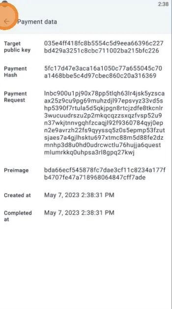
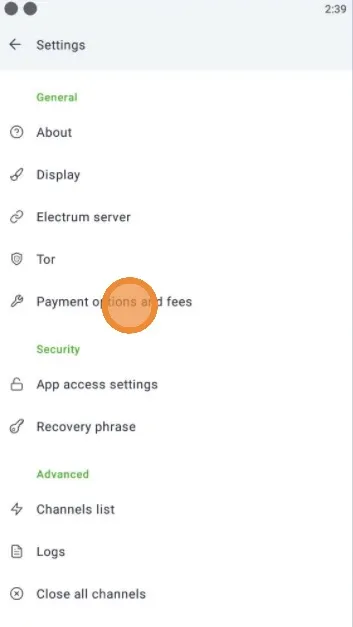

Phoenix es una billetera Lightning no custodial creada por Acind, el equipo detrás de la implementación Lightning Eclair.

Para encontrar su documentación oficial, consulte su guía de preguntas frecuentes: https://phoenix.acinq.co/faq

## Tutorial en video

## Guías escritas

Texto a escribir ^^' siga las imágenes

### Descarga y configuración

### Copia de seguridad

### Recibir

### Enviar

### Configuración

### Restablecer

