Após a prisão dos fundadores da Samourai Wallet e a apreensão de seus servidores em 24 de abril, algumas funcionalidades do aplicativo agora estão inoperantes, e usuários que não possuem seu próprio Dojo não podem mais transmitir transações.

Depois de ajudar vários usuários a recuperarem seus bitcoins nos últimos dias, acredito que encontrei a maioria dos problemas que podem surgir durante a restauração de uma Samourai Wallet. Portanto, este tutorial começará com um relatório de situação para identificar as funcionalidades que permanecem operacionais e aquelas que não estão mais disponíveis dentro do ecossistema da Samourai Wallet e do software afetado por este incidente. Em seguida, procederemos passo a passo para recuperar uma Samourai Wallet usando o software Sparrow Wallet. Examinaremos todos os obstáculos potenciais encontrados durante este processo e veremos soluções para resolvê-los. Finalmente, na última parte, você descobrirá os potenciais riscos para sua privacidade após a apreensão do servidor.

*Um grande obrigado a [@Louferlou](https://twitter.com/Louferlou), que ajudou vários usuários em sua recuperação e compartilhou suas experiências comigo, e que também contribuiu com testes para determinar o que ainda está funcional.*

## A Samourai Wallet ainda está funcionando?

Sim, **o aplicativo Samourai Wallet ainda está funcionando**, mas sob certas condições.

Primeiramente, é necessário que o aplicativo já estivesse previamente instalado no seu smartphone. A Google Play Store removeu o aplicativo, e o APK estava hospedado no site apreendido. Portanto, está complicado instalar o Samourai no momento. Você pode encontrar APKs online, mas aconselho a não baixá-los a menos que você tenha certeza da fonte.

Dado que a página da Samourai Wallet não está mais disponível na Google Play Store, não é possível desativar as atualizações automáticas. Se o aplicativo retornar às plataformas de download, seria prudente **desativar as atualizações automáticas** até que mais informações estejam disponíveis a respeito do desenvolvimento do caso.

Se a Samourai Wallet já está instalada no seu smartphone, você ainda deve ser capaz de acessar o aplicativo. Para usar a funcionalidade de carteira da Samourai, é essencial conectar um Dojo. Anteriormente, usuários sem um Dojo pessoal dependiam dos servidores da Samourai para acessar informações da blockchain do Bitcoin e para transmitir transações. Com a apreensão desses servidores, o aplicativo não pode mais acessar esses dados.
Se você não tinha um Dojo conectado antes, mas tem um agora, você pode configurá-lo para usar seu aplicativo Samourai novamente. Isso envolve verificar seus backups, deletar a carteira (a carteira, não o aplicativo) e recuperar a carteira conectando seu Dojo ao aplicativo. Para mais detalhes sobre esses passos, você pode consultar [este tutorial, na seção "_Preparando sua Samourai Wallet_" : COINJOIN - DOJO](https://planb.network/pt/tutorials/privacy/coinjoin-dojo).
Se seu aplicativo Samourai já estava conectado ao seu próprio Dojo, então a parte da carteira funciona perfeitamente para você. Você ainda pode ver seu saldo e transmitir transações. Apesar de tudo o que está acontecendo, acho que a Samourai Wallet continua sendo o melhor software de carteira móvel no momento. Pessoalmente, planejo continuar usando-a.
O principal problema que você pode encontrar é a inacessibilidade das contas Whirlpool pelo aplicativo. Geralmente, o Samourai tenta estabelecer uma conexão com seu Whirlpool CLI e iniciar os ciclos de coinjoin antes de dar acesso a essas contas. No entanto, como essa conexão não é mais possível, o aplicativo continua a buscar indefinidamente sem nunca dar acesso às contas Whirlpool. Neste caso, você pode recuperar essas contas em outro software de carteira, mantendo apenas a conta de depósito no Samourai.
### Quais ferramentas ainda estão disponíveis no Samourai?

Por outro lado, algumas ferramentas são afetadas pelo desligamento do servidor ou completamente indisponíveis.

Quanto às ferramentas de gastos individuais, tudo funciona normalmente, desde que, é claro, você tenha seu próprio Dojo. Transações Stonewall normais (e não Stonewall x2) funcionam sem nenhum problema.

Comentários no Twitter destacaram que a privacidade oferecida por uma transação Stonewall pode agora estar reduzida. O valor agregado de uma transação Stonewall reside no fato de ser indistinguível de uma transação Stonewall x2 em termos de estrutura. Quando um analista encontra esse padrão específico, ele não pode determinar se é um Stonewall padrão com um único usuário ou um Stonewall x2 envolvendo dois usuários. No entanto, como veremos nos parágrafos seguintes, realizar transações Stonewall x2 tornou-se mais complexo devido à indisponibilidade do Soroban. Alguns, portanto, pensam que um analista pode agora assumir que qualquer transação com essa estrutura é um Stonewall normal. Pessoalmente, não compartilho dessa suposição. Embora as transações Stonewall x2 possam ser menos frequentes (e eu acho que já eram antes deste incidente), o fato de ainda serem possíveis pode invalidar uma análise inteira baseada na suposição de que não são.
**[-> Saiba mais sobre transações Stonewall.](https://planb.network/tutorials/privacy/stonewall)**
Quanto ao Ricochet, não consegui verificar se o serviço ainda está operacional, por não possuir um Dojo no Testnet, e prefiro não arriscar gastar `100 000 sats` em direção a uma carteira que poderia ser controlada pelas autoridades. Se você teve a oportunidade de testar essa ferramenta recentemente, convido você a entrar em contato comigo para que possamos atualizar este artigo.

Se você precisar usar o Ricochet, esteja ciente de que sempre pode realizar essa operação manualmente com qualquer software de carteira. Para aprender a realizar os vários saltos manualmente de forma adequada, recomendo consultar este outro artigo: [**RICOCHET**](https://planb.network/tutorials/privacy/ricochet).

A ferramenta JoinBot não está mais operacional, pois dependia inteiramente da participação de uma carteira gerenciada pelo Samourai.

Quanto a outros tipos de transações colaborativas, frequentemente referidas como "cahoots", elas permanecem possíveis, mas apenas manualmente. Antes do desligamento do servidor, você tinha duas opções para realizar transações Stonewall x2 ou Stowaway (PayJoin):
- Usar a rede Soroban para trocar automaticamente e remotamente os PSBTs;
- Ou realizar essas trocas manualmente, escaneando vários códigos QR.

Após vários testes, parece que o Soroban não está mais funcionando. Para realizar essas transações colaborativas, a troca de dados deve, portanto, ser feita manualmente. Aqui estão duas opções para realizar essa troca:
- Se você estiver fisicamente próximo ao seu colaborador, você pode escanear os códigos QR sucessivamente;
- Se você está distante do seu colaborador, pode trocar os PSBTs por um canal de comunicação externo à aplicação. No entanto, tenha cuidado, pois os dados contidos nesses PSBTs são sensíveis em termos de privacidade. Eu recomendo usar um serviço de mensagens criptografadas para garantir a confidencialidade da troca.
**[-> Saiba mais sobre transações Stonewall x2.](https://planb.network/tutorials/privacy/stonewall-x2)**

**[-> Saiba mais sobre transações Stowaway.](https://planb.network/tutorials/privacy/payjoin-samourai-wallet)**

Quanto ao Whirlpool, o protocolo parece não funcionar mais, mesmo para usuários que possuem seu próprio Dojo. Tenho monitorado meu RoninDojo nos últimos dias e tentado algumas manipulações básicas, mas o CLI do Whirlpool não conseguiu se conectar desde o desligamento do servidor.

No entanto, permaneço esperançoso de que este protocolo possa ser reativado ou talvez reimaginado de forma diferente nas próximas semanas, dependendo de como a situação evolui. Esta pausa pode ser uma oportunidade para explorar novas abordagens ou melhorias potenciais para este sistema.
### Quais ferramentas externas ainda estão disponíveis?
Em relação a outras ferramentas relacionadas ao ambiente Samourai, algumas ainda estão disponíveis enquanto outras não estão.

O site gratuito de análise de cadeias OXT.me infelizmente não está mais disponível por enquanto.

A Ferramenta de Estatísticas do Whirlpool não está mais disponível para download, pois estava hospedada no GitLab da Samourai. Mesmo que você tenha baixado anteriormente esta ferramenta Python localmente em sua máquina, ou se estava instalada em seu nó RoninDojo, o WST não funcionará por enquanto. De fato, dependia de dados fornecidos pelo OXT.me para seu funcionamento, e este site não está mais acessível. Atualmente, o WST não é particularmente útil, uma vez que o protocolo Whirlpool está inativo.

O site KYCP.org atualmente também não está acessível.

O GitLab que hospedava o código para a ferramenta Python Calculadora Boltzmann também foi apreendido. Neste momento, portanto, não é mais possível baixar esta ferramenta. Mas se você tem um RoninDojo, pode continuar a usar a Calculadora Boltzmann da mesma forma que antes.

Quanto ao RoninDojo, este software de nó-em-caixa continua a funcionar corretamente apesar da indisponibilidade de certas ferramentas específicas como o CLI do Whirlpool e o WST. Ainda pode ser usado para outros softwares de carteira graças ao Fulcrum ou Electrs. Se desejar obter mais informações sobre o RoninDojo ou se tiver perguntas específicas, encorajo você a se juntar [ao grupo deles no Telegram](https://t.me/RoninDojoNode).

No entanto, o código-fonte para o RoninDojo atualmente também não está acessível, pois estava hospedado no GitLab da Samourai. Portanto, não é possível instalá-lo manualmente em um Raspberry Pi no momento.

Em relação ao software de carteira somente para visualização Sentinel, a situação é semelhante à do aplicativo Samourai. Se você tem seu próprio Dojo, pode continuar a usar o Sentinel sem nenhum problema. No entanto, se você não tem um Dojo, não será mais capaz de estabelecer uma conexão. Ao contrário do Samourai, o site do Sentinel ainda está acessível online. Mas tenha cautela com este site e o APK oferecido lá, pois não está claro quem controla atualmente esses recursos.

### O Sparrow Wallet é afetado?
A Sparrow Wallet continua a operar normalmente, com exceção das ferramentas Samourai que não estão mais disponíveis. Atualmente, não é mais possível realizar coinjoins através da Sparrow. Da mesma forma, as ferramentas de gasto colaborativo não estão mais acessíveis, pois a Sparrow não oferece a opção de troca manual de PSBTs, ao contrário da Samourai. Para todas as outras funcionalidades, a Sparrow opera sem problemas. Você também pode usar este software para recuperar uma carteira Samourai, se necessário.

## Como Recuperar uma Carteira Samourai?
Como vimos nas seções anteriores, se você possui seu próprio Dojo, não é necessariamente obrigatório trocar de software. **Samourai permanece uma excelente escolha de carteira quente** para seus gastos diários. No entanto, se você não tem um Dojo ou se prefere optar por outro software, explicarei o processo completo de recuperação, detalhando quaisquer obstáculos potenciais que você possa encontrar.

De qualquer forma, é importante tomar seu tempo e garantir que não cometa erros. Lembre-se, não há pressa, pois você possui suas chaves privadas, e a apreensão dos servidores da Samourai não afeta isso de forma alguma. O que acontecer, obviamente eles não podem acessar suas chaves privadas.

### Verifique a frase-senha

Para recuperar sua carteira, você deve ter sua frase-senha, mesmo que opte pela recuperação via arquivo de backup. Comece verificando a validade desta frase-senha. Abra seu aplicativo Samourai Wallet, clique no seu ícone Paynym no canto superior esquerdo e, em seguida, selecione `Configurações`.

Em seguida, clique em `Solução de problemas` e depois em `Teste de frase-senha/backup`.

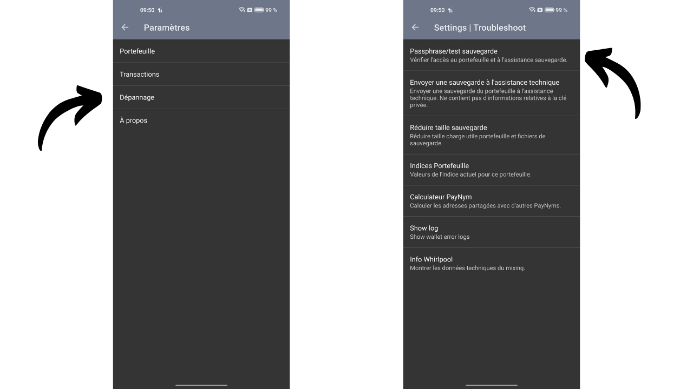

Digite sua frase-senha e clique em `Ok`. Se estiver correta, Samurai irá confirmá-la. Você também tem a opção de verificar o arquivo de backup se planeja usá-lo mais tarde.

Esta etapa é opcional, mas recomendada. Ela confirma que a frase-senha está correta, eliminando uma fonte potencial de problemas mais tarde. Se a Samourai indicar que a frase-senha está incorreta nesta etapa, a recuperação não será possível. Certifique-se de ter digitado a frase-senha corretamente e verifique novamente.

### Opção 1: Recuperar a carteira na Sparrow com o arquivo de backup

Desde a versão 1.8.6 da Sparrow Wallet, é possível importar diretamente sua carteira Samourai usando o arquivo de texto de backup chamado `samourai.txt`, que seu aplicativo gera automaticamente. Este arquivo contém todas as informações necessárias para recuperar sua carteira e é criptografado com sua frase-senha para segurança.

Se você escolher esta opção, precisará do seu arquivo `samourai.txt` atualizado e da sua frase-senha. Para gerar este arquivo no Samourai Wallet, clique nos três pequenos pontos no canto superior direito e, em seguida, selecione `Exportar backup da carteira`.

Em seguida, escolha `Exportar para Área de Transferência`. Depois disso, você precisará transferir este arquivo para o seu PC de forma segura. Uma vez que o arquivo é criptografado, mas a frase-senha sozinha é suficiente para descriptografá-lo, é importante tomar precauções durante sua transmissão. Se você optar por uma transferência direta como texto simples, precisará criar um arquivo `samourai.txt` no seu PC e colar o conteúdo da área de transferência nele. Uma alternativa seria recuperar diretamente o arquivo `samourai.txt` dos arquivos armazenados no seu telefone.
Uma vez que tenha acesso ao arquivo no seu PC, abra a Sparrow Wallet, clique na aba `Arquivo` e selecione `Importar Carteira` para começar a importar sua carteira.

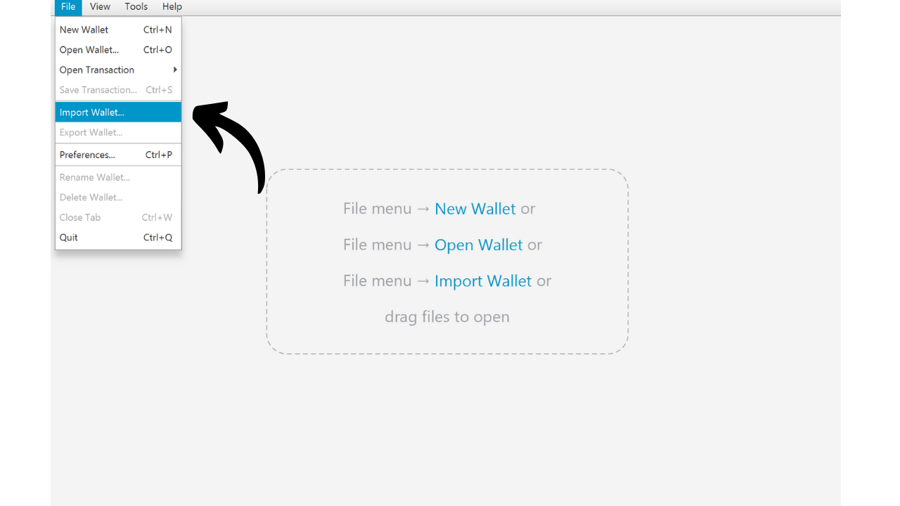
Desça até `Samourai Backup`, clique em `Import File` e, em seguida, selecione seu arquivo `samourai.txt`.
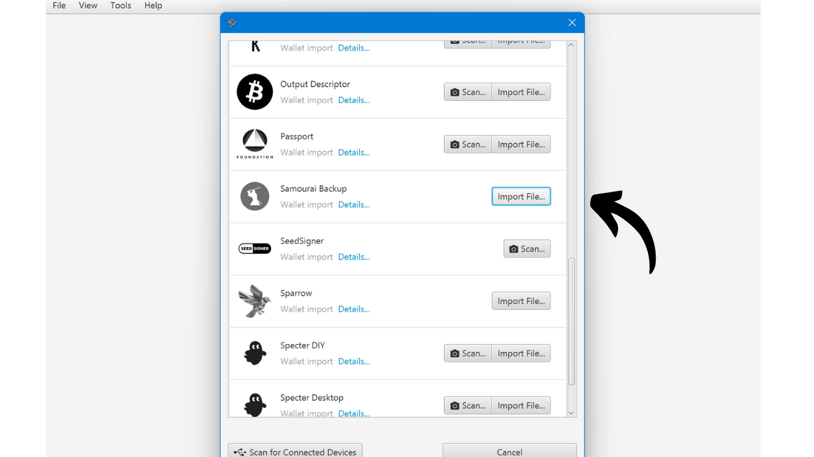

O Sparrow então pedirá uma senha para descriptografar o arquivo. Essa senha é na verdade sua passphrase. Insira-a no campo correspondente e clique em `Import`.

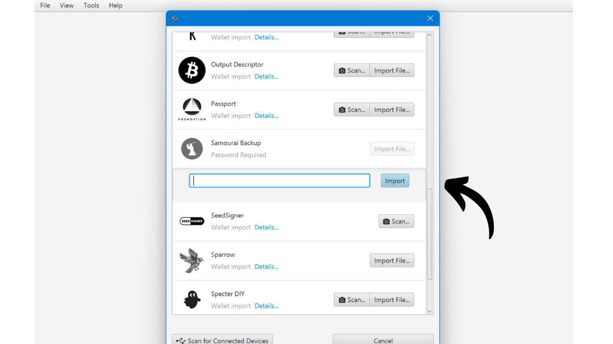

Se nesta etapa, sua carteira não aparecer, é possível que você tenha cometido um erro ao copiar o arquivo `samourai.txt` ou ao inserir a passphrase. Você pode consultar a seção de solução de problemas para mais ajuda.

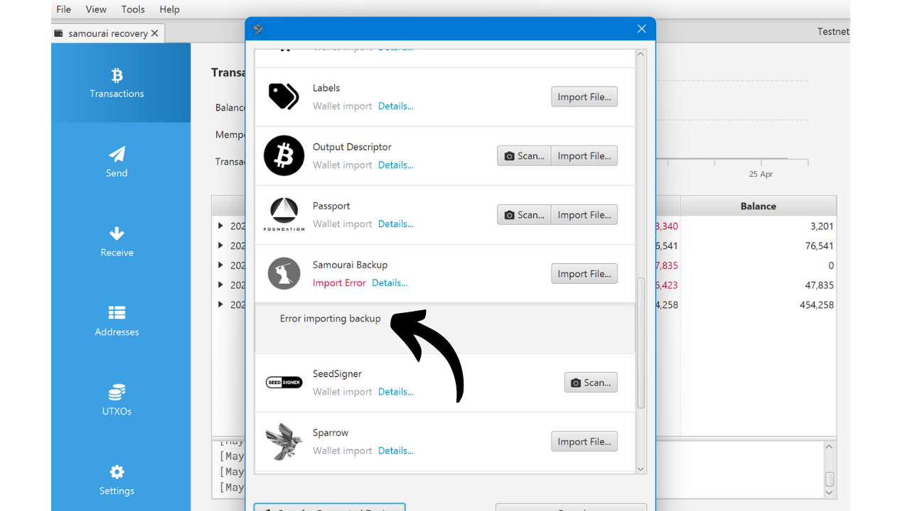

Para o tipo de script, se você não configurou outros scripts no Samourai, você deve normalmente usar apenas SegWit V0 (Native SegWit / P2WPKH). Mantenha este script padrão e clique em `Import`.

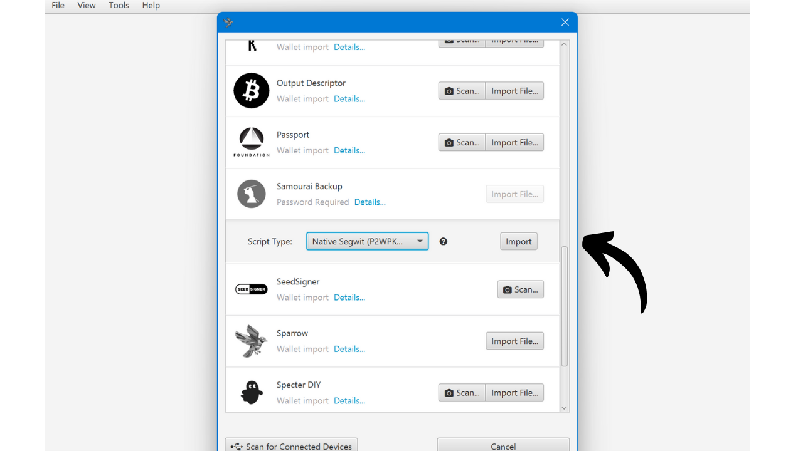

Nomeie sua carteira, por exemplo, "Samourai Recovery", e então clique em `Create Wallet`.

O Sparrow então pedirá que você escolha uma senha. Esta senha protege apenas o acesso à sua carteira neste PC e não está relacionada à derivação das chaves da sua carteira. Certifique-se de escolher uma senha forte, anote-a para lembrar-se dela, e clique em `Set Password`.

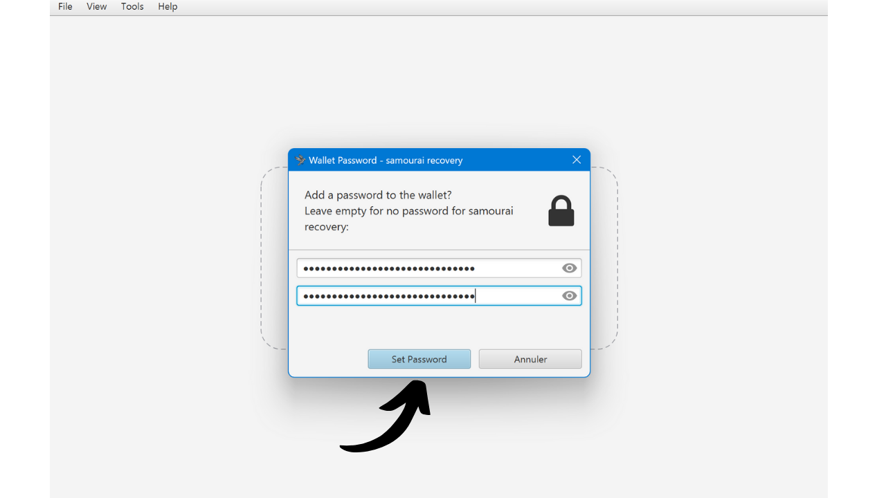

O Sparrow então derivará as chaves da sua carteira e buscará pelas transações correspondentes.

Por enquanto, apenas sua conta de depósito está acessível. Se você estava usando o Samourai apenas para esta conta, você deve ver todos os seus fundos. No entanto, se você também estava usando o Whirlpool, você precisará derivar as contas `premix`, `postmix` e `badbank`. No Sparrow, simplesmente clique na aba `Settings`, e então em `Add Accounts...`.

Na janela que se abre, selecione `Whirlpool Accounts` no menu dropdown, e clique em `OK`.

Você então verá suas diversas contas Whirlpool aparecerem, e o Sparrow derivará as chaves necessárias para usar os bitcoins associados.

Se você está usando um software diferente do Sparrow, como o Electrum, para recuperar sua carteira Samourai, aqui estão os índices de conta Whirlpool para recuperação manual:
- Depósito: `m/84'/0'/0'`
- Bad Bank: `m/84'/0'/2147483644'`
- Premix: `m/84'/0'/2147483645'`
- Postmix: `m/84'/0'/2147483646'`

Você agora tem acesso aos seus bitcoins no Sparrow. Se precisar de ajuda usando o Sparrow Wallet, você também pode conferir [nosso tutorial dedicado](https://planb.network/tutorials/wallet/sparrow).

Eu também recomendo importar manualmente os rótulos que você tinha associado com seus UTXOs no Samourai. Isso permitirá que você realize um controle eficaz de moedas no Sparrow posteriormente.

### Opção 2: Recuperar a carteira no Sparrow com a frase mnemônica

Se você não deseja realizar a recuperação com o arquivo de backup, pode optar por um método mais tradicional simplesmente usando sua frase de recuperação de 12 palavras e sua passphrase. Esta segunda opção é frequentemente mais simples.
Para começar, certifique-se de que você tem sua frase de recuperação e sua senha à mão. Em seguida, abra o software Sparrow Wallet, clique na aba `File` e selecione `Import Wallet` para começar a importar sua carteira.
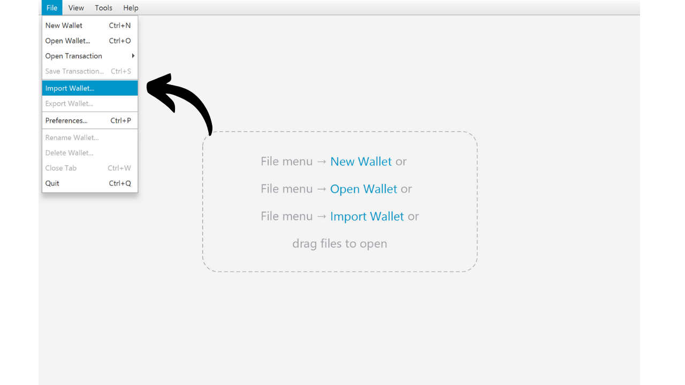

Escolha `Mnemonic Words (BIP39)` e, no menu suspenso, clique em `Use 12 Words`.

Digite as 12 palavras da sua frase de recuperação na ordem correta.

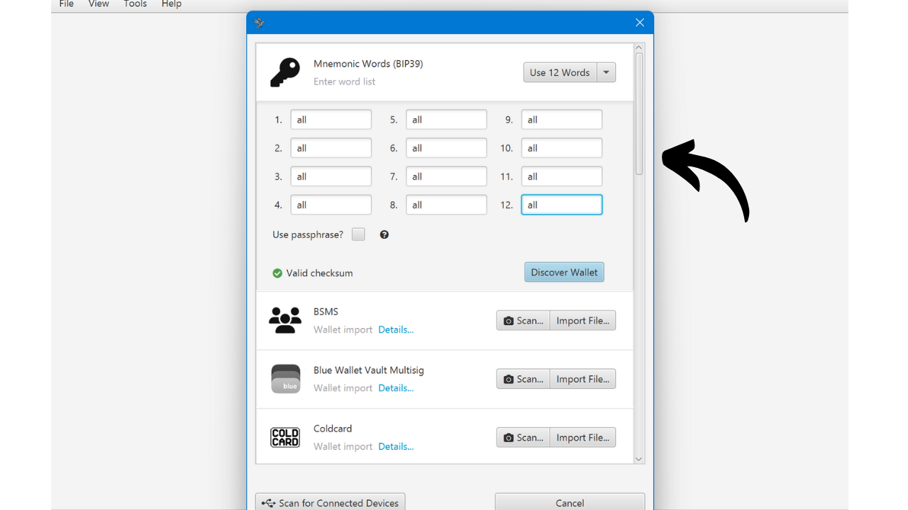

Se o Sparrow exibir uma mensagem de `Invalid Checksum`, isso indica que o checksum da frase de recuperação não é válido, o que provavelmente significa que você cometeu um erro ao digitar as palavras.

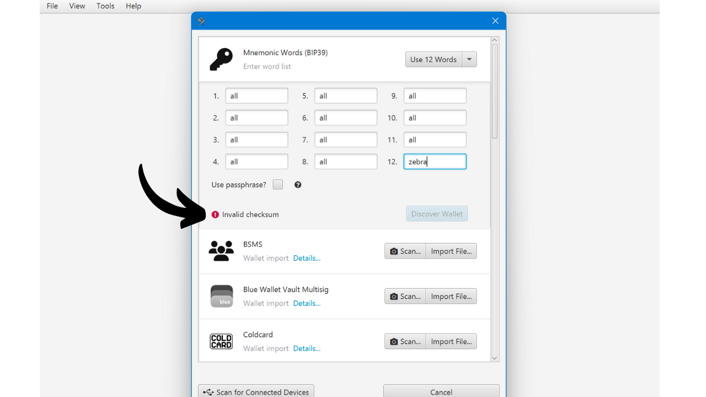

Se sua frase estiver correta, marque a caixa `Use Passphrase?` e digite sua senha no campo dedicado. Finalmente, se tudo parecer correto, clique no botão `Discover Wallet`.

Nomeie sua carteira, por exemplo, "Samourai Recovery", e clique em `Create Wallet`.

O Sparrow então pedirá que você escolha uma senha. Esta senha protege apenas o acesso à sua carteira neste PC e não está relacionada à derivação das chaves da sua carteira. Certifique-se de escolher uma senha forte, anote-a para lembrar-se dela e clique em `Set Password`.
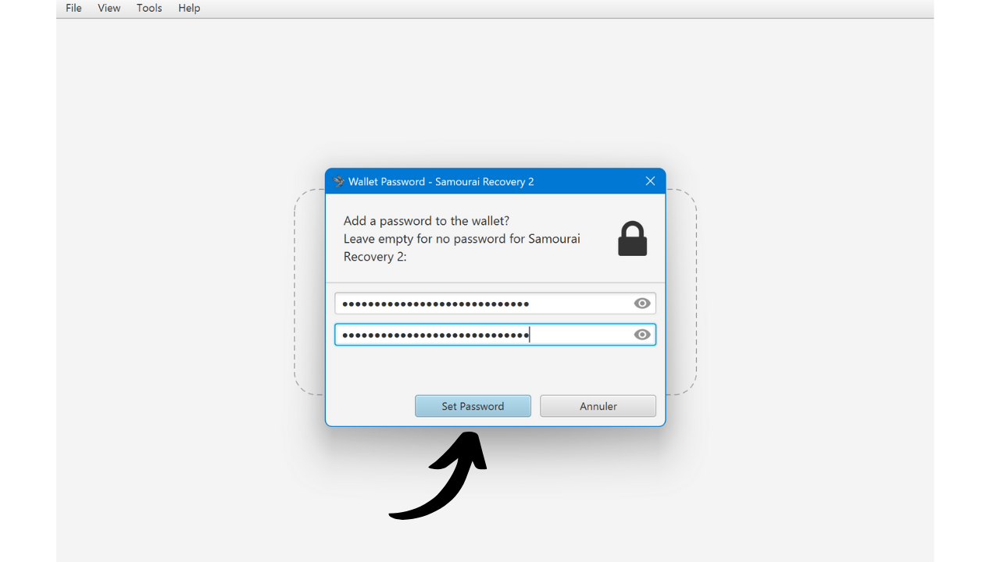

O Sparrow então derivará as chaves para sua carteira e buscará por transações correspondentes.

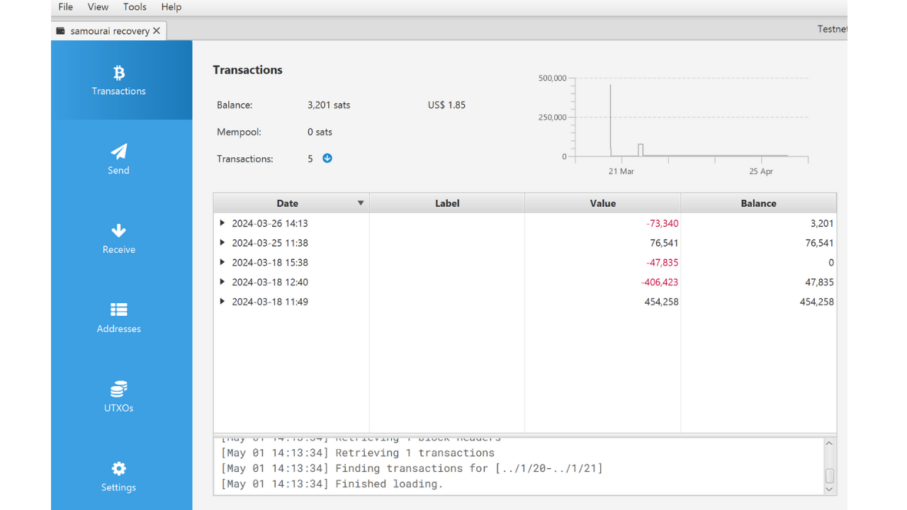

Se, nesta etapa, sua carteira não aparecer, é possível que você tenha cometido um erro ao digitar a senha ou a frase de recuperação. Você pode consultar a seção de solução de problemas dedicada para mais ajuda.

Por enquanto, apenas sua conta de depósito está acessível. Se você estava usando o Samourai apenas para esta conta, você deve ver todos os seus fundos. No entanto, se você também estava usando o Whirlpool, precisará derivar as contas `premix`, `postmix` e `badbank`. No Sparrow, basta clicar na aba `Settings`, e então em `Add Accounts...`.

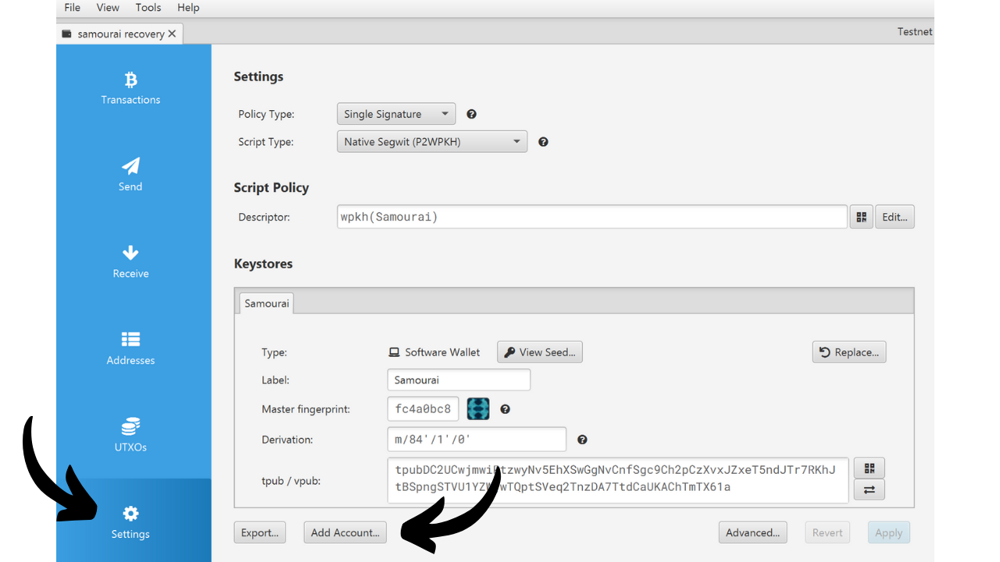

Na janela que se abre, selecione `Whirlpool Accounts` da lista suspensa e clique em `OK`.

Você então verá suas diversas contas Whirlpool aparecerem, e o Sparrow derivará as chaves necessárias para usar os bitcoins associados.

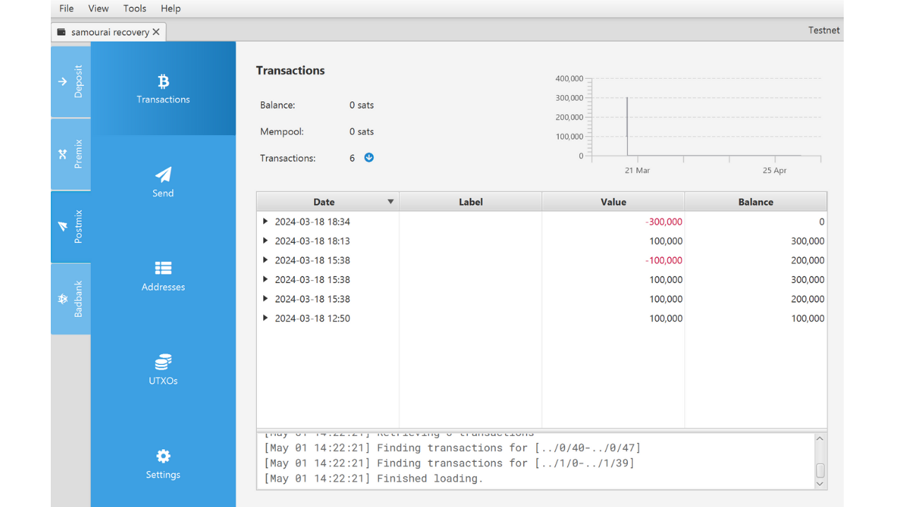

Se você estiver usando outro software como o Electrum para recuperar sua carteira Samourai, aqui estão os índices de conta Whirlpool para recuperação manual:
- Depósito: `m/84'/0'/0'`
- Bad Bank: `m/84'/0'/2147483644'`
- Premix: `m/84'/0'/2147483645'`
- Postmix: `m/84'/0'/2147483646'`

Agora você tem acesso aos seus bitcoins no Sparrow. Se precisar de ajuda para usar o Sparrow Wallet, você também pode consultar [nosso tutorial dedicado](https://planb.network/tutorials/wallet/sparrow).

Eu também recomendo importar manualmente os rótulos que você havia associado aos seus UTXOs no Samourai. Isso permitirá que você realize um controle eficaz de moedas no Sparrow posteriormente.

### Quais são os problemas comuns encontrados?
Após ajudar várias pessoas nos últimos dias, acredito que encontrei a maioria dos problemas que podem impedir a recuperação da sua carteira. Se você ainda não consegue acessar sua carteira apesar dos tutoriais anteriores, aqui estão algumas recomendações adicionais. Em primeiro lugar, para que a recuperação funcione, é absolutamente essencial que a frase de recuperação esteja correta. Se você não consegue encontrar sua frase de 12 palavras, você pode usar a *opção 1* para recuperar a partir do arquivo de backup do Samourai. Você também pode acessar sua frase de recuperação diretamente no Samourai Wallet navegando até `Configurações`, depois `Carteira`, e finalmente selecionando `Mostrar frase de recuperação de 12 palavras`.

Em seguida, um erro de digitação na sua senha durante a recuperação resultará em chaves derivadas incorretas, o que impedirá a recuperação da sua carteira no Sparrow. **A senha deve ser perfeitamente precisa!**

Para resolver isso, eu primeiro aconselho você a verificar a validade da sua senha no aplicativo Samourai conforme descrito na seção "_Verificar a senha_" deste artigo:
1. **Validação no Samourai:** Se o Samourai confirmar que a senha está correta, tente a recuperação novamente desde o início, certificando-se de inserir a senha no Sparrow com precisão e sem erros;
2. **Erro de Senha:** Se o Samourai indicar que a senha está incorreta, é inútil continuar as tentativas no Sparrow. Enquanto a senha correta não for encontrada, a recuperação da sua carteira é impossível. Se você perdeu permanentemente sua senha, mantenha seu aplicativo Samourai seguro. Tudo o que você pode fazer é esperar que os servidores sejam reiniciados para que você possa fazer gastos diretamente do aplicativo sem precisar de recuperação. **Não tente conectar um Dojo neste caso**, pois isso implicaria em redefinir sua carteira no Samourai, o que requer acesso à senha.

Entre outros erros encontrados, muitos estão relacionados à configuração de rede no Sparrow.

Primeiro, certifique-se de que o Sparrow está corretamente configurado no modo `mainnet` em vez de no modo `testnet`. De fato, se o Sparrow procurar suas transações no Testnet, ele não encontrará nada, porque sua carteira está no Mainnet. O Testnet é uma versão alternativa do Bitcoin, usada exclusivamente para testes e desenvolvimento, e opera em uma rede separada da rede principal (Mainnet), com seus próprios blocos e transações. Para verificar em qual rede você está, clique na aba `Ferramentas`, depois em `Reiniciar Em`. Se a opção `Mainnet` for exibida, então você não está na rede principal. Selecione-a para reiniciar o Sparrow no Mainnet e, em seguida, comece seu processo de recuperação novamente.

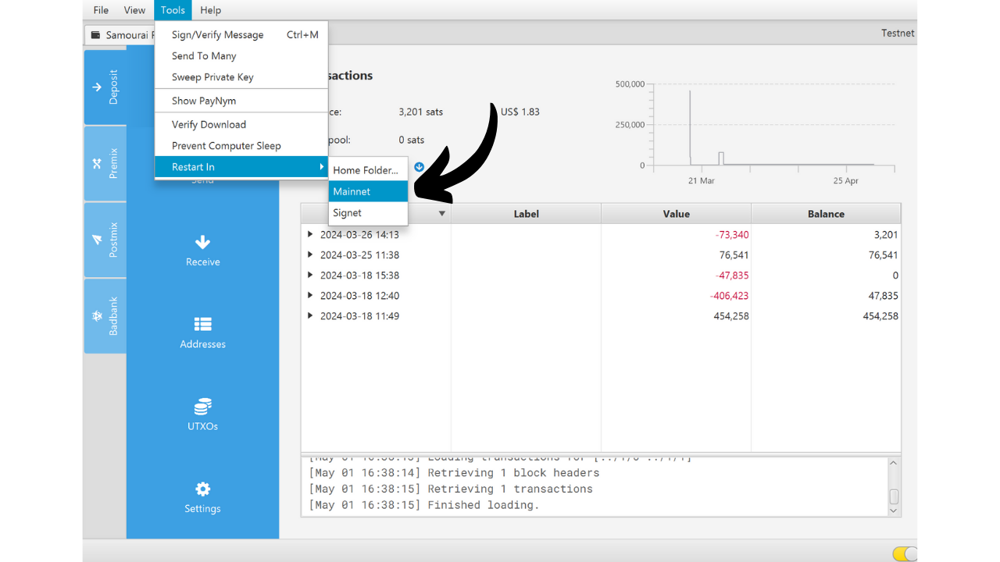
Alguns também encontraram dificuldades para conectar o Sparrow ao seu nó. No canto inferior direito do Sparrow, um interruptor colorido indica se seu software está corretamente conectado a um nó Bitcoin. Para recuperar suas transações Samourai, é essencial que o software esteja bem conectado. Verifique se o interruptor está ativado, como na minha imagem abaixo (amarelo para um nó público, verde para Bitcoin Core e azul para um servidor Electrum).

Se o interruptor não estiver ativado, clique nele para reativar a conexão.

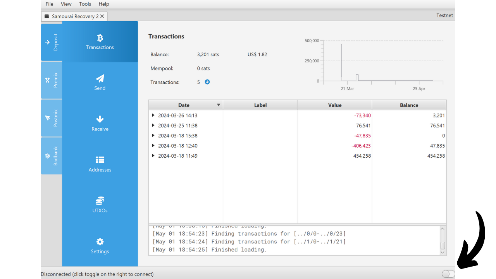

Se o problema persistir, aqui estão algumas soluções possíveis:
- Se você está tentando se conectar ao seu próprio servidor Electrum (azul) ou ao seu Bitcoin Core (verde) e o Sparrow não consegue se conectar, verifique as informações de conexão em `Arquivo > Preferências... > Servidor`;

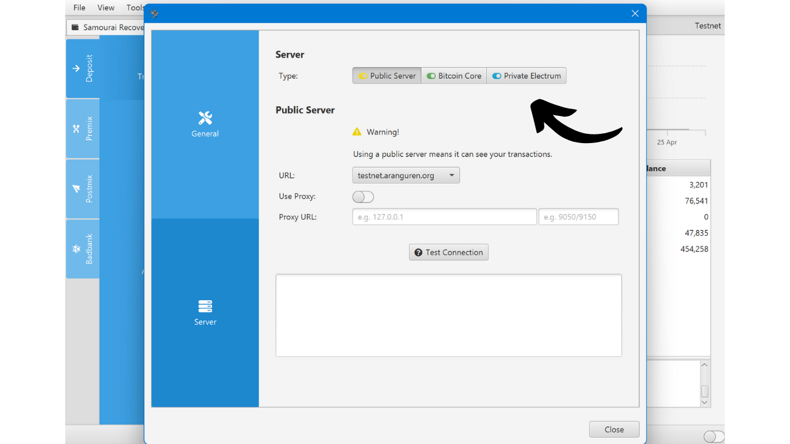
- Se o problema de conexão persistir, pode ser devido a uma sincronização incompleta do seu nó. Certifique-se de que seu nó e seu indexador estejam 100% sincronizados. Se necessário, como último recurso, desconecte seu nó do Sparrow e conecte-se a um nó público; - Se você já estava conectado a um nó público e a conexão falhar, tente mudar o nó selecionando outro da lista suspensa.

Se você conseguiu recuperar sua carteira, mas ela parece incompleta, pode haver um problema relacionado à derivação.

Um problema pode ocorrer se você usou sua conta de depósito Samourai com um tipo de script diferente de `P2WPKH`. Por padrão, o Samourai usa este tipo de script, mas se você o alterou manualmente, também deve ajustar isso ao recuperar no Sparrow.

Para derivar ramos para outros tipos de script, você precisa repetir o processo de recuperação para cada tipo de script usado. Para isso, vá em `File > New Wallet` no Sparrow, selecione outro tipo de script da lista suspensa, clique em `New or Imported Software Wallet` e siga os mesmos passos que no tutorial inicial.

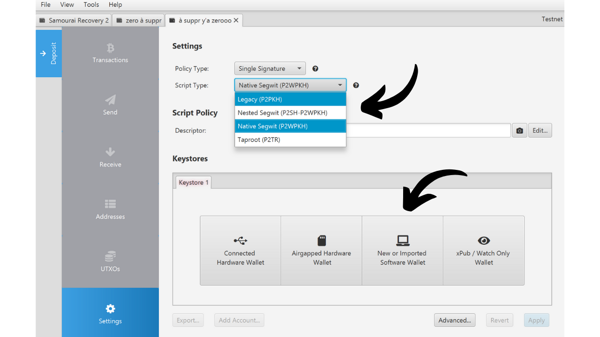

Outro problema de derivação que encontrei está relacionado ao valor do Gap Limit. Este valor indica ao Sparrow após quantos endereços vazios ele deve parar de derivar novos endereços. Se, após a recuperação, você notar que algumas transações estão faltando, isso pode ser devido a um Gap Limit muito baixo. Para resolver isso, vá até a conta que está causando o problema, por exemplo, a conta postmix (se várias contas estiverem envolvidas, repita esta operação para cada uma).

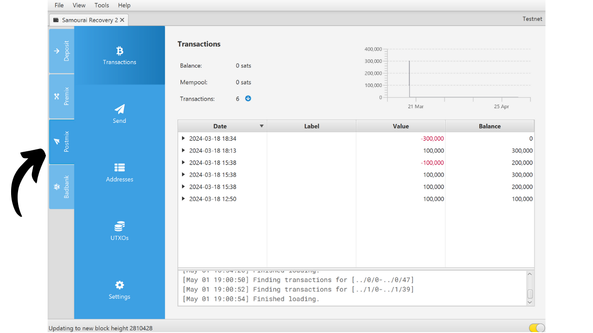

Clique na aba `Settings` e depois no botão `Advanced...`.

Aumente gradualmente o valor do Gap Limit, por exemplo, aqui eu defini para `400`. Em seguida, clique no botão `Close`.

Clique em `Apply` para finalizar. Sparrow então derivará um número maior de endereços e buscará fundos neles, o que deve ajudar a recuperar todas as suas transações.

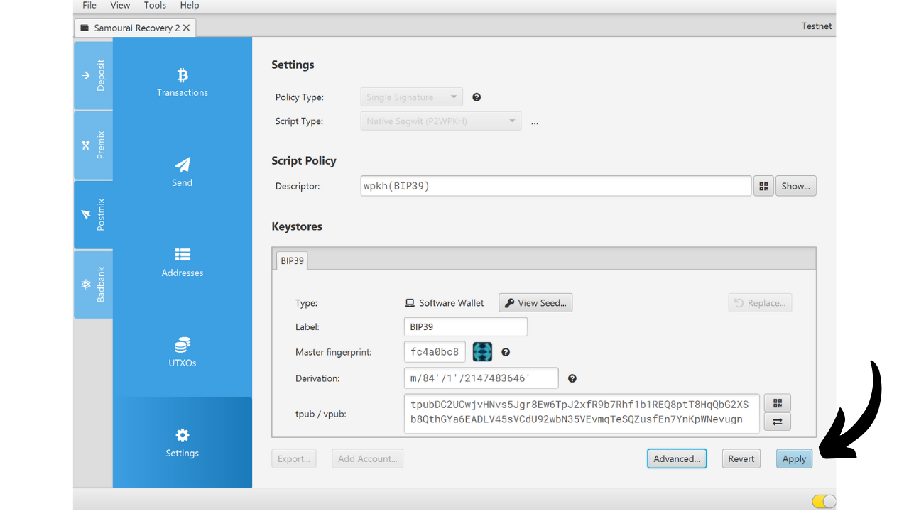

Isso cobre os vários problemas de recuperação que encontrei nos últimos dias. Se, após tentar todas essas soluções, você ainda estiver tendo problemas, convido você a se juntar ao [Discover Bitcoin Discord](https://discord.gg/xKKm29XGBb) para pedir ajuda. Eu visito regularmente este Discord e ficaria encantado em ajudar se tiver a solução. Outros bitcoiners também poderão compartilhar suas experiências e oferecer sua assistência. **Em qualquer caso, é essencial manter sua frase de recuperação, seu arquivo de backup e sua passphrase confidenciais**. Não compartilhe com ninguém, pois isso poderia permitir que roubassem seus bitcoins.

Uma vez que a recuperação esteja completa, você agora tem acesso aos seus bitcoins. Isso é bom, mas pode não ser suficiente. De fato, a apreensão de servidores levanta novos riscos potenciais para sua privacidade. Na seção seguinte, examinaremos esses riscos em detalhes e delinearemos as precauções a tomar para proteger sua privacidade.

## Quais são as consequências para a privacidade de suas transações?

### Como um usuário do Samourai sem Dojo

Se você estava usando a carteira Samourai sem ter conectado seu próprio Dojo, seus xpubs tinham que ser comunicados aos servidores do Samourai para o aplicativo funcionar. Com a apreensão desses servidores, é possível que as autoridades agora tenham acesso a esses xpubs.
Este cenário permanece hipotético. Não sabemos se esses xpubs foram registrados, se algum armazenamento potencial foi destruído, se as autoridades os recuperaram e se planejam usá-los para análise de cadeia. No entanto, em tal situação, é prudente considerar o pior cenário, onde as autoridades têm os xpubs de usuários que não conectaram seu próprio Dojo. Para referência, um xpub é uma sequência de caracteres que contém todos os elementos necessários para gerar chaves públicas filhas (chave pública + código de cadeia). É usado em carteiras determinísticas hierárquicas para gerar endereços de recebimento e observar transações de uma conta sem expor as chaves privadas associadas. Isso permite, por exemplo, a criação de uma carteira "somente visualização". No entanto, divulgar xpubs pode comprometer a privacidade do usuário, pois permitem que terceiros rastreiem transações e vejam os saldos das contas associadas. Quem conhece seus xpubs pode, assim, ver todos os endereços de recebimento da sua carteira, aqueles usados no passado e aqueles que serão gerados no futuro.

Para usuários sem um Dojo, um vazamento potencial de seus xpubs tem duas consequências principais:
- Os coinjoins que você pode ter realizado são tornados ineficazes do ponto de vista da privacidade para qualquer pessoa que conheça seus xpubs, assim seus coins perdem todo anonset;
- Essa pessoa também pode rastrear todos os endereços de recebimento da sua Carteira Samourai.

Portanto, é importante considerar o pior cenário e se desfazer desta carteira, potencialmente comprometida em termos de privacidade. Para fazer isso, crie uma nova carteira do zero com outro software, como Sparrow Wallet. Após verificar a validade de seus backups, transfira todos os seus fundos fazendo transações. Embora esta operação não quebre o link de rastreabilidade de seus coins, impedirá que as autoridades saibam com certeza os endereços da sua nova carteira.

Durante esta operação de transferência, recomendo evitar a consolidação de seus coins. Se assumirmos que seus xpubs estão comprometidos, a consolidação não terá impacto do ponto de vista da pessoa que tem acesso a esses xpubs, já que sua privacidade já está comprometida com eles. No entanto, aconselho você a não consolidar demais seus coins principalmente para proteger sua privacidade de outras pessoas. No pior caso, apenas as autoridades podem ter acesso aos seus xpubs, mas o resto do mundo não sabe sobre eles. Assim, do ponto de vista dos outros, consolidar seus coins poderia prejudicar significativamente sua privacidade por causa da Heurística de Propriedade de Entrada Comum (CIOH).

Finalmente, para quebrar definitivamente o rastreamento, considere também realizar coinjoins a partir desta nova carteira.
**Aviso:** Simplesmente recuperar sua carteira Samourai no Sparrow Wallet não é suficiente. É necessário criar uma carteira totalmente nova com uma nova frase de recuperação se você quiser evitar usar xpubs que podem ter vazado. Se você importar sua semente existente para o Sparrow, você está apenas mudando o software de gerenciamento da carteira, mas a carteira permanece a mesma.

### Como usuário do Sparrow ou Samourai com Dojo

Se sua carteira é gerenciada apenas no Sparrow Wallet, seus xpubs não poderiam ter vazado, seja você usando um nó público ou seu próprio nó Bitcoin. Da mesma forma, se você está usando o aplicativo Samourai e sempre conectou este aplicativo ao seu próprio Dojo desde a criação da sua carteira, seus xpubs também estão seguros.
No entanto, se você usou a mesma carteira durante um período **sem o seu próprio Dojo** e depois com o seu próprio Dojo, é possível que os servidores da Samourai possam ter tido acesso aos seus xpubs, e, portanto, as autoridades poderiam conhecê-los. Se você está nesta situação específica, aconselho que siga as recomendações da seção anterior e considere seus xpubs como comprometidos.
Para aqueles que sempre usaram Sparrow ou Samourai com o seu próprio Dojo, o principal risco é que os anonsets de suas moedas possam potencialmente ser reduzidos. Suponha, no pior cenário, que todos os usuários sem um Dojo tenham seus xpubs nas mãos das autoridades, então o caminho de suas moedas através dos ciclos de coinjoin poderia ser rastreado por essas autoridades.

Para ilustrar isso, vamos tomar um exemplo concreto. Imagine que você participou de um primeiro ciclo de coinjoin, seguido por dois ciclos adicionais de coinjoin a jusante. Se os xpubs dos usuários sem um Dojo não vazaram, então o anonset prospectivo da sua moeda seria 13.

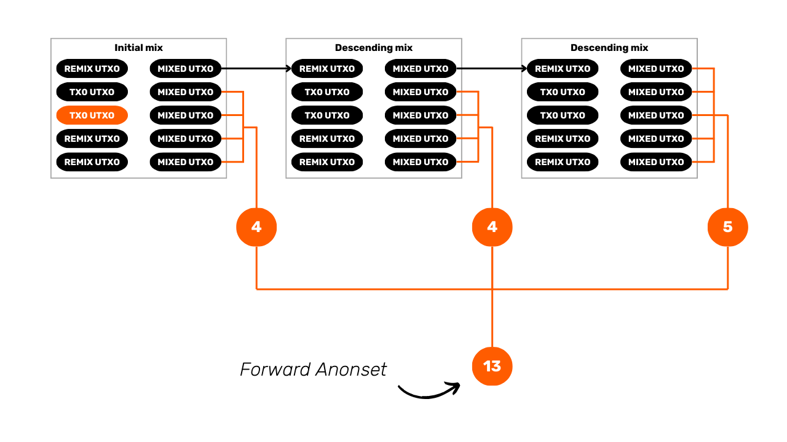

No entanto, se considerarmos que os xpubs vazaram e que você encontrou um usuário sem dojo durante o coinjoin inicial, e depois 2 durante o primeiro coinjoin a jusante, então o seu anonset prospectivo seria apenas 10 em vez de 13 do ponto de vista da autoridade.

Essa potencial diminuição no anonset é complexa de quantificar, pois depende de inúmeros fatores, e cada moeda é afetada de maneira diferente. Por exemplo, um usuário sem Dojo encontrado nos ciclos iniciais afeta o anonset prospectivo muito mais do que um encontrado nos ciclos posteriores. Para lhe dar uma ideia da situação, que permanece hipotética, as últimas estatísticas fornecidas pela Samourai indicaram que entre 85% e 90% das moedas envolvidas em coinjoins vieram de usuários com Dojo, Sparrow ou Bitcoin Keeper, ou seja, usuários que, mesmo no pior cenário, não teriam visto seus xpubs vazados.
Embora esses números sejam difíceis de verificar, eles me parecem consistentes por dois motivos:
- Sparrow Wallet é amplamente utilizado;
- A maioria dos softwares node-in-box oferece implementações de Dojo, e esses softwares mainstream como Umbrel são muito populares atualmente.

Assim, vários aspectos precisam ser considerados. Se a privacidade de suas moedas vis-à-vis as autoridades é extremamente importante para você, seria prudente preparar-se para o pior cenário, e é difícil garantir 100% que seus ciclos de coinjoin Whirlpool não poderiam ser rastreados devido ao potencial vazamento de xpubs de usuários sem Dojo. Embora essa suposição seja altamente improvável, não é impossível.

Por outro lado, se a privacidade de suas moedas vis-à-vis a autoridade potencialmente na posse desses xpubs não é crucial para você, então a situação pode ser considerada de maneira diferente.

Específico "vis-à-vis a autoridade" porque é importante lembrar que apenas a autoridade que apreendeu os servidores está potencialmente ciente desses xpubs. Se o seu objetivo ao usar coinjoin era impedir que o seu padeiro pudesse seguir seus fundos, então ele não está mais informado do que antes da apreensão do servidor.
Finalmente, é essencial considerar o anonset inicial da sua moeda, antes da apreensão do servidor. Vamos tomar o exemplo de uma moeda que alcançou um anonset prospectivo de 40.000; a diminuição potencial neste anonset é provavelmente negligenciável. De fato, com um anonset base já muito alto, é improvável que a presença de alguns usuários sem Dojo possa mudar radicalmente a situação. No entanto, se a sua moeda tinha um anonset de 40, então esse vazamento potencial poderia afetar seriamente seus anonsets e potencialmente permitir rastreamento. Com a ferramenta WST agora fora de serviço após o encerramento do OXT.me, você só pode estimar esses anonsets. Para o anonset retrospectivo, não há muito com o que se preocupar, já que o modelo Whirlpool garante que ele seja muito alto desde o primeiro coinjoin, graças ao legado de seus pares. O único caso em que isso poderia ser um problema é se a sua moeda não foi remixada por vários anos e foi misturada no início do lançamento de uma pool. Quanto ao anonset prospectivo, você pode examinar a duração que sua moeda esteve disponível para coinjoins. Se já se passaram vários meses, então provavelmente tem um anonset prospectivo extremamente alto. Por outro lado, se foi adicionada a uma pool apenas algumas horas antes dos servidores serem apreendidos, então seu anonset prospectivo é provavelmente muito baixo.
[**-> Saiba mais sobre anonsets e seu método de cálculo.**](https://planb.network/tutorials/privacy/wst-anonsets)

Outro aspecto a considerar é o impacto das consolidações nos anonsets das moedas que foram misturadas. Dado que as contas Whirlpool não são mais acessíveis via o aplicativo Samourai, é provável que muitos usuários tenham transferido sua carteira para outros softwares e tentado retirar seus fundos do Whirlpool. Em particular, no último fim de semana, quando as taxas de transação na rede Bitcoin estavam relativamente altas, havia um forte incentivo técnico e econômico para consolidar moedas pós-mix. Isso significa que é provável que muitos usuários tenham feito consolidações significativas.

O problema com essas consolidações pós-mix é que elas sempre reduzem os anonsets, não apenas para o usuário que as realiza, mas também para os usuários que encontraram durante seus ciclos de coinjoin. Embora eu não tenha conseguido verificar ou quantificar esse fenômeno precisamente, os incentivos econômicos relacionados às taxas de transação naquele momento podem nos levar a supor que os anonsets são potencialmente menores.

### Como Usuário do Sentinel

A operação de rede do aplicativo de carteira watch-only Sentinel é semelhante à do Samourai. Para acessar as informações da sua carteira, o aplicativo deve transmitir os xpubs, chaves públicas e endereços que você forneceu a um Dojo. Se você sempre usou seu próprio Dojo no Sentinel, não há problema, e você pode continuar a usar o aplicativo sem preocupações. No entanto, se você dependia dos servidores do Samourai para o seu Sentinel, é possível que seus xpubs tenham sido expostos. Neste caso, é aconselhável seguir o mesmo processo de mudança de carteira recomendado para a Samourai Wallet quando conectado aos servidores do Samourai.

No caso improvável de você estar usando seu Dojo com o Samourai, mas não com o Sentinel, seria mais prudente considerar que seus xpubs estão comprometidos.

## Conclusão
Obrigado por ler este artigo até o fim. Se você achar que faltam informações ou se tiver sugestões, por favor, não hesite em entrar em contato comigo para compartilhar seus pensamentos. Além disso, se você precisar de assistência adicional para recuperar sua Samourai Wallet apesar deste tutorial, convido você a se juntar ao [Discover Bitcoin Discord](https://discord.gg/xKKm29XGBb) para pedir ajuda. Eu visito regularmente este Discord e ficaria encantado em ajudá-lo se eu tiver a solução. Outros bitcoiners também poderão compartilhar suas experiências e oferecer seu apoio. **De qualquer forma, é essencial manter sua frase de recuperação, seu arquivo de backup e sua passphrase confidenciais**. Não compartilhe com ninguém, pois isso poderia permitir que eles roubassem seus bitcoins.