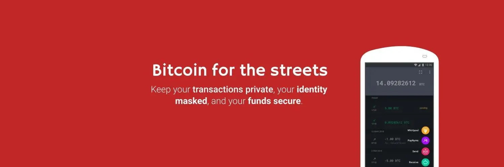
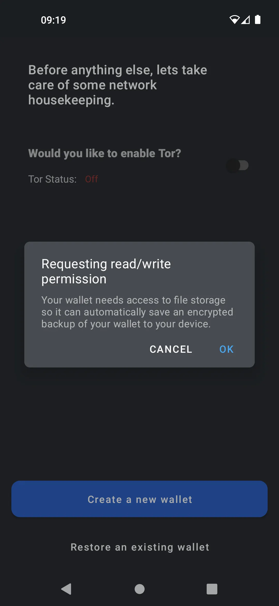
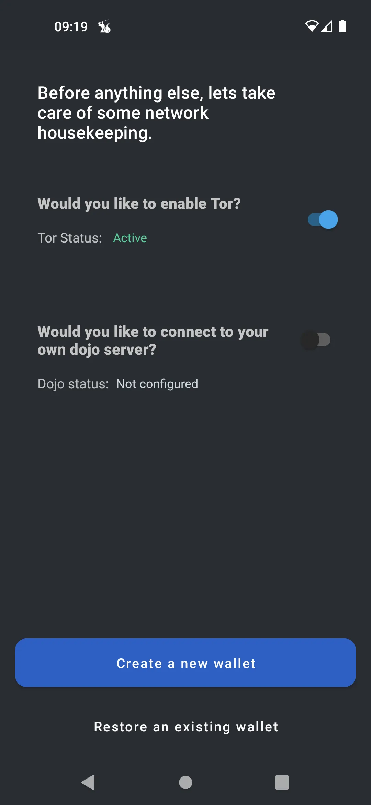

---

***ATTENZIONE:** In seguito all'arresto dei fondatori di Samourai Wallet e al sequestro dei loro server il 24 aprile, l'app Samourai continua a funzionare, ma **è obbligatorio utilizzare il proprio Dojo** per accedere alle informazioni sulla blockchain e diffondere transazioni.*

_Stiamo seguendo da vicino l'evoluzione di questo caso così come gli sviluppi relativi agli strumenti associati. Siate certi che aggiorneremo questo tutorial non appena saranno disponibili nuove informazioni._

_Questo tutorial è fornito solo a scopo educativo e informativo. Non approviamo né incoraggiamo l'uso di questi strumenti per scopi criminali. È responsabilità di ogni utente rispettare le leggi vigenti nella propria giurisdizione._

---

**Samourai Wallet** è un portafoglio dedicato alla privacy. Nonostante la sua interfaccia user-friendly, offre molta flessibilità nell'uso e nella sicurezza.

Essendo **100% non custodiale**, dovrai **fare il backup** delle tue 12 parole e sicuramente includere una **passphrase** che non devi perdere.

Una volta dentro il portafoglio, l'invio e la ricezione avvengono nel modo tradizionale, ma con una serie di strumenti per la privacy come **Ricochet**, **Stonewall**, **Whirlpool**, **JoinMarket**, **PayNyms** e altri.

Per spiegazioni su ciascuno di questi strumenti, puoi fare riferimento alla sezione **"Strumenti per la privacy"** nel tutorial o visitare il [**sito ufficiale della documentazione di Samourai Wallet**](https://docs.samourai.io/)

## Samourai Wallet in video

## Guida

### Installazione rapida per principianti

> Preso da https://docs.samourai.io/wallet/start

La nostra nuova schermata di benvenuto offre una panoramica delle funzionalità del nostro portafoglio. Quando le hai lette, tocca 'Inizia'.

Permessi

Concedi i permessi necessari affinché il portafoglio possa creare automaticamente un backup crittografato del tuo portafoglio.

Tor

La maggior parte degli utenti dovrebbe abilitare Tor per la privacy a livello di rete. Quindi tocca Crea un nuovo portafoglio.

Creazione di una passphrase

Crea una passphrase sicura ma memorabile. Questa passphrase fornirà una sicurezza aggiuntiva al tuo portafoglio ed è compatibile con qualsiasi portafoglio che abbia implementato la specifica BIP39 ampiamente supportata.

La tua passphrase è un componente obbligatorio quando si ripristina tramite mnemonico (a volte chiamato Recovery Words) o quando si accoppia alle app desktop di Whirlpool. È essenziale che tu non perda o dimentichi la tua passphrase.

> Non abbiamo conoscenza della tua passphrase, se dimentichi la tua passphrase non possiamo aiutarti a reimpostarla.
> Non dimenticare la tua passphrase!

Crea un codice PIN

Ti verrà ora chiesto di creare e confermare un codice PIN composto da 5 e 8 cifre. Il codice PIN viene utilizzato per sbloccare facilmente il tuo portafoglio senza dover inserire la tua passphrase.

Se dimentichi il tuo codice PIN, puoi sempre accedere al tuo portafoglio con la tua passphrase.

Crea un backup cartaceo

Hai ora creato un nuovo portafoglio Bitcoin. Ti verranno mostrate 12 parole casuali. È fondamentale che tu scriva e protegga queste 12 parole segrete.

Queste parole, quando utilizzate insieme alla tua passphrase, possono rigenerare l'intero portafoglio, il saldo e la cronologia in qualsiasi software di portafoglio compatibile.

> Foglio di backup cartaceo Forniamo un modello per creare il tuo backup cartaceo offline

> Le tue parole segrete devono rimanere segrete. Chiunque conosca le tue parole segrete e la tua passphrase sarà in grado di rubare i tuoi bitcoin. Non conservare mai le tue parole salvate su un computer o sul cloud.

Richiedi il tuo PayNym Bot

Un PayNym è un tipo di indirizzo stealth diverso dagli indirizzi bitcoin normali in quanto è sicuro da condividere pubblicamente senza rivelare nulla sul tuo portafoglio, incluso il saldo o la cronologia delle transazioni.

Dopo aver creato con successo il tuo portafoglio, ti verrà chiesto di richiedere un PayNym Bot. Questo è una rappresentazione visiva dell'hash SHA-256 del tuo indirizzo PayNym del portafoglio.
Una volta richiesto, ti verrà assegnato un nome unico per il Bot che verrà caricato nella directory pubblica dei bot PayNym, che puoi trovare su https://paynym.is

## utilizzalo

In questa fase puoi semplicemente ricevere e inviare bitcoin. Il portafoglio Samourai è molto avanzato nelle opzioni tecniche, che copriremo presto in una guida imminente.
