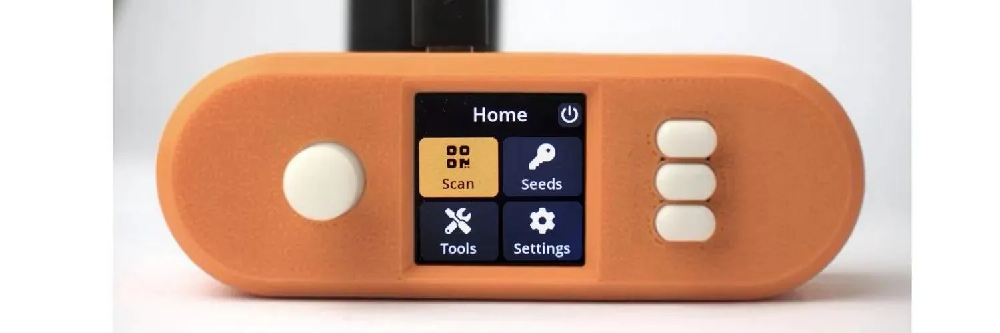
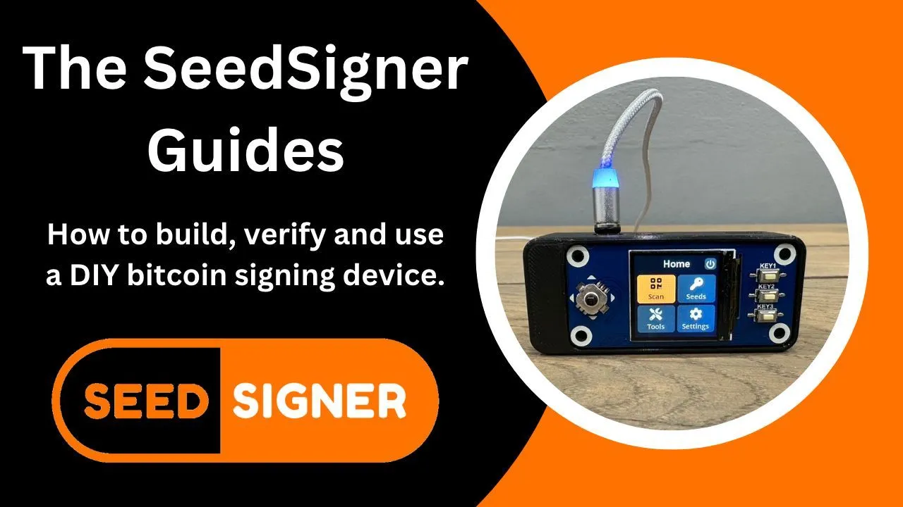

## Material:

1. Raspberry Pi Zero (Version 1.3)

Raspberry Pi Zero

Für eine vollständig luftdichte Lösung stellen Sie sicher, dass Sie die Version 1.3 ohne WiFi- oder Bluetooth-Funktion verwenden. Jedes Raspberry Pi 2/3/4 oder Zero-Modell funktioniert jedoch.

Hinweis: Raspberry Pi werden normalerweise ohne Pins geliefert. Die Pins müssen entweder gelötet oder ein sogenannter "GPIO Hammer" verwendet werden.
GPIO Hammer

Wenn Sie nicht gut löten können oder noch kein Lötkolben besitzen, können Sie "GPIO Hammer" als Alternative zum Löten verwenden.

2. WaveShare LCD Hat 1,3-Zoll-Hut mit 240 × 240 Pixel Display

WaveShare LCD Hat

Waveshare 1,3" 240×240 pxl LCD

Hinweis: Wählen Sie den Waveshare-Bildschirm sorgfältig aus. Stellen Sie sicher, dass Sie das Modell mit einer Auflösung von 240×240 Pixeln kaufen.
weitere Informationen

3. Raspberry Pi Kamera Modul

Raspberry Pi Kamera

Aokin / AuviPal 5MP 1080p mit OV5647 Sensor Videokamera Modul; andere Marken mit dem OV5647 Sensor Modul sollten ebenfalls funktionieren, sind jedoch möglicherweise nicht mit dem Orange Pill Gehäuse kompatibel.

Hinweis: Sie benötigen ein Kamerabandkabel, das speziell mit dem Raspberry Pi Zero kompatibel ist.

4. MicroSD-Karte mit mindestens 4 GB Kapazität

umfangreiche Ressourcen: https://seedsigner.com/explainers/

## Software:

Softwareinstallation

1. Laden Sie die neueste Datei "seedsigner_x_x_x.img.zip" herunter
   neueste Version

2. Entpacken Sie die Datei "seedsigner_x_x_x.img.zip"

3. Verwenden Sie Balena Etcher oder ein ähnliches Tool, um die entpackte .img-Datei auf eine MicroSD-Karte zu schreiben
   BALENA ETCHER

4. Installieren Sie die MicroSD-Karte in SeedSigner.
   SeedSigner GPG Public Key
   seedsigner_pubkey.gpg

## Video-Tutorial

_Anleitung von Southerbitcoiner, erstellt von Cole_

### Eine Sammlung von Video-Anleitungen zu SeedSigner: einer Open-Source, DIY-Hardware-Wallet/Signing-Gerät

SeedSigner ist ein Bitcoin-Signiergerät, das Sie von Grund auf aufbauen können. Klingt schwierig, aber diese 4-teilige Serie sollte Ihnen helfen :) Ich empfehle Ihnen, Teil 1 und 2 anzusehen und dann zu entscheiden, ob Sie den Desktop (Teil 3) oder ein mobiles Gerät (Teil 4) verwenden möchten.

Alles, was Sie wissen müssen, finden Sie unten. Weitere nützliche Links sind die Website von SeedSigner, ihr Github, ihr Keybase, die neueste Version und die Hardware-Anforderungen.

### Teil 1: Wie man einen SeedSigner baut:

In diesem Video zeige ich Ihnen, wie Sie die SeedSigner-Software herunterladen und überprüfen, welche Teile benötigt werden und wie Sie Ihren SeedSigner zusammenbauen.

### Teil 2: Testen Sie Ihren SeedSigner'

Bevor ich meinen SeedSigner verwendet habe, habe ich einige Tests durchgeführt, um sicherzustellen, dass er nichts Böswilliges tut. Ich dachte, ich würde diesen Schritt auch teilen. Hier ist, wie man überprüft, ob der SeedSigner die richtige Wallet (xpub) exportiert, wie man die Würfelwürfe des SeedSigners mathematisch überprüft und wie man die bip-85 Kindseeds des SeedSigners überprüft.
https://youtu.be/34W1IyTyXZE

### Teil 3: Wie man SeedSigner mit Sparrow Wallet (Desktop) verwendet

Der SeedSigner ist in der Lage, Seeds zu generieren und Bitcoin-Transaktionen zu signieren. Aber allein ist er nicht in der Lage, Transaktionen zu erstellen. Du musst einen Wallet-"Koordinator" mit deinem SeedSigner verwenden. So verwendest du Sparrow Wallet mit deinem SeedSigner:

### Teil 4: Wie man SeedSigner mit Blue Wallet (Mobile) verwendet

Der SeedSigner ist in der Lage, Seeds zu generieren und Bitcoin-Transaktionen zu signieren. Aber allein ist er nicht in der Lage, Transaktionen zu erstellen. Du musst einen Wallet-"Koordinator" mit deinem SeedSigner verwenden. So verwendest du Blue Wallet mit deinem SeedSigner:

Das sind alle SeedSigner-Anleitungen, vorerst! Lass mich wissen, wenn du denkst, dass etwas fehlt. Diese Themen stehen auf meiner Liste für potenzielle Videos:

> Gesamtüberblick über den SeedSigner. Ist er eine gute Wahl als Signiergerät? Vor- und Nachteile?

> Wie man Bip-85 mit dem SeedSigner verwendet
> Wie man Onkel Jim mit dem SeedSigner ist

Fandest du diese Informationen hilfreich? Überlege, ein Trinkgeld zu senden, um zukünftige Videos zu unterstützen:

https://www.southernbitcoiner.com/donate/
