**be-BOP** es una plataforma de comercio electrónico diseñada para empresarios que deseen vender en línea y fuera de línea, con total autonomía, aceptando pagos en Bitcoin, a través de una cuenta bancaria y en efectivo. La solución también es útil para cualquier tipo de organización que desee recaudar donativos o monetizar sus diversas actividades.

La solución es sencilla, ligera y autónoma. Permite crear una tienda en línea, incluso en un entorno en el que los servicios financieros tradicionales son limitados o inexistentes. De hecho, **be-BOP** se ha diseñado para funcionar eficazmente con o sin acceso a los bancos, utilizando Bitcoin como infraestructura de pago.

En este tutorial, te llevaremos paso a paso a para:

- Crear tu primera tienda en línea con **be-BOP**
- Personalizar tu tienda y tus productos
- Configurar los métodos de pago disponibles
- Comprender las mejores prácticas para vender eficazmente en línea con **be-BOP**

Este tutorial no requiere conocimientos técnicos avanzados. Está dirigido tanto a desarrolladores como a artesanos, comerciantes, cooperativas o emprendedores que deseen embarcarse en el comercio digital de forma soberana y resiliente.

## Requisitos previos para instalar be-BOP en tu propio servidor

Antes de empezar a instalar be-BOP, asegúrate de que dispones de la siguiente infraestructura técnica. Estos elementos son esenciales para que la plataforma funcione correctamente:

### Almacenamiento compatible con S3

be-BOP utiliza un sistema de almacenamiento para gestionar archivos (como imágenes de productos). Para ello es necesario acceder a un servicio S3, como:

- [MinIO](https://min.io/) autoalojado
- Amazon S3 (AWS)
- Almacenamiento de objetos Scaleway

Deberás configurar un bucket y proporcionar la siguiente información:

- **S3_BUCKET**: Nombre del cubo
- **S3_ENDPOINT_URL**: Enlace de acceso a su servicio S3
- **S3_KEY_ID** y S3_KEY_SECRET: Ssus códigos de acceso
- **S3_REGION**: La región de tu servicio S3

### Base de datos MongoDB en modo ReplicaSet

be-BOP utiliza MongoDB para almacenar datos de tiendas, usuarios, productos y otros.

Tienes dos opciones:

- Instala MongoDB localmente con el modo **ReplicaSet activado**
- Utiliza un servicio en línea como **MongoDB Atlas**

Necesitarás las siguientes variables:

- **MONGODB_URL**: Conexión a la base de datos Address
- **MONGODB_DB**: Nombre de la base de datos

## Entorno Node.js

be-BOP funciona con Node.js. Asegúrate de que tienes **Node.js** versión 18 o superior y **Corepack** habilitado (necesario para gestionar gestores de paquetes como pnpm). El comando a ejecutar es `corepack enable`

### Git LFS instalado

Algunos recursos (como las imágenes de gran tamaño) se gestionan a través de Git LFS (Large File Storage). Asegúrate de tener instalado Git LFS en tu máquina con el comando `git lfs install`. Una vez que estos prerrequisitos están en su lugar, estás listo para pasar al siguiente paso: Descargar y configurar be-BOP.

**Nota:** Una guía técnica para el despliegue de software está disponible en un tutorial separado.

## Crear una cuenta Super-Admin

La primera vez que se inicia be-BOP, se crea una cuenta **Super Admin**. Esta cuenta tiene todas las autorizaciones necesarias para gestionar las funciones de back-office. Para crear una cuenta, sigue estos pasos:

- Ve a `su_sitioweb/admin/login`
- Crea una cuenta de superadministrador con un nombre de usuario y una contraseña seguros

Esta cuenta te dará acceso a todas las funciones de back-office. Una vez creada, podrá conectarse introduciendo su nombre de usuario y contraseña.

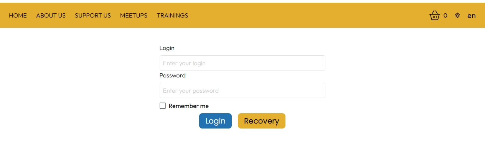

## Configuración y seguridad del back-office

Antes de configurar la conexión con el back-office, deberás crear una Hash única. Esto proporciona protección contra los actores maliciosos que intentan robar el enlace de conexión a su interfaz de admin.

Para crear Hash, ve a `/admin/Settings`. En la sección dedicada a la seguridad (por ejemplo, `Admin Hash`), define una cadena única (Hash). Una vez registrado, se modificará la URL del back-office (por ejemplo, `/admin-yourhash/login`) para restringir el acceso a personas no autorizadas.

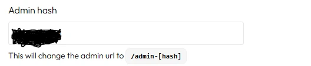

2.2. Activar el modo de mantenimiento (si es necesario)

Todavía en /admin/Configuración, (Configuración > General a través de la interfaz gráfica) comprueba la opción "activar el modo de mantenimiento" en la parte inferior de la página.

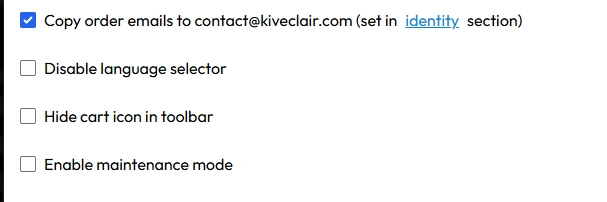

Si es necesario, puedes especificar una lista de direcciones IPv4 autorizadas (separadas por comas) para permitir el acceso al front office durante el mantenimiento. El back office permanece accesible para los administradores.

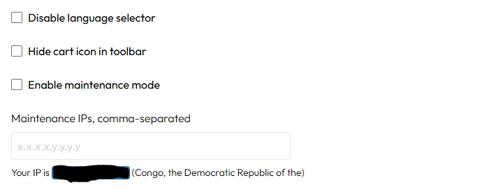

## Configuración de las comunicaciones

Para que be-BOP pueda enviar notificaciones (por ejemplo, de pedidos, registros o mensajes del sistema), debes configurar al menos un método de comunicación. Hay dos opciones disponibles: Correo electrónico (SMTP) o Nostr.

### Configuración SMTP (correo electrónico)

be-BOP puede enviar e-mails a través de un servidor SMTP. Necesitarás credenciales SMTP válidas, a menudo proporcionadas por un servicio de correo electrónico (por ejemplo, Mailgun, Gmail, etc.).

Esto es lo que debes saber:

SMTP_HOST: Servidor SMTP Address (por ejemplo, smtp.mailgun.org)

SMTP_PORT: El puerto a utilizar (a menudo 587 o 465)

SMTP_USER: Tu nombre de usuario (normalmente una dirección de correo electrónico)

SMTP_PASSWORD: Tu contraseña o clave API

SMTP_FROM: La dirección de correo electrónico que aparecerá como remitente

### Configuración Nostr

be-BOP permite enviar notificaciones a través del protocolo Nostr, una infraestructura de mensajería descentralizada. Para ello, necesitas generar o introducir una clave privada de Nostr (NSEC). Puedes generar esta clave directamente a través de la interfaz de be-BOP, en la sección dedicada a Nostr. Cuando estos elementos estén correctamente configurados, be-BOP podrá enviar automáticamente mensajes y alertas a sus usuarios.

## Formas de pago compatibles

be-BOP es compatible con varias soluciones de pago, lo que te permitirá ofrecer a tus clientes una mayor flexibilidad. Esto es lo que necesitas para configurar el método de pago que más te convenga.

### Bitcoin On.chain

be-BOP permite aceptar pagos de Bitcoin directamente en Blockchain (On-Chain), de forma sencilla y segura.

**Pasos de configuración:**

- Ir al menú **Configuración de pagos**
- Haz clic en **Bitcoin Nodeless** para acceder a los parámetros de pago de On-Chain.
- Rellena los siguientes campos:


| Champ                  | Description                                               | Exemple à utiliser                              |
|------------------------|-----------------------------------------------------------|--------------------------------------------------|
| **BIP Standard**       | Le type d’adressage utilisé                               | BIP84 (pour les adresses au format bech32 commençant par `bc1`) |
| **Clé publique étendue** | Votre Zpub (ou Xpub selon le portefeuille utilisé)        | `zpub...` (extrait de votre portefeuille Bitcoin) |
| **Derivation Index**   | L’index de départ pour la génération des adresses         | `1`                                              |
| **Mempool URL**        | L’URL du service mempool utilisé pour suivre les transactions | `https://mempool.space`                         |

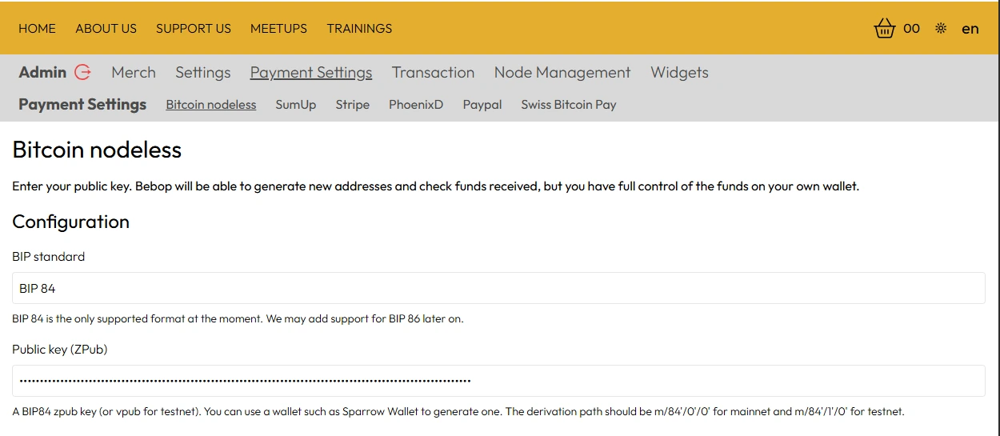

**Consejo:** Para obtener tu clave pública extendida (Zpub), consulta la configuración avanzada de tu billetera Bitcoin (Sparrow wallet, BlueWallet, Specter, etc.). Asegúrate de que tu billetera no es de  **dsólo lectura** si tienes intención de utilizar el historial de transacciones.

### Lightning Network

be-BOP también puede aceptar pagos instantáneos Bitcoin gracias a Lightning Network. Actualmente hay disponibles dos opciones de configuración:

**Phoenixd**

Ve al menú `Configuración de pagos`, haz clic en `Phoenixd`

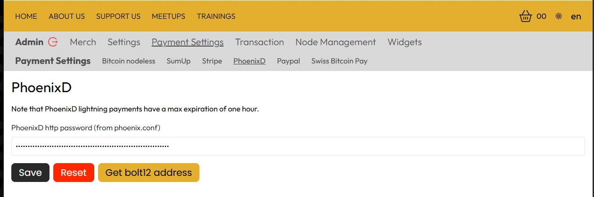


A continuación, tendrás que introducir **la contraseña o autenticación token** que te conecta a tu instancia Phoenixd, un backend desarrollado por Acinq que te permite gestionar pagos Lightning con tu propio nodo, pero sin la complejidad de gestionar canales de pago.

**Swiss Bitcoin Pay**

Si no quieres gestionar tú mismo un nodo Lightning, **Swiss Bitcoin Pay** es una solución lista para usar y fácil de configurar, ideal para empezar a aceptar pagos Lightning sin una infraestructura compleja.

Pasos de configuración:

- En el menú "Opciones de pago", haz clic en `Swiss Bitcoin Pay`
- Accede a tu cuenta de Swiss Bitcoin Pay (o crea una si aún no la tienes).
- Introduce la clave API proporcionada por Swiss Bitcoin Pay y, a continuación, haz clic en "Guardar"

Una vez configurado, be-BOP emitirá automáticamente facturas Lightning para tus clientes, y tu recibirás los pagos directamente en su cuenta Swiss Bitcoin Pay. Esta solución es ideal para usuarios que desean evitar la complejidad técnica de un nodo personal y, al mismo tiempo, aceptar pagos rápidos y de bajo coste.

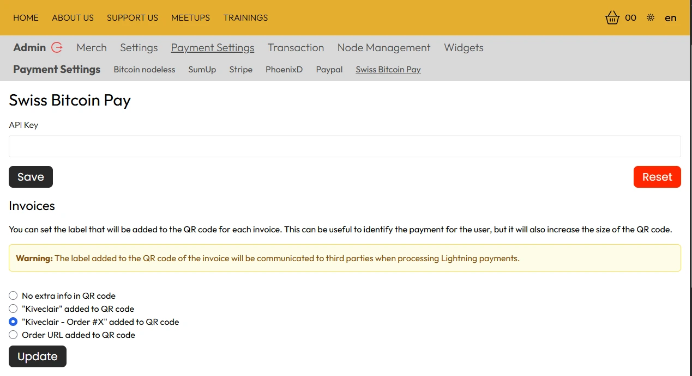

### PayPal

Además de Bitcoin, be-BOP también permite aceptar pagos en efectivo a través de PayPal, una solución internacional muy conocida y utilizada.

Pasos de configuración:

- Ir al menú `Configuración de pagos
- Haz clic en `PayPal
- En tu cuenta Paypal (sección desarrollador), introduce el `Client ID` y el `Secret`
- Selecciona la divisa de tu elección (por ejemplo, **USD**, **EUR**, **XOF**, etc.)
- Haz clic en `guardar

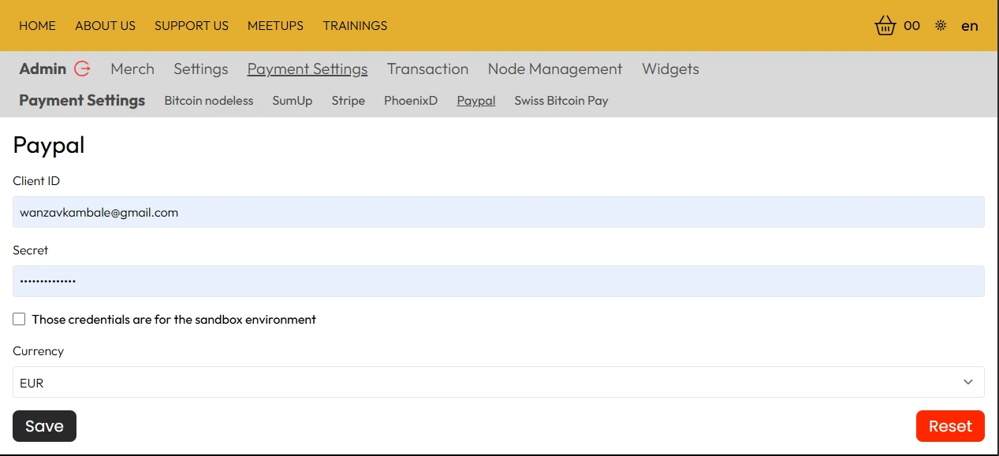

**Nota:** Deberás tener una cuenta PayPal Business para generar estos identificadores. Puedes obtenerlos a través del portal [desarrollador] (https://developer.paypal.com)

### SumUp

El software integra ahora la solución de pago **SumUp**, que permite aceptar pagos con tarjeta de crédito de forma sencilla, segura y eficaz. Para beneficiarse de esta funcionalidad, es necesaria una configuración inicial. He aquí los pasos a seguir, numerados para una implantación clara y progresiva:

- Empieza introduciendo tu **clave API**, una clave confidencial que SumUp te proporcionó cuando creaste tu cuenta de desarrollador. Establece una conexión segura entre tu cuenta de SumUp y el software.
- Rellena el campo `Código de comerciante` con el código único que identifica a tu negocio dentro de la plataforma SumUp. Este código es esencial para asociar las transacciones a tu negocio.
- En el campo `Moneda`, elije la moneda principal que utilizas para tus transacciones (por ejemplo, **EUR**, **USD**, **CDF**, etc.).
- Una vez que hayas rellenado todos los campos correctamente, haz clic en el botón `Guardar` para guardar la configuración. El sistema establecerá el enlace con tu cuenta de SumUp y tu software estará listo para aceptar pagos.

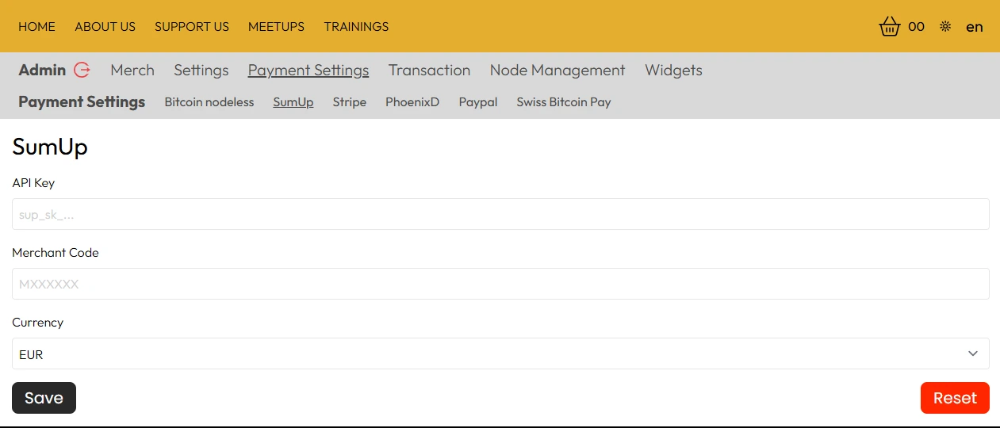

Tras esta configuración, la integración de **SumUp** estará activa y operativa, permitiéndote cobrar rápidamente y realizar un seguimiento de tus transacciones directamente desde el software.

### Raya

be-BOP también ofrece integración completa con **Stripe**, una de las plataformas de pago en línea más populares. Stripe permite aceptar pagos en línea a través de tarjeta de crédito, billetera digital y varios otros métodos de pago. He aquí cómo activarlo:

- Introduce la **clave secreta** proporcionada en el panel de Stripe.
- Rellena el campo **Clave pública**, también proporcionado por Stripe.
- Selecciona la **moneda principal**.
- Guarda la configuración y haz clic en `Guardar`.

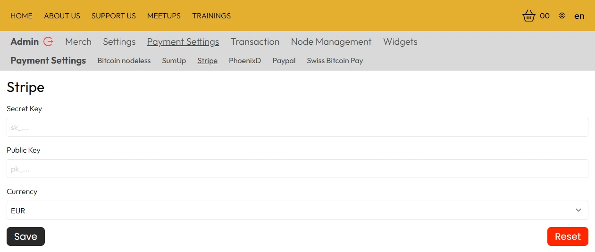

⚠️ **Por favor, ten en cuenta:** Es imprescindible conocer el régimen de IVA aplicable a tu actividad (por ejemplo: venta bajo IVA en el país del vendedor, exención bajo justificación, o venta al tipo de IVA del país del comprador) para configurar correctamente las opciones de facturación en **be-BOP**.

## Configuración de divisas

**be-BOP** ofrece una gestión avanzada de divisas y se adapta a entornos multidivisa y a requisitos contables específicos. Para garantizar la coherencia de las operaciones y los informes financieros, es esencial configurar correctamente las distintas divisas utilizadas en el sistema. A continuación se indican los pasos a seguir para esta configuración:

- Selecciona la **moneda principal** (`Main currency`)
- Selecciona `Moneda secundaria
- Define **moneda de referencia** (`Moneda de referencia del precio`)
- Indica `Moneda contable

Una vez configuradas correctamente todas las divisas, el software garantiza la conversión automática y precisa de las transacciones multidivisa, manteniendo al mismo tiempo una rigurosa coherencia contable.

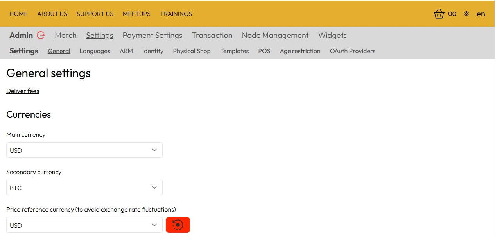

## Configuración del acceso de recuperación por correo electrónico o Nostr

Siempre en `/admin/settings`, a través del módulo **ARM**, asegúrate de que la cuenta de superadministrador incluye una **dirección de email** o un **recovery pub**, facilitando así el procedimiento si olvidas tu contraseña.

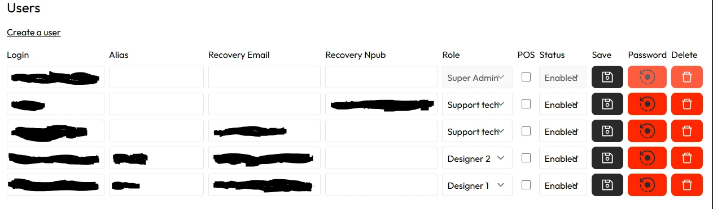

## Ajustes de idioma

El software ofrece capacidad multilingüe para adaptarse a un público internacional y mejorar la experiencia del usuario. Para activar la funcionalidad multilingüe, es importante configurar los idiomas disponibles y definir un **idioma predeterminado**.


## Interface y configuración de identidad en be-BOP

**be-BOP** proporciona a los diseñadores todas las herramientas que necesitan para diseñar un sitio web. El primer paso es abrir la sección `/Admin > Merch > Layout` en los ajustes. Empieza configurando la **barra superior**, la **barra de navegación** y el **pie de página**.

### Barra superior

La configuración **Barra superior** permite personalizar la identidad visual de tu software mostrando información clave desde la primera línea de la interfaz. Esto refuerza el reconocimiento de la marca y proporciona un contexto claro para los usuarios.

#### Pasos de configuración:

- En el campo "Nombre de marca", introduce el nombre de tu empresa, organización o producto. Este nombre aparecerá en la parte superior de la interfaz y representará tu identidad visual principal.
- **Indica el título del sitio web**: El título elegido debe resumir la finalidad de la plataforma. Este título puede aparecer en la cabecera o en la pestaña del navegador.
- **Añade descripción del sitio web**: Aquí es donde deberás introducir una breve descripción de tu iniciativa. Esta descripción ayuda a contextualizar la herramienta para los usuarios y también puede utilizarse con fines de SEO.

Una vez introducida esta información, la **barra superior** mostrará una presentación clara, profesional y coherente de tu solución.

#### Enlaces en la barra superior

La sección `Enlaces` de la barra superior permite añadir accesos directos a páginas importantes de tu aplicación o de sitios externos. Estos enlaces se muestran directamente en la barra superior, ofreciendo a los usuarios un acceso rápido y estructurado.

#### Pasos de configuración:

- **Introduce el nombre del enlace (Texto)**: En el campo `Texto`, introduce el nombre o etiqueta del enlace tal y como aparecerá (por ejemplo, Inicio, Contacto, Ayuda...).
- **Indica la dirección del enlace (Url)**: En el campo `Url`, introduce la dirección completa de la página de destino (interna o externa).
- **Añade otros enlaces si es necesario**: Cada línea de configuración permite añadir un enlace adicional utilizando los campos `Text` y `Url`.
- **Guardar enlaces**: Una vez introducidos Todos los enlaces, haz clic en el botón "Añadir enlace de la barra superior" para guardarlos.

Esta configuración permite ofrecer una navegación clara, fluida y accesible por las distintas secciones de tu sitio web o hacia recursos complementarios.

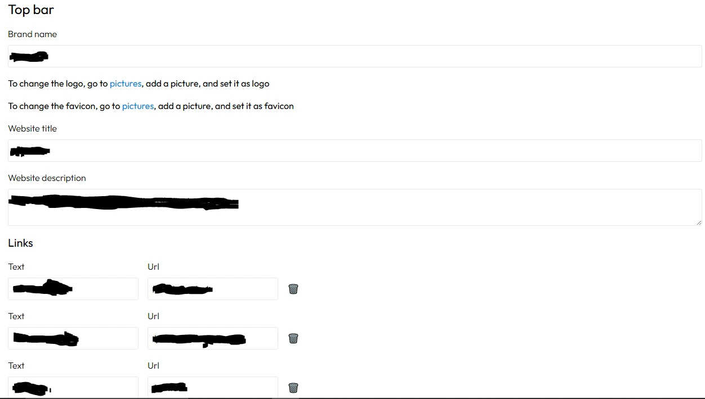

### La Nav Bar

La sección **Navbar** permite configurar el menú de navegación principal de tu be-BOP, normalmente situado en la parte lateral o superior de la interfaz. Este menú guía a los usuarios a las distintas páginas y funciones de la aplicación. La configuración del enlace es sencilla e intuitiva. Funciona de la siguiente manera:

- **Introduce el nombre del enlace (`Text`)**: En la línea de configuración, comienza rellenando el campo `Text`. Corresponde al nombre del enlace que aparece en la barra de navegación (ejemplos: *Dashboard*, *Users*, *Settings*...).
- **Introduce el Address del enlace (`Url`)**: Junto al campo `Text`, encontrarás el campo `Url`. En este campo, introduce la dirección de la página a la que debe redirigir el enlace. Puede ser una ruta interna o un enlace a una página externa.
- **Añadir varios enlaces si es necesario**: Debajo de la primera línea, hay nuevos campos `Text` y `Url` disponibles para añadir tantos enlaces como sea necesario. Cada línea representa un enlace de navegación adicional.
- **Guardar enlaces**: Una vez que hayas introducido todos los Elements, haz clic en el botón `Añadir enlace a la barra de navegación` para guardar y mostrar los resultados en la barra de navegación.

Esta configuración permite estructurar eficazmente el acceso a las distintas partes del software, mejorando la ergonomía y la experiencia del usuario.

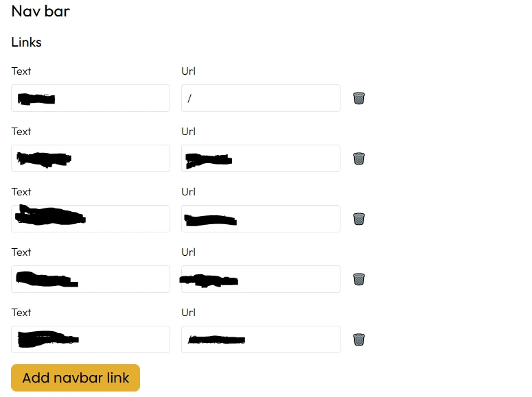

### Pie de página

La sección **Pie de página** le permite personalizar el pie de página de tu programa, añadiendo información útil o enlaces. Antes de configurar los enlaces, empieza por activar una opción específica:

- **Activar la visualización de la etiqueta "Powered by be-BOP "**: Activa el botón `Display Powered by be-BOP` para mostrar esta etiqueta en el pie de página.
- **Introduce el nombre del enlace (`Text`)**: Rellena el campo `Text`, que corresponde al texto del enlace en el pie de página (ejemplos: *Condiciones generales*, *Privacidad*, *Contacto*...).
- **Indica la dirección del enlace (`Url`)**: En el campo `Url`, introduce la dirección de la página de destino (interna o externa).
- **Añade más enlaces si es necesario**: Utiliza las líneas adicionales para crear tantos enlaces como desees.
- **Guardar enlaces**: Haz clic en el botón "Añadir enlace a pie de página" para guardar los enlaces.

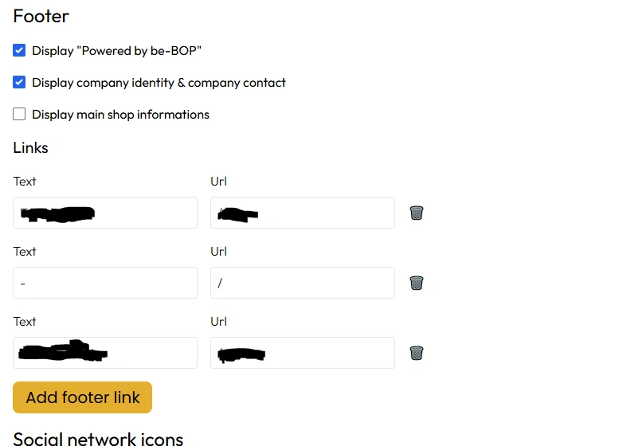

### Personalización visual

**⚠️ No olvides configurar los logotipos para los temas claro y oscuro, así como el favicon, a través de** `Admin > Merch > Pictures`.

A continuación te explicamos cómo personalizar el aspecto de tu sitio web:

#### Ir a la sección Imágenes

Menú `Admin` > `Merch` > `Imágenes`.

#### Añadir una nueva imagen

Haz clic en `Nueva imagen`.

#### Selecciona un archivo local

Haz clic en "Elegir archivos" y selecciona una imagen de tu disco duro.

#### Selecciona el archivo que deseas importar

Haz doble clic en la imagen que deseas importar (logotipo claro, logotipo oscuro o favicon).

#### Poner nombre a la imagen

Rellena el campo `Nombre de la imagen`.

#### Añadir imagen

Haz clic en `Añadir` para finalizar la importación.

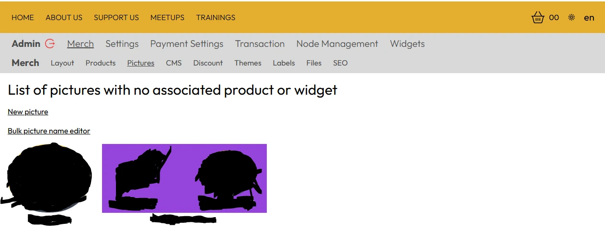

### Configuración de la identidad del vendedor

#### Configuración de la identidad

Accesible a través de `Admin > Identidad` (o `Configuración > Identidad`), esta sección permite configurar la información administrativa y legal de tu empresa.

#### Información jurídica

- **Razón social**: Nombre oficial de la empresa.
- **Identificación de la empresa**: Identificador legal o número de registro (RCCM, SIRET...).

#### Dirección empresarial

- **Calle**: Dirección postal (calle, número...).
- **País**: País.
- **Estado**: Provincia o región.
- **Ciudad**: Ciudad.
- **Código postal**: Código postal.

#### Información de contacto

- **Correo electrónico**: Dirección de correo electrónico profesional.
- **Teléfono**: Número de teléfono de la empresa.

#### Cuenta bancaria

- **Nombre del titular de la cuenta**: Nombre del titular de la cuenta.
- **Dirección del titular de la cuenta**: Dirección del titular.
- **IBAN**: Número internacional de cuenta bancaria.
- **BIC**: Código SWIFT/BIC.

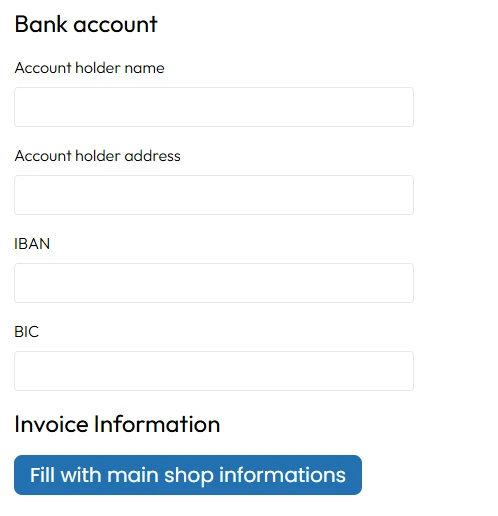

#### Facturación

- Haz clic en "Rellenar con la información principal de la tienda" para rellenar los datos.
- **Información del emisor arriba a la derecha**: Campo para la información legal/tributaria visible en las facturas.
- **Haz clic en "Actualizar"** para guardar los cambios.

**Nota:** también podrás introducir información adicional para que aparezca en la factura, según tus necesidades.


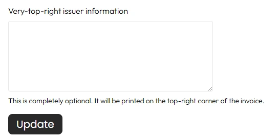

#### Dirección física de la Tienda

Para quienes tengan una tienda física, añade una dirección completa en `Admin > Configuración > Identidad` o una sección dedicada. Esto permitirá que aparezca en los documentos oficiales y en el pie de página si es necesario.

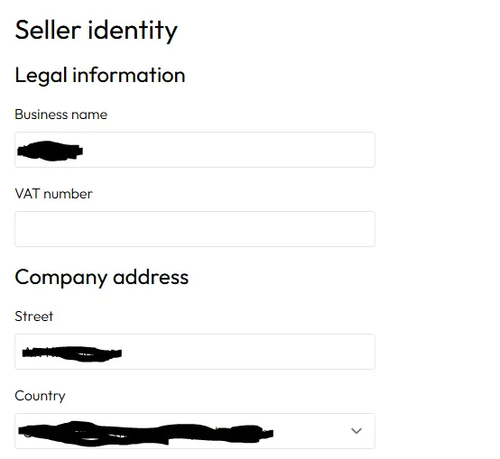

## Gestión de productos

### Crear un nuevo producto

Ve a `Admin > Merch > Products` para añadir o modificar un producto. Rellena los siguientes campos:

#### Información básica

- **Nombre del producto**: Nombre del producto (por ejemplo, *BOP T-shirt limited edition*).
- **Slug**: Identificador de URL sin espacios (por ejemplo, `tshirt-bop-edition-limitee`).
- **Alias** *(opcional)*: Util para añadir rápidamente a la cesta mediante un campo específico.

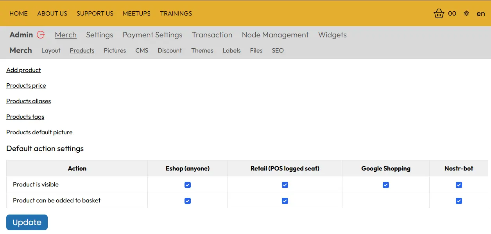

#### Precios

- **Precio Importe**: Precio del producto (por ejemplo, `25,00`).
- **Divisa del precio**: Divisa (EUR, USD, BTC, etc.).
- **Productos especiales** :
  - Este es un producto gratuito.
  - Este es un producto de pago por uso.

#### Opciones de productos

- **Producto único (`standalone`)**: Sólo es posible un añadido por pedido (por ejemplo, donación, entrada).
- **Producto con variaciones**:
  - No compruebes `Standalone`.
  - Marca `El producto tiene ligeras variaciones (no hay diferencia de stock)`.
  - Añadir:
    - **Nombre** (por ejemplo, *Tamaño*),
    - **Valores** (por ejemplo: S, M, L, XL),
    - **Diferencias de precio** si procede (por ejemplo: `+2 USD` para XL).

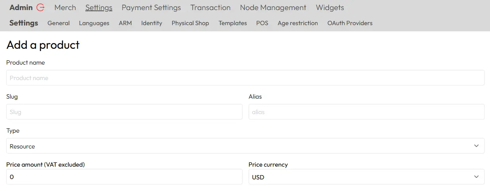

## Gestión de existencias

### Opciones avanzadas al crear un producto (Stock, Entrega, Tickets, etc.)

#### Producto con existencias limitadas

Si tu producto no está disponible en cantidades ilimitadas, marca `El producto tiene un stock limitado`. Esto activa el seguimiento automático de las cantidades restantes. Una vez marcada esta casilla, aparecerá un campo para indicar el **stock disponible**.

El sistema gestiona:

- **Existencias reservadas** → productos de las cestas aún no pagados
- **Existencias vendidas** → productos ya comprados

**Tiempo de reserva de la cesta**: Cuando un cliente añade un producto a su carrito, éste queda "reservado" durante un tiempo limitado. Puedes modificar este tiempo en: `Admin > Config > Reserva de cesta` (valor en minutos)

#### ¿Producto a entregar?

Marca `El producto tiene un componente físico que se enviará a la dirección del cliente`. Esto es útil para todos los productos que se enviarán físicamente (libros, camisetas, etc.)

#### Otras opciones

- **Entrada**: Marqca esta casilla si el producto es una entrada para un evento
- **Reserva**: Comprueba si se trata de una franja horaria de reserva (por ejemplo: sesión, cita)

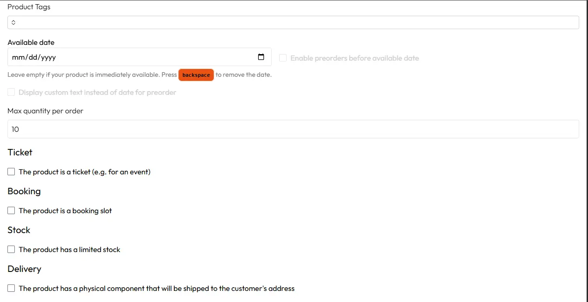

### Ajustes de acción (abajo)

Esta sección determina **dónde** y **cómo** se puede ver y comprar el producto:

| Plateforme        | Produit visible | Ajoutable au panier |
|-------------------|------------------|----------------------|
| Eshop (site public)        | ✔️              | ✔️                  |
| Retail POS (point de vente)| ✔️              | ✔️                  |
| Google Shopping            | ✔️              | ✔️                  |
| Nostr-bot (vente via bot)  | ✔️              | ✔️                  |

Marca sólo los canales que desees utilizar.

## Creación y personalización de páginas y widgets CMS

### Páginas CMS obligatorias


Ve a `Admin > Merch > CMS`. Verás una lista de páginas existentes y puedes añadir nuevas con **Añadir página CMS**.

Las páginas CMS son importantes para:

- Informar a tus visitantes (por ejemplo, condiciones de uso)
- Cumplir la ley (por ejemplo, la política de privacidad)
- Explicar determinadas características de la tienda (por ejemplo, recogida de IP, 0% de IVA)
Si lo deseas, puede añadir otras páginas:

- Quiénes somos
- Ayúdanos / Donaciones
- PREGUNTAS FRECUENTES
- Póngase en contacto con
- Etc.
  
**Consejo**: Haz clic en cada enlace o icono para modificar el **contenido**, el **título** o la **visibilidad** de cada página.

### Maquetación y gráficos Elements

Ve a : `Admin > Merch > Layout`. Puedes personalizar los elementos visuales de tu sitio:

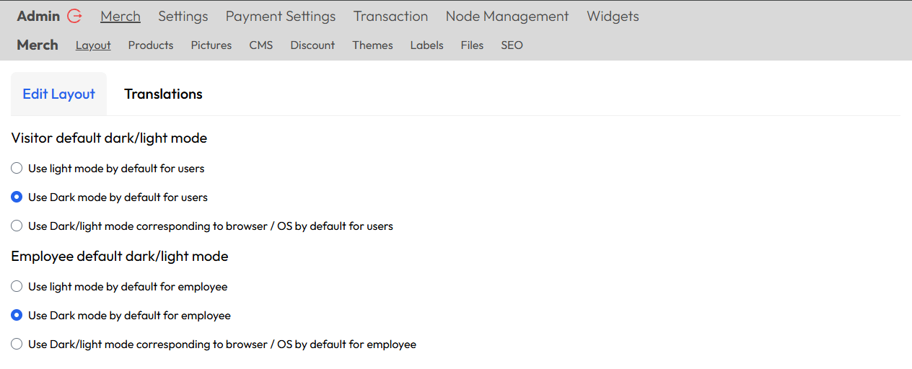

#### Barra superior

- Modificar o eliminar enlaces (EX: HOME, ABOUT US,...)
- Navegación entre las principales secciones del sitio

#### Navbar (barra de navegación principal)

- Presente en la zona gris debajo de la barra superior
- Contiene acceso rápido a : `Configurar`, `Configuración de pagos`, `Transacciones`, `Gestión de nodos`, `Widgets`, etc.
- Sólo directores

#### Pie de página

- Editable desde `Admin > Merch > Layout`
- Contiene: información de contacto, enlaces útiles, avisos legales..

#### Personalizar los elementos visuales

Ir a: `Admin > Merch > Pictures`

Podrás:

- Cambiar el **logotipo principal**
- Modificar o añadir diseño **imágenes**

#### Descripción

También modificable en `Imágenes`, permite mostrar un **resumen o eslogan** en la cabecera o pie de página, según el tema.

**Nota:** esto te permite ajustar la apariencia a tu identidad de marca (educativa, comercial o comunitaria).

### Integración de widgets en páginas CMS

Los **widgets** enriquecen sus páginas CMS con Elements dinámicos o visuales.

#### Creación de widgets

Ve a: `Admin > Widgets`

Ejemplos de widgets disponibles:

- **Desafíos**: Desafíos o misiones
- **Etiquetas**: Categorías o palabras clave
- **Sliders**: Carruseles de imágenes
- **Especificaciones**: Tablas de especificaciones
- **Formularios**: Formularios (contacto, comentarios, etc.)
- **Cuenta atrás**: Temporizadores
- **Galerías**: Galerías de imágenes
- **Tablas de clasificación**: Clasificaciones de los usuarios

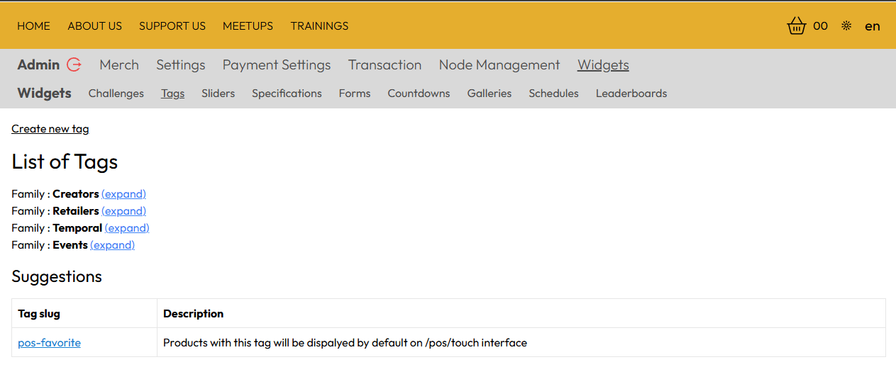

#### Integración en páginas CMS

Utiliza **códigos cortos** en el contenido de sus páginas CMS:

| Objectif                 | Balise à insérer                      |
|--------------------------|---------------------------------------|
| Afficher un produit      | `[Product=slug?display=img-1]`        |
| Afficher une image       | `[Picture=slug width=100 height=100 fit=contain]` |
| Intégrer un slider       | `[Slider=slug?autoplay=3000]`         |
| Ajouter un challenge     | `[Challenge=slug]`                    |
| Ajouter un compte à rebours | `[Countdown=slug]`                 |
| Intégrer un formulaire   | `[Form=slug]`                         |

**Parámetros actuales** :

- `slug`: Identificador único del widget
- `display=img-1`: Imagen específica del producto
- `width`, `height`, `fit`: Dimensiones y estilo de la imagen
- `autoplay=3000`: Tiempo en ms entre dos diapositivas

**Ventajas**:

- Fácil de insertar (copiar y pegar)
- Dinámico: Cualquier modificación del widget se refleja automáticamente
- No necesitas programador

## Gestión de pedidos e informes

### Seguimiento de pedidos

Para ver y gestionar pedidos anteriores, ve a: `Admin > Transacción > Pedidos`

Aquí encontrarás la **lista completa de los pedidos** realizados en tu sitio.

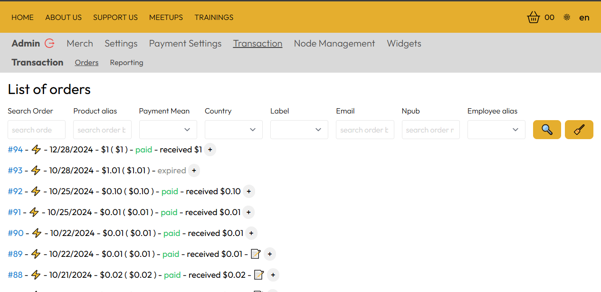

#### Visualización y búsqueda

La interfaz permite buscar y filtrar pedidos según varios criterios:

- Número de pedido: Número de pedido
- Alias del producto: Identificador o nombre del producto
- "Medio de pago": Medio de pago utilizado (tarjeta, criptomoneda, etc.)
- `Email`: Correo electrónico del cliente

Estos filtros facilitan las búsquedas rápidas y la gestión selectiva.

#### Detalles de cada pedido

Al hacer clic en un pedido, puedes acceder a un archivo completo que contiene:

- Productos solicitados
- Información al cliente
- Dirección de entrega (si procede)
- Cualquier nota asociada a la orden

#### Posibles acciones sobre una orden

Podrás:

- Confirmar pedido (si está pendiente)
- Cancelar un pedido (en caso de problema o petición del cliente)
- Añadir **etiquetas** (para organización interna)
- Consultar / añadir **notas internas**

**Nota:** Esta sección es esencial para una buena logística y relación con el cliente.

### Informes y exportación

Para acceder a las estadísticas de ventas y pagos:
administrador > Configuración > Informes

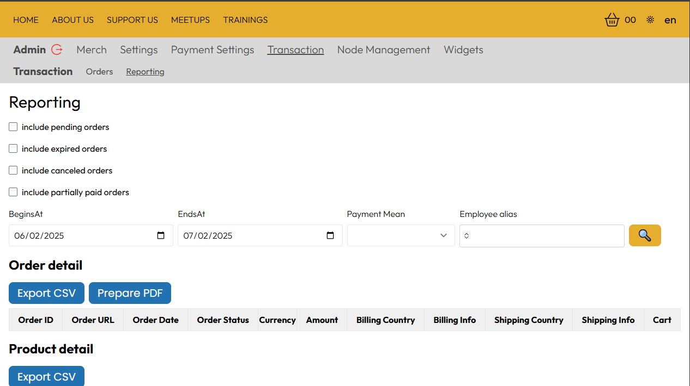

Aquí encontrarás una visión general de tu negocio, en forma de **informes mensuales y anuales**.

#### Contenido del informe

Los informes se dividen en secciones:

- **Detalle del pedido**: Número de pedidos, estado (confirmado, cancelado, pendiente), evolución
- **Detalle del producto**: Productos vendidos, cantidades, productos populares
- **Detalle de los pagos**: Importes cobrados, desglose por forma de pago

#### Exportación de datos

Cada sección incluye un botón **Exportar CSV**, que permite:

- Descargar datos en formato CSV
- Ábrelos en Excel, Google Sheets, etc.
- Archivado para uso administrativo o contable
- Utilízalos para informes internos

**Nota:** Ideal para el seguimiento del rendimiento, la contabilidad y las presentaciones.

## Configuración de Nostr Messaging (opcional)

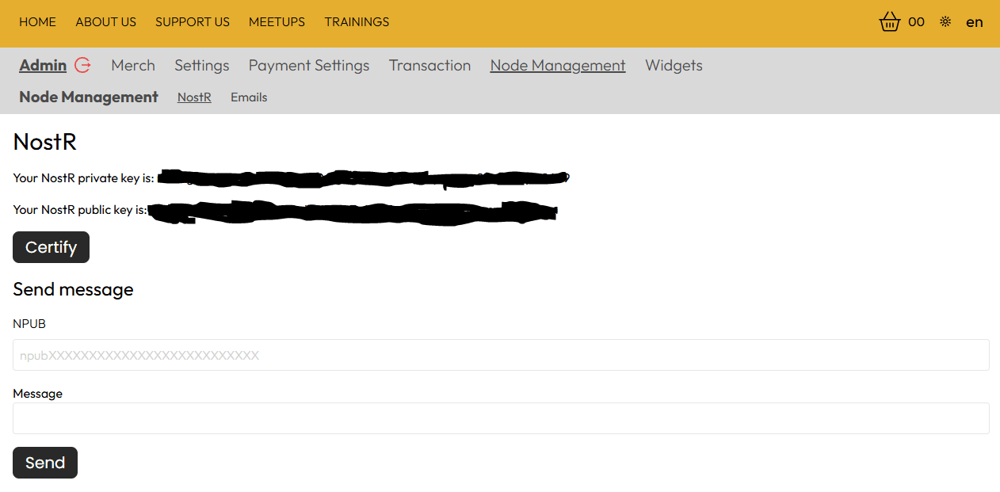

La plataforma es compatible con el protocolo **Nostr** para determinadas funciones avanzadas:

- Notificaciones descentralizadas
- Iniciar sesión sin contraseña
- Interfaz de administración ligera

### Generar y añadir la clave privada de Nostr

Ir a:
admin > Gestión de nodos > Nostr

- Haz clic en **Crear nsec** si no tienes uno.
- El sistema puede generarla automáticamente.
- También puedes utilizar una llave existente (por ejemplo, de Damus o Amethist).

Siguiente:

- Copia la clave `nsec
- Añádela a tu archivo `.env.local` (o `.env`): ```env NOSTR_PRIVATE_KEY=TuNsecIciKey

### Funciones activadas con Nostr

Una vez configurado, dispones de varias funciones:

**Notificaciones a través de Nostr**

- Enviar alertas de pedidos, pagos o eventos del sistema
- Para administradores o usuarios

**Interfaz de administración ligera**

- Accesible a través de un cliente Nostr
- Permite una gestión rápida y móvil

**Conexión sin contraseña**

- Inicio de sesión mediante enlace seguro (enviado a través de Nostr)
- Mayor seguridad y fluidez para el usuario

## Diseño y personalización de temas

Para adaptar la apariencia de tu tienda a tu imagen corporative, ve a: `Admin > Merch > Theme`

Aquí encontrarás todas las opciones para **crear** y **configurar** un tema personalizado.

### Crear un tema

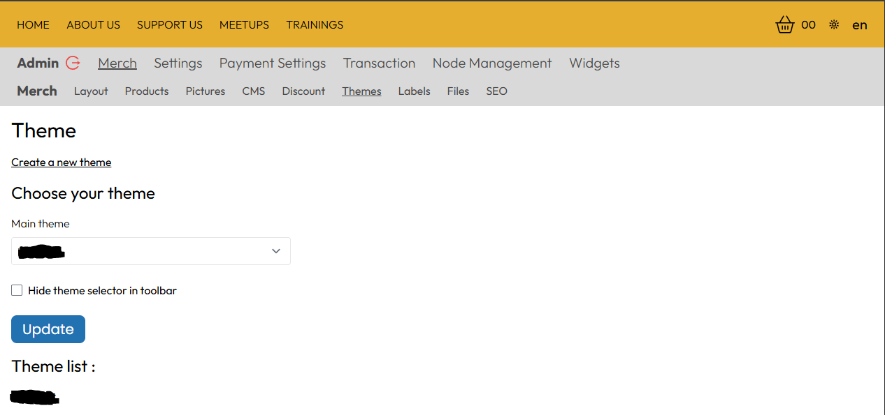

Al crear o modificar un tema, puedes definir:

- **Colores**: Ppara botones, fondos, texto, enlaces, etc.
- **Tipos de letra**: Elección de tipos de letra para títulos, párrafos y menús
- **Estilos gráficos**: Bordes, márgenes, espaciado, formas de bloque

### Secciones personalizables

Cada parte del sitio puede ajustarse de forma independiente:

- **Cabecera**: Barra de navegación superior
- **Cuerpo**: Ccontenido principal
- **Pie de página**: Parte inferior de la página

**Nota:** esta granularidad garantiza la coherencia entre los elementos visuales del sitio y la identidad de tu marca.

### Activación del tema

Una vez configurado el tema:

- Haz clic en **Guardar**
- Actívalo como **tema principal** de la tienda

**Nota:** el tema activo es el que será visible para los visitantes.

## Configuración de plantillas de correo electrónico

La plataforma permite personalizar los correos electrónicos que se envían automáticamente a los usuarios. Dirígete a: `Admin > Configuración > Plantillas`

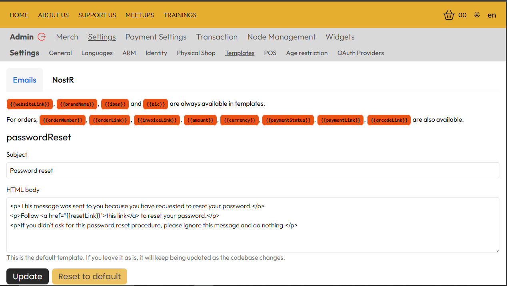

### Creación / edición de plantillas

Cada correo electrónico (confirmación de pedido, contraseña olvidada, etc.) tiene:

- **Asunto**: el asunto del correo electrónico (por ejemplo, "Su pedido ha sido validado")
- **Cuerpo HTML**: Contenido HTML mostrado en el correo electrónico

**Nota:** puede insertar texto, imágenes, enlaces, etc., según sea necesario.

### Uso de variables dinámicas

Para que los correos electrónicos sean dinámicos, inserte variables como:

- `{orderNumber}}` : sustituido por el número de pedido real
- `{invoiceLink}}` : enlace a la Invoice
- `{websiteLink}}`: URL de su sitio web

**Nota:** estas etiquetas se sustituyen automáticamente cuando se envían.

### Consejos avanzados

- Crear mensajes de correo electrónico **responsivos** para facilitar su lectura en dispositivos móviles
- Añadir **botones de acción** (pago, descarga, seguimiento del pedido)
- Prueba los correos enviándotelos a tí mismo antes de publicarlos

## Configuración de etiquetas y widgets específicos

### Gestión de etiquetas

Las etiquetas permiten estructurar y enriquecer los contenidos. Para acceder a ellas: `Admin > Widgets > Etiqueta`

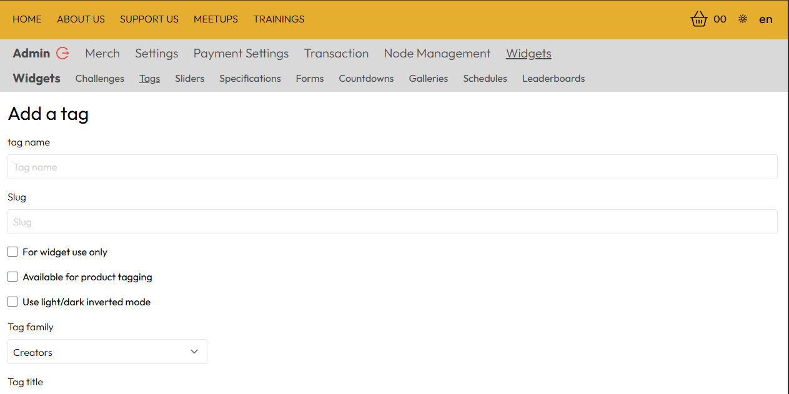

### Crear una etiqueta

Rellena los siguientes campos:

- **Nombre de la etiqueta**: nombre de la etiqueta mostrada
- **Slug**: identificador único (sin espacios ni acentos)
- **Familia de etiquetas**: agrupa las etiquetas por categorías

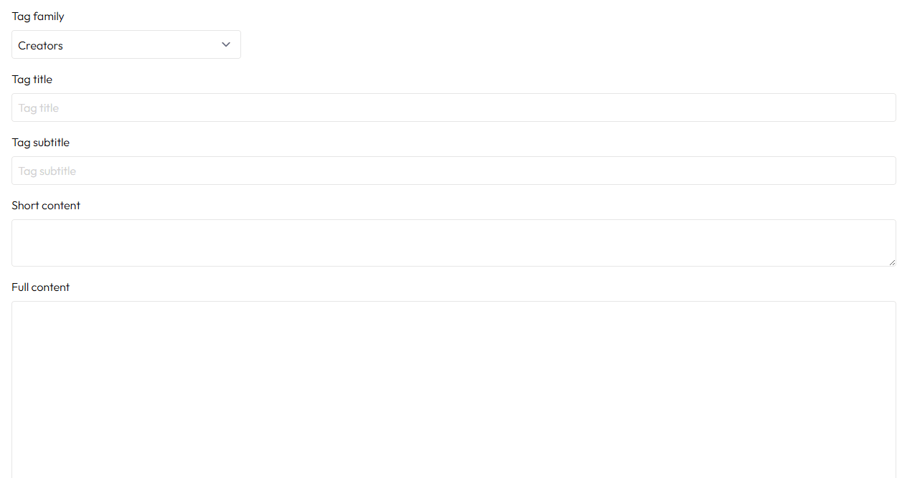

#### Familias disponibles:

- `Creadores`: Autores o productores
- `Minoristas`: Vendedores o puntos de venta
- `Temporal`: Periodos o fechas
- `Eventos`: Eventos asociados

### Campos opcionales

Estos campos pueden utilizarse para enriquecer una etiqueta como si fuera una página de contenido:

- Título
- Subtítulo
- Contenidos breves
- **Contenido completo**
- **CTA** (botones de acción)

### Uso de etiquetas

Las etiquetas pueden ser :

- Asignadas a productos
- Integradas en páginas CMS con una etiqueta: [Tag=slug?display=var-1]

## Configuración de archivos descargables

Para ofrecer documentos descargables a tus clientes: `Admin > Merch > Files`

### Añadir un archivo

1. Haz clic en **Nuevo archivo**
2. Ingresa:

   - **Nombre del archivo** (por ejemplo, *Guía de instalación*)
   - **Archivo a cargar** (PDF, imagen, Word...)

**Nota:** una vez añadido, la plataforma genera automáticamente un **enlace permanente**.

### A través del enlace

Este enlace puede insertarse en:

- **Página CMS** (como enlace de texto o botón)
- Un **cliente de correo electrónico** (a través de una plantilla)
- Una **hoja de producto** (por ejemplo, descarga del manual)

Es ideal para proporcionar *manuales de usuario, guías técnicas, fichas de producto...* sin necesidad de alojamiento externo.

## Nostr-bot

La plataforma ofrece integración avanzada con el protocolo **Nostr**, a través de un bot automatizado.

Vw a: nodo Gestión > Nostr

### Características principales

#### Gestión de relés

- Añadir o eliminar **relés** utilizados por el bot
- Optimizar el **alcance** y la **fiabilidad** de los mensajes enviados

#### Mensaje automático de introducción

- Activar un mensaje automático en **primera interacción del usuario**
- Ideal para:
  - Presentar tu servicio
  - Enviar un enlace útil (por ejemplo, FAQ, contacto, pedido)

#### Certificación de su `pub

- Añade un **logotipo** y un **nombre público**
- Enlace a un **dominio web verificado**
- Aumenta la credibilidad y el reconocimiento de tu identidad en Nostr

### Casos de uso de Nostr-bot

- Enviar **confirmaciones de pedido**
- Respuesta automática a **eventos (por ejemplo, un nuevo pedido)**
- Crear una **interacción descentralizada con el cliente**

## Sobrecarga de etiquetas de traducción

be-BOP es multilingüe (FR, EN, ES...), pero puede adaptar las traducciones a sus necesidades.

Para ello, ve a: `Configuración > Idioma`

### Carga y edición

Los archivos de traducción están en JSON. Podrás:

- **Descargar** archivos de idioma
- **Modificar** textos existentes
- **Añadir** tus propias traducciones

Enlace a los archivos originales:

[https://github.com/be-BOP-io-SA/be-BOP/tree/main/src/lib/translations](https://github.com/be-BOP-io-SA/be-BOP/tree/main/src/lib/translations)

**Ejemplo:** sustituye `Add to cart` por `Ajouter au panier` o `Acheter`.

## Trabajo en equipo y punto de venta (TPV)

### Gestión de usuarios y derechos de acceso

#### Creación de roles

Ve a: `Admin > Configuración > ARM`
Haz clic en **Crear un rol** para crear un rol (por ejemplo, `Super Admin`, `POS`, `Ticket checker`).

Cada rol contiene:

- **Acceso de escritura**: Acceso de escritura
- **Acceso de lectura**: Acceso de lectura
- **Acceso prohibido**: Secciones restringidas

#### Creación de usuarios

En el mismo menú `Admin > Configuración > ARM`, añada un usuario con:

- Inicio de sesión
- Alias
- Recuperación de correo electrónico
- (opcional) `recovery npub` para conexión vía Nostr

Asignar un rol previamente definido.

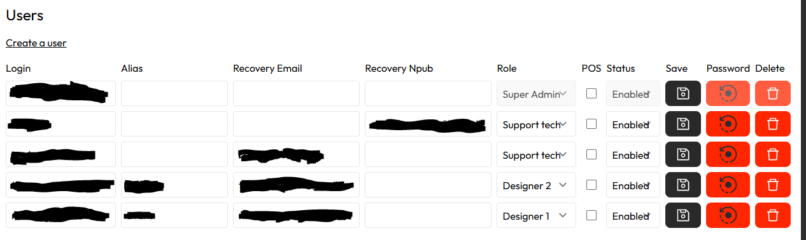

**Los usuarios de sólo lectura** verán los menús en *itálica* y no podrán modificar el contenido.

## Configuración del punto de venta (TPV)

### Asignación del rol POS

Para dar acceso a un usuario al TPV, asigna el rol `Punto de Venta (TPV)` en: `Admin > Config > ARM`

Puedes conectarte a través de la URL segura `/pos` o `/pos/touch`

### Funciones específicas para TPV

Be-BOP ofrece una interfaz dedicada a las ventas físicas (tienda, evento, etc.).

#### Adición rápida mediante alias

En `/cart`, un campo permite añadir un producto:


- Escaneando un **código de barras** (ISBN, EAN13)
- Introduciendo un **alias de producto** manualmente

**Nota:** el producto se añade automáticamente a la cesta.

#### Medios de pago

POS soporta :

- Especie
- Tarjeta de crédito
- Lightning Network (criptomoneda)
- Otros según configuración

Existen dos opciones avanzadas:

- **Exención del IVA**: aplicable a la justificación (ONG, extranjeros...)
- **Descuento regalo**: descuento excepcional con comentario obligatorio

#### Visualización en el cliente

La URL `/pos/session` está destinada a una **pantalla secundaria** (HDMI, tableta...):

Muestra:
- Productos en curso
- Importe total
- Forma de pago
- Descuentos aplicados

**Nota:** el cliente sigue el pedido en directo, mientras que el vendedor lo registra en `/pos`.

### Resumen del TPV

| Fonction                         | Description                                             |
|----------------------------------|---------------------------------------------------------|
| Rôle POS                         | Assigné via ARM                                         |
| Interface principale             | `/pos` ou `/pos/touch`                                 |
| Affichage client (écran 2)       | `/pos/session`                                         |
| Paiement                         | Espèces, carte, Lightning, etc.                         |
| Ajout produit                    | Alias ou scan code-barres                              |
| Remises / TVA                    | Sur justification managériale obligatoire              |


Gracias por seguir atentamente este tutorial.
