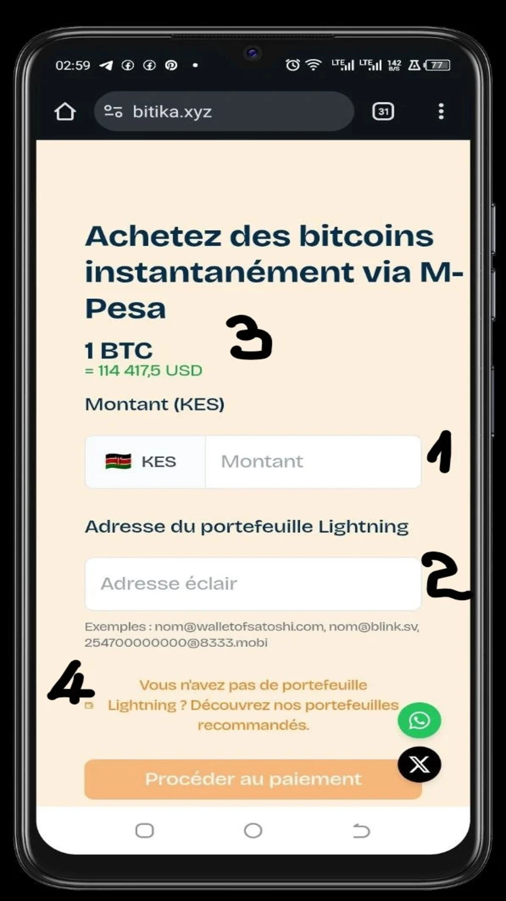
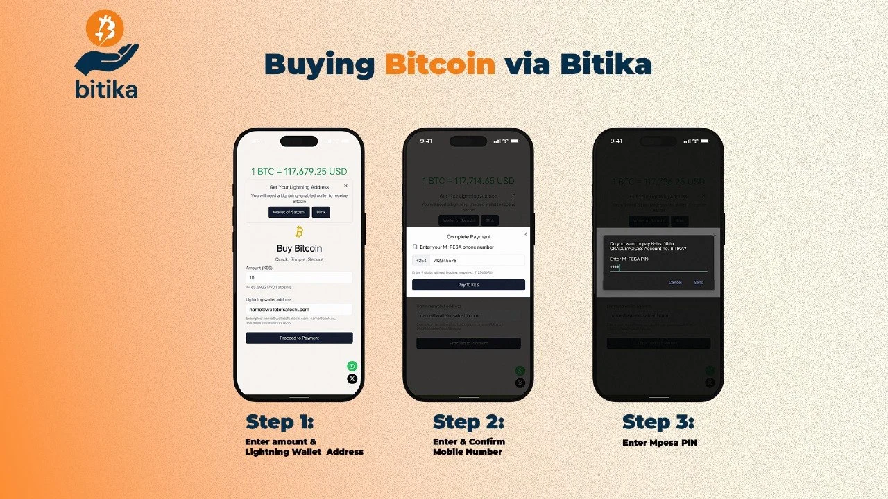
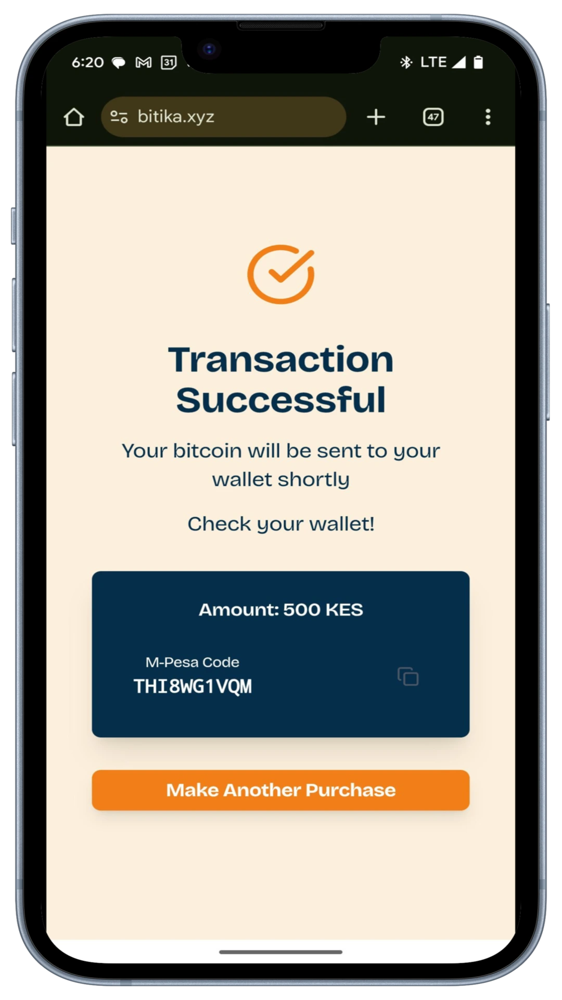
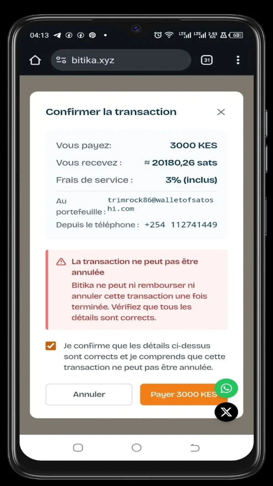
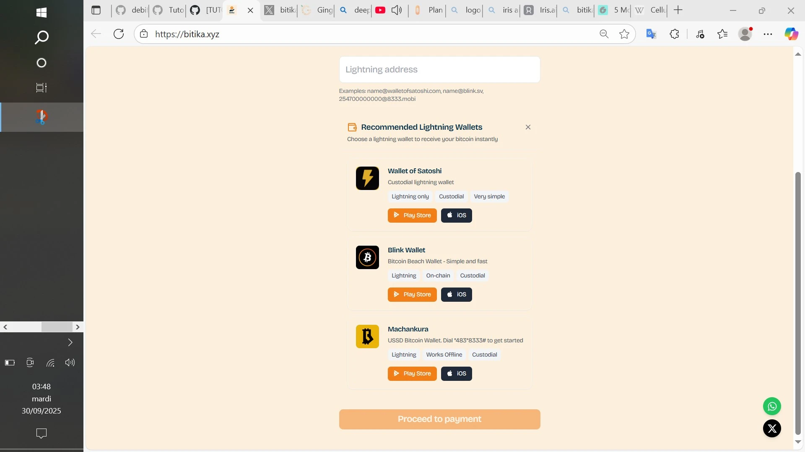

La création de richesse, l'intégration régionale et communautaire reposent sur les échanges économiques. Ces dernières favorisent la circulation de l'argent, stimule la consommation, etc. Au fil du temps, les échanges économiques ont pris différentes formes, allant du troc à l'économie numérique en passant par l'économie industrielle.

L'Afrique devient de plus en plus un terrain favorable à l'économie numérique, notamment au travers :
- des services de transfert d'argent mobiles (le premier service de transfert d'argent mobile — M-Pesa — est né au Kenya grâce à l'opérateur de réseau mobile Safaricom) ;
- et des actifs numériques (principalement Bitcoin pour ses caractères décentralisé, non censurable, etc.).

**FIDEL OTIENO**, ingénieur logiciel, a alors créé une solution — **Bitika** — qui allie Bitcoin et mobile money pour permettre aux populations d'accéder un peu plus aux services financiers.

La solution **Bitika** est une plateforme kényane pensée non pas pour imposer de nouveaux outils dans les transactions quotidiennes, mais pour accompagner la population locale vers Bitcoin en passant par M-Pesa auquel il se sont habitués depuis des années.

Les Kényans peuvent donc acheter des satoshis en trois étapes très simples sans KYC et sans passer par des échangeurs complexes.

#### Débuter avec Bitika

Pour utiliser la solution, rendez-vous sur la plateforme [Bitika](https://bitika.xyz/). 
Que ce soit sur votre ordinateur ou sur votre smartphone, l'interface demeure la même. 

           

Vous avez :
1. le champ prévu pour inscrire le montant ;
2. le champ prévu pour coller son adresse Lightning (uniquement des adresses) ;
3. le prix du Bitcoin en temps réel en dollars ;
4. les portefeuilles Lightning recommandés, si vous n'en aviez pas encore.

#### Les trois étapes de l'achat

Afin d'effectuer votre achat :
1. entrez le montant de votre achat (en **KES**) et l'adresse Lightning de votre portefeuille ;
2. entrez et confirmez votre numéro M-Pesa ;
3. entrez le code PIN de votre compte d'argent mobile M-Pesa pour confirmer votre achat.

Votre portefeuille est presque instantanément crédité de vos satoshis.

Veuillez notez que le montant de votre achat sur **Bitika** ne peut être **inférieure** à **50 KES** ni **dépasser** à **10 000 KES (Shilling Kényan)**. La plateforme a déjà été confrontée à une pénurie de satoshis (out of stock) en raison d'une forte demande. Cela démontre l'enthousiasme de la population locale à l'égard de la solution.

N'oubliez pas de vérifier attentivement les détails et de cocher la case avant d'initier le paiement. Aussi, des frais de service sont facturés.

En outre, la **vérification OTP**  a été ajoutée il y a quelques mois pour sécuriser les transactions à cause des scammers qui se faisaient passer pour des plateformes et incitaient les gens à envoyer de l'argent par M-pesa. Un code à usage unique est donc envoyé sur votre téléphone par SMS, valable pendant une courte durée. Vous devez ensuite le taper dans le champ prévu. Une fois validé, vous serez redirigés vers la page de paiement.

#### Les portefeuilles recommandés

**Bitika** vous recommande les portefeuilles Lightning tels que :
- Wallet of Satoshi ;

https://planb.network/tutorials/wallet/mobile/wallet-of-satoshi-39149d86-e42b-4e8f-ae9f-7e061e7784f7

- Blink ;

https://planb.network/tutorials/wallet/mobile/blink-7ea5f5a4-e728-4ff9-b3f9-cf20aa6fc2bd

- Machankura.

https://planb.network/tutorials/wallet/mobile/machankura-wallet-b41dd76d-a427-4cc1-992e-235dbb5884ae

Ces portefeuilles ne restent que des recommandations. Vous pourrez utiliser n'importe quel portefeuille qui supporte le Lightning Network, pourvu qu'il vous génère une adresse.

Pour rester informé des nouvelles actualités sur la solution, vous pouvez vous abonner à leur compte X (ex Twitter) ou écrire à leur numéro WhatsApp, en cliquant sur les icônes dans le coin inférieur droit.

Vous avez désormais la prise en main de la plateforme Bitika pour acheter vos bitcoins instantanément.

Découvrez également notre tutoriel sur Tando, une autre solution kényane qui vous permet de payer des biens et services, d'envoyer de l'argent ou de payer ses factures avec Bitcoin.

https://planb.network/tutorials/exchange/centralized/tando-14a3d2f3-09d2-41c9-9e00-2f616dabea5c