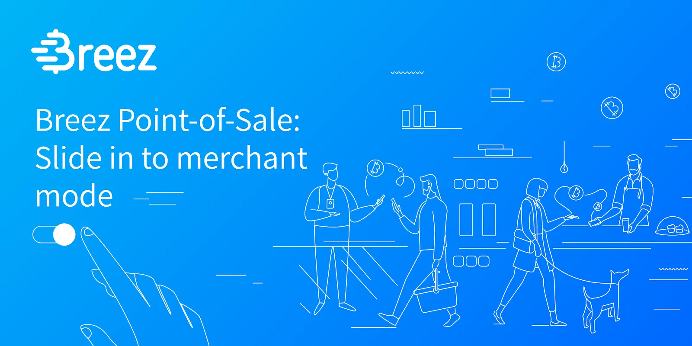

Desde a pandemia da COVID-19, os pagamentos digitais sem contacto generalizaram-se, mesmo nas lojas mais pequenas. Durante este período, muitas empresas descobriram o carácter prático das soluções de numerário Bitcoin, que lhes permitem receber pagamentos de todo o mundo. No entanto, estas soluções são por vezes difíceis de utilizar ou inadequadas para as pequenas empresas. Neste tutorial, vamos analisar o terminal de pagamento Breez, uma solução que se destaca pela sua facilidade de utilização, ao mesmo tempo que lhe dá um controlo total sobre a gestão dos seus bitcoins.

## Instalar o Breez POS

O Breez POS é um serviço de auto-custódia fornecido pelo Breez Wallet. A utilidade deste serviço é permitir que os comerciantes recolham pagamentos via Bitcoin enquanto permanecem num simples Interface, muito semelhante às várias carteiras Lightning. O Breez POS está disponível nas plataformas de transferência [Google Play Store](https://play.google.com/store/apps/details?id=com.breez.client) (Android) e [App Store](https://apps.apple.com/app/breez-lightning-client-pos/id1463604142) (iOS).

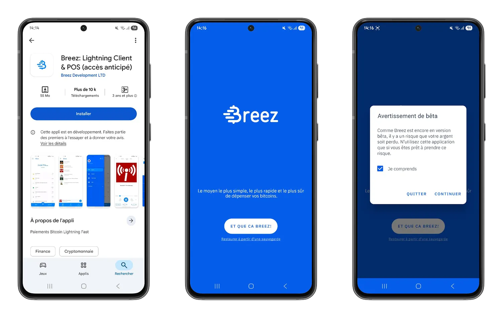

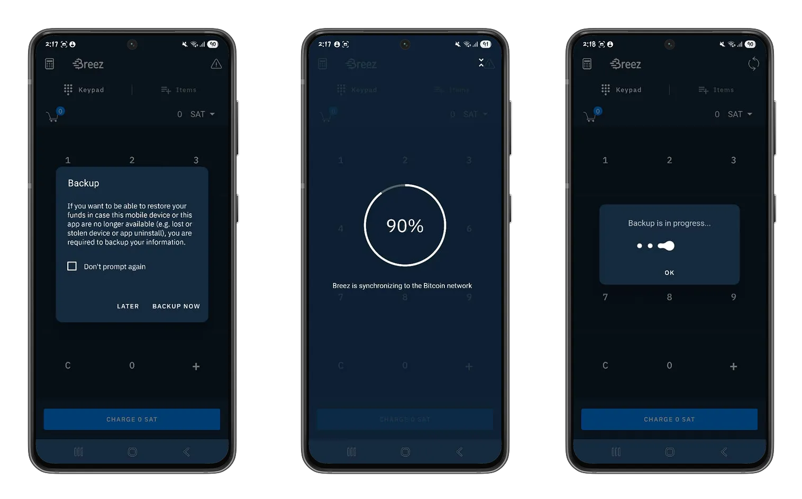

⚠️ É importante notar que estas aplicações ainda estão em desenvolvimento e que podem existir alguns erros na utilização das funcionalidades. Recomendamos uma utilização moderada.

Com esta aplicação, a Breez dá-lhe controlo total sobre as configurações de rede e definições de taxas, garantindo ao mesmo tempo a sua soberania na gestão dos seus bitcoins.

Pode explorar as várias opções do Breez Wallet seguindo o nosso tutorial abaixo. Este passo ajudá-lo-á a compreender melhor o ecossistema do ponto de venda e a adotar as melhores práticas para proteger eficazmente os bitcoins associados ao seu seed.

https://planb.network/tutorials/wallet/mobile/breez-46a6867b-c74b-45e7-869c-10a4e0263c06

https://planb.network/tutorials/wallet/backup/backup-mnemonic-22c0ddfa-fb9f-4e3a-96f9-46e2a7954270

## Utilização do Breez POS

Neste tutorial, vamos centrar-nos na secção "*Ponto de venda*" para o ajudar a compreender como integrá-lo como meio de pagamento na sua empresa.

O ponto de venda é uma parte integrante da carteira Breez e depende principalmente do Lightning Network para recolher os pagamentos.

No menu "*Ponto de venda*", encontra um Interface para a recolha de pagamentos. Está dividido em duas partes:

### Débito direto

A primeira parte é o teclado de débito direto. Este Interface é útil para cobrar um único pagamento quando conhece o total de compras dos seus clientes ou quando não necessita de um catálogo fixo de produtos na sua empresa (por exemplo, serviços freelance).

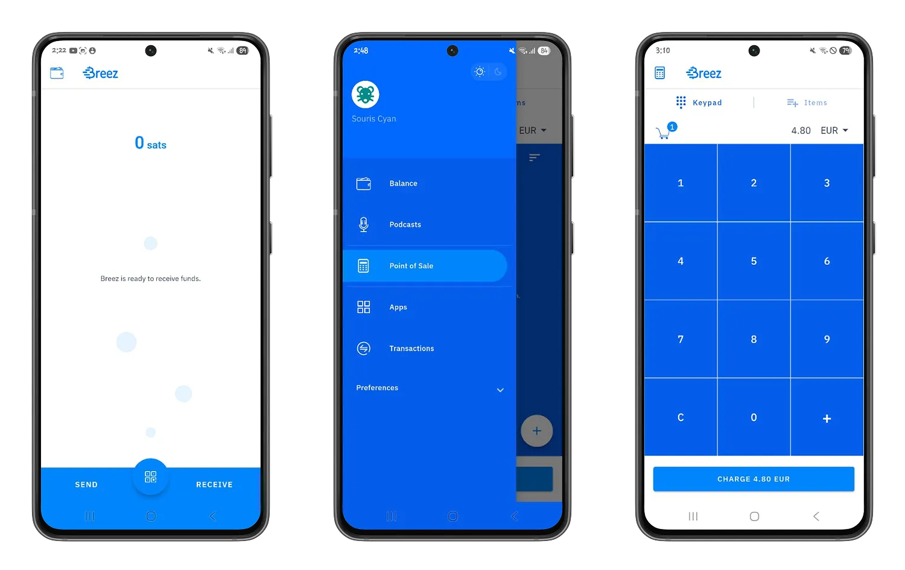

Para utilizar o POS Breez pela primeira vez, terá de receber um pagamento de mais de 2.500 satoshis (cerca de 3 euros à taxa atual do Exchange). Este montante, pago apenas no seu primeiro levantamento, representa o custo da criação de um canal de pagamento para que possa comunicar com outros nós Lightning Network e enviar e receber satoshis.

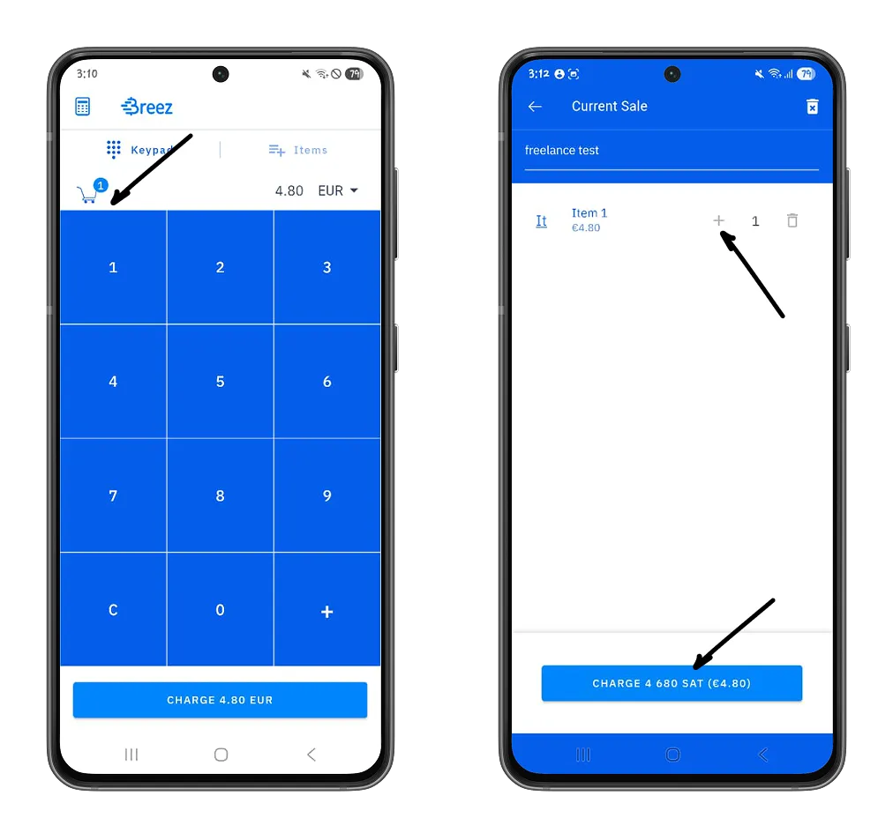

### Catálogo de produtos

A segunda parte é o catálogo de produtos. Este Interface é ideal quando se dispõe de um catálogo de produtos com preços pré-definidos. Aqui pode pré-configurar os seus produtos e depois utilizá-los nas facturas generate para melhorar a rastreabilidade das suas receitas de caixa.

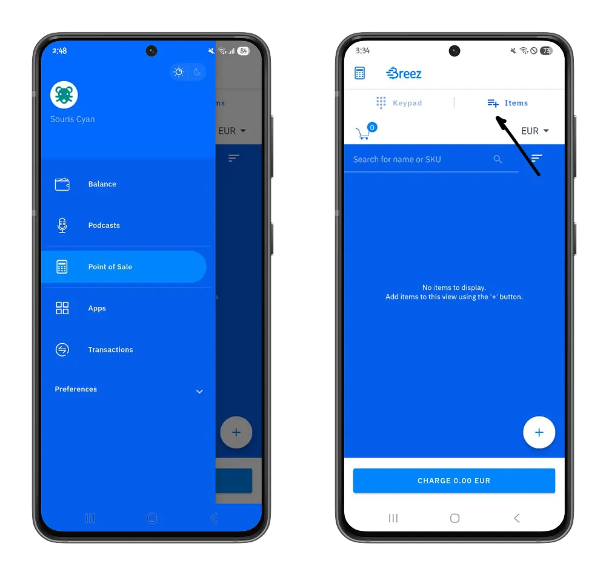

Pode configurar manualmente cada item deste Interface clicando no botão "**Mais**" e, em seguida, definindo o nome, o preço e um identificador para este item.

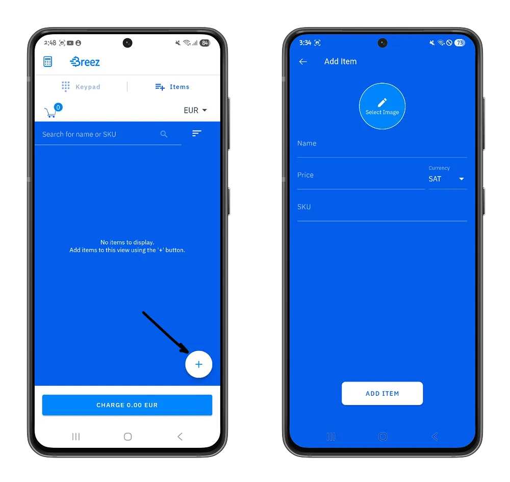

Pode então adicioná-lo e definir a sua quantidade para cobrar o pagamento associado.

Quando o seu catálogo é bastante grande, pode tornar-se complicado adicionar os seus produtos um a um. Para este efeito, na secção **Preferências > Definições do ponto de venda**, no menu "Lista de artigos", pode importar e exportar automaticamente a sua lista de artigos a partir de ficheiros CSV.

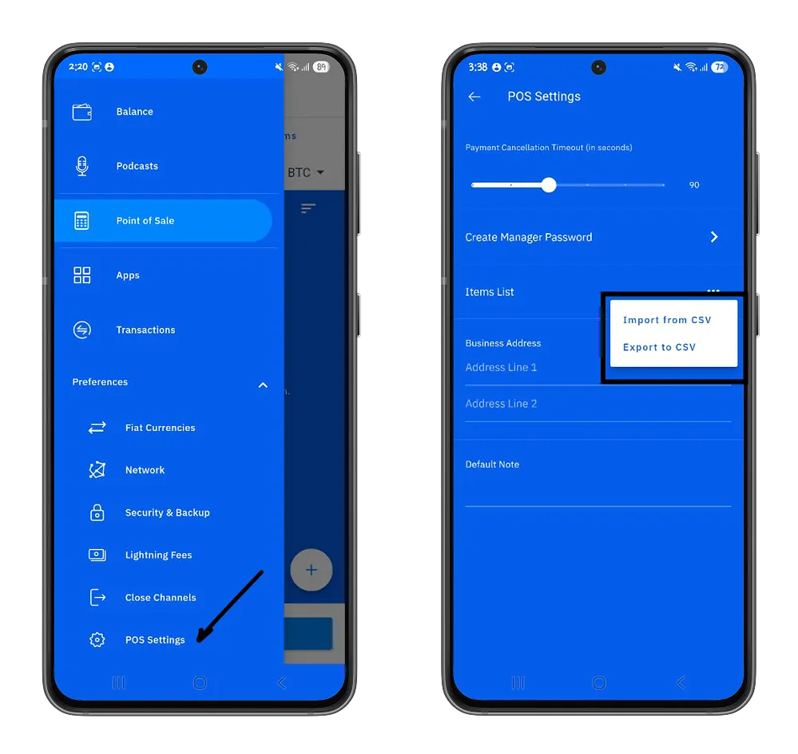

Nesta mesma secção, pode definir o período de validade das suas facturas Lightning. A partir de agora, para todas as suas facturas, os seus clientes têm `N` segundos para efetuar o pagamento, caso contrário terá de gerar novamente uma nova Lightning Invoice.

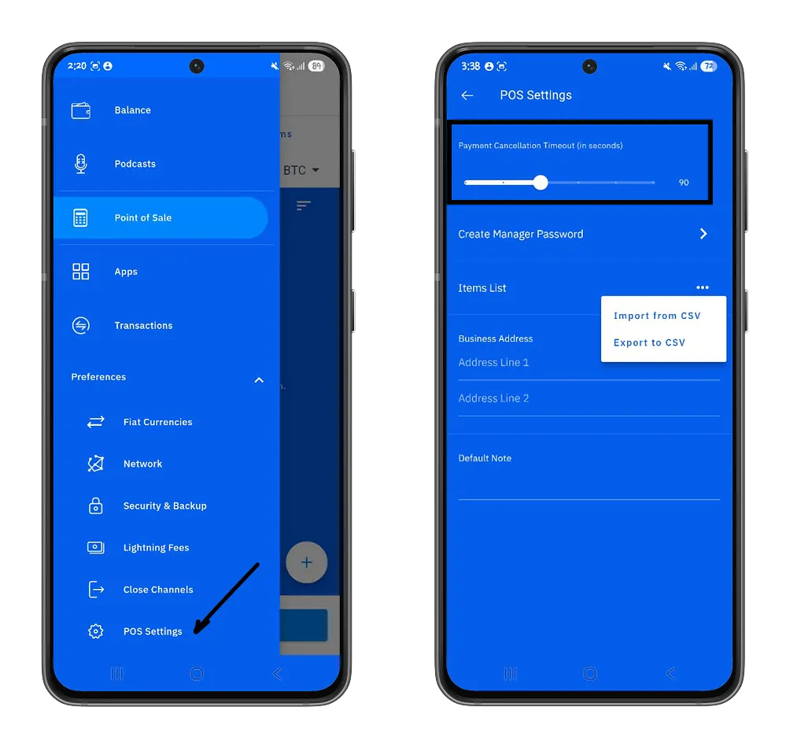

Como gestor, pode reforçar a segurança das suas bitcoins adicionando uma palavra-passe que será necessária para todos os pagamentos efectuados a partir do seu Wallet. Esta funcionalidade é particularmente útil quando não é o único a gerir o seu ponto de venda.

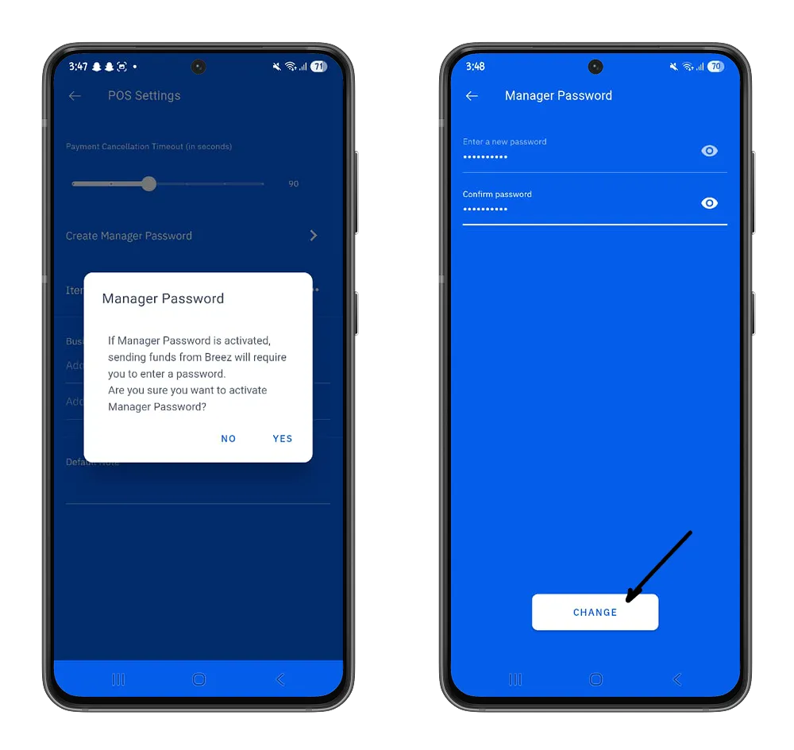

No menu **Transacções**, encontrará uma lista de todos os pagamentos que cobrou. Pode também filtrar os resultados por um período específico, clicando no botão **Calendário**.

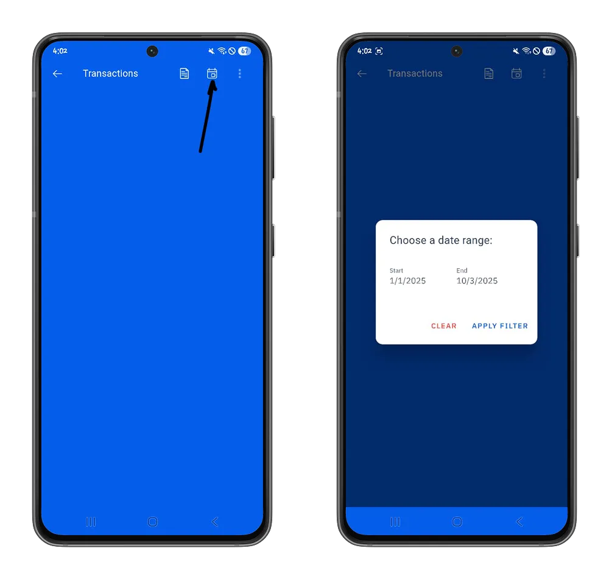

Pode também visualizar um resumo diário das suas vendas e o montante total cobrado clicando no botão **Documento**.

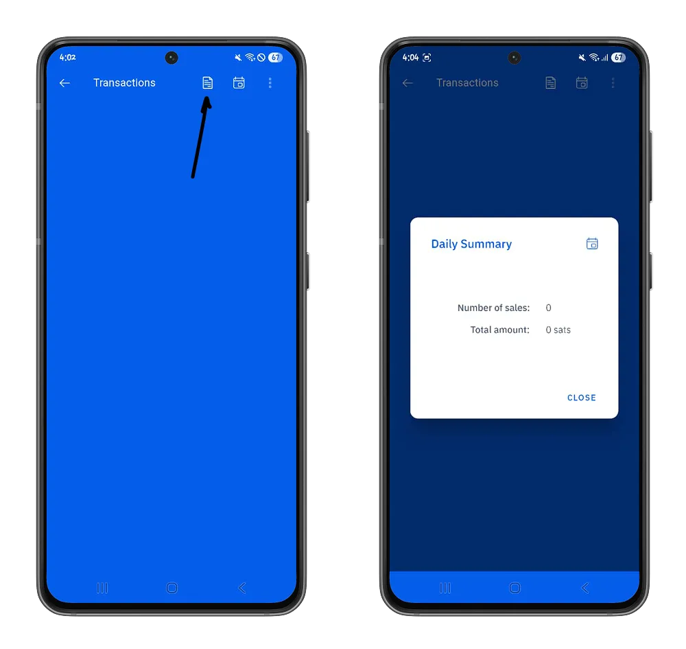

Agora tem uma noção completa do ponto de venda oferecido pela aplicação Breez para uma integração perfeita do Bitcoin no seu negócio. Se achou este tutorial útil, recomendamos o nosso tutorial sobre o be-BOP, uma plataforma de comércio eletrónico que lhe permite aceitar pagamentos em bitcoins e rentabilizar o seu negócio.

https://planb.network/tutorials/business/point-of-sale/be-bop-d8c40a3b-9090-48e7-9ba7-235d0c17e5fa