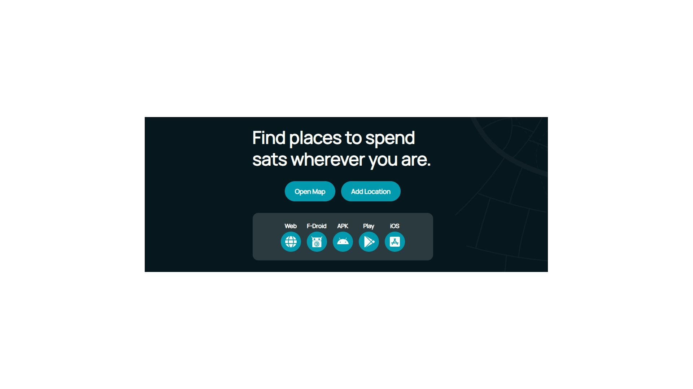

Tandis que beaucoup réduisent encore Bitcoin à un outil d'investissement et de spéculation, son créateur Satoshi Nakamoto l'avait avant tout conçu comme un système de paiement électronique Peer-to-Peer. Il est cependant difficile de savoir où l’on peut dépenser ses bitcoins. Enfin ça, c’était avant BTC Map.

S’appuyant sur OSM (OpenStreetMap), lui même un outil open-source de cartographie participative, BTC Map propose dans la plus grande simplicité de recenser les établissements qui acceptent les paiements en BTC, Lightning ou on-chain. Une base de donnée mondiale, encore naissante mais déjà essentielle, alimentée par et pour les bitcoiners.

Rendez-vous sur [btcmap.org](https://btcmap.org/) :

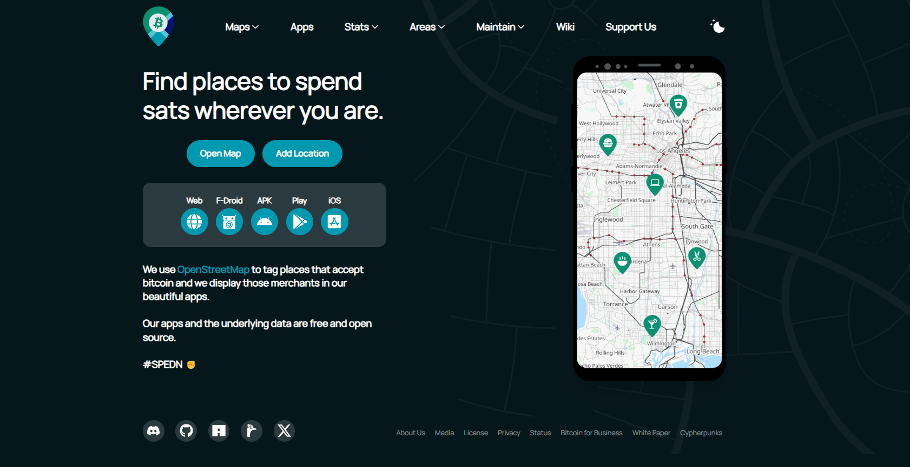

Disponible sur :
- iOS via l’AppStore
- Android via le Play Store
- F-Droid le catalogue d’applis open-source sur android
- en téléchargeant directement l’apk android sur le github du projet
- via l’appli web depuis votre navigateur

Aujourd’hui nous resterons sur la version web. Elle est pour le moment intégralement en anglais, aussi allons-nous voir ensemble les différentes rubriques. J'ajoute que si un bouton ou un lien dysfonctionne, je vous conseille un clic droit -> ouvrir dans un autre onglet.

Commençons. La petite icône de lune ou de soleil en haut à droite permet de basculer d’un thème clair à un thème sombre.

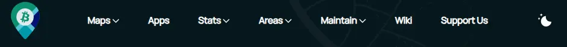

Les différents onglets en haut du site, de gauche à droite :
- le logo BTC Map : revenir à la page d’accueil 
- « Maps » : le cœur du produit, avec les deux cartes (établissements et communautés)
- « Apps » : les différents supports sur lesquels installer BTC Map
- « Areas » : présentation et stats des communautés, par continent et par pays
- « Maintain » : pour participer à l’actualisation et l’enrichissement des cartes
- « Wiki » : le GitHub du projet (anglophone)
- « Support Us » : les dons et sponsoring constituent l’unique source de revenu du projet

Accessoirement, ces onglets constitueront le sommaire de ce tutorial.

## MAPS

Le site vous propose deux cartes aux objectifs différents. Mais commençons par décrire les outils qui apparaissent sur le bord gauche de chacune d'entre elle :

   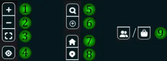

- 1 zoomer
- 2 dézoomer
- 3 grand écran
- 4 me localiser (si votre navigateur en a la permission)
- 5 (merchant map) rechercher un établissement par nom
- 6 (merchant map) n'afficher que les établissements boostés
- 7 revenir à la page d'accueil
- 8 (merchant map) ajouter un établissement
- 9 basculer de la carte "Community" à la carte "Merchant" et vice versa 

*note : Les établissements boostés sont ceux ayant reçu le pourboire d’un visiteur ou d’un utilisateur satisfait, leur assurant pour un temps une visibilité améliorée*

Vous constaterez également, en haut à droite de chaque carte, un bouton pour modifier le calque de la carte. Dans ce tutorial j'ai choisi de laisser la version dark.

### Merchant Map

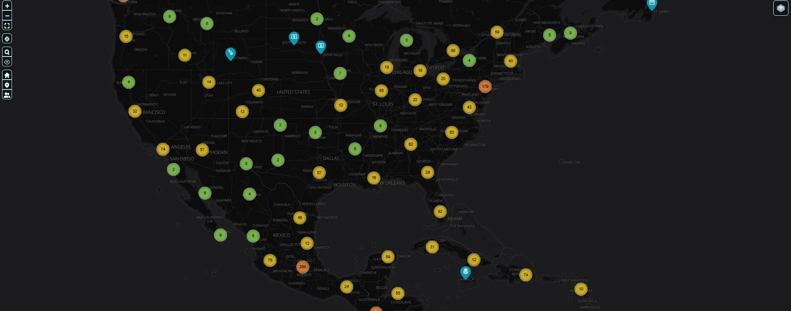

La « Merchant Map » liste les établissements dans le monde acceptant les paiements en BTC. On observe peut voir différents types d’icône lesquels sont un premier indice sur la nature de l’établissement (une pinte pour un bar, un diamant pour une bijouterie...). 

Considérons ce paysagiste texan :

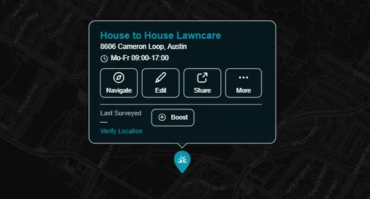

- Le nom en bleu de l'établissement
- l'adresse ainsi que les horaires d'ouverture, si renseignés sur OSM
- "Navigate" pour établir un itinéraire entre votre position et l'établissement
- "Edit" vous permettra de suggérer des modifications tenant à la fiche OSM (nécessite un compte OSM gratuit) à savoir le nom, les coordonnées, horaires etc
- "Share" vous emmène sur une fiche élargie de l'établissement
- "More" déroule les options suivantes :

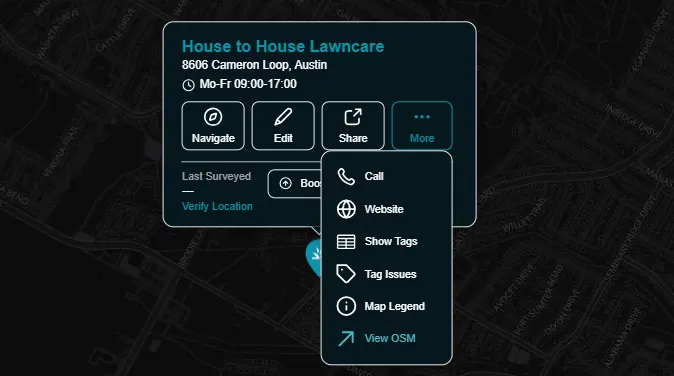

- "Call" constitue sur téléphone un raccourci afin d'appeler l'établissement, si le numéro est renseigné sur la fiche OSM
- "Website" vous emmène sur le site internet de l'établissement s'il est renseigné sur sa fiche OSM
- "Show Tags" affiche les éléments renseignés sur OSM sans déclencher d'hyperlien ou d'application
- "Tag Issues" et "Map Legend" sont à cette heure des liens morts
- "View OSM" vous invite à ouvrir la position de l'établissement sur l'application OSM

Enfin, 

- "Last Surveyed" vous indique la date à laquelle la fiche a été créée ou mise à jour en dernier
- "Boost" vous permet moyennant quelque sats d'offrir à l'établissement un avantage en visibilité sur le site, limité dans le temps
- "Verify Location" vous propose pour terminer d'accéder à un formulaire BTC Map pour proposer une actualisation de la fiche. Regardons comment ça se présente :

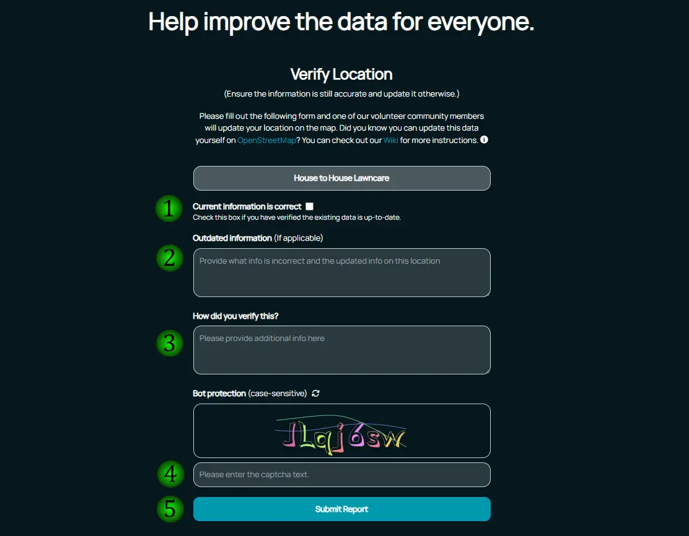

- 1 Cochez cette case si vous souhaitez juste confirmer que les informations de la fiche sont à jour (passez dans ce cas directement à l'étape 4)
- 2 Indiquez ici le cas échéant l'information erronée ainsi que la correction que vous proposez
- 3 Décrivez ici comment vous avez obtenu l'information (visite, appel...)
- 4 Procédez à la vérification captcha (attention aux majuscules / minuscules)
- 5 Cliquez sur "Submit Report" pour transmettre votre suggestion

### Community Map

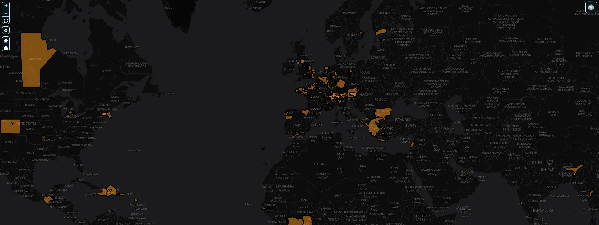

La « Community Map » vous propose de découvrir les différentes communautés Bitcoin de par le monde, en les répartissant et en les présentant de façon géographique. 

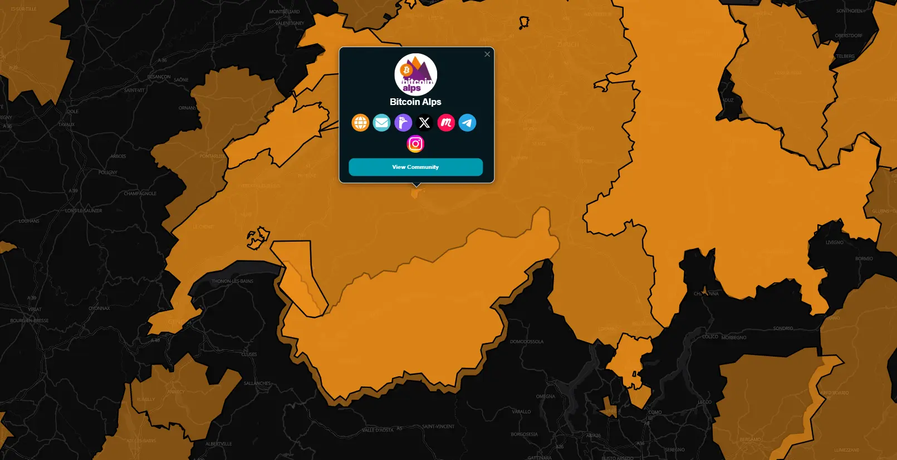

On constate immédiatement des zones colorées en orange. Vous l'avez compris, il s'agit des différentes communautés Bitcoin recensées sur BTC Map. D'un clic gauche sur l'une d'entre elles, on peut voir un petit encart qui nous présentera tous les liens renseignés, tels que le site internet et les comptes sur différents réseaux sociaux. Qui sait, vous êtes peut-être sans le savoir en plein centre d'une communauté active de Bitcoiners, à quelques clics seulement de la rejoindre si le cœur vous en dit!

## Les autres onglets du site

**Apps** : cette page vous rappelle les supports sur lesquels BTC Map est accessible.

**Stats** vous propose plusieurs statistiques sur l'application :
- Dashboard : statistiques sur l'alimentation de la base de donnée, comme le nombre de lieux répertoriés ou le nombre récent de vérifications apportées
- Tagger Leaderboard : tableau des utilisateurs classés par volume de contribution (rejoignez les!)
- Community Leaderboard : classement des communautés
- Country Leaderboard : classement des pays

**Areas (zones)** vous présente autrement que par des cartes certaines informations :
- Communities : répertorie les différentes communautés inscrites, le formulaire pour en inscrire une nouvelle, ainsi que quelques statistiques, le tout regroupé par continent
- Countries : quelques statistiques regroupées par pays vous indiquent le nombre d'établissements, de participants, les fiches à mettre à jour...
  
**Maintain (entretenir)**
- Add Location : ajouter un établissement qui accepte les paiements en Bitcoin 
- Verify Location : actualiser / corriger les informations sur un établissement déjà recensé
- Add Community : ajouter une communauté (il y a une typo dans l'url, pour accéder au formulaire, passez par Areas -> Communities -> Add Community)
- Open Tickets : ici atterrissent les formulaires de demande d'ajout, de vérification, lieux et communautés, afin que des volontaires puissent les traiter
- Tagging Activities : vous montre les dernières actions prises par les participants au projet (tout utilisateur comme vous ou moi peut être un participant) comme les derniers lieux ajoutés, mis à jour voire supprimés...  
- Tagging Issues : ici sont répertoriées par les utilisateurs toutes les erreurs d'affichage (tag)

**Wiki** : Ce lien vous emmène sur la page GitHub du projet.

**Support Us** : Cette page vous indique comment faire un don (en sats) ou devenir sponsor du projet.

### "Add Community" (ajouter une communauté)

BTC Map vous permet d’ajouter un établissement acceptant le bitcoin. Voyons ensemble comment nous pouvons [ajouter soi-même une communauté](https://btcmap.org/communities/add/), étape par étape :

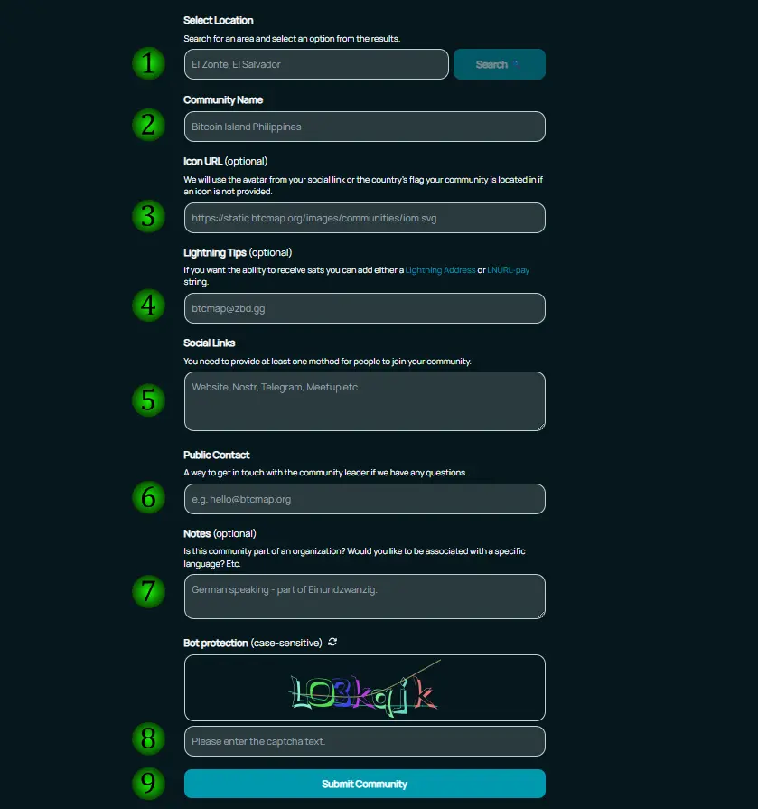

- 1 la zone correspondant à votre communauté
- 2 nom de votre communauté
- 3 l'URL du site internet
- 4 une adresse Lightning afin qu'y soient envoyés des pourboires
- 5 les références des réseaux sociaux sur lesquels est présente votre communauté
- 6 votre courriel afin que la plateforme puisse éventuellement vous demander de plus amples renseignements
- 7 une description concise (par ex : communauté germanophone, région de Francfort)
- 8 renseignez le captcha (attention aux majuscules minuscules)
- 9 cliquez sur "Submit Community" afin de transmettre le formulaire

### "Add Location" (ajouter un établissement)

[Cette page](https://btcmap.org/add-location/) vous montre comment ajouter vous-même la fiche d'un établissement en passant par Open Street Map. Si jamais vous éprouvez des difficultés, un formulaire est proposé pour que vous transmettiez toutes les infos, de sorte que quelqu'un puisse créer la fiche pour vous (cela peut prendre plusieurs semaines). Regardons ça ensemble :

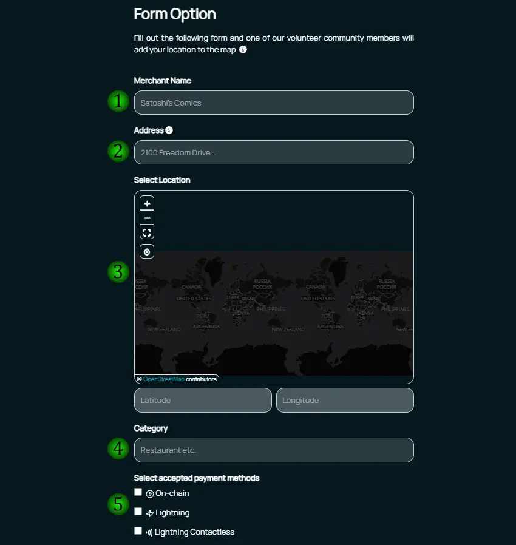

- 1 le nom de l'établissement
- 2 l'adresse physique (obligatoire, il faut pignon sur rue)
- 3 indiquez avec précision le point sur la carte
- 4 de quelle catégorie relève l'établissement ?
- 5 quels sont les supports de paiement Bitcoin possibles (BTC, Lightning, sans contact) ?
  
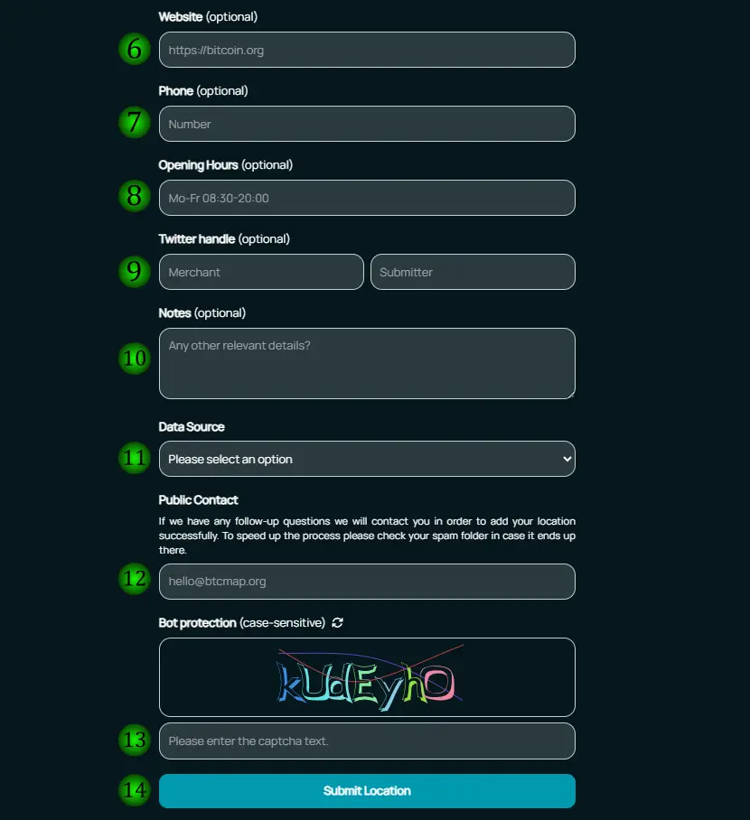

- 6 l'URL du site internet (facultatif)
- 7 un numéro de téléphone (facultatif)
- 8 les horaires d'ouverture (facultatif)
- 9 le compte X (twitter) de l'établissement, puis le votre (facultatif)
- 10 tout détail que vous jugez judicieux
- 11 votre rôle 
	 - "I am the business owner" : Je suis le gérant de l'établissement
	 - "I visited as a customer" : J'ai rendu visite à cet établissement en tant que client
	 - "other method" : autre
- 12 votre courriel au cas où la plateforme souhaiterait de plus amples renseignements
- 13 vérification captcha (attention aux majuscules minuscules)
- 14 cliquez sur "Submit Location" afin d'envoyer votre fiche

En bas de page, plusieurs onglets peuvent également vous intéresser si la langue de Shakespeare ne constitue pas pour vous un obstacle. Le manifeste des cypherpunks par Eric Hughes, publié le 9 mars 1993, ou encore le livre blanc de Satoshi Nakamoto publié le 31 octobre 2008, sont présents.
Pour aller plus loin, vous retrouverez les différentes plateformes de réseaux associées à BTC Map.

  

