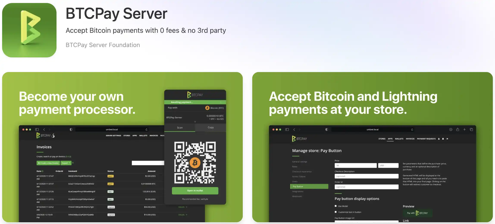


В экосистеме Bitcoin прием платежей представляет собой серьезную проблему как для продавцов, так и для предприятий. Традиционные решения, будь то банковские (кредитные карты, Stripe, PayPal) или даже Bitcoin (BitPay, Coinbase Commerce), навязывают посредников, которые взимают значительные комиссии, собирают конфиденциальные данные о вашем бизнесе и по своей прихоти могут BLOCK или цензурировать ваши транзакции. Такая зависимость противоречит основополагающим принципам Bitcoin - децентрализации, конфиденциальности и финансовому суверенитету.


BTCPAY SERVER становится ответом на эту проблему с открытым исходным кодом. Этот самодостаточный платежный процессор превращает вашу собственную ноду Bitcoin в профессиональную инфраструктуру, без посредников, без дополнительных комиссий за обработку и без компромиссов в отношении конфиденциальности. Разработанный глобальным сообществом участников с 2017 года, BTCPAY SERVER позволяет принимать платежи Bitcoin и Lightning непосредственно на ваши кошельки, сохраняя полный контроль над вашими средствами в любое время.


Традиционно установка BTCPAY SERVER требует развитых технических навыков: Настройка Linux-сервера, владение Docker, управление SSL-сертификатами и сетевая безопасность. Umbrel революционизирует этот подход с помощью установки в один клик, непосредственно интегрированной с вашими Bitcoin и LIGHTNING NODE. Это упрощение делает то, что раньше было уделом опытных технических специалистов, доступным для всех.


**Важно понимать**: BTCPAY SERVER на Umbrel по умолчанию работает только в вашей локальной сети. Вы можете создавать счета, принимать платежи через Lightning и Bitcoin и управлять бухгалтерией с любого устройства, подключенного к домашней сети (компьютер, смартфон, планшет). Такая конфигурация идеально подходит для выставления счетов за услуги при личной встрече, управления платежами при личной встрече или использования BTCPAY SERVER из локальной сети. С другой стороны, для интеграции BTCPAY SERVER в интернет-магазин, который находится в открытом доступе в Интернете, потребуется дополнительная конфигурация с публичной экспозицией (мы рассмотрим этот вопрос в конце учебника).


В этом руководстве вы узнаете о полной установке BTCPAY SERVER на Umbrel, настройке Bitcoin Wallet и LIGHTNING NODE, создании и оплате счетов, а также управлении бухгалтерской отчетностью. Вы узнаете, как эффективно использовать BTCPAY SERVER в локальной сети, а затем мы поговорим о решениях для публичной демонстрации, если вы хотите интегрировать его с сайтом электронной коммерции.


## Пререквизиты


Чтобы следовать этому руководству, вам необходимо правильно установить и настроить Umbrel. Если вы еще не сделали этого, ознакомьтесь с нашим руководством по установке Umbrel.


https://planb.academy/tutorials/node/bitcoin/umbrel-8b0e3b5b-d3cf-4a1e-8bb8-1ad2db4dd848

Ваш узел Bitcoin core должен быть полностью синхронизирован с Blockchain (100% в приложении Umbrel Bitcoin). Эта первоначальная синхронизация обычно занимает от 3 дней до 2 недель, в зависимости от вашего оборудования и подключения к Интернету.


Чтобы принимать мгновенные платежи Lightning, вам также потребуется установить LND (Lightning Network Daemon) на Umbrel. Смотрите наше руководство по установке и настройке LND на Umbrel, если вы хотите включить эту функцию.


https://planb.academy/tutorials/node/lightning-network/umbrel-lnd-b12e0b5b-12ff-45f1-978e-62f4b4a8ba16

Выделите не менее 50 ГБ свободного места на диске для BTCPAY SERVER, его баз данных и данных Lightning. Во избежание отключений настоятельно рекомендуется стабильное подключение к Интернету через Ethernet-кабель.


## Установка BTCPAY SERVER на Umbrel


Из Umbrel Interface (`umbrel.local`) перейдите в App Store и найдите "BTCPAY SERVER" в категории Bitcoin.


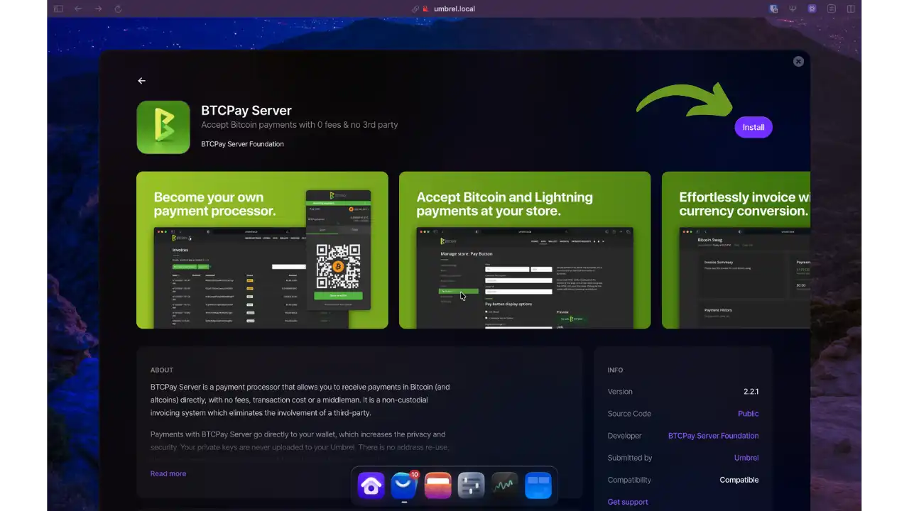


Нажмите кнопку Установить. Umbrel автоматически проверит, установлены ли Bitcoin core и LND, и начнет развертывание (2-5 минут).


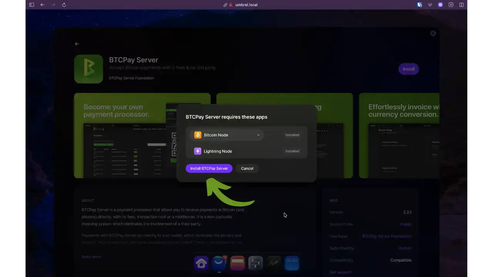


После установки откройте приложение. Вам потребуется создать учетную запись администратора с надежными учетными данными.


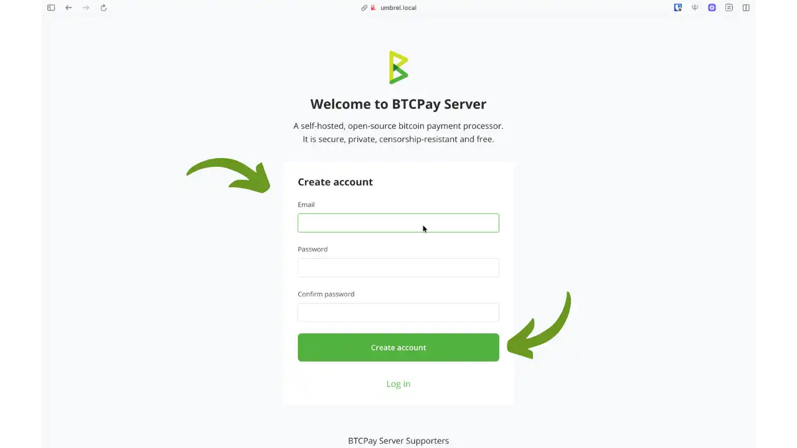


После создания аккаунта BTCPAY SERVER сразу же предложит вам создать свой первый магазин. Выберите профессиональное имя и опорную валюту (EUR, USD или BTC).


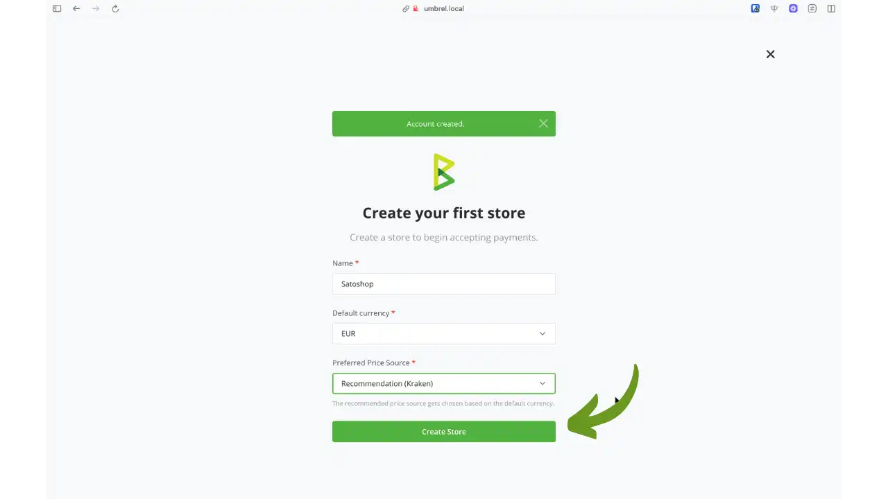


## Доступ к BTCPAY SERVER в вашей локальной сети


BTCPAY SERVER доступен с любого устройства в вашей локальной сети (WiFi или Ethernet). Доступ через браузер к :


```url
http://umbrel.local
```


Или прямо по адресу: :


```url
http://umbrel.local:3003
```


**Удаленный доступ с помощью Tailscale**: Чтобы получить доступ к BTCPAY SERVER из любой точки мира, используйте Tailscale. Этот безопасный VPN позволяет вам подключаться к Umbrel так, как будто вы находитесь в локальной сети. Смотрите наш учебник, посвященный Tailscale на Umbrel.


https://planb.academy/tutorials/computer-security/communication/tailscale-9acbd7de-04d9-40f6-ab80-35f0dfedb632

## Настройка портфеля Bitcoin


Чтобы принимать платежи, необходимо настроить Bitcoin Wallet. BTCPAY SERVER отображает параметры конфигурации на приборной панели.


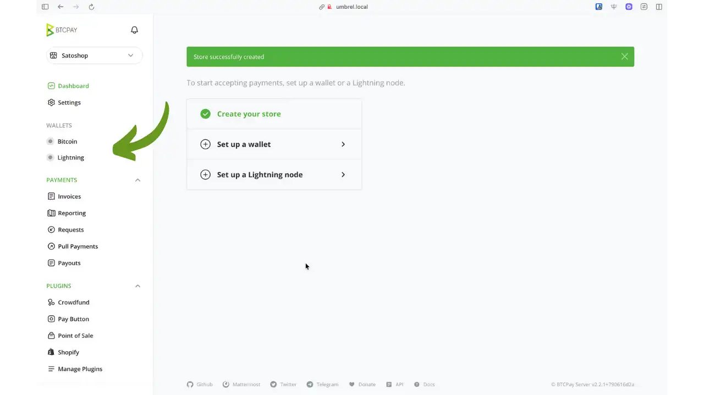


Чтобы настроить Wallet Bitcoin, перейдите в раздел "Кошельки" > "Bitcoin".


У вас есть два варианта: создать новый портфель непосредственно в BTCPay или импортировать существующий портфель. Для импорта доступно несколько методов:


- Подключите Hardware Wallet** (рекомендуется): Импортируйте открытые ключи через приложение Vault
- Импортировать файл Wallet** (рекомендуется): Загрузите экспортированный файл из вашего портфолио
- Введите расширенный открытый ключ**: Введите свой XPub/YPub/ZPub вручную
- Сканирование QR-кода Wallet** : Сканируйте QR-код с BlueWallet, Cobo Vault, Passport или Specter DIY
- Введите Wallet seed** (не рекомендуется) : Введите фразу восстановления из 12 или 24 слов


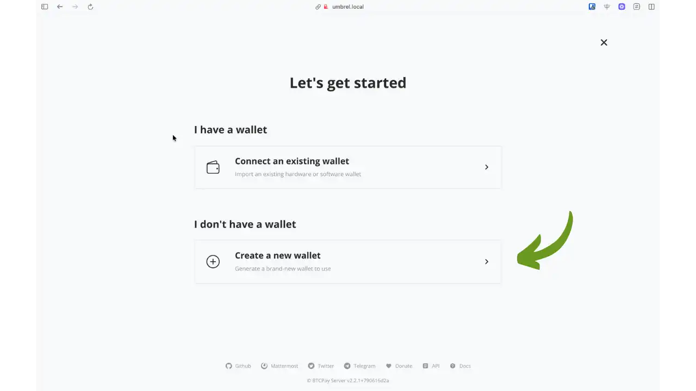


В этом руководстве мы создадим новый Hot Wallet: закрытый ключ будет храниться на нашем сервере Umbrel. В этом случае мы настоятельно рекомендуем вам регулярно перемещать средства на Cold Wallet, чтобы избежать хранения больших сумм на сервере.


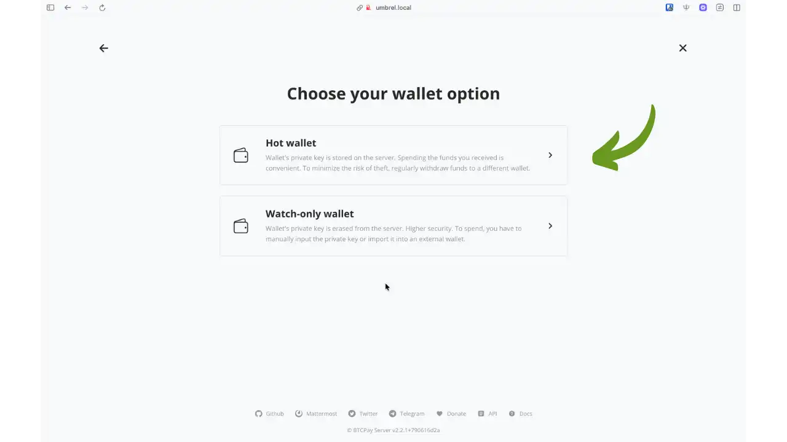


После настройки BTCPAY SERVER подтверждает, что ваш Wallet готов к приему платежей On-Chain.


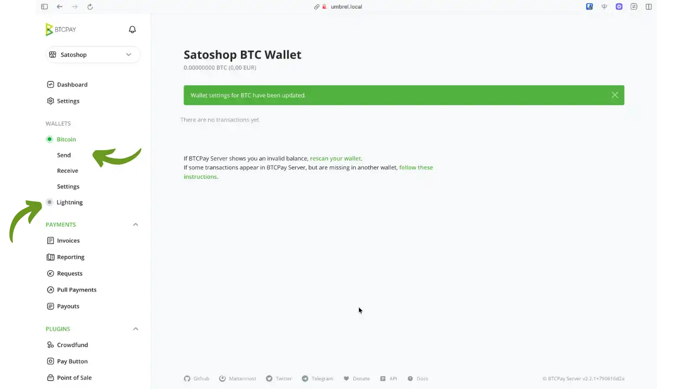


## Активировать Lightning Network


Чтобы принимать мгновенные платежи Lightning, перейдите в раздел Кошельки > Lightning. Затем, поскольку ваш узел LND уже установлен на Umbrel, просто нажмите на кнопку "Сохранить", чтобы подтвердить соединение между вашим BTCPAY SERVER и LIGHTNING NODE.


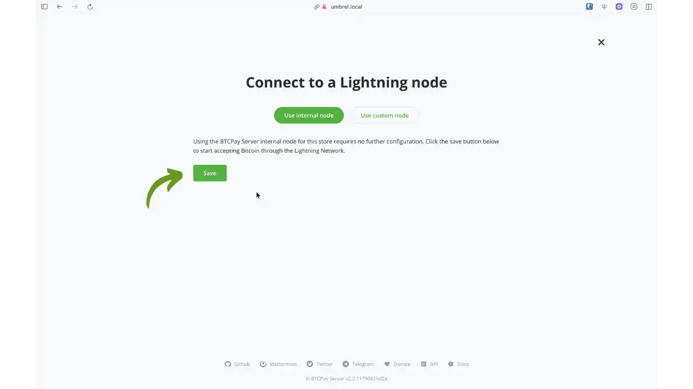


## Создание и оплата счетов-фактур


В Interface BTCPAY SERVER перейдите в раздел Счета-фактуры > Создать Invoice. Введите сумму, добавьте необязательное описание и нажмите кнопку Создать.


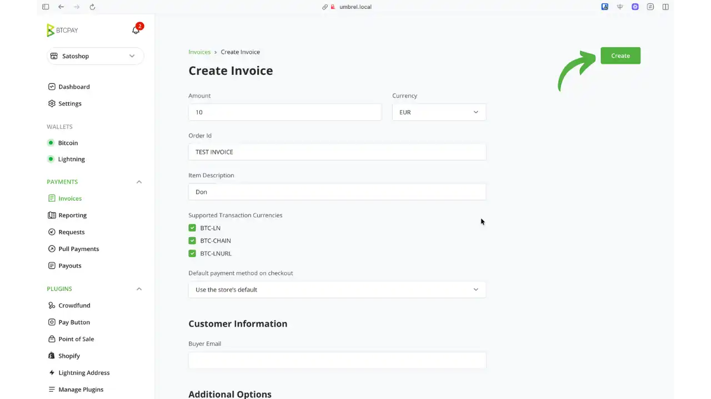


Затем вы можете нажать на кнопку "Checkout", чтобы отобразить Invoice. Затем BTCPay генерирует Invoice с единым QR-кодом (BIP21), содержащим Bitcoin Address и Lightning Invoice.


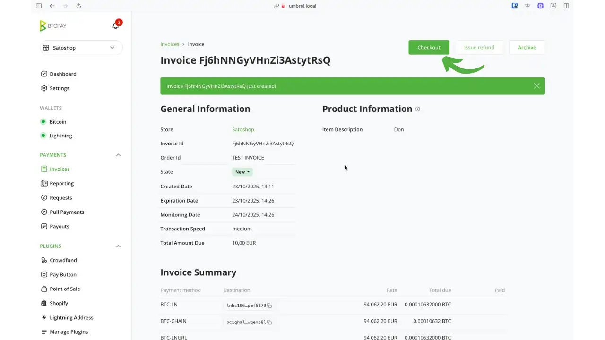


Ваш клиент может отсканировать QR-код с помощью любого совместимого устройства Wallet.


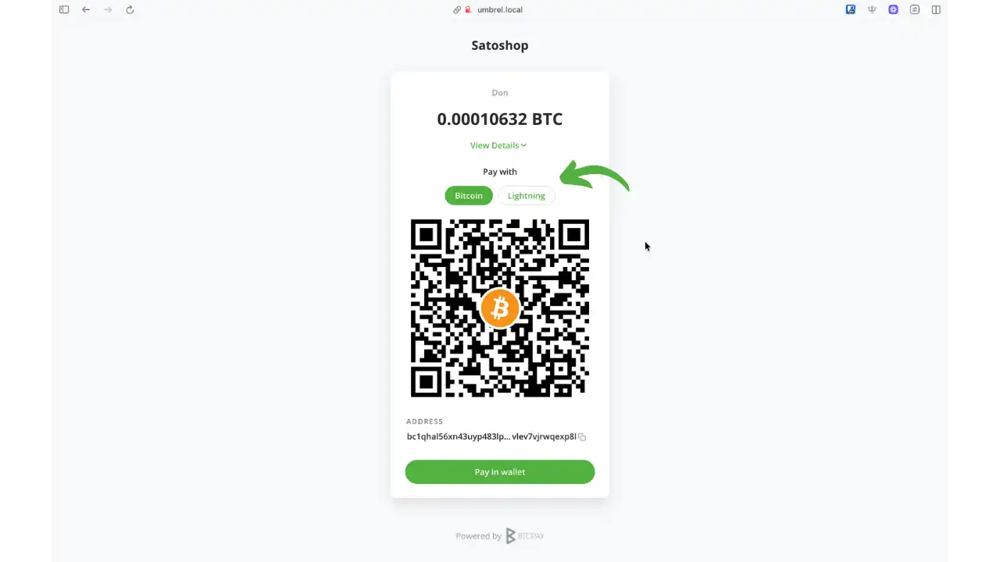


После оплаты Invoice становится "Заселенным" в течение нескольких секунд для Молнии.


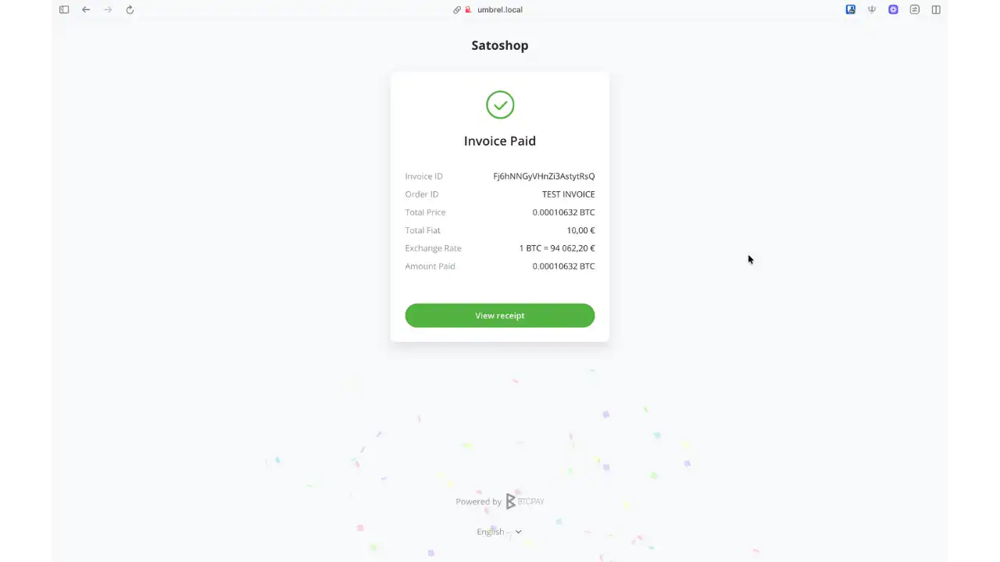


## Управление и отслеживание платежей


В разделе "Отчетность", на вкладке "Счета", вы найдете полную историю ваших счетов с указанием даты, суммы, статуса и способа оплаты. При необходимости вы можете экспортировать ее.


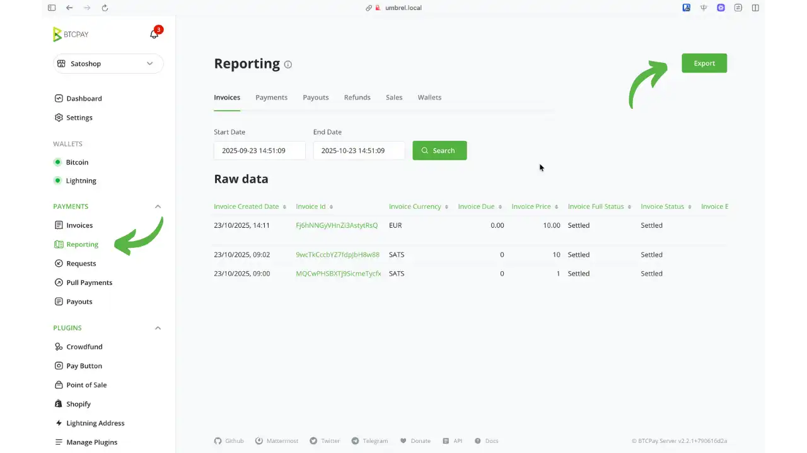


## Конфигурация магазина


BTCPAY SERVER позволяет управлять несколькими магазинами с различными параметрами. Каждый магазин представляет собой отдельную бизнес-структуру: магазин электронной коммерции, физическую торговую точку или сервисный биллинг.


В настройках магазина вы найдете несколько важных разделов:


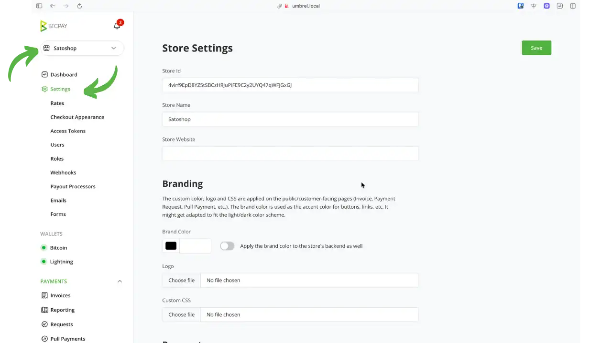


- Общие настройки**: Название магазина, валюта ссылки (BTC, EUR, USD), время действия Invoice (по умолчанию 15 минут), количество необходимых подтверждений Blockchain
- Курсы**: Конфигурация источников курсов Exchange и конвертации фиатных курсов/курсов Bitcoin
- Внешний вид кассы**: Настройте внешний вид страниц оформления заказа (логотип, цвета, персонализированные сообщения)
- Настройки электронной почты**: Настройка уведомлений по электронной почте о полученных платежах
- Токены доступа**: API token управление интеграциями электронной коммерции (WooCommerce, Shopify и др.)
- Пользователи**: Управление доступом пользователей к магазину с различными уровнями разрешений (владелец, гость)
- Webhooks**: Настройка Webhook для синхронизации в реальном времени с вашей бухгалтерской или ERP-системой


BTCPAY SERVER также предлагает раздел "Плагины" для расширения функциональности за счет интеграции с системами электронной коммерции, точками продаж и дополнительными инструментами.


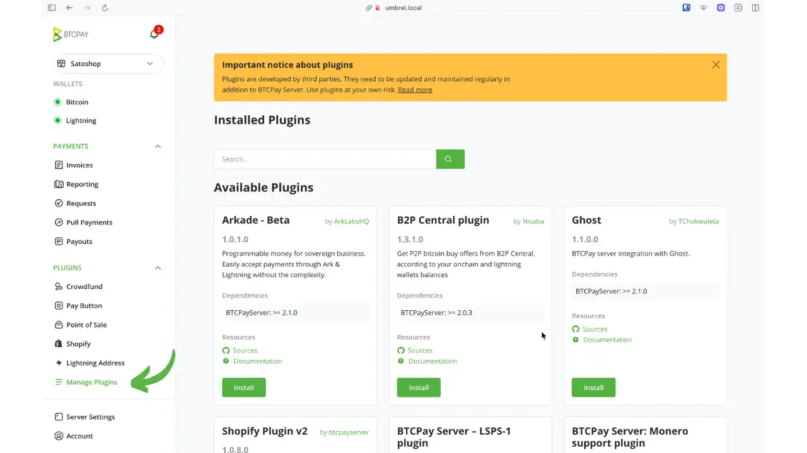


## Преимущества и ограничения местного использования


**Преимущества BTCPAY SERVER на Umbrel** :


- Полный суверенитет: исключительный контроль над приватными ключами и средствами, ни одна третья сторона не сможет заморозить или цензурировать ваши платежи
- Существенная экономия: всего Bitcoin сетевых расходов (несколько центов на Lightning) против 2-3% на традиционных процессорах
- Максимальная конфиденциальность: никакой регистрации, проверки личности или передачи данных сторонним компаниям
- Архитектура с открытым исходным кодом гарантирует прозрачность, проверяемость и устойчивость благодаря большому сообществу разработчиков
- Простая установка с помощью Umbrel, не требующая высоких технических навыков


**Важные ограничения** :


- Только локальная сеть**: BTCPAY SERVER на Umbrel доступен только из вашей домашней сети. Идеально подходит для личных расчетов, услуг фрилансеров или небольших физических предприятий, но не подходит для интернет-магазинов, которые находятся в открытом доступе в Интернете.
- Полная техническая ответственность: обслуживание узлов, регулярное резервное копирование, мониторинг подключения
- Управление молниеносной ликвидностью: открытие и управление каналами с достаточной пропускной способностью
- Поддержка ограничивается документацией сообщества и форумами, требуя большей самостоятельности, чем в коммерческом отделе обслуживания клиентов


Это ограничение локальной сети является основным препятствием для интеграции BTCPAY SERVER в магазин электронной коммерции, где покупатели должны иметь возможность доступа к страницам оплаты из любой точки Интернета.


## Передовой опыт и безопасность


Включите автоматическое резервное копирование Umbrel и храните копию на внешнем носителе (USB-накопитель, диск Hard, зашифрованное облако). Храните семплы Bitcoin (фразы для восстановления) в безопасном, физически отдельном месте. Сохраните файл LND channel.backup для восстановления Молнии.


Регулярно контролируйте синхронизацию Bitcoin core, каналы Lightning и реакцию BTCPAY SERVER. Простой еженедельный тест: generate и оплатить счет на несколько сатоши. Поддерживайте Umbrel в актуальном состоянии (патчи безопасности, улучшения). Делайте резервные копии перед крупными обновлениями. Для профессионального использования рассмотрите возможность внешнего мониторинга (UptimeRobot) с оповещениями по электронной почте/SMS.


## Показать BTCPAY SERVER публично для интернет-магазина


Чтобы интегрировать BTCPAY SERVER в веб-магазин электронной коммерции (WooCommerce, Shopify и т. д.), ваши клиенты должны иметь доступ к страницам оплаты из любого места, а не только из вашей локальной сети.


** Решение: Менеджер прокси-серверов Nginx**


Вы можете выставить BTCPAY SERVER на всеобщее обозрение с помощью Nginx Proxy Manager (доступен в Umbrel App Store). Это решение требует :


- Доменное имя (классическое или бесплатное через DuckDNS, No-IP, Afraid.org)
- Настройка переадресации портов (порты 80 и 443) на маршрутизаторе
- Установка Nginx Proxy Manager, который автоматически управляет SSL-сертификатами


Такая конфигурация подвергает ваш сервер воздействию интернета и требует повышенной бдительности (надежные пароли, 2FA, регулярные обновления). Мы подготовим специальное руководство с подробным описанием этой процедуры.


## Заключение


BTCPAY SERVER на Umbrel сочетает в себе мощь узла Bitcoin и простоту Umbrel для создания самодостаточной профессиональной платежной инфраструктуры, доступной для всех. Этот финансовый суверенитет сопровождается ответственностью за обслуживание, но Umbrel значительно упрощает операционную нагрузку по сравнению с преимуществами: устранение комиссий за обработку, защита вашей конфиденциальности, устойчивость к цензуре и полный контроль над вашими средствами.


Использование локальной сети уже охватывает широкий спектр приложений: выставление счетов за услуги фрилансеров, платежи "лицом к лицу", небольшие физические магазины или просто изучение и эксперименты с Bitcoin и Lightning в контролируемой среде. Для электронной коммерции, требующей публичного доступа, существует решение Nginx Proxy Manager, но оно требует дополнительной технической настройки, о которой мы расскажем в отдельном руководстве.


Независимо от того, ведете ли вы бизнес, начинаете ли проект или просто экспериментируете, BTCPAY SERVER на Umbrel предлагает полную финансовую автономию. Путь начинается с первого магазина, первого Invoice, первого платежа, поступающего непосредственно в вашу суверенную инфраструктуру.


## Ресурсы


### Официальная документация


- [Официальный сайт BTCPAY SERVER] (https://btcpayserver.org)
- [Полная документация по BTCPAY SERVER](https://docs.btcpayserver.org)
- [GitHub BTCPAY SERVER](https://github.com/btcpayserver/btcpayserver)
- [документация Tailscale](https://tailscale.com/kb)


### Сообщество и поддержка


- [Форум BTCPAY SERVER](https://chat.btcpayserver.org)
- [Forum Umbrel](https://community.getumbrel.com)
- [Reddit r/BTCPayServer](https://reddit.com/r/BTCPayServer)