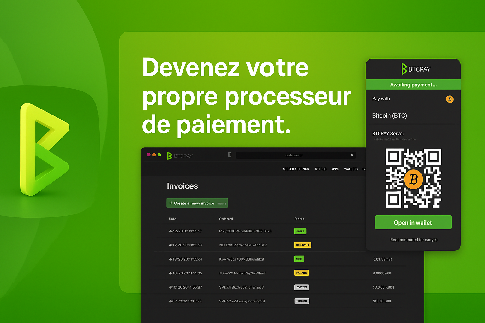
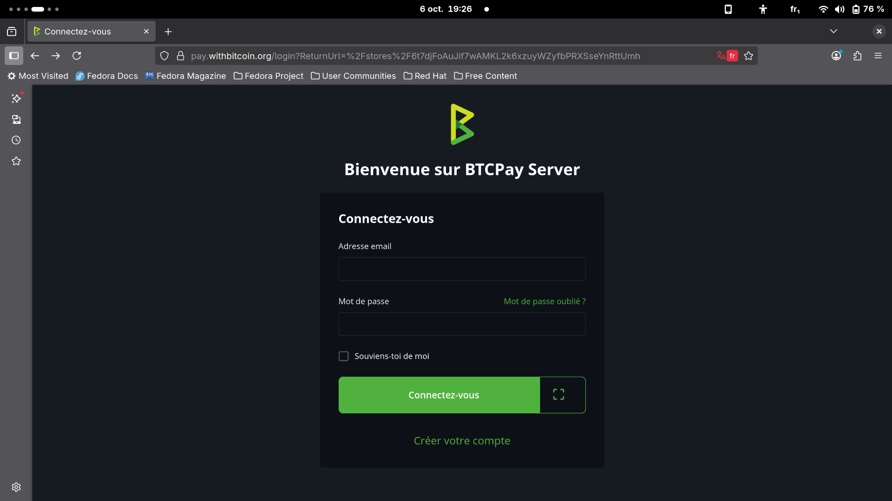
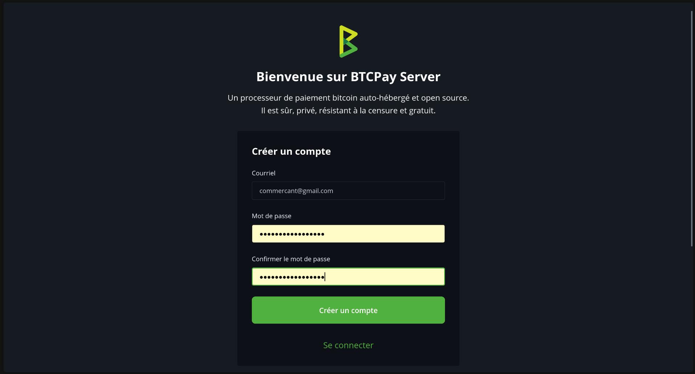
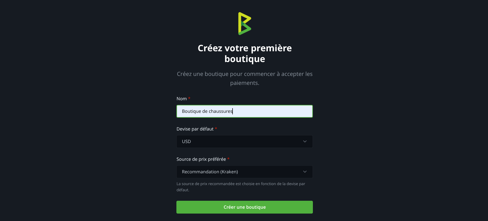
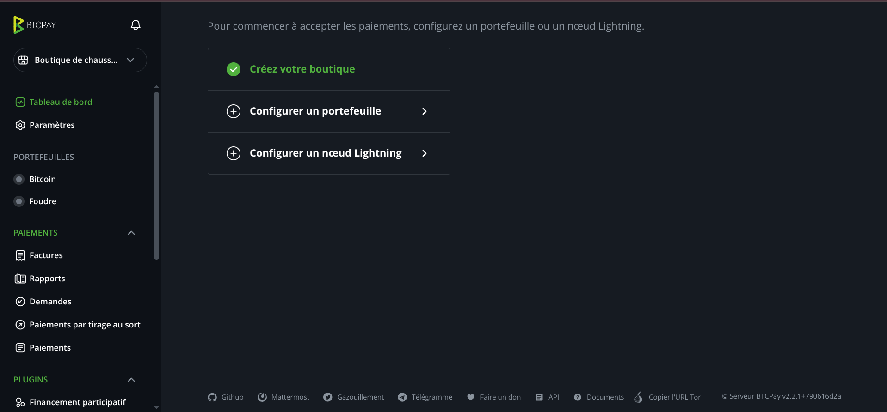
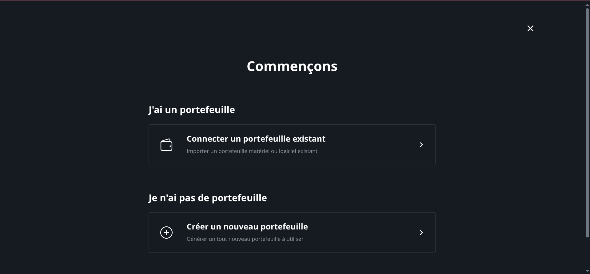
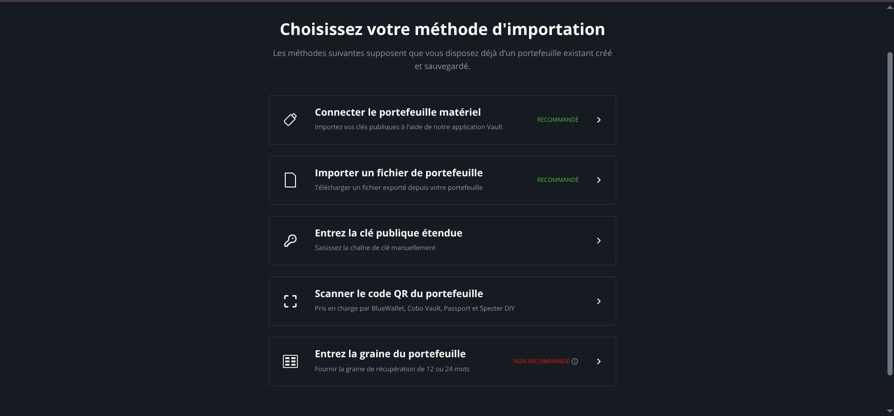
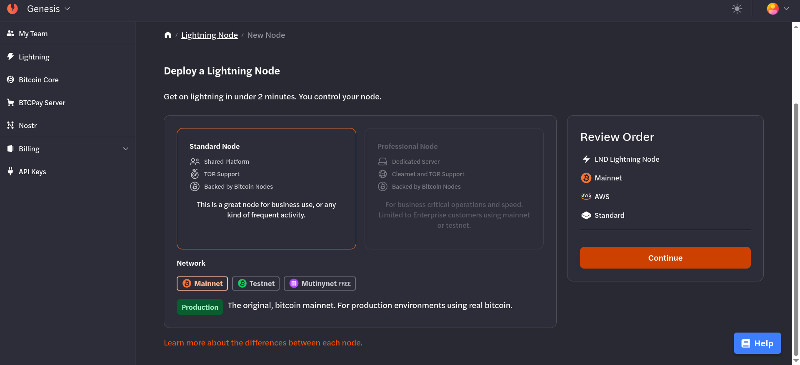
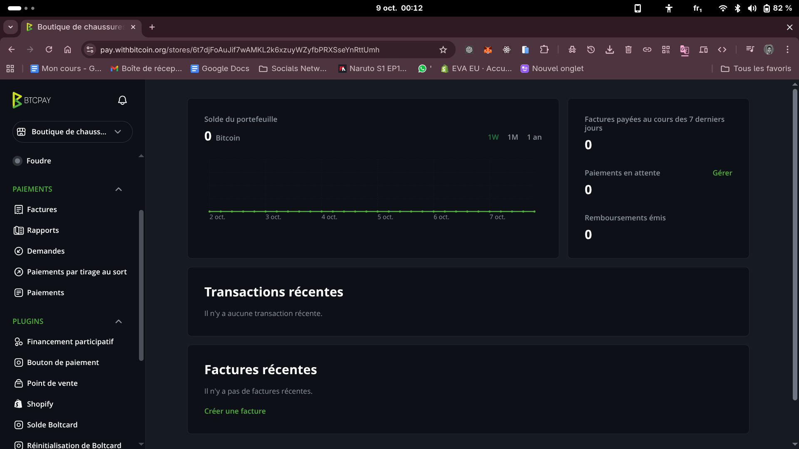
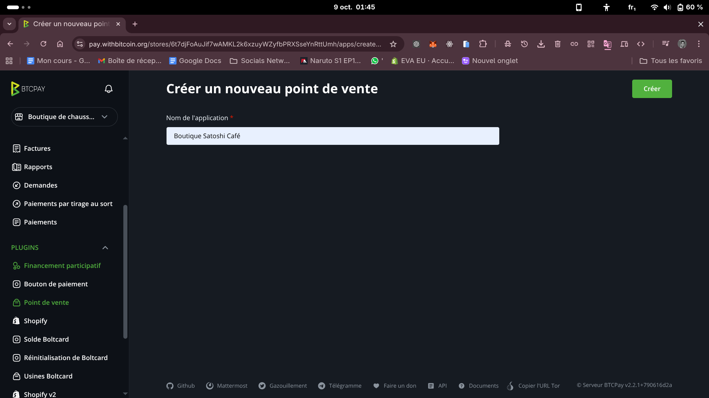

Dans un monde de plus en plus numérique, de nouvelles initiatives et d'innovations émergent quotidiennement. Il en est de même dans le domaine de la finance, du commerce, etc. Les boutiques virtuelles, l'e-commerce, les paiements numériques foisonnent, de nos jours. Les paiements en espèces s'effacent progressivement à mesure que les paiements numériques deviennent monnaie courante. Cependant, il reste encore des obstacles tels que les frais élevés que les intégrateurs de paiements prélèvent, la rétro-facturation, le blocage ou le gel des fonds, les interruptions de services causées par une panne, pour ne mentionner que ceux-là.

C'est au regard de toutes ces contraintes, que des solutions ont été élaborées pour permettre aux commerçants de recevoir des paiements avec une monnaie numérique, non censurable et sans tiers de confiance : le bitcoin. Les premières méthodes de paiement via Bitcoin comme BitPay étaient toujours centralisées. Dans le but de se rapprocher le plus possible de l'esprit qui sous-tend la création de Bitcoin, **BTCPay Server** a été créé.

## Qu'est-ce que BTCPay Server ? 

Lancé par Nicolas DORIER, **BTCPay Server** est une solution open-source entièrement autonome et gratuite qui permet d'accepter des paiements en bitcoins. Il permet à toute personne d'héberger librement lui-même le serveur sans un prestataire tiers. Il s'intègre facilement à des sites e-commerce (WooComerce, Shopify, etc.) ou peut être utilisé comme un terminal de point de vente (POS).

## Spécificités de BTCPay Server

Les solutions de POS Bitcoin centralisées (comme *Open Node* par exemple) sont pratiques, mais dépendent d’une entreprise tierce puisqu’ils ne sont pas auto-hébergeables et, le plus souvent, ne sont pas open-source. Ils simplifient l’utilisation, mais introduisent des frais de commission et présentent davantage de risques qu’une solution comme BTCPay Server.

BTCPay Server s’adresse aux commerçants en ligne ou physiques, aux associations et organismes à but non lucratif désireux de recevoir des dons en bitcoins. Il constitue également une solution idéale pour les porteurs de projets ainsi que pour les développeurs souhaitant obtenir un soutien direct de leur communauté.

Les spécificités de BTCPay Server résident dans l’autonomie qu’il offre, l’absence de procédure KYC, le contrôle intégral des fonds ainsi que la suppression des frais de plateforme. En devenant votre propre processeur de paiement, vous éliminez toute dépendance à un tiers centralisé entre vous et vos clients.

Vous pouvez ainsi accepter des paiements en bitcoins directement, et même générer des factures de paiement. Cela garantit que ni vous ni votre entreprise ne pourrez être bannis par qui que ce soit.

Vous jouez à la fois le rôle de banque et de processeur de paiement ; ainsi, vous n’avez plus à verser de commission à un intermédiaire pour chaque transaction. Bien sûr, les frais de transaction Bitcoin subsistent, mais ils peuvent être considérablement réduits grâce à l’utilisation de Liquid ou du Lightning Network.

À cela s’ajoutent :
- une personnalisation complète de l’interface et des modèles de factures ;
- la prise en charge native des paiements via Tor, assurant un haut niveau de confidentialité ;
- la possibilité de gérer facilement une campagne de financement participatif, une application de point de vente ou de simples boutons de paiement ;
- la compatibilité avec de multiples devises ;
- des paiements Bitcoin directs et véritablement pair-à-pair, sans intermédiaire ;
- un contrôle total sur vos clés privées ;
- la possibilité d'auto-héberger le logiciel de PoS ;
- la prise en charge complète de SegWit et du réseau Lightning ;
- la possibilité d'utiliser son propre nœud Bitcoin ;
- la possibilité de sécuriser ses fonds avec un hardware wallet.

## Installation et configuration de BTCPay Server

### Choisir son mode d’hébergement

BTCPay Server peut être installé de différentes manières. Selon vos besoins et vos ressources, trois options principales s’offrent à vous :

- **BTCPay Server hébergé par un tiers** : vous utilisez une plateforme qui héberge le service pour vous. C’est simple, mais généralement payant.
- **BTCPay Server auto-hébergé sur un serveur cloud** (par exemple via [btcpayprovider](https://btcpayprovider.com/), [Bitcoin People](http://bitcoinpeople.it/) ou tout autre fournisseur). C’est la solution recommandée pour la plupart des commerçants débutants.
- **BTCPay Server installé sur votre propre matériel (en local)** : sur un ordinateur, un mini-PC ou un Umbrel. Cette méthode est plus technique, mais offre une indépendance totale.

Pour un commerçant débutant, je recommande plutôt le **déploiement sur un serveur cloud**.

### Créer un compte BTCPay Server

Avec BTCPay, il est possible de créer et de gérer un nombre illimité de boutiques.  
Chaque boutique dispose de son propre portefeuille, peut générer des applications (telles que des boutons de point de vente, de paiement ou de financement participatif) et peut également être connectée à un logiciel e-commerce externe via les intégrations proposées.

1. Une fois dans votre navigateur, rendez-vous sur le site de BTCPay Server le [site de  BTCPay Server](https://pay.withbitcoin.org/).  

3. Créez un **compte administrateur** avec votre adresse mail et un mot de passe. 

4. Configurez ensuite votre premier **magasin (Store)**.  
   - Donnez un **nom** à votre magasin.  
   - Définissez la **devise par défaut** (ex. EUR, USD, CFA).  
   - Choisissez un **fournisseur de taux de change** (ex. CoinGecko).  

    
    
Ensuite vous serez redirigez  sur le tableau de bord de votre magasin.

Sur l'interface du tableau de bord, vous allez constater que le bouton **Créer votre boutique** est marqué en vert, puisque l'étape est déjà franchie.
Ensuite en bas nous avons le bouton **Configurer un portefeuille** et **Configurer un nœud Lightning**.

Dans ce tutoriel, nous allons nous intéressé à la configuration d'un portefeuille.
Cliquez sur le bouton **Configurer un portefeuille**.
On se retrouve donc sur cette page.

Puisqu'on débute sur la prise en main de BTCPay Server, nous allons connecter un portefeuille existant.
Appuyez donc sur **Connecter un portefeuille existant**.

Vous devez donc choisir votre méthode d'importation.
Parmi les options d'importations, nous allons choisir **Entrer la clé publique étendue**.

En reliant un portefeuille existant, vous pouvez recevoir les paiements directement sur ce portefeuille externe, sans que le serveur BTCPay ait accès à sa clé privée. Ainsi, même en cas de piratage du serveur et de compromission du xpub, un attaquant pourrait consulter l’historique de vos transactions, mais il lui serait impossible d’accéder à vos fonds.

Une fois que vous cliquez sur le bouton **Entrer la clé publique étendue**, vous serez diriger vers la page où vous devez fournir cette clé. Allons maintenant récupérer la clé publique étendue (maîtresse). 

###  Connecter un portefeuille Bitcoin

Pour recevoir vos paiements, vous devez connecter un **portefeuille Bitcoin** à votre magasin.

Pour cela, vous avez plusieurs options possibles :

- **Portefeuille matériel (Ledger, Trezor, Coldcard)**  
- **Portefeuille logiciel (ex. Electrum, Wasabi)**.  
- **Portefeuille interne BTCPay Server** .  

Dans ce tutoriel, nous allons  faire la connexion avec un portefeuille logiciel.

Vous pouvez choisir parmi un grand nombre de portefeuille (Electrum, Phoenix, Zeus, Muun...).

Pour la démonstration, nous allons utiliser le portefeuille Electrum.
 Ouvrez **Electrum**, cliquez sur **Portefeuille**, puis sur **Informations** :  

   

   Ensuite vous récupérez la **clé publique maîtresse (xpub)**.

Une fois la clé publique maîtresse copiée, coller le dans le champ dédié sur la page de BTCPay server.

Une fois la clé vérifiée, vous serez rediriger vers le tableau de bord de votre magasin.

### Générer un Point de Vente (PoS)

Une fois votre boutique et votre portefeuille configurés, vous pouvez désormais mettre en place un **Point de Vente (PoS)** pour commencer à recevoir des paiements Bitcoin de vos clients.  

Cette application intégrée à BTCPay Server est idéale pour les commerçants, artisans ou prestataires souhaitant accepter le Bitcoin **sans site web** ni connaissance technique.
Vous pouvez :
- Créer un **menu de produits/services** avec prix fixes.  
- Générer une **facture avec QR code** à présenter au client.  
- Partager une **URL de paiement** accessible depuis smartphone/tablette.  

On y va pour la mise en place d'un Point de Vente.
1. Dans le tableau de bord BTCPay, cliquez sur **PLUGINS** et puis sur **“Point de vente”** dans le menu principal.

2. Une fois que vous cliquez sur **'Point de Vente'**, vous serez rediriger vers une page où vous saisirez le nom de votre application (par exemple : _Boutique Satoshi Café_), et vous validerez en cliquant sur **Créer**.

3. Dès que votre Point de Vente est créée, vous serez sur la page de mise à jour du Point de vente, où vous pourriez modifier le **Nom de l'application**, le **Titre d'affichage** de choisir le **style du point de vente** (description, affichage des produits...) ou encore choisir la **devise.**
Vous pourriez cliquez sur **Voir** pour avoir l'aperçu de de votre Point de vente.

Lorsque vous achevez les modifications, n'oubliez pas de les sauvegarder.
La sauvegarde de vos données est maintenant effectuée, votre PoS est maintenant créé et visible dans la liste de vos applications.

##  Utilisation au quotidien

Avant de commencer avec de vrais clients, faites un test.
###  Tester un paiement

1. Créez une facture depuis votre PoS.  
2. Scannez le QR code avec un portefeuille  mobile (ex. Phoenix, Muun).  
3. Vérifiez que la transaction apparaît dans BTCPay Server.  
###  Créer une facture pour un client

- Depuis le tableau de bord de votre magasin, cliquez sur **Nouvelle facture**.  
- Entrez le **montant** et la **devise locale** (BTCPay calcule automatiquement l’équivalent en BTC).  
- Partagez le QR code ou l’URL avec le client.  
###  Suivre les paiements reçus

Dans le menu **Facture**, vous voyez la liste de toutes vos transactions.  
Statuts possibles :  
  - *En Attente* : paiement en attente.  
  - *Réglée* : paiement confirmé.  
  - *Expirée* : facture non réglée dans le temps imparti.  
### Rembourser un client

- Dans le menu **Factures**, sélectionnez la facture à rembourser.  
- Cliquez sur **Rembourser** et saisissez l’adresse Bitcoin fournie par le client.  
### Rapports et export des données

BTCPay Server vous permet d’exporter vos transactions (CSV, Excel).  C'est assez pratique pour votre comptabilité et pour votre suivi de caisse.  

## Sécurité et Bonnes pratiques

L’autonomie que procure BTCPay Server (la pleine souveraineté sur vos fonds) est une force. Une force qui rime avec une responsabilité accrue en matière de sécurité. En gérant vous-même vos paiements, vous devenez votre propre banque. Il est donc sine qua non d'adopter de bonnes pratiques afin de préserver vos fonds, vos données et votre infrastructure.
Il s'agit entre autres de :

1. Sécuriser l’accès à votre serveur

Utilisez un mot de passe fort : combinez majuscules, minuscules, chiffres et caractères spéciaux. Évitez toute réutilisation d’un mot de passe existant.
Activez l’authentification à deux facteurs (2FA) pour accéder à votre interface BTCPay.
Mettez régulièrement à jour votre système d’exploitation, votre instance BTCPay Server et vos dépendances (Docker, nœud Bitcoin, nœud Lightning). Les mises à jour corrigent souvent des vulnérabilités de sécurité.

2. Gérer et sauvegarder les clés privées

Sauvegardez vos clés privées et vos seedphrases hors ligne, sur un support physique (papier ou matériel sécurisé).
Ne conservez jamais vos clés sur un appareil connecté à Internet sans chiffrement adéquat.
Utilisez de préférence un portefeuille matériel (hardware wallet).
Conservez plusieurs copies de vos sauvegardes, dans des lieux physiques distincts et protégés.

3. Sécuriser les paiements et la confidentialité

Utilisez Tor ou un VPN pour masquer l’adresse IP de votre serveur et protéger votre vie privée.
Désactivez les ports non nécessaires sur votre serveur et limitez les connexions SSH aux seules adresses de confiance.
Activez le HTTPS (certificat SSL) pour toutes les connexions à votre interface web BTCPay.
Ne partagez jamais votre interface d’administration avec du personnel non formé à la gestion de portefeuilles Bitcoin.

4. Mettre en place de bonnes pratiques pour le réseau Lightning

Gardez toujours une sauvegarde récente de votre nœud Lightning.
Surveillez régulièrement l’état de vos canaux et fermez-les proprement en cas de changement d’appareil ou de migration de serveur.
Si possible, utilisez un nœud Lightning séparé (externe à votre BTCPay) pour réduire les risques liés à une compromission du serveur principal.

5. Organiser et structurer des procédures internes

Définissez une politique claire de gestion des accès : qui peut créer une facture, consulter les paiements, accéder au nœud, etc.
Consignez vos procédures de sauvegarde et de restauration afin de pouvoir réagir rapidement en cas d’incident.
Testez régulièrement la restauration de vos sauvegardes pour vous assurer qu’elles fonctionnent correctement.
Formez votre personnel ou vos collaborateurs à la sécurité opérationnelle de base : vigilance face au phishing, utilisation de mots de passe sécurisés, respect de la confidentialité.

6. Superviser et d'établir une maintenance continue

Surveillez en permanence l’activité de votre serveur via des outils de logs ou de monitoring.
Planifiez une revue de sécurité périodique : vérifiez les mises à jour, les accès, les sauvegardes et la cohérence des transactions.

Félicitations! Vous êtes à la fin de ce tutoriel. Vous pouvez maintenant prendre en main BTCPay Server tout seul pour vous faciliter la tâche dans la gestion de votre boutique.

Nous vous recommandons de découvrir notre tutoriel sur comment configurer le plugin USDT sur BTCPay Server pour vos boutiques en ligne

https://planb.network/tutorials/business/point-of-sale/btcpay-usdt-plugin-48e81b31-89cb-4b7e-83ef-f2094af513c9