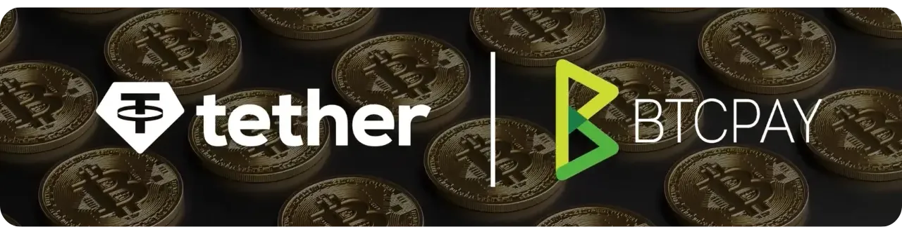

⚠️ **هشدار امنیتی حیاتی (۷ اوت ۲۰۲۶):** یک آسیب‌پذیری حیاتی در BTCPay Server هم‌اکنون به‌طور فعال مورد سوءاستفاده قرار می‌گیرد و می‌تواند به از دست رفتن وجوه منجر شود. بی‌درنگ نمونه (instance) خود را از مسیر `Admin Dashboard > Server > Maintenance > Update` به **version 2.4.2** به‌روزرسانی کنید و سپس بررسی کنید که در پاورقی صفحه `2.4.2` نمایش داده شود. اگر امکان به‌روزرسانی فوری ندارید، BTCPay Server خود را خاموش کنید. پس از به‌روزرسانی، باید macaroons و `macaroons.db` خود را نیز به‌طور کامل بازسازی کنید، رشته‌های احراز هویت هر بک‌اند Lightning دیگری را کاملاً از نو بسازید، و اگر یک کیف‌پول داغ on-chain درون BTCPay Server ایجاد کرده‌اید، آن وجوه را منتقل کرده و کیف‌پول را از نو بسازید. یکپارچه‌سازان (Integrators) باید NBXplorer را نیز به version 2.6.10 به‌روزرسانی کنند. منبع: [یادداشت‌های انتشار BTCPay Server 2.4.2](https://github.com/btcpayserver/btcpayserver/releases/tag/v2.4.2).

https://planb.academy/tutorials/business/point-of-sale/btcpay-server-update-7033a305-8404-4cba-8324-4c7eb679016b

در این ویدئو، شما خواهید آموخت که چگونه پلاگین USDT را بر روی BTCPay Server برای فروشگاه‌های آنلاین خود تنظیم کنید. شما یاد خواهید گرفت که چگونه پلاگین را از طریق مدیر پلاگین نصب کنید، تنظیمات سرور را برای دسترسی بهتر با استفاده از نودهای اختصاصی پیکربندی کنید و کیف پول‌های خود را برای دریافت امن پرداخت‌ها تنظیم کنید.

