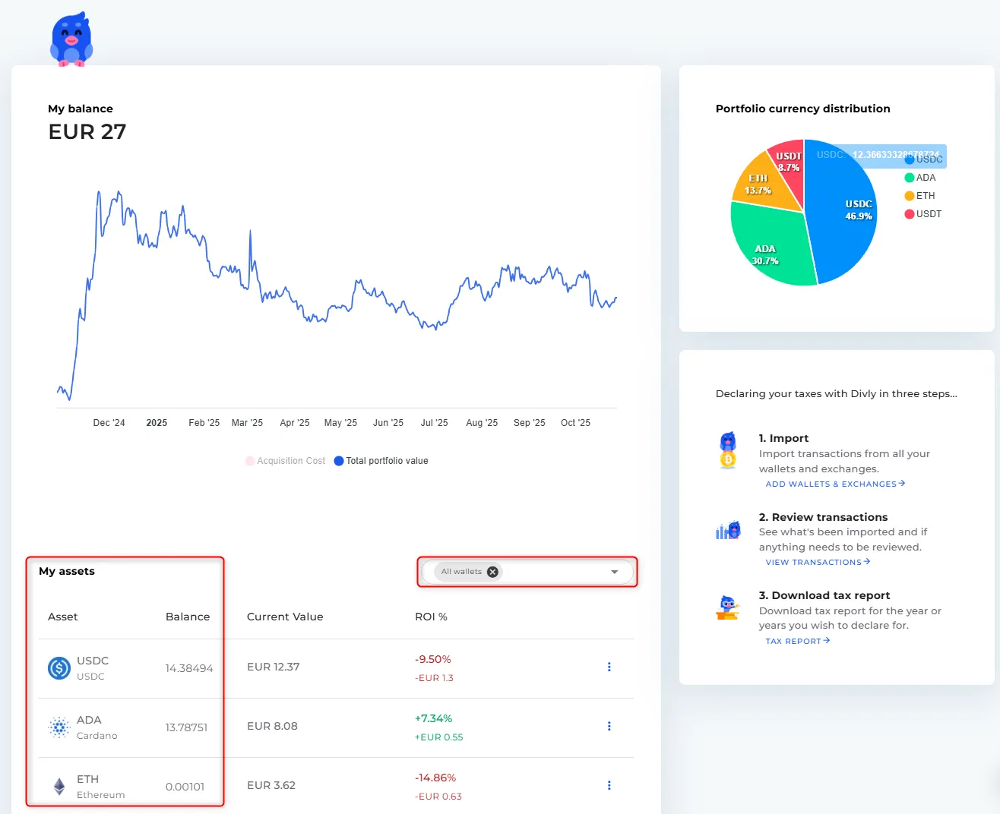
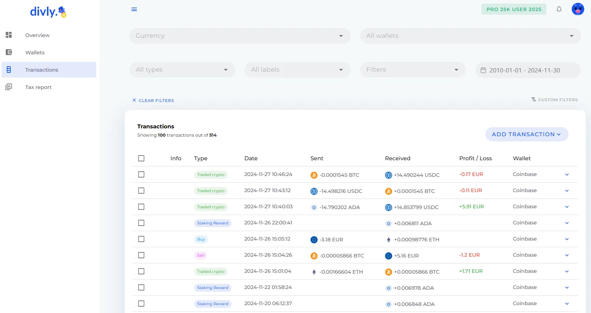
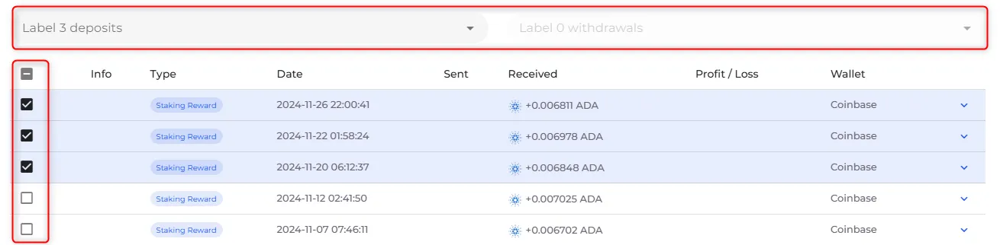
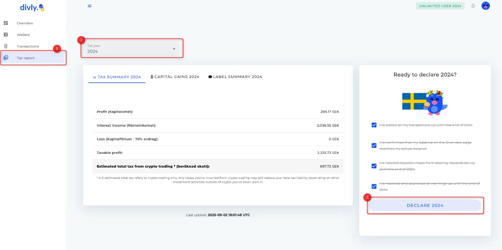
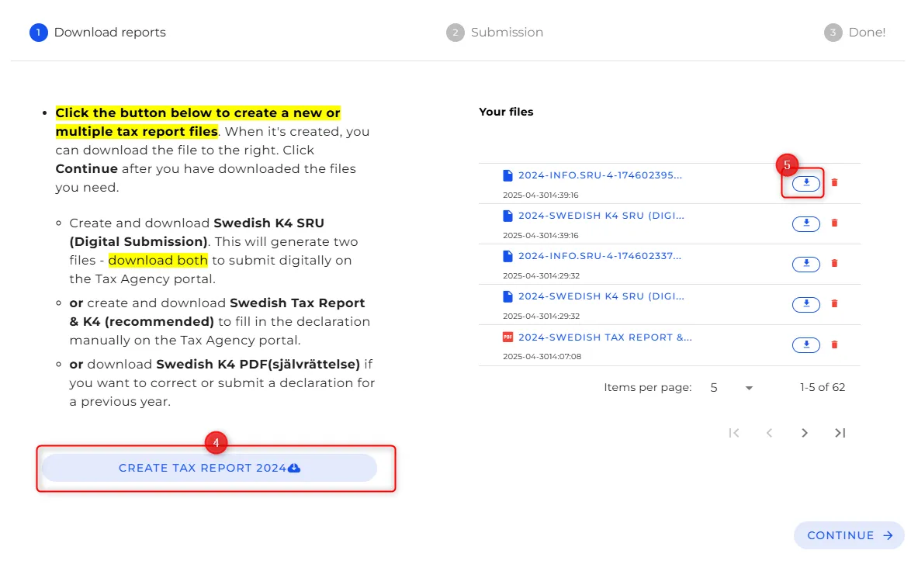

## Introduzione

Questo tutorial spiega come utilizzare [Divly](https://divly.com/) per preparare un rapporto fiscale Bitcoin (BTC). La preparazione di un rapporto fiscale comporta la raccolta di tutte le relative transazioni BTC in un esercizio finanziario, il calcolo di guadagni fiscali o di reddito, e l'esportazione di un rapporto che può essere presentato alla tua autorità fiscale locale.

Nelle giurisdizioni in cui Bitcoin è soggetto a norme fiscali, è necessario segnalare profitti o perdite da BTC cessati e proventi ricevuti in BTC. Utilizzare un software di reporting fiscale ti aiuta a organizzare queste informazioni e generare un rapporto fiscale in modo efficiente.

## Iniziare

Per iniziare:
- Crea un account Divly.
- **Imposta il paese di residenza fiscale** e **la valuta locale**.
- Conferma che queste impostazioni riflettono la giurisdizione in cui si dichiareranno le tasse.

Divly utilizza questa configurazione per applicare le regole fiscali e le conversioni valutarie appropriate quando generi il rapporto.

## Step 1 - Importa tutte le transazioni Bitcoin dai tuoi portafogli ed exchange

Tutte le transazioni Bitcoin dell'anno da tassare devono essere importate prima di fare ogni calcolo delle tasse.

Divly supporta multipli metodi di importazione:

- **API o connessioni OAuth** per gli exchange o i servizi cge lo supportano.
- **CSV file uploads** dai wallets o dagli exchanges.
- **Immissione manuale** per ogni transazione non suppoprtata da metodi automatici.

Assicurati di importare **ogni flusso e deflusso BTC** relativo al periodo fiscale che si sta segnalando.

## Step 2 - Revisione delle transazioni importate

**Conferma il tuo bilancio crypto**:

Il posto migliore per iniziare è controllare che  totale delle crypto che possiedi corrisponde al numero visualizzato in Divly. Divly calcola le tue partecipazioni sommando tutte le transazioni che hai importato.

Per fare questo, inizia navigando nella pagina "Panoramica". Controlla che ogni singola cripto elencata è davvero il numero che possiedi. Divly non visualizza le valute fiat in "Panoramica", quindi ti prego di ignorarle in questo esercizio.

È possibile applicare dei filtri sul portafoglio se trovi eventuali problemi. Questo ti aiuta a capire se il portafoglio può essere fuori dalla sincronizzazione.

Dopo l'importazione:
- Vai alla sezione **Transazioni**.
- Controlla che ogni transazione venga visualizzata con date e importi corretti.
- Risolvi il prezzo mancante o le avvertenze di base di costo, se necessario.
- 
**Importante**: Assicurarsi di importare **tutte** le transazioni crypto in Divly prima di procedere al passo successivo. Compresi i cold wallet! Altrimenti le tasse non saranno corrette.
  

## Step 3 - Categorizzare depositi e prelievi pertinenti.

Diversi tipi di transazioni cripto possono avere implicazioni fiscali distinte. Questi includono attività come il dono delle criptovalute, beni persi, premi minati, fork, air drop e eventi simili. È importante che tutte le transazioni siano classificate con precisione.

Nella maggior parte dei casi, Divly assegna automaticamente le etichette corrette. Tuttavia, quando i dati delle transazioni disponibili sono insufficienti, la classificazione automatica non è possibile. In queste situazioni, è responsabilità dell'utente assegnare manualmente l'etichetta appropriata. Per comprendere il significato e il trattamento fiscale di ogni etichetta, si prega di fare riferimento al relativo articolo di aiuto.

Per etichettare le transazioni, vai alla pagina "Transazioni". Seleziona una o più transazioni e scegli l'etichetta corretta dal menu a discesa nella parte superiore della pagina.

## Step 4 - Genera il rapporto delle tasse

Ogni transazione è imprtata e classificata:
- Vai allla sezione **Tax Report**.
- Seleziona **tax year** di riferimento.
- Rivede il riassunto di guadagni calcolati, perdite e categorie di reddito.

Il sommario aggregato tassabile degli eventi basato sugli importi e sulle classificazioni.

L'interfaccia del report delle tasse di Divly consente di confermare che tutte le transazioni vengano inserite prima di esportare.

## Step 5 - Esportare il Report

Dopo la revisione:
- Esporta la finalizzazione del report delle tasse in BTC nel formato valido per il tuo stato.
- Salva il file di esportazione o stampalo per la sottoscrizione verso l'autorità di ytassazione del tuo stato.

Depending on your jurisdiction, you may need to follow specific submission instructions or use country-specific forms with your exported data. [Divly’s country-specific guides](https://divly.com/en/guides) can help you with submission steps if needed.
