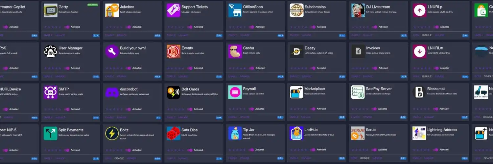


LNbits, herhangi bir Lightning arka ucunu (LND, Core Lightning, PHOENIXD) eksiksiz bir hizmet platformuna dönüştüren açık kaynaklı bir Interface web uygulamasıdır. Bu kendi kendine barındırılan çözüm, fonlarınız üzerinde tam kontrol sahibi olurken birden fazla Lightning portföyünü tek başına yönetmenize, satış noktalarını dağıtmanıza, bağış sistemleri veya faturalandırma hizmetleri oluşturmanıza olanak tanır.


Bu eğitim iki kurulum yaklaşımını kapsamaktadır: *gW-4** ile *VPS Ubuntu (tam bir Bitcoin düğümü olmadan hafif çözüm) ve **Umbrel** (mevcut LND düğümünüzle entegrasyon). Plan B Network'ün kavramları ve uzantıları kapsayan genel LNbits eğitiminin aksine, bu kılavuz adım adım teknik kurulum prosedürlerine odaklanmaktadır.


## LNbits nedir?


LNbits, Python'da (FastAPI) geliştirilen ve mevcut bir arka uca (LND, Core Lightning, PHOENIXD) bağlanan bir Lightning muhasebe sistemidir. Geleneksel Lightning düğümlerinden farklı olarak LNbits, erişilebilir bir Interface sunarak kendi API anahtarlarıyla birkaç izole portföyü yönetmenizi sağlar. Aileniz, çalışanlarınız veya projeleriniz için, onlara tüm fonlarınıza erişim izni vermeden alt hesaplar oluşturabilirsiniz.


Ayrıştırılmış mimari, bilgileri SQLite (varsayılan) veya PostgreSQL'de (üretim) depolarken, fonlar Lightning arka ucunuz tarafından yönetilmeye devam eder. Bu ayrım taşınabilirliği garanti eder: kullanıcı verilerinizi kaybetmeden PHOENIXD'den LND'ye geçebilirsiniz.


## Temel özellikler


LNbits çok yönlü bir **eklenti sistemi** sunar: TPoS (satış noktası), Paywall (içerikten para kazanma), Events (biletleme), LndHub (BlueWallet için sunucu), Bolt Cards (NFC ödemeleri), Split Payments (otomatik dağıtım) ve User Manager (kimlik doğrulamalı kullanıcı yönetimi).


Gösterge tablosu** gerçek zamanlı bakiyeleri, işlem geçmişini ve faturalandırma araçlarını görüntüler. Her Wallet, API anahtarlarını içeren benzersiz bir URL'ye sahiptir ve geleneksel oturum açma olmadan erişime izin verir. Üç seviyeli API anahtar sistemi** (yönetici, Invoice, salt okunur), güvenli entegrasyonlar için izinlerin ayrıntılı kontrolünü sunar.


LNbits yerel olarak **LNURL** (LNURL-pay, LNURL-Withdraw, LNURL-auth) uygular ve **Lightning Address**'i destekler, modern Lightning cüzdanlarıyla uyumluluğu garanti eder ve profesyonel hizmetlerin dağıtımını kolaylaştırır.


## Desteklenen platformlar


**Ubuntu VPS**: Tam Bitcoin düğümü olmayan hafif çözüm. Önkoşullar: 1 vCPU, 1-2 GB RAM, Ubuntu 22.04 LTS, Python 3.10+, Git, UV. HTTPS + halka açıklık için gerekli alan adı (LNURL hizmetleri).


**Umbrel**: App Store'dan kolay kurulum. Ön koşul: senkronize LND ve açık kanallara sahip işlevsel Umbrel düğümü. Otomatik yapılandırma.


Aşağıda Umbrel ve Umbrel LND eğitimlerimize bağlantılar bulunmaktadır:


https://planb.academy/tutorials/node/bitcoin/umbrel-8b0e3b5b-d3cf-4a1e-8bb8-1ad2db4dd848

https://planb.academy/tutorials/node/lightning-network/umbrel-lnd-b12e0b5b-12ff-45f1-978e-62f4b4a8ba16

## PHOENIXD ile Ubuntu VPS üzerine kurulum


### Adım 1: VPS sunucusunun güvenliğini sağlama


**Herhangi bir kurulumdan** önce, Ubuntu VPS sunucunuzu sanatın kurallarına göre güvence altına almanız gerekir. Bu adım, altyapınızı ve Lightning fonlarınızı korumak için **kritiktir**.


İşte başlamanıza yardımcı olacak ayrıntılı bir kılavuz: *daniel P. Costas tarafından hazırlanan *[İlk Ubuntu sunucu yapılandırması - Adım adım kılavuz](https://danielpcostas.dev/ubuntu-server-initial-configuration-a-step-by-step-guide/)**.


Bu kılavuz kullanıcı yapılandırması, güvenli SSH, güvenlik duvarı (UFW), fail2ban, otomatik güncellemeler ve iyi sistem güvenliği uygulamalarını kapsar.


### Adım 2: PHOENIXD'ün Kurulumu


Sunucunuz güvende olduğunda, PHOENIXD'ü kurmanız ve yapılandırmanız gerekir. Plan B Network, kurulum, seed oluşturma ve systemd hizmet yapılandırmasını kapsayan eksiksiz bir özel eğitim sunmaktadır:


https://planb.academy/tutorials/node/lightning-network/phoenixd-beb86edd-f9c0-4bec-ad36-db234c88e7b1

PHOENIXD çalışır duruma geldiğinde (`./Phoenix-CLI getinfo` ile kontrol edin), `~/.Phoenix/Phoenix.conf` içindeki **HTTP şifresini** not edin - LNbits'i PHOENIXD'ya bağlamak için buna ihtiyacınız olacak.


### LNbits dağıtımı


UV'yi yükleyin ve LNbits'i klonlayın :


```bash
curl -LsSf https://astral.sh/uv/install.sh | sh
export PATH="$HOME/.local/bin:$PATH"
git clone https://github.com/lnbits/lnbits.git && cd lnbits
uv sync --all-extras
```


PHOENIXD arka ucunu yapılandırın:


```bash
cp .env.example .env && nano .env
```


.env` dosyasına ekleyin:


```
LNBITS_BACKEND_WALLET_CLASS=PhoenixdWallet
PHOENIXD_API_ENDPOINT=http://127.0.0.1:9740
PHOENIXD_API_PASSWORD=<mot-de-passe-phoenix.conf>
```


Uv run lnbits --host 0.0.0.0 --port 5000` ile test edin ve ardından `Wants=PHOENIXD.service` ile bir systemd hizmeti oluşturun.


## İlk kurulum ve ilk kullanım


### SuperUser aktivasyonu


Interface yöneticisini `.env` içinde etkinleştirin:


```
LNBITS_ADMIN_UI=true
```


LNbits'i yeniden başlatın (`sudo systemctl restart lnbits`) ve SuperUser ID'sini alın:


```bash
cat ~/lnbits/data/.super_user
```


Yönetim paneli için `http://<IP-VPS>:5000/Wallet?usr=<SuperUserID>` adresine gidin. "Sunucu" menüsü fon kaynaklarını, uzantıları ve kullanıcı hesaplarını yapılandırmanızı sağlar.


### Güvenli hesap oluşturma


**Halka açıklık için önemlidir**: LNbits örneğinizi İnternet'ten erişilebilen genel bir alan adına açıyorsanız, kullanıcı hesaplarının serbestçe oluşturulmasını devre dışı bırakmak **kritiktir**.


SuperUser yönetim Interface'ten "Ayarlar "a ve ardından "Kullanıcı Yönetimi" bölümüne gidin. "Yeni kullanıcıların oluşturulmasına izin ver" seçeneğini bulacaksınız.


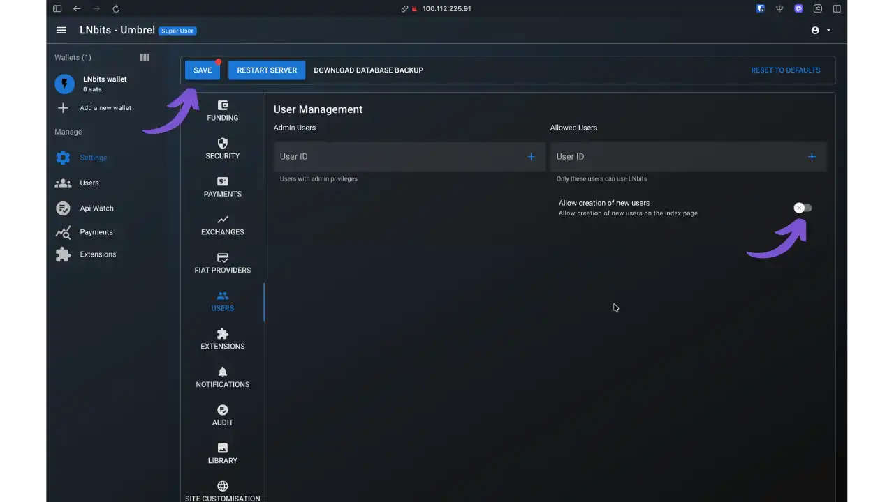


**Alan adı ile halka açık bir sergi için** :


- "Yeni kullanıcıların oluşturulmasına izin ver" seçeneğini devre dışı bırakmalısınız**
- Bu koruma olmadan, internetteki herhangi biri örneğinizde bir hesap oluşturabilir
- Bir saldırgan bilginiz olmadan hesaplar oluşturabilir ve LIGHTNING NODE'ünüzün likiditesini kullanabilir
- Kullanıcı hesaplarını Interface SuperUser'dan manuel olarak oluşturmanız gerekir


**Sadece yerel kullanım içindir** :


- Örneğinize yalnızca yerel olarak erişilebiliyorsa bu seçenek daha az önemlidir (http://localhost:5000)
- Ancak, bu seçeneğin devre dışı bırakılması iyi bir genel güvenlik uygulamasıdır


Yapılandırıldıktan sonra, yalnızca SuperUser yöneticisi Interface "Kullanıcılar" aracılığıyla yeni kullanıcı hesapları oluşturabilir. Bu yaklaşım, Lightning altyapınıza kimlerin erişebileceği ve fonlarınızı kimlerin kullanabileceği üzerinde tam kontrol sağlar.


### İlk kanalın açılması


PHOENIXD otomatik likidite ile kanalları otomatik olarak yönetir. generate, LNbits'ten ~30.000 Sats'lik bir Yıldırım Invoice ve başka bir Wallet'den ödeme yapar. PHOENIXD otomatik olarak ACINQ'ya bir kanal açar. Açılış ücreti (~20-23k Sats) düşülür, kalan bakiye (~7-10k Sats) On-Chain onayından sonra görünür.


./Phoenix-CLI getinfo` ile durumu kontrol edin. Ardından kanal açıklıklarını kontrol etmek için otomatik likiditeyi (`Phoenix.conf` içinde `auto-liquidity=off`) devre dışı bırakmayı düşünün.


### Herkese açık ekran ve HTTPS


**Önemli**: Genel görüntüleme için HTTPS zorunludur (API anahtar güvenliği + LNURL uyumluluğu). Yalnızca yerel kullanım için bu adımı atlayın.


**Caddy (önerilen)**: otomatik SSL. `sudo apt install -y caddy`, `/etc/caddy/Caddyfile` dosyasını düzenleyin:


```
votre-domaine.com {
reverse_proxy 127.0.0.1:5000
}
```


Yeniden başlatın: `sudo systemctl restart caddy`.


**Nginx** : Daha fazla kontrol. Nginx certbot python3-certbot-nginx` yükleyin, `/etc/nginx/sites-available/lnbits` oluşturun:


```nginx
server {
listen 80;
server_name votre-domaine.com;
location / {
proxy_pass http://127.0.0.1:5000;
proxy_set_header Host $host;
proxy_set_header X-Forwarded-Proto $scheme;
}
}
```


Etkinleştir: `sudo LN -s /etc/nginx/sites-available/lnbits /etc/nginx/sites-enabled/ && sudo nginx -t && sudo systemctl reload nginx && sudo certbot --nginx -d your-domain.com`


.env` dosyasına şunu ekleyin: `FORWARDED_ALLOW_IPS=*`


## Şemsiye kurulumu


### App Store'dan Dağıtım


Umbrel App Store'a gidin, "LNbits "i arayın ve "Yükle "ye tıklayın.


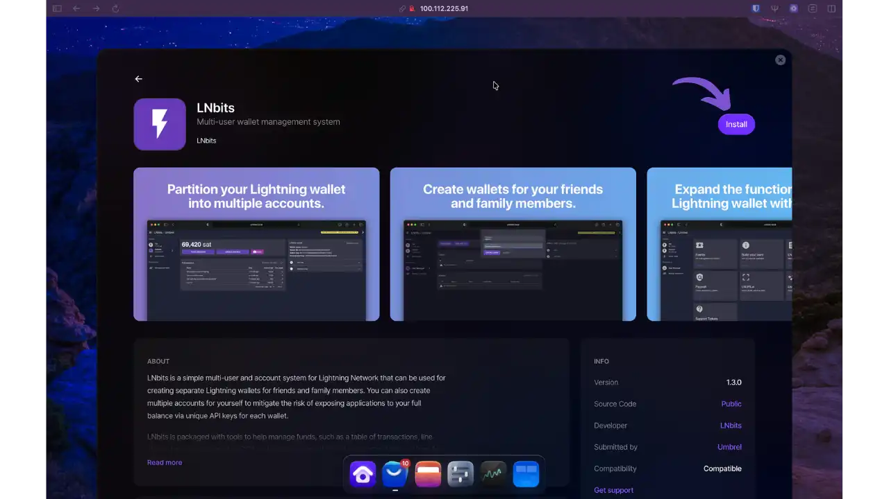


Umbrel gerekli bağımlılıkları otomatik olarak kontrol eder. LNbits'in çalışması için LIGHTNING NODE (LND) gerekir. LIGHTNING NODE'niz zaten çalışır durumdaysa, onaylamak için "LNbits'i Yükle "ye tıklayın.


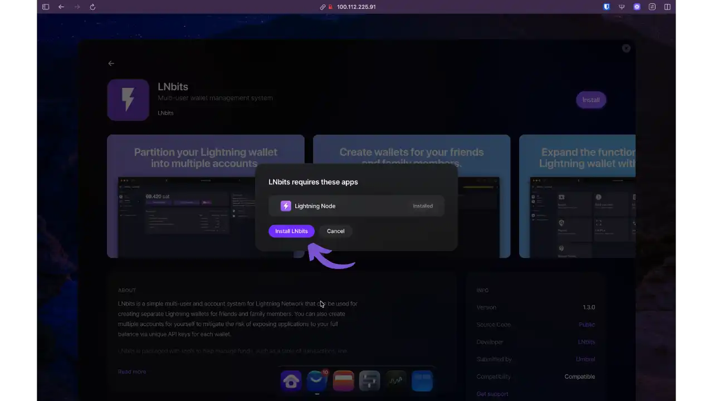


Umbrel Docker imajını indirir, LND ile bağlantıları otomatik olarak yapılandırır ve konteyneri başlatır (2-5 dakika). Kurulum tamamen arka planda gerçekleşir.


### İlk SuperUser yapılandırması


İlk açılışta, LNbits sizden SuperUser yönetici hesabını oluşturmanızı ister. Bir kullanıcı adı girin ve Interface yönetim sistemine erişimi korumak için güvenli bir şifre belirleyin.


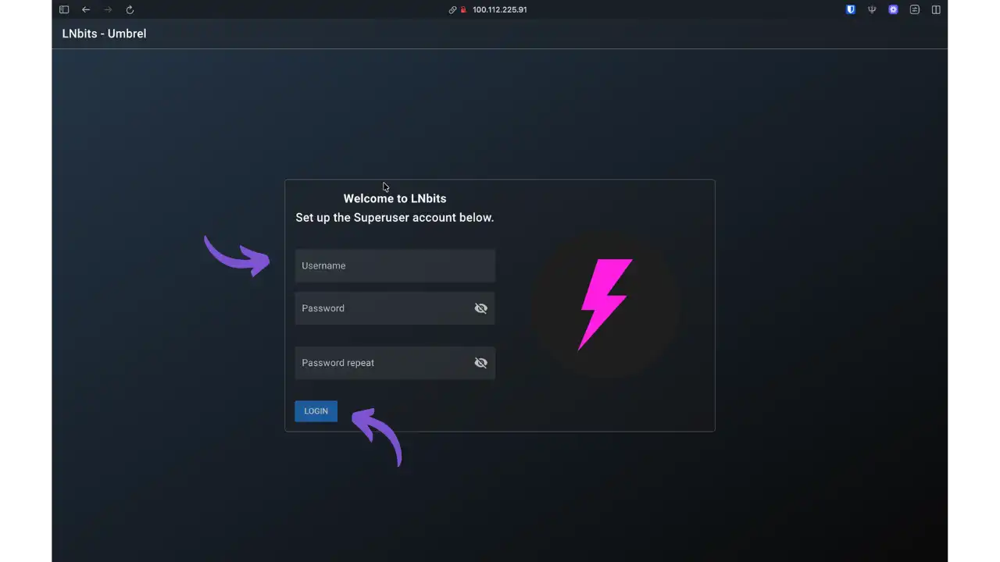


**Önemli**: Bu SuperUser hesabı LNbits örneğinizde tam ayrıcalıklara sahiptir. Güçlü bir şifre seçin ve güvende tutun.


Bir hesap oluşturduğunuzda, otomatik olarak Interface ana yönetim alanına yönlendirilirsiniz. Umbrel, LND'yi finansman kaynağınız olarak zaten kurdu - tüm Yıldırım ödemeleri mevcut kanallarınızdan geçecek.


### Interface yöneticisine erişim


Sol taraftaki menüde, tam yönetim paneline erişmek için "Ayarlar" üzerine tıklayın.


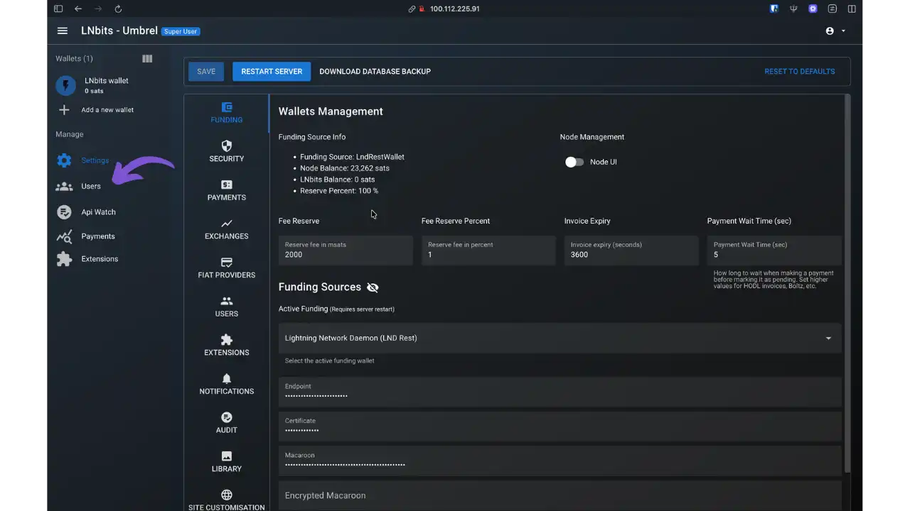


"Cüzdan Yönetimi" bölümü yapılandırmanızla ilgili önemli bilgileri görüntüler:


- Finansman Kaynağı** : LndBtcRestWallet (LND Umbrel düğümünüze doğrudan bağlantı)
- Düğüm Bakiyesi** : Lightning kanallarınızda mevcut toplam likidite
- LNbits Bakiyesi**: LNbits sistemine tahsis edilen fonlar (başlangıçta 0 Sats)


Artık oluşturduğunuz tüm LNbits cüzdanları için Umbrel düğümünüzün likiditesinden doğrudan yararlanabilirsiniz. Ek yapılandırma gerekmez - LNbits hazır ve çalışıyor.


### Kullanıcı yönetimi


LNbits'in en güçlü özelliklerinden biri, her biri şifre doğrulama ve izole cüzdanlara sahip birden fazla bağımsız kullanıcı oluşturma yeteneğidir. Bu mimari, Umbrel düğümünüzün likiditesinden yararlanmanızı mümkün kılarken, farklı kullanımlar için tamamen izole edilmiş alt hesaplar sunar: iş, aile, çalışanlar, projeler vb.


Yan menüde, kullanıcı yönetimine erişmek için "Kullanıcılar" üzerine tıklayın. Yeni bir kullanıcı eklemek için "HESAP OLUŞTUR "a tıklayın.


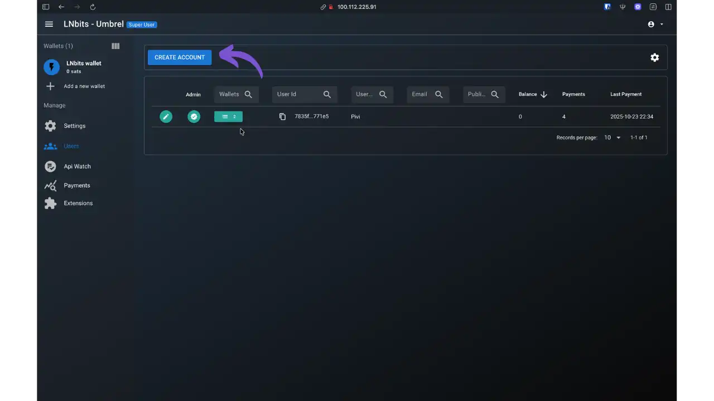


Kullanıcı oluşturma formunu doldurun:


- Kullanıcı adı**: Oturum açma kullanıcı adı (örnek: "Satoshi")
- Parola Ayarla**: Bir kimlik doğrulama parolası belirlemek için bu seçeneği etkinleştirin
- Parola** ve **Parola tekrarı**: Bu kullanıcı için parolayı ayarlayın


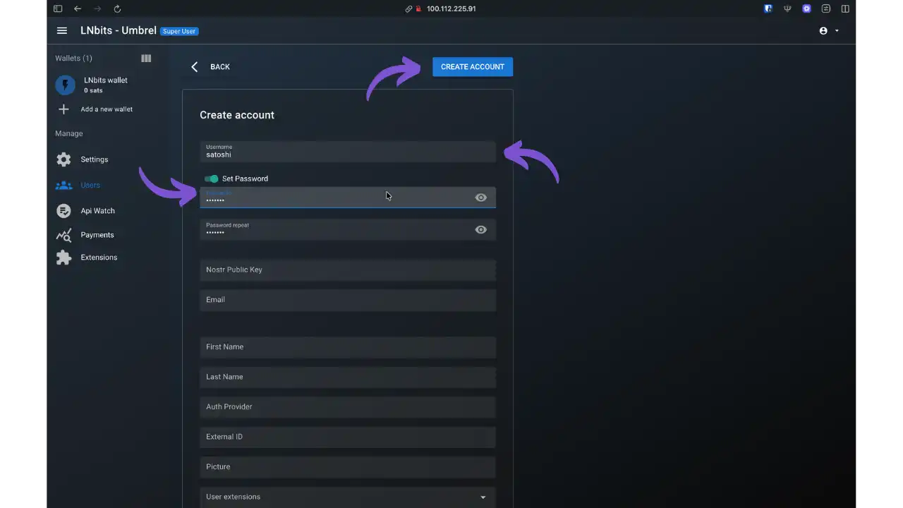


İsteğe bağlı alanlar (Nostr Public Key, Email, First Name, Last Name) minimum yapılandırma için boş bırakılabilir. Onaylamak için "HESAP OLUŞTUR" üzerine tıklayın.


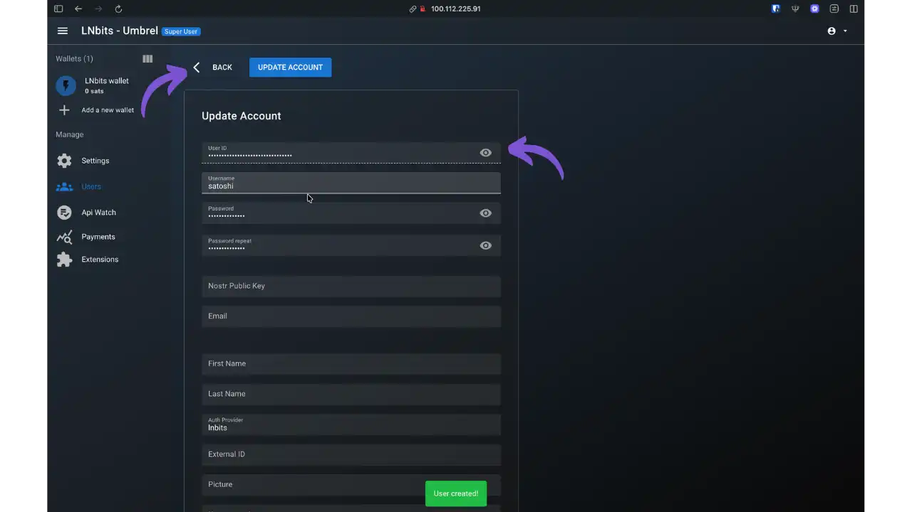


Yeni kullanıcınız artık benzersiz tanımlayıcısı ve kullanıcı adıyla kullanıcılar listesinde görünür.


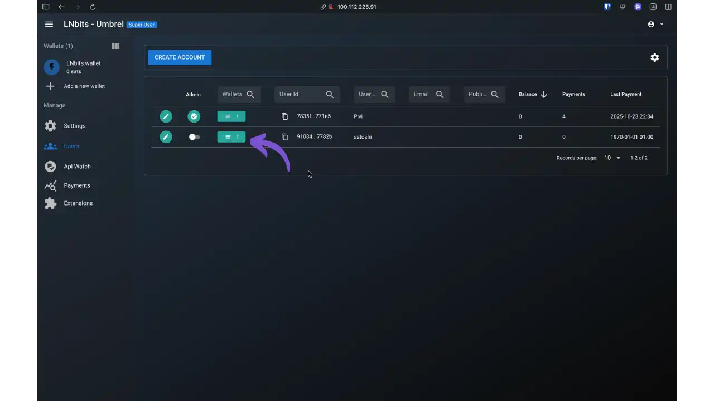


**Önemli nokta**: Her kullanıcı kendi şifresiyle tamamen bağımsız olarak oturum açabilir. SuperUser yöneticisi, Interface yönetim aracı aracılığıyla tam kontrolü elinde tutar.


### Kullanıcı Wallet yönetimi


Artık "Satoshi" kullanıcısı oluşturulduğuna göre, ona bir Wallet Lightning atamanız gerekir. İlgili kullanıcı için Wallet simgesine (ikinci simge) ve ardından "YENİ Wallet YARAT" seçeneğine tıklayın.


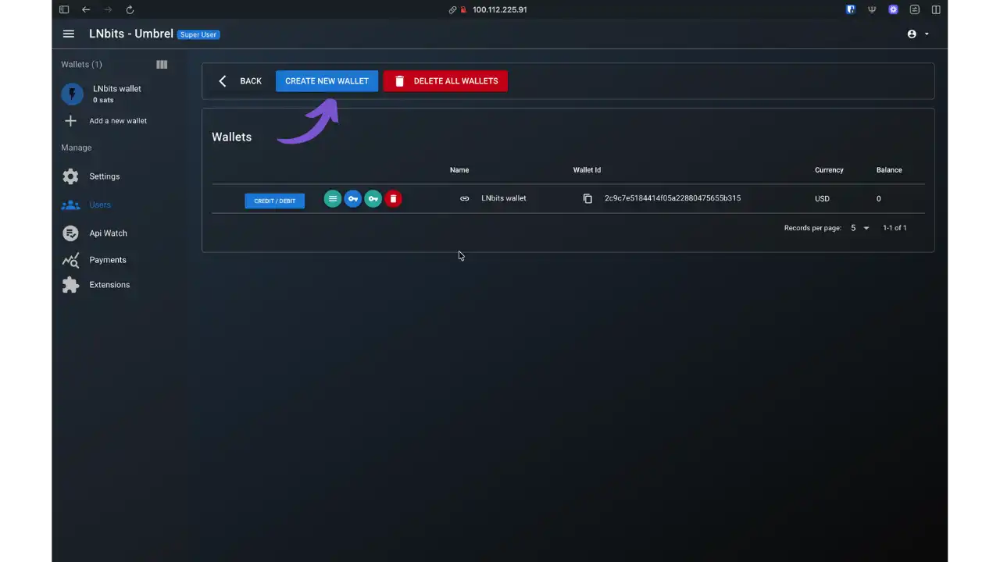


Bir iletişim kutusu sizden Wallet'yi adlandırmanızı ister. Açıklayıcı bir ad girin (örneğin "Wallet Of Satoshi") ve görüntüleme para birimini seçin (CUC, USD, EUR, vb.).


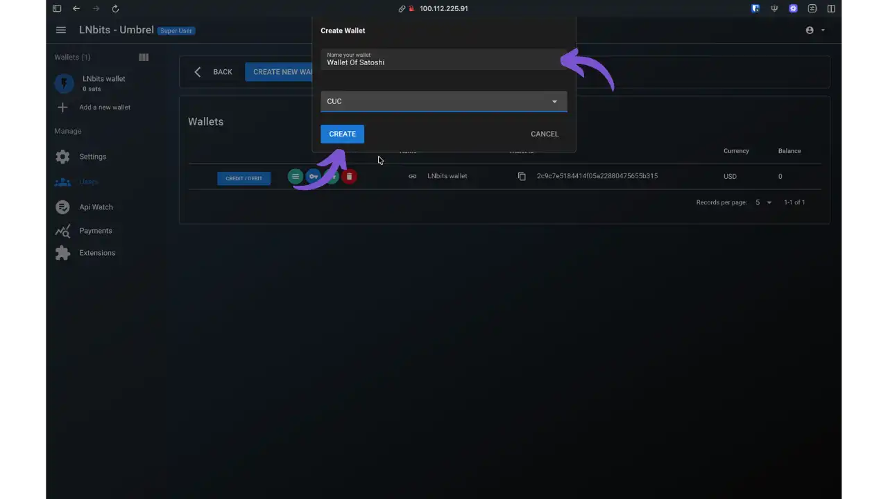


"OLUŞTUR" üzerine tıklayın. LNbits bu kullanıcı için anında çalışan bir Wallet Lightning oluşturur.


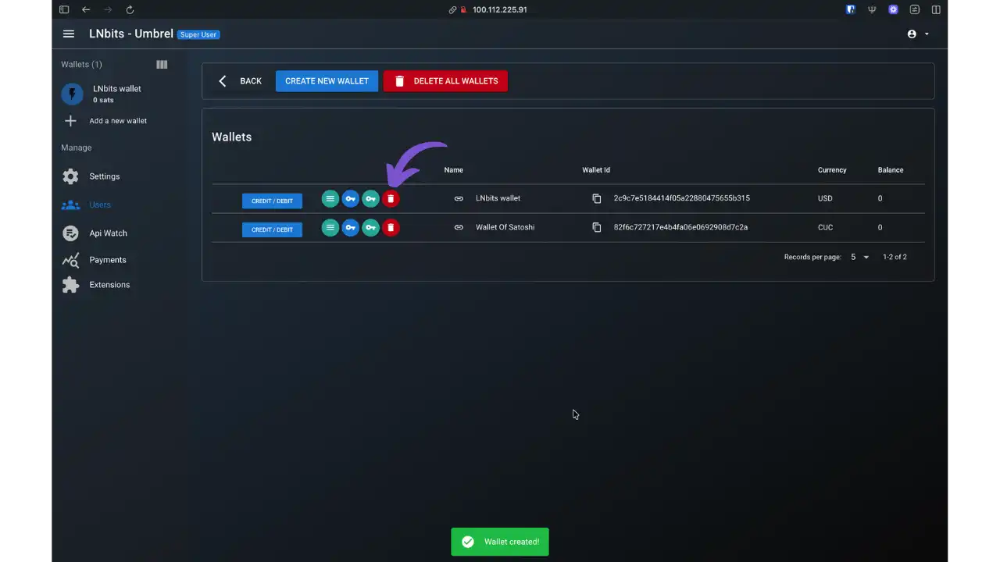


Şimdi mevcut iki cüzdanı görüyorsunuz: otomatik olarak oluşturulan varsayılan Wallet "LNbits Wallet" ve yeni "Wallet Of Satoshi". Kullanıcı deneyimini basitleştirmek için, sil simgesine (kırmızı çöp kutusu) tıklayarak varsayılan Wallet'i silebilirsiniz.


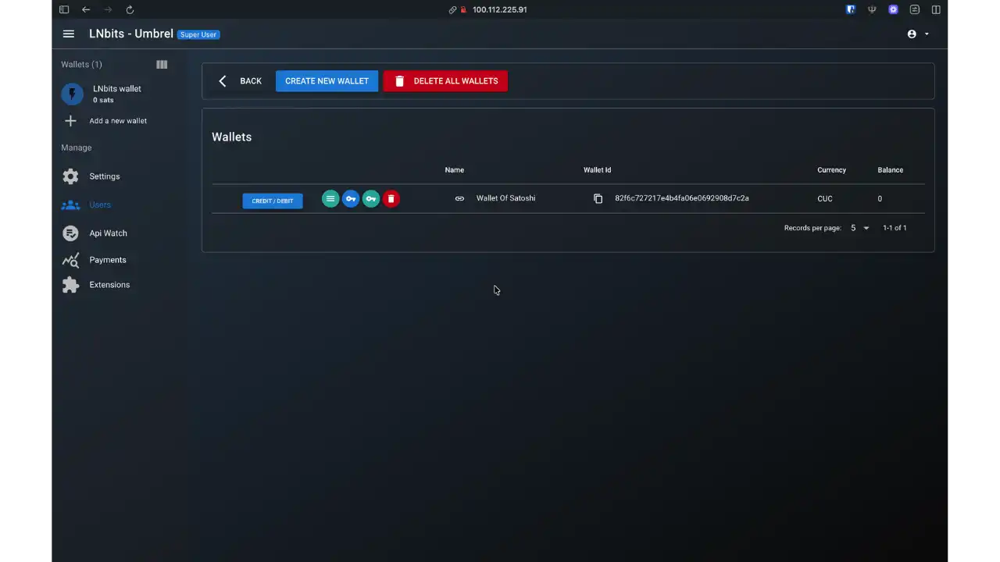


"Satoshi" kullanıcısının artık açıkça tanımlanmış tek bir Wallet'si vardır. Her bir Wallet kullanıcısı, temel LND düğümünüzün likiditesini kullanırken tamamen özerk olarak çalışır.


**Anahtar kavram**: Tüm bu cüzdanlar Umbrel düğümünüzün küresel likiditesini paylaşır. Her Wallet için yeni Lightning kanalları oluşturmazsınız - LNbits, mevcut Lightning altyapınızdaki fonların tahsisini yöneten akıllı bir muhasebe Layer görevi görür. LNbits'in çoklu Wallet sisteminin gücü budur.


### Kullanıcı girişi


SuperUser hesabından çıkış yapın (sağ üstteki simge) ve LNbits giriş sayfasına dönün. Artık yeni kullanıcının kimlik bilgileriyle giriş yapabilirsiniz.


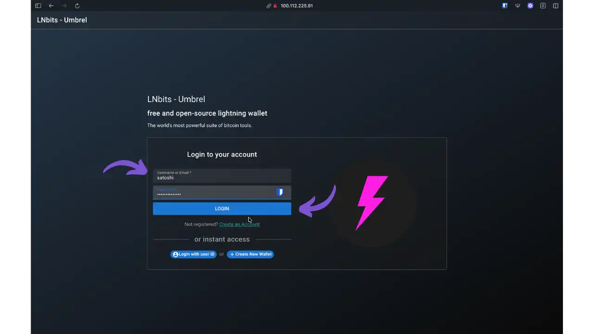


Önceden tanımlanmış kullanıcı adını ("Satoshi") ve şifreyi girin, ardından "LOGIN" (GİRİŞ) düğmesine tıklayın. Kullanıcı, yönetim Interface'den tamamen izole edilmiş kişisel Wallet'e doğrudan erişim kazanır.


### Wallet kullanıcısından Interface


Bağlandıktan sonra, kullanıcı Wallet Lightning'den Interface'sına erişir.


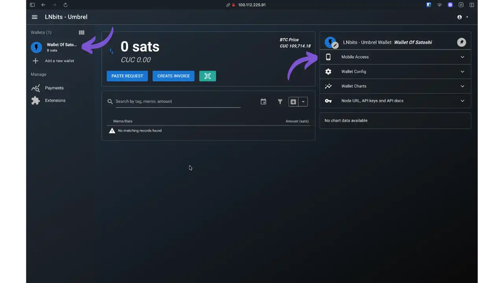


Interface özellikleri :


- Mevcut bakiye**: Sats ve seçilen para birimi cinsinden görüntülenir (bu örnekte CUC)
- Ana eylemler**: "TALEP YAPIŞTIR" (ödemek için bir fatura yapıştırın), "Invoice OLUŞTUR" (generate bir makbuz), QR simgesi (hızlı tarama)
- İşlem geçmişi** : Tüm ödemelerin ve makbuzların tam listesi
- Sağ yan panel**: Yapılandırma ve erişim seçenekleri


### Wallet mobil erişim


Sağ taraftaki panel özellikle pratik bir özellik sunar: Wallet'e mobil erişim. Mevcut seçenekleri keşfetmek için "Mobil Erişim" bölümünü açın.


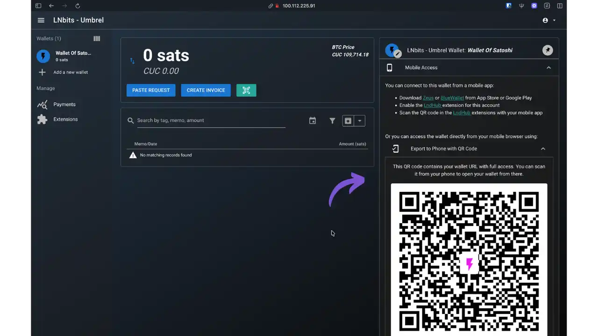


LNbits, bu Wallet'ü bir akıllı telefonda kullanmanın çeşitli yollarını sunuyor:


**Seçenek 1: Uyumlu mobil uygulamalar


- App Store veya Google Play'den **Zeus** veya **BlueWallet** indirin
- Bu Wallet için LNbits'te **LndHub** uzantısını etkinleştirin
- Wallet'yı bağlamak için mobil uygulama ile LndHub QR kodunu tarayın


**Seçenek 2: Mobil tarayıcı üzerinden doğrudan erişim**


- "QR Kodu ile Telefona Aktar" bölümünde görüntülenen QR kodu, entegre kimlik doğrulama ile Wallet'nin tam URL'sini içerir
- Wallet'i doğrudan mobil tarayıcınızda açmak için bu QR kodunu akıllı telefonunuzdan tarayın
- Hızlı erişim için ana ekrana sayfa ekleme


**Önemli güvenlik**: Bu URL, Wallet'a tam erişim için API anahtarlarını içerir. Asla herkese açık olarak paylaşmayın. Bu QR koduna Bitcoin özel anahtarlarınıza davrandığınız gibi davranın - bu QR kodunu tarayan herkes Wallet'a tam erişim elde eder.


Bu mobil özellik, LNbits Umbrel örneğinizi siz ve arkadaşlarınız için gerçek bir Lightning Wallet sunucusuna dönüştürürken, kendi barındırdığınız düğümünüz sayesinde fonlarınız üzerinde tam egemenliğinizi korur.


### Kullanıcı erişim paylaşımı


Bu çok kullanıcılı yapılandırmanın ana kullanım alanı **cüzdanları ailenizle veya yakın çevrenizle paylaşmaktır**. Özel bir Wallet (örneğimizde "Satoshi" gibi) ile bir kullanıcı oluşturduktan sonra, bu giriş kimlik bilgilerini evinizin güvenilir üyeleriyle paylaşabilirsiniz.


**Umbrel'de erişim güvenliği**: Umbrel'deki LNbits örneğinize erişim doğal olarak korunmaktadır, çünkü yalnızca :


- Yerel ağınızda** : Evinizin aynı WiFi/Ethernet ağına bağlı üyeleri örneğe erişebilir
- VPN aracılığıyla**: Umbrel sunucunuzda yapılandırılmış Tailscale gibi bir VPN kullanıyorsanız, yetkili kullanıcılar güvenli uzaktan erişim sağlayabilir


Bu çifte Layer koruması (ağ erişimi + kullanıcı kimlik doğrulaması) Umbrel'de "Yeni kullanıcıların oluşturulmasına izin ver" seçeneğini daha az kritik hale getirir. Yalnızca ağınıza veya VPN'inize zaten erişimi olan kişiler Interface girişine ulaşabilir.


**Tipik senaryo**: Bir "baba" hesabı, bir "anne" hesabı, bir "işletme" hesabı vb. oluşturursunuz. Ailenin her bir üyesi, Umbrel düğümünüzün ortak likiditesinden yararlanırken kendi izole Wallet Lightning'ine sahiptir. Kullanıcı adı ve şifreyi paylaşmanız yeterlidir - kullanıcı daha sonra yerel ağınızdaki herhangi bir cihazdan veya Tailscale VPN'iniz üzerinden bağlanabilir. Daha fazla bilgi için lütfen özel Tailscale eğitimimize bakın:


https://planb.academy/tutorials/computer-security/communication/tailscale-9acbd7de-04d9-40f6-ab80-35f0dfedb632

### Mevcut uzantıları keşfedin


Interface SuperUser'a dönün ve tüm LNbits uzantı ekosistemini keşfetmek için sol yan paneldeki "Uzantılar" menüsüne erişin.


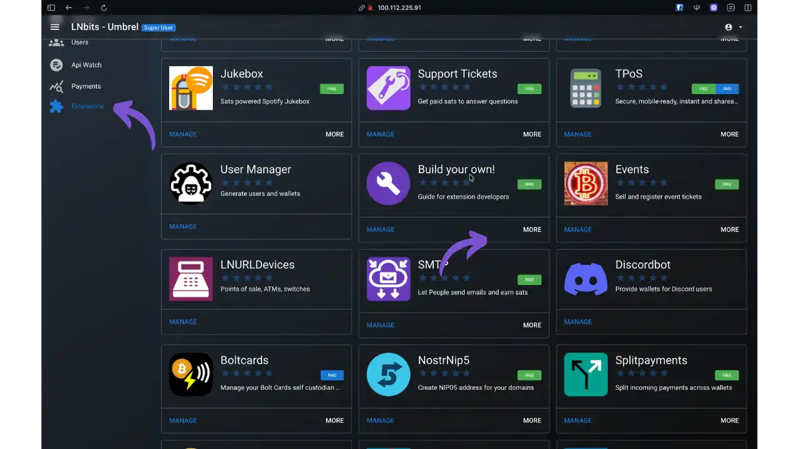


LNbits, örneğinizi gerçek bir Lightning hizmetleri platformuna dönüştüren zengin bir uzantı kataloğu sunar:


- Jukebox**: Sats destekli müzik kutusu sistemi (Spotify ödemeleri)
- Destek Biletleri**: Ücretli destek sistemi (soruları yanıtlamak için Satss alın)
- TPoS**: Perakendeciler için güvenli, mobil satış noktası terminali
- Kullanıcı Yöneticisi**: gelişmiş kullanıcı ve Wallet yönetimi (az önce kullandık)
- Etkinlikler**: Etkinlik biletlerinin satışı ve onaylanması
- LNURLDevices**: Satış noktası yönetimi, ATM'ler, bağlı anahtarlar
- SMTP**: Kullanıcıların e-posta göndermesini ve Satss kazanmasını sağlayın
- Boltcards**: Lightning dokun-öde ödemeleri için NFC kartlarının programlanması
- NostrNip5**: Alan adlarınız için NIP5 adresleri oluşturun
- Splitpayments**: Ödemelerin birden fazla cüzdan arasında otomatik dağıtımı


Her uzantı bu Interface'den tek bir tıklama ile etkinleştirilir. "ÜCRETSİZ" olarak işaretlenmiş uzantılar ücretsizdir, bazıları ise "ÜCRETLİ" sürümler olarak mevcuttur. İhtiyaçlarınıza uygun olanları belirlemek için kataloğu keşfedin - ister iş, ister aile yönetimi veya Lightning Network'in yeteneklerini denemek için.


## Avantajlar ve sınırlamalar


**Avantajlar**: Finansal egemenlik (fonlar/anahtarlar/veriler üzerinde tam kontrol), mimari esneklik (kayıpsız VPS→Full node geçişi), profesyonel genişletme sistemi, sezgisel Interface.


**Sınırlamalar** : Yazılım beta aşamasındadır (miktarlar konusunda dikkatli olunmalıdır), güvenlik yöneticinin sorumluluğundadır, hassas API anahtarları içeren URL'ler (HTTPS zorunludur), çok kullanıcılı yönetim velayet sorumluluğunu gerektirir.


## En iyi uygulamalar


**Yedekler**: seed PHOENIXD/credentials LND, LNbits veritabanı, `.env` dosyaları. Günlük olarak otomatikleştirin, üretim sunucusundan uzak tutun, şifreleyin. Geri yüklemeleri düzenli olarak test edin.


**Bakım**: Düzenli olarak güncellemeleri kontrol edin (LNbits, Lightning arka ucu, işletim sistemi). Büyük güncellemelerden önce daima sürüm notlarını kontrol edin.


- Umbrel'de**: App Store yeni sürümleri size otomatik olarak bildirir. Uzantıları "Uzantıları Yönet" > "Tümünü Güncelle" aracılığıyla senkronize edin. Umbrel otomatik yedeklemelerine SQLite veritabanının dahil edilmesini kontrol edin.
- VPS** üzerinde: Cd lnbits && git pull && uv sync --all-extras && sudo systemctl restart lnbits` ile manuel olarak güncelleyin. Sistem günlüklerini izleyin: `sudo journalctl -u lnbits -f`.


## Sonuç


LNbits kendi kendini barındırma, Lightning finansal egemenliğine giden somut bir yol sunar. VPS+PHOENIXD, hızlı hizmetler için hafif bir çözüm sunar, Umbrel mevcut Bitcoin düğümü ile tam entegrasyon sağlar. Ölçeklenebilir mimari, basit çok kullanıcılı Wallet'den sofistike iş kullanım durumlarına kadar evrime olanak tanır.


Kendi kendine barındırma sorumluluk gerektirir: tohumları yedekleyin, erişimi koruyun, mütevazı miktarlarla başlayın. Bu önlemler sayesinde LNbits, merkeziyetsizliği ve özerkliği korurken Lightning ekonomisi için sağlam bir çözüm haline gelir.


## Kaynaklar


### Resmi belgeler


- [LNbits Dokümantasyonu](https://docs.lnbits.org)
- [LNbits GitHub](https://github.com/lnbits/lnbits)
- [PHOENIXD GitHub](https://github.com/ACINQ/PHOENIXD)
- [Resmi kurulum kılavuzu](https://github.com/lnbits/lnbits/blob/main/docs/guide/installation.md)


### Topluluk rehberleri


- daniel P. Costas [İlk Ubuntu sunucu yapılandırması](https://danielpcostas.dev/ubuntu-server-initial-configuration-a-step-by-step-guide/) (adım adım VPS güvenliği)
- daniel P. Costas tarafından [Ubuntu VPS üzerinde LNbits + PHOENIXD kurulumu](https://danielpcostas.dev/install-lnbits-PHOENIXD-vps-ubuntu/) (tam kılavuz)
- axel tarafından [Clearnet üzerinde LNbits Sunucusu](https://ereignishorizont.xyz/lnbits-server/en/)
- hannes tarafından [VPS üzerinde LNbits](https://github.com/TrezorHannes/vps-lnbits)