La adopción mundial de Bitcoin se basa en casos de uso tangibles en la vida cotidiana. El uso de Bitcoin en transacciones comerciales instantáneas en todo el mundo refuerza esta adopción tanto en grandes instituciones como en pequeñas empresas. En este tutorial, echaremos un vistazo a Speed Business, una plataforma de pago unificada que permite a tu negocio aceptar pagos Bitcoin a través de Lightning.

## Primeros pasos con Speed Business

[Speed Business](https://www.tryspeed.com/) es una plataforma desarrollada por [Speed Wallet](https://www.speed.app/) que permite a cualquier comerciante integrar pagos instantáneos y de bajo coste en Bitcoin y stablecoin.

Speed dispone de una amplia gama de funciones para cubrir los aspectos financieros de tu empresa. Encontrarás:

- **Configuración de pago en línea**: Recibe los pagos de tus clientes estén donde estén, a traves de tu página web.
- **Pagos in situ**: Ideal para tiendas y comercios que cobran en efectivo en la tienda.
- **Retiros**: Retira tus activos sin problemas y utiliza tu Bitcoin para pagar a tus clientes y salarios.
- **Conexión con otras plataformas**: ¿Utilizas herramientas externas para gestionar tus pagos? Speed te ofrece la posibilidad de conectarlas a tu plataforma, para un ecosistema todo en uno que refleje tu negocio.

Crea tu cuenta en [Speed](https://app.tryspeed.com/register/) y empezaremos a configurar los pagos para tu empresa.

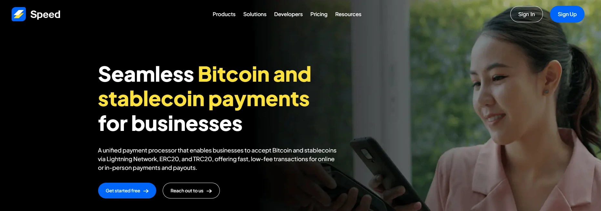

Proporcionar información a Speed Wallet para que pueda ayudarte a simplificar la plataforma de acuerdo con tu experiencia con Bitcoin y Lightning Network

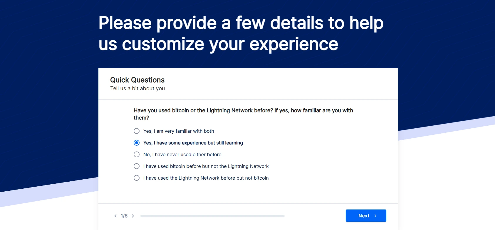

Speed incluye un kit de desarrollo de software que permite personalizar la integración y una extensión para la integración estándar.

Para los propósitos de este tutorial, trabajaremos con una integración estándar utilizando la extensión proporcionada por Speed.

Para facilitar su experiencia, Speed ofrece un modo de prueba que permite probar las distintas funciones sin tener que preocuparse por su impacto en la gestión de tu tienda.

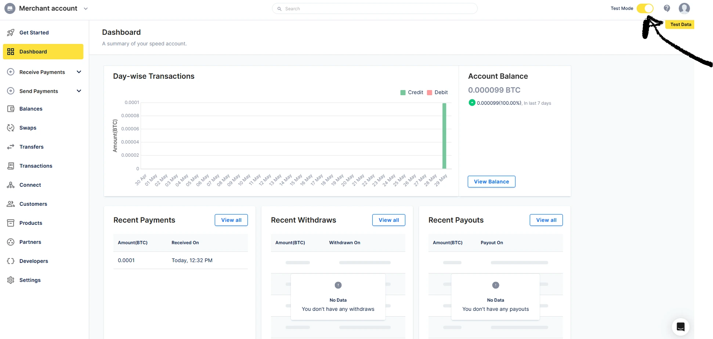

Puedes probar todos los aspectos tratados en este tutorial utilizando el modo de prueba.
Cuando desactives el modo de prueba, deberás configurar tu cartera de retiros.

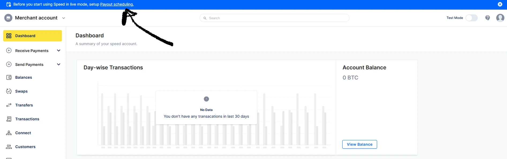

Si aún no tienes una Bitcoin y/o una Lightning Wallet, te recomendamos que eches un vistazo a nuestros tutoriales sobre [monederos móviles](https://planb.network/tutorials/wallet).

https://planb.network/tutorials/wallet/mobile/wallet-of-satoshi-39149d86-e42b-4e8f-ae9f-7e061e7784f7

https://planb.network/tutorials/wallet/desktop/sparrow-c674e2ac-d46f-4c82-92a7-7d1b0e262f5d

⚠️ **IMPORTANTE**: Cuando configures tu cartera, elije el tipo **BTC (On-Chain)** cuando recibas grandes cantidades, del orden de miles de euros, para garantizar una confirmación fiable en Bitcoin, y el tipo **LN Address** cuando desees recibir micropagos instantáneos en tu negocio.

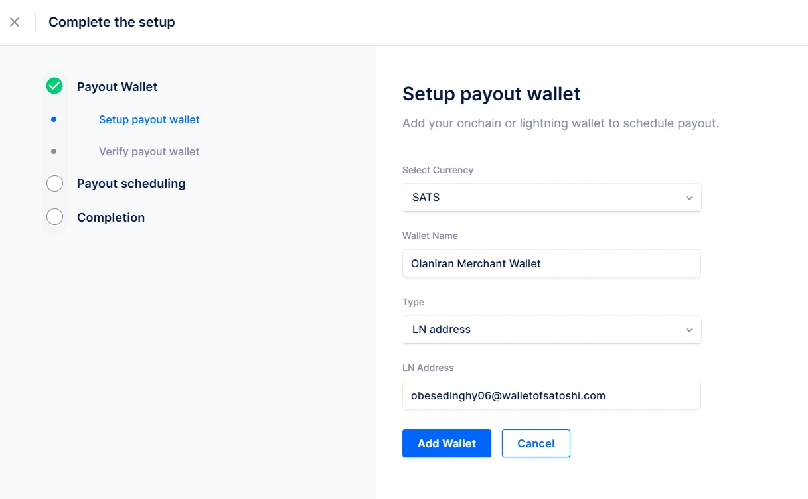

A continuación, confirma la incorporación de tu cartera mediante el correo electrónico de verificación enviado por Speed.

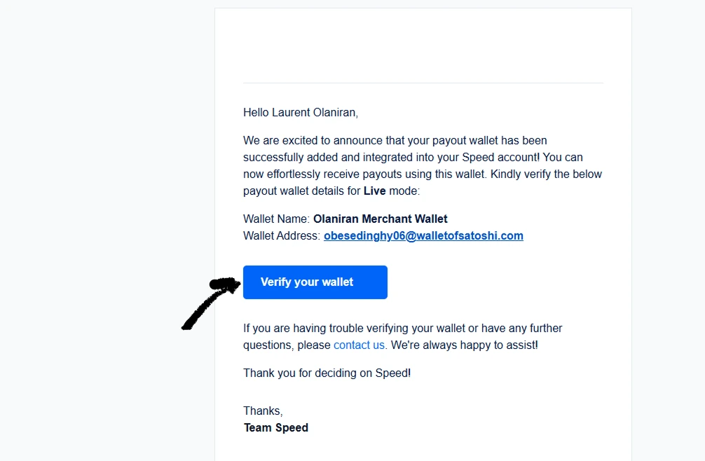

Define el retiro mínimo y el saldo mínimo por debajo de los cuales no podrás retirar tus activos.

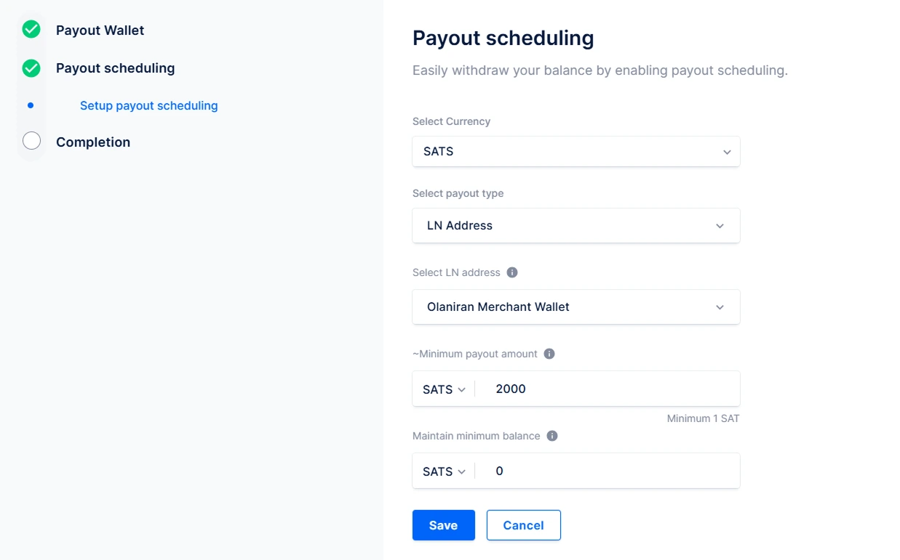

## Añade tus productos

En la sección **Productos**, añade el catálogo de productos que vendes en tu tienda.

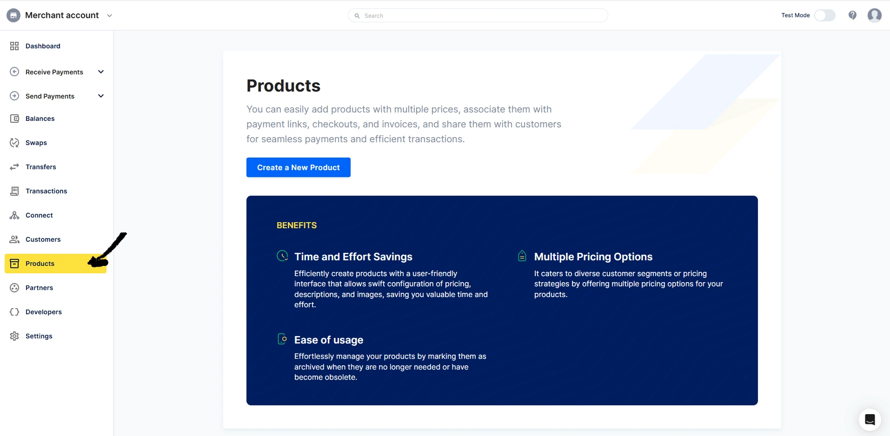

Pulsa **Siguiente** para seguir definiendo tu producto y sus características.

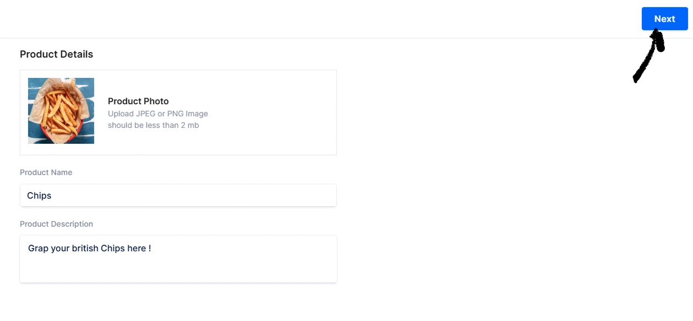

A continuación, define el precio de venta de su producto.

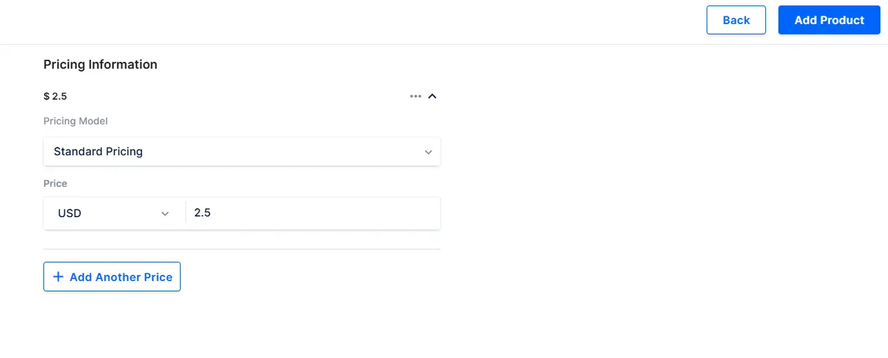

Estos productos permiten generar enlaces de pago para que tus clientes puedan pagar por ellos.

## Recepción de pagos

Speed Wallet ofrece la posibilidad de utilizar varios métodos para recibir pagos en línea o in situ en tu empresa.

En el menú **Recibir pagos > Pagos**, encontrarás el historial de pagos recibidos y su estado (pagado, vencido, impagado, cancelado).

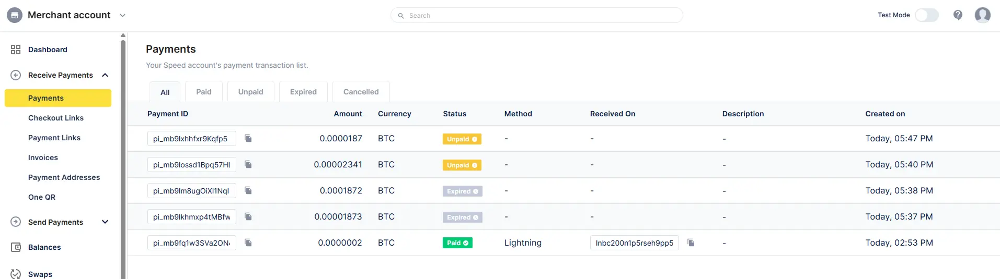

- Los enlaces de pago se encuentran en la opción **Enlaces de pago** y permiten configurar páginas de pago únicas para tus productos.

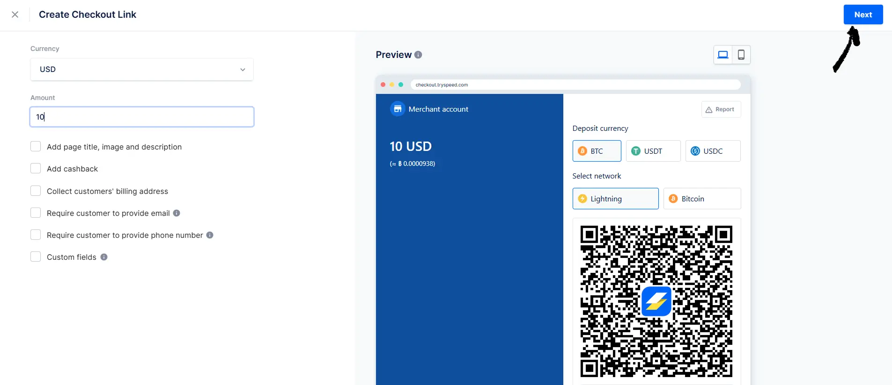

En función de tus necesidades, puedes configurar y personalizar la página de pago para recibir pagos de un importe determinado.

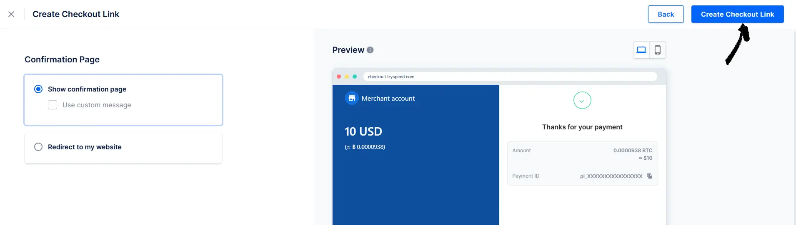

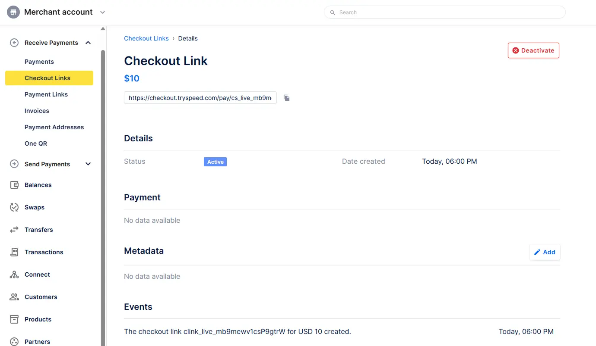

Encontrarás la lista de enlaces de pago que has configurado en su cuenta en el menú **Enlaces de pago**.

- Facturas: Speed permite generar presupuestos y facturas para tus clientes.

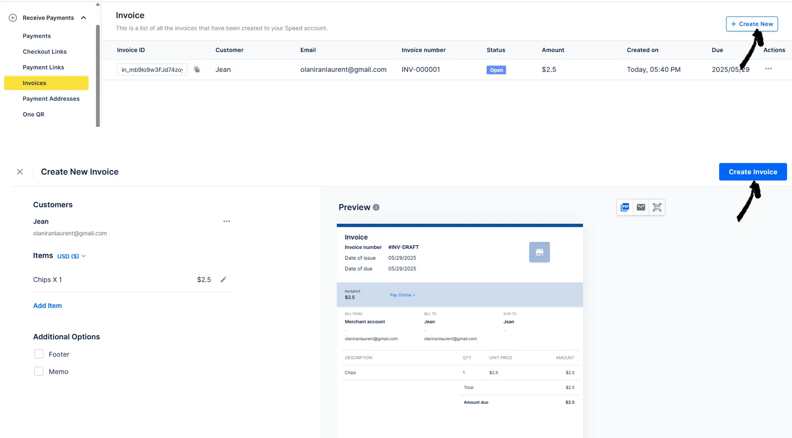

Selecciona un cliente que ya hayas registrado o crea uno propio fácilmente.

Al establecer la moneda, tendrás acceso a la lista de productos configurados en esa moneda.

Puedes enviar esta factura en formato PDF, por correo electrónico, o generar un enlace de código QR para escanear (ideal para tiendas que cobran in situ) para que tu cliente pueda realizar el pago.

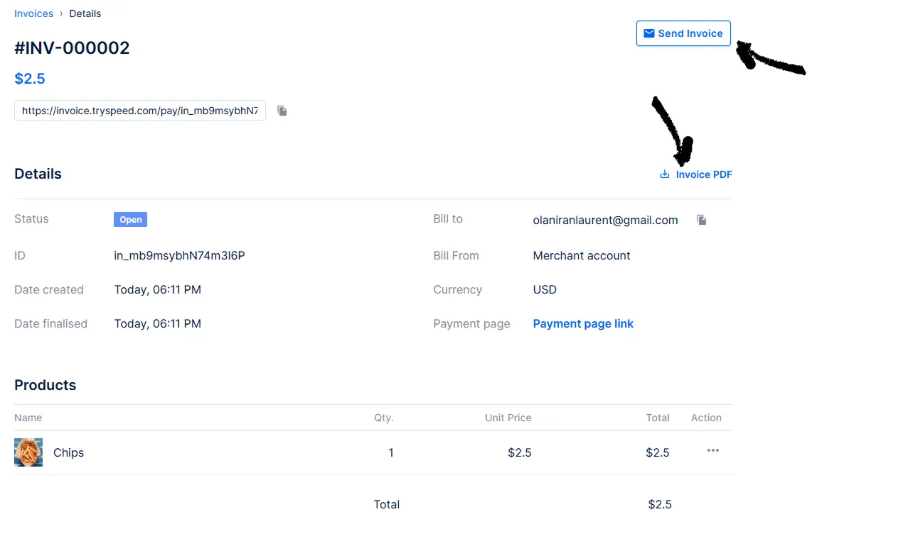

- El menú **Direcciones de pago** permite configurar una dirección Lightning en el que puedes recibir varios pagos de distintos importes.

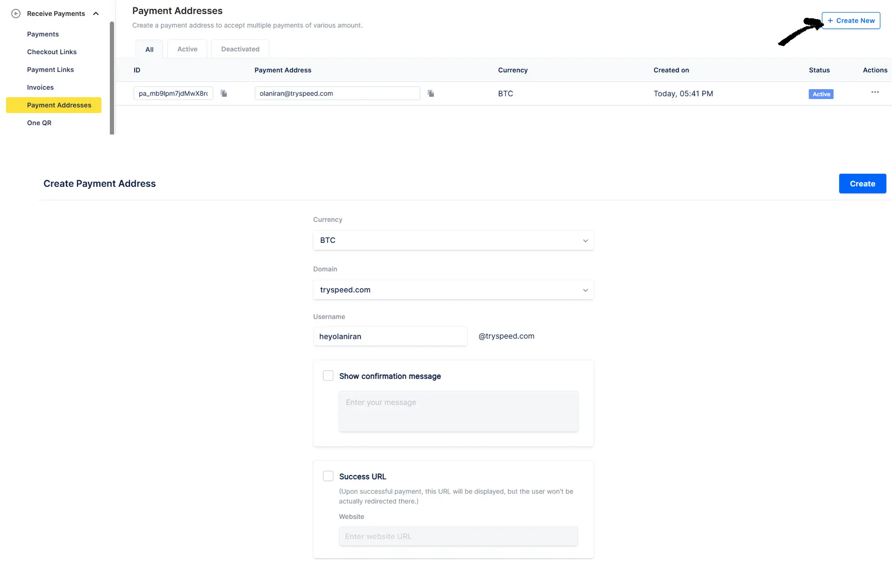

⚠️ Puedes agregar y utilizar nombres de dominio con excepción de los de Speed. Sin embargo, para tu primera experiencia, recomendamos que utilices la configuración estándar para beneficiarte de toda la maestría de la ayuda técnica de Speed Business.

- El **QR Único**: Ideal para pagos in situ, crea un código QR asociado a tu negocio para que tus clientes puedan pagar sus productos.

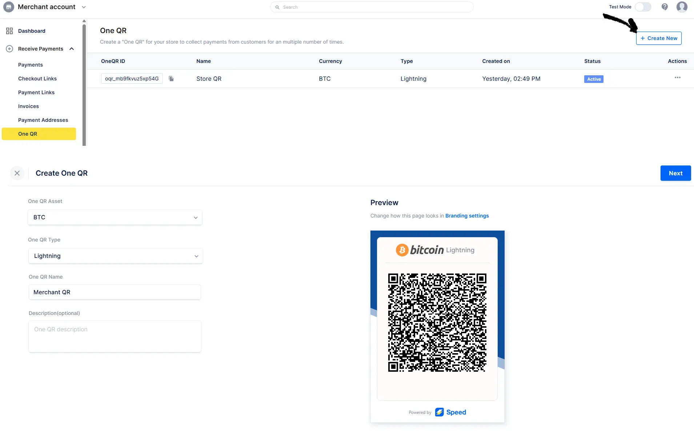

## Realizar pagos desde Speed

Speed business no se limita a cobrar los pagos de tu negocio, sino que es una cartera que te permite gestionar toda la parte financiera de tu empresa sin problemas.

En el menú **Enviar pagos**, encontrará todas las opciones de transferencia de dinero que ofrece Speed.

- **Pagos instantáneos**: Con la opción de envío instantáneo, envía Bitcoin de forma segura al instante desde tu cuenta de comerciante.
- **Genera enlaces de retiro** para permitir a tus socios y proveedores acceder a su pago en una fecha posterior sin necesidad de su presencia en línea.

En la opción **Enlaces de retiro**, crea un nuevo enlace de retiro y, a continuación, configúralo definiendo la divisa, el importe y una contraseña para proteger la transacción de tu destinatario.

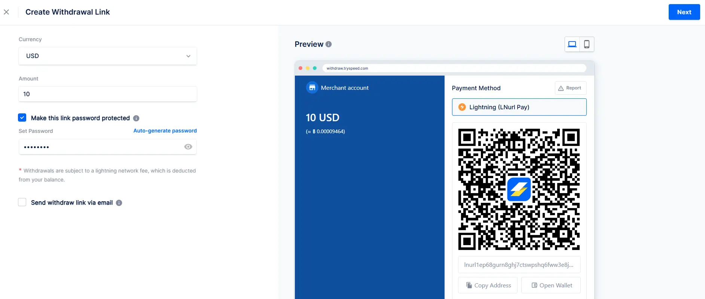

⚠️ Los enlaces de retiro sólo pueden utilizarse una vez, te recomendamos que establezcas una contraseña única para cada enlace, de lo contrario cualquier persona en posesión del enlace podrá retirar el importe establecido en el enlace de retiro.

- **Pagos**: En el menú Pagos, realiza retiros de tu saldo de Speed Business a tu Wallet personal.

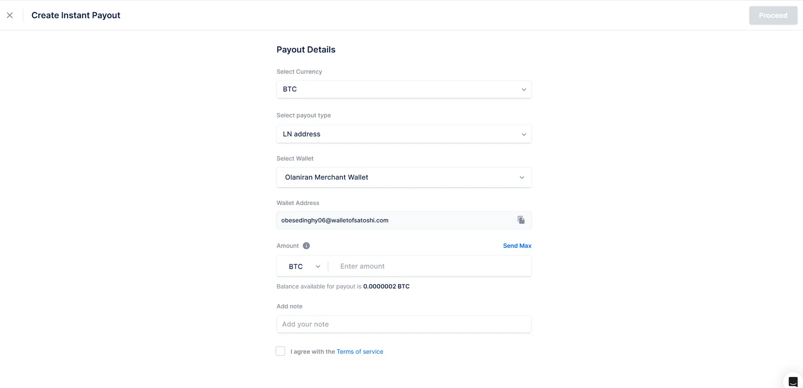

- **Descuentos**: Incentiva a tus clientes habituales estableciendo opciones de reembolso para obtener bonificaciones.

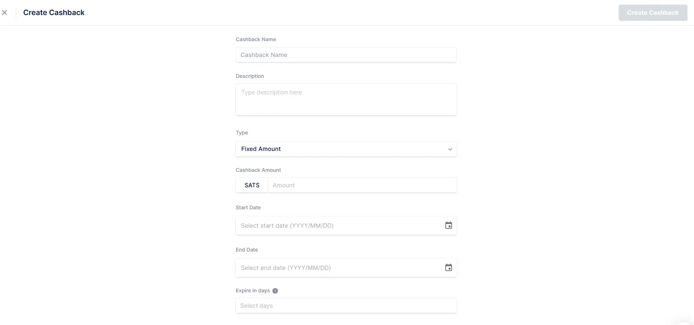

## Explorando Speed Business

Speed Business es una plataforma multidivisa que permite mantener carteras separadas en un único sistema.

En la opción **Balances**, encuentra el saldo de tus carteras Bitcoin, USDT y USDC.

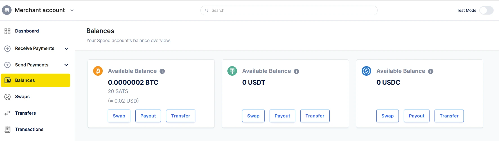

Al igual que Speed Wallet, en el menú **Swap**, Speed Business permite intercambiar divisas entre tus diferentes billeteras (BTC, USDT, USDC) por tan sólo 20.000 Sats (alrededor de $20 al cambio actual).

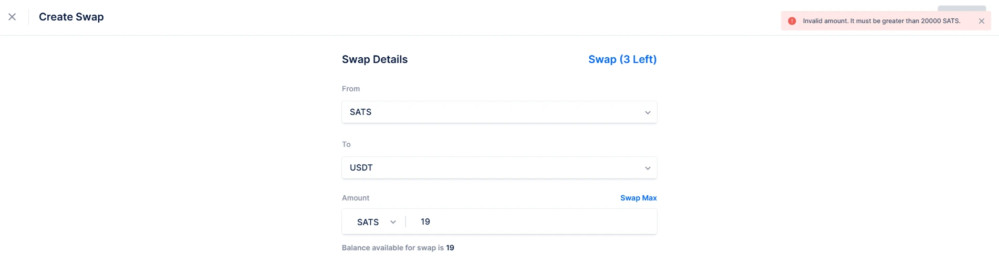

En el menú **Transferencia**, comunícate con otros comerciantes y transfiere Bitcoin fácilmente utilizando tu Speed ID.

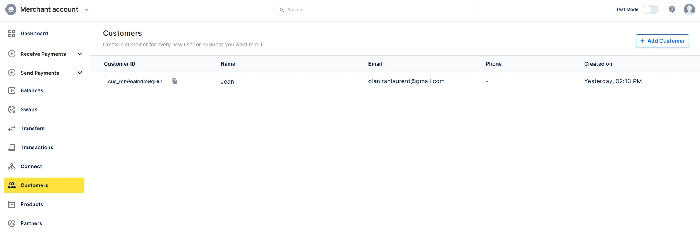

En el menú **Clientes**, podrás guardar y consultar la lista de tus clientes (particulares o empresas).

Gana recompensas participando en el programa de afiliados de Speed.

En el menú **Socios**, invita a los comerciantes a establecer su negocio en Speed business y obtener ingresos pasivos.

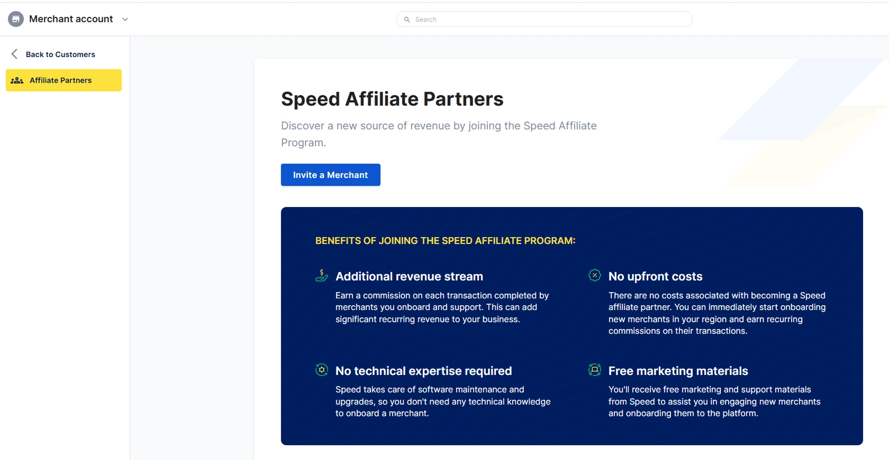

## Integra Speed en el sitio web de tu empresa

Speed Business dispone de un kit de desarrollo que permite integrar esta solución de pago en tu propio sitio web.

En el menú **Desarrolladores**, crea tus claves públicas y privadas para utilizar los métodos de la API Speed Wallet.

Encuentra la [documentación] completa (https://apidocs.tryspeed.com/reference/introduction) para una mejor integración de Speed Business.

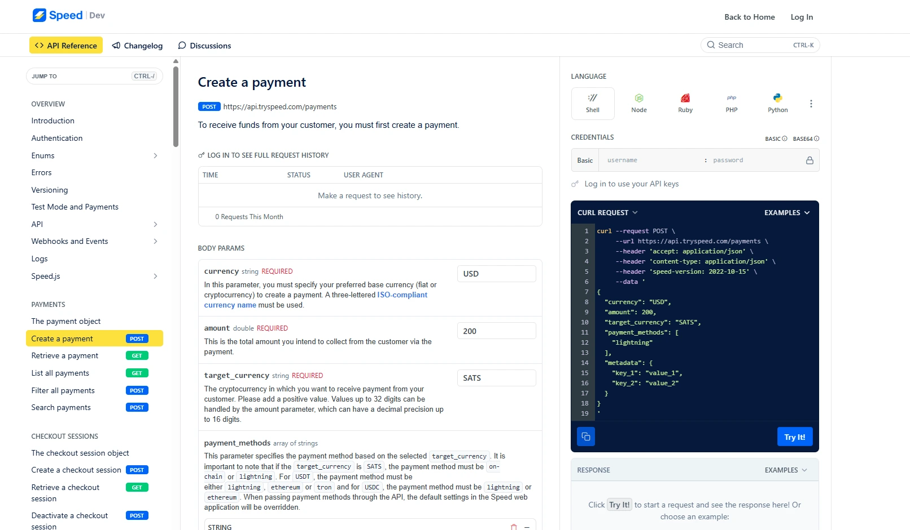

## Personaliza tu empresa

En el menú **Configuración**, puedes configurar tu perfil de comerciante y la información de tu empresa.

En la sección **Configuración de la empresa**:

- Edita los datos de tu cuenta de vendedor, como tu nombre, ubicación y zona horaria.
- Comprueba los permisos activados (recibir pago, enviar Bitcoin, intercambiar, transferir, retirar) en tu cuenta en el menú **Estado de la cuenta**.
- Define tus monederos de reintegro en el menú **Monederos de reintegro** y configúralos en el menú **Programación de reintegros**.
- Define las directrices gráficas de tu negocio y personaliza a tu gusto las páginas de pago, los correos electrónicos, los códigos QR y las facturas en el menú **Branding**.
- Configura los métodos de pago en las monedas aceptadas en el menú **Método de pago**.

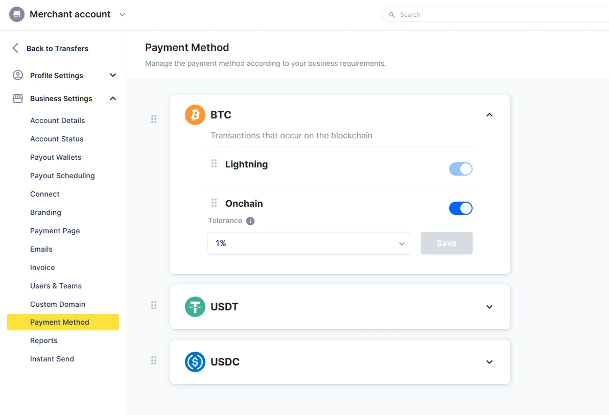

⚠️ La tolerancia corresponde al porcentaje de rebaja que aceptas sobre el importe del total para que un pago se considere válido. Si tu cliente tiene que pagar 100 USD y la tolerancia es del 1%, cualquier pago de 99 USD validará la factura de 100 USD.

Ya tienes un buen conocimiento de Speed, integra Bitcoin en tu negocio y desarrolla tu economía circular local basada en Bitcoin. Si este tutorial te ha resultado útil, estamos seguros de que disfrutarás igualmente con nuestro tutorial Swiss Bitcoin Pay.

https://planb.network/tutorials/business/point-of-sale/swiss-bitcoin-pay-2-a78b057e-ed11-47ac-860c-71019fcb451a

