Zaprite is a premier invoicing and business payments solution. It enables acceptance of payments via Bitcoin, Lightning and Liquid Networks, as well as legacy fiat payment rails including card payments and bank transfers.This tutorial covers the platform's features and prepares users to accept payments through various methods while optimizing business operations.

## Free Trial

New users receive a 30-day trial period. Registration requires only an email address. Single Sign-On (SSO) with a Google account is also available.

## Home Page

The dashboard provides an overview of account activity and tools. The left navigation toolbar is divided into two sections.

#### Merchant Tools Overview

The merchant tools section includes options to create payment links, use the point-of-sale (POS) system, sell event tickets, generate invoices, set up recurring invoices, create payment requests, and customize the checkout experience.

#### Business Tools Overview

The business section allows configuration of order components, viewing transactions, managing contacts, handling connections, and accessing settings. Support resources provide quick tips and guidance.

#### Header

The header displays a ticker with the current US dollar price of Bitcoin (or the selected business currency). Quick-access buttons link to payment links, POS, events, invoices, recurring invoices, payment requests, contacts, and transactions. The account menu allows profile editing and sign-out.

#### Income Summary

The income summary shows Bitcoin received and its equivalent value in the selected currency. Payments are categorized as on-chain Bitcoin, Lightning, or fiat. A date range filter allows viewing data for specific periods.

## Business Details

### Payment Links

Payment links can be created with a title, image, brand logo, and brand color.A description can be added (example: "Payment to Dijital Technologies"). Items can be configured by selecting currency (defaults to local currency; Bitcoin is available), adding taxes, setting a fixed price or allowing customer-determined amounts, managing stock and maximum order quantity, requiring specific customer details (example: email), and enabling fulfillment tracking if shipping is required.Orders can be tagged, and team members can receive notifications on payment receipt. Custom payment solutions can be configured based on available connections; otherwise, default options apply.The checkout preview displays the price and available payment methods. A redirect URL can be set for post-payment access to restricted content.After saving, a unique pay.zaprite.com link is generated. Embed code, QR code (PNG or SVG), and print options are provided.

The created link appears in the payment links section on the homepage, with an income summary at the top. Orders associated with the link can be viewed, edited, unpublished, or deleted.

### POS

The POS section includes an income summary that updates based on payments received through this method.A new POS can be created with a title (example: "Demo Point of Sale System for Zaprite Tutorial"), currency selection (fiat or Bitcoin denomination), tax percentage, internal note, and optional customer fields (name, email, address, phone, company, note). Fulfillment can be required if additional processing is needed.Global tags can be applied, and team notifications enabled. Payment methods can be restricted (example: Lightning only).

The preview shows the business logo, name, order total, and available payment options (Lightning or Bitcoin in this example). Premiums or discounts can be configured for specific payment types.

After saving, the POS provides a URL, embed code, customizable button text and corner radius, and QR code options.

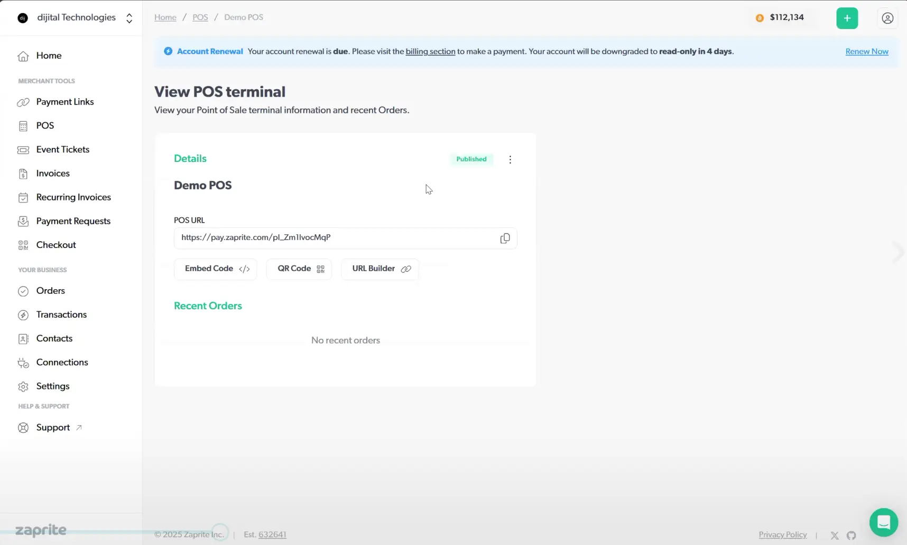

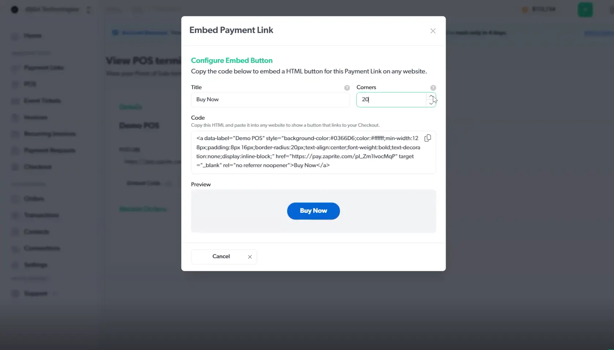

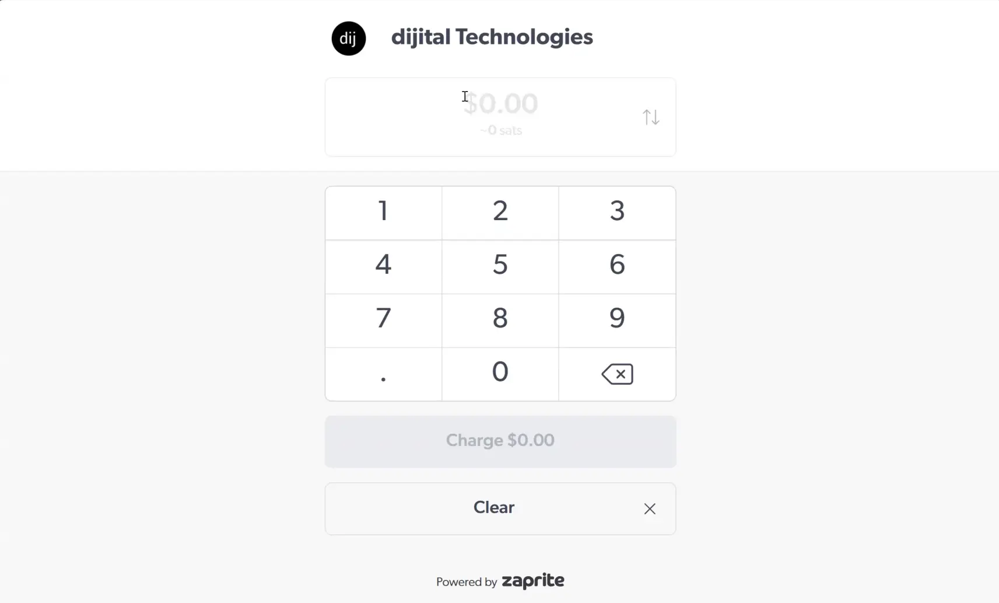

The checkout page displays price in fiat and satoshis, customer fields (optional), applied discounts, and payment QR code.

### Event Tickets

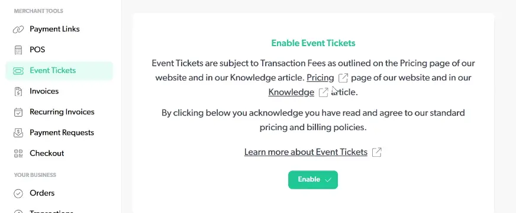

Event tickets are available as a feature subject to transaction fees (1% processing plus $3 per ticket, with a $15 cap per transaction; see pricing page and knowledge articles for details). Fees apply to on-chain, Liquid, Lightning, and Tether payments; fiat processing fees remain unchanged.

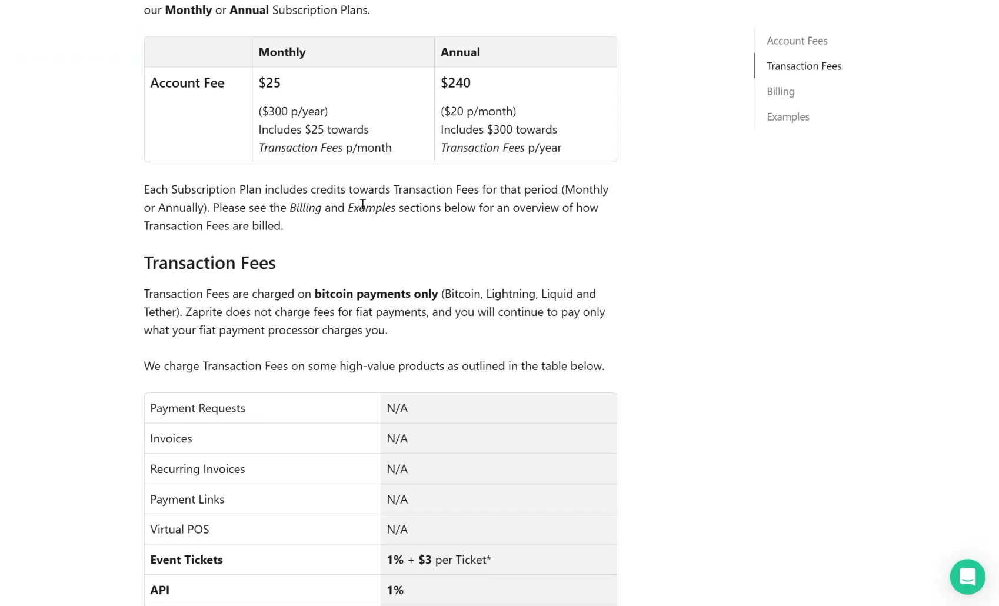

For more information:

[Zaprite Support: Event Tickets](https://help.zaprite.com/en/articles/11565182-how-to-create-event-tickets-in-zaprite#h_6070a198be)

[Zaprite Pricing](https://help.zaprite.com/en/articles/12125797-zaprite-pricing)

### Contacts

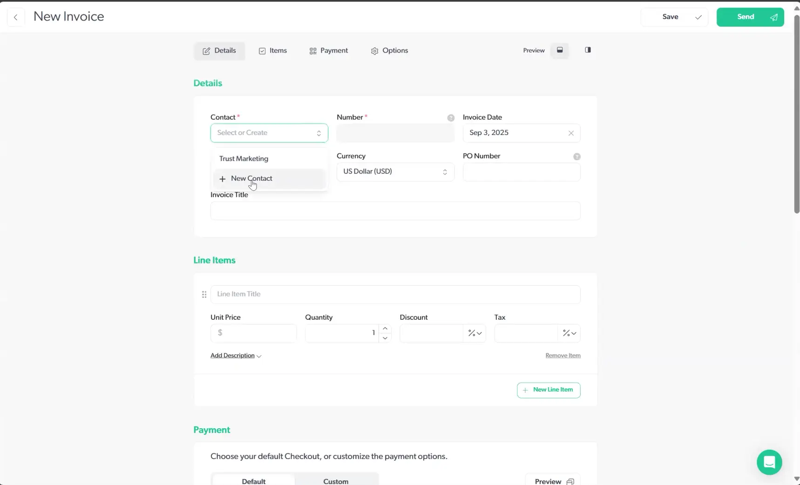

Contacts can be created or selected when generating invoices. Fields include display name, contact name, email, tax ID, and billing address.

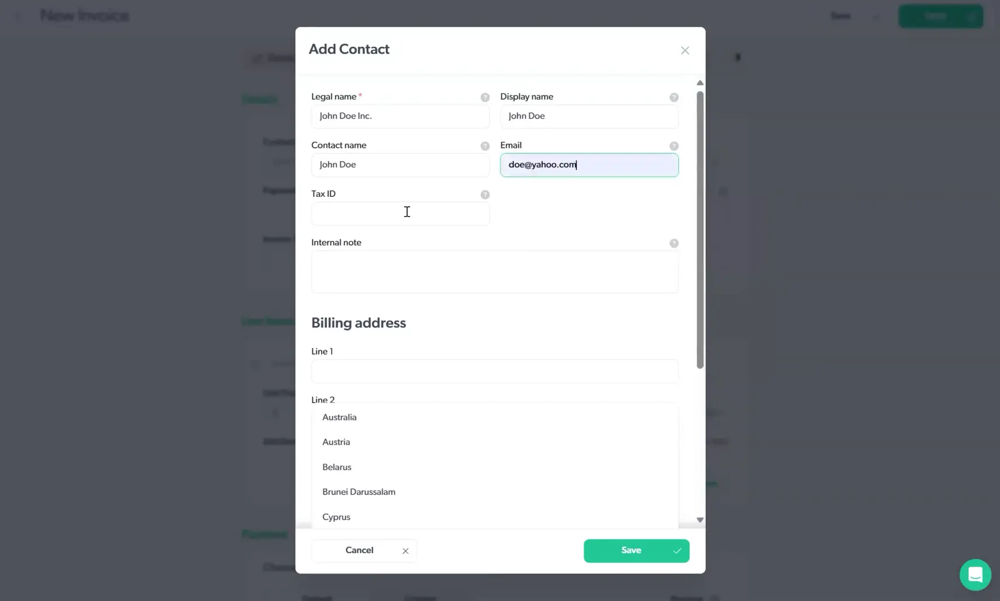

### Invoices

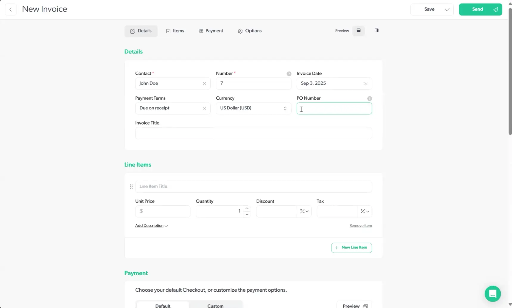

Invoices include auto-incrementing numbers, issue date, due date/terms, PO number, title, line items (description, quantity, rate, discount, tax), checkout options, and optional customer note.

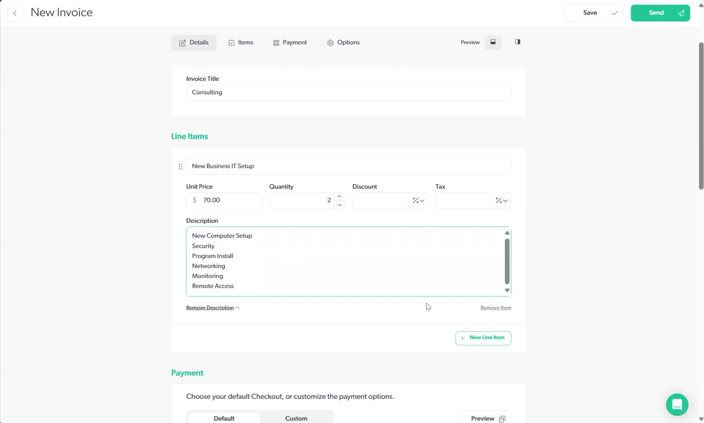

Just leave that one line item, keep our default checkout options,

Just as a reminder, that gives us Lightning Payment, Bitcoin payment, card payment, Cash App payment, bank, and ACH transfers.

You can also add a note at the bottom to help your customer relations: "Thanks for trusting us with your business, or thank you for being a loyal customer. etc."

Then you can choose to save or send this off to your customer, and then the email will be delivered to them, automatically. If you do choose to cancel, there is a, just an alert box to make sure that you're ready to do that.

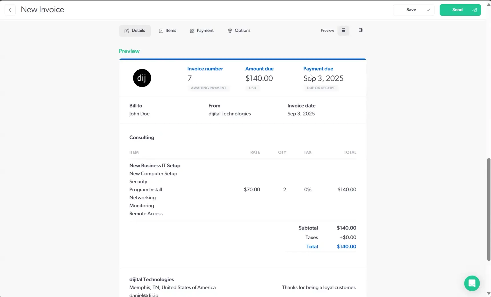

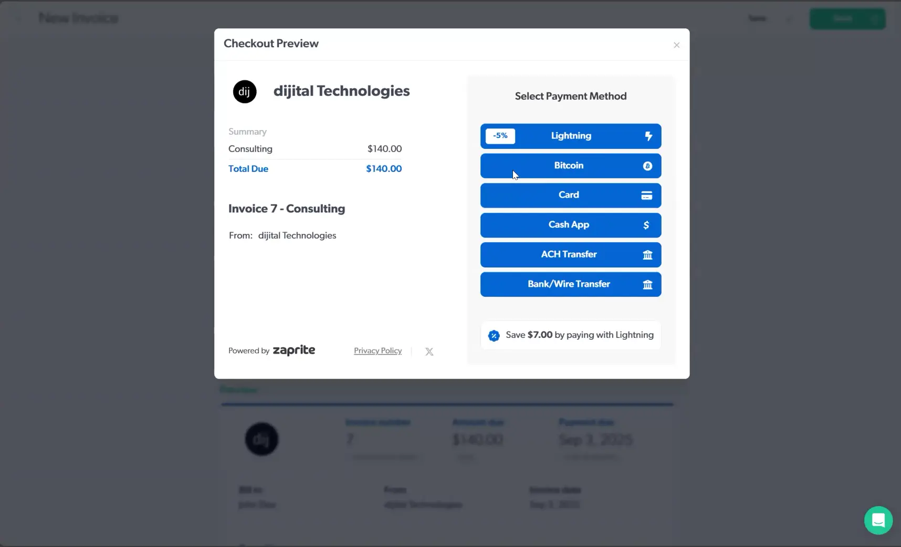

Invoices and recurring invoices automate billing for one-time or subscription services.

Recurring invoices specify service label, start date, send frequency, occurrence limit, contact, currency, line items, discounts/taxes, and note. Options include CC staff, PDF attachment, or link-only delivery.

### Payment Requests

Payment requests suit one-time or less structured charges (example: "Fix a flat tire"). They include contact, amount, and label, with the same checkout interface as invoices.

### Orders

The orders section lists all processed payments from payment links, POS, event tickets, invoices, and payment requests, including date, customer email, title, payment type, amount, and status.

### Connections

Connections configure available payment methods. 

Options include:

- Cash

- Bank/ACH/Wire Transfers

- Card Processors (Stripe, PayPal, Square, Authorize.net)

- Bitcoin (XPUB-based on-chain)

- Lightning (LND, Strike, Alby, Breez, Blink, etc.)

- Liquid (manual address), and others.

Supported providers and setup methods vary (API keys, logins, addresses, macaroons, etc.). Some connections support premiums/discounts or automatic conversions.

### Settings 

Now, let's take a look all the settings you can configure for your Organization and Individual Account.

##### General

Once you've created your account, the first area of focus is to enter your Business Details and set everything up.

The General tab is where you Zaprite account details will be: 

- Organization ID (fixed, auto-generated by the system)
- Preferred currency (local fiat, stablecoin, or BTC)
- Invoice footer note
- Privacy options for public display of name, email, address

##### Company

Legal name, email, phone, website, tax ID, address.

##### Profile

Brand logo, color, username (for future Lightning address), display name.

##### Billing

Subscription status, cycle, payment interval (monthly/yearly with discount), history, receipts, cancellation option.

##### Team

Invite and manage team members.

##### API

Request access to the API for custom integrations.

### Miscellaneous (Receipts, Transactions, etc.)

Receipts can be downloaded, resent, or viewed. Transactions provide detailed records (method, invoice/order ID). CSV export is available for accounting. Contacts list shows customer payment history and details.

## Wrap Up

This tutorial covers Zaprite from merchant and customer perspectives. Business owners can integrate multiple payment methods for online or in-person transactions. Customers can pay using preferred methods.

Zaprite simplifies setup and enables efficient acceptance of both fiat and Bitcoin/Lightning payments.
