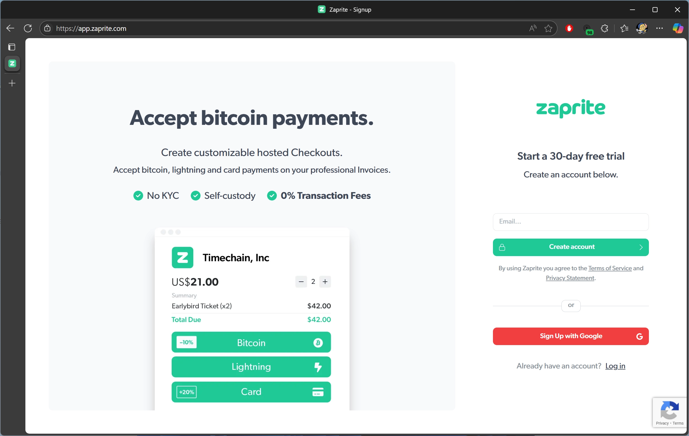
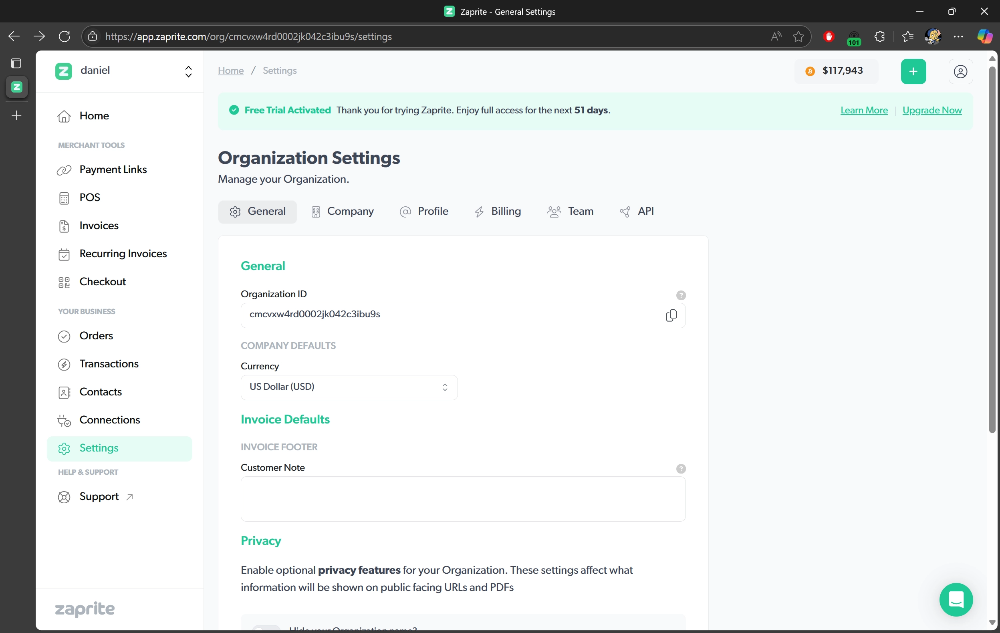

Zaprite is a premier invoicing and business payments solution. Easily accept payments via Bitcoin, Lightning and Liquid Networks, and any legacy fiat payment rails including Card Payments and Bank Transfers.

## Free Trial

To get started accepting payments, they have an extremely gracious trial period available to new users.

## Business Details

Once you've created your account, the first area of focus is to enter your Business Details and set everything up.

## Connections

For our first stop, let's configure our payment methods. Where is your money going and how can they pay you?

## Settings 

### General

See your Organization ID, also available in the url.

Set your default currency.

Company Footer

Privacy options in revealing Name, Email, and Address to customers.

### Company

Legal Name
Email
Phone
Website
Tax ID
Address

### Profile

Profile is where you can begin to add some brand-specific flair to your public and checkout pages.

brand logo and color

Your personal Username and Display Name for other users.

### Billing

Plan
Payment Options
Subscription Status/Renewal

### Team

Manage team members

### API

Request access to the API for custom integrations.

## Orders

## Transactions

## Contacts

## Merchant Options

### Checkout

#### Premiums/Discounts for Varying Money Types (Bitcoin vs Fiat)

### Invoices

### Recurring

#### Speed of Payment Processing

### Payment Links

### POS

## Support

## Cost

Robust platform for all businesses. Makes moving to a Bitcoin standard even simpler

## Customer Experience

If you want to mention a Plan ₿ Network tutorial, put the link in this way (remember the empty line, as if it were a paragraph):

https://planb.network/tutorials/computer-security/authentication/bitwarden-0532f569-fb00-4fad-acba-2fcb1bf05de9

You will also need to put a new line after, then you can go on writing your text..
