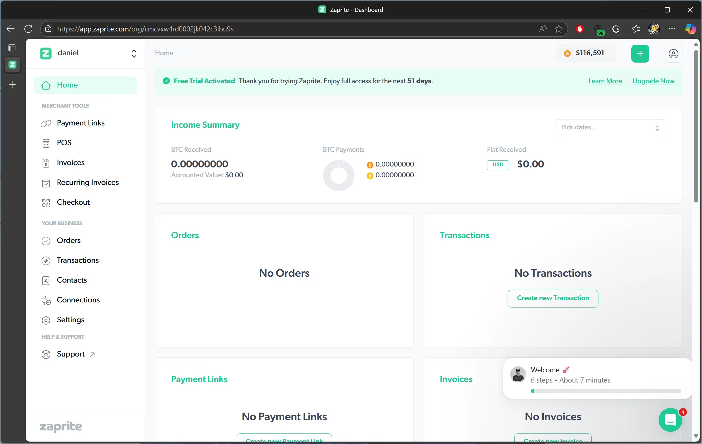
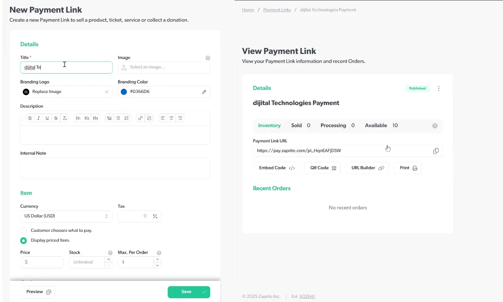
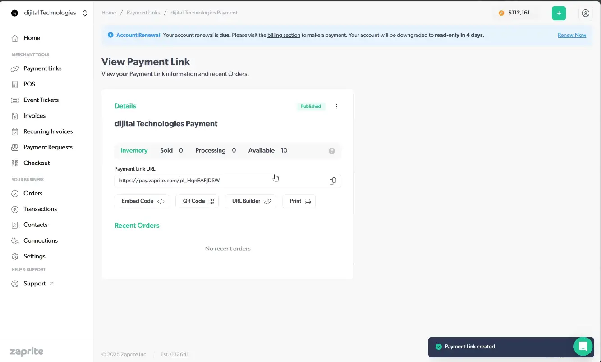
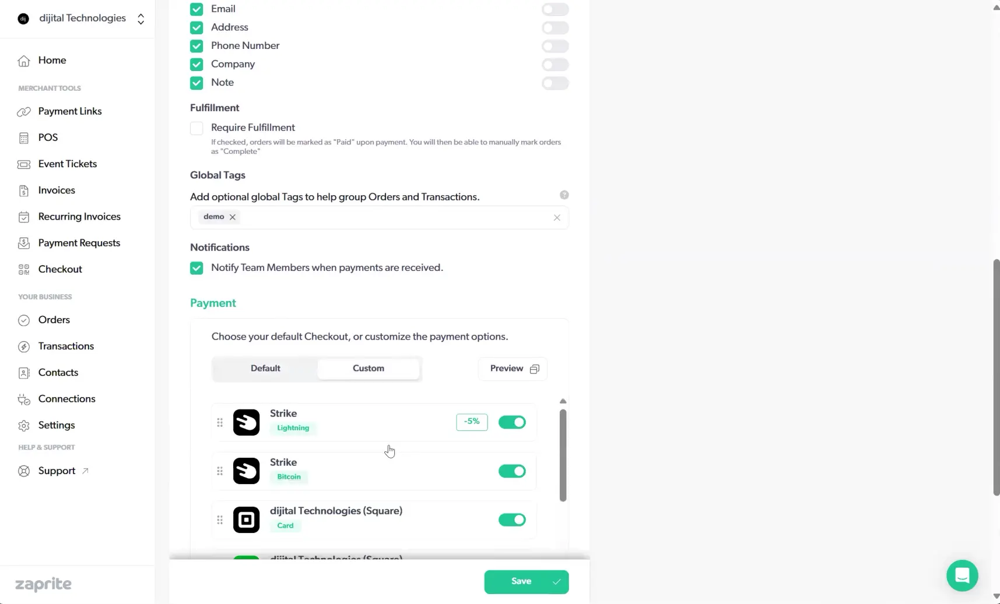
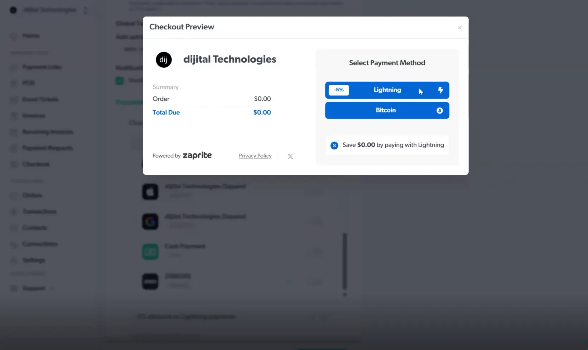
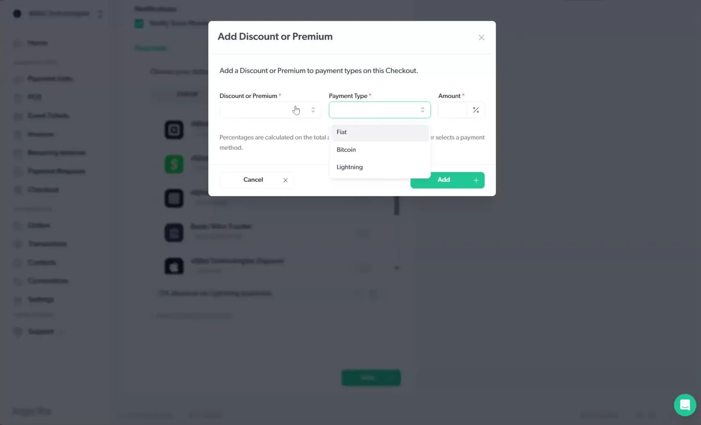

Zaprite is a premier invoicing and business payments solution. Easily accept payments via Bitcoin, Lightning and Liquid Networks, and any legacy fiat payment rails including Card Payments and Bank Transfers.

This tutorial will guide you through all of their many features and prepare you to confidently take payments via any medium and streamline your bottom line.

## Free Trial

To get started accepting payments, they have an extremely gracious trial period available to new users.

All you need is an email to get started. If you prefer, you can also enable Single-Sign-On (SSO) with an existing Google account.

## Home Page

Okay, here we have the ZapRite homepage.

Dashboard

Navigation Toolbar
On the left side, we have a useful toolbar, separated into two sections. Just to overview. 

Merchant Tools Overview
Over here on the left, we have our merchant tools, where we can make payment links. We have POS for our point-of-sale system.Event tickets, invoices, recurring invoices, payment requests, and a checkout section, where you can customize how your checkout experience will be for your customers.

Business Tools Overview
Underneath that, we also have your business section. Here you can configure what your orders can be made up of, transactions, contacts, connections, and settings. And then after that, we have support that will link you to all sorts of quick tips and tricks for how to use the section.

Header
Back up at the top, we do have a useful ticker showing the current US dollar denominated price of Bitcoin, or whatever currency you select for your business.
Next to that, we do have a quick button as well that allows us to quickly get to payment links, POS, events, invoice, recurring invoice, payment request, contacts, and transactions. And next to that, we also have our account, where we can edit our account or sign out.

Income Summary

Beneath that, on this dashboard, we do have an income summary. This will show your Bitcoin received.
As well as the current, the accounted value in your currency of choice.
Your Bitcoin payments will be listed, by whether they come in as Bitcoin on-chain payments or Lightning payments, as well as if you are receiving any fiat payments that will be received in your, currency of choice, and locate it there. You do also have a filter, for a certain date range, if you want to look that up. So you can go backdate that and show that for a certain period as well.

## Business Details

### Payment Links

Going further down, we have our payment links. You can create a payment link there. That's just something simple you can shoot out to someone.
Each payment link is composed of a title, a image, your brand logo, and your brand color. 

You can give a description, for example, let's just say "dijital Technologies payment"
I'll just say Pay to dijital Technologies.
Demo… or ZapRite demo link.
And beneath that, you can also configure your item.
or, you know, your actual item that you're selling, you can choose your currency, it defaults to your payment, you can choose Bitcoin,
You can add taxes to that as well. The customer can choose what to pay, or you can display whatever the set price is.
You can also take stock, how much is available.
So let's say we have 10, like, in max order 1.
You can choose what the customer has to enter, so you can get as much information as you would like.

Let's just say a email is required.
And let's say if you have a, item that you need to, ship off, you would check required fulfillment. This would load in, back to the system where you can mark that,
So the system will say, if checked, orders will be marked as paid upon payment. You will then be able to mark orders as complete. So once you, actually ship off whatever they need to get.
You can also add tags to your orders. So let's just add a demo tag, as well as a…
Products… And you can then also notify team members when payments are received, we'll keep that checked.
And then we can go with our default payment option, but just to take a look, you can configure a custom payment solution based on whatever,
Based on whatever connections you have, set up.
But I'll go with my default payment that I've already configured, and that does show this checkout preview. So it'll give the price here, since we selected BTC, that's what the, order shows up on the left, and then on the right, they do have all the available payment options.
Then at the bottom, when the order is complete, you then can direct them to a specific page. This is useful, especially if you have things that shouldn't be visible unless the customer has paid for them. This is a great way to add that functionality here.
He just… to add the example, and I'll say ditch.io, my website.
And I'll save… And the payment link has been created.
Now, it gives you a pay.zaprite.com.
link, you can copy that. You do also get, as well with that, you get a option to show a embed code.
That you can copy and paste into a website. They can pay that way.
You can get a QR code generated, you can save the PNG or the SVG versions.
And deliver the, your payment that way.
And then you can also print out your QR code.
So that is a neat little feature.
So the print will take your QR code and set that to be printed. That is another great feature. You do also have the ability to go back and edit. You can view your link, see your orders. Let's click View.
So with Vue, you get the payment, also we get the name of our item, the price in Bitcoin, 5,000 sets.
And then just our description at the bottom, and then we have our name and email as we selected.
So once you put in your information, you then can make your payment.
That will generate an invoice, generates a QR code with your business logo, and the amount in SATs, to fulfill the invoice. You can then scan and pay, this payment.
We can go back… Pretty much cancel the order.
If we go to the orders page…
Nothing does show up there, but if any payments are made, they will show up there for the orders.
And then we also have the option to unpublish or delete this as well. And if we take a note, just make a new tab…
Paste in that link, it shows that same view that we were just looking at.
And that is the payment link. If we go back… To our homepage…
Let's go down to the payment links page. You can see our link that we created is here as well. The income summary is also available at the top of this page.

### POS

Going down to the POS, point of sale system, our income summary does continue over. If you do notice from the dashboard, we had the total for all payments. For the payment links, that number gets updated for how many payments have come through this payment method.
Going down to point of sale, same thing there. You can create a new point of sale system here.
And so there, there we can see we have our title, so I'll say Demo Point of Sale.
Point of sale system… for ZapRite tutorial.
Here you also have your currency option, so whether you want to use, a fiat currency or you can just denote the payment in Bitcoin, you are free to do that. You can add your tax percentage, and then a note for you and your team as well.
Down here for the customer fields, again, we have our options, name, email, address, phone number, company, and note. All of these are optional. You do not have to require your customer, any of these. So you could check these for them to show up.
But then, depending on how much KYC you want or require, you can then just break that down to be whatever is required to make the payment.
So nothing can technically be required, but you can still have the fields available.
require fulfillment, just like with the payment link. It is an optional choice in case you have to do some further processing of the order before they're technically complete.
This is great for that, but for this instance, we'll just leave that off, since, at a point-of-sale sale, usually you're going to be interacting with the customer, usually get the product right then and there.
Here with the global tags, you can see we created demo and product. I'm gonna just put demo, and since we're not technically requiring fulfillment, we're gonna leave product off.
We're gonna keep our team notified when payments come through, and here we're gonna simplify this. We're just going to say this is a Lightning point-of-sale system. So no fiat, so they won't pay me through Square, Cash App, no bank transfers.
But I will allow them to…
You can only select one lightning payment method, that's fine.
So since I do have Strike, Lightning enabled, for Lightning and Bitcoin, I'm not able to use any other Lightning providers, so it's just one option for checkout.
let's preview that, just so we can see what that looks like. they get the business logo, business name, as well as a order, and the total, and the two options, so Lightning or Bitcoin. What the customer will see is just a QR code for them to process their payment, but as we saw before, that will go through my strike, so via either on-chain or through my Lightning address.
Here also, we do have the option for premiums and discounts. I do have a 5% premium discount set up for my Lightning or Bitcoin payments.
So, they're kind of grouped by the type of payment. So, you can set a discount or a upcharge.
So if you want to charge more for Fiat payments, feel free to do that.
And then you can add that to your checkout experience. And I'm gonna save this.
So now my POS has been created.
And here, with my POS terminal, I get a link to that URL, as well as, once again, an embed code.
That can be pasted into another web page, that I manage.
The title does say Pay Now, we can change that.
To buy now.
It says for com…
Oh, so the radius of the corner. By default, it is at 8.
The higher that number goes, the more ovoid… more oval-shaped the button becomes. So you see, going from 8 to 30, it's pretty round.
You can also, once again, get the QR code. You can then save that as a PNG picture or a SVG.
Then once again, you have your URL builder.
So if we take our POS link, paste that in a new tab.
We get to see that this basically gives us a checkout experience.
So there is a price at the top with dollars and sats. We can reverse that order.
If I, let's say, pay $25, $22,291 sats currently, Charge that to the customer.
We can take in their name, email, since it is a, you know, a point of sale, I could technically just use this webpage to manage, you know, my checkout process.
So they're saving $1.25 by using Lightning via my payment method discount.
And then it generates a lightning QR code, so I can then scan and make that payment.
And that is the point-of-sale system. 

### Event Tickets

Going down the line of merchant tools, we can also create event tickets. So you can enable event tickets as a new feature of ZapRite. These are subject to transaction fees, as outlined in the pricing page of our website and our knowledge article, so you can read further there.the pricing page of our website and our knowledge article. By clicking it below, you have, have read and agreed to our standard pricing and billing policies.
So, if we just double-check on the pricing… Let's see… So once we have, Whenever you enable your account, They do take a 1% processing for event tickets, plus $3 per ticket, so just keep that in mind as you make tickets.
But, for invoices, payment requests, payment links, there are no fees for that, no fees for the point of sale. But for event tickets, the APAI usage and WooCommerce plugin, there is a 1% fee.
And the 1% fees apply to any on-chain Liquid, Lightning, or Tether payments, likely just to cover their infrastructure, since Lightning servers and, I believe Liquid nodes would have a fee.
There is a fee cap of $15 per transaction, just FYI.
There's no additional charge on top of, existing fiat processing.

[Zaprite Support: Event Tickets](https://help.zaprite.com/en/articles/11565182-how-to-create-event-tickets-in-zaprite#h_6070a198be)
[Zaprite Pricing](https://help.zaprite.com/en/articles/12125797-zaprite-pricing)

ZapRite Processing, this gives us a quicker breakdown.
So the account fee is just $25 a month per regular, or $250 annually.
$240 annually.
And then they have a table breakdown for the, percentages that they do charge.
Fees would be capped at $15.
I'm gonna go down to invoices.
Here, once again, we have our income summary at the top. It'll separate your BTC from fiat payments. It'll show how many payments you have received, accordingly. And this will just list out any and all invoices that you have created.
So I have created 6 so far, for my software development business, or for my IT consulting business.

### Contacts

From there, let's see what the new invoice creation process looks like. You can create or select a customer.
So if you create a contact, let's just say, john Doe, Inc.
Display name, John Doe, contact name, John Doe… Email…
Doe at yahoo.com. Thank you, autofill.
Tax ID, if you have that information. Then a billing address, if you have that as well.
For country, we're just gonna say U.S.
And John Doe has been created.
He would be getting invoice number 7, this just auto-increments up, and the date can be now or at some point in the future.
And you can set this to be due in 30 days, due on receipt in 10 days, however your business goes. I usually send out due on receipt.
A PO number, that would be a purchase order number that you can, send as well, and then a title for the invoice.
 Could you say… consulting?
And then we can add a line item.
So let's say, new business IT setup. So, you know, get their computers online, set up any…
Any security, any, monitoring that they might need. Let's just say a flat price, $70 an hour, 2-hour setup, no discount, no additional tax on that. And then just to reiterate the description.

New computer setup, security… Program, security program install… Networking, monitoring… Remote access…
Just leave that one line item, keep our default checkout options,
Just as a reminder, that gives us Lightning Payment, Bitcoin payment, card payment, Cash App payment, bank, and ACH transfers.
Thanks for trusting us with your business, or thank you for being a loyal customer.
Then you can choose to save or send this off to your customer, and then the email will be delivered to them, automatically. If you do choose to cancel, there is a, just an alert box to make sure that you're ready to do that.

### Invoices

And that will take you back out to your invoice dashboard. In addition to that, we have recurring invoices.
So my previous invoices have been coming from this invoice series, so this is a powerful tool to automate that process. So in case, you know, you're not doing, like, a one-off event, have a recurring work that you might be doing for a customer.
You have that same process here that you can do. You give your, label your service, Let's just say… Monthly maintenance… Start date is now, send frequency, let's just say monthly, occurrence is unlimited.
You can go back to your contacts, we'll use John Doe once again.
The number will automatically generate. It'll generate on a specific day, every 30 days.Doe, maintenance, invoice.
Our currency is U.S. dollars in the America… United States of America.
Then for our line items, Let's just say server… Log, audit…
Hourly rate, 1 hour, no discount, no additional tax.
Review… output of… program activity…
Again, keep it the same payment options.
Thank you for your business.
Little smiley face.
Depending on, you know, what's your corporate culture? Do you send emojis?
You can add a demo, and then our recipients here is copied up from our customer at the top, where we selected John Doe.
And then another optional message, you can then choose to copy yourself on this or not, and you can include a PDF attachment, as well as the actual URL that will generate with this view.
This would create a new invoice that goes off to the customer. Pretty same view from last time, we just have a space here for whatever the actual invoice number will be.
And so this would start on October 3rd, and so if we start that schedule now, that would save and populate back in my dashboard here alongside my current invoice.
And that is Recurring invoices, a simple, powerful tool to automate parts of your business.

### Payment Requests

The next thing here, we have a payment request. So this is, sort of like the opposite of a payment link, whereas with a payment link, you'll send that out.
For anything that might be, you know, purchased, a payment request is usually gonna be something that, you know, you've done the work, and then you're sending out a payment request. A little bit different from an invoice, not as structured.
So let's say, you did a tire service.
Let's just say, fix a flat.
Go that to John Doe. He's been a needy guy, need to fix his computers, fix his car.
Get the amount, fix this car…
And then that would go off to, John Doe's email.
So if we do a preview, it basically, you know, gives the same checkout. You get a summary of what the charge is for, as well as the options to pay that. So this is just a, you know, similar to the, invoice, just not as formal, and…
a little bit more than just a payment link, to where a payment link will be like a standard for any particular product, that you might create. Each payment request, you know, is just a quick one-off thing.

### Orders

Orders

And then further beneath that, we have a order section. This will list all your invoices or orders that have been processed; as well as your transactions next to that.So any previous transactions will be listed with: the relative timeframe, the title of that payment was, as well as the currency breakdown to the right.

And going back up the business totem pole, let's go to the orders.

So anytime you make an order via a payment link, your point of sale system, you sold a ticket, or made a payment request, all those orders show up here, and they will include the date and time, as well as the customer's email, the title of the payment, and the type of payment that it was, as well as the amount for that payment and the status of that payment.

### Connections

Then down here at the checkout, this is where we can configure, like, what our default is. So we've been looking at that, this is plugged into all these other, merchant tools, but there's a dedicated page as well where you can configure, each of those things. So by default, I have all these enabled to show up.

I could add Apple Pay if I want. I don't prefer to use that.

Google Pay as well. Same for cash or ZBD, but as we saw earlier, you can only have one Lightning service enabled at a time, so if I take off Strike Lightning, I can then add ZBD Lightning.

So I would then be getting, a different Lightning payment to my other Lightning address.

So let's just reverse that.

As you do notice, as these things change, it does automatically save it. And the last thing we can look at, we have seen the premiums and discounts, the connections. How do you configure all of these pages? So that takes us down to this business section here.

So we're gonna skip down, look at what our connections look like.

So your connections will show all the options supported by ZapRite. So these are always changing, always updating to the latest and greatest.

So let's just start at the top, starting with Bitcoin. This is a simple way to send on-chain payments. So all you need is to get your XPUB, your extended public key. So whenever you create a wallet, and you, you know.

whenever you're creating a wallet, you're gonna be… you're gonna create an XPUB as well. The… this is just a extended public key that you can share out, that can be used to send money to your,

your actual wallet that you just created. So, in this case, if you are using some sort of provider, let's say Blockstream Green, Bitcoin Core, Blockstream Jade, Blockstream provides a couple of different hardware and wallet solutions.

So Drade is their hardware wallet, green is, I wanna say, their software product?

Let's take a quick tangent. Block, stream, green.

So, it takes us to Blockstream app.

So they've changed that name.

That's the great thing about, business, anywhere and everywhere.

your partners, your products, they might change their name on you. So Blockstream app, if you use their app, they will, they've changed their app from green to app.

So that's all the differences there.

If we go back, we can see,

Blue Wallet is another great one. Cold Card, a hardware wallet solution. Core Lightning Wallet, so a wallet, if you are using the Core Lightning,

the default version of Lightning, Core, so similar to Bitcoin Core is like a reference implementation, that has descended from the initial release of Bitcoin from Satoshi Nakamoto.

Core Lightning is also coming from the Lightning developer team. Ledger is another wallet product. Sparrow, Wallet Inspector Desktop, Trezor, Wasabi, other,

Other, if you just have, you know, a generic app solution, or something you might have used. I'll use Blue Wallets, give a label.

say, mobile wallet, and then your XPUB, you can copy and paste that in.

And then you can choose what address type you have, whether it's native SegWit, Taproot, or Nested SegWit. These are 3 different types of wallets. Each of them has, slightly different features.

And security levels, but usually, whatever your wallet solution, it should tell you, you know, whichever…

Type of address it is that you have that you're gonna be sharing.

For the purposes of continuing the demo, just say we can put in a XPUB there.

This here will just confirm, make sure that you, Put in what you've entered.

Just for a quick and simple purpose, let me open my blue wallet on my phone.

It's loading… Scroll down to my wallet… And go to my options… And show my X pub.

So your XPUB's gonna be a long bit of characters, gonna be a little bit easier.

Mmm… Poop.

Just gonna type…

So, that is all the characters. Hopefully you pasted yours in so you don't get a…

potential vulnerability, even though it's a public key, so it doesn't quite matter. So you just paste in your XPUB, and then to confirm, it'll show the first six.

Not the first 6. It's, confirming the address, Snap.

Wow, so let's, redo this real quick.

Let's pause our recording, and we'll resume.

Alright, so when you put in your, public key, it's gonna confirm an address for you, so you should be able to go to…

Yeah, you should be able to go into your wallet, check your addresses.

And if I… let's see, so we got BC1QXQ.

And that is what my first address is. And if you type in your last 6… Hmm…

1, 2, 3, 4, 5, 6…

So that should just confirm that you are… you've entered your right public key, you're able to

And the system is able to properly derive the addresses connected to your wallet. All of this is still fine and secure. All of this is technically public information, so you share your public key, and anyone can figure out what addresses are gonna be tied to that key. That's still all public, not private information.

So, there's a note here, they do recommend creating a specific wallet for this, which is a great recommendation. Reuse of public keys, like I said, since you can derive addresses from that. Any reuse of keys and wallet addresses, it just adds to a vulnerability, something that people can track you down with.

And then they do recommend Wasabi Wallets, that is one of the open source wallets, that would be, great to use, but a lot of these are open source as well. I'm pretty sure they all are.

But I can't double-check on that.

So let's just say blue wallet, since that's what I am using. I'm gonna say mobile wallet.

And then hit OK.

And now my wallet is created. I do have all of these addresses, derived and ready to be used. So now, if we configure checkout.

I'll… I have my Stripe, big… Strike Bitcoin configuration, but I can also just say… At this,

So, since we don't want to come…

confuse our users with multiple options. We also need to make sure that we…

use one Bitcoin option. Meanwhile, all the fiat, you know, proliferates, but…

That is how life is sometimes.

And so, if they, this is a preview, so they get the Bitcoin option down there. Choosing that would give them a QR code that they can send Bitcoin on-chain to.

I'm just gonna take it back…

And that is how you work with the connections for the Bitcoin option.

This is a quick and simple way to do that.

Hmm… If we go on to our next option, LND, this is using your own Lightning Node daemon.

I'm personally not running a Lightning Node implementation, but you can give a label to your Lightning Node,

Just gonna say my LND for giggles. Usually that should be hosted in online. This would be your endpoint, that would be, you know, secure by default, so people can't directly, you know, spam your Lightning, node.

Your invoice macaroon, this must be the hexadecimal format. This will also be something private, so you can paste that in there.

do not enter your admin macaroon, so make sure you're putting in your right invoice macaroon, not the admin macaroon. And then you can create a test voice invoice based on that. So it'll use this endpoint and macaroon to, query your Lightning node.

And create a test invoice. If you properly set that up, it will validate your input and create that invoice. Once you are done with that, just hit OK.

Then for Liquid Network…

So, Liquid Network is another Blockstream product. There is no configuration required. Liquid payments are currently supported by manually adding a receiving address to individual invoices. We'll be adding XPUB information shortly to automate this process.

So whenever you make an invoice and you want to, you know, paste in a receiving address that can be done… that they can be processed over Lightning Network.

So once you just hit OK, let's go to Configure Checkout. If we scroll down… Do-do-do-do…

So, it doesn't add a new feature here, so similar to the other ones.

So it'd really just be a…

Including an address in your invoices, like they mentioned. For Strike, it's a great platform, to use if you are in the States. You would just use… you would sign in via your Strike account, and that would give you access to,

use that… use this provider. Do note on-chain payments are disabled for amounts below 10,000 SATs. So as long as you're sending more than roughly 10 US dollars worth of a payment, you can use Bitcoin, via Strike.

Or you can just default to using Bitcoin, to a wallet directly.

You have options. And then Unchained, another great option here.

Here you can connect your unchained vault.

So you can send in…

your JSON file for your wallet configuration, you can label that wallet.

You can also, just like we did with the XPUB for our default wallet, just confirm the same for your unchained vault.

Hmm.

Give them access and say OK, and they would add that to your account.

Btc Pay. So if you configured BTC Pay Server, whether you host it yourself, use some third-party provider like Voltage.cloud, here you can just put a label, then only to your store.

And that will pop this up as one of your payment options whenever you enable that as well. So, just like we've seen our previews, they would click, BTC Pay, that would open up a new tab, and they would go through your checkout process there.

Open node.

I'm not as familiar with this platform, but you provide an API key from there, and agree, and then you can enable this, service as well.

Square, another product from Jack Dorsey.

This is where you can log in via Square and allow all those payment methods there. Most of those are fiat.

These are all Fiat, actually.

You can then require to KOIC your customers or not.

As much as you need or want.

Stripe, another great fiat option. You would just agree to the terms, and then you would log in and authenticate your Stripe account with, your ZapRite account.

Another big hitter in the fiat space, PayPal, a similar process. You agree to the terms, and then, clicking connect would, do a single sign-on authentication to integrate both platforms.

Authorize.net. If you are a developer, you might be familiar with this, as the… they provide API keys for Visa transactions.

You can label that, provide your API key, your login ID, and a transaction key, and that will connect these accounts and allow, ZapRite to trigger a API call to Authorize.net and trigger a visa payment that way.

MerchantsX is not a platform I'm directly familiar with, but you can add your public and private keys below. Confirm your acknowledgement, then click Connect to finalize the connection. So you can then, once again, label that, give a security key.

And then a public security key, so this will validate your… the connection between those two services.

Castle, this is a new one that I'm not familiar with.

convert a percentage of your fiat transactions to Bitcoin, so this is a service, provided by, you know.

On a lot of other platforms,

Strike is one of them. But Castle would be a great integration as well, so you can take fiat and convert that into, Bitcoin.

So if you're interested, check that out.

Let's see…

And so, from there, Castle actually has the integration, so as long as you have an account, once you go into Castle, you'll be able to configure those services, which will link back to ZapRite.

So once you sign up, create your account, you'll be able to, configure the option here.

WooCommerce, this is a store platform. You would link to your store, provide the name for your store, and then you can preview, what that would look like once it's added to your checkout options.

Albie, a great, Lightning provider. So you just put in your Lightning name, so if I had an account, I'd probably have that name on it.

And then just OK, have your Lightning address.

Breeze, another great developer friend here. They also provide Lightning addresses, so whatever your Lightning address is, just plug that in, and that will be added to your checkout options.

Blink.

Blink also is a Lightning address provider, Lightning Wallet, so if you use their app and have their address… have an address with them, you can plug that in, username at blink.sv.

speed…

Speed is another wallet with Lightning Service Provider, with atSpeed.app. If you have that and agree, you can add that to your checkout.

Coin OS.

It's another Lightning provider, coinos.io, for their address endpoints. Add your username, agree to the terms, and add that, directly to your checkout.

Once again, do note all these processes; it's just automated connections provided to you, for no cost.

We're getting rid of the middleman; we're sapphire, we're not standing in the way to be that middleman. We're just making it easy for you to connect your customers to you.

So here with Coin Corner, their connection methods is via API key, a secret, and your user ID, and that will connect and enable ZapRite to send charges off to the Coin Corner service for your payments.

Next, we have IBEX Pay. You can sign up or go as an existing user. Since I am a new user, there's a quick form here, so ZapRite will create this for you, on the fly.

So you just put in your name, your business name, your organization, your country.

There is no United States option.

So this is a non-American option, so if you are anywhere else, you can create an IBEX account and use that for your payments.

You will get an email to confirm that you created and registered.

And then your currency of choice, while you can't be from the US of A, you can use USD.

One of the many benefits of being a global, centralized power.

Next up, we have Zebedee that I've already configured, for myself. This does use an authentication method where you sign in with your ZBD account, and then it will connect to your account, your ZapRite account.

Ln bits, another option, you can connect to your Lightning server hosted here. You will provide your URL, you can use HTTP, or HTTPS, so for a Tor or ClearNet option.

Your invoice read API, so your API key.

And make sure, again, don't use your admin key, use your invoice key to properly authenticate your connections here. And then you hit OK, or you can create your test first. It'll verify the information you create, create you a test invoice preview, and then you can add that to your checkout lineup.

Alright, after LN Bits, that is the last of our Bitcoin and Lightning options.

For ACH network, you would put in the name of a bank account, the type, whether checking or savings, the account number, and routing number. And then you can receive ACH payments via this method.

Sepa seems to be a Euro account system, so you can put your name on the account, your IBAN number, your SWIFT number, and then your country.

So all these European options are here.

If I go back, we have e-transfer.

Where you put in your Interac email address, you can auto-deposit or have a security question and answer to validate your Interac e-transfer.

We have bank and wire transfers. Here, you can just enter your bank information, similar to a previous option we looked at, and that will be added to your checkout lineup.

And lastly, you can always accept good old cash.

So it'll just be an in-person method that you can always choose to record your transactions with.

And then, if we note, we have a direct Cash App integration coming soon, Swan also coming soon, Voltage.cloud coming soon, they do have some great products as well coming out, and Intuit QuickBooks also coming soon, and Xero.

So, whether you have all these solutions already, you can see that ZapRite is a great solution to automate and integrate all of these options for your storefronts.

Even if you use a good Bitcoin payment provider, like BTC Pay Server, that gives you your own Bitcoin options. But if you want to quickly enable all your payment options so you can get your fiat friends and customers to easily pay with no friction, or whether you want everyone else in the world to be able to pay you via Bitcoin or Lightning, you can do that all here with ZapRite.

For our first stop, let's configure our payment methods. This is where you configure the ways that people can pay you.

Payment options fall into these general categories:

1) Cash
    
    Manually record order details where your customer paid in cash.

1) Bank Wire and ACH Transfers
    
    Enter your bank info or your account info for a payment processor such as Square.

1) Card Payments
    
    Enter details or authenticate Zaprite to use your payment processor (Stripe, Paypal, Square, etc.)

1) Bitcoin
    
    Bitcoin payments come in the most variety. Whether you have a provider like BTCPayServer already setup, want to receive to an onchain address, or use Lightning or Liquid, you have plenty of options.
    Some of these connections are as simple as including a lightning address! Many others will give you an option to Login and give access to Zaprite to your account. Others still may just require a few details: account numbers, xpub, etc.

- Payment 

- Onchain

- Lightning

    - APIs

    - Lightning Address

- Liquid

### Settings 

Now, let's take a look all the settings you can configure for your Organization and Individual Account.

##### General

Once you've created your account, the first area of focus is to enter your Business Details and set everything up.

The General tab is where you Zaprite account details will be: 

###### Organization ID

This is how your organization is identified and accessed. This ID is generated when you create your organization and is unable to be modified. If you look at your address bar, after you login, each page is access from a url with the following structure: https://App.Zaprite.com/org/ORGANIZATIONID/PAGENAME

###### Currency

Select your preferred National Currency to be used within the application. You can select from a comprehensive list that also includes Tether (USDT).

###### Invoice Footer 

For a standard note that will be included on every invoice footer, fill in this field.

###### Privacy Options

Here you can select whethere or not your Organization's Name, Email, or Address are displayed on your any public urls and documents such as an Order Page or Invoice PDF.

##### Company

The information entered here will be used on invoices and external communication.

That information includes:

- Legal Name
- Email
- Phone
- Website
- Tax ID
- Address

##### Profile

Profile is where you can begin to add some brand-specific flair to your public facing features such as Checkouts, Invoices, Payment Links and lightning addresses.

There is a preview section available to verify that your selections are meeting expectations.

- Brand Logo
- Color
- Username
  - Lightning address will be coming soon, but you can reserve your permenant Lightning address with Zaprite now.
- Display Name
  - Use this optional field if you have a DBA or a name other than your legal business name.

##### Billing

Keep track of your Zaprite subscription with the Your Plan section where you can see how long your current cycle will last and the due date for your next payment.

Set your payment interval to either be monthly or yearly, for a 20% discount.

View your Payment History at a glance and download receipts if need be.

If business isn't going well, you can always choose to Cancel Subscription.

##### Team

As admin, you'll be able to manage team access. You can invite additional team members to login to Zaprite and manage your organization.

##### API

Request access to the API for custom integrations.

### Miscellaneous (Receipts, Transactions, etc.)

And then for each of these payment options, you can download your receipt, you can resend the receipt to your customer yourself, or you can view the invoice in the actual application.

This is a great backup tool for accounting purposes.

You also can download a CSV containing all this information all in one. Great for opening up in Excel or Google Sheets.

Or your text editor of choice.

Similar to orders, you have your actual transactions. The difference here is that for each transaction, you get more detailed information: the method they paid with, invoice number, order ID.

It's more of a high-level view.

Come down to contacts, you can see any of your customers here, the payment rate that they're on, monthly, the USD, or the currency that they get charged with, then their name and email for their primary contact.

Then we have our settings page, that we've been through already.

And that is ZapRite.

Thank you for coming to my demo, and I'll be chopping this up and editing it shortly.

Hope it's good.

## Merchant Options

### Checkout

#### Premiums/Discounts for Varying Money Types (Bitcoin vs Fiat)

### Invoices

### Recurring

#### Speed of Payment Processing

### Payment Links

### POS

## Support

## Cost

Robust platform for all businesses. Makes moving to a Bitcoin standard even simpler

## Customer Experience

If you want to mention a Plan ₿ Network tutorial, put the link in this way (remember the empty line, as if it were a paragraph):

https://planb.network/tutorials/computer-security/authentication/bitwarden-0532f569-fb00-4fad-acba-2fcb1bf05de9

You will also need to put a new line after, then you can go on writing your text..
