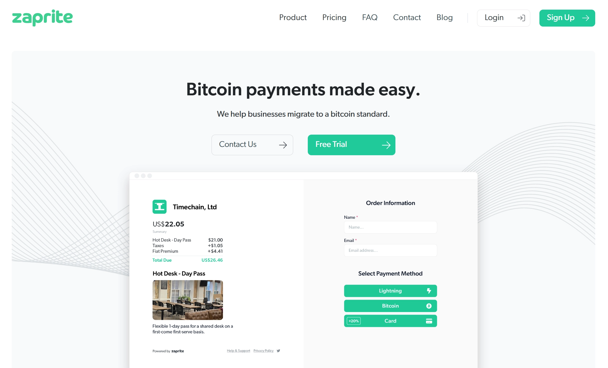
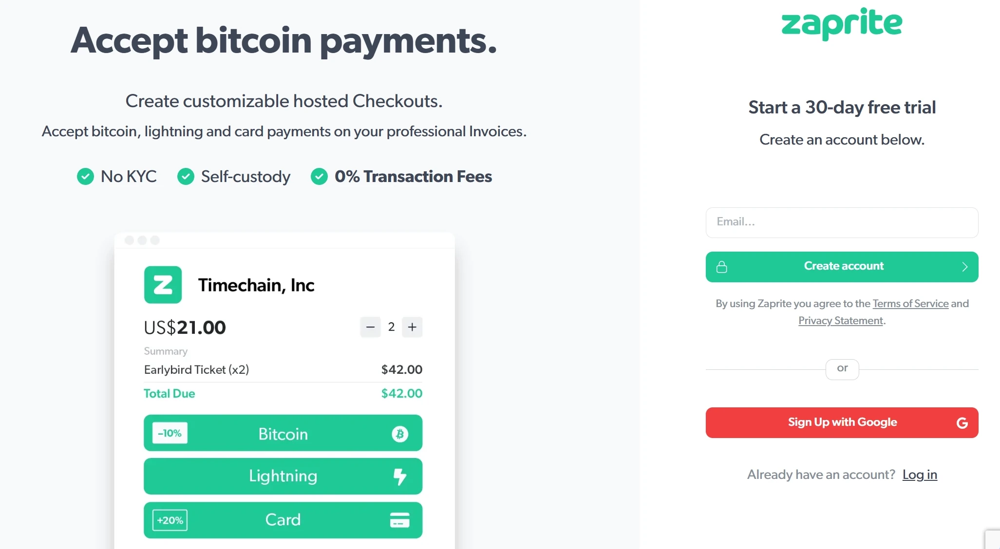
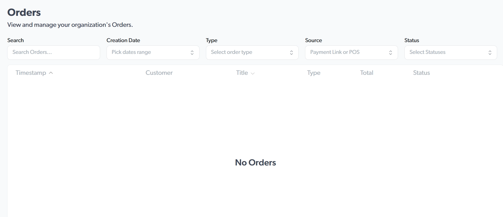
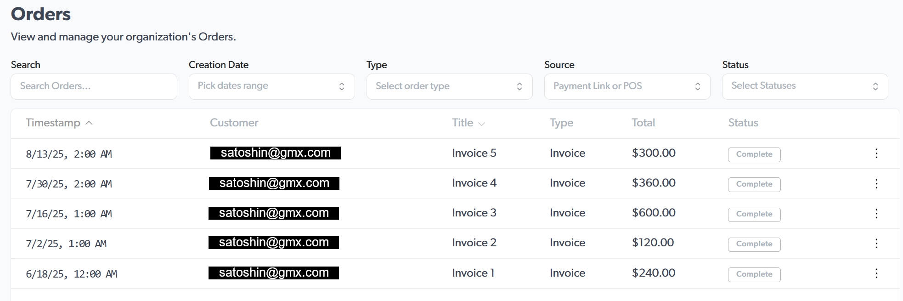
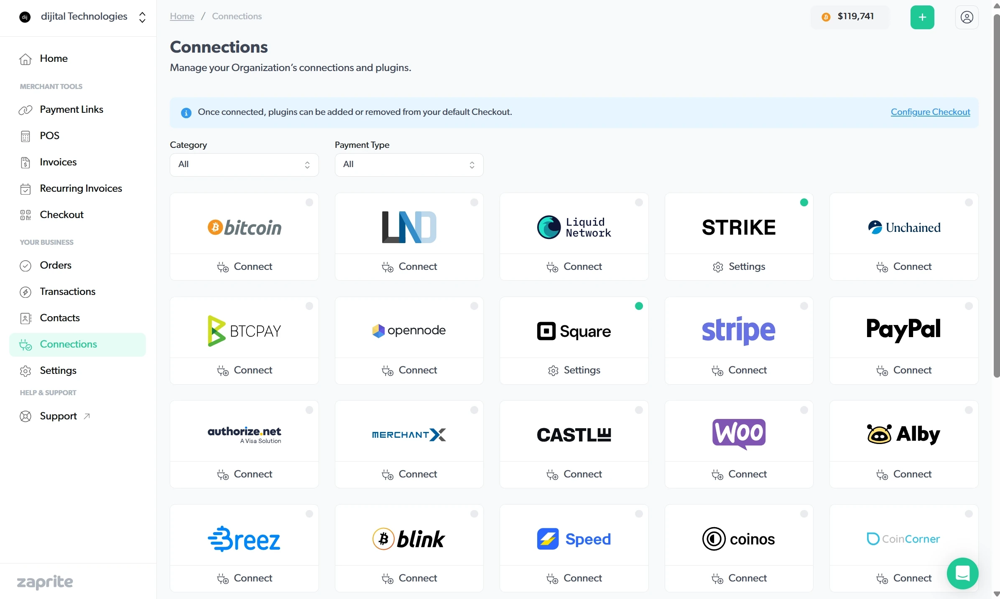
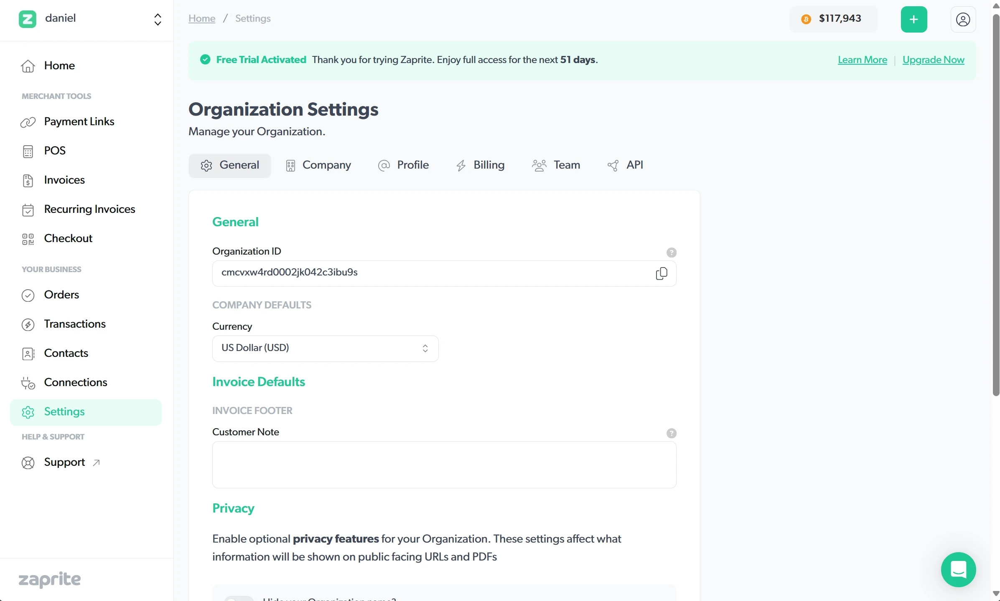
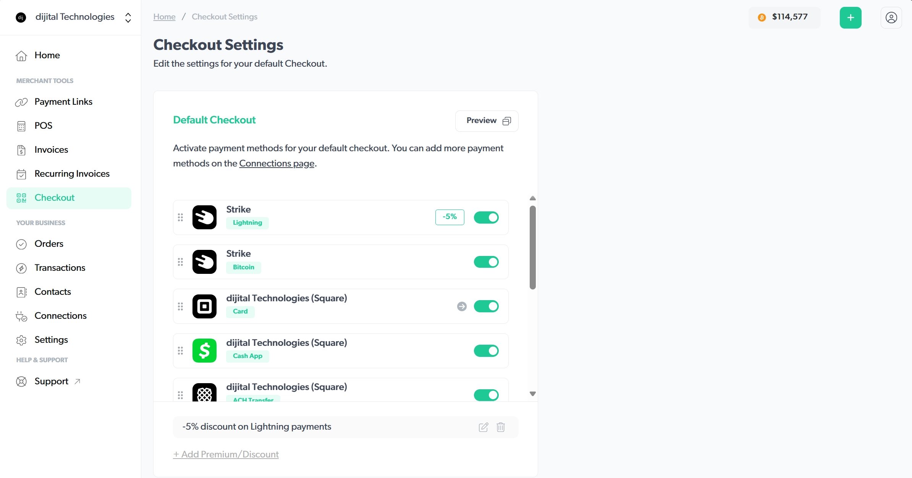
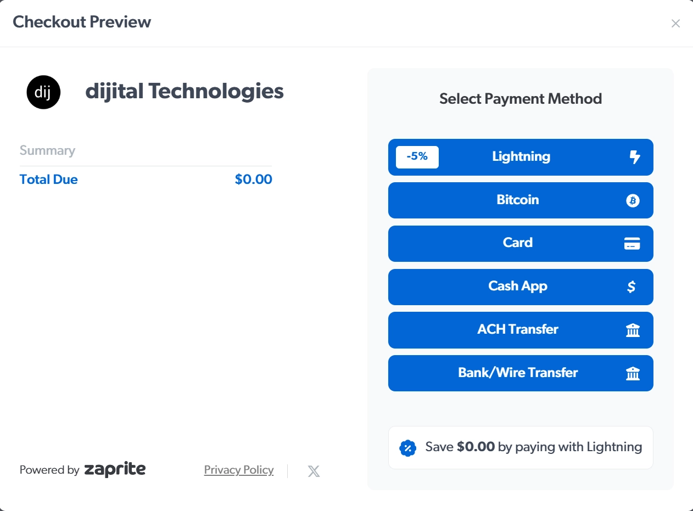

Zaprite is a premier invoicing and business payments solution. Easily accept payments via Bitcoin, Lightning and Liquid Networks, and any legacy fiat payment rails including Card Payments and Bank Transfers.

This tutorial will guide you through all of their many features and prepare you to confidently take payments via any medium and streamline your bottom line.

## Free Trial

To get started accepting payments, they have an extremely gracious trial period available to new users.

All you need is an email to get started. If you prefer, you can also enable Single-Sign-On (SSO) with an existing Google account.

## Home Page

Okay, here we have the ZapRite homepage.

Dashboard

This is a neat little dashboard that'll give you a great overview of everything that you have available. 

Navigation Toolbar
On the left side, we have a useful toolbar, separated into two sections. Just to overview. 

Merchant Tools Overview
Over here on the left, we have our merchant tools, where we can make payment links. We have POS for our point-of-sale system.Event tickets, invoices, recurring invoices, payment requests, and a checkout section, where you can customize how your checkout experience will be for your customers.

Business Tools Overview
Underneath that, we also have your business section. Here you can configure what your orders can be made up of, transactions, contacts, connections, and settings. And then after that, we have support that will link you to all sorts of quick tips and tricks for how to use the section.

Header
Back up at the top, we do have a useful ticker showing the current US dollar denominated price of Bitcoin, or whatever currency you select for your business.
Next to that, we do have a quick button as well that allows us to quickly get to payment links, POS, events, invoice, recurring invoice, payment request, contacts, and transactions. And next to that, we also have our account, where we can edit our account or sign out.

Income Summary

Beneath that, on this dashboard, we do have an income summary. This will show your Bitcoin received.
As well as the current, the accounted value in your currency of choice.
Your Bitcoin payments will be listed, by whether they come in as Bitcoin on-chain payments or Lightning payments, as well as if you are receiving any fiat payments that will be received in your, currency of choice, and locate it there. You do also have a filter, for a certain date range, if you want to look that up. So you can go backdate that and show that for a certain period as well.

Orders

And then further beneath that, we have a order section. This will list all your invoices or orders that have been processed; as well as your transactions next to that.So any previous transactions will be listed with: the relative timeframe, the title of that payment was, as well as the currency breakdown to the right.

## Business Details

### Orders

### Payment Links

Going further down, we have our payment links. You can create a payment link there. That's just something simple you can shoot out to someone.
Each payment link is composed of a title, a image, your brand logo, and your brand color. 

You can give a description, for example, let's just say "dijital Technologies payment"
I'll just say Pay to dijital Technologies.
Demo… or ZapRite demo link.
And beneath that, you can also configure your item.
or, you know, your actual item that you're selling, you can choose your currency, it defaults to your payment, you can choose Bitcoin,
You can add taxes to that as well. The customer can choose what to pay, or you can display whatever the set price is.
You can also take stock, how much is available.
So let's say we have 10, like, in max order 1.
You can choose what the customer has to enter, so you can get as much information as you would like.

Let's just say a email is required.
And let's say if you have a, item that you need to, ship off, you would check required fulfillment. This would load in, back to the system where you can mark that,
So the system will say, if checked, orders will be marked as paid upon payment. You will then be able to mark orders as complete. So once you, actually ship off whatever they need to get.
You can also add tags to your orders. So let's just add a demo tag, as well as a…
Products… And you can then also notify team members when payments are received, we'll keep that checked.
And then we can go with our default payment option, but just to take a look, you can configure a custom payment solution based on whatever,
Based on whatever connections you have, set up.
But I'll go with my default payment that I've already configured, and that does show this checkout preview. So it'll give the price here, since we selected BTC, that's what the, order shows up on the left, and then on the right, they do have all the available payment options.
Then at the bottom, when the order is complete, you then can direct them to a specific page. This is useful, especially if you have things that shouldn't be visible unless the customer has paid for them. This is a great way to add that functionality here.
He just… to add the example, and I'll say ditch.io, my website.
And I'll save… And the payment link has been created.
Now, it gives you a pay.zaprite.com.
link, you can copy that. You do also get, as well with that, you get a option to show a embed code.
That you can copy and paste into a website. They can pay that way.
You can get a QR code generated, you can save the PNG or the SVG versions.
And deliver the, your payment that way.
And then you can also print out your QR code.
So that is a neat little feature.
So the print will take your QR code and set that to be printed. That is another great feature. You do also have the ability to go back and edit. You can view your link, see your orders. Let's click View.
So with Vue, you get the payment, also we get the name of our item, the price in Bitcoin, 5,000 sets.
And then just our description at the bottom, and then we have our name and email as we selected.
So once you put in your information, you then can make your payment.
That will generate an invoice, generates a QR code with your business logo, and the amount in SATs, to fulfill the invoice. You can then scan and pay, this payment.
We can go back… Pretty much cancel the order.
If we go to the orders page…
Nothing does show up there, but if any payments are made, they will show up there for the orders.
And then we also have the option to unpublish or delete this as well. And if we take a note, just make a new tab…
Paste in that link, it shows that same view that we were just looking at.
And that is the payment link. If we go back… To our homepage…
Let's go down to the payment links page. You can see our link that we created is here as well. The income summary is also available at the top of this page.

### POS
Going down to the POS, point of sale system, our income summary does continue over. If you do notice from the dashboard, we had the total for all payments. For the payment links, that number gets updated for how many payments have come through this payment method.
Going down to point of sale, same thing there. You can create a new point of sale system here.
And so there, there we can see we have our title, so I'll say Demo Point of Sale.
Point of sale system… for ZapRite tutorial.
Here you also have your currency option, so whether you want to use, a fiat currency or you can just denote the payment in Bitcoin, you are free to do that. You can add your tax percentage, and then a note for you and your team as well.
Down here for the customer fields, again, we have our options, name, email, address, phone number, company, and note. All of these are optional. You do not have to require your customer, any of these. So you could check these for them to show up.
But then, depending on how much KYC you want or require, you can then just break that down to be whatever is required to make the payment.
So nothing can technically be required, but you can still have the fields available.
require fulfillment, just like with the payment link. It is an optional choice in case you have to do some further processing of the order before they're technically complete.
This is great for that, but for this instance, we'll just leave that off, since, at a point-of-sale sale, usually you're going to be interacting with the customer, usually get the product right then and there.
Here with the global tags, you can see we created demo and product. I'm gonna just put demo, and since we're not technically requiring fulfillment, we're gonna leave product off.
We're gonna keep our team notified when payments come through, and here we're gonna simplify this. We're just going to say this is a Lightning point-of-sale system. So no fiat, so they won't pay me through Square, Cash App, no bank transfers.
But I will allow them to…
You can only select one lightning payment method, that's fine.
So since I do have Strike, Lightning enabled, for Lightning and Bitcoin, I'm not able to use any other Lightning providers, so it's just one option for checkout.
let's preview that, just so we can see what that looks like. they get the business logo, business name, as well as a order, and the total, and the two options, so Lightning or Bitcoin. What the customer will see is just a QR code for them to process their payment, but as we saw before, that will go through my strike, so via either on-chain or through my Lightning address.
Here also, we do have the option for premiums and discounts. I do have a 5% premium discount set up for my Lightning or Bitcoin payments.
So, they're kind of grouped by the type of payment. So, you can set a discount or a upcharge.
So if you want to charge more for Fiat payments, feel free to do that.
And then you can add that to your checkout experience. And I'm gonna save this.
So now my POS has been created.
And here, with my POS terminal, I get a link to that URL, as well as, once again, an embed code.
That can be pasted into another web page, that I manage.
The title does say Pay Now, we can change that.
To buy now.
It says for com…
Oh, so the radius of the corner. By default, it is at 8.
The higher that number goes, the more ovoid… more oval-shaped the button becomes. So you see, going from 8 to 30, it's pretty round.
You can also, once again, get the QR code. You can then save that as a PNG picture or a SVG.
Then once again, you have your URL builder.
So if we take our POS link, paste that in a new tab.
We get to see that this basically gives us a checkout experience.
So there is a price at the top with dollars and sats. We can reverse that order.
If I, let's say, pay $25, $22,291 sats currently, Charge that to the customer.
We can take in their name, email, since it is a, you know, a point of sale, I could technically just use this webpage to manage, you know, my checkout process.
So they're saving $1.25 by using Lightning via my payment method discount.
And then it generates a lightning QR code, so I can then scan and make that payment.
And that is the point-of-sale system. 

### Event Tickets
Going down the line of merchant tools, we can also create event tickets. So you can enable event tickets as a new feature of ZapRite. These are subject to transaction fees, as outlined in the pricing page of our website and our knowledge article, so you can read further there.the pricing page of our website and our knowledge article. By clicking it below, you have, have read and agreed to our standard pricing and billing policies.
So, if we just double-check on the pricing… Let's see… So once we have, Whenever you enable your account, They do take a 1% processing for event tickets, plus $3 per ticket, so just keep that in mind as you make tickets.
But, for invoices, payment requests, payment links, there are no fees for that, no fees for the point of sale. But for event tickets, the APAI usage and WooCommerce plugin, there is a 1% fee.
And the 1% fees apply to any on-chain Liquid, Lightning, or Tether payments, likely just to cover their infrastructure, since Lightning servers and, I believe Liquid nodes would have a fee.
There is a fee cap of $15 per transaction, just FYI.
There's no additional charge on top of, existing fiat processing.

ZapRite Processing, this gives us a quicker breakdown.
So the account fee is just $25 a month per regular, or $250 annually.
$240 annually.
And then they have a table breakdown for the, percentages that they do charge.
Fees would be capped at $15.
I'm gonna go down to invoices.
Here, once again, we have our income summary at the top. It'll separate your BTC from fiat payments. It'll show how many payments you have received, accordingly. And this will just list out any and all invoices that you have created.
So I have created 6 so far, for my software development business, or for my IT consulting business.

### Contacts

### Connections

For our first stop, let's configure our payment methods. This is where you configure the ways that people can pay you.

Payment options fall into these general categories:

1) Cash
    
    Manually record order details where your customer paid in cash.

1) Bank Wire and ACH Transfers
    
    Enter your bank info or your account info for a payment processor such as Square.

1) Card Payments
    
    Enter details or authenticate Zaprite to use your payment processor (Stripe, Paypal, Square, etc.)

1) Bitcoin
    
    Bitcoin payments come in the most variety. Whether you have a provider like BTCPayServer already setup, want to receive to an onchain address, or use Lightning or Liquid, you have plenty of options.
    Some of these connections are as simple as including a lightning address! Many others will give you an option to Login and give access to Zaprite to your account. Others still may just require a few details: account numbers, xpub, etc.

- Payment 

- Onchain

- Lightning

    - APIs

    - Lightning Address

- Liquid

### Settings 

Now, let's take a look all the settings you can configure for your Organization and Individual Account.

##### General

Once you've created your account, the first area of focus is to enter your Business Details and set everything up.

The General tab is where you Zaprite account details will be: 

###### Organization ID

This is how your organization is identified and accessed. This ID is generated when you create your organization and is unable to be modified. If you look at your address bar, after you login, each page is access from a url with the following structure: https://App.Zaprite.com/org/ORGANIZATIONID/PAGENAME

###### Currency

Select your preferred National Currency to be used within the application. You can select from a comprehensive list that also includes Tether (USDT).

###### Invoice Footer 

For a standard note that will be included on every invoice footer, fill in this field.

###### Privacy Options

Here you can select whethere or not your Organization's Name, Email, or Address are displayed on your any public urls and documents such as an Order Page or Invoice PDF.

##### Company

The information entered here will be used on invoices and external communication.

That information includes:

- Legal Name
- Email
- Phone
- Website
- Tax ID
- Address

##### Profile

Profile is where you can begin to add some brand-specific flair to your public facing features such as Checkouts, Invoices, Payment Links and lightning addresses.

There is a preview section available to verify that your selections are meeting expectations.

- Brand Logo
- Color
- Username
  - Lightning address will be coming soon, but you can reserve your permenant Lightning address with Zaprite now.
- Display Name
  - Use this optional field if you have a DBA or a name other than your legal business name.

##### Billing

Keep track of your Zaprite subscription with the Your Plan section where you can see how long your current cycle will last and the due date for your next payment.

Set your payment interval to either be monthly or yearly, for a 20% discount.

View your Payment History at a glance and download receipts if need be.

If business isn't going well, you can always choose to Cancel Subscription.

##### Team

As admin, you'll be able to manage team access. You can invite additional team members to login to Zaprite and manage your organization.

##### API

Request access to the API for custom integrations.

## Merchant Options

### Checkout

#### Premiums/Discounts for Varying Money Types (Bitcoin vs Fiat)

### Invoices

### Recurring

#### Speed of Payment Processing

### Payment Links

### POS

## Support

## Cost

Robust platform for all businesses. Makes moving to a Bitcoin standard even simpler

## Customer Experience

If you want to mention a Plan ₿ Network tutorial, put the link in this way (remember the empty line, as if it were a paragraph):

https://planb.network/tutorials/computer-security/authentication/bitwarden-0532f569-fb00-4fad-acba-2fcb1bf05de9

You will also need to put a new line after, then you can go on writing your text..
