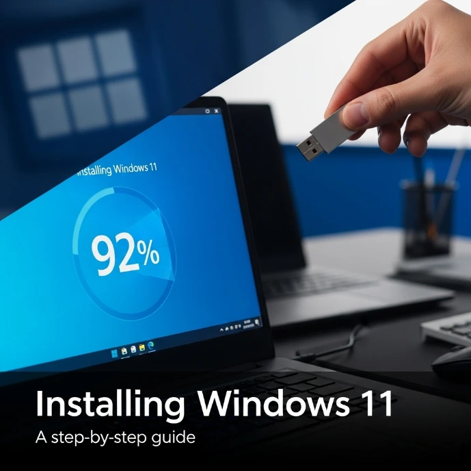

___

*Ce tutoriel est basé sur le contenu original de Florian BURNEL publié sur [IT-Connect](https://www.it-connect.fr/). Licence [CC BY-NC 4.0](https://creativecommons.org/licenses/by-nc/4.0/). Des modifications ont pu être apportées au texte original.*

___

## I. First Step

In this tutorial, we’ll walk you through the step-by-step process of installing Microsoft Windows 11 on a VirtualBox virtual machine (version 7.1.10).
The first thing you’ll need is an installation file. The safest and most reliable place to download it is directly from Microsoft’s official website.
Simply visit the link provided below and follow the instructions to download the Windows 11 ISO file:
https://www.microsoft.com/en-us/software-download/windows11
* [MS Windows 11](https://www.microsoft.com/en-us/software-download/windows11)

## II. Prise en main d'Angry IP Scanner

### A. Télécharger et installer Angry IP Scanner

Vous pouvez télécharger la dernière version d'Angry IP Scanner à partir du site officiel de l'application ou depuis GitHub. Nous partirons sur cette seconde option. Cliquez sur le lien ci-dessous et téléchargez la version EXE, à savoir ici : "**ipscan-3.9.1-setup.exe**".

