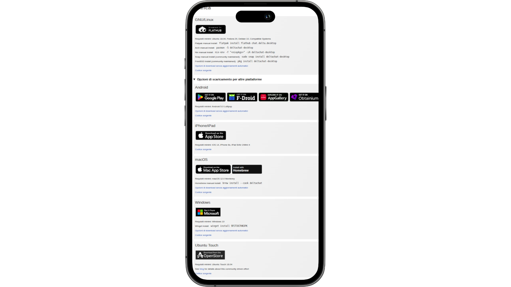
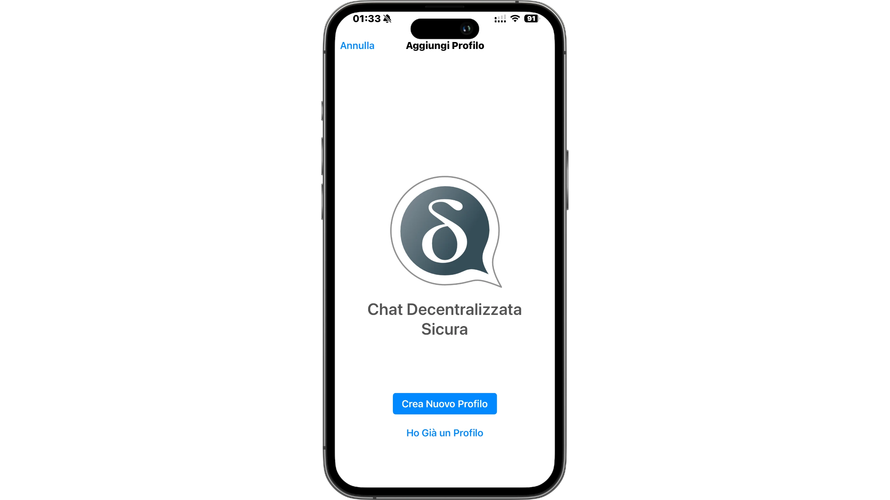
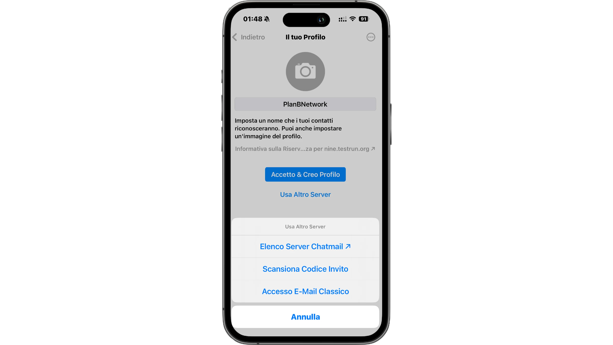
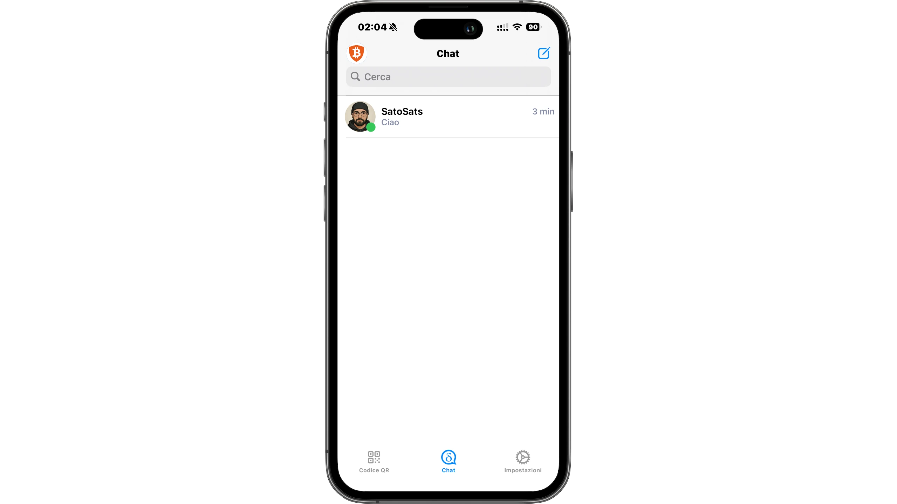

## Introduzione – Chat Control e privacy:

Negli ultimi anni si parla sempre più spesso di Chat Control, una proposta normativa che punta a introdurre la scansione automatica dei messaggi privati sulle principali piattaforme di comunicazione.
L’obiettivo dichiarato è il contrasto a contenuti illegali, ma il problema è che questo meccanismo comporterebbe di fatto una sorveglianza di massa, andando a minare la cifratura end-to-end e quindi la privacy di tutti gli utenti, non solo di chi commette reati.

Il rischio concreto è che le chat diventino ambienti controllati, dove ogni messaggio, immagine o allegato potrebbe essere analizzato prima ancora di arrivare al destinatario.
Ed è proprio qui che entra in gioco una possibile soluzione: abbandonare le piattaforme centralizzate e spostarsi verso sistemi di messaggistica decentralizzata, che non dipendono da un singolo provider e non possono essere facilmente soggetti a questo tipo di controllo.

Una di queste soluzioni, probabilmente la più matura e utilizzabile oggi, è Delta Chat.

## Delta Chat: perché usarlo e come funziona:

Delta Chat è attualmente la soluzione di messaggistica che mi ha convinto di più, soprattutto per l’uso quotidiano: parlare con amici, parenti e fare chat normali, quindi come vero equivalente di WhatsApp.

Si tratta di un sistema di messaggistica decentralizzato, basato interamente sulle email. In pratica sfrutta l’infrastruttura della posta elettronica tradizionale, ma costruendoci sopra un’interfaccia e un’esperienza da instant messenger moderno.

Detta così può sembrare una cosa un po’ improvvisata, ma in realtà funziona molto bene ed è sorprendentemente solida.
Delta Chat può utilizzare dei server di posta dedicati chiamati ChatMail, ma può anche funzionare senza problemi con normali server email. Questo significa che volendo si può accedere con un account già esistente, senza dover creare nulla di nuovo.

Un altro punto forte è il supporto alle WebXDC, ovvero piccole applicazioni web che si possono usare direttamente dentro le chat, in modo simile alle mini-app di Telegram. La differenza importante è che queste app non hanno accesso a Internet, quindi non possono tracciare l’utente o inviare dati all’esterno.

Dal punto di vista della sicurezza, Delta Chat utilizza una cifratura end-to-end verificata, basata su PGP ma con estensioni moderne che la rendono paragonabile, come livello di protezione, a quella di Signal.
L’unica mancanza attuale è la Perfect Forward Secrecy, ma è un aspetto in evoluzione.

Essendo basato esclusivamente sulle email, Delta Chat evita del tutto:

- numeri di telefono obbligatori
- ID centralizzati
- registrazioni legate a un singolo servizio

Ed è proprio questo che lo rende molto più resistente a normative invasive come il Chat Control.

## Installazione:

Dal sito ufficiale di [Delta Chat](https://delta.chat/it/download) si può andare nella sezione Download.
Su Linux è disponibile comodamente tramite Flathub, ma ci sono anche pacchetti per Arch, NixOS, Snap e versioni standalone.

È disponibile anche per:

- [F-Droid](https://f-droid.org/app/com.b44t.messenger)
- [Play Store](https://play.google.com/store/apps/details?id=chat.delta)
- [iOS](https://apps.apple.com/us/app/delta-chat/id1459523234)
- [Windows](https://apps.microsoft.com/detail/9pjtxx7hn3pk)
- [macOS](https://apps.apple.com/us/app/delta-chat-desktop/id1462750497)
- [Ubuntu Touch](https://open-store.io/app/deltatouch.lotharketterer)

  e altri store...

Una cosa molto importante: le versioni desktop non richiedono il telefono.
A differenza di WhatsApp o SimpleX Chat, non è necessario registrarsi prima da mobile. È possibile creare il profilo direttamente su PC oppure trasferirlo da un altro dispositivo.

## Creazione del profilo:

Una volta aperta l’app, Delta Chat chiede se creare un nuovo profilo o usarne uno esistente.

  

Creando un nuovo profilo si può inserire:

- un nome
- un’immagine (opzionale)

Di default viene proposto un server ChatMail, ma è possibile:

- scegliere un altro server ChatMail
- usare un account email classico
- configurare manualmente IMAP e SMTP
- registrarsi tramite codice di invito di un altro utente

Dopo pochi secondi il profilo è pronto e si può iniziare a usare l’app.

  

## Interfaccia e chat:

L’interfaccia è molto semplice e immediata:

- Messaggi di dispositivo, che sono comunicazioni locali
- Messaggi salvati, simili a quelli di Telegram e sincronizzabili tra dispositivi

  
  
Per aggiungere un contatto basta:

- mostrare il proprio QR code
- scansionare quello dell’altra persona
- invitare tramite link (invita amici)
  
Una volta stabilita la connessione, la cifratura end-to-end viene configurata automaticamente.
Le chat sono praticamente identiche a WhatsApp:

- messaggi di testo e vocali
- foto, video e file
- risposte ai messaggi
- reazioni
- messaggi a scomparsa
- notifiche personalizzabili
