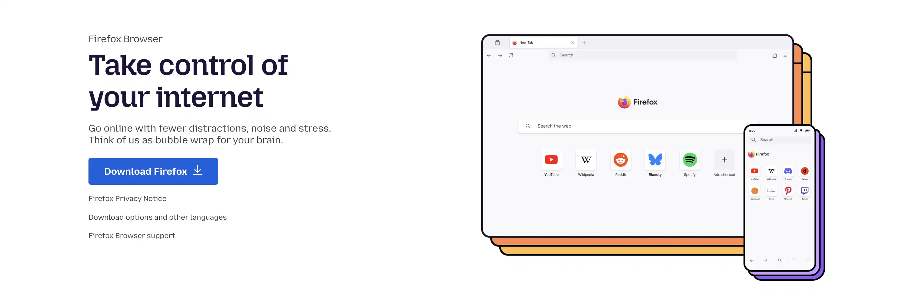

Dans un web dominé par la collecte de données, choisir un navigateur respectueux de la vie privée est essentiel. Développé par Mozilla (organisation à but non lucratif), **Firefox** place la confidentialité et le contrôle utilisateur au centre. Ce guide pragmatique propose une configuration progressive, alignée sur le style des autres tutoriels, pour réduire nettement le pistage tout en préservant l’usage quotidien. Adaptez chaque réglage à votre modèle de menace.

- Il n’existe pas de réglage « universel »: plus vous modifiez, plus vous pouvez devenir unique (fingerprinting). Cherchez l’équilibre protection/compatibilité.
- Avancez par étapes; testez après chaque changement et gardez un navigateur utilisable.

## Présentation de Firefox

Firefox est un navigateur libre et open-source basé sur le moteur Gecko. Ses atouts pour la vie privée:

- **Protection renforcée contre le pistage (ETP)** intégrée.
- **Total Cookie Protection** et **State Partitioning**: cloisonnent les données par site.
- **Mode HTTPS uniquement** et **DNS over HTTPS (DoH)** en option.
- Code auditable, pas de modèle publicitaire.

Versions disponibles:
- **Stable** (recommandée), **ESR** (rythme plus lent), **Beta/Developer/Nightly** (test).

## Installation de Firefox

- **Windows**: téléchargez depuis `https://www.mozilla.org` (ou Microsoft Store), lancez l’installeur.
- **macOS**: ouvrez le `.dmg` et glissez l’app dans Applications.
- **Linux**: via le gestionnaire de paquets (apt, dnf, pacman), Flatpak (Flathub) ou Snap. Préférez les sources officielles.

Après installation, vérifiez les mises à jour (Aide → À propos de Firefox).

## Configuration recommandée

Appliquez d’abord ces réglages simples (menu ☰ → Paramètres → Vie privée et Sécurité). En cas de site cassé, utilisez l’icône bouclier 🛡️ pour faire une exception locale.

### Réglages de base (facile)

1) Protection contre le pistage
- Passez **ETP** en **Strict** (bloque cookies inter-sites, fingerprinting, cryptomineurs, boutons sociaux).

2) Cookies et données de site
- Activez **« Supprimer les cookies et données des sites à la fermeture »**.
- Utilisez **« Exceptions… »** pour conserver quelques connexions (messagerie, banque).

3) HTTPS uniquement
- Activez **« Mode HTTPS uniquement dans toutes les fenêtres »**.

4) Télémétrie et mesures publicitaires
- Dans « Collecte de données par Firefox », **décochez toutes les cases**.
- Désactivez **« Autoriser les sites à effectuer des mesures publicitaires respectueuses de la vie privée »** (PPA).

5) Saisie auto, suggestions et page d’accueil
- Désactivez l’**auto-remplissage** (identifiants, adresses, cartes).
- Dans **Recherche**, désactivez **« Afficher des suggestions de recherche »**.
- Dans **Barre d’adresse**, décochez **« Suggestions sponsorisées »** et **« Suggestions contextuelles »**.
- Dans **Accueil**, désactivez **Pocket** et le **contenu sponsorisé**.

6) Global Privacy Control (optionnel)
- Activez le **GPC**. C’est déclaratif mais utile en complément.

7) Moteur de recherche
- Passez à **DuckDuckGo**, **Startpage**, **Qwant** ou **Brave Search** (Paramètres → Recherche). SearXNG possible via une instance publique.

8) Navigation privée
- Utilisez des **fenêtres privées** (Ctrl/Cmd+Maj+P) pour des sessions éphémères. Évitez le mode « ne jamais garder l’historique » en permanence (extensions parfois inactives en privé, exceptions moins utiles).

### Extensions recommandées (officielles et éprouvées)

- **uBlock Origin**: bloque pubs/pistage, léger et efficace par défaut.
- **Privacy Badger**: apprend à bloquer les traqueurs récurrents; envoie Do Not Track et GPC.
- **ClearURLs**: supprime automatiquement les paramètres de suivi dans les liens.
- **Firefox Multi-Account Containers**: isolez comptes et activités par onglets colorés.

Limitez le nombre d’extensions pour réduire la surface d’attaque et l’unicité.

## Compartimentage et options avancées

### DNS over HTTPS (DoH)
- Paramètres → Général → Paramètres réseau → **Activer DoH** → **Cloudflare** ou **Quad9** → **Protection maximale**.
- Centralise la résolution DNS chez un tiers; si vous utilisez déjà un **VPN fiable** ou vos **propres DNS**, DoH n’est pas indispensable.
- Vérifiez sur `https://www.dnsleaktest.com/` (ne voir que votre fournisseur DoH).

### Conteneurs et profils
- Créez des **conteneurs**: Personnel, Travail, Finance, Réseaux sociaux, Shopping, Jetable. Attribuez automatiquement les sites aux bons conteneurs.
- Pour une séparation totale, créez des **profils Firefox** distincts via `about:profiles` (profil principal, profil « ultra‑sécurisé », profil test).

### Extensions avancées (à réserver à un profil/usage dédié)
- **NoScript**: blocage strict de JavaScript et contenus actifs (très protecteur, plus exigeant).
- **Cookie AutoDelete**: supprime les cookies peu après fermeture de l’onglet.
- **LocalCDN**: sert localement des bibliothèques habituelles au lieu des CDN (couverture partielle).
- **Chameleon**: randomisation de l’empreinte (à tester; trop de différence peut rendre plus identifiable).

## Réglages experts (about:config) et Arkenfox

Testez d’abord dans un **profil séparé**. Ces options peuvent casser des sites.

### about:config (barre d’adresse → `about:config`)

Résistance au fingerprinting (hérite de Tor Browser):
```text
privacy.resistFingerprinting = true
```
Effets: fuseau UTC, letterboxing, User‑Agent/polices uniformisés, restrictions Canvas/WebGL/AudioContext. Attendez‑vous à quelques décalages horaires/linguistiques et à des tailles de fenêtre standard.

Désactiver WebRTC (évite des fuites d’IP, casse la visioconférence Web):
```text
media.peerconnection.enabled = false
```

Referer plus strict:
```text
network.http.referer.XOriginPolicy = 2
network.http.referer.trimOnCrossOrigin = true
```

Limiter certaines API peu utiles côté confidentialité (à ajuster):
```text
dom.battery.enabled = false
device.sensors.enabled = false
beacon.enabled = false
geo.enabled = false
media.navigator.enabled = false
network.prefetch-next = false
```

### Arkenfox user.js

Le projet **Arkenfox** fournit un `user.js` qui applique des centaines de préférences de durcissement (télémétrie coupée, RFP activé, cookies/cache/référer/DNS/TLS renforcés, WebRTC désactivé, etc.).

Installation (idéalement sur un **profil dédié**):
1. Sauvegardez le profil/favoris et notez vos exceptions cookies.
2. Téléchargez `user.js` depuis le dépôt GitHub « arkenfox/user.js » (version ESR/stable).
3. Repérez votre dossier de profil via `about:profiles`:
   - Windows: `%APPDATA%/Mozilla/Firefox/Profiles/...`
   - Linux: `~/.mozilla/firefox/...`
   - macOS: `~/Library/Application Support/Firefox/Profiles/...`
4. Fermez Firefox et placez `user.js` à la racine du dossier de profil.
5. Rouvrez Firefox; ajustez via `about:config` ou un fichier d’overrides séparé.

Overrides typiques:
```javascript
user_pref("media.eme.enabled", true); // DRM (Netflix/Prime)
user_pref("browser.safebrowsing.phishing.enabled", true);
user_pref("browser.safebrowsing.malware.enabled", true);
user_pref("places.history.expiration.max_pages", 200000);
user_pref("identity.fxaccounts.enabled", true); // Sync
```

Points d’attention: WebGL/Canvas bridés; taille de fenêtre standard; langue/fuseau uniformisés; cookies tiers compartimentés; historique serré; services annexes (Pocket…) désactivés. Mettez à jour régulièrement (aligné ESR).

## Tests et vérifications

- **Empreinte/trackers**: EFF Cover Your Tracks, Am I Unique, PrivacyTests.org.
- **Fuites**: WebRTC (`browserleaks.com/webrtc`), DNS (`dnsleaktest.com`), IP (`ipleak.net`).
- **Sécurité**: BadSSL, pages de test Mozilla/DDG.

Interprétez avec pragmatisme: visez surtout l’absence de fuites et le blocage des grands traqueurs. Ajustez ETP/uBlock/DoH/RFP selon les résultats.

## Bonnes pratiques au quotidien

- Mettez à jour Firefox et les extensions; évitez les modules obscurs; surveillez les rachats.
- Prudence aux téléchargements; utilisez VirusTotal pour les fichiers douteux; ne contournez pas les alertes.
- Utilisez un gestionnaire de mots de passe (Bitwarden, KeePassXC) ou celui de Firefox avec mot de passe principal; activez la 2FA.
- Isolez réseaux sociaux et Google dans des conteneurs dédiés; fermez des sessions régulièrement.

## Limites et alternatives

- Un navigateur durci n’assure pas l’anonymat réseau: **IP visible** sans VPN; corrélation toujours possible.
- Trop de modifications peuvent vous rendre plus **unique**. RFP standardise; Chameleon randomise: testez votre empreinte et choisissez.
- Plus c’est strict, plus certains sites cassent. Préférez des **exceptions ciblées** ou un **profil séparé**.

Alternatives/compléments:
- **Tor Browser**: anonymat réseau (via Tor), empreinte uniformisée; plus lent et parfois bloqué.
- **Mullvad Browser**: « Tor sans Tor », à combiner avec un VPN; empreinte standardisée, bonne performance.
- Combinaisons conseillées: Firefox (niveau modéré) + VPN au quotidien; Tor/Mullvad pour activités sensibles; profils séparés pour compartimenter.

## Conclusion

Avec ces réglages progressifs, vous obtenez un Firefox nettement plus respectueux de la vie privée: pistage publicitaire largement freiné, cookies compartimentés, fuites WebRTC/DNS évitées, télémétrie coupée, surface d’attaque réduite — tout en préservant une expérience moderne. Avancez par étapes, testez régulièrement et adaptez à votre modèle de menace. La confidentialité est un **processus continu**.

## Ressources

Documentation Mozilla
- Enhanced Tracking Protection: `https://support.mozilla.org/kb/enhanced-tracking-protection-firefox-desktop`
- State Partitioning: `https://developer.mozilla.org/docs/Mozilla/Firefox/Privacy/State_Partitioning`
- MDN Web Security: `https://developer.mozilla.org/docs/Web/Security`

Arkenfox
- Wiki et guide d’installation: `https://github.com/arkenfox/user.js/wiki`
- Dépôt et releases: `https://github.com/arkenfox/user.js`

Guides et communautés
- PrivacyGuides (navigateurs desktop): `https://www.privacyguides.org/en/desktop-browsers/`
- r/firefox, r/privacy, forum PrivacyGuides

Outils de test
- Cover Your Tracks (EFF): `https://coveryourtracks.eff.org/`
- DNS Leak Test: `https://www.dnsleaktest.com/`
- BrowserLeaks: `https://browserleaks.com/`
- BadSSL: `https://badssl.com/`
