## Introduction

On passe tous des heures en ligne, souvent sans se rendre compte de ce que notre navigateur révèle sur nous. Bonne nouvelle: avec quelques réglages bien choisis, **Firefox** peut devenir un compagnon discret, efficace et agréable au quotidien. Ce guide vous accompagne pas à pas, du plus simple au plus avancé, pour trouver **votre** équilibre entre confort et confidentialité.


- **Pas de recette universelle**: plus vous modifiez, plus vous risquez de vous démarquer (fingerprinting). L’objectif est d’être mieux protégé sans sortir de la foule.
- **Allez-y par étapes**: changez un réglage, testez 1–2 sites que vous utilisez souvent, puis continuez.
- Pourquoi Firefox? Libre et open‑source (moteur Gecko), développé par une **organisation à but non lucratif**. Protections natives: **Enhanced Tracking Protection (ETP)**, **Total Cookie Protection (TCP)**, **State Partitioning**, **HTTPS‑only**, **DoH**.

## Déjà activé par défaut (rassurant)

- **Isolation de site (Fission)**: activée par défaut. Chaque site s’exécute dans un processus séparé, ce qui empêche un onglet malveillant d’accéder aux données d’un autre et améliore la robustesse (mitige certaines fuites inter‑sites). Vérifiez via `about:support` (rechercher « Fission »).
- **Total Cookie Protection (TCP)**: actif par défaut. Les cookies et autres stockages sont confinés au site de première partie (un « bocal » par site), ce qui neutralise le pistage intersites. Des exceptions temporaires existent via la Storage Access API quand c’est nécessaire (boutons de connexion intégrés).
- **Bounce/Redirect Tracking Protection**: Firefox détecte et nettoie automatiquement les cookies laissés par les sites de rebond (liens qui vous redirigent via un traqueur avant la destination), réduisant ce canal de pistage sans action de votre part.

## Installation rapide

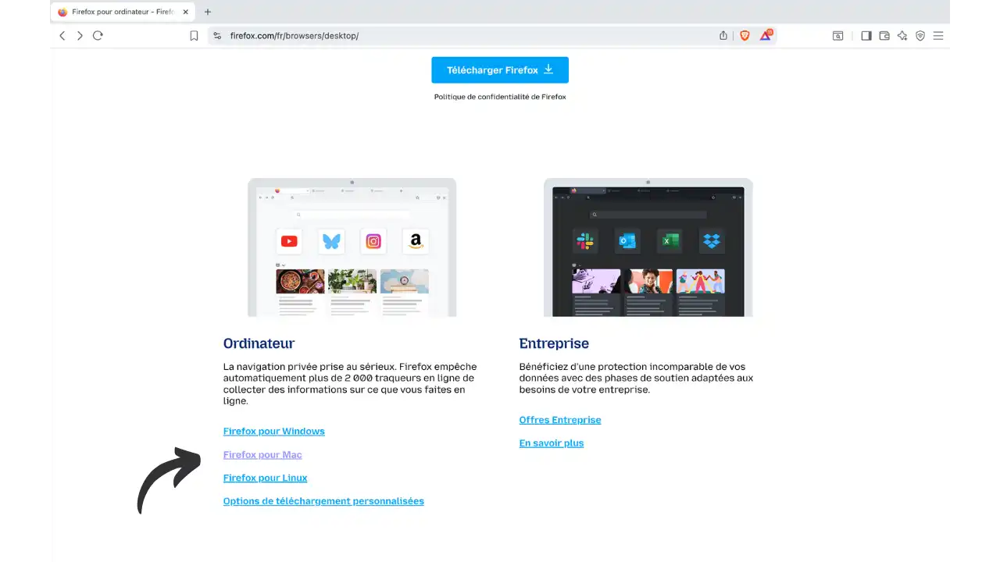

- **Windows**: téléchargez depuis `https://www.mozilla.org` (ou Microsoft Store), lancez l'installeur.
- **macOS**: ouvrez le `.dmg` et glissez l'app dans Applications.
- **Linux**: via gestionnaire de paquets (apt, dnf, pacman), Flatpak (Flathub) ou Snap. Préférez les sources officielles.
- Astuce: Aide → **À propos de Firefox** pour vérifier les mises à jour (correctifs sécurité et privacy).

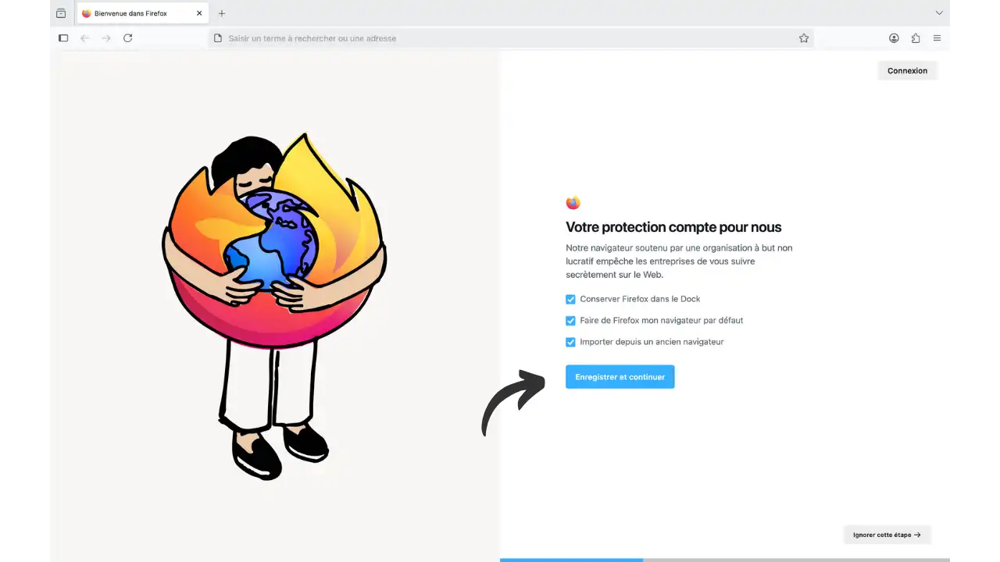

---

## Niveau 1 — Essentiel (≤ 10 minutes)

Objectif: gros gain de confidentialité sans casser le web. Pour 90% des utilisateurs.

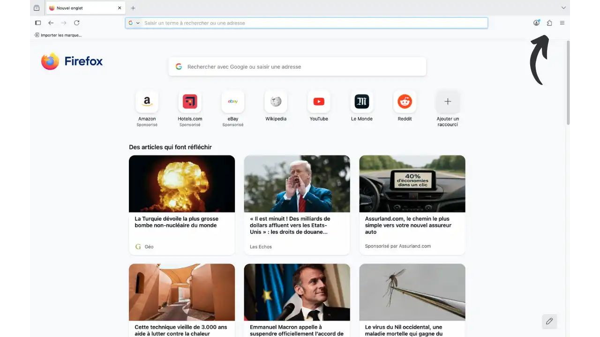

**Protection contre le pistage (ETP)**
- Passez **ETP** en **Strict**. Vous bloquez davantage de traqueurs (cookies inter‑sites, fingerprinting, cryptomineurs, widgets sociaux…).
- Si un site casse (vidéo, bouton connexion…), désactivez la protection uniquement pour ce site via le bouclier 🛡️, puis actualisez l'onglet.

Voici les différents niveau de sécurité ETP :
- **Standard** (équilibré, compatibilité maximale)
  - Bloque: traqueurs sociaux, cookies intersites (toutes fenêtres), contenu de pistage en navigation privée, mineurs de cryptomonnaie, détecteurs d’empreinte.
  - Inclut **Total Cookie Protection** (TCP): un « bocal » par site.
- **Strict** (recommandé pour la confidentialité)
  - Bloque aussi le contenu de pistage dans toutes les fenêtres + fingerprinting connus et suspectés.
  - Peut casser certains sites; utilisez le bouclier 🛡️ pour une exception locale.
- **Personnalisée** (avancé)
  - Choix fin: cookies, contenu de pistage, mineurs, fingerprinting (connu/suspect).

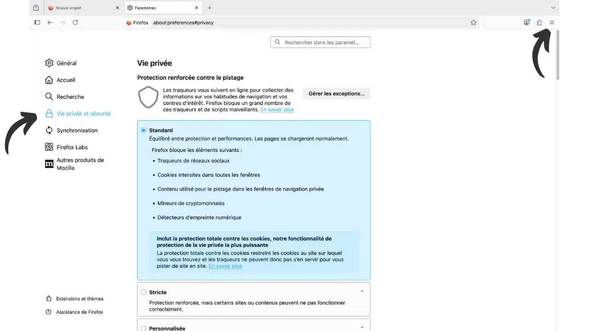

**Cookies et données de site**
- Activez **« Supprimer les cookies et données des sites à la fermeture »** pour repartir proprement à chaque redémarrage.
- Ajoutez des **Exceptions** pour 2–3 sites indispensables (messagerie, banque).

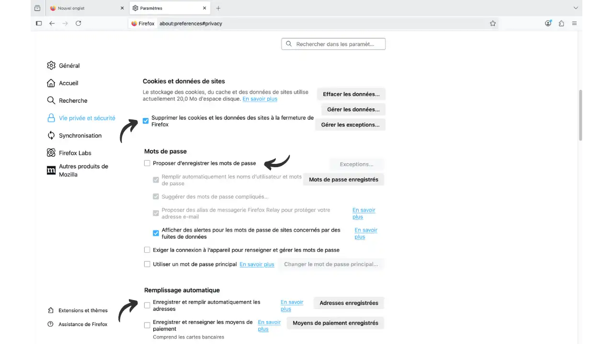

**HTTPS uniquement**
- Activez **« Mode HTTPS uniquement dans toutes les fenêtres »**.

**Télémétrie et mesures publicitaires**
- Dans « Collecte de données par Firefox », **décochez tout**.
- Désactivez **« Mesures publicitaires respectueuses de la vie privée »** (PPA).
- **Safe Browsing**: gardez‑le activé (vérifications locales + requêtes hachées) pour une meilleure sécurité à faible coût privacy.

**Saisie automatique, suggestions et page d'accueil**
- Désactivez l’**auto‑remplissage** (identifiants, adresses, cartes). Préférez un gestionnaire de mots de passe.
- **Recherche**: désactivez **« Afficher des suggestions de recherche »**.
- **Barre d’adresse**: coupez **« Suggestions sponsorisées »** et **« Suggestions contextuelles »**.
- **Accueil**: désactivez **Pocket** et le **contenu sponsorisé**.

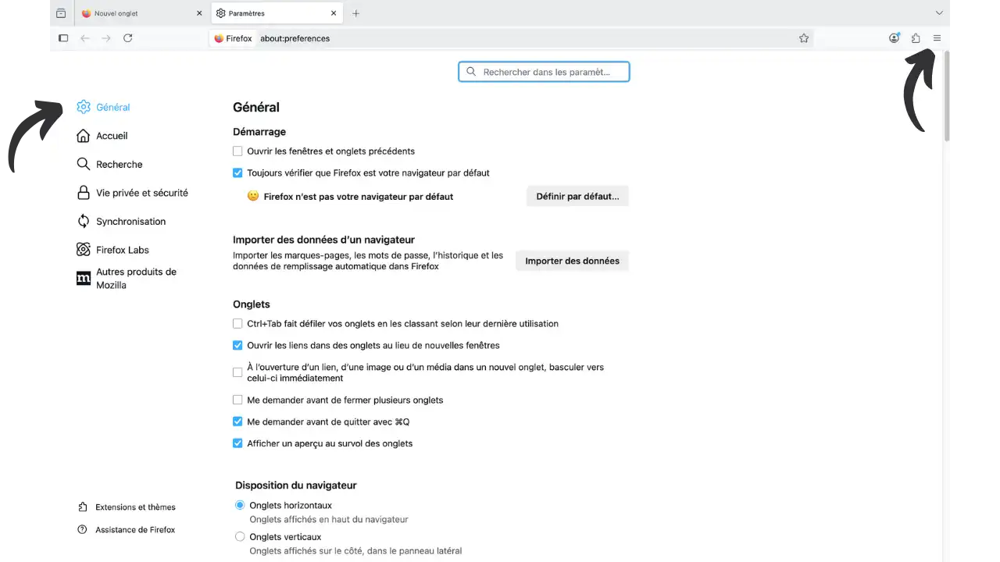

**Global Privacy Control (optionnel)**
- Activez le **GPC** pour signaler votre refus de vente/partage de données.

**Moteur de recherche**
- Passez à **DuckDuckGo**, **Startpage**, **Qwant** ou **Brave Search** (Paramètres → Recherche).

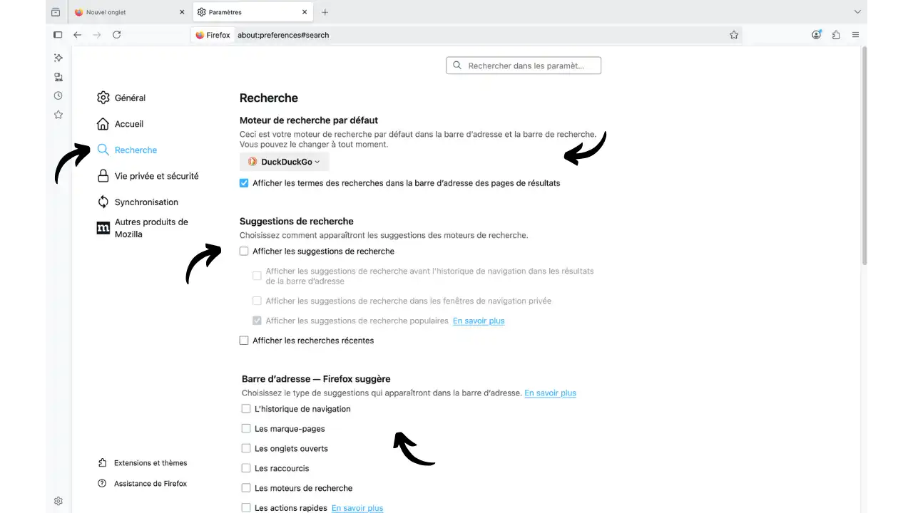

**Navigation privée**
- Fenêtres privées (Ctrl/Cmd+Maj+P) pour des sessions ponctuelles (cadeaux, comptes secondaires…). Évitez le mode « toujours privé »: extensions parfois inactives et exceptions cookies moins utiles.

**Extensions indispensables** (installer depuis le catalogue officiel)
- **uBlock Origin**: bloque pubs et pistage courant, léger.
- **Privacy Badger**: apprend à bloquer ce qui vous suit; envoie Do Not Track / GPC.
- **ClearURLs** (optionnel): Firefox (ETP Strict) et uBO nettoient déjà beaucoup; gardez‑le si vous voyez encore des URLs « sales » (utm, fbclid).
- **Firefox Multi‑Account Containers**: **isole cookies/sessions et stockage par conteneur; multi‑comptes en parallèle; moins de suivi intersites**. Extension officielle: `https://addons.mozilla.org/fr/firefox/addon/multi-account-containers/`.

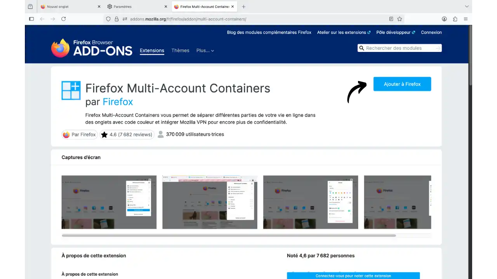

**Mots de passe et 2FA**
- **Privilégiez un gestionnaire dédié** (Bitwarden, KeePassXC). **Évitez** de stocker vos mots de passe dans le navigateur. **Activez la 2FA** partout où c’est possible.

## Niveau 2 — Renforcé (Compartimentage & Réseau)

Objectif: cloisonner ses activités et réduire les fuites réseau.

**DNS over HTTPS (DoH)**
- Paramètres → Général → Paramètres réseau → **Activer DoH** → **Cloudflare** ou **Quad9** → **Protection maximale**.
- **Protection maximale = TRR‑only** (pas de repli sur le DNS système). Si un réseau d'entreprise/hôtel bloque, revenez en **Standard** ou désactivez DoH.
- Si vous utilisez déjà un **VPN de confiance** ou vos **propres DNS**, DoH peut être redondant.
- Test: `https://www.dnsleaktest.com/` doit n'afficher que le fournisseur DoH choisi.

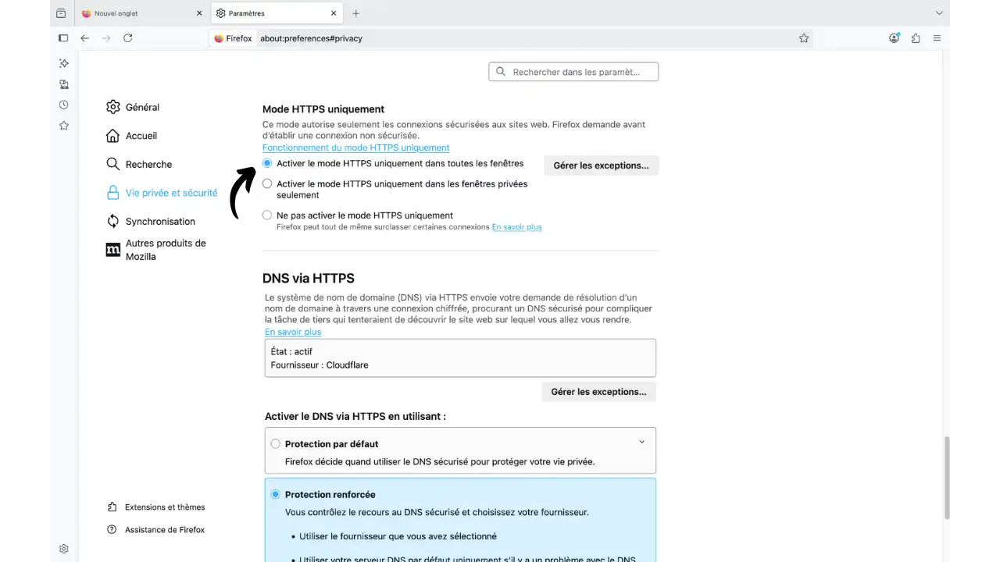

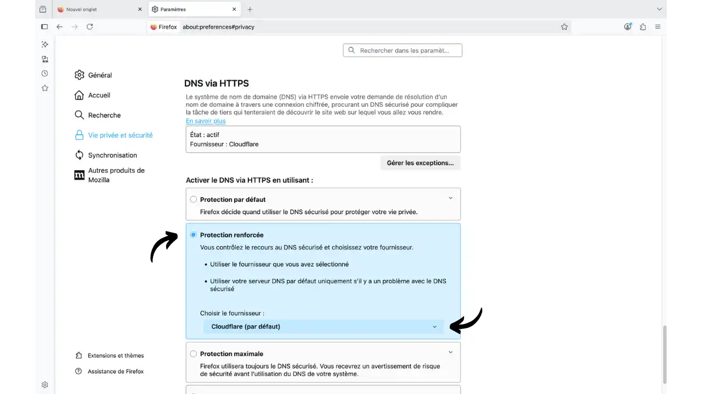

**Compartimentage avec conteneurs et profils**
- **Multi‑Account Containers**: créez des espaces (Personnel, Travail, Finance, Réseaux sociaux, Shopping, Jetable). Configurez **« Toujours ouvrir dans ce conteneur »** pour vos sites récurrents. Extension officielle: `https://addons.mozilla.org/fr/firefox/addon/multi-account-containers/`.
- Pourquoi les utiliser?
  - **Isolation** forte des cookies/sessions/stockage par espace.
  - **Moins de suivi intersites**: confinez les géants (Facebook, Google).
  - **Multi‑comptes** simultanés sur un même service.
  - **Moins de risques CSRF/XSS** entre identités segmentées.
  - Astuce: a minima des conteneurs dédiés pour Réseaux sociaux/Google, Travail, Finance.
- **Facebook Container** (option): déclinaison simplifiée dédiée FB/Instagram.
- **Profils séparés**: via `about:profiles` (profil principal, profil « ultra‑sécurisé » minimal, profil test). Cloisonnement total des données et extensions.

**Extensions avancées** (à réserver)
- **Cookie AutoDelete**: supprime les cookies d’un site dès que l’onglet est fermé (utile si Firefox reste ouvert longtemps).
- **LocalCDN**: sert localement des bibliothèques courantes (réduit les appels vers Google/Microsoft). Compatibilité partielle.

**Mobile (Android)**
- **Firefox Android + uBlock Origin**: protection similaire en mobilité.

---

## Niveau 3 — Expert (about:config & Arkenfox)

Objectif: durcissement poussé avec compromis assumés. Recommandé sur un **profil séparé**.

Choisissez une seule des deux approches suivantes :

**Approche A - Modifications manuelles** : Quelques ajustements ciblés via `about:config` (plus simple, contrôle précis)
**Approche B - Arkenfox user.js** : Configuration complète automatisée (plus complexe, protection maximale)

➡️ **Arkenfox inclut déjà TOUTES les modifications about:config mentionnées ci-dessous** + des centaines d'autres. Si vous choisissez Arkenfox, ignorez la section about:config.

### Approche A : Modifications manuelles via about:config

Tapez `about:config` dans la barre d'adresse → Accepter le risque.

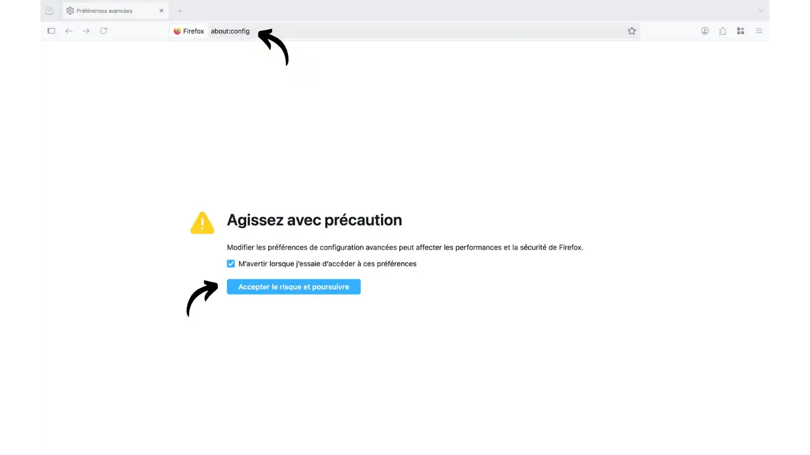

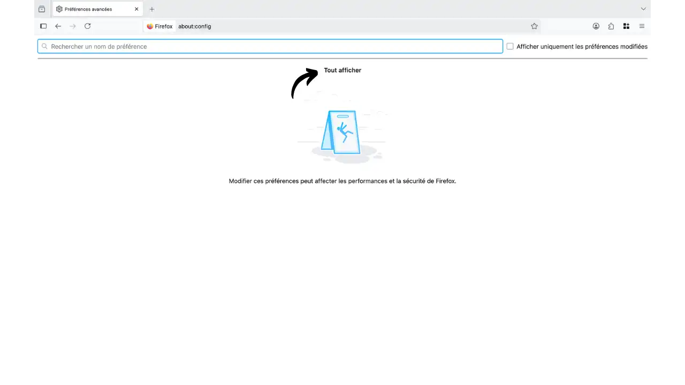

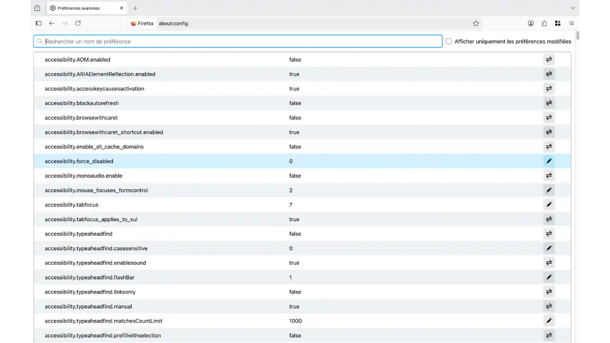

- Résistance au fingerprinting (héritée de Tor Browser)
```text
privacy.resistFingerprinting = true
```
Effets: fuseau UTC, **letterboxing** (tailles de fenêtre standard), User‑Agent/polices uniformisés, restrictions Canvas/WebGL/AudioContext. Plus d’uniformité, mais quelques « bizarreries » (heure décalée, parfois un peu d’anglais).

- Désactiver WebRTC (évite fuites IP; casse la visio Web)
```text
media.peerconnection.enabled = false
```

- Referer plus compatible (par défaut)
```text
network.http.referer.XOriginPolicy = 1
network.http.referer.trimOnCrossOrigin = true
```
Option stricte (peut casser paiements/SSO):
```text
network.http.referer.XOriginPolicy = 2
```

- Limiter certaines API bavardes et spéculations
```text
dom.battery.enabled = false
device.sensors.enabled = false
beacon.enabled = false
geo.enabled = false
media.navigator.enabled = false
network.prefetch-next = false
browser.urlbar.speculativeConnect.enabled = false
network.http.speculative-parallel-limit = 0
```

Règle d’or: si quelque chose casse, revenez sur le dernier changement.

### Approche B : Arkenfox user.js (Configuration complète automatisée)

Le projet **Arkenfox** fournit un fichier `user.js` maintenu par la communauté qui applique automatiquement des centaines de préférences Firefox orientées confidentialité et sécurité. Au redémarrage, Firefox lit ce fichier présent dans votre profil et applique ces réglages.

- À quoi ça sert? Partir d’une **base durcie cohérente** sans « cliquer partout »; réduire les oublis; gagner du temps.
- Ce que ça change (exemples): télémétrie coupée, cookies/cache/référer/HTTPS renforcés, **RFP** + letterboxing, **WebRTC désactivé**, ajustements DoH/TLS, limitation d’API bavardes.
- Quand l’utiliser: si vous voulez un Firefox durci en 10 minutes et acceptez quelques exceptions (DRM/streaming, visio Web, SSO/paiements).
- Avantages: rapide, cohérent, **mis à jour** (aligné ESR), très bien **documenté** (wiki + commentaires), **personnalisable** via overrides.
- Limites: compatibilité (certaines apps web), confort (UTC, tailles de fenêtre), et rappel: **ce n’est pas Tor** (pas d’anonymat réseau).

Installation (idéalement sur un **profil dédié**)
1. Sauvegardez profil/favoris et listez vos sites en exception cookies.
2. Téléchargez `user.js` depuis `https://github.com/arkenfox/user.js` (version ESR/stable).
3. Repérez votre dossier de profil via `about:profiles`:
   - Windows: `%APPDATA%/Mozilla/Firefox/Profiles/...`
   - Linux: `~/.mozilla/firefox/...`
   - macOS: `~/Library/Application Support/Firefox/Profiles/...`
4. Fermez Firefox et placez `user.js` à la racine du dossier de profil.
5. Relancez; personnalisez via `about:config` ou un fichier d’overrides.

Mises à jour
- Suivez les releases Arkenfox (alignées ESR), remplacez le `user.js`, relancez Firefox; lisez les notes de version.

Overrides utiles (exemples)
```javascript
// DRM/streaming
user_pref("media.eme.enabled", true);

// Safe Browsing (si vous préférez le garder)
user_pref("browser.safebrowsing.phishing.enabled", true);
user_pref("browser.safebrowsing.malware.enabled", true);

// Historique moins restrictif
user_pref("places.history.expiration.max_pages", 200000);

// Synchronisation Firefox
user_pref("identity.fxaccounts.enabled", true);

// WebRTC (si visio nécessaire)
user_pref("media.peerconnection.enabled", true);

// Referer plus compatible
user_pref("network.http.referer.XOriginPolicy", 1);
user_pref("network.http.referer.trimOnCrossOrigin", true);
```

Bonnes pratiques
- Utilisez un **profil séparé** « Arkenfox » et gardez un profil « normal » pour le confort.
- Minimisez les extensions (uBlock Origin OK) pour limiter surface d’attaque et unicité.
- Ajoutez des exceptions site‑par‑site (bouclier 🛡️, uBO, NoScript si utilisé) quand nécessaire.
- Testez après chaque changement: fuites WebRTC/DNS, Cover Your Tracks, CreepJS.

---

## Tests & Validation

- **Empreinte/trackers**: EFF Cover Your Tracks, Am I Unique, PrivacyTests.org, **CreepJS** (fingerprinting avancé).
- **Fuites**: WebRTC `https://browserleaks.com/webrtc`, DNS `https://www.dnsleaktest.com/`, IP `https://ipleak.net/`, **1.1.1.1/help** (état DoH/HTTP3/ECH).
- **Sécurité**: `https://badssl.com/`.

Critères de succès: **pas de fuites IP/DNS**, grands traqueurs bloqués, vos sites essentiels fonctionnent.

## Bonnes pratiques

- **Mises à jour**: Firefox et extensions à jour.
- **Extensions**: raisonnables et fiables; surveillez les rachats « douteux ».
- **Téléchargements**: prudence; testez les fichiers sensibles sur VirusTotal.
- **Mots de passe**: **gestionnaire dédié** (Bitwarden, KeePassXC); **2FA** activée; évitez le stockage dans le navigateur.
- **Hygiène**: confinez Google/Facebook dans des conteneurs; fermez/rouvrez régulièrement pour « réinitialiser » le contexte.

## Limites & Alternatives

- Un navigateur durci ≠ anonymat réseau: sans **VPN**, votre IP reste visible; même avec, la corrélation reste possible.
- Trop modifier peut vous rendre **unique**. **RFP** standardise; des outils de randomisation (ex. Chameleon) peuvent… vous distinguer. Testez, comparez, ajustez.
- Alternatives/compléments: **Tor Browser** (anonymat réseau via Tor; plus lent), **Mullvad Browser** (« Tor sans Tor », à combiner avec VPN; empreinte standardisée).
- Combinaisons conseillées: Firefox (Niveau 2) + VPN au quotidien; Tor/Mullvad pour activités sensibles; profils séparés pour compartimenter.

## Conclusion

Avec ces réglages par niveaux, **Firefox devient un allié discret**: pistage publicitaire largement freiné, cookies compartimentés, fuites WebRTC/DNS évitées, télémétrie coupée, surface d’attaque réduite — sans sacrifier le confort. Continuez par petites touches, testez de temps en temps: la confidentialité est un **processus**, pas un interrupteur.

## Ressources

### Documentation Mozilla
- [Enhanced Tracking Protection](https://support.mozilla.org/kb/enhanced-tracking-protection-firefox-desktop) : Guide officiel de la protection renforcée contre le pistage
- [State Partitioning](https://developer.mozilla.org/docs/Mozilla/Firefox/Privacy/State_Partitioning) : Documentation technique sur le cloisonnement d'état
- [MDN Web Security](https://developer.mozilla.org/docs/Web/Security) : Référence complète sur la sécurité web

### Arkenfox
- [Wiki et guide d'installation](https://github.com/arkenfox/user.js/wiki) : Documentation complète du projet Arkenfox
- [Dépôt et releases](https://github.com/arkenfox/user.js) : Téléchargement du fichier user.js et suivi des mises à jour

### Guides & communautés
- [PrivacyGuides - Navigateurs desktop](https://www.privacyguides.org/en/desktop-browsers/) : Recommandations et comparatifs de navigateurs
- **Reddit** : r/firefox, r/privacy pour retours d'expérience et entraide
- **Forum PrivacyGuides** : Discussions techniques approfondies

### Outils de test
- [Cover Your Tracks (EFF)](https://coveryourtracks.eff.org/) : Test d'empreinte numérique et efficacité anti-pistage
- [DNS Leak Test](https://www.dnsleaktest.com/) : Vérification des fuites DNS et efficacité DoH
- [BrowserLeaks](https://browserleaks.com/) : Suite complète de tests (WebRTC, Canvas, Fonts, etc.)
- [BadSSL](https://badssl.com/) : Tests de validation des certificats SSL/TLS
- [CreepJS](https://abrahamjuliot.github.io/creepjs/) : Analyse poussée de 50+ vecteurs de fingerprinting
- [Cloudflare DNS Test](https://1.1.1.1/help) : Vérification du bon fonctionnement de DoH Cloudflare
