> [GrapheneOS](https://grapheneos.org/) ni mfumo wa drive wa simu unaozingatia faragha na usalama, wenye uoanifu na programu za Android, uliotengenezwa kama mradi wa chanzo huria usio wa kibiashara.

GrapheneOS, iliyoanzishwa mwaka wa 2014 kama 'CopperheadOS', inategemea Kanuni ya Jadi ya Android (AOSP), lakini ikiwa na mabadiliko mengi na maboresho yanayolenga kuimarisha faragha na usalama wa mtumiaji. GrapheneOS humuweka mtumiaji katika udhibiti wa simu zao, si makampuni makubwa ya teknolojia.

### Sommaire:

- Utangulizi
- Maandalizi
- Sakinisha
- Programu Mbadala
- Mapungufu
- Taarifa Muhimu

Mwongozo wa https://github.com/BitcoinQnA/Bitcoiner.Guide/blob/main/grapheneos.md

## Kwa nini utumie GrapheneOS?

Simu za kisasa hugharimu kati ya $500 hadi $1000 ili kufuatilia na kuvuna data. Kila sehemu ya maisha yetu huathiriwa na hali hii, na kwa bahati mbaya, data hii nyingi hushirikiwa na washirika wengine kwa namna fulani.

GrapheneOS imeundwa mahususi ili kupunguza ushiriki huu wa data na kuboresha usalama wa kifaa chako dhidi ya vekta zinazoweza kushambulia. Hakuna kitu kama akaunti ya GrapheneOS. Huhitaji akaunti ili kupakua programu au kuingiliana na mfumo wa drive. Kwa ufupi, wewe si bidhaa.

GrapheneOS hutoa usalama zaidi kwa matumizi yako ya Android kupitia baadhi ya kanuni rahisi za msingi.

1. **Kupunguza uso wa mashambulizi** - Ondoa msimbo usio wa lazima (au bloatware).

2. **Uzuiaji wa kuathiriwa** - Ruhusu mtumiaji uwe na uzito wa kutosha kuchagua maelewano anayojihisi kustarehe nayo.

3. **Kizuizi cha kisanduku cha mchanga** - GrapheneOS huimarisha sandbox za Android zilizopo, ikiblock zaidi uwezo wa kila programu kuwasiliana na simu yako yote.

Pata maelezo zaidi kuhusu maelezo ya kiufundi ya seti ya element ya GrapheneOS [hapa]
(https://grapheneos.org/features).

### Kurahisisha Mpito

Ikiwa umejikita ndani ya mfumo ikolojia wa Google au Apple kwa miaka mingi, wazo la kupoteza urahisi huo ghafla linaweza kutisha. Lakini kwa kuzingatia baadhi ya maamuzi ya kusakinisha programu (yatakayoshughulikiwa baadaye), matatizo mengi yanayotarajiwa yanaweza kupunguzwa au kuondolewa.

Ingawa njia mbadala zinazidi kuwa bora, wazo la mabadiliko kama hayo bado linaweza kuonekana la kupuuza. Ukijikuta katika hali hii, ushauri wangu bora ni kutumia kifaa chako kipya cha GrapheneOS sambamba na simu yako ya sasa kwa muda. Kuanzia hapo, unaweza kujiondoa polepole kutoka kwenye programu 2–3 kwa wiki hadi ujikute unafikia tu kifaa chako cha GrapheneOS.

Ukichukua njia hii, kuwa mkali kwako mwenyewe na ukate utegemezi wako kwa njia mbadala zilizochunguzwa haraka iwezekanavyo. Sisi wanadamu huwa wavivu na mara nyingi huchagua njia yenye upinzani mdogo. Kumbuka kwa nini ulifanya mabadiliko hayo mara ya kwanza.

**Badala ya kulipa kwa data yako ya kibinafsi, ulichagua kulipa kwa wakati wako, na wakati mwingine pesa zako za Hard ulizochuma (kulingana na programu mbadala unazosakinisha).**

## Kuanza

Kwa sasa GrapheneOS inazalishwa kwa toleo la _(la kejeli)_ aina mbalimbali za simu za [Google Pixel](https://grapheneos.org/faq#supported-devices). Hii haiji bila sababu nzuri ingawa. Pixel's hutoa usalama bora zaidi wa msingi wa maunzi ili kukamilisha kazi iliyofanywa ili kuimarisha OS. Hii ni pamoja na vitu kama vile kutenganisha vijenzi mahususi na uanzishaji uliothibitishwa.

### Kuchagua kifaa

Unapochagua Pixel unayotaka kusakinisha GrapheneOS, hakikisha kuwa umeangalia ni muda gani kifaa kitaendelea kupata [sasisho za usalama](https://support.google.com/pixelphone/answer/4457705?hl=en#zippy=%2Cpixel-xl-a-a-g-a-g) kwa ajili yake.

Wakati wa kuandika, Pixel 6a ndicho kifaa cha bei nafuu kinachopatikana chenye usaidizi mzuri wa muda mrefu, umehakikishiwa hadi Julai 2027. Ukichagua muundo huu, kufungua kwa OEM hakutafanya kazi pamoja na toleo la hisa la OS kutoka kiwandani. Utahitaji kuisasisha hadi toleo la Juni 2022 au baadaye kupitia sasisho la hewani. Baada ya kuisasisha, utahitaji pia kuweka upya mipangilio ambayo kifaa kilitoka nayo kiwandani ili kurekebisha ufunguaji wa OEM. Miundo mingine yote iliyofunguliwa na mtoa huduma itakuwa tayari kwa GrapheneOS moja kwa moja nje ya boksi.

Unapochagua kifaa, utahitaji pia kuhakikisha kuwa unanunua toleo ambalo halijafungwa. Baadhi ya watoa huduma kama vile Verizon husafirisha vitengo vyao vilivyofungwa bootloader, ambavyo huzuia kabisa mchakato unaofuata.

### Inasakinisha GrapheneOS

GrapheneOS [kisakinishaji cha wavuti](https://grapheneos.org/install/web) hufanya mchakato mzima kuwa mwepesi, na ambao unaweza kukamilishwa na mtu yeyote kwa chini ya dakika 10.

Maagizo yafuatayo ni toleo la kukata lililochukuliwa kutoka kwa kiungo hapo juu.

Unachohitaji kwa mkono ni:

- Pixel
- Kebo ya USB ya kwenda kutoka kwa simu hadi kwenye kompyuta yako
- Kompyuta yenye uwezo wa kuendesha kivinjari chochote kinachotegemea Chromium (kama vile Chrome, Edge, Brave, n.k.)

Hebu tuzame ndani yake:

1. Hatua ya kwanza ni kwenda kwenye **Mipangilio** > **Kuhusu simu** na ugonge mara kwa mara nambari ya muundo hadi uone **'Hali ya Wasanidi Programu'** imewashwa.

2. Kichwa kinachofuata hadi **Mipangilio** > **Mfumo** > **Chaguo za Msanidi** na uwashe **'Kufungua kwa OEM'**.

3. Sasa washa upya kifaa na ushikilie kitufe cha kupunguza sauti wakati simu inawasha tena.

4. Unganisha simu kwenye kompyuta yako ya mkononi na ukiombwa uidhinishaji, ruhusu muunganisho.

5. Kwenye ukurasa wa kisakinishi cha wavuti, bofya kwenye 'Fungua kipakiaji cha kuanza'.

6. Kisha utaona chaguzi za simu zikibadilika. Tumia kitufe cha sauti kubadilisha uteuzi kuwa `fungua` na utumie kitufe cha kuwasha/kuzima kukubali.

7. Ifuatayo, bofya toleo la upakuaji kwenye ukurasa wa kisakinishi cha wavuti.

8. Baada ya kupakuliwa kikamilifu, nenda kwenye hatua inayofuata na ubofye 'Toleo la Mweko'. Hatua hii itachukua dakika moja au mbili na huhitaji kugusa simu hata kidogo.

9. Hatimaye, nenda kwenye hatua inayofuata ya kisakinishi cha wavuti na ubofye **Funga Kipakiaji cha Kianzisha**. Utahitaji kubadilisha uteuzi na uthibitishe kwa kitufe cha kuwasha/kuzima kwa njia sawa na ulivyofanya awali katika mchakato.

10. Unapoona neno `Anza`, thibitisha hili kwa kitufe cha kuwasha/kuzima na kifaa kitaingia kwenye mfumo wako mpya wa drive bila Google.

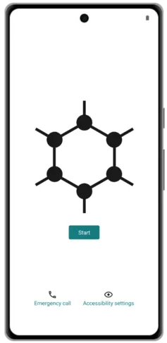

Skrini ya kuanza ya GrapheneOS

_Baada ya kuwasha na kusanidi kwa mara ya kwanza, ni mazoezi mazuri kuzima ufunguaji wa OEM kutoka kwa Mipangilio > Mfumo > Chaguzi za Wasanidi Programu._

_Huenda pia ukataka kuchukua hatua ya ziada, ya hiari lakini inayopendekezwa ya kuthibitisha usakinishaji kupitia programu ya Mkaguzi. Utahitaji simu tofauti ya Android iliyo na programu iliyosakinishwa ili kukamilisha hatua hii. Maagizo ya hili yanaweza kupatikana [hapa](https://attestation.app/tutorial)._

Video inayoelezea hatua rahisi zilizoainishwa hapo juu

Ikiwa hatua hizo rahisi zinaonekana kama hatua ya mbali sana, unaweza kufikiria kununua Pixel ukitumia programu ya GrapheneOS [iliyosakinishwa awali](https://ronindojo.io/en/roninmobile). Fahamu tu kwamba unaweka kiasi kidogo cha uaminifu kwa mtoa huduma.

### Programu Zilizosakinishwa mapema

Sasa kwa kuwa umesanidiwa, unaweza kugundua jinsi mifupa tupu ya GrapheneOS inavyoonekana kwenye usakinishaji wa kwanza. Kwa chaguo-msingi, utasakinisha programu zifuatazo:

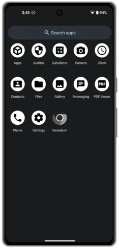

Programu chaguomsingi

Wawili pekee ambao huenda hujui ni 'Mkaguzi' na 'Vanadium'.

- [Programu ya Mkaguzi](https://play.google.com/store/apps/details?id=app.attestation.auditor) Hutumia elementi za usalama za maunzi ili kuthibitisha utambulisho wa kifaa pamoja na uhalisi na uadilifu wa mfumo wa uendeshaji. Inathibitisha kwamba kifaa kinaendesha mfumo wa uendeshaji wa hisa, bootloader imefungwa, na kwamba hakuna uharibifu wowote wa mfumo wa uendeshaji umetokea.

- [Vanadium](https://github.com/GrapheneOS/Vanadium) ni lahaja iliyoimarishwa ya faragha na usalama ya kivinjari cha Chromium.

## Kubinafsisha

Mipangilio ya simu ni ya kibinafsi, lakini hapa kuna baadhi ya vitu vya kwanza ninavyobadilisha wakati wa kusakinisha GrapheneOS ili nijisikie kama niko nyumbani.

### Kuweka mandhari na kusasisha mandhari

Nenda kwa Mipangilio > Mandhari na Mtindo. Kutoka hapa:

- Sasisha mandharinyuma ya skrini ya nyumbani na iliyofunga kwa picha zilizopakuliwa kutoka kwa wavuti.
- Kuchagua rangi za lafudhi zinazotumika kote kwenye UI.
- Washa Mandhari Meusi.

### Onyesha asilimia ya betri

Nenda kwenye **Mipangilio** > **Betri**, kisha uwashe **Onyesha asilimia ya betri** kwenye upau wa hali.

### Ingiza waasiliani

**Kutoka kwa simu nyingine ya Android** - Nenda kwa programu ya Anwani na utafute chaguo la Hamisha hadi VCF.

**Kutoka kwa iOS** - Tumia programu kama vile Hamisha Anwani na utumie chaguo la kuhamisha la 'vCard' ili kuhamisha faili ya VCF.

Pindi tu unapokuwa na faili ya VCF, unaweza kuhamisha kwenye kifaa chako cha GrapheneOS kwa kutumia chaguo la hifadhi ya nje kama vile kadi ya microSD au hifadhi ya USB. Ikiwa huna njia hizo za kuhamisha, unaweza kuchagua kushiriki kupitia mojawapo ya programu nyingi zilizoorodheshwa hapa chini.

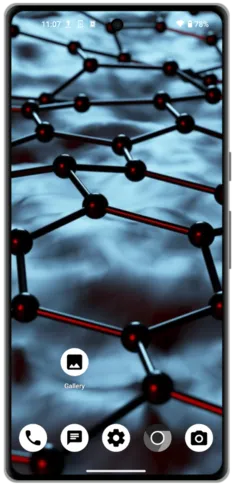

Skrini ya nyumbani iliyobinafsishwa

## Programu Mbadala

Ili kufanya simu yako iwe na matumizi muhimu, utahitaji kusakinisha baadhi ya programu. Chaguo zifuatazo zimejumuishwa kwa sababu aidha nimezitumia binafsi au zinapokea mapendekezo dhabiti kutoka kwa jumuiya pana ya faragha. Kuna njia mbadala nyingi zinazopatikana ambazo hazijatajwa hapa, na [Faragha ya Kushangaza](https://awesome-privacy.xyz) inatoa orodha pana sana ya kuhifadhi ufaragha kwa kila aina ya kifaa.

Kwa sababu tu programu ni Programu Huria na Huria (FOSS) haimaanishi kuwa haina uvujaji wa faragha. Tumia [Kutoka](https://reports.exodus-privacy.eu.org/en/) kuona jinsi programu unazopendelea zinavyofanya kazi dhidi ya ukaguzi wao wa faragha.

### F-Droid

[F-Droid](https://f-droid.org/) Ni katalogi inayoweza kusakinishwa ya programu za FOSS kwa Android. Kiteja hurahisisha kuvinjari, kusakinisha, na kusasisha programu kwenye kifaa chako. Inafaa kutaja kwamba masasisho kupitia F-Droid wakati mwingine yanaweza kuchelewa ikilinganishwa na maduka mengine ya programu. Hii inategemea sana kama programu husika inapatikana kupitia hazina kuu ya F-Droid au kupitia hazina maalum.

Ili kusakinisha F-Droid nenda tu kwenye tovuti yao kupitia kivinjari kwenye simu yako ya GrapheneOS na ugonge pakua. Hii itapakua faili ya `.apk`. Kisha utaulizwa ikiwa ungependa kusakinisha programu.

Pamoja na programu zinazopatikana ndani ya hazina chaguomsingi ya F-Droid, miradi mingi ya open-source pia huandaa hazina yao wenyewe ambayo unaweza kuongeza kupitia mipangilio ya programu ya F-Droid. Ikiwa hili ndilo tukio, mradi husika utakupa maagizo rahisi ya hatua kwa hatua kupitia wavuti yao ili kufanikisha hilo.

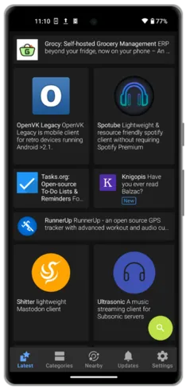

Skrini ya nyumbani ya F-Droid

### Duka la Aurora

[Aurora Store](https://auroraoss.com/) Ni toleo la FOSS la Google Play Store. Aurora inaonekana na kufanana sana na Google Play Store, na hukuruhusu kupakua na kusasisha programu yoyote ambayo kawaida ungeipata kupitia chaguo la Google.

Element kuu ya Aurora ni uwezo wa kuingia bila kujitambulisha. Hii ina maana kwamba unaweza kupakua programu uzipendazo ambazo hazipatikani kupitia F-Droid au APK ya moja kwa moja, bila kuhitaji kuingia kwenye akaunti yako ya Google.

Kabla ya kuharakisha kufanya chaguo hili kuwa njia chaguomsingi ya kusakinisha programu, kumbuka kwamba programu nyingi tunazojaribu kuepuka zilisakinishwa awali kutoka kwenye Play Store. Kwa sababu tu zinapatikana kupitia Aurora haibadilishi ukweli kwamba baadhi zinaweza kuwa na elementi za ufuatiliaji zilizopachikwa. Haitawezekana kila wakati, lakini kila unapoweza, tafuta mbadala kupitia F-Droid kabla ya kupakua kupitia Aurora.

Ili kusakinisha Aurora, tafuta tu 'Aurora Store' katika F-Droid.

Aurora pia haina vibebaji vya ushambuliaji vinavyowezekana, kwa kuwa “akaunti zisizojulikana” zinaundwa na kudhibitiwa na Aurora yenyewe. Kwa nadharia, wanaweza kutoa masasisho hasidi au kusukuma programu kwenye simu yako, ingawa bado utahitaji kukubali ombi la usakinishaji kwenye kifaa chako. Aurora pia wakati mwingine hukumbwa na matatizo ambapo programu hazionekani, kutokana na usomaji wa eneo na aina ya kifaa. Hali hii mara nyingi inaweza kushughulikiwa kwa kutumia hatua zilizo hapa chini.

**Kidokezo kikuu** - Wakati mwingine Duka la Aurora litakabiliwa na kizuizi cha bei ambacho kinapunguza uwezo wako wa kutafuta na kusakinisha programu. Ili kufanya hivyo, nenda kwenye **Mipangilio** > **Programu** > **Aurora** > **Fungua kwa chaguomsingi**, kisha uongeze kikoa `play.google.com`. Sasa, wakati wowote unapoenda kwenye tovuti ya bidhaa au huduma iliyo na kiungo cha 'Pakua kupitia Play Store', kugonga kutafungua programu hiyo ndani ya Aurora ili uipakue.

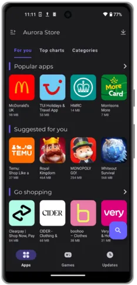

Skrini ya kwanza ya Duka la Aurora

### Upakuaji wa APK

Programu kwenye Android pia zinaweza kupakuliwa na kusakinishwa kupitia faili ya `.apk`. Hii ni njia mbadala nzuri inayohitaji maduka ya programu ya wahusika wengine sifuri, pakua faili moja kwa moja kutoka kwa tovuti ya mradi au huduma au hazina ya GitHub.

Upande mbaya wa mbinu hii ni kwamba hupati masasisho ya kiotomatiki, hivyo utahitaji kufuatilia njia za mawasiliano za huduma hiyo ili kujua kuhusu matoleo mapya. Hata hivyo, kuna mradi mzuri unaoitwa Obtanium ambao unalenga kurekebisha hili. [Obtainium](https://github.com/ImranR98/Obtainium) hukuruhusu kusakinisha na kusasisha programu za Open-Source moja kwa moja kutoka kwa kurasa zao za matoleo, na kupokea arifa matoleo mapya yanapopatikana.

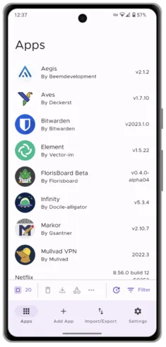

Obtanium hakikisho

### Programu za Wavuti

Kwa nyakati ambazo unataka kutumia huduma mara chache na hutaki kupakua programu asili, unaweza kufikia toleo la wavuti kwa urahisi. Tovuti nyingi siku hizi pia hutoa usaidizi wa Progressive Web App (PWA). Hapa ndipo unapoweza kualamisha tovuti maalum (k.m. twitter.com) kwenye skrini ya nyumbani ya simu yako. Kisha, unapogonga ikoni hiyo, inafunguka kama programu tumizi ya skrini nzima bila usumbufu wa kawaida unaokuja na matumizi ya kawaida ya kivinjari. Unaweza kuona mfano wa jinsi hii inavyoonekana hapa chini.

Ili kufanikisha hili katika Vanadium, kivinjari asili cha GrapheneOS, nenda kwenye tovuti ya chaguo lako, gusa nukta tatu wima kwenye kona ya juu kulia ya skrini kisha uguse **'Ongeza kwenye Skrini ya Nyumbani'**.

Upande wa pekee wa mbinu hii ni kwamba kwa sababu huu ni ukurasa wa wavuti ulioalamishwa tu, hutapata arifa za aina yoyote. Ingawa wengine wanaweza kuona hilo kama jambo chanya!

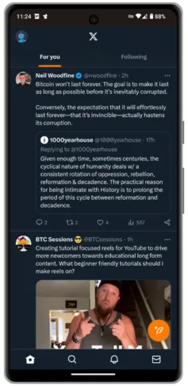

Twitter PWA

### Vivinjari vya Wavuti

Kwa kweli huwezi kwenda vibaya na chaguo lililowekwa tayari, Vanadium. Programu inatenda sawa na kivinjari kingine chochote cha rununu ambacho nimejaribu na sijawahi kuwa na maswala yoyote ya uoanifu.

Kwa nyakati ambazo unahitaji kufikia tovuti asili za Tor `.onion`, unaweza kupakua APK ya Kivinjari cha Tor moja kwa moja kutoka kwa [tovuti] yao (https://www.torproject.org/download/#android) au kupitia F-Droid.

### VPN

Zifuatazo ni chaguo 3 zinazoheshimiwa ambazo hukuruhusu kulipia huduma katika Bitcoin na bila kutoa taarifa zozote za kibinafsi. Chaguo zote 3 zinapatikana kupitia F-Droid.

- [Mullvad](https://f-droid.org/packages/net.mullvad.mullvadvpn/)
- [Protoni](https://f-droid.org/en/packages/ch.protonvpn.android/)
- [iVPN](https://f-droid.org/en/packages/net.ivpn.client/)

### Kutuma ujumbe

Katika miaka ya hivi karibuni, suluhu za ujumbe uliosimbwa zimeongezeka kwa kasi. Hata hivyo, tatizo linabaki pale pale — unaweza kuwa na chaguo bora na lenye faragha zaidi lililosakinishwa kwenye simu yako, lakini kama huna waasiliani wanaolitumia, kuna faida gani?

Watu wengi ambao hawapendezwi na nafasi ya faragha wana uwezekano wa kutumia WhatsApp au iMessage. Ya kwanza inaweza kupakuliwa kupitia Duka la Aurora lakini ya mwisho haitafanya kazi kwenye GrapheneOS (dhahiri!).

- [Signal](https://signal.org/) ni mojawapo ya wajumbe maarufu zaidi waliosimbwa kutoka mwisho hadi mwisho (E2EE) ambao wana rekodi nzuri ya wimbo na seti nyingi za element. Mawimbi inahitaji nambari ya simu ili kujisajili, kwa hivyo ikiwa unapanga kuzungumza na watu ambao hungependa kujua nambari yako ya simu, labda angalia baadhi ya njia mbadala. Ni lazima mawimbi ipakuliwe kupitia Aurora Store.
- [Simplex](https://f-droid.org/en/packages/chat.simplex.app/) ni mjumbe mpya kabisa wa E2EE. Haina kitambulisho cha mtumiaji, haihitaji nambari ya simu au maelezo ya kibinafsi. Watu wanakupata kwa kuchanganua msimbo wako wa kibinafsi wa QR au kwa kutembelea kiungo chako cha kipekee. Simplex pia inaruhusu watumiaji wa hali ya juu kuendesha seva yao wenyewe ili kupunguza zaidi utegemezi wa chombo chochote cha kati. Simplex haina kiteja cha eneo-kazi, kwa hivyo huenda isifae ikiwa vifaa vingi viko kwenye orodha yako ya kipaumbele. Simplex kwa Android inapatikana kupitia F-Droid.
- [Threema](https://threema.ch/en/faq/libre_installation) inatoa matumizi sawa na Simplex, lakini imekuwapo kwa muda mrefu na kwa hivyo, inahisi kung'olewa zaidi. Threema si bure, leseni ya maisha yote inagharimu $4.99 na inaweza kununuliwa kwa Bitcoin. Threema inatoa mteja wa wavuti na programu asilia za eneo-kazi. Programu ya Android inapatikana kupitia F-Droid.
- [Telegram FOSS](https://f-droid.org/en/packages/org.telegram.messenger/) ni FOSS Fork isiyo rasmi ya programu rasmi ya Telegram ya Android. Telegramu ina 'soga za siri' za E2EE, lakini chaguo-msingi si la faragha. Telegramu FOSS inaweza kupakuliwa kutoka F-Droid.

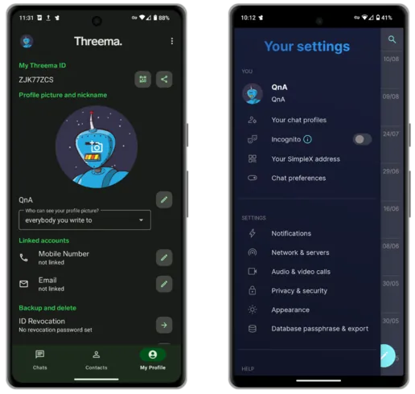

Kushoto: Threema, Kulia: Simplex

### Vyombo vya habari

- [Spotube](https://f-droid.org/packages/oss.krtirtho.spotube/) ni kiteja cha Spotify ambacho hakiitaji akaunti ya Premium. Spotube inapatikana kupitia F-Droid.
- [ViMusic](https://f-droid.org/en/packages/it.vfsfitvnm.vimusic/) ni programu nzuri ya kuanika muziki wowote kutoka kwa muziki wa YouTube, bila malipo. ViMusic inapatikana kutoka F-Droid.
- [Newpipe](https://f-droid.org/packages/org.schabi.newpipe/) inatoa matumizi ya YouTube bila matangazo ya kuudhi na ruhusa zinazotiliwa shaka. Ukiwa na NewPipe unaweza kujiandikisha kwa vituo, kusikiliza chinichini na hata kupakua ili kutazamwa nje ya mtandao. NewPipe inapatikana kupitia F-Droid.
- [AntennaPod](https://f-droid.org/packages/de.danoeh.antennapod/) ni kicheza podikasti kinachokuruhusu kujisajili na kudhibiti vipindi vyako vyote unavyovipenda. AntennaPod inapatikana kupitia F-Droid.

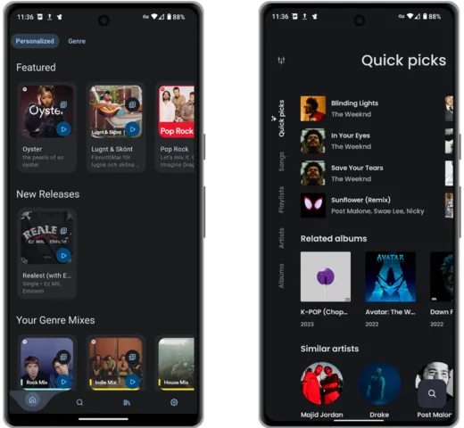

Kushoto: Spotube, Kulia: ViMusic

### Ramani

Iwapo unataka usaidizi wa kutamka unapoendesha drive na kutumia programu ya ramani katika GrapheneOS, utahitaji kusakinisha [RHVoice](https://rhvoice.org/installation/) na [configure](https://discuss.grapheneos.org/d/2488-organic-maps-app-voice-instructions-are-not-available)

- [Magic Earth](https://www.magicearth.com/) ni njia mbadala ya ramani inayoauni urambazaji wa hatua kwa hatua, 3D na ramani za nje ya mtandao. Magic earth inaweza kupakuliwa kutoka Hifadhi ya Aurora.
- [Ramani za Kikaboni](https://f-droid.org/en/packages/app.organicmaps/) Ni mbadala wa ramani kwa wasafiri, watalii, wapanda baiskeli, na wapanda milima, kulingana na data ya OpenStreetMap iliyoletwa na umati. Ni programu ya fork inayolenga faragha, ya chanzo huria ya Maps.me (hapo awali ikijulikana kama MapsWithMe). Inaauni asilimia 100 ya elementi bila kuhitaji muunganisho wa Intaneti na inaweza kupakuliwa kupitia F-Droid.

- [OsmAnd](https://f-droid.org/en/packages/net.osmand.plus/) Ni mbadala mwingine bora wa ramani unaoauni element zote zilizotajwa hapo juu.

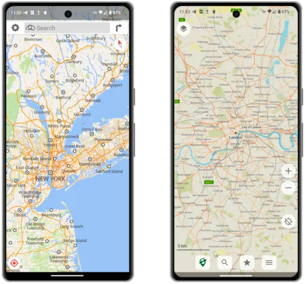

Kushoto: Magic earth, Kulia: Ramani za Kikaboni

### Barua pepe

- [Proton Mail](https://proton.me/mail) hutoa huduma ya barua pepe ya kibinafsi isiyolipishwa ambayo inatumia E2EE iliyokaguliwa. Proton pia inatoa toleo la kulipia ambalo linaauni vikoa maalum na [aliasing](https://proton.me/support/creating-aliases). Proton Mail inaweza kupakuliwa kama APK ya moja kwa moja au kupitia Aurora.
- [Tutanota](https://tutanota.com/) inatoa element sawa na Proton Mail, ikijumuisha huduma za kulipia za hiari na inaweza kupakuliwa kama APK ya moja kwa moja au kupitia F-Droid.
- [Barua ya K-9](https://f-droid.org/en/packages/com.fsck.k9/) ni mteja wa barua pepe huria ambao hufanya kazi na kila mtoa huduma wa barua pepe. Inaauni akaunti nyingi, kisanduku pokezi kilichounganishwa na kiwango cha usimbaji cha OpenPGP.

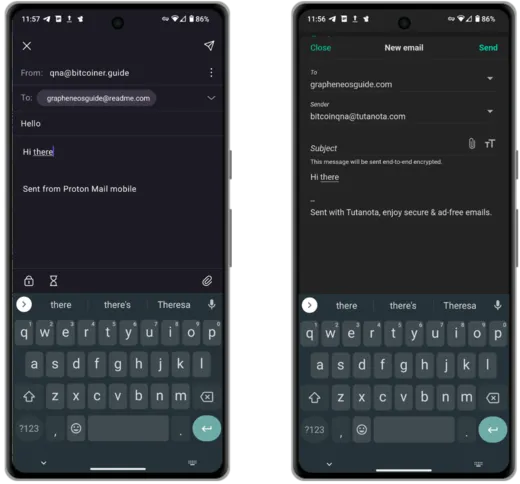

Kushoto: Proton Mail, Kulia: Tutanota

### Tija

- [Syncthing](https://f-droid.org/packages/com.nutomic.syncthingandroid/) Ni mpango wa kusawazisha faili ambao huwezesha usawazishaji wa faili kati ya vifaa viwili au zaidi kwa wakati halisi, huku ukiwa umelindwa kwa usalama dhidi ya ufuatiliaji wa nje. Data yako ni mali yako pekee, na unastahili kuchagua mahali itakavyohifadhiwa, ikiwa itashirikiwa na wengine, na jinsi itakavyotumwa kwenye mtandao. Usawazishaji huu unapatikana kupitia F-Droid.

- [KDE Connect](https://f-droid.org/packages/org.kde.kdeconnect_tp/) vifaa vyako vyote ili kuzungumza kwa urahisi vinapounganishwa kwenye mtandao wako wa nyumbani. Tuma faili, picha, data ya ubao wa kunakili kwa urahisi kwenye vifaa vyako vyote (hata kwenye iOS!). Unganisho la KDE linaweza kupakuliwa kutoka kwa F-Droid.
- [Notesnook](https://f-droid.org/en/packages/com.streetwriters.notesnook/) ni programu ya madokezo ya E2EE ya kusawazisha mawazo yako na orodha za mambo ya kufanya kwenye vifaa vyako vyote. Mpango wao wa bure unapaswa kufunika kesi nyingi za matumizi ya kibinafsi. Notesnook inapatikana kwenye F-Droid.
- [Maelezo ya Kawaida](https://f-droid.org/en/packages/com.standardnotes/) inafanana sana na Notesnook, lakini inahitaji mpango unaolipiwa ili kulinganisha na seti ya element. Vidokezo vya Kawaida vinapatikana kupitia F-Droid.
- [Kibodi ya Anysoft](https://f-droid.org/packages/com.menny.android.anysoftkeyboard/) ni programu ya kibodi inayokuruhusu kubinafsisha chochote unachoweza kufikiria linapokuja suala la uchapaji wa simu yako. Inaweza kupakuliwa kupitia F-Droid.
- [GBoard](https://play.google.com/store/apps/details?id=com.google.android.inputmethod.latin&hl=en&gl=US) ndiyo programu chaguomsingi ya kibodi ya Google. Kwa uzoefu wangu inatoa aina bora zaidi na uzoefu wa swipe. Ukipakua programu hii, hakikisha kwamba umezima kabisa ruhusa zote zinazohusiana na mtandao. Inaweza kupakuliwa kupitia Aurora.

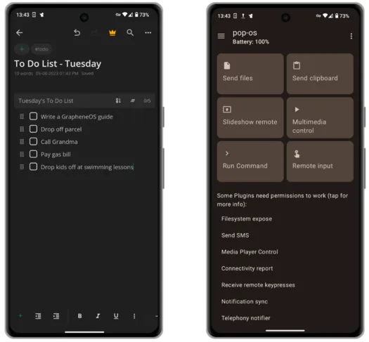

Kushoto: Notesnook, Kulia: KDE Connect

### Mtindo wa maisha

- [Hali ya hewa ya kijiometri](https://f-droid.org/en/packages/wangdaye.com.geometricweather/) ni programu iliyoundwa kwa uzuri ya Open Source inayopatikana kupitia F-Droid. Pia inaweza kutumia saizi tofauti za wijeti ili uweze kuona hali ya hewa katika eneo ulilochagua moja kwa moja kutoka skrini yako ya nyumbani.
- [Translate You](https://f-droid.org/packages/com.bnyro.translate/) ni Chanzo Huria na programu ya utafsiri inayohifadhi faragha ambayo inatumia zaidi ya lugha 200. (Translate You) inapatikana kupitia F-Droid.
- [Kalenda ya Protoni](https://proton.me/calendar/download) ni rahisi kutumia E2EE ambayo huwasiliana kwa urahisi na akaunti zako za barua pepe za Proton. Kalenda ya Protoni inaweza kupakuliwa kama APK au kupitia duka la Aurora.
- [PassAndroid](https://f-droid.org/en/packages/org.ligi.passandroid/) ni programu ya kuonyesha na kuhifadhi pasi za kuabiri, kuponi, tikiti za filamu na kadi za uanachama n.k. Pakua kwa urahisi `pkpass` au faili `espass` husika na ufungue kwa programu. PassAndroid inapatikana kupitia F-Droid.

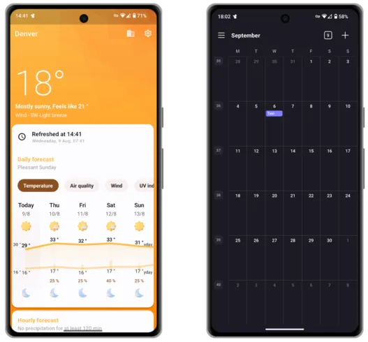

Kushoto: Hali ya Hewa ya Kijiometri, Kulia: Kalenda ya Protoni

### Usalama/Faragha

- [Bitwarden](https://mobileapp.bitwarden.com/fdroid/) hutoa suluhisho la kidhibiti nenosiri la mfumo tofauti la E2EE bila malipo kwa vifaa vyako vyote. Huduma yao ya kulipia hukuruhusu kujumuisha misimbo ya 2FA kwenye programu. Upande wa seva ya Bitwarden unaweza kujipangisha mwenyewe na programu ya Android inapatikana kupitia F-Droid.
- [Proton Pass](https://proton.me/pass/download) inatoa huduma sawa bila malipo kwa Bitwarden, lakini wateja wa [Proton Unlimited](https://proton.me/pricing) wanaweza kufikia vipengele vya juu zaidi. Proton Pass inapatikana kupitia APK au Aurora.
- [FreeOTP](https://f-droid.org/packages/org.fedorahosted.freeotp/) ni programu ya uthibitishaji wa element mbili kwa mifumo inayotumia itifaki za nenosiri za wakati mmoja. Tokeni zinaweza kuongezwa kwa urahisi kwa kuchanganua msimbo wa QR. FreeOTP inapatikana kupitia F-Droid.
- [Aegis](https://f-droid.org/en/packages/com.beemdevelopment.aegis/) ni programu isiyolipishwa, salama na ya Open Source ya Android ili kudhibiti tokeni zako za uthibitishaji wa hatua 2 za huduma zako za mtandaoni. Aegis inapatikana kupitia F-Droid.
- [Cryptomator](https://f-droid.org/en/packages/org.cryptomator.lite/) ni huduma ya mfumo tofauti inayolipishwa ambayo husimba data yako ndani ya nchi kwa njia fiche ili uweze kuipakia kwa usalama kwenye huduma yako ya wingu uipendayo. Cryptomator inaweza kupakuliwa kupitia F-Droid.

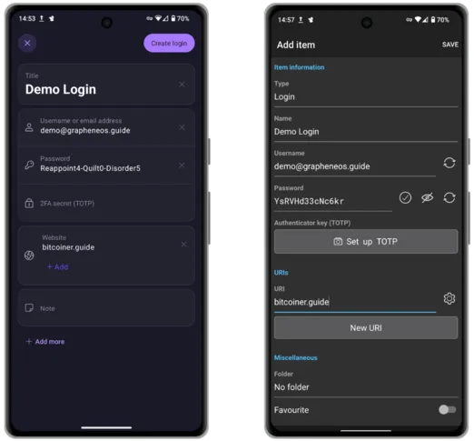

Kushoto: Proton Pass, Kulia: Bitwarden

### Ufumbuzi wa Wingu

- [Proton Drive](https://proton.me/drive/download) ni suluhisho la wingu la E2EE linalolipwa kwa kuhifadhi nakala na kuhifadhi faili zako zote. Wakati wa kuandika, wametangaza tu mteja wa eneo-kazi la Windows, lakini watumiaji wa Mac na Linux lazima waendelee kutumia toleo la wavuti kusawazisha kutoka kwa kompyuta zao (kwa sasa). Kiteja cha Android kinapatikana kama APK au kupitia Aurora.
- [Skiff](https://skiff.com/download) pia hutoa hifadhi ya wingu ya E2EE inayolipishwa na zana za kushirikiana za faili. Wanatoa mteja wa eneo-kazi la Mac na Windows (pamoja na programu ya wavuti) na wateja wao wa Android lazima wapakuliwe kutoka Aurora.
- [Nextcloud](https://f-droid.org/en/packages/com.nextcloud.client/) inatoa suluhu inayoangaziwa kikamilifu inayotegemea wingu kwa ajili ya ushirikiano, usawazishaji wa vifaa mbalimbali na kuhifadhi faili. Watumiaji mahiri zaidi wanaweza kuchagua kupangisha programu yao ya Bila Malipo na Open Source kwenye maunzi yoyote wanayopenda. Wateja wa Android wanaweza kupakuliwa kupitia F-Droid.
- [Cryptpad](https://cryptpad.fr/) inatoa mbadala wa Hati za Google bila malipo, msingi wa wavuti, E2EE.

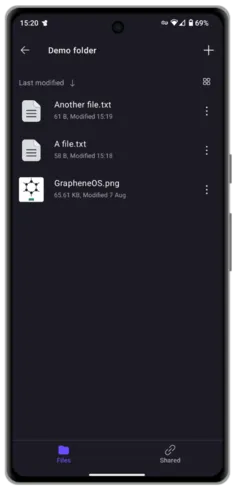

Hifadhi ya Protoni

## Mapungufu

Chanzo Huria na njia mbadala zinazolinda faragha kwa programu za mikutano ya kiteknolojia ambazo umezoea kutumia ni nyingi, na baadhi yao mara nyingi ni bora kuliko chanzo funge, mbadala zinazotumiwa na spyware.

Hata hivyo, unapohamia GrapheneOS, kuna starehe za kiumbe ambazo lazima uache kwa sababu hakuna mbadala. Hizi ni pamoja na:

- Apple CarPlay/Android Auto** - Utahitaji kushikamana na Bluetooth ya mtindo wa zamani, USB au Aux.
- Apple/Google Pay** - Kila mtu hubeba Wallet yake hata hivyo!
- Programu za benki** - Sio kwamba hizi hazifanyi kazi hata kidogo. Wengine hufanya, kwa kweli kabisa. Wengine hufanya kazi tu na Huduma za Google Play zimewezeshwa (soma zaidi juu ya hiyo hapa chini) na zingine hazifanyi kazi hata kidogo. Soma ripoti kwenye benki yako [hapa](https://privsec.dev/posts/android/banking-applications-compatibility-with-grapheneos/) ili kuona hali ya sasa ya uchezaji. Usiogope ikiwa yako iko kwenye orodha ambayo haifanyi kazi, kumbuka unaweza tu kuhifadhi URL kama programu ya wavuti kwenye skrini yako ya kwanza.
- **Arifa za Push** - Programu nyingi zinazotuma masasisho wakati hutumii programu mahususi zitafanya hivyo kupitia Huduma za Google Play. Hizi hazijasakinishwa kwa chaguo-msingi kwenye GrapheneOS, hivyo basi ukijikuta huarifiwi mara moja rafiki yako anapokutumia barua pepe, hii ndiyo sababu. Habari njema ni kwamba baadhi ya programu zilizotajwa hapo juu hutumia muunganisho wao wa usuli kuangalia mara kwa mara masasisho na kukupa arifa inapohitajika.

### Google Play ya Sandboxed

**Tafadhali kumbuka kuwa:** GrapheneOS ina uoanifu wa Layer inayotoa chaguo la kusakinisha na kutumia matoleo rasmi ya Google Play katika sandbox ya kawaida ya programu. Google Play haipokei kabisa ufikiaji maalum au marupurupu kwenye GrapheneOS badala ya kukwepa sanduku la majaribio la programu na kupokea kiasi kikubwa cha ufikiaji uliobahatika zaidi.

Ukipata huwezi kuishi bila arifa hizo za programu unayoipenda au programu fulani ya 'lazima uwe nayo' haina maana bila Huduma za Google Play, GrapheneOS hukuruhusu [kusakinisha](https://grapheneos.org/usage#sandboxed-google-play-installation) Huduma hizi hufanya kazi katika mazingira yaliyowekwa kwenye sandbox kabisa. Baada ya kusakinishwa, huduma hizi hazihitaji akaunti ya Google kufanya kazi, na ruhusa za kila moja zinaweza kudhibitiwa kwa uthabiti.

Kabla ya kuharakisha kusakinisha hizi siku ya 1, ninakusihi uone jinsi unavyoweza kuendelea bila wao. Labda utashangaa ni programu ngapi hufanya kazi kwa kawaida bila wao.

Ikiwa unataka kuzisakinisha, gusa tu programu ya 'Programu' iliyosakinishwa awali ikifuatiwa na 'Huduma za Google Play'. Zingatia kuzisakinisha pamoja na programu hizo za faragha ambazo huwezi kuishi bila, ndani ya wasifu tofauti kabisa wa mtumiaji ili kutoa Layer ya ziada ya kutenganisha kutoka kwa simu yako yote.

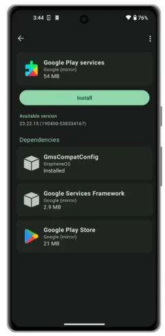

Skrini ya kusakinisha ya Huduma za Google Play

### Wasifu

GrapheneOS hukuruhusu kuwa na matumizi tofauti ya simu, ndani ya simu yako. Wasifu wa ziada unaweza kusakinisha programu na huduma zao na hauwezi kufikia faili au data yoyote kutoka kwa akaunti ya mmiliki.

Iwapo una programu moja au mbili tu kati ya hizo ambazo ni lazima uwe nazo na zinazohitaji Huduma za Google Play, lakini hutumiwa mara chache sana, kusakinisha programu hizo kando na Huduma za Google Play katika wasifu tofauti kunaweza kuwa jambo zuri kuimarisha zaidi athari zozote za faragha zilizosalia kwa kuzifanya ziendeshwe katika wasifu tofauti na wa mmiliki.

Unaweza kusoma zaidi kuhusu kesi hii ya utumiaji [hapa]( https://discuss.grapheneos.org/d/168-ideas-for-user-profiles/2).

Ukiamua kuongeza wasifu tofauti ili kuendana na hali yako ya utumiaji, programu [Insular](https://f-droid.org/en/packages/com.oasisfeng.island.fdroid/) inaweza kuwa na manufaa kwako. Insular hukuruhusu kuiga kwa urahisi programu zako zozote zilizopo kwenye wasifu mpya bila hitaji la kupitia njia zozote za jadi za usakinishaji zilizotolewa mapema katika mwongozo huu. Insular pia hukuruhusu 'kufungia' kwa haraka programu yoyote kati ya hizo ili kuzima kabisa huduma zote za usuli za programu hiyo zisifanye kazi.

Skrini ya usimamizi wa wasifu wa mtumiaji

### e-Sims

Iwapo ungependa kupeleka ufaragha wa simu yako kwenye kiwango kinachofuata na kuwa na huduma ya simu ambayo imetengwa na utambulisho wako wa ulimwengu halisi, eSIM inaweza kuwa kwa ajili yako. ESIM ni SIM address ambayo unaweza kununua mtandaoni na kuongeza kwenye simu yako kupitia msimbo wa QR. Kampuni zinazotoa huduma kama hizo ambazo zinaweza kulipiwa bila kujulikana kwa kutumia Bitcoin ni pamoja na [Silent.Link](https://silent.link/) na [Bitrefill](https://www.bitrefill.com/gb/en/esms/).

eSIM hazipaswi kuangaliwa kama tiba kamili ya faragha ya simu. Zinaweza kuwa zana muhimu zikiwa katika mikono ya kulia, lakini tafadhali fanya utafiti wako kuhusu [tradeoffs](https://grapheneos.org/faq#cellular-tracking) ya kutumia aina yoyote ya huduma ya seli ikiwa unakusudia 'kutoka nje ya gridi ya taifa' kabisa.

Huduma za Google Play za Sandbox lazima zisakinishwe kwa utoaji wa eSIM katika GrapheneOS.

## Hifadhi rudufu

Baada ya kupata usanidi mpya wa simu yako ya Pixel isiyokuwa ya Google, ni vyema ujiundie nakala rudufu. Nakala hii itakuwezesha kurejesha simu katika hali ileile endapo utaipoteza au simu yako itaibiwa.

Unaweza kuchagua kuhifadhi faili ya chelezo kwenye media yoyote ya uhifadhi wa nje, au kwa suluhisho la wingu linalojiendesha kama Nextcloud, ingawa watumiaji wengine huripoti viwango tofauti vya mafanikio na chaguo la mwisho.

Ili kuunda nakala yako ya kwanza:

1. Nenda kwa **Mipangilio** > **Mfumo** > **Hifadhi nakala**, kisha uandike msimbo wako wa urejeshaji wa maneno 12. Nambari hii inahitajika ili kusimbua faili mbadala baadaye. Futa msimbo, poteza ufikiaji wa nakala rudufu ya simu yako.

2. Kisha chagua eneo lako la kuhifadhi. Ningependekeza hifadhi ya nje ya USB au kadi ya microSD ya daraja la viwanda.

3. Chagua data ya kuhifadhi nakala. Ikiwa unayo nafasi kwenye njia yako maalum ya kuhifadhi, ningeshauri kuchagua kila kitu.

4. Gusa vitone vitatu kwenye sehemu ya juu kulia, na uchague **Hifadhi nakala sasa**.

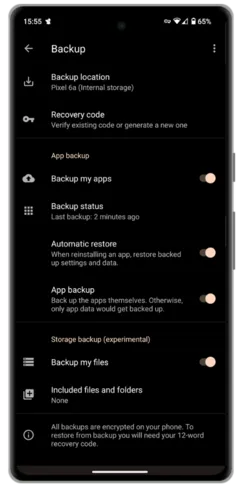

Cheleza skrini

Kumbuka kwamba ikiwa unahifadhi nakala nje ya mtandao kwenye hifadhi ya nje, ni jambo la busara kukamilisha hatua hii mara kwa mara ili kuhakikisha kuwa masasisho yoyote muhimu ya hivi karibuni kwenye simu yako hayapotei iwapo mabaya zaidi yatatokea.

Video inayoelezea mchakato wa chelezo

## Hitimisho

Katika miaka ya hivi karibuni, programu ya GrapheneOS imepevuka sana. Ni thabiti zaidi na inaendana kuliko hapo awali. Kuunganisha haya na mfumo unaostawi wa Chanzo Huria na uhifadhi wa faragha wa programu hufanya GrapheneOS kuwa njia mbadala inayofaa kwa hifadhi ya Android au iOS — hata kwa watu ‘wa kawaida’ kama wewe!

Ukiukaji wa data na ufuatiliaji wa wavu ni jambo la kawaida sana katika ulimwengu wa leo hivi kwamba haviingii tena kwenye vichwa vya habari. Ni juu yako kujilinda. Kutakuwa na marekebisho na dhabihu za kufanya njiani, lakini kupunguza mfiduo wako kwa ukiukaji kama huo si jambo gumu kama unavyofikiria.

Natumai mwongozo huu utakusaidia kwa njia fulani katika safari yako. Iwapo umepata mwongozo huu kuwa muhimu na ungependa kuunga mkono kazi yangu, tafadhali zingatia kutuma [mchango](/vidokezo).

Ikiwa wewe ni mtumiaji aliyepo wa GrapheneOS, au uwe mtumiaji mmoja kutokana na mwongozo huu, zingatia [kuchangia](https://grapheneos.org/donate) ili kusaidia kazi yao muhimu.

### Jifunze zaidi

GrapheneOS ni shimo la sungura mtu yeyote anaweza kutumia kwa urahisi wiki kwenda chini. Kuna mengi tu unayoweza kujifunza na kufikiria ili kurekebisha uzoefu kulingana na mahitaji yako na mifano ya vitisho. Vifuatavyo ni baadhi ya viungo ambavyo unaweza kuendelea na safari yako:

- [Mwongozo Rasmi wa Matumizi ya GrapheneOS](https://grapheneos.org/usage) - Tovuti Rasmi
- [Mjadala wa GrapheneOS](https://discuss.grapheneos.org/) - Tovuti Rasmi
- [GrapheneOS Settings Masterclass](https://www.youtube.com/watch?app=desktop&v=GLJyD9MJgIQ) - Video ya 'The Privacy Wayfinder'
- [GrapheneOS General Podcast](https://www.youtube.com/watch?app=desktop&v=UCPX0mFFRNA) - Podcast na 'Faragha ya Mlinzi'

mkopo kamili kwa: https://github.com/BitcoinQnA/Bitcoiner.Guide/blob/main/grapheneos.md
