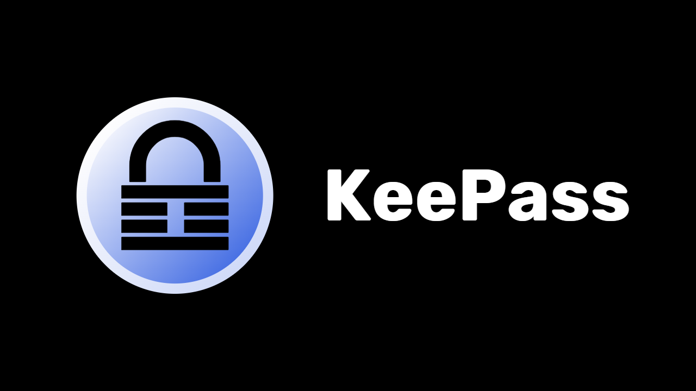
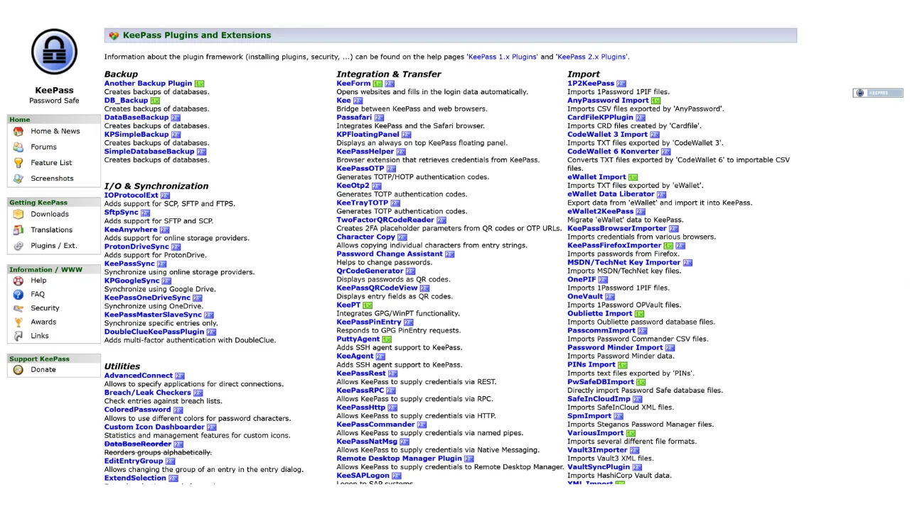
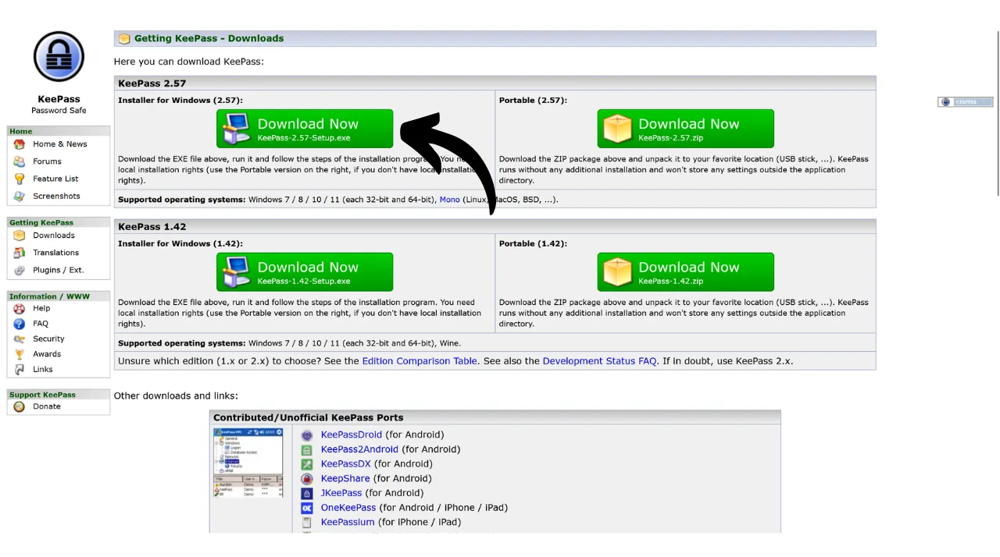
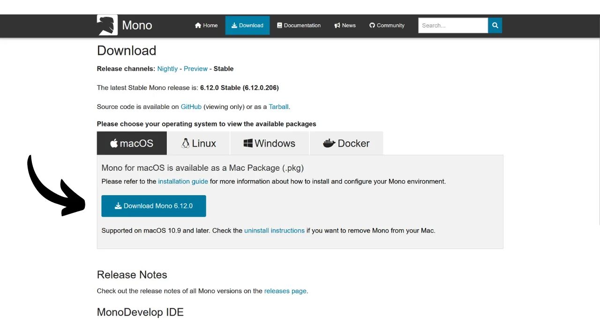
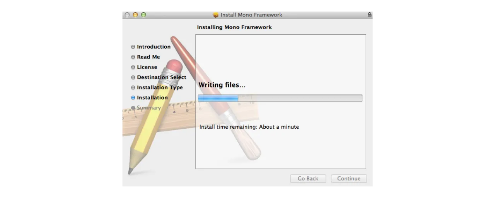
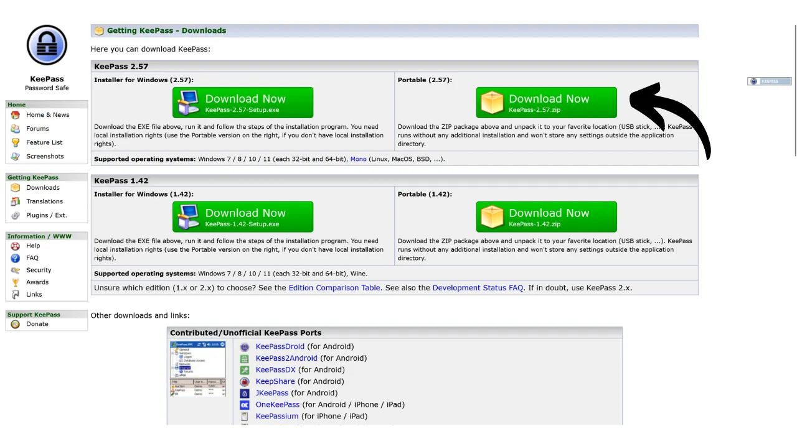

Katika enzi ya kidijitali, tunahitaji kudhibiti wingi wa akaunti za mtandaoni zinazoshughulikia vipengele mbalimbali vya maisha yetu ya kila siku, ikiwa ni pamoja na benki, mifumo ya fedha, barua pepe, kuhifadhi faili, afya, utawala, mitandao ya kijamii, michezo ya video, n.k.

Ili kujithibitisha kwenye kila moja ya akaunti hizi, tunatumia kitambulisho — mara nyingi barua pepe — kinachoambatana na nenosiri. Kwa kukabiliwa na ugumu wa kukariri idadi kubwa ya manenosiri ya kipekee, mtu anaweza kujaribiwa kutumia tena nenosiri lile lile au kurekebisha kidogo msingi wa kawaida ili iwe rahisi kukumbuka. Hata hivyo, vitendo hivi vinahatarisha usalama wa akaunti zako.

Kanuni ya kwanza ya usalama wa nenosiri ni kutotumia tena nenosiri. Kila akaunti ya mtandaoni inapaswa kulindwa na nenosiri la kipekee na tofauti kabisa. Hili ni muhimu kwa sababu, ikiwa mvamizi ataweza kuathiri nenosiri moja, hutaki apate ufikiaji wa akaunti zako zote. Kuwa na nenosiri la kipekee kwa kila akaunti hutenganisha mashambulio yanayoweza kutokea na kupunguza athari zake. Kwa mfano, ikiwa unatumia nenosiri lile lile kwa jukwaa la mchezo wa video na barua pepe yako, na nenosiri hilo likaibiwa kupitia tovuti ya hadaa inayohusiana na jukwaa hilo, mshambuliaji anaweza kufikia barua pepe yako kwa urahisi na kudhibiti akaunti zako zote za mtandaoni.

Kanuni ya pili muhimu ni uimara wa nenosiri. Nenosiri linachukuliwa kuwa thabiti ikiwa ni gumu kubahatisha kwa kutumia mbinu ya "brute force", yaani, kubahatisha kupitia majaribio mengi. Hii ina maana kwamba manenosiri yako lazima yawe ya nasibu, marefu, na yajumuishe mchanganyiko wa herufi ndogo, kubwa, nambari na alama.

Kutumia kanuni hizi mbili za usalama wa nenosiri — upekee na uimara — kunaweza kuwa changamoto katika maisha ya kila siku, kwani ni vigumu sana kukariri nenosiri la kipekee, la nasibu na dhabiti kwa akaunti zetu zote. Hapa ndipo kidhibiti cha nenosiri kinapokuja kuwa msaada.

Kidhibiti cha nenosiri hutengeneza na kuhifadhi kwa usalama manenosiri thabiti, huku kikikuruhusu kufikia akaunti zako zote mtandaoni bila hitaji la kuzikariri. Unahitaji tu kukumbuka nenosiri moja — nenosiri kuu — linalokupa ufikiaji wa nywila zako zote zilizohifadhiwa kwenye kidhibiti. Kutumia kidhibiti cha nenosiri huimarisha usalama wako mtandaoni kwa kuzuia utumiaji wa manenosiri yale yale na kutengeneza manenosiri ya nasibu. Pia hurahisisha matumizi yako ya kila siku kwa kuwezesha ufikiaji wa taarifa zako nyeti kwa urahisi.

Katika somo hili, tutajifunza jinsi ya kusanidi na kutumia kidhibiti cha nenosiri cha ndani ili kuimarisha usalama wako mtandaoni. Hapa, nitakutambulisha kwa **KeePass**. Hata hivyo, ikiwa wewe ni mwanzilishi na ungependa kuwa na kidhibiti cha nenosiri mtandaoni chenye uwezo wa kusawazisha kwenye vifaa vingi, ninapendekeza ufuate mafunzo yetu kuhusu **Bitwarden**:

https://planb.network/tutorials/computer-security/authentication/bitwarden-0532f569-fb00-4fad-acba-2fcb1bf05de9

---

*Tahadhari: Kidhibiti cha nenosiri kinafaa kwa kuhifadhi manenosiri, lakini **hupaswi kamwe kuhifadhi maneno ya Bitcoin ya wallet ya mnemonic ndani yake!** Kumbuka, kishazi cha mnemonic kinapaswa kuhifadhiwa kwa njia ya kipekee, kama vile kwenye kipande cha karatasi au chuma.*

---

## Utangulizi wa KeePass

**KeePass** ni kidhibiti cha nenosiri kisicholipishwa na cha chanzo huria, kinachofaa kabisa kwa wale wanaotaka suluhisho lisilolipishwa na salama kwa usimamizi wa ndani. Ni programu ya kusakinishwa kwenye kompyuta yako ambayo, bila nyongeza ya programu-jalizi, haiwasiliani na mtandao. Hii ni mbinu tofauti kabisa na ile ya **Bitwarden**, ambayo tuliangazia katika somo lililopita. **Bitwarden**, tofauti na **KeePass**, inaruhusu ulandanishi kwenye vifaa vingi na hivyo huhifadhi manenosiri yako kwenye seva ya mtandaoni.

Kwa chaguo-msingi, **KeePass** haiauni matumizi ya viendelezi vya kivinjari kama vile **Bitwarden**; kwa hivyo, utahitaji kunakili mwenyewe na kubandika manenosiri yako kutoka kwa programu. Ingawa hii inaweza kuonekana kama kikwazo, kunakili na kubandika badala ya kujaza kiotomatiki ni njia salama zaidi ya kutumia manenosiri yako.

**KeePass** imeundwa kuwa nyepesi na rahisi kutumia, huku ikizingatia viwango vya juu vya usalama. Programu husimba hifadhidata yako kwa njia fiche ndani ya nchi kwa ulinzi bora wa kitambulisho chako. **KeePass** pia ndicho kidhibiti pekee cha nenosiri kilichoidhinishwa na **ANSSI** (mamlaka ya usalama wa mtandao ya Ufaransa).

Moja ya faida kuu za **KeePass** ni kubadilika kwake. Inaweza kutumika kwa njia nyingi tofauti, kama vile kwenye kijiti cha USB bila hitaji la usakinishaji kwenye kompyuta. Zaidi ya hayo, kutokana na [mazingira ya programu-jalizi](https://keepass.info/plugins.html), **KeePass** inaweza kubinafsishwa ili kukidhi mahitaji mahususi zaidi.



## Jinsi ya kupakua KeePass?

Mchakato wa usakinishaji wa **KeePass** unatofautiana kulingana na mfumo wa uendeshaji unaotumia. Kwa watumiaji wa Windows au Linux, usakinishaji ni wa moja kwa moja. Hata hivyo, ikiwa uko kwenye macOS, hatua ya ziada ni muhimu kutokana na maendeleo ya **KeePass** kwenye jukwaa la **.NET**, ambalo halijaungwa mkono moja kwa moja na macOS. Kwa hivyo, utahitaji kusanidi mazingira yanayotangamana ili kuruhusu **KeePass** kufanya kazi kwenye vifaa vya Apple.

Kwa watumiaji wa Debian/Ubuntu, fungua terminal na uweke amri zifuatazo:

```bash
sudo apt update
sudo apt-get install keepass2
```

Kwa Fedora:

```bash
sudo dnf install keepass
```

Kwa Arch Linux:

```bash
sudo pacman -S keepass
```

Ikiwa unatumia kompyuta ya Windows, nenda kwenye [ukurasa rasmi wa upakuaji wa KeePass](https://keepass.info/download.html), na upakue toleo jipya zaidi la kisakinishi:


Bonyeza faili ulilopakua ili kuanza usakinishaji, kisha fuata maagizo ya "setup wizard" hadi kukamilisha usakinishaji (tazama sehemu inayofuata).

Kwa watumiaji wa macOS, usakinishaji ni mgumu kidogo. Ikiwa unataka kutumia toleo la asili la **KeePass** kama kwenye Windows, fuata maagizo yaliyo hapa chini. Vinginevyo, unaweza kutumia [KeePassXC](https://keepassxc.org/), toleo mbadala linalooana na macOS, lenye muonekano tofauti kidogo.

Ili kutumia **KeePass**, utahitaji mazingira ya kukimbiza programu za **.NET**. Ninapendekeza usakinishe **Mono** kwa hili. Nenda kwenye [tovuti rasmi ya Mono](https://www.mono-project.com/download/stable/#download-mac) katika sehemu ya "*macOS*", na bonyeza kiungo cha kupakua kifurushi cha usakinishaji (`.pkg`).


Fungua faili la `.pkg` ulilopakua na fuata maagizo ya kusakinisha **Mono** kwenye Mac yako.


Kisha, nenda kwenye tovuti rasmi ya **KeePass** na upakue toleo jipya zaidi la portable katika umbizo la `.zip`.


Baada ya kupakua faili la `.zip`, bonyeza mara mbili ili kulifungua. Utapata folda yenye faili kadhaa, ikiwemo `KeePass.exe`. Fungua terminal, na uelekee kwenye folda ya **KeePass** (badilisha `xx` kwa namba ya toleo):

```bash
cd ~/Downloads/KeePass-2.xx
```

Kisha, endesha **KeePass** kwa kutumia **Mono**:

```bash
mono KeePass.exe


```
