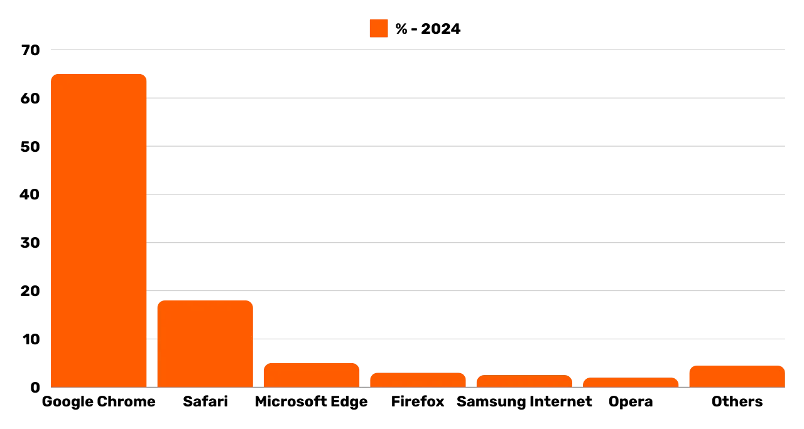
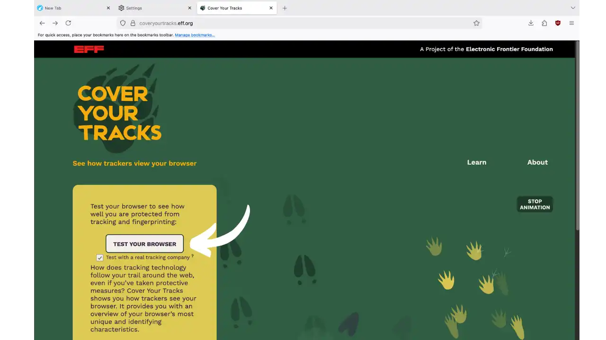
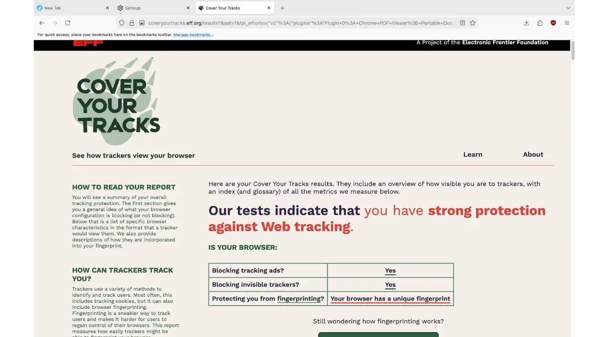
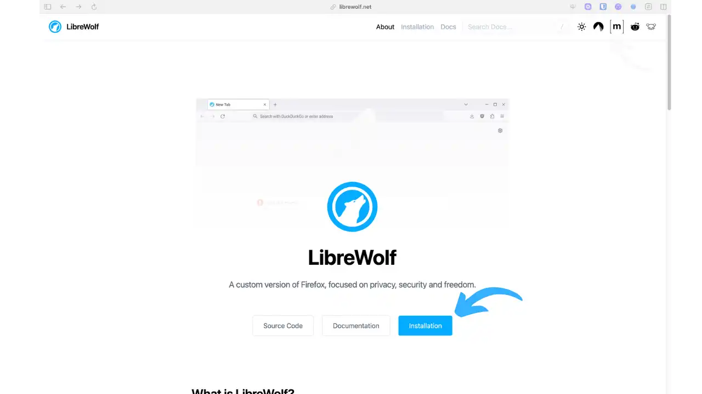
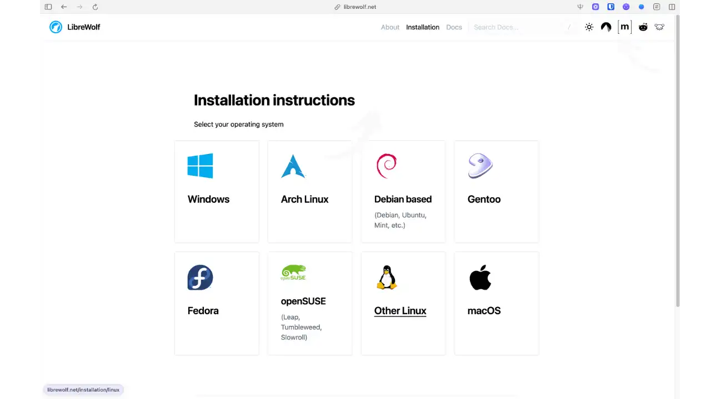
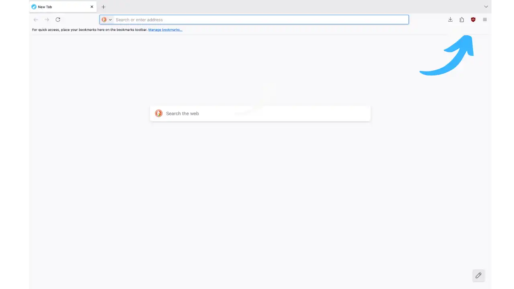
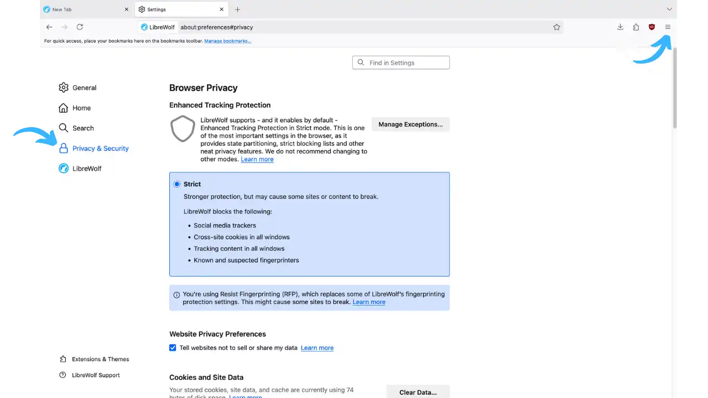
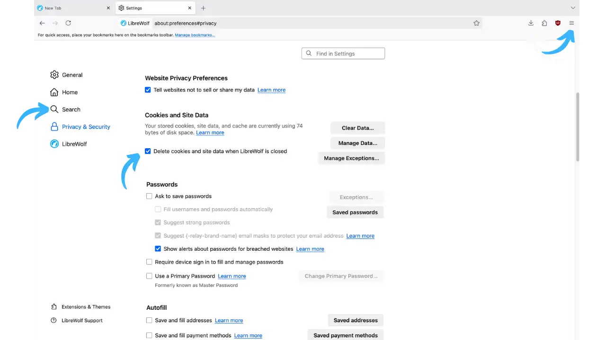

Setiap klik, setiap pencarian, setiap situs yang dikunjungi: browser web Anda telah menjadi mata-mata canggih yang memasok sistem pengawasan komersial global. Google Chrome, yang digunakan oleh lebih dari 3 miliar orang, mengubah penjelajahan harian Anda menjadi data yang menguntungkan bagi raksasa periklanan. Bahkan Firefox, meskipun reputasinya sebagai browser yang "etis", secara default mengaktifkan mekanisme telemetri yang mengirimkan kebiasaan penjelajahan Anda ke Mozilla.

Kenyataan ini memunculkan pertanyaan penting: apakah masih mungkin untuk menjelajah secara bebas di Internet tanpa terus-menerus dimata-matai dan diprofil? Untungnya, jawabannya adalah ya, berkat proyek komunitas yang menempatkan pengguna kembali sebagai pusat perhatian mereka.

LibreWolf mewujudkan filosofi perlawanan digital ini. Sebagai gagasan dari komunitas pengembang independen, browser ini mengubah Firefox menjadi perisai sejati terhadap pengawasan online. Ketika browser komersial berupaya memonetisasi perhatian Anda, LibreWolf melakukan sebaliknya: membuat Anda tidak terlihat oleh pelacak sambil mempertahankan pengalaman menjelajah yang lancar dan modern.

Dalam tutorial ini, kita akan menemukan bagaimana LibreWolf dapat mengubah cara Anda berselancar di web, menawarkan perlindungan kuat terhadap pelacakan tanpa mengorbankan kinerja atau kompatibilitas web.



*Pangsa pasar browser web: Chrome mendominasi dengan 65% pasar, diikuti oleh Safari dan Edge. Dominasi ini menimbulkan pertanyaan tentang keragaman web dan privasi*

## Memperkenalkan LibreWolf

**LibreWolf** adalah browser web open source turunan dari Mozilla Firefox, yang dikembangkan dan dikelola oleh komunitas independen penggemar free software. Tujuan utamanya adalah untuk menawarkan penjelajahan yang berfokus pada privasi, keamanan, dan kebebasan pengguna.

Secara nyata, LibreWolf menggunakan engine Gecko milik Firefox, tetapi dengan filosofi yang sangat berbeda: di mana Firefox harus menyeimbangkan privasi dan kemudahan penggunaan, LibreWolf memilih privasi sebagai prioritas default. Proyek ini menghilangkan apa pun yang dapat melanggar privasi Anda (telemetri, pengumpulan data, modul yang disponsori) sambil mengintegrasikan pengaturan keamanan yang ditingkatkan.

### Tujuan: privasi dan kebebasan

LibreWolf bertujuan untuk memaksimalkan perlindungan terhadap pelacakan dan fingerprinting sambil meningkatkan keamanan browser. Tujuan utamanya meliputi:

- **Menghilangkan semua telemetri dan pengumpulan data** di Firefox.
- **Menonaktifkan fungsi-fungsi yang bertentangan dengan kebebasan pengguna**, seperti modul DRM berpemilik.
- **Menerapkan pengaturan privasi/keamanan** dan patch spesifik sejak awal.
- **Pengembangan komunitas menjamin transparansi dan kemandirian** dari kepentingan komersial.

Singkatnya, LibreWolf menampilkan dirinya sebagai "Firefox sebagaimana mestinya jika privasi adalah prioritas utama" - sebuah browser yang menghormati Anda secara default, tanpa memerlukan konfigurasi tambahan.

### Fitur utama

Sejak awal, LibreWolf menawarkan serangkaian fitur berorientasi privasi:

- **Tanpa telemetri atau pengumpulan data**: Tidak seperti Chrome atau Firefox yang mengirimkan statistik penggunaan tertentu, LibreWolf sama sekali tidak mengumpulkan apa pun dari penjelajahan Anda. Tidak ada laporan crash, tidak ada studi pengguna, dan tidak ada saran bersponsor.

- **Integrasi uBlock Origin**: LibreWolf secara bawaan mengintegrasikan ekstensi uBlock Origin, salah satu pemblokir iklan dan pelacak terbaik di pasaran. Secara default, LibreWolf secara agresif menyaring apa pun yang mungkin melacak Anda secara daring (iklan mengganggu, skrip pelacak, cryptocurrency mining).

- **Mesin pencari pribadi secara defaul**t: LibreWolf menggunakan DuckDuckGo sebagai mesin pencari awalnya secara default, yang tidak menyimpan riwayat permintaan Anda. Alternatif lain yang berorientasi pada privasi (Searx, Qwant, Whoogle) juga tersedia.

- **Perlindungan anti-fingerprint yang diperkuat**: Fingerprinting memungkinkan sebuah browser untuk diidentifikasi secara unik melalui konfigurasinya, bahkan tanpa cookie. Untuk mengatasinya, LibreWolf mengaktifkan teknologi RFP (_Resist Fingerprinting_) dari proyek Tor, untuk membuat browser Anda sesederhana mungkin. Pengujian menunjukkan bahwa Firefox standar memiliki keunikan sekitar ~90% pada aplikasi seperti coveryourtracks.eff.org, dibandingkan dengan hanya ~10-20% untuk LibreWolf (angka-angka ini bersifat indikatif dan dapat bervariasi sesuai dengan konfigurasi perangkat lunak dan perangkat keras serta ekstensi yang dipasang).



*Halaman uji EFF [Cover Your Tracks](https://coveryourtracks.eff.org/) dengan tombol TEST YOUR BROWSER. Halaman ini digunakan untuk mengevaluasi perlindungan terhadap pelacak dan fingerprinting*



*Hasil tes Cover Your Tracks. Pesan "Anda memiliki perlindungan yang kuat terhadap pelacakan Web" ditampilkan, menunjukkan keefektifan perlindungan LibreWolf.*

**LibreWolf** secara default mengaktifkan pengaturan keamanan ketat. Enhanced Tracking Protection Firefox didorong ke tingkat Strict untuk memblokir ribuan pelacak, cookies pihak ketiga, dan konten berbahaya. LibreWolf juga mengaktifkan isolasi situs dan cookies (_Total Cookie Protection_) untuk mempartisi data setiap domain, serta membatasi WebRTC (membatasi _ICE candidates_ dan perutean melalui proxy jika ada proxy) untuk mengurangi risiko kebocoran alamat IP.

**Pembaruan Engine yang Cepat** : Proyek ini mengikuti perkembangan Firefox dengan sangat cermat: LibreWolf selalu didasarkan pada versi stabil Firefox terbaru, dan para pengelola berusaha merilis versi baru dalam 24 hingga 72 jam setelah setiap rilis resmi Firefox.

## Keuntungan dan kerugian

### Manfaat

- **Tanpa telemetri atau koneksi yang tidak diinginka**n: LibreWolf tidak mengirimkan data penggunaan apa pun, menjamin penghormatan total terhadap privasi Anda.
- **Open-source dan berbasis komunitas**: Proyek ini 100% open-source dan dikelola oleh sukarelawan. Kemandirian ini menjamin bahwa tidak ada model periklanan yang akan memengaruhi pengembangannya.
- **Telah dikonfigurasi untuk privasi**: LibreWolf menghemat waktu berharga Anda: tidak perlu menghabiskan waktu berjam-jam untuk memperkuat pengaturan Firefox, semuanya sudah selesai.
- **Pemblokir iklan/pelacak bawaan**: uBlock Origin terintegrasi sebagai standar, sehingga Anda tidak perlu melakukan apa pun untuk melindungi diri dari iklan dan bug.
- **Perlindungan anti-fingerprinting yang sangat baik**: Berkat RFP dan berbagai pengaturan privasi, LibreWolf secara drastis mengurangi jejak digital unik Anda di web.
- **Kinerja yang lebih baik dan ringan**: Dengan menghapus telemetri dan fitur-fitur tertentu yang tidak penting, LibreWolf bisa sedikit lebih cepat dan tidak terlalu boros daya daripada Firefox standar.

### Kekurangan dan keterbatasan

- **Tidak ada pembaruan otomatis bawaan**: LibreWolf tidak memperbarui dirinya sendiri. Terserah Anda untuk memasang versi baru segera setelah dirilis, agar tetap aman.
- **Kompatibilitas yang berkurang dengan layanan tertentu**: Karena pengaturannya yang sangat ketat, LibreWolf mungkin mengalami masalah pada situs web tertentu. Platform streaming Netflix dan Disney+ tidak akan berfungsi, karena LibreWolf menonaktifkan Widevine DRM secara default.
- **Tidak ada jaringan anonim bawaan**: Tidak seperti Tor Browser, LibreWolf tidak merutekan lalu lintas melalui Tor atau VPN dengan sendirinya. Jika Anda membutuhkan anonimitas jaringan, Anda harus mengonfigurasi proxy/VPN secara manual.
- **Cookies dan sesi yang tidak persisten (default)**: Untuk alasan kerahasiaan, LibreWolf menghapus cookies, riwayat, dan data situs setiap kali Anda menutup browser. Anda harus masuk ke akun Anda lagi setiap kali masuk.
- **Tidak ada versi seluler atau sinkronisasi cloud**: LibreWolf hanya tersedia di desktop (Windows, Linux, macOS). Tidak ada aplikasi seluler, dan oleh karena itu tidak ada sinkronisasi akun atau penanda buku melalui cloud.

## Menginstal LibreWolf

**Situs web resmi:** [librewolf.net](https://librewolf.net)

LibreWolf tersedia untuk semua sistem operasi desktop utama: Linux, Windows dan macOS. Untuk mengunduh LibreWolf, kunjungi situs web resminya:



*Halaman beranda LibreWolf (librewolf.net) menunjukkan logo browser, tombol Instal berwarna biru, dan tautan Source Code dan Dokumentasi. Panah biru besar menunjuk ke tombol Instal*

Klik tombol "Installation" untuk mengakses petunjuk terperinci untuk sistem operasi Anda:



*Halaman pemilihan sistem operasi untuk mengunduh LibreWolf.*

Pemasangannya berbeda-beda, tergantung pada OS Anda:

### Pada Linux

LibreWolf menawarkan build untuk banyak distribusi. Pada Debian/Ubuntu dan turunannya, tersedia repositori APT resmi. Sebagai alternatif, LibreWolf dipublikasikan di Flatpak di Flathub :

```
flatpak install flathub io.gitlab.librewolf-community
```

### Pada Windows

Unduh penginstal (.exe) dari situs web resmi atau gunakan ekstensi :

- **Chocolatey** : `choco instal librewolf`
- **WinGet** : `winget instal librewolf`

### Pada macOS

LibreWolf tersedia dalam bentuk paket `.dmg` untuk Mac. Unduh disk image dari situs web resminya dan seret dan letakkan aplikasi LibreWolf ke dalam folder Aplikasi Anda. Atau, Anda bisa menginstalnya melalui Homebrew.

## Konfigurasi dan penggunaan pertama

Saat pertama kali dijalankan, Anda akan melihat Firefox Interface yang sudah tidak asing lagi, hanya saja tampilannya lebih sederhana: halaman beranda hanya berisi bilah pencarian dan tidak ada saran bersponsor. Anda akan melihat ikon uBlock Origin pada bilah alat - tanda bahwa pemblokir ini aktif.



*Halaman beranda LibreWolf dengan ekstensi dan menu. Panah biru di sudut kanan atas menunjukkan ikon menu (tiga bilah horizontal)

LibreWolf secara otomatis memuat halaman Anda dalam mode "ketat" (anti-pelacakan) dan mesin pencari bawaannya adalah DuckDuckGo. Anda bisa mencoba mengunjungi situs uji pelacakan (misalnya, amiunique.org) untuk mengamati jejak digital yang terekspos, seharusnya jauh lebih umum dibandingkan dengan browser standar.

### Pengaturan privasi

LibreWolf sudah dikonfigurasi secara optimal untuk privasi. Pada Menu → Options → Privacy & Security, Anda akan melihat bahwa LibreWolf diatur kemode Enhanced Tracking Protection: Strict.

Mode ini memblokir :

- Pelacak antar situs
- Cookie pihak ketiga
- Konten pelacakan yang diketahui
- Cryptomining
- Detektor fingerprint  digital



*Halaman tab keamanan dan privasi yang menunjukkan pengaturan keamanan LibreWolf.*

WebRTC dinonaktifkan (mencegah kebocoran IP), dan Perlindungan Cookie Total tersedia. Telemetri dan survei Firefox dinonaktifkan sepenuhnya.

### Manajemen cookie dan riwayat

Secara bawaan, LibreWolf menghapus cookies dan penyimpanan lokal setiap kali ditutup. Jika perilaku ini mengganggu Anda, Anda dapat mengaturnya di Privacy & Security → Cookies dan data situs dengan menghapus centang pada "Delete cookies and site data when closing LibreWolf".



_Pada halaman yang sama, lebih ke bawah, ditampilkan opsi untuk menghapus cookies saat browser ditutup._

### Menambahkan ekstensi yang berguna


Pada prinsipnya, LibreWolf tidak menyarankan penambahan ekstensi yang tidak perlu, karena setiap ekstensi bisa menjadi vektor pelacakan. Namun demikian, beberapa ekstensi yang memiliki reputasi baik dapat meningkatkan pengalaman Anda:


- Wadah Multi-Akun Firefox** (oleh Mozilla) untuk penjelajahan terkotak-kotak
- Decentraleyes** atau **LocalCDN** untuk melayani perpustakaan umum secara lokal


Terutama hindari ekstensi "VPN gratis" atau proksi yang meragukan - uBlock Origin sudah mencakup 99% kebutuhan Anda.


## Penggunaan sehari-hari


### Penjelajahan web harian


Gunakan LibreWolf untuk aktivitas Internet Anda sehari-hari. Perbedaan utama dengan peramban lain adalah Anda meninggalkan jejak iklan yang jauh lebih sedikit. Spanduk "Terima cookie" menghilang di banyak situs, berkat daftar penyaringan uBlock.


### Gunakan tab pribadi untuk mengelompokkan


Meskipun LibreWolf menghapus semuanya di akhir sesi, membuka jendela peramban pribadi (Ctrl+Shift+P) untuk tugas-tugas tertentu selama sesi dapat berguna untuk mempartisi identitas tertentu.


### Manfaatkan wadah multi-akun


Memasang ekstensi Wadah Multi-Akun dapat sangat membantu Anda mengelompokkan aktivitas Anda ke dalam silo-silo kedap air. Sebagai contoh, Anda bisa menentukan kontainer "Perbankan" untuk situs perbankan Anda, kontainer "Jejaring Sosial" untuk Facebook/Twitter, dll. Setiap kontainer memiliki cookie, sesi, dan penyimpanan terisolasi. Setiap kontainer memiliki cookie, sesi, dan penyimpanan tersendiri.


### Manajemen izin yang disempurnakan berdasarkan situs


LibreWolf memungkinkan Anda mengontrol izin yang Anda berikan pada situs (Lokasi, Kamera, Mikrofon, Pemberitahuan) berdasarkan kasus per kasus. Berikan izin hanya ke situs yang Anda percayai dan jika diperlukan.


## Praktik terbaik dengan LibreWolf


1. **Selalu perbarui LibreWolf:** Periksa situs ini secara teratur untuk versi baru, terutama setelah rilis Firefox yang stabil.


2. **Hindari pencampuran identitas pribadi dan penjelajahan pribadi:** Idealnya, Anda tidak boleh masuk dengan akun pribadi pada sesi yang sama saat Anda melakukan penelitian yang sensitif.


3. **Jangan membebani LibreWolf dengan ekstensi yang tidak perlu:** Setiap ekstensi yang Anda pasang dapat menimbulkan risiko keamanan atau sidik jari.


4. **Sebagai tambahan, gunakan proxy VPN atau Tor:** LibreWolf tidak membuat Anda menjadi anonim bagi ISP Anda. Untuk anonimitas jaringan, Anda bisa menggunakan LibreWolf di belakang VPN tepercaya.


5. **Simpan data penting Anda:** Penanda, kata sandi jika disimpan secara lokal. Pertimbangkan pengelola kata sandi eksternal (KeePassXC, Bitwarden) daripada pengelola kata sandi dasar peramban.


## Perbandingan dengan browser lain


LibreWolf adalah bagian dari "kotak peralatan" peramban berorientasi privasi:


**LibreWolf vs Firefox:** LibreWolf hadir dalam keadaan sudah dikeraskan dan tanpa telemetri. Firefox mempertahankan keunggulan sinkronisasi multi-perangkat dan basis pengguna yang sangat besar, tetapi membutuhkan konfigurasi manual untuk mencapai tingkat kerahasiaan LibreWolf.


**Brave menggunakan kode Chrome/Chromium dan mengintegrasikan model bisnis melalui program periklanan opsional. LibreWolf, sebagai komunitas Fork untuk Firefox, mempertahankan ekosistem bebas Mozilla dan tidak memiliki hubungan dengan Google.


**LibreWolf vs Tor Browser:** Tor Browser tak tergantikan untuk anonimitas dalam menghadapi pengawasan yang kuat, tetapi lambat dan tidak nyaman dalam penggunaan sehari-hari. LibreWolf, untuk penjelajahan sehari-hari di web klasik, jauh lebih cepat dan praktis.


**LibreWolf vs Peramban Mullvad:** Peramban Mullvad melangkah lebih jauh lagi dalam hal standarisasi, tetapi dengan mengorbankan kegunaan yang berkurang (tidak mungkin menyimpan kuki login). LibreWolf memberikan keseimbangan: sangat pribadi, tetapi dapat digunakan setiap hari.


## Kesimpulan


LibreWolf merupakan solusi yang sangat baik bagi mereka yang mencari peramban "sehari-hari" yang sangat privat tanpa harus menggunakan anonimitas ekstrim seperti Tor. Ini adalah pilihan ideal bagi para aktivis, jurnalis, pengembang, atau pengguna yang menginginkan penjelajahan web klasik (cepat, kompatibel dengan situs-situs modern) sambil menghindari pelacakan iklan dan Big Tech.


Meskipun memiliki keterbatasan tertentu (tidak ada pembaruan otomatis, kompatibilitas yang berkurang dengan layanan tertentu), LibreWolf merupakan alat yang berharga bagi siapa pun yang ingin mendapatkan kembali kendali atas privasi digital mereka. Kemudahan penggunaan dan konfigurasi standarnya menjadikannya pilihan yang bijaksana bagi pengguna yang sadar akan privasi.


## Sumber daya


### Dokumentasi resmi


- [Situs web resmi LibreWolf](https://librewolf.net)
- [Kode sumber di Codeberg](https://codeberg.org/librewolf)
- [Pertanyaan Umum Resmi](https://librewolf.net/docs/faq)


### Panduan dan perbandingan


- [Panduan Privasi](https://www.privacyguides.org/en/desktop-browsers/)
- [Tes privasi komparatif](https://privacytests.org)


### Dukungan komunitas


- [Subreddit r/LibreWolf](https://www.reddit.com/r/LibreWolf/)
- [Kanal Matriks LibreWolf](https://matrix.to/#/#librewolf:matrix.org)
