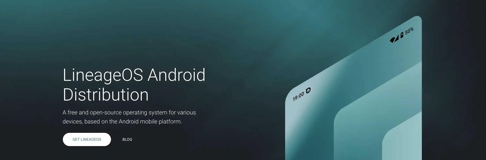

Les systèmes Android classiques préinstallés sur nos smartphones posent plusieurs problèmes bien connus : intégration intensive des services Google entraînant un suivi permanent des données, applications sponsorisées indésirables (bloatware) imposées par les constructeurs, et abandon du suivi des mises à jour après quelques années, condamnant des appareils encore fonctionnels à l'obsolescence.

LineageOS se présente comme une réponse élégante à ces problèmes. Issu de la communauté open source et successeur spirituel de l'illustre ROM CyanogenMod, LineageOS est un système d'exploitation mobile libre basé sur Android qui redonne à l'utilisateur le contrôle de son smartphone. Lancé officiellement en décembre 2016, le projet compte aujourd'hui environ 4,5 millions de dispositifs actifs dans le monde et prend en charge plus de 300 modèles de téléphones de plus de 20 marques différentes.

## Qu'est-ce que LineageOS ?

### Philosophie et objectifs

LineageOS est un système d'exploitation mobile open source basé sur l'Android Open Source Project (AOSP), développé par une vaste communauté de contributeurs bénévoles à travers le monde. Sa devise officieuse pourrait être "Votre appareil, vos règles" : le projet vise à prolonger la durée de vie des smartphones tout en offrant une expérience Android épurée et respectueuse de la vie privée.

Contrairement aux distributions Android des constructeurs, LineageOS ne préinstalle aucune application Google par défaut et élimine complètement le bloatware. L'utilisateur démarre avec un système minimaliste incluant uniquement les applications essentielles (téléphone, messages, appareil photo, navigateur) et choisit librement ce qu'il souhaite ajouter par la suite.

### Architecture technique

LineageOS reprend la base AOSP d'Android et y applique de nombreuses optimisations et fonctionnalités avancées. Le système intègre des outils de protection de la vie privée comme Privacy Guard, permettant un contrôle granulaire des permissions applicatives. L'interface utilisateur reste très proche d'Android stock avec le lanceur Trebuchet, offrant une expérience familière sans les surcouches constructeur.

Le projet maintient sa propre infrastructure de compilation et de distribution, avec des builds hebdomadaires intégrant les correctifs de sécurité Android mensuels pour tous les appareils supportés officiellement.

## Fonctionnalités principales

### Android pur sans bloatware

LineageOS propose une expérience Android authentique basée sur l'AOSP, sans aucune surcouche constructeur ni application superflue préinstallée. Cette approche garantit un système fluide, léger et performant, où chaque composant a sa raison d'être. L'interface utilisateur reprend les codes d'Android stock avec le lanceur Trebuchet, offrant un environnement familier mais épuré.

### Absence de services Google par défaut

Par défaut, LineageOS n'inclut aucun service ou application Google, pour des raisons légales et éthiques. Cette approche "Google-free" offre un gain immédiat en confidentialité et en performances, puisque aucun service ne tourne en arrière-plan pour collecter vos données. L'utilisateur peut cependant choisir d'installer les Google Apps (GApps) par la suite s'il le souhaite, via un package séparé lors de l'installation.

### Personnalisation avancée

LineageOS déverrouille de nombreuses options de personnalisation indisponibles sur Android stock : reconfiguration des boutons de navigation, ajout de tuiles personnalisées dans les raccourcis rapides, thèmes clair/sombre avec accents de couleur configurables, écran de verrouillage personnalisable, et profils système adaptés à différents contextes d'usage (travail, maison, jeu).

### Mises à jour communautaires régulières

La communauté LineageOS s'engage à fournir des mises à jour fréquentes avec des builds généralement compilées chaque semaine. Ces builds intègrent systématiquement les correctifs de sécurité Android mensuels pour tous les appareils supportés, permettant ainsi à un smartphone sorti il y a plusieurs années de continuer à recevoir les derniers patchs de sécurité.

## Appareils compatibles

LineageOS prend officiellement en charge des centaines de modèles d'appareils, couvrant plus d'une vingtaine de marques : Samsung, Xiaomi, OnePlus, Motorola, Sony, HTC, LG, Google Pixel, Fairphone, et bien d'autres. La liste complète est consultable sur le Wiki LineageOS, qui recense chaque modèle par marque et nom de code interne.

Cette large compatibilité constitue l'un des atouts majeurs du projet, mais il convient de vérifier quelques points cruciaux avant de se lancer :

**Vérification de compatibilité** : Il est essentiel de vérifier que votre modèle exact dispose d'une build officielle. Deux appareils de nom commercial similaire peuvent différer techniquement (Galaxy S10 vs S10 5G par exemple), et il est crucial de télécharger la ROM correspondant exactement à votre appareil.

**Appareils récents** : Les smartphones tout juste sortis ne sont pas forcément pris en charge immédiatement. Le portage sur un nouveau modèle nécessite qu'un développeur bénévole s'en occupe, ce qui peut prendre plusieurs mois après la sortie officielle.

**Déverrouillage du bootloader** : L'installation requiert impérativement le déverrouillage du bootloader du téléphone. Cette possibilité varie selon les fabricants et opérateurs : certaines marques l'autorisent via une procédure officielle, d'autres imposent des restrictions, et certains opérateurs vendent des variantes dont le bootloader est définitivement verrouillé.

## Installation

### Prérequis essentiels

Avant de commencer l'installation de LineageOS, plusieurs conditions doivent être réunies pour garantir un processus fluide et sécurisé.

**Sauvegarde complète** : Le déverrouillage du bootloader effacera intégralement la mémoire interne de votre téléphone. Sauvegardez impérativement vos photos, contacts, applications et fichiers importants via des solutions cloud ou locales selon vos préférences.

**Bootloader déverrouillé** : Votre appareil doit avoir le bootloader OEM déverrouillé pour autoriser l'installation d'un système personnalisé. Suivez la procédure officielle propre à votre modèle, qui peut nécessiter l'obtention d'un code de déverrouillage auprès du constructeur.

**Outils ADB et Fastboot** : L'installation correcte des Android SDK Platform Tools est cruciale pour la réussite du processus. Ces utilitaires fournis par Google sont indispensables pour communiquer avec votre appareil depuis l'ordinateur.

**Installation détaillée par système d'exploitation :**

*Windows* :
- Téléchargez le fichier "Windows zip" depuis [developer.android.com/studio/releases/platform-tools](https://developer.android.com/studio/releases/platform-tools)
- Extrayez dans un dossier comme `C:\Users\[nom]\adb-fastboot`
- Ajoutez le chemin à vos variables d'environnement système (PATH)
- Téléchargez et installez les pilotes USB Android depuis le site développeur Android

*macOS* :
- Installez Homebrew si ce n'est pas déjà fait : `/bin/bash -c "$(curl -fsSL https://raw.githubusercontent.com/Homebrew/install/HEAD/install.sh)"`
- Ajoutez `/opt/homebrew/bin` à votre PATH
- Installez via Homebrew : `brew install --cask android-platform-tools`

*Linux* :
- Téléchargez le fichier "Linux zip" depuis le site officiel Android
- Extrayez dans un dossier comme `~/adb-fastboot`
- Ajoutez le chemin à votre PATH dans `~/.profile`
- Configurez optionnellement les règles udev pour les permissions USB

**Vérification d'installation** : Ouvrez un terminal/invite de commande et tapez `adb version` et `fastboot --version` pour confirmer l'installation.

**Configuration d'ADB sur l'appareil** (étape critique souvent oubliée) :

1. **Activation des options développeur** :
   - Ouvrez **Paramètres** > **À propos du téléphone**
   - Tapez **7 fois** sur "Numéro de build"
   - Un message confirme l'activation du mode développeur

2. **Activation du débogage USB** :
   - Retournez dans **Paramètres** > **Options pour les développeurs**
   - Activez **"Débogage Android"** ou **"Débogage USB"**

3. **Test de connexion** :
   - Connectez votre appareil à l'ordinateur via USB
   - Dans le terminal/invite de commande, tapez : `adb devices`
   - **Important** : Une boîte de dialogue apparaît sur votre téléphone demandant l'autorisation
   - Cochez **"Toujours autoriser depuis cet ordinateur"** et validez **"OK"**

4. **Dépannage** :
   - Si aucune boîte de dialogue n'apparaît ou la liste est vide, vérifiez l'installation d'ADB
   - **Windows** : Vérifiez dans le Gestionnaire de périphériques que votre téléphone apparaît sans triangle jaune
   - **Succès** : `adb devices` doit afficher votre appareil avec son numéro de série

Cette configuration ADB est indispensable avant toute manipulation en mode bootloader.

### Installation détaillée

L'installation de LineageOS suit un schéma général identique pour la plupart des appareils. Voici la procédure complète illustrée avec l'exemple du Google Pixel 4 (nom de code "flame") :

**1. Vérification du firmware** : Assurez-vous que votre appareil dispose du firmware Android approprié. Pour le Pixel 4, Android 13 est requis avant l'installation de LineageOS. Cette vérification évite les incompatibilités qui pourraient rendre l'appareil inutilisable.

**2. Déverrouillage du bootloader** :
- Activez l'option "Déverrouillage OEM" dans les options développeur
- Redémarrez en mode bootloader : `adb -d reboot bootloader`
- Vérifiez la connexion : `fastboot devices`
- Déverrouillez : `fastboot flashing unlock`
- Redémarrez et réactivez le débogage USB

**3. Flash des partitions additionnelles** : Certains appareils comme le Pixel 4 nécessitent le flash de partitions spécifiques. Téléchargez le fichier `dtbo.img` depuis la page officielle LineageOS de votre appareil et flashez-le : `fastboot flash dtbo dtbo.img`.

**4. Installation du recovery LineageOS** : Téléchargez le fichier `boot.img` (LineageOS Recovery) et installez-le : `fastboot flash boot boot.img`. Ce recovery personnalisé remplace le recovery stock d'Android.

**5. Flash de la ROM LineageOS** :
- Redémarrez en recovery
- Effectuez une réinitialisation d'usine (Factory Reset)
- Utilisez la fonction "Apply Update" > "Apply from ADB"
- Exécutez `adb -d sideload /chemin/vers/lineageos.zip`

**6. Installation optionnelle des GApps** : Si vous souhaitez les services Google, c'est le moment de flasher un package GApps compatible via la même méthode sideload, avant le premier redémarrage. Pour une expérience sans Google mais avec fonctionnalités push et localisation, privilégiez LineageOS for microG qui intègre nativement une alternative libre.

### Points de vigilance

Le processus d'installation, bien que standardisé, comporte des risques qu'il faut maîtriser. Une erreur de manipulation peut potentiellement rendre votre appareil inutilisable, d'où l'importance de suivre scrupuleusement les instructions spécifiques à votre modèle.

**Préparation indispensable** : Avant de commencer, votre appareil doit avoir été démarré au moins une fois sous le système stock pour vérifier que les fonctions de base (SMS, appels) fonctionnent correctement. Supprimez tous les comptes Google de l'appareil pour éviter le "Factory Reset Protection" qui pourrait bloquer l'activation après installation.

**Firmware et compatibilité** : Vérifiez impérativement que votre appareil dispose de la version de firmware requise. Cette information cruciale est spécifiée sur la page de téléchargement de votre modèle. Une incompatibilité de firmware peut causer des dysfonctionnements graves.

**Question du reverrouillage du bootloader** : Contrairement à certaines idées reçues, il est fortement déconseillé de reverrouiller le bootloader après installation de LineageOS. Peu d'appareils le permettent, et cela peut rendre l'appareil définitivement inutilisable. La FAQ officielle LineageOS recommande de laisser le bootloader déverrouillé pour éviter tout risque de "brick".

Certains appareils Google Pixel récents bénéficient de scripts d'installation automatisés qui simplifient grandement le processus en évitant les manipulations manuelles du recovery. Ces scripts sont disponibles dans la documentation officielle de chaque appareil.

## Configuration initiale

### Premier démarrage et découverte

Après l'installation réussie, le premier démarrage de LineageOS peut prendre plusieurs minutes le temps que le système initialise ses composants. Vous découvrirez alors une interface Android épurée, très proche d'Android stock, sans les applications ni widgets Google habituels.

La configuration initiale est plus simple qu'avec un Android classique puisqu'aucun compte Google n'est requis. Vous configurerez uniquement la langue, la connexion Wi-Fi, et éventuellement l'importation de vos sauvegardes selon vos préférences de confidentialité.

### Sources d'applications alternatives

Sans Google Play Store, vous devrez utiliser des boutiques alternatives pour installer vos applications. **F-Droid** constitue l'option recommandée : cette boutique d'applications open source est préinstallée avec LineageOS for microG ou téléchargeable via le site officiel. F-Droid propose un catalogue de logiciels libres couvrant la plupart des besoins courants.

Pour les applications non disponibles sur F-Droid, **Aurora Store** offre un accès anonyme au Google Play Store sans nécessiter de compte Google. Cette solution permet de télécharger quasiment n'importe quelle application Android tout en préservant votre vie privée.

### Applications alternatives essentielles

LineageOS permet de remplacer efficacement l'écosystème Google par des alternatives respectueuses de la vie privée :

- **Navigation** : Organic Maps (cartes hors-ligne)
- **Communication** : Signal (messages chiffrés), K-9 Mail (email)
- **Médias** : NewPipe (YouTube sans pubs), VLC (lecteur universel)
- **Productivité** : Nextcloud (stockage cloud), Simple Calendar
- **Sécurité** : Bitwarden (mots de passe), Aegis Authenticator (2FA)

Ces applications, disponibles via F-Droid, offrent une expérience complète sans dépendre des services Google.

## Utilisation quotidienne

### Expérience utilisateur au jour le jour

LineageOS offre une expérience Android fluide et réactive dans l'usage quotidien. L'interface épurée se révèle plus rapide que les surcouches constructeur, particulièrement sur d'anciens appareils qui retrouvent une seconde jeunesse. La gestion des notifications, l'appareil photo, et les fonctionnalités de base fonctionnent de manière transparente.

### Adaptation des habitudes d'usage

L'absence d'écosystème Google préinstallé nécessite quelques ajustements dans vos habitudes. Les contacts peuvent être synchronisés via des solutions décentralisées comme Nextcloud ou CardDAV, tandis que la sauvegarde des photos s'effectue via des services respectueux de la vie privée ou un stockage local. Cette transition, bien que requérant un apprentissage initial, offre une maîtrise complète de vos données personnelles.

## Mise à jour et maintenance

### Mises à jour OTA intégrées

LineageOS intègre un système de mise à jour en ligne (Over The Air) particulièrement simple d'utilisation. Lorsque de nouvelles builds sont disponibles pour votre appareil, vous recevez une notification automatique. L'installation s'effectue en quelques clics : le téléphone télécharge la nouvelle version, redémarre automatiquement en recovery pour appliquer la mise à jour, puis redémarre sur le système mis à jour.

Veillez à effectuer ces mises à jour régulièrement, notamment pour bénéficier des correctifs de sécurité mensuels. Le processus préserve vos données et applications installées, rendant les mises à jour transparentes pour l'utilisateur.

### Paramètres de confidentialité

LineageOS propose des outils avancés de gestion de la confidentialité accessibles dans les paramètres système. L'outil **Trust** dresse un bilan de l'état de sécurité de votre appareil et suggère des améliorations. Vous pouvez gérer finement les permissions accordées aux applications grâce au gestionnaire d'autorisations enrichi, avec des options comme "Toujours demander" pour les données sensibles.

Le système étant dépourvu de services Google par défaut, aucune télémétrie n'est envoyée automatiquement, mais c'est à vous d'adopter les bonnes pratiques pour conserver cette confidentialité selon vos besoins.

## Bonnes pratiques

### Sécurisation post-installation

Après l'installation de LineageOS, plusieurs mesures permettent d'optimiser la sécurité de votre appareil. Activez le chiffrement du stockage si ce n'est pas déjà fait par défaut, configurez un mot de passe ou PIN robuste, et envisagez l'utilisation d'un gestionnaire de mots de passe comme Bitwarden disponible via F-Droid.

### Maintenance préventive

Effectuez régulièrement les mises à jour OTA pour bénéficier des correctifs de sécurité. Limitez l'installation d'applications aux sources fiables (F-Droid, Aurora Store) et révisez périodiquement les permissions accordées à chaque application. Un redémarrage occasionnel optimise les performances et libère la mémoire utilisée.

## Avantages et limitations

### Points forts

LineageOS excelle dans plusieurs domaines cruciaux pour les utilisateurs soucieux de leur vie privée et de la longévité de leurs appareils. Le système offre une excellente protection de la confidentialité par défaut, sans services de tracking intégrés ni collecte de données involontaire. La large compatibilité avec des centaines de modèles d'appareils permet de donner une seconde vie à des smartphones abandonnés par leurs constructeurs.

Les performances sont généralement supérieures aux ROM constructeur grâce à l'absence de bloatware et d'overlays lourds. L'interface familière ne déroute pas les utilisateurs habitués à Android, tandis que les options de personnalisation avancées permettent d'adapter finement le système à ses préférences.

### Contraintes à considérer

L'installation de LineageOS nécessite des compétences techniques plus avancées qu'un système préinstallé et comporte toujours un petit risque de "brick" en cas d'erreur de manipulation. La dépendance à la communauté pour les mises à jour signifie que le support d'un modèle peut s'arrêter si son mainteneur se retire du projet.

Certaines fonctionnalités modernes peuvent être absentes : compatibilité limitée avec Android Auto/Apple CarPlay, absence de solutions de paiement mobile (Google/Apple Pay), et fonctionnement aléatoire de certaines applications bancaires selon leur niveau de vérification de l'intégrité système.

## GrapheneOS vs LineageOS : Quelle différence ?

### Philosophies divergentes

**GrapheneOS** se concentre exclusivement sur la sécurité maximale et ne fonctionne que sur les appareils Google Pixel pour tirer parti de leurs fonctionnalités matérielles de sécurité. Ce système intègre de nombreuses mitigations contre les exploits et refuse par principe tout composant Google ou même microG, privilégiant la sécurité absolue sur la compatibilité.

**LineageOS** adopte une approche plus pragmatique, visant l'équilibre entre sécurité, vie privée et utilisabilité sur un maximum d'appareils. Il laisse à l'utilisateur le choix d'ajouter les services Google, microG ou de rester entièrement libre, privilégiant la liberté et la compatibilité étendue.

### Différences techniques majeures

| Aspect | GrapheneOS | LineageOS |
|--------|------------|-----------|
| **Appareils supportés** | Pixels uniquement | 300+ modèles |
| **Sécurité renforcée** | Mitigations avancées contre exploits | Sécurité AOSP standard |
| **Services Google** | Interdits par design | Choix utilisateur |
| **microG** | Non autorisé | Version dédiée disponible |
| **Installation** | Interface web simplifiée | Procédure technique manuelle |
| **Target utilisateur** | Utilisateurs à haut risque | Grand public tech-aware |

### Recommandations d'usage

Choisissez **GrapheneOS** si la sécurité maximale constitue votre priorité absolue, si vous possédez un Pixel, et si vous acceptez des compromis sur la compatibilité applicative pour une protection renforcée.

Optez pour **LineageOS** si vous cherchez un bon équilibre entre sécurité, vie privée et praticité, si vous possédez un appareil non-Pixel, ou si vous souhaitez la liberté de choisir vos compromis entre commodité et confidentialité.

## Conclusion

LineageOS représente une alternative mature et accessible pour reprendre le contrôle de son smartphone Android. En offrant une expérience dégooglisée par défaut tout en préservant la compatibilité et les performances, ce système d'exploitation communautaire répond aux besoins d'utilisateurs soucieux de leur vie privée sans sacrifier la facilité d'usage.

Bien que l'installation requière un investissement technique initial, LineageOS récompense cet effort par une expérience Android authentique, régulièrement mise à jour, et libérée des contraintes commerciales des constructeurs. Pour qui cherche à prolonger la vie de son smartphone tout en échappant à la surveillance des géants technologiques, LineageOS constitue un choix judicieux alliant idéaux du logiciel libre et pragmatisme quotidien.

## Ressources

### Documentation officielle
- [Site officiel LineageOS](https://lineageos.org)
- [Wiki LineageOS](https://wiki.lineageos.org) - Guides d'installation par modèle
- [LineageOS for microG](https://lineage.microg.org) - Version avec microG intégré

### Communauté
- [Subreddit r/LineageOS](https://reddit.com/r/LineageOS)
- [Forums XDA-Developers](https://forum.xda-developers.com/c/lineageos.7436/)
- [Compte Mastodon @LineageOS](https://fosstodon.org/@LineageOS)