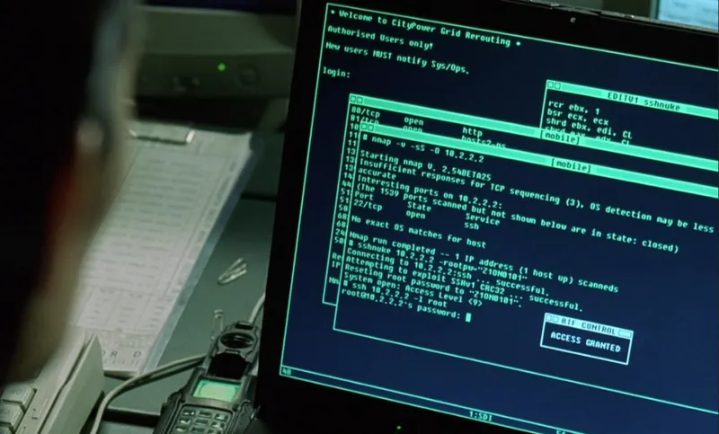

*Ce tutoriel est basé sur le contenu original de Mickael Dorigny publié sur [IT-Connect](https://www.it-connect.fr/). Licence [CC BY-NC 4.0](https://creativecommons.org/licenses/by-nc/4.0/). Des modifications ont été apportées au texte original.*

___

Bienvenue dans ce tutoriel d'introduction à Nmap conçu pour toute personne souhaitant maîtriser cet outil puissant de scan de réseau. L’objectif est de vous fournir les connaissances fondamentales nécessaires pour utiliser efficacement Nmap au quotidien.

Nmap est un outil polyvalent, largement utilisé par les professionnels de l’informatique, du réseau et de la cybersécurité pour le diagnostic, la découverte de réseau et l'audit de sécurité. Ce tutoriel s'adresse à ceux qui découvrent ces domaines et souhaitent apprendre les bases de Nmap. Une connaissance élémentaire en administration système et en réseau est recommandée.

Vous découvrirez les bases de Nmap, comment effectuer des balayages de ports, identifier les hôtes actifs sur un réseau, détecter les versions de services et les systèmes d'exploitation, réaliser des scans de vulnérabilités, et bien plus encore. Chaque section comprend des explications détaillées et des exemples pratiques pour vous aider à maîtriser l’utilisation de Nmap dans divers contextes.

À l’issue de ce tutoriel, vous aurez acquis une solide compréhension de Nmap et serez en mesure de l’utiliser efficacement pour améliorer la sécurité et la gestion de vos réseaux. Bonne lecture.

## 1.1 - Introduction à Nmap : Qu’est-ce que Nmap ?

### I. Présentation

Dans cette première section, nous allons évoquer les grandes lignes de l’outil de scan réseau Nmap. Nous verrons quels sont les éléments clés à connaître sur cet outil et son fonctionnement général. Cela nous permettra de mieux appréhender la suite du tutoriel.

### II. Présentation de l'outil Nmap

Nmap, pour _Network Mapper_, est un outil gratuit et open source utilisé pour la **découverte et la cartographie d’un réseau ainsi que l’audit de sécurité**. Il peut aussi être utilisé pour d’autres tâches comme **l’inventaire réseau, le diagnostic ou la supervision**.

Il permet de déterminer si les hôtes d’un réseau ciblé sont actifs et joignables, quels services réseau sont exposés, quelles versions et technologies sont utilisées, ainsi que d’autres informations utiles à l’analyse. Nmap peut être utilisé pour scanner un seul service sur une machine précise ou bien sur de larges pans de réseau, jusqu’à Internet tout entier.

Les points forts de Nmap sont nombreux :

- **Puissance et flexibilité** : Nmap permet de scanner des réseaux de grande taille et d'utiliser des techniques avancées de détection. Il supporte UDP, TCP, ICMP, IPv4 et IPv6, et peut effectuer des détections de versions, des analyses de vulnérabilités ou des interactions spécifiques selon le protocole. Son architecture est modulable, notamment grâce aux scripts NSE (Nmap Scripting Engine), que nous verrons plus loin dans ce tutoriel.
- **Facilité d’utilisation** : la documentation officielle est abondante et de qualité. De nombreuses ressources communautaires existent également pour accompagner la prise en main.
- **Popularité et longévité** : Nmap est une référence dans son domaine depuis 1998. La version actuelle, à l'heure de cette mise à jour, est la 7.95. Bien que d’autres outils existent pour certaines tâches spécifiques, Nmap reste un incontournable pour la cartographie réseau et l’analyse.

**Nmap au cinéma**

Nmap est l’un des rares outils de sécurité à avoir acquis une certaine notoriété grand public. Il apparaît notamment dans le film _Matrix Reloaded_, dans une scène emblématique où Trinity l’utilise pour pirater un système :



_Scène de Matrix : Reloaded faisant apparaître Nmap._

On le retrouve également dans d’autres œuvres cinématographiques.

**Retour d’expérience**

En tant qu’administrateur système puis auditeur en cybersécurité et pentester, **j’utilise Nmap presque quotidiennement** et je **le recommande régulièrement** aux administrateurs système souhaitant renforcer leur maîtrise des réseaux et améliorer leur capacité de diagnostic.

### III. Fonctionnement haut niveau

Nmap est disponible sur Linux, Windows et macOS. Il est principalement écrit en C, C++ et Lua (pour les scripts NSE). Il s’utilise principalement en ligne de commande, bien qu’il existe des interfaces graphiques comme Zenmap. Toutefois, il est vivement conseillé de débuter par la ligne de commande afin de mieux comprendre son fonctionnement.

Exemple simple :

```
nmap 192.168.10.13 10.10.10.0/24 -sV -sC --top-ports 250
```

Cette commande sera expliquée en détail plus loin. Dans ce tutoriel, nous utiliserons Nmap sous Linux, mais les usages sont similaires sur les autres systèmes. Sous Windows, Nmap s’appuie sur la bibliothèque **Npcap** (remplaçante de WinPcap, désormais obsolète) pour capturer et injecter les paquets réseau.

Nmap s’utilise comme un binaire classique, tel que `ls` ou `ip`. Certaines fonctionnalités avancées peuvent nécessiter des droits élevés, car l’outil manipule parfois les paquets d'une manière non conventionnelle afin de provoquer des réactions spécifiques sur les systèmes cibles (notamment pour la détection de services ou de failles).

### IV. Impacts de l’utilisation de Nmap

Avant d’utiliser Nmap, il est essentiel d’être conscient de ses impacts potentiels sur les réseaux et systèmes :

- Il peut envoyer **des milliers voire des millions de paquets** en peu de temps, ce qui peut saturer certaines infrastructures réseau.
- Il peut générer **des paquets malformés ou non conformes aux standards**, susceptibles de perturber certains équipements (notamment les systèmes industriels).
- Il peut produire **des comportements similaires à ceux d’une attaque**, ce qui peut déclencher des alertes dans les systèmes de sécurité (pare-feu, IDS/IPS, etc.).

De manière générale, **l’utilisation de Nmap est très bavarde**, car l’outil génère beaucoup de trafic pour extraire un maximum d’informations. Il est donc recommandé de bien comprendre son fonctionnement avant de l’utiliser sur des environnements sensibles ou de production.

### V. Conclusion

Cette section nous a permis d’introduire Nmap et ses principales caractéristiques. Nous avons vu qu’il s’agit d’un outil de cartographie réseau incontournable, puissant et flexible. Nous avons également abordé son mode de fonctionnement et les précautions nécessaires à son utilisation, afin de préparer le terrain pour les parties suivantes du tutoriel.

## 1.2 - Pourquoi utiliser Nmap ?

### I. Présentation

Dans cette section, nous allons passer en revue les principaux usages qui peuvent être faits de l’outil de scan réseau Nmap. Nous verrons qu’il s’agit d’un outil très utilisé dans de nombreux contextes et métiers, et que l’avoir dans sa boîte à outils en sachant le maîtriser est à coup sûr une compétence utile.

### II. Utiliser Nmap pour le diagnostic et la supervision

Nmap peut être utilisé dans le cadre du diagnostic réseau et plus largement de la supervision. Au même titre qu’un ping permet de statuer sur la communication entre deux hôtes, Nmap permet très rapidement de savoir si un hôte est actif ou si un service précis est opérationnel. Nous pouvons grâce à [Nmap](https://www.it-connect.fr/cours/nmap-cartographie-reseau-scan-de-vulnerabilites/ "Nmap") obtenir des données précises concernant le temps de réponse d’un hôte, la route empruntée par les paquets, la réponse faite par un service spécifique, etc.

La commande et le résultat suivant permettent, par exemple, de savoir rapidement si un serveur web sur l’hôte **192.168.1.18** est actif et répond correctement :

```
nmap --open -p 80 192.168.1.18
```

02

*Utilisation de Nmap pour récupérer l’état du service web sur un serveur distant.*

Ainsi, l’utilisation de Nmap permet d’aller plus loin que le fameux “ping test” lors des phases de débogage ou de diagnostic. Nous verrons plus loin qu’il existe plusieurs méthodes utilisées par Nmap pour identifier quel service est en écoute sur un port donné, et notamment sa version.

### III. Utiliser Nmap pour la cartographie du réseau

En tant que _Network Mapper_, la cartographie du réseau est l’objectif principal de cet outil. Il peut être utilisé au sein d’un réseau local ou de multiples réseaux, sous-réseaux et VLAN afin de dresser une liste des hôtes et des services joignables. Nmap permet de réaliser cette tâche bien plus rapidement et efficacement que n’importe quelle méthode manuelle.

La commande suivante permet, par exemple, d’identifier rapidement les hôtes actifs sur le réseau **192.168.1.0/24** :

```
nmap -sn 192.168.1.0/24
```

Remarque : l’option `-sP` est obsolète et a été remplacée par `-sn`.

03

*Utilisation de Nmap pour découvrir les hôtes joignables d’un réseau.*

Nous verrons plus loin qu’il existe plusieurs méthodes utilisées par Nmap pour déterminer si un hôte peut être considéré comme “actif”, même s’il n’expose a priori aucun service.

### IV. Utiliser Nmap pour évaluer une politique de filtrage

Nmap présente l’avantage d’être factuel : ses résultats permettent d’établir des constats concrets, contrairement à n’importe quel document d’architecture ou politique de filtrage. C’est un outil clé pour évaluer concrètement l’efficacité du cloisonnement du système d’information, car il permet de **vérifier si la politique de filtrage est effectivement appliquée**.

Dans un réseau d’entreprise, les bonnes pratiques imposent une segmentation des systèmes selon leur rôle, criticité ou localisation. Des règles de filtrage (souvent mises en œuvre via des pare-feu) doivent restreindre les communications entre zones. Mais ces configurations sont souvent complexes et sujettes à erreurs.

Ainsi, pour valider que la politique est bien respectée, rien ne vaut un test concret. Par exemple, on peut vérifier que des services d’administration sensibles (SSH, WinRM, MSSQL, MySQL, etc.) ne sont pas accessibles depuis une zone utilisateur.

L’utilisation de **Nmap pour tester la politique de filtrage** devrait être systématique avant la mise en production d’une telle politique. Malheureusement, cette vérification est souvent négligée.

D’après mon expérience, de nombreuses erreurs de configuration passent inaperçues en l’absence de tests de validation. Une simple erreur dans une plage IP ou un oubli de règle peut rendre vulnérable une zone censée être isolée.

### V. Utiliser Nmap pour l’audit de sécurité et tests d'intrusion

Nmap possède **de nombreuses fonctionnalités utiles à l’évaluation de la sécurité**, aux tests d’intrusion (pentests), et malheureusement aussi aux attaquants.

Les fonctions de découverte réseau sont cruciales pour un attaquant, qui doit comprendre la topologie du réseau après une compromission initiale. Mais Nmap offre bien plus que cela : il intègre un moteur de scripts, dont **beaucoup sont dédiés à la détection de vulnérabilités**.

Par exemple, cette commande permet de vérifier si un service FTP permet une connexion anonyme, sans avoir à se connecter manuellement :

```
nmap --script ftp-anon -p 21 192.168.1.18
```

04

*Utilisation d’un script NSE pour vérifier la présence d’une authentification anonyme FTP via Nmap.*

Ainsi, la détection de vulnérabilités via Nmap fait partie des premières étapes dans un audit ou un test d’intrusion. Elle permet d’identifier rapidement certains points faibles et d’optimiser les efforts d’analyse.

Mais attention : **les outils de scan de vulnérabilités ont leurs limites**. Nmap ne couvre qu’une partie des menaces et ne garantit pas qu’un système est sûr si aucun problème n’est détecté. Il est donc essentiel de **comprendre le fonctionnement des scripts utilisés** et de ne pas se reposer uniquement sur leur verdict.

### VI. Conclusion

Nous avons vu que maîtriser Nmap permet de couvrir un large éventail de cas d’usage, du diagnostic à la supervision, en passant par la cartographie, l’évaluation de politiques de sécurité et la recherche de vulnérabilités. Dans la section suivante, nous allons passer à la pratique et installer Nmap.


## 1.3 - Installation et configuration de Nmap

### I. Présentation

Dans cette section, nous allons apprendre à installer l’outil de scan réseau Nmap sur les OS Linux et Windows. Nous aurons à la fin de cette section tout ce qu’il faut pour commencer à utiliser Nmap pour les prochains modules. Enfin, nous verrons quels privilèges il peut demander lors de son utilisation et pourquoi.

### II. Installation de Nmap sous Linux

Nmap a été initialement créé pour fonctionner sur les systèmes d’exploitation GNU/Linux. Ainsi, et grâce à sa grande longévité et popularité, vous le trouverez dans tous les dépôts officiels des grandes distributions Unix. Dans ce tutoriel, j’utiliserai un système d’exploitation [Kali Linux](https://www.it-connect.fr/cours/debuter-avec-kali-linux/ "Kali Linux"), basé sur Debian. Mais vous pourrez l’utiliser exactement de la même manière depuis une Debian classique, un CentOS, Red Hat, ou autre !

Sous Debian, pour vérifier que Nmap est bien présent dans vos dépôts actuels, vous pouvez utiliser la commande suivante :

```
# Debian and derivatives
$ sudo apt search ^nmap$
Sorting... Done
Full Text Search... Done
nmap/kali-rolling,now 7.94+git20230807.3be01efb1+dfsg-2+kali1 amd64
  The Network Mapper

# Red Hat and derivatives
$ dnf search '^nmap$'
```

La réponse ici indique clairement que le paquet “nmap” existe dans les dépôts (ici, ceux de Kali [Linux](https://www.it-connect.fr/cours-tutoriels/administration-systemes/linux/ "Linux")). Dès lors, vous pourrez installer Nmap via les commandes d’installation habituelles, rien de désarmant pour le moment 🙂 :

```
# Debian and derivatives
sudo apt install nmap

# Red Hat and derivatives
sudo dnf install nmap
```

Pour vérifier que Nmap est bien installé, nous allons afficher sa version :

```
nmap --version
```

Voici le résultat attendu :

05

_Résultat de l’affichage de la version actuelle de Nmap._

On peut noter la présence dans cet affichage de la librairie “libpcap” (_Packet Capture Library_) et de sa version. Également exploitée par Wireshark, “libpcap” est utilisée par Nmap pour la création, la manipulation des paquets et l’écoute du trafic réseau.

### III. Installation de Nmap sous Windows

Pour une installation sur un système d’exploitation Windows, il faut commencer par télécharger le binaire depuis le site officiel (et aucun autre !) :

- Page de téléchargement de Nmap sur le site officiel : [https://nmap.org/download.html#windows](https://nmap.org/download.html#windows)
    

Il faudra alors télécharger le binaire nommé `nmap-<VERSION>-setup.exe` :

06

_Page de téléchargement du binaire d’installation Nmap pour Windows._

Une fois ce binaire présent sur votre système, il vous suffit de l’exécuter pour procéder à l’installation de Nmap. Il s’agit d’une installation tout ce qu’il y a de plus classique, vous pouvez laisser l’ensemble des options par défaut.

J’ai pour réflexe de décocher la case “zenmap (GUI Frontend)”, il s’agit d’une interface graphique pour Nmap que je n’utilise pas et qui ne sera pas couverte dans ce tutoriel, mais libre à vous de tenter l’expérience une fois que vous maîtriserez l’outil Nmap en ligne de commande !

07

_Désélection optionnelle de Zenmap lors de l’installation de Nmap sous Windows._

À la fin de l’installation de Nmap, vous aurez une seconde installation de proposée : celle de la librairie “Npcap” :

08

_Installation de la librairie “Npcap” lors de l’installation de Nmap sous Windows._

Il s’agit de la librairie sur laquelle se repose Nmap pour gérer les communications réseau, c’est-à-dire la construction, l’envoi et la réception de paquet réseau. Vous avez forcément déjà croisé cette librairie si vous utilisez Wireshark sous Windows, puisque lui aussi l’utilise également et requiert son installation.

Même chose que sous Linux, vous pourrez valider que Nmap est bien installé en ouvrant une Invite de commande ou un terminal [Powershell](https://www.it-connect.fr/cours-tutoriels/administration-systemes/scripting/powershell/ "Powershell") et en saisissant la commande suivante :

```
nmap --version
```

Voici le résultat attendu :

09

_Résultat de l’affichage de la version actuelle de Nmap._

Nmap est maintenant installé sous Windows. Vous pourrez l’utiliser exactement de la même façon que sur Linux, en suivant ce tutoriel.

### IV. Les privilèges locaux requis pour utiliser Nmap

Mais au fait, lors de l’utilisation de Nmap, **est-il nécessaire d’avoir des privilèges locaux élevés sur le système ?** La réponse est : **cela dépend**.

Dans son utilisation très basique, c’est-à-dire sans aller très loin dans l’usage de ses options, Nmap ne requiert pas forcément de droits privilégiés. Néanmoins, vous vous apercevrez vite qu’il est mieux d’utiliser Nmap dans un contexte privilégié (“root” sous Linux, “administrateur” ou équivalent sous Windows) pour pouvoir l’utiliser avec toutes ses capacités, au risque d’obtenir un message d’erreur comme celui-ci :

10

_Message d’erreur sous Linux lorsque les options de Nmap nécessitent les droits “root”._

Que ce soit sous Linux ou sur Windows, il y a de nombreux cas où Nmap vous demandera un accès privilégié. Les principales raisons sont les suivantes (liste non exhaustive) :

- **Construire des paquets réseau “brut”**: Nmap est capable d’utiliser de nombreuses méthodes de scan, incluant la manipulation et construction avancée de paquets. C’est par exemple le cas quand nous voulons effectuer des scans TCP SYN, qui ne respectent pas le _Three-way handshake_ classique des échanges TCP. Pour ce faire, Nmap doit utiliser d’autres fonctions que celles natives aux systèmes d’exploitation, qui ne savent que respecter les bonnes pratiques concernant les communications réseau (il fait ici appel aux librairies “Npcap” et “libcap” vues précédemment). C’est parce que Nmap ne fait pas les choses de façon “standard” qu’il est capable de déduire certaines informations concernant les OS, les services et certaines vulnérabilités.
    
- **Écouter le trafic réseau** : certaines options de Nmap nécessitent qu’il se mette en écoute du réseau afin de récupérer certaines informations. Cette action est considérée comme sensible sur les systèmes d’exploitation puisqu’elle permet d’écouter aussi les communications des autres applications du système. Exactement comme Wireshark, Nmap a besoin de privilèges spécifiques pour réaliser cela, qu’il est plus facile d’obtenir en étant directement dans une session privilégiée.
    
- **Se mettre en écoute sur des ports privilégiés** : sur les systèmes d’exploitation, les ports de 0 à 1024 (TCP comme UDP) sont dits privilégiés, c’est-à-dire qu’ils sont en quelque sorte réservés à des usages bien précis et donc protégés. Bien qu’il s’agisse d’une raison un peu obsolète aujourd’hui, il est toujours nécessaire d’avoir certains privilèges pour écouter sur ces ports, ce que Nmap peut être amené à faire en fonction de la façon dont il sera utilisé.
    
- **Envoyer des paquets en UDP :** de même, la mise en écoute d’une application réseau sur des ports UDP (un protocole sans état) nécessite des droits privilégiés sur les systèmes d’exploitation. Une session privilégiée sera donc nécessaire dès lors que l’on souhaite faire un scan UDP, pour lequel Nmap devra se mettre en écoute d’une réponse pour analyser les réponses à ses scans.
    

Pour être plus précis, il est possible, au moins sous Linux, d’exécuter Nmap avec toutes ses fonctions et options sans pour autant être “root”. Cela en accordant les bonnes _capabilities_ au binaire. Cependant, cela nécessite des manipulations avancées et peut ne pas être aussi pratique que d'exécuter directement Nmap avec des privilèges. Également, cette approche est moins courante et peut poser des problèmes de sécurité si elle est mal configurée.

Néanmoins, cela s’éloigne un peu de notre tutoriel sur Nmap, nous nous en passerons donc pour l'instant.

Pour la suite de ce tutoriel, considérez que Nmap est toujours exécuté en tant que “root” (depuis un shell en tant que ”root” ou via la commande “sudo”), ou dans un terminal administrateur sous Windows, même si cela n’est pas indiqué. Sinon, vous pourrez avoir des différences de résultat (subtiles, mais bien présentes) par rapport au tutoriel.

### V. Conclusion

Voilà ! Nmap est maintenant installé sur notre système d’exploitation et prêt à être utilisé, il ne nécessite pas plus de configuration que cela. Cette section clôture l’introduction et la présentation de Nmap. J’espère qu’elle vous aura mis l’eau à la bouche et que vous avez hâte de commencer la pratique.

Plus sérieusement, nous avons maintenant une meilleure idée de ce qu’est l’outil de cartographie Nmap et quels sont ses cas d’usages les plus courants, mais aussi ses limites. Passons à la suite !


## 2.1 - Scans des ports TCP et UDP avec Nmap

### I. Présentation

Dans cette section, nous apprendrons à faire nos premiers scans de port grâce à l’outil de scan réseau Nmap. Nous verrons comment l’utiliser pour dresser une liste des services réseau exposés sur un hôte, qu’ils utilisent les protocoles TCP ou UDP.

N’oubliez pas, à partir d’ici, de ne scanner que des hôtes dans un environnement maîtrisé et pour lequel vous disposez d’une autorisation explicite.

- Pour rappel : [Code pénal : Chapitre III : Des atteintes aux systèmes de traitement automatisé de données](https://www.legifrance.gouv.fr/codes/article_lc/LEGIARTI000030939438/)
    

**Si vous n’en avez pas sous la main**, je vous oriente vers les solutions gratuites suivantes, qui sont faites pour !

- **[Hack The Box](https://app.hackthebox.com/ "Hack The Box")** : Plateforme d’entraînement au hacking, Hack The Box met constamment à disposition des systèmes vulnérables que vous pourrez attaquer comme bon vous semble. Plusieurs centaines de systèmes sont disponibles, mais un pool renouvelé de 20 machines est proposé gratuitement toute l’année, l’accès se fait via un VPN OpenVPN.
    
- **[Vulnhub](https://www.vulnhub.com/ "Vulnhub")** : Cette plateforme propose en téléchargement de nombreux systèmes intentionnellement vulnérables qu’il est possible d’utiliser via VirtualBox (solution gratuite elle aussi) ou autre. Une fois téléchargé, pas besoin de VPN, tout est en local.
    

Également, vous êtes libre de vous **créer une machine virtuelle** sur votre système d’exploitation préféré et d’y installer divers services afin qu’ils vous servent de cibles de test. L’avantage ici sera que vous pourrez également voir ce qu’il se passe côté serveur lors d’un scan, notamment avec Wireshark, et aurez la main sur le pare-feu local quand nous ferons des tests plus avancés.

Place à la pratique !

### II. Scanner les ports TCP d'un hôte via Nmap

#### A. Premier scan de port TCP avec Nmap

Nous allons maintenant effectuer nos premiers scans via Nmap. Notre objectif ici est simple, nous souhaitons découvrir quels sont les services exposés par le serveur web que nous venons de déployer, histoire de voir s’il n’y a rien d’inattendu, à tout hasard un service d’administration qui ne devrait pas être accessible, ou l’exposition d’un port d’une application qui nous pensions décomissionnée.

Dans mon exemple suivant, l’hôte à scanner possède l’adresse IP “192.168.1.18” :

```
nmap 192.168.1.18
```

Voici un résultat possible, nous y voyons un retour tout à fait classique de Nmap avec de nombreuses informations :

11

_Résultat d’un scan TCP simple réalisé via Nmap._

En jetant un œil rapide à ce résultat, nous comprenons que les ports TCP/22 et TCP/80 sont accessibles sur cet hôte.

Par défaut et si on ne lui dit rien à ce sujet, Nmap va effectuer uniquement des scans sur les ports TCP.

#### B. Comprendre le résultat d’un scan Nmap simple

Allons néanmoins plus loin sur la compréhension de cette sortie, chaque ligne à son importance, déjà pour savoir ce qui vient d’être fait, et ensuite pour bien interpréter les résultats du scan en lui-même.

La première ligne est essentiellement un rappel de la version et date du scan (utiles pour les traces et l’archivage tout de même !) :

```
Starting Nmap 7.94SVN ( https://nmap.org ) at 2024-04-29 21:59 CEST
```

La seconde ligne nous indique le début des résultats de scan concernant l’hôte “debian.home (192.168.1.19)”. Information qui nous sera utile lorsque l’on commencera à scanner plusieurs hôtes en même temps :

```
Nmap scan report for debian.home (192.168.1.19)
```

La troisième ligne nous indique que l’hôte en question en bien “Up”, c’est-à-dire actif :

```
Host is up (0.00022s latency).
```

Enfin, Nmap nous informe que 998 ports TCP identifiés comme fermés ne sont pas affichés dans la sortie :

```
Not shown: 998 closed tcp ports (conn-refused)
```

Il nous évite ainsi près de 1000 lignes de résultat ressemblant à :

```
1/tcp closed
2/tcp closed
3/tcp closed
…
```

Merci à lui de nous épargner cela !

Pourquoi 998 ports “closed” ? Si l’on ajoute les 2 ports ouverts cela fait 1000, et c’est le nombre de ports que Nmap va scanner dans sa configuration par défaut, il ne scanne pas les 65535 ports TCP existants ! Nous verrons plus tard que cela est entièrement et facilement personnalisable. Mais si l’hôte ciblé possède un service en écoute sur un port un peu exotique, ce scan “par défaut” ne permettra pas de le découvrir.

À la suite de ces différentes informations, nous retrouvons ce qui est le plus intéressant, un tableau organisé selon les trois colonnes “PORT – STATE – SERVICE” :

- La première colonne “PORT” indique simplement le port/protocole ciblé, il est ici important de regarder s’il s’agit d’un port TCP (`<port>/tcp`) ou de l’UDP (`<port>/udp`).
    
- La colonne “STATE” indique le statut du service réseau découvert sur ce port et déterminé par Nmap en fonction de la réponse obtenue. Il peut bien sûr être “open” (ouvert), “closed” (fermé), mais aussi “filtered” (filtré) ou “unknown” (inconnu). Nous verrons notamment plus tard comment Nmap fait pour distinguer ces différents états.
    
- La colonne “SERVICE” indique le service exposé sur le port en question. Attention toutefois, nous n’avons ici pas utilisé d’options relatives à la découverte active des services. Nmap se base alors sur une référence locale entre un port/protocole et le service supposément assigné : le fichier “/etc/services”
    

Si l’on jette un oeil au fichier “/etc/services” sur un système Linux, on retrouve un lien “port/protocole – service” similaire à celui affiché par Nmap :

12

_Extrait du contenu du fichier “/etc/services” sous Linux._

Il faut bien comprendre que, pour l’instant, Nmap n’a pas fait de découverte active de service. Ainsi, il aurait été incapable d’identifier le service SSH derrière un port TCP/80 si tel avait été le cas. D’où l’importance de savoir utiliser les bonnes options, cela va venir !

Savoir bien interpréter la sortie de Nmap est très important pour bien maîtriser l’outil. La bonne nouvelle, c’est que cette sortie sera en grande partie la même, quelles que soient les options utilisées.

#### C. Regardons sous le capot : analyse réseau via Wireshark

Si l’on regarde attentivement ce qu’il se passe sur l’interface réseau de l’hôte qui scanne le serveur ou sur celle du serveur lui-même, les actions de Nmap seront beaucoup plus claires. C’est ce que nous allons faire ici.

Ce que je peux vous montrer ici est une partie de ce qui est visible dans Wireshark. Pour aller plus loin, n’hésitez pas à faire vous-même une capture réseau lors d’un scan pour parcourir ensuite ce qui a été capturé.

Dans le cadre de ce test, mon hôte de scan (192.168.1.18) et mon hôte cible (192.168.1.19) sont sur le même réseau local.

Nmap commence par chercher à savoir si l’hôte cible est actif sur le réseau local en émettant une requête ARP. En cas de réponse, il sait alors que l’hôte est actif et commence son scan réseau :

13

_ARP request émise par Nmap pour déterminer si un hôte cible est présent sur le réseau local._

Si l’hôte à scanner est sur un réseau distant, Nmap commence par émettre un ping request et tente de joindre quelques ports très fréquemment exposés (TCP/80, TCP/443) :

14

_Ping request émis par Nmap pour déterminer si un hôte cible est joignable sur un réseau distant._

S’il obtient une réponse à l’un de ces différents essais, il considère la cible comme active.

Une fois que Nmap a déterminé que sa cible était belle et bien active, il va chercher à résoudre son nom de domaine auprès du serveur DNS configuré sur la carte réseau, c’est vrai que l’on ne lui a pas demandé de ne pas le faire :

15

_Résolution DNS sur la cible du scan par Nmap._

Maintenant que Nmap a bien identifié sa cible et qu’il l’a sait active, il commence à faire son scan de port TCP :

16

_Émission de paquet TCP SYN et réception de RST/ACK lors d’un scan Nmap._

Il va pour cela, sur chaque port TCP faisant partie de son range par défaut, **envoyer des paquets TCP SYN et attendre une réponse**. Sur la capture ci-dessus, il reçoit de la part du serveur scanné des paquets TCP RST/ACK signifiant “circulez, il n’y a rien à voir”, autrement dit, ces ports sont fermés. Ce sera, nous l’avons vu dans le résultat, le cas de la plupart des ports scannés. Ceci à l’exception de deux :

17

_Réponse à l’envoi d’un packet TCP SYN sur le port 22, actif sur la cible du scan._

Sur la capture ci-dessus, nous voyons un **paquet TCP SYN/ACK envoyé par l’hôte ciblé**. Le port est actif et expose bien un service. Nmap acquiesce alors la réception de la réponse, puis met fin à la connexion (TCP RST/ACK). **Voilà comment il a su que le port TCP/22 était actif**.

Nous avons vu ici que Nmap respecte bien le “Three Way Handshake” lors de son scan réseau TCP. Pour des raisons de performance, il est possible de lui demander de ne pas répondre au retour du serveur, faisant alors l’économie de plusieurs milliers de paquets lors du scan d’un large réseau. Mais, nous verrons ces options et optimisations plus tard dans le tutoriel.

Nous avons à présent une meilleure idée de comment faire un scan TCP et de ce qu’il se passe réellement quand il est opéré. Nous avons également vu que par défaut, Nmap effectue un scan de port TCP sur un nombre limité de ports.

### III. Scanner les ports UDP avec Nmap

#### A. Premier scan de port UDP avec Nmap

À présent, nous allons voir comment réaliser un scan sur les ports UDP d’un hôte. Comme nous l’avons vu, Nmap va par défaut toujours effectuer des scans sur des ports TCP. Cela peut nous faire passer à côté de pas mal d’informations si nous ne le savons pas.

Pour rappel, dans le cadre de ce test, mon hôte de scan (192.168.1.18) et mon hôte cible (192.168.1.19) sont sur le même réseau local.

```
nmap -sU 192.168.1.19
```

Ici, le retour obtenu a le même format que pour un scan TCP, les services actifs affichés sont cependant en `<port>/UDP`, comme demandé !

18

_Résultat d’un scan UDP simple réalisé via Nmap._

C’est l’option “-sU” qui permet d’indiquer à Nmap que l’on veut travailler sur de l’UDP, et non du TCP comme c’est le cas par défaut.

Au passage, vous remarquerez sûrement que Nmap nécessite les droits “root” pour les scans UDP, comme mentionné précédemment dans le tutoriel.

_Remarque : Depuis les dernières versions de Nmap, il est toujours recommandé d’exécuter les scans UDP avec des privilèges administrateur pour garantir la fiabilité des résultats, car certaines fonctionnalités requièrent l’accès brut aux sockets réseau._

Les scans UDP peuvent être très longs (1100 secondes pour scanner 1000 ports dans mon exemple), cela en raison de l’absence du “Three Way Handshake” en UDP, qui fait que Nmap attendra un retour pour chaque paquet UDP envoyé et qu’il déterminera le port comme “closed” uniquement s’il n’a pas de retour au bout d’un certain temps (timeout). Cette réponse des hôtes scannés n’étant d’ailleurs pas systématique et souvent limitée en termes de nombre de réponses par seconde pour éviter certaines attaques par amplification. Cela au contraire du TCP où il y a une réponse immédiate de l’hôte scanné, que le port soit ouvert ou fermé. Nous verrons plus tard comment optimiser cela.

Une deuxième difficulté en UDP est **que les services ne répondent pas systématiquement à la réception d’un paquet**, tout simplement, car ce n’est pas toujours nécessaire et que c’est le principe de l’UDP. Lorsque c’est le cas et qu’aucun ICMP “port unreachable” n’est reçu, le service est marqué comme “open|filtered” par Nmap, comme présent dans la capture ci-dessus.

#### B. Regardons sous le capot : analyse réseau via Wireshark

Comme lors de notre scan TCP, regardons de plus près ce qu’il se passe au niveau réseau lors d’un scan UDP via une analyse Wireshark. Le comportement de Nmap pour déterminer si un hôte est actif est le même.

La seule vraie différence lors d’un scan UDP est que Nmap n’attendra pas un “Three Way Handshake”, puisque ce mécanisme n’existe pas en UDP (protocole sans état) :

19

_Émission de paquet UDP et réception de ICMP (port unreachable) lors d’un scan Nmap._

Nous voyons sur la capture ci-dessus que Nmap va émettre un grand nombre de paquets UDP, et recevoir pour la plupart d’entre eux un paquet ICMP “Destination unreachable (Port unreachable)” en réponse. C’est normal, puisqu’il s’agit de la réponse appropriée et définie par le [RFC 1122](https://www.freesoft.org/CIE/RFC/1122/41.htm "RFC 1122") lorsqu’un port UDP n’est pas joignable :

20

_Extrait du RFC 1122._

Regardons de plus près cette capture Wireshark, qui expose **les trois cas de figure possibles** en UDP :

21

_Capture réseau lors d’un scan UDP sur différents ports avec Nmap._

Ces trois cas de figure sont les suivants :

- Le premier échange est composé des paquets n°3, 4 et 8, 9. Nmap envoie des paquets UDP sur le port SNMP classique et **construit donc à l’avance des paquets conformes à ce protocole**. Il obtient ensuite une réponse du serveur (paquets n°8 et 9). Résultat : Nmap a eu une réponse, le service est bien actif (“open”).
    
- Le second échange est composé des paquets n°6 et 7. Nmap envoi un paquet UDP “vide” (sans structure relative à un protocole précis) à destination du port UDP/165 et reçoit en réponse un paquet ICMP “Destination unreachable (Port unreachable)”. Résultat : Nmap a eu une réponse (négative), l’hôte est bien up, mais le service qu’il a essayé de joindre n’est pas opérationnel sur ce port, celui-ci sera marqué en fermé (“closed”).
    
- Le dernier échange est composé du paquet n°12 : Nmap envoi un paquet UDP “vide” à destination du port UDP/1235. Il n’a aucune réponse, même pas un refus explicite de la part de l’hôte scanné. Résultat : Nmap marque le port en “open|filtered” car il est incapable de dire s’il s’agit d’une absence de réponse due à la présence d’un pare-feu, configuré pour ne rien répondre, ou à un service UDP actif qui ne renvoie aucune réponse de toute façon (non obligatoire en UDP).
    

Voici donc le résultat affiché par Nmap suite à ces trois cas de figure :

22

_Résultats possibles d’un scan UDP réalisé via Nmap._

Nous avons à présent une meilleure idée de comment faire un scan UDP et de ce qu’il se passe réellement quand il est opéré. Pour l’instant nous n’avons fait qu’utiliser Nmap très simplement, sans vraiment d’options et sans vraiment décider des ports à scanner, mais cela va bientôt changer !

### IV. Maitriser finement les ports scannés via Nmap

#### A. Rappel du comportement par défaut de Nmap

Comme nous l’avons vu, Nmap choisit lui-même le nombre et les ports à scanner si l’on ne lui spécifie pas d’options. Il s’agit là d’une configuration “par défaut” utilisée par Nmap lorsque l’on ne lui indique pas exactement quoi faire. Ces options par défaut sont faites pour avoir une idée des principaux ports exposés, ceux-ci étant sélectionnés par fréquence d’exposition (ports les plus communs ou fréquents) plutôt que dans un ordre numérique (port 1, 2, 3, etc.) et également pour éviter de partir sur un scan des 65535 ports possibles si l’on ne spécifie pas les options appropriées, ce qui serait trop long et verbeux pour un cas d’utilisation “par défaut”.

**Comment sont choisis ces ports ?**

Les 1000 ports scannés dans le mode par défaut sont choisis en fonction de leur fréquence d’apparition. Il s’agit de statistiques maintenues par Nmap et mises à jour au même titre que le binaire lui-même et de ses scripts (modules). Vous pouvez vous-même consulter ces statistiques dans le fichier “/usr/shares/nmap/nmap-services” :

23

_Extrait du fichier “/usr/shares/nmap/nmap-services”._

Nous voyons ici dans la troisième colonne ce qui s’apparente à des probabilités (entre 0 et 1) ou une répartition en pourcentage. Il s’agit de la fréquence d’apparition de chaque couple port/protocole. Nous voyons alors que les ports les plus connus (FTP, SSH, TELNET et SMTP dans cet extrait) ont une valeur bien supérieure aux autres.

#### B. Spécifier précisément les ports cibles d’un scan Nmap

Néanmoins dans la réalité, nous pouvons avoir besoin de scanner uniquement un port précis, ou plusieurs, ou un range de port bien identifié. Cela tombe bien, Nmap nous permet très facilement de faire cela, de manière uniforme qu’il s’agisse d’un scan UDP ou TCP.

**Scanner un port spécifique via Nmap**

Si nous souhaitons scanner un seul port, et non pas 1000, nous pouvons spécifier ce port via l’option “-p” ou “--port” de Nmap :

```
# Scan a single TCP port with Nmap
nmap 192.168.1.19 -p 80

# Scan a single UDP port with Nmap
nmap -sU 192.168.1.19 -p 161
```

Dès lors, le scan sera naturellement beaucoup plus rapide et Nmap n’émettra que les paquets nécessaires pour détecter si l’hôte est actif, puis si le port spécifié est joignable. Voilà qui nous fera gagner du temps si l’on veut juste réaliser un test rapide, histoire de voir si le service web de notre site vitrine est toujours up.

**Scanner plusieurs ports via Nmap**

De la même manière, nous pouvons spécifier plusieurs ports à Nmap, cela à l’aide de la même option et en enchaînant les ports spécifiés par une virgule :

```

# Scan several TCP ports with Nmap

nmap 192.168.1.19 -p 80,10999,22,23,1345

# Scan several UDP ports with Nmap

nmap -sU 192.168.1.19 -p 161,23,69

```

Peu importe l’ordre, Nmap vérifiera tous ces ports, et uniquement ceux-ci sur l’hôte ciblé. Vous remarquerez dans le résultat affiché par Nmap que celui-ci **nous indique explicitement tous les ports et leur état**, même s’ils sont “closed”. À l’inverse du comportement par défaut où cette sortie complète aurait pris beaucoup trop de place :

24

*Résultat d’un scan Nmap TCP sur les ports indiqués.*

**Scanner un range de ports**

Si le nombre de ports que l’on souhaite scanner est trop grand, il est possible de les spécifier par fourchette, par exemple :

```

# Scan TCP ports from 1000 to 2000 with Nmap

nmap 192.168.1.19 -p 1000-2000

# Scan UDP ports from 1000 to 2000 with Nmap

nmap -sU 192.168.1.19 -p 100-150

```

Il est bien sûr possible de mixer un peu tout cela comme bon vous semble, par exemple :

```

# Scan TCP ports 22,80, 3389 and from 1000 to 2000 with Nmap

nmap 192.168.1.19 -p 22,80,1000-2000,3389

```

**Scanner de ports en TCP et UDP**

Vous pouvez également très bien réaliser des scans en UDP et TCP en même temps, sur des ports bien choisis :

```

# Scan the list of 1000 default ports, in TCP and UDP

sudo nmap 192.168.1.19 -sT -sU

# Scan only UDP/161 and TCP/22

sudo nmap 192.168.1.19 -sT -sU -p U:161,T:22

```

Vous remarquerez dans ce dernier exemple la présence des “U:” pour indiquer un port UDP et “T:” pour indiquer un port TCP. Voici une sortie possible de ce type de scan :

25

*Résultat d’un scan sur des ports TCP et UDP avec Nmap.*

Voilà qui commence à être intéressant en termes de personnalisation des scans !

**Scanner tous les ports**

Pour finir, il est possible d’indiquer à Nmap des ranges beaucoup plus grands, ou au contraire plus petits. Nous avons vu que la liste par défaut sélectionnée par Nmap contient 1000 ports. Nous pouvons très bien lui demander le top 100 des ports les plus fréquents, ou le top 200, cela en utilisant l’option “--top-ports” :

```

# Scan the top 100 most common ports with Nmap

nmap 192.168.1.19 --top-ports 100

# Scan the top 200 most common ports with Nmap

nmap 192.168.1.19 --top-ports 200

```

Et enfin, nous pouvons lui demander de scanner tous les ports possibles (les 65535), cela avec la notation “-p-” :

```

# Scan all TCP ports from 1 to 65535 with Nmap

nmap 192.168.1.19 -p-

```

Ce dernier cas de figure prendra certes plus de temps, notamment en UDP, mais vous serez alors certains de ne passer à côté d’aucun port ouvert.

*Remarque : L’option “-p-” est bien la méthode recommandée pour scanner tous les ports TCP. Pour les scans UDP, il est conseillé de limiter le nombre de ports pour des raisons de performance, car les scans complets de tous les ports UDP peuvent prendre énormément de temps.*

Plus tard dans le tutoriel, nous verrons comment optimiser la vitesse des scans Nmap en fonction de nos besoins, ce qui sera notamment utile aux scans sur l’intégralité des ports en TCP et UDP.

### V. Conclusion

Dans cette section, nous avons enfin fait un peu de pratique, nous savons à présent **utiliser Nmap de façon basique pour scanner les ports TCP et UDP** d’un hôte. Nous avons également regardé en détail ce qu’il se passe au niveau réseau et **comment Nmap détermine si un port TCP ou UDP est actif ou non**. Enfin, nous savons comment sélectionner finement les ports que nous souhaitons scanner et **ce que font vraiment les options par défaut de Nmap**. Dans la suite, nous réutiliserons ces connaissances et les appliquerons au scan d’un réseau tout entier, notamment pour effectuer une cartographie globale et découverte d’un réseau.


## 2.2 - Cartographie et découverte de réseau avec Nmap


### I. Présentation

Dans cette section, nous apprendrons à utiliser l’outil de scan réseau Nmap afin de dresser une cartographie du réseau. Nous verrons qu’il peut être très efficace dans cette tâche à travers ses différentes options. Enfin, nous verrons différentes méthodes pour spécifier les cibles de nos scans à Nmap.

Nous utiliserons notamment ce que nous avons appris dans la section précédente concernant la manière dont Nmap détermine si un hôte est actif et joignable.

Comme évoqué dans l’introduction à Nmap, celui-ci est un Network Mapper, littéralement un cartographe du réseau. Il s’agit donc de l’outil parfait pour dresser une liste des hôtes accessibles du réseau, qu’il s’agisse d’un réseau distant ou local.

**Retour de l’auteur :**

Dans les faits en tant qu’auditeur cybersécurité et pentester, j’utilise Nmap systématiquement lors de la réalisation de tests d’intrusion internes afin de savoir où je suis, quels sont mes voisins sur le réseau local et quels sont les autres réseaux accessibles ainsi que les systèmes qui s’y situent. Mon objectif est simple : faire une cartographie du réseau, déterminer la taille du système d’information et notamment esquisser sa surface d’attaque.

Cette cartographie du réseau peut aussi être utile dans des contextes de diagnostic du réseau, de supervision, de recensement des actifs (êtes-vous bien sûr que votre SI est bien composé uniquement de ce qui est dans l’Active Directory ou dans votre GLPI/OCS Inventory ?), etc. Cela peut donc également être intéressant afin de détecter la présence de Shadow IT dans votre système d’information.

### II. Utiliser Nmap pour scanner une plage réseau

#### A. Découverte d’un réseau avec un scan Nmap

Nous souhaitons à présent passer à la vitesse supérieure et analyser tout notre réseau local. Rien de plus simple, il nous suffit pour cela de réutiliser les commandes vues dans la section précédente, mais de spécifier un CIDR à la place d’une simple adresse IP.

Un CIDR (**Classless Inter Domain Routing**) est la notation “classique” pour spécifier une plage réseau et son étendue (à l’aide du masque). Par exemple “192.168.0.0/24”, il s’agit d’une “traduction” de la notation décimale du masque “255.255.255.0”.

Pour utiliser Nmap en spécifiant un CIDR, nous pouvons l’utiliser comme suivant :

```
# Scan a CIDR
nmap 192.168.0.0/24
```

Il est également possible, comme pour les ports dans la section précédente, de spécifier plusieurs hôtes, plusieurs réseaux, ou range :

```
# Scan several networks at once via their CIDR
nmap 192.168.0.0/24 192.168.1.0/24

# Scan several hosts via their IP
nmap 192.168.1.2 192.168.1.3 192.168.1.10-20

# Mix of both
nmap 192.168.0.0/24 192.168.1.3 192.168.1.10-20
```

Voici un exemple de résultat que nous pourrions avoir lors de l’exécution d’un scan sur un réseau :

26

_Résultat d’un scan Nmap pour cartographier plusieurs réseaux._

Nous voyons notamment plusieurs hôtes actifs, chaque section relative à un hôte débute par une ligne telle que celle-ci :

```
Nmap scan report for <name> (<IP>)
```

Cela nous permet de clairement voir à quel hôte se rapportent les résultats qui suivent. La toute dernière ligne a également son importance :

```
Nmap done: 512 IP addresses (5 hosts up) scanned in 21.43 seconds
```

Nous savons que, sur les réseaux scannés, Nmap a découvert 5 hôtes actifs.

#### B. Regardons sous le capot : analyse réseau via Wireshark

Nous allons à présent regarder un peu plus en détail ce qu’il se passe au niveau réseau lors d’une découverte réseau réalisée via Nmap.

Comme nous l’avons vu dans la section précédente, Nmap va par défaut utiliser le protocole ARP pour détecter la présence d’hôtes sur le réseau local :

27

_Paquets ARP capturés lors du scan d’un réseau local via Nmap et avec ses options par défaut._

Il est ainsi en capacité de détecter la quasi-totalité des hôtes du réseau local, puisque la réponse à une requête ARP est généralement fournie par tous les hôtes actifs sur le réseau et ne paraît nullement suspecte.

Pour les réseaux distants, Nmap va utiliser une combinaison de techniques :

28

_Paquets ICMP et TCP capturés lors du scan d’un réseau distant via Nmap et avec ses options par défaut._

Pour être plus précis, Nmap utilise un paquet “Echo ICMP” (cas classique du “ping”) ainsi qu’un paquet “ICMP Timestamp”, d’ordinaire utilisé pour calculer le temps de transite d’un paquet. Il espère ainsi avoir une réponse des hôtes situés sur des réseaux distants.

Néanmoins il ne se limite pas à cela. Vous pouvez voir dans la capture Wireshark ci-dessus que des **paquets TCP SYN** sont systématiquement envoyés sur les ports TCP/443 de chaque hôte potentiel des réseaux à scanner, ainsi que des paquets **TCP ACK** sur le port TCP/80.

**Pourquoi envoyer des paquets TCP sur des ports dans le cadre d’une découverte réseau ?**

L'envoi d'un paquet SYN à un port donné permet à Nmap de **déterminer si un service est en cours d'écoute sur ce port**. Si un hôte répond à un paquet SYN avec un paquet SYN/ACK, cela indique qu'il est actif et qu'un service est en cours d'écoute sur ce port. Nmap tente donc sa chance sur ce service, **même si aucune réponse au ping n’a été obtenue**.

L'envoi d'un paquet ACK à un port donné permet à Nmap de **déterminer si un pare-feu est présent sur cet hôte**. Si un hôte répond à un paquet ACK avec un paquet RST (Reset), cela indique qu'un pare-feu est probablement présent sur cet hôte et qu'il bloque le trafic non sollicité. Ainsi l’hôte trahit sa présence sur le réseau, même s’il n’a pas répondu aux autres sollicitations.

Il est cependant important de noter que la détection de pare-feu à l'aide de cette technique peut ne pas être parfaitement fiable dans tous les cas. Certains hôtes peuvent générer des réponses RST pour d'autres raisons que la présence d'un pare-feu, comme la configuration spécifique du service ou du système d'exploitation. De plus, les pare-feu modernes peuvent être configurés pour ne pas répondre aux tentatives de découverte de ce type.

Nous avons bien avancé à présent et savons réaliser une découverte réseau basique. Nous allons à présent voir quelques options supplémentaires nous permettant de mieux maîtriser le comportement de Nmap.

### III. Découverte réseau sans scan de port avec Nmap

Vous l’aurez sûrement remarqué, par défaut Nmap **effectue un scan de port à la suite de sa découverte d’hôte actif**, ce qui rajoute à notre scan une énorme quantité de paquets et d’attente de réponses. Si vous avez 5 hôtes sur votre réseau, Nmap va chercher à vérifier l’état d’environ 5 000 ports, ce qui prendra plus de temps.

Il est cependant possible d’utiliser les options de Nmap afin d’effectuer **uniquement une découverte des hôtes actifs** sur un réseau, sans découverte de leurs services.

Si l’on souhaite uniquement savoir quels sont les hôtes joignables, sans informations sur les services et ports qu’ils exposent, nous pouvons alors utiliser l’option “-sn” pour réaliser **uniquement un scan utilisant des Echo ICMP (ping) et requêtes ARP**. Autrement dit, désactiver totalement le scan de port :

```
# Scan a CIDR in Echo ICMP
nmap 192.168.1.0/24 -sn
```

Voici le résultat d’une découverte réseau Nmap réalisée sans scan de port :

29

Résultat d’une découverte réseau sans scan de port avec Nmap.

Nous avons évoqué précédemment les éventuelles limitations de l’utilisation unique de l’ICMP pour la découverte d’hôte (pour les réseaux distants). C’est pourquoi Nmap utilise aussi quelques astuces pouvant trahir la présence d’un pare-feu ou d’un service spécifique sur les hôtes. Nous pouvons, à l’aide des options, réutiliser ces astuces et même les étendre, sans pour autant repartir sur un scan complet des ports de chaque hôte découvert.

Nous allons pour cela utiliser l’option “-PS” (TCP SYN), “-PA” (TCP ACK), qui vont nous permettre d’indiquer les ports que l’on souhaite joindre dans le cadre de notre découverte d’hôte, ainsi que l’option “-PP” :

```
# Scan specific ports on a CIDR
nmap -sn -PP -PS22,3389,445,139 -PA80 192.168.1.0/24
```

Ce scan nous assure déjà d’avoir une découverte des hôtes un peu plus complète que via les options par défaut.

Nous commençons à avoir des commandes assez complètes, utilisant de multiples options. Cela parce que nous savons comment Nmap fonctionne et quelles sont les limites de ses options “par défaut” qui peuvent parfois nous faire perdre du temps ou passer à côté d’éléments importants. C’est tout l’intérêt de prendre le temps d’apprendre à le maîtriser !

Pour détailler un peu les options de notre dernière commande :

- “`-sn`” : désactive le scan de ports pour chaque hôte actif découvert par Nmap.
    
- “`-PP`” : active l’ICMP echo (ping scan) pour la découverte d’hôte.
    
- “`-PS <PORT>`” : envoi d’un paquet TCP SYN sur le ou les ports indiqués afin de détecter un éventuel service actif trahissant la présence d’un hôte n’ayant pas répondu au ping.
    
- “`-PA <PORT>`” : envoi d’un paquet TCP ACK sur le ou les ports indiqués afin de détecter un éventuel pare-feu actif trahissant la présence d’un hôte n’ayant pas répondu au ping.
    

Dans l’exemple ci-dessus, je spécifie les ports que je considère être les plus souvent exposés dans mes contextes d’utilisation de Nmap pour l’option “-PS”. Ces différents ports seront donc testés sur chaque hôte, non pas dans le but de voir si le service qu’ils hébergent est vraiment actif, mais pour voir si cela permet de découvrir un hôte qui n’aurait pas répondu à nos Echo ICMP en étant quand même actif (par l’intermédiaire d’une réponse du service ou du pare-feu de l’hôte).

Voici ce que l’on peut observer dans une capture réseau réalisée au moment d’un tel scan, il s’agit ici d’un extrait sur un seul hôte cible :

30

_Paquets envoyés par Nmap lors d’une découverte réseau avancée, sans scan de port._

Nous retrouvons bien nos paquets TCP SYN, notre TCP ACK sur le port TCP/80 et notre Echo ICMP. Nmap réalisera tous ces tests pour chaque hôte ciblé par notre scan de découverte réseau.

### IV. Utiliser un fichier des actifs à cibler avec Nmap

La spécification des cibles peut vite s’avérer complexe dans des systèmes d’information réels qui peuvent parfois être composés de dizaines ou de centaines de réseau, sous-réseau et VLAN. Dès lors, il devient plus simple d’utiliser un fichier comme source pour Nmap que de les spécifier un à un dans la ligne de commande.

Pour commencer, il faut créer un simple fichier contenant une entrée par ligne :

31

_Fichier contenant une cible (hôte ou réseau) par ligne._

Ensuite, nous pouvons utiliser toutes les options de Nmap vues jusqu’ici et spécifier l’option “-iL <chemin/fichier>” :

```
# Scan a list of targets contained in a file
nmap -iL /tmp/mesCibles.txt
```

Nmap va alors inclure dans son scan toutes les cibles contenues dans notre fichier.

Si vous souhaitez être sûr que vos cibles seront toutes prises en compte, vous pouvez utiliser l’option “-sL -n”. Nmap va alors uniquement interpréter les CIDR et hôtes du fichier pour vous les afficher, sans faire partir aucun paquet sur le réseau :

```
# Display targets contained in a file
nmap -iL /tmp/mesCibles.txt -sL -n

Starting Nmap 7.94SVN ( https://nmap.org ) at 2024-05-01 14:52 CEST
Nmap scan report for 192.168.0.0
Nmap scan report for 192.168.0.1
Nmap scan report for 192.168.0.2
Nmap scan report for 192.168.0.3
Nmap scan report for 192.168.0.4
Nmap scan report for 192.168.0.5
Nmap scan report for 192.168.0.6
Nmap scan report for 192.168.0.7
Nmap scan report for 192.168.0.8
Nmap scan report for 192.168.0.9
Nmap scan report for 192.168.0.10
Nmap scan report for 192.168.0.11
Nmap scan report for 192.168.0.12
```

Cela permet d’être bien sûr de la liste des hôtes qui seront scannés.

Une dernière astuce importante que je souhaite vous partager concerne **l’exclusion d’hôte ou de réseau dans le cadre d’un scan**. Ce besoin d’exclure un hôte peut être nécessaire dans différents cas, notamment si l’on souhaite être sûr et certain qu’**un composant sensible du système d’information ne soit pas dérangé ou perturbé par nos scans**.

Des exemples fréquents de tels besoins sont les cas où une entreprise possède des équipements industriels (automates) ou de santé. Ces équipements sont parfois mal conçus et pas du tout prévus pour recevoir des paquets mal formatés ou en trop grande quantité. Pour des besoins évidents de disponibilité ou risque métier/humain, il est alors préférable de les exclure des tests.

Pour exclure des adresses IP ou réseaux de notre scan, nous pouvons utiliser l’option “--exclude” de Nmap, par exemple :

```
# Exclude an IP address in a CIDR scan
nmap 192.168.1.0/24 --exclude 192.168.1.140
```

Dans cet exemple, je scanne le réseau “192.168.1.0/24” mais exclus l’hôte “192.168.1.140” qui s’y situe. Aucun paquet ne sera émis par Nmap à destination de cet hôte. Autre exemple avec l’exclusion d’un sous-réseau :

```
# Exclude a subnet in a CIDR scan
nmap 10.0.0.0/16 --exclude 10.0.100.0/24
```

Même chose, je scanne le large réseau “10.0.0.0/16”, mais le réseau “10.0.100.0/24” ne sera pas scanné. À nouveau, je vous invite à utiliser l’option “-sL -n” afin d’avoir une vue très claire des hôtes qui seront scannés et exclus du scan, notamment si vous opérez dans un contexte sensible.

### V. Découverte réseau et scan de port

Nous pouvons à présent combiner ce que nous avons appris dans cette section avec nos apprentissages de la section précédente concernant les options de scan de port. Par défaut, nous avons vu que Nmap procédera au scan des 1000 ports les plus fréquents sur chaque hôte actif découvert. Nous avons vu comment empêcher ce comportement s’il n’est pas souhaité, mais nous pouvons tout à fait le maîtriser, voire l’étendre si cela répond à nos besoins.

Par exemple, la commande suivante va vérifier la présence d’un service en écoute sur le port TCP/22 sur chaque hôte scanné :

```
# Scan TCP/22 on a CIDR
nmap 192.168.0.0/24 192.168.1.0/24 -p 22
```

Nmap va dans un premier temps faire une découverte réseau pour lister les hôtes actifs, et pour chacun d’entre eux, vérifier qu’un service est présent sur le port TCP/22.

De la même manière, nous pouvons réaliser un scan complet de tous les ports TCP sur chaque hôte découvert sur le réseau “192.168.0.0/24”, en excluant l’hôte “192.168.0.4” par exemple :

```
# Port scan of a CIDR with exclusion 
nmap 192.168.0.0/24 --exclude 192.168.0.4 -p-
```

Libre à vous de combiner toutes les options que nous avons apprises jusque-là en fonction de vos propres besoins.

### VI. Conclusion

Nous avons vu dans cette section comment utiliser Nmap afin de réaliser une cartographie du réseau à l’aide de différentes options. Nous pouvons à présent maîtriser finement les cibles de nos scans ainsi que le comportement de Nmap concernant le scan de port et la méthode de découverte des hôtes. Et le plus important, nous savons quel est le comportement par défaut de Nmap ainsi que ses limitations, et comment utiliser ses principales options pour aller plus loin.

La section suivante sera dédiée aux mécanismes et options de découverte des versions des services et systèmes d’exploitation scannés par Nmap.


