___

*Tutorial ini didasarkan pada konten asli oleh Florian Duchemin yang dipublikasikan di [IT-Connect](https://www.it-connect.fr/). Lisensi [CC BY-NC 4.0](https://creativecommons.org/licenses/by-nc/4.0/). Perubahan mungkin telah dilakukan pada teks asli.*

___

## I. Presentasi

**Untuk memeriksa kelancaran jaringan, mendapatkan gambaran jelas tentang penggunaan, atau untuk statistik performa, pemantauan aliran jaringan adalah bagian penting dari jaringan perusahaan**. Hal ini membantu mengantisipasi perubahan pada infrastruktur dan membantu memastikan kualitas penggunaan bagi pengguna (juga dikenal sebagai QoE atau _Quality of Experience_, berbeda dengan QoS).

Untuk melakukan ini, ada banyak teknik dan perangkat lunak/protokol yang tersedia. Netflow, misalnya, yang dikembangkan oleh Cisco, dapat digunakan untuk mengambil statistik aliran IP dari sebuah interface, tetapi penggunaannya terbatas pada peralatan yang kompatibel.

Itulah mengapa dalam tutorial ini saya akan memperkenalkan **Ntop** dan menunjukkan cara menggunakannya di infrastruktur Anda untuk mengawasi penggunaan jaringan Anda.

Ntop adalah perangkat lunak open source yang dapat dipasang di komputer Linux mana pun. Perangkat lunak ini gratis dan dapat mengumpulkan data berikut:

- Pemanfaatan bandwidth
- Klien utama
- Tujuan utama
- Protokol yang digunakan
- Aplikasi yang digunakan
- Port yang digunakan
- Dll.

Sekarang berganti nama menjadi **Ntopng (New Generation)**, yang menawarkan banyak fungsi dasar secara gratis. Versi komersial juga tersedia, memungkinkan ekspor peringatan yang dikonfigurasi ke perangkat lunak tipe SIEM, atau lalu lintas untuk difilter dengan aturan yang ditentukan langsung dari probe.

## II. Prasyarat

Pemasangan probe Ntop berbeda-beda sesuai dengan peralatan dan lingkungan. Jadi, di sini saya tidak akan memberikan panduan langkah demi langkah, tetapi akan menguraikan berbagai kemungkinannya.

### A. Mode on-board

Jika Anda memiliki firewall pfSense, OPNSense, atau Endian dalam produksi, atau bahkan workstation Linux dengan NFTables, kabar baik! Anda dapat memasang Ntopng secara langsung dan mulai memantau interface Anda.

Keuntungan dari teknik ini adalah tidak memerlukan perangkat keras tambahan. Di sisi lain, ini meningkatkan pemanfaatan sumber daya, jadi pastikan Anda memiliki perangkat keras yang memadai atau VM dengan ukuran yang cukup (minimal 2 core dan 2GB RAM).

### B. Mode TAP / SPAN

TAP adalah perangkat jaringan yang menduplikasi lalu lintas yang melewatinya dan mengirimkannya ke perangkat lain. Keuntungan dari perangkat ini adalah tidak memerlukan modifikasi pada infrastruktur yang ada, dan dapat ditempatkan di mana saja untuk memantau bagian jaringan tertentu, atau antara core switch dan edge router untuk menganalisis lalu lintas ke/dari Internet.

Kerugian besar dari jenis peralatan ini adalah biayanya. Dalam jaringan Gigabit saat ini, TAP pasif tidak dapat menangkap lalu lintas jaringan dengan benar, jadi Anda memerlukan perangkat aktif yang biayanya sekitar €200 (minimal).

Mode **SPAN**, juga dikenal sebagai **port mirroring**, digunakan oleh switch untuk meneruskan lalu lintas dari satu port ke port lainnya. Ini sejauh ini metode favorit saya, karena mudah diatur dan, seperti TAP, memungkinkan Anda untuk memantau sebagian atau seluruh jaringan sesuai keinginan. Namun, ada dua kelemahan: switch harus mengintegrasikan fungsi ini, dan penggunaannya dapat meningkatkan beban prosesor pada switch.

### C. Mode router

Sangat mungkin untuk memasang router di bawah Linux dan memasang ntopng di atasnya. Satu-satunya kelemahan dari metode ini adalah bahwa metode akan memodifikasi jaringan Anda, baik pengalamatan internalnya, maupun pengalamatan antara router "asli" Anda dan router yang Anda tambahkan.

Catatan: bagi pembaca artikel [Membuat router Wifi dengan Raspberry Pi dan RaspAP](https://www.it-connect.fr/creer-un-routeur-wifi-avec-un-raspberry-pi-et-raspap/), sangat mungkin untuk memasang Ntopng pada Rpi Anda untuk mendapatkan statistik yang akurat!


### D. Mode Bridge


Alternatif yang menarik adalah dengan menggunakan **sebuah mesin Linux dalam mode jembatan** yang ditempatkan di antara dua buah peralatan, hal ini memungkinkan semua trafik untuk ditangkap tanpa harus mengintervensi konfigurasi infrastruktur atau peralatannya. Karena mesin lama dapat melakukan pekerjaan itu, biaya dari metode ini juga bisa menarik. Perhatikan bahwa agar optimal, perangkat harus memiliki tiga kartu jaringan, dua dalam mode bridge, satu untuk mengakses Interface dan SSH. Bisa saja menggunakan hanya dua kartu, tetapi lalu lintas administrasi perangkat juga akan ditangkap...

Alternatif yang menarik adalah menggunakan **komputer Linux dalam mode bridge**. Ditempatkan di antara dua peralatan, ini memungkinkan semua lalu lintas ditangkap tanpa harus mengintervensi konfigurasi infrastruktur atau peralatannya. Karena perangkat lama bisa melakukan pekerjaan ini, biaya metode ini juga bisa menarik. Perhatikan bahwa agar optimal, perangkat harus memiliki tiga kartu jaringan, dua dalam mode bridge, satu untuk mengakses interface dan SSH. Sangat mungkin untuk menggunakan hanya dua kartu, tetapi lalu lintas administrasi perangkat juga akan ditangkap...

Jadi, **mode terakhir inilah yang akan saya gunakan**. Untuk alasan praktis, saya akan menggunakan  virtual machines untuk demonstrasi, tetapi metodenya tetap sama untuk penggunaan pada mesin fisik.

## III. Persiapan probe dengan jembatan Interface

Untuk probe, saya memilih komputer **Debian 11** dengan instalasi minimal.

Langkah pertama, selalu sama, perbarui file :

```
apt-get update && apt-get upgrade
```

Kemudian instal paket **bridge-utils**, yang akan memungkinkan kita untuk membuat bridge:

```
apt-get install bridge-utils
```

Setelah terinstal, hal pertama yang perlu diperhatikan adalah nama kartu jaringan kita saat ini. Pada Debian, nama ini dapat memiliki beberapa bentuk, dan kita akan membutuhkannya untuk konfigurasi.

Perintah **ip add** yang sederhana akan mengembalikan output dengan informasi ini:

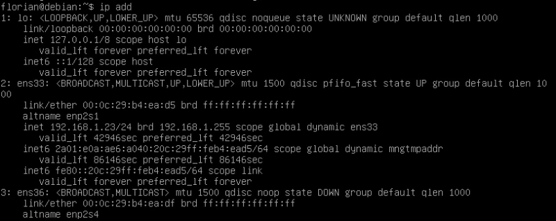

Di sini, saya melihat 3 interface:

- Lo**: ini adalah Interface loopback; ini adalah Interface virtual yang "mengulang" pada peralatan. Pada dasarnya, Interface ini, yang Address-nya 127.0.0.1 (meskipun Address mana pun dalam 127.0.0.0/8 dapat digunakan, karena rentang ini disediakan untuk tujuan ini) digunakan untuk menghubungi peralatan itu sendiri. Jika Anda telah menginstal situs web di workstation Anda (menggunakan WAMPP, misalnya), Anda mungkin telah menggunakan "*localhost*" Address pada suatu waktu untuk menampilkan situs yang di-host pada mesin Anda sendiri. Nama host ini diasosiasikan dengan Address 127.0.0.1 dan oleh karena itu dengan loopback Interface.
- ens33**: ini adalah Interface pertama saya, yang menerima Address di sini dari DHCP saya
- ens36**: Interface kedua saya


Sekarang setelah saya memiliki semua informasi, saya dapat memodifikasi berkas */etc/network/interfaces* untuk membuat jembatan saya. Inilah tampilannya saat ini (mungkin berbeda):


```
# This file describes the network interfaces available on your system
# and how to activate them. For more information, see interfaces(5).

source /etc/network/interfaces.d/*

# The loopback network interface
auto lo
iface lo inet loopback

# The primary network interface
allow-hotplug ens33
iface ens33 inet dhcp
# This is an autoconfigured IPv6 interface
iface ens33 inet6 auto
```


Bagian pertama menyangkut loopback Interface saya, yang tidak akan saya bahas, diikuti oleh Interface ens33. Modifikasi melibatkan penambahan Interface kedua saya (ens36) dan mengkonfigurasi bridge dengan dua antarmuka ini:


```
# The primary network interface
auto ens33
iface ens33 inet manual

#The secondary network interface
auto ens36
iface ens36 inet manual
```


Berikut ini beberapa penjelasan mengenai perubahan pertama ini:


- auto *Interface***: secara otomatis akan "memulai" Interface pada saat startup sistem
- iface *Interface* inet manual**: untuk menggunakan Interface tanpa IP Address. Seperti kata kunci "static" untuk mendefinisikan IP Address statis atau "dhcp" untuk menggunakan pengalamatan dinamis


Modifikasi terus berlanjut:


```
# Bridge interface
auto br0
iface br0 inet static
address 192.168.1.23
netmask 255.255.255.0
gateway 192.168.1.1
bridge_ports ens33 ens36
bridge_stp off
```


Di sini sekali lagi, beberapa penjelasan:


- iface br0 inet statis**: di sini saya telah mendefinisikan jembatan Interface saya (*br0*) dengan Address statis.
- Address, netmask, gateway**: informasi pengalamatan papan
- bridge_ports**: antarmuka yang akan disertakan dalam jembatan
- bridge_stp**: protokol Spanning Tree digunakan saat menghubungkan sakelar untuk mendeteksi tautan yang berlebihan dan menghindari loop. Karena jembatan dapat disisipkan di antara dua jalur jaringan, jembatan dapat menjadi sumber loop, oleh karena itu kemungkinan untuk mengaktifkan protokol ini. Saya tidak membutuhkannya di sini, jadi saya menonaktifkannya.


Simpan perubahan dan mulai ulang jaringan:


```
systemctl restart networking
```


Untuk memeriksa perubahannya, tampilkan kembali hasil dari perintah **ip** add:


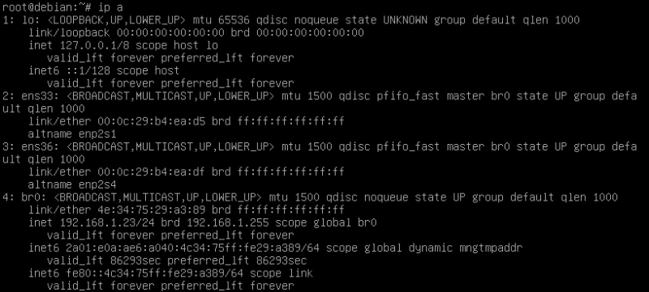


Anda dapat dengan jelas melihat "*br0*" Interface saya yang baru dengan IP Address yang saya tetapkan padanya.** Secara kebetulan, Anda juga dapat melihat bahwa kedua antarmuka fisik saya memang "UP", tetapi tidak memiliki IP Address.


## IV. Menginstalasi NtopNG


Sekarang setelah probe kita dapat mengendus lalu lintas antara jaringan saya dan router, yang perlu dilakukan adalah menginstal ntopng. Untuk melakukan ini, pertama-tama, modifikasi file */etc/apt/sources.list* dan tambahkan **contrib** di akhir setiap baris yang dimulai dengan **deb** atau **deb-src**.


Secara default, sumber paket hanya berisi paket yang sesuai dengan DFSG (*Debian Free Sotftware Guidelines*), yang diidentifikasi dengan kata kunci **main**. Anda juga dapat menambahkan sumber ini:


- contrib**: paket yang berisi perangkat lunak yang sesuai dengan DFSG, tetapi menggunakan dependensi yang bukan merupakan bagian dari cabang **utama**
- tidak bebas**: berisi paket yang tidak sesuai dengan DFSG


Contoh baris di /etc/apt/sources.list :


```
deb http://deb.debian.org/debian/ bullseye main
```


Jadi, saya hanya akan menambahkan kata **contrib** pada baris seperti ini.


Langkah-langkah selanjutnya terdapat pada situs [NtopNG] (https://packages.ntop.org/apt/) di mana, untuk Debian 11, Anda perlu menambahkan sumber Ntop untuk instalasi di masa mendatang. Penambahan ini dilakukan secara otomatis dengan menggunakan file :


```
wget https://packages.ntop.org/apt/bullseye/all/apt-ntop.deb
apt install ./apt-ntop.deb
```


Kemudian, tibalah pada tahap pemasangan yang sesungguhnya:


```
apt-get clean all
apt-get update
apt-get install ntopng
```


Perintah pertama akan menghapus cache dari manajer paket apt. Perintah kedua akan memperbarui daftar paket dan perintah ketiga akan menginstal NtopNG.


Setelah instalasi, perangkat lunak **NtopNG langsung tersedia di port 3000 pada mesin Debian**. Jadi bagi saya, ini adalah `http://192.168.1.23:3000`


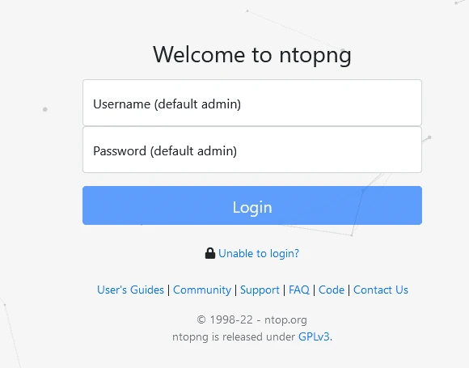


Halaman beranda NtopNG


Login dan kata sandi default ditampilkan, jadi Anda tinggal memasukkannya!


## V. Menggunakan NtopNG


Ketika Anda pertama kali masuk, hal pertama yang akan diminta untuk Anda lakukan adalah mengubah kata sandi dan bahasa admin default. Sayangnya, bahasa Prancis bukan salah satunya.


Anda kemudian tiba di dasbor:


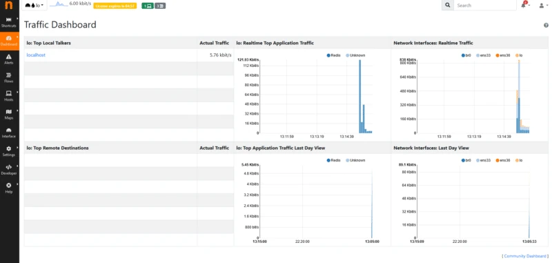


Dasbor NtopNG


Jangan terbiasa dengan yang satu ini! Jika Anda melihat kotak kuning di bagian atas layar, Anda akan melihat kalimat: "*Lisensi akan berakhir pada 04:57*". Secara default, instalasi akan meluncurkan uji coba versi lengkap NtopNG, tetapi untuk waktu yang (sangat) terbatas. Setelah "hitungan mundur" ini tercapai, versi *community* diaktifkan dan dasbor berubah:


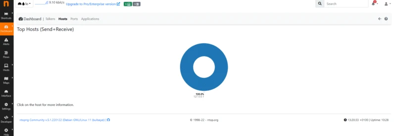


Dasbor komunitas NtopNG yang baru


Hal pertama yang harus dilakukan adalah **memastikan bahwa Interface yang benar sedang mendengarkan**. Di sudut kiri atas, daftar drop-down antarmuka yang tersedia memungkinkan Anda memilih Interface yang kami minati di sini: br0


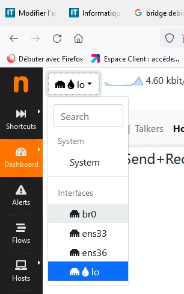


Pilihan Interface


Jendela baru menampilkan "Pembicara Cacat Teratas", yaitu perangkat yang paling sering berkomunikasi. Di sini saya hanya memiliki dua stasiun yang muncul:


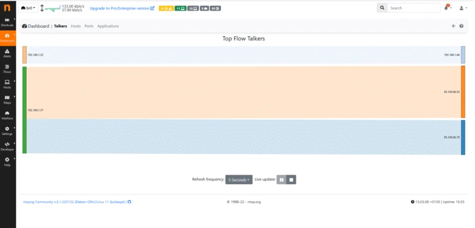


**Host sumber muncul di sebelah kiri, host tujuan di sebelah kanan ** Hal ini memungkinkan Anda untuk memvisualisasikan penggunaan total bandwidth oleh setiap host, dan untuk mendapatkan tampilan keseluruhan lalu lintas jaringan. Itu tidak buruk, tetapi kita bisa melangkah lebih jauh...


Jika saya mengklik "*Hosts*", misalnya, saya mendapatkan grafik yang menunjukkan konsumsi daya pengiriman dan penerimaan setiap host di jaringan saya. Di sini, misalnya, saya dapat melihat bahwa 192.168.1.37 sendiri menyumbang 80% dari trafik saya:


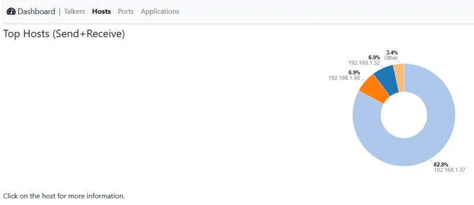


Jika saya mengeklik IP Address dari host yang bersangkutan, saya diarahkan ke halaman ringkasan:


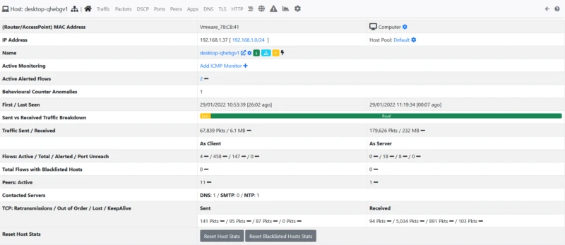


Saya dapat melihat, misalnya, bahwa ini adalah mesin VMWare (dengan mengenali YA pada MAC Address saya), bahwa mesin ini bernama DESKTOP-GHEBGV1 (jadi pasti host Windows) DAN saya memiliki **statistik tentang paket yang diterima dan dikirim, serta jumlah data**.


Anda juga akan melihat menu baru di bagian atas ringkasan ini. Saya sarankan Anda mengklik "**Aplikasi**" untuk melihat apa yang mendorong begitu banyak lalu lintas:


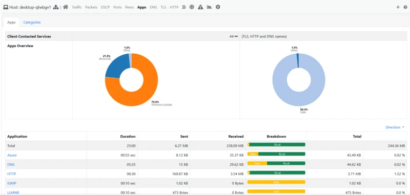


Ha, sepertinya kita sudah mendapatkan jawabannya! Pada grafik di sebelah kiri, **kita melihat bahwa 76,6% lalu lintasnya berasal dari... Pembaruan Windows**, jadi host ini sedang mengunduh pembaruan!


NtopNG menggunakan teknologi yang disebut DPI untuk *Deep Packet Inspection*, yang memungkinkannya untuk mengkategorikan setiap aliran jaringan dan mendefinisikan aplikasi (atau keluarga aplikasi) di belakangnya.


Untuk mendemonstrasikannya, saya meluncurkan video YouTube pada host saya:


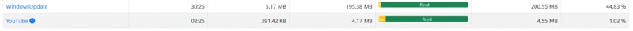


**Lalu lintas segera dikenali dan dikategorikan!


Catatan: untuk alasan yang jelas, perangkat lunak semacam ini dapat menimbulkan masalah privasi, jadi berhati-hatilah untuk menggunakannya dalam kondisi yang tepat. Perhatikan juga bahwa dimungkinkan untuk **mengaburkan hasil**, opsi ini dapat ditemukan di **Pengaturan > Preferensi > Lain-lain** dan disebut "**Tutupi Host IP Address**".


## VI. Deteksi & peringatan


NtopNG juga mampu mengeluarkan peringatan keamanan pada feed tertentu. Ini bisa ditemukan pada menu **Alerts**, pada spanduk sebelah kiri. Di sini, sebagai contoh, saya memiliki total 2.851 peringatan, terbagi dalam berbagai tingkat keparahan: Pemberitahuan, Peringatan dan Kesalahan.


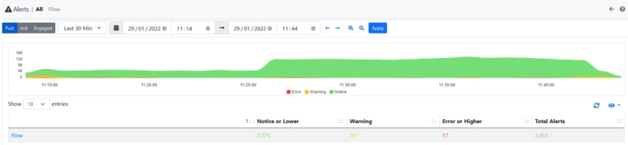


Mari kita lihat peringatan kekritisan tinggi, saya punya 17 di antaranya!


Mengklik gambar ini akan memunculkan detail peringatan. Tidak ada yang mengkhawatirkan di sini, ini adalah positif palsu, pengunduhan pembaruan dikategorikan sebagai transfer file biner dalam aliran HTTP, yang memang bisa berarti serangan.


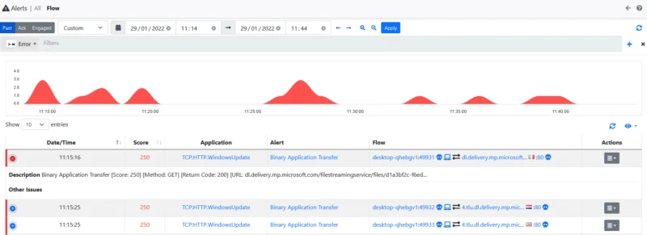


Namun, karena saya menggunakan versi gratis, saya tidak bisa mengecualikan domain atau host yang menjadi sumber peringatan, jadi Anda harus terus mengawasinya agar tidak melewatkan sesuatu yang lebih mengkhawatirkan. NtopNG akan memberikan peringatan generate jika ada file :


- Pengunduhan file biner melalui HTTP
- Lalu lintas DNS yang mencurigakan
- Menggunakan port non-standar
- Deteksi injeksi SQL
- Skrip Lintas Situs (XSS)
- Dll.


## VII. Kesimpulan


Dalam tutorial ini, kita telah melihat **cara menyiapkan probe dengan NtopNG** yang memungkinkan kita untuk **menganalisis lalu lintas jaringan kita** untuk memvisualisasikan penggunaan protokol dan hunian setiap host, tetapi juga mendeteksi lalu lintas yang mencurigakan.


Sayangnya, saya tidak dapat membahas semua fitur dan kemungkinan dalam artikel ini, tetapi silakan Anda jelajahi sendiri!


Solusi ini dapat diimplementasikan secara permanen dalam infrastruktur perusahaan. NtopNG juga dapat mengekspor hasil ke basis data InfluxDB, sehingga Anda dapat membuat dasbor sendiri dengan alat pihak ketiga seperti Graphana.
