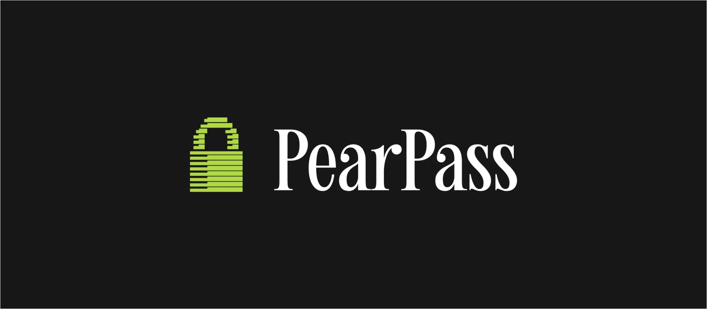

À l’heure où chaque individu gère des dizaines, voire des centaines de comptes en ligne, la sécurité des identifiants est devenue un enjeu central de la sécurité informatique. Réseaux sociaux, messageries, services professionnels, plateformes financières : chacun de ces accès repose sur un secret dont la compromission peut avoir des conséquences graves sur votre vie.

Pourtant, malgré la multiplication des attaques, les mauvaises pratiques restent largement répandues dans la population : mots de passe faibles, réutilisés, stockés en clair ou mémorisés approximativement. Pour résoudre ces problèmes sans se compliquer la vie au quotidien, la solution consiste à utiliser un gestionnaire de mots de passe.

Il existe déjà des dizaines de gestionnaires de mots de passe, et Plan ₿ Academy propose un tutoriel pour la plupart d’entre eux. Mais dans ce tutoriel, je vous propose d’en découvrir un qui se distingue clairement des autres par son fonctionnement : **PearPass**.

**PearPass est un gestionnaire de mots de passe pair-à-pair, local-first et open-source, pensé pour redonner à l’utilisateur un contrôle total sur ses données.**

01

## Pourquoi choisir PearPass ?

Un gestionnaire de mots de passe est un logiciel dont le rôle est de générer, stocker et organiser l’ensemble de vos identifiants de manière sécurisée. Plutôt que de mémoriser ou de réutiliser des mots de passe, vous n’avez plus qu’un seul secret à protéger : le mot de passe maître, qui chiffre l’intégralité de votre coffre-fort. Cette approche permet d’utiliser des mots de passe uniques, longs et aléatoires pour chaque service, ce qui réduit à la fois les risques d’oubli et de compromission, tout en limitant l’impact d’une éventuelle fuite. Aujourd’hui, il s’agit d’un outil de base en informatique que tout le monde devrait utiliser.

Il existe deux grandes catégories de gestionnaires de mots de passe. D’un côté, les logiciels fonctionnant uniquement en local, très sécurisés puisque les données ne sont jamais stockées sur un serveur central, mais peu pratiques, car ils ne permettent pas de synchroniser facilement vos identifiants entre plusieurs appareils (ordinateur, smartphone, tablette...). De l’autre, les gestionnaires de mots de passe fonctionnant dans le cloud, qui conservent vos identifiants sur leurs serveurs et les synchronisent sur l’ensemble de vos appareils. Leur principal avantage est la praticité, mais ils impliquent un compromis sur la sécurité, puisque vos mots de passe sont stockés sur des infrastructures que vous ne contrôlez pas.

PearPass rompt volontairement avec ces deux modèles. Il se positionne entre les gestionnaires locaux et les solutions cloud : il permet la synchronisation de vos mots de passe, tout en garantissant qu’ils ne sont jamais stockés sur des serveurs distants. Ainsi, l’ensemble de vos identifiants est conservé localement sur vos appareils, et la synchronisation entre plusieurs machines s’effectue exclusivement en pair-à-pair. Cette architecture élimine les points de défaillance uniques liés aux bases de données centralisées : il n’existe aucun serveur à compromettre, ni d’infrastructure tierce susceptible d’accéder à vos identifiants. Les communications entre vos appareils sont chiffrées de bout en bout, ce qui garantit que seules les clés que vous détenez permettent l’accès aux données.

02

Pour rendre cela possible, comme son nom l’indique, PearPass s’appuie sur **Pears**, un écosystème technologique pair-à-pair dédié à la création et à l’exécution d’applications sans serveur. Pears fournit l’environnement d’exécution, les mécanismes de distribution et les couches réseau nécessaires au fonctionnement d’applications entièrement décentralisées, capables de se synchroniser directement entre pairs, sans infrastructure centrale. Dans le cas de PearPass, Pears assure la découverte des appareils, l’établissement de connexions chiffrées et la synchronisation des coffres-forts de mots de passe entre vos machines. Cette approche garantit que PearPass reste fonctionnel, résilient et indépendant de toute autorité externe.

https://planb.academy/tutorials/computer-security/communication/pears-6d42b312-c69f-4504-8f71-b03b56c42fdd

Au-delà de cette architecture novatrice, PearPass est entièrement open-source et l’ensemble de ses fonctionnalités est gratuit. Le logiciel a également fait l’objet d’un audit indépendant par Secfault Security. En plus de son architecture spécifique, PearPass propose évidemment toutes les fonctionnalités classiques attendues d’un bon gestionnaire de mots de passe, que nous allons découvrir tout au long de ce tutoriel.

Pour résumer, là où les gestionnaires de mots de passe traditionnels vous demandent de faire confiance à une entreprise et à ses serveurs, PearPass adopte une logique de souveraineté : pas de cloud, pas de comptes centralisés, pas d’intermédiaires. Vous conservez un contrôle exclusif sur vos identifiants, tout en bénéficiant de la synchronisation entre vos appareils.

## Comment installer PearPass ?

PearPass est disponible sur l’ensemble des plateformes : Windows, Linux, macOS, Android, iOS et extension de navigateur. Il n’est pas nécessaire d’installer Pears sur votre machine : PearPass fonctionne de manière autonome.

### Installation sur Windows

Sur Windows, PearPass est fourni sous la forme d’un installateur classique. Rendez-vous [sur la page officielle de téléchargement](https://pass.pears.com/download), puis cliquez sur le bouton `Download Windows installer`.

Une fois le fichier téléchargé, ouvrez l’installateur et suivez les étapes indiquées par l’assistant. L’application est ensuite accessible depuis le `Start Menu` ou via un raccourci sur le bureau.

03

### Installation sur macOS

Sur macOS, PearPass est distribué sous la forme d’une image disque (`.dmg`). Rendez-vous [sur la page officielle de téléchargement](https://pass.pears.com/download) et choisissez la version correspondant à l’architecture de votre Mac (Intel ou Apple Silicon). Après téléchargement, ouvrez le fichier `.dmg` et lancez l’application depuis le dossier `Applications`.

Lors du premier démarrage, macOS affichera un message de sécurité indiquant que l’application provient d’Internet : il suffit de confirmer pour poursuivre.

### Installation sur Linux

Sur Linux, PearPass est proposé au format `.AppImage`, ce qui garantit une compatibilité large avec la majorité des distributions sans dépendances spécifiques. Téléchargez le fichier `.AppImage` depuis [la page officielle de téléchargement](https://pass.pears.com/download), puis lancez le directement par un double-clic.

Selon votre environnement, il peut être nécessaire de rendre le fichier exécutable via les propriétés du fichier (clique droit) ou avec la commande `chmod +x`. Une fois autorisé, PearPass se lance comme une application autonome.

### Installation de l’extension navigateur

PearPass propose une extension pour navigateur permettant le remplissage automatique des identifiants et un accès rapide à votre coffre-fort lors de la navigation web. L’extension est actuellement disponible pour Google Chrome et les navigateurs compatibles. Pour l’installer, rendez-vous [sur la page de téléchargement officielle](https://chromewebstore.google.com/detail/pearpass/pdeffakfmcdnjjafophphgmddmigpejh).

04

Une fois ajoutée, vous pouvez l'épingler dans la barre d’outils pour un accès rapide. L’activation de l’extension nécessite ensuite une liaison avec l’application PearPass installée localement sur votre ordinateur (nous y reviendrons plus loin dans le tutoriel).

### Installation sur iOS et Android

Sur iPhone et Android, vous pouvez simplement télécharger l’application depuis votre store d’applications :
- [Google Play Store](https://play.google.com/store/apps/details?id=com.pears.pass) ;
- [App Store](https://apps.apple.com/us/app/pearpass/id6752954830).

05

En plus de ces méthodes d’installation classiques, il est également possible de télécharger directement le logiciel depuis les dépôts GitHub, pour chaque plateforme :
- [Desktop](https://github.com/tetherto/pearpass-app-desktop) ;
- [Mobile](https://github.com/tetherto/pearpass-app-mobile) ;
- [Extension de navigateur](https://github.com/tetherto/pearpass-app-browser-extension).

Une fois PearPass installé sur une ou plusieurs plateformes, vous pouvez passer à la configuration initiale. Dans ce tutoriel, nous commencerons par configurer le logiciel sur desktop, puis nous le synchroniserons avec l’extension de navigateur et l’application mobile.

