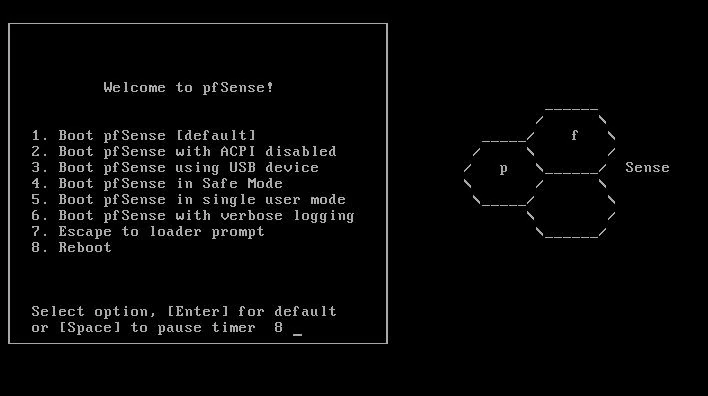
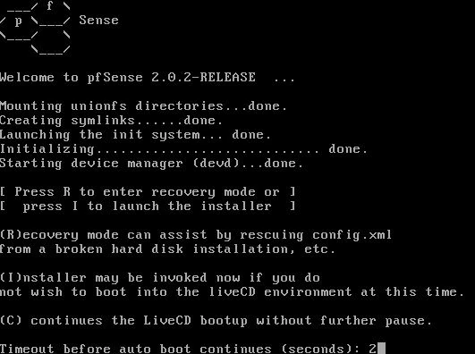
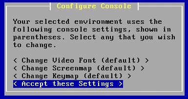
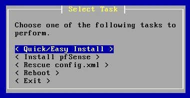
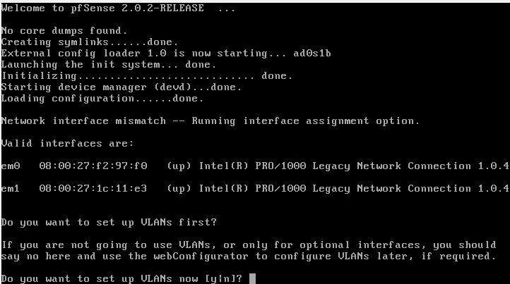
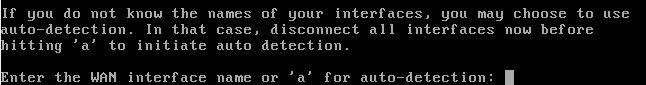
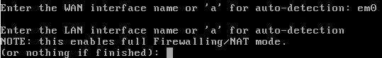
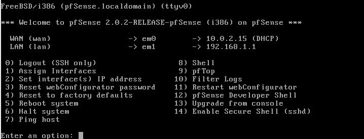

___

*Ce tutoriel est basé sur le contenu original de Florian BURNEL publié sur [IT-Connect](https://www.it-connect.fr/). Licence [CC BY-NC 4.0](https://creativecommons.org/licenses/by-nc/4.0/). Des modifications ont pu être apportées au texte original.*

___

## I. Présentation

Pfsense est un OS transformant n'importe quel ordinateur en routeur/pare-feu. Basé sur FreeBSD, connu pour sa fiabilité et surtout sa sécurité, Pfsense est un produit OpenSource adapté à tout type d'entreprise.

Voici ses principales fonctionnalités :

- Gestion complète par interface web  
- Pare-feu stateful avec gestion du NAT, NAT-T  
- Gestion de multiples WAN  
- DHCP server et relay  
- Failover (possibilité de monter un cluster de pfsense)  
- Load balancing  
- VPN Ipsec, OpenVPN, L2TP  
- Portail captif

Cette liste n'est pas exhaustive et si une fonction vous manque, des extensions sont disponibles directement depuis l'interface de Pfsense, permettant notamment l'installation d'un proxy ou d'un filtrage d'URL, très simplement.

En plus d'être disponible en version 32 et 64 bits, Pfsense est également disponible pour l'embarqué, il fonctionne très bien sur des petits boitiers Alix.

Dernière chose, Pfsense nécessite deux cartes réseaux minimum (une pour le WAN et une pour le LAN).

## II. Télécharger l'image

La dernière version en date est la 2.8 (juin 2025) on peut la retrouver via ce lien pour la télécharger :

* https://www.pfsense.org/download/

Pour les personnes souhaitant virtualiser Pfsense vous trouverez également un fichier OVA avec la distribution tout prête sous forme de VM.

## III. Installation

Je réaliserais l'installation sur une VM depuis VirtualBox, la procédure d'installation est la même si vous êtes sur une machine physique.

En terme de configuration requise, prévoyez au moins 1 Go de RAM et 8 Go de disque (plus si vous activez ZFS ou des paquets gourmands).

Lors du démarrage de l'ordinateur avec l'ISO monté, un menu de boot apparaît. Selon les besoins on peut choisir de démarrer Pfsense avec certaines options activées. Si aucune touche n'est appuyée, Pfsense bootera avec les options par défauts (choix 1) au bout de 8 secondes.

Appuyez sur "**Entrée**" pour booter avec les options par défaut.

Appuyer rapidement sur la touche "**I**" afin de démarrer l'installation.

L'installation démarre, dès le premier écran nous pouvons régler différents paramètres notamment la police d'écriture et l'encodage des caractères. Ces options sont utiles pour des cas bien particuliers. Nous n'y toucherons donc pas. On sélectionne "**Accept these Settings**".

On choisit "**Quick/Easy Install**" pour procéder à l'installation rapide.

Le message qui suit, nous informe que le disque dur sera formaté et toutes les données présentes dessus seront effacées. On sélectionne "**OK**" et on continue.

L'installation débute et copie les fichiers nécessaires sur le disque dur, nous devons part la suite choisir quel type de kernel nous voulons installer, étant sur un ordinateur nous choisissons le "**Standard Kernel**".

Une fois l’installation finie, on choisit "**Reboot**" et nous redémarrons sur notre nouvelle installation.

Remarque : N'oubliez pas de sortir l'ISO de Pfsense avant de redémarrer.

## IV. Premier boot de Pfsense

Lors du premier démarrage de Pfsense, il faut configurer les différentes interfaces (WAN, LAN, DMZ, etc.), il faut donc bien repérer vos différentes cartes réseaux afin de ne pas vous tromper dans votre configuration auquel cas vous n'aurez pas accès à l'interface web et votre pare-feu ne fonctionnera pas.

Pfsense vous affiche vos différentes cartes réseaux avec leur adresse MAC, ce qui vous permettra de les différencier.

La première étape de configuration concerne l'utilisation des VLANs, pour l'instant ce qui nous importe est la configuration de base de Pfsense, nous appuyons donc sur la touche "**N**".

Nous devons ensuite déterminer quel interface est sur le côté WAN, pour cela on peut soit saisir manuellement le nom de l'interface, soit laisser Pfsense le faire automatiquement en appuyant sur "**A**".

La détection automatique est utile dans le cas d'un ordinateur physique, car il est rarement simple de différencier les cartes réseaux, et, l'adresse MAC n'est pas une donnée accessible facilement. En revanche, la détection ne fonctionnera que si vos cartes sont branchées et actives.

Nous passerons pour notre part en configuration manuelle, j'entre donc le nom de la bonne carte à savoir pour mon cas "**em0**".

Remarque : le nom de votre carte peut différer, en effet sous BSD le nom des cartes réseaux sont liés à leur constructeur (par exemple pour une carte réseau Realtek, la carte s’appellera reX, ou "**X**" est le numéro de la carte).

Ensuite, nous faisons la même chose pour la carte réseau sur le LAN, j'entre donc "**em1**", on notera la précision de Pfsense qui nous indique, que cela activera le Pare-feu et le NAT.

Nous pouvons par la suite créer d'autres interface réseaux (DMZ, Wifi, etc.), celle-ci nécessite bien sur une carte réseau pour chacune d'elle, nous en resterons là pour l'instant et appuierons sur "**Entrée**".

Pfsense nous résume alors l'attribution des cartes réseaux aux différentes interfaces et nous validons avec "**Y**".

Une fois la configuration terminée, le menu de la console de Pfsense apparaît. Celui-ci est utile dans le cas de tâches administratives, comme l'oubli du mot de passe de l'interface web. Néanmoins la plupart des options présentes dans ce menu sont également disponibles via l'interface web.

On notera enfin la présence des paramètres de chaque interface et notamment l'adresse IP d'accès à l'interface web de Pfsense, à savoir sur la capture 192.168.1.1.

Remarque : si votre réseau possède une adresse différente, choisissez l'option 2 du menu afin de configurer une IP correspondante à votre environnement.

Votre interface WAN doit quant à elle, si elle est connectée à votre box ou modem Internet, récupérer une adresse IP via DHCP, vous devriez donc avoir Internet en vous branchant sur le côté LAN de Pfsense.
