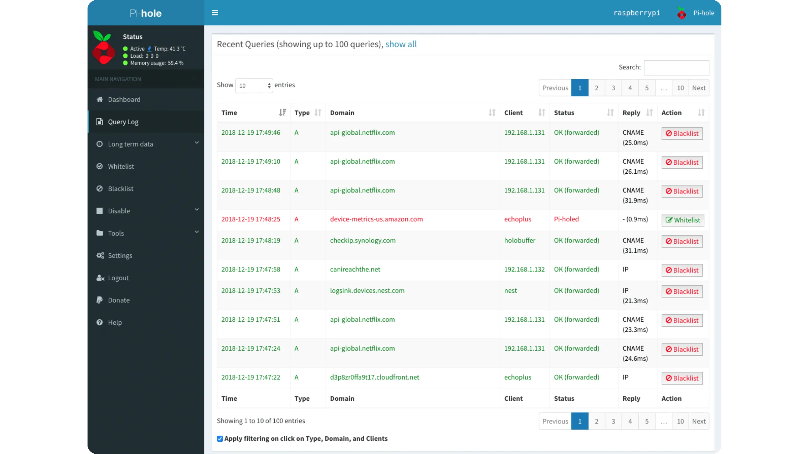

___

*Tutorial ini didasarkan pada konten asli oleh Florian Duchemin yang dipublikasikan di [IT-Connect](https://www.it-connect.fr/). Lisensi [CC BY-NC 4.0](https://creativecommons.org/licenses/by-nc/4.0/). Perubahan mungkin telah dilakukan pada teks asli.*
___

## I. Presentasi

Kita semua pernah melakukannya begitu memulai browser favorit kita: memasang **adblocker** (pemblokir iklan). Namun, ketika menggunakan menggunakan TV atau perangkat Android, dan lain-lain, agak sulit menemukan sesuatu yang berfungsi. Dan jika ada lebih dari satu perangkat di rumah, Anda harus mengulanginya untuk setiap browser!

Dalam tutorial ini, kita akan menyelesaikan masalah sederhana: menyediakan ad blocker untuk semua perangkat di jaringan kita dan mengelolanya secara terpusat.

Untuk melakukan ini, kita akan menggunakan alat yang dikembangkan untuk tujuan ini: **Pi-Hole**.

Pi-Hole adalah DNS sinkhole. Pi-Hole akan menggunakan permintaan DNS yang dibuat oleh perangkat Anda untuk memvalidasi atau menolak lalu lintas, sehingga melindungi Anda dari alamat dan domain yang dikenal mendistribusikan iklan, malware, dan lain sebagainya.

DNS adalah singkatan dari _Domain Name System_. Jadi, apa itu nama domain? "it-connect.fr" hanyalah salah satu contoh. Nama domain adalah pengenal unik untuk satu atau lebih sumber daya, biasanya dikelola oleh satu entitas.

Nama perangkat yang ditambah nama domain disebut FQDN (_Fully Qualified Domain Name_). Ini memungkinkan Anda untuk mencapai perangkat tertentu hanya dengan "memanggilnya". Misalnya, ketika Anda mengetik "www.trucmachin.com", Anda sebenarnya memanggil perangkat "www", yang termasuk dalam domain "trucmachin.com".

Kita perlu tahu komputer kita tidak mengerti bahasa manusia, yang mereka mengerti hanyalah biner, jadi mereka membutuhkan alamat IP, yang setara dengan nomor telepon, untuk mencapai situs web.

Jadi, setiap kali Anda memasukkan nama situs web di browser Anda, atau mengklik tautan, komputer Anda pertama-tama meminta server DNS untuk alamat IP yang sesuai dengan nama tersebut.

**Pi-Hole kemudian akan memeriksa permintaan-permintaan ini (ada ratusan setiap hari!) dan secara otomatis memblokir yang diketahui menjadi host iklan atau bahkan file berbahaya.**

## II. Memasang Pi-Hole

Dengan nama seperti Pi-Hole, Anda mungkin benar berasumsi bahwa Anda memerlukan sebuah Raspberry-Pi... Tetapi itu tidak sepenuhnya benar. Pi-Hole dapat dipasang di komputer Linux mana pun (Debian, Fedora, Rocky, Ubuntu, dll.).

Di sisi lain, Anda perlu ingat **bahwa perangkat ini harus menyala 24 jam sehari untuk alasan sederhana: tanpa DNS, tidak ada Internet!** Oleh karena itu Raspberry adalah ide yang bagus, karena hampir tidak mengonsumsi energi.

Untuk menginstal, cukup sambungkan ke komputer Linux Anda melalui SSH dan masukkan perintah berikut ini sebagai "*root*":

```
curl -sSL https://install.pi-hole.net | bash
```

> **Catatan**: Dalam keadaan normal, tidak disarankan untuk "menjalankan" sebuah skrip tanpa terlebih dahulu mengetahui apa yang dilakukannya. Jika Anda tidak yakin, buka halaman dengan browser atau unduh kontennya sebagai file.

> **Catatan**: Pada versi minimal Debian 11, Curl tidak terinstal, jadi Anda perlu memasangnya secara manual dengan perintah **apt-get install curl** sebelum mengetik perintah di atas.

Setelah skrip berjalan, serangkaian tes akan dilakukan, dan instalasi itu sendiri akan berjalan secara mandiri:

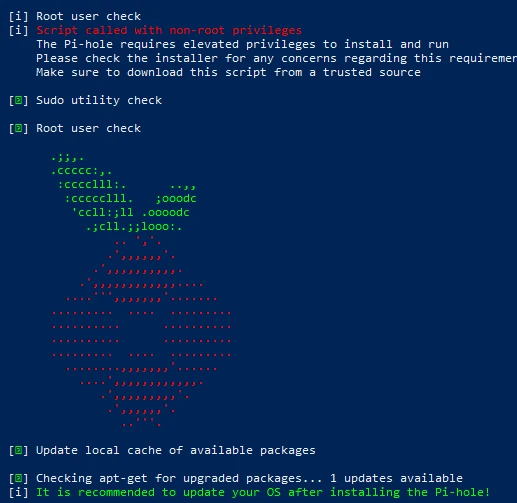

meng-install Pi-Hole

Setelah instalasi selesai, Anda akan dibawa ke layar ini:

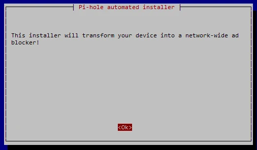

Layar starter Pi-Hole

> **Catatan**: Jika Anda menggunakan DHCP pada komputer Anda, Anda akan mendapatkan pesan peringatan tentang hal ini. Tentu saja, untuk penggunaan yang tepat, kami sangat menyarankan agar Anda menetapkan IP tetap ke komputer Anda.

Setelah layar ini, Anda akan mendapatkan beberapa pesan informasi, dan kemudian Anda akan dibawa ke wizard konfigurasi, yang pertama-tama akan menanyakan server DNS mana yang akan menjadi tempat Pi-Hole meneruskan permintaan. Dari sisi saya, saya telah memilih Quad9, yang memiliki piagam privasi pengguna.

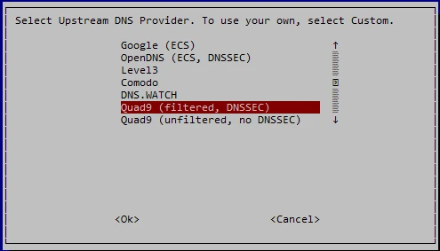

Pemilihan DNS - Pi-Hole

> **Catatan**: Jika Anda berada di sebuah perusahaan, kemungkinan server DNS Anda saat ini adalah pengontrol domain Active Directory. Tetapi jangan khawatir, Anda nantinya dapat menentukan redirector bersyarat untuk domain pilihan Anda. Biasanya, Anda dapat mengarahkan setiap permintaan yang berkaitan dengan domain lokal Anda ke server DNS Anda.

Anda akan melihat bahwa beberapa pilihan menyertakan opsi DNSSEC. Pada dasarnya, protokol DNS tidak aman (tidak dirancang dengan mempertimbangkan hal ini pada saat itu). DNSSEC memecahkan masalah ini dengan menambahkan lapisan keamanan melalui enkripsi dan penandatanganan pertukaran, seperti yang dijelaskan dalam artikel yang sesuai: [Keamanan DNS](https://www.it-connect.fr/securite-dns-doh-quest-ce-le-dns-over-https/)

Setiap ad blocker mengandalkan satu atau lebih daftar untuk melakukan pekerjaannya. Pi-Hole hadir dengan satu daftar sebagai standar, jadi pilihlah dan tambahkan lebih banyak nanti.

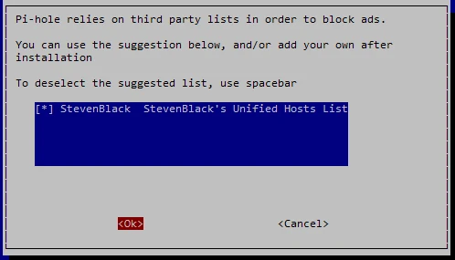

Kemudian muncul pertanyaan tentang Interface web, instalasinya opsional, karena aplikasi ini memiliki command line sendiri untuk manajemen dan visualisasi. Tetapi Interface ini cukup menyenangkan dan dibuat dengan baik, jadi saya sarankan Anda menginstalnya pada saat yang sama:

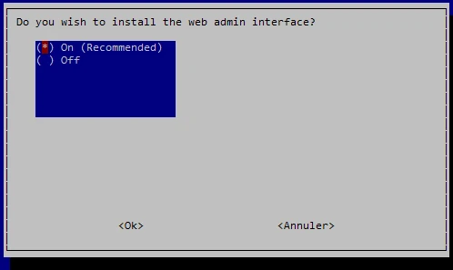

Jika Anda memasang Pi-Hole pada komputer yang sudah memiliki server web, Anda dapat menjawab "no" untuk pertanyaan berikut. Namun, harap dicatat bahwa PHP dan beberapa modul diperlukan agar ini berfungsi. Jika tidak, **lighttpd akan dipasang dengan semua modul yang diperlukan**.

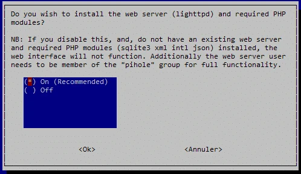

Anda kemudian ditanya apakah Anda ingin merekam permintaan DNS. **Jika Anda ingin menyimpan riwayat, atur ini ke "yes"; jika tidak, atur ini ke "no", tetapi Anda akan kehilangan beberapa fungsionalitas** (lihat layar berikutnya).

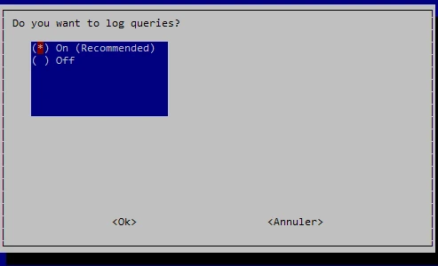

Untuk Interface web-nya, Pi-Hole menggunakan fungsi sendiri yang disebut FTLDNS, yang menyediakan API dan menghasilkan statistik dari permintaan DNS. Fungsi ini dapat menyertakan mode "privasi" yang menyamarkan domain yang diminta, klien di balik permintaan, atau keduanya. Berguna jika Anda ingin melakukan pemantauan tanpa melanggar privasi orang, atau hanya jika Anda ingin mematuhi peraturan yang relevan dalam kasus penggunaan pada jaringan publik.

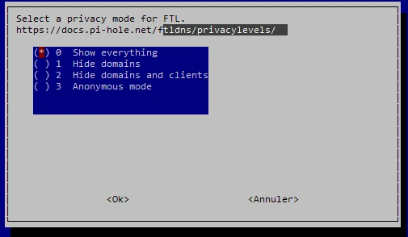

Pilihan mode privasi pribadi

Setelah pertanyaan terakhir ini dijawab, skrip akan melakukan apa yang seharusnya: mengunduh repositori GitHub dan mengonfigurasi Pi-Hole. Di akhir instalasi, layar ringkasan akan ditampilkan dengan info penting:

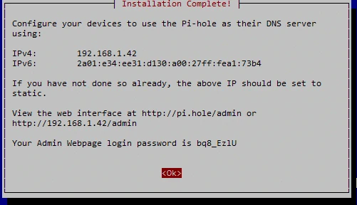

Layar ringkasan instalasi

Catat kata sandi Interface web dan informasi jaringan. Sekarang saatnya mengonfigurasi layanan DHCP di lokasi kita saat ini.

## III. Konfigurasi DHCP


Agar dapat berfungsi, Pi-Hole perlu "menyelesaikan" permintaan DNS dari klien, jadi mereka harus tahu bahwa Pi-Hole-lah yang akan mengirimkannya. Ada beberapa cara untuk melakukan ini:


- Ubah pengaturan DNS di server DHCP Anda (misalnya, Box Anda)
- Nonaktifkan server ini dan gunakan server yang disediakan oleh Pi-Hole
- Memodifikasi secara manual setiap perangkat untuk menggunakan Pi-Hole sebagai DNS


Saya pribadi memilih solusi pertama. Kemungkinannya adalah **Anda memiliki server DHCP di tempat Anda berada** (biasanya di dalam kotak komputer Anda). Jadi tidak perlu repot-repot.


Karena ada banyak sekali kemungkinan, antara kotak operator yang berbeda (yang tidak saya ketahui semuanya) dan mereka yang memiliki router sendiri, saya tidak akan memberikan tangkapan layar untuk modifikasi ini. Bagaimanapun, Anda harus masuk ke pengaturan DHCP dan memodifikasi parameter "DNS" untuk memasukkan IP Address dari Pi-Hole Anda.


Setelah ini dilakukan, jika ada perangkat yang telah dinyalakan sebelumnya, perangkat tersebut akan mempertahankan pengaturan lama, jadi Anda harus memulai ulang permintaan konfigurasi.


Pada workstation Windows, dengan prompt perintah :


```
ipconfig /renew
```


Pada stasiun kerja Linux :


```
dhclient
```


Untuk semua perangkat lain, perangkat tersebut harus dimatikan dan dinyalakan kembali.


Jadi, mereka harus mendapatkan parameter yang tepat, untuk diperiksa:


```
ipconfig /all
```


Pada bidang DNS, Anda harus memiliki Address dari Pi-Hole Anda, dalam kasus saya 192.168.1.42 :


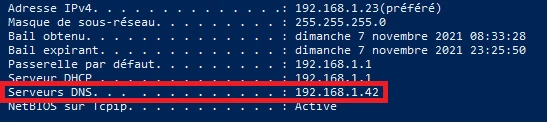


## IV. Menggunakan lubang Pi-Hole web Interface


Untuk memfasilitasi administrasi, **Pi-Hole** mendapat manfaat dari Interface web Interface yang dirancang dengan baik. Mudah digunakan dan dapat diakses, memungkinkan Anda:


- Melihat jumlah permintaan, permintaan yang diblokir, dll. secara real time.
- Kelola Daftar Putih dan Daftar Hitam Anda
- Menambahkan entri statis, alias, dll.
- Tambahkan daftar
- Dan masih banyak fungsi lainnya!


Bagi saya, saya akan menambahkan daftar pemblokiran. Seperti disebutkan di atas, hanya satu daftar yang dipasang bersamaan dengan Soft. Ada banyak daftar untuk situs iklan, tetapi yang terbaik adalah memilih setidaknya satu yang spesifik untuk negara tempat Anda tinggal. Salah satu daftar yang paling terkenal adalah **EasyList**, dan salah satunya khusus untuk Prancis: [EasyList-ListFR](https://raw.githubusercontent.com/deathbybandaid/piholeparser/master/Subscribable-Lists/ParsedBlacklists/EasyList-Liste-FR.txt)


Untuk menambahkannya, pertama-tama sambungkan ke admin Interface: **http://<ip_du_PiHole>/admin**


Kata sandi administrator telah dibuat (lihat tangkapan layar akhir instalasi), jadi Anda hanya perlu memasukkannya untuk mengakses Interface :


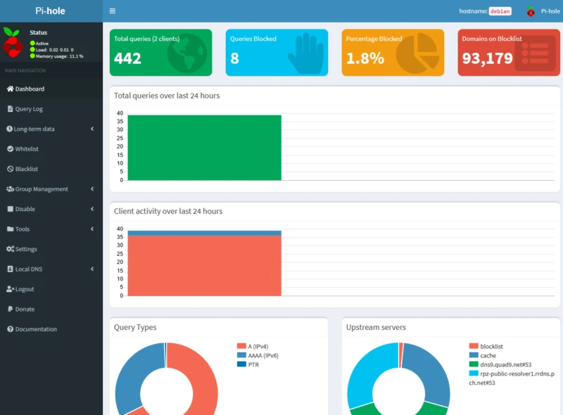


Interface dari Pi-Hole


Kita dapat melihat, misalnya, bahwa ada dua pelanggan yang terhubung ke Pi-Hole, bahwa Pi-Hole telah memproses 442 permintaan dan 8 di antaranya telah diblokir. Grafik ini bisa menjadi sumber informasi yang baik, terutama dalam konteks profesional.


Untuk menambahkan daftar, buka menu "**Group Management**" dan "**Adlists**":


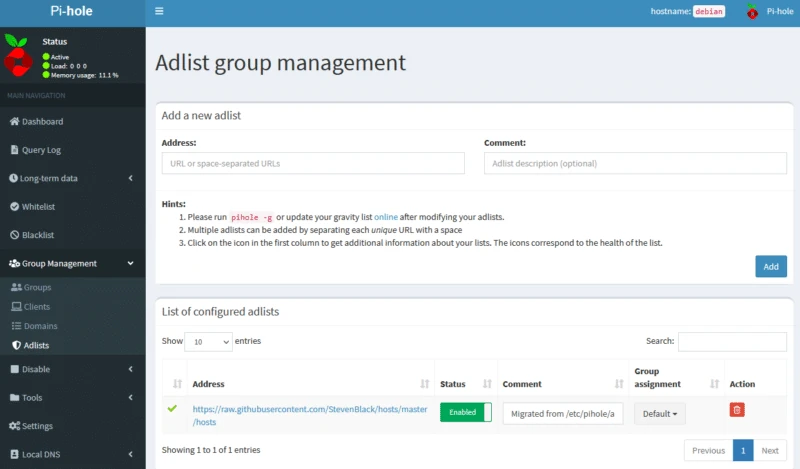


Kita dapat melihat daftar pertama kita "**StevenBlack**", untuk menambahkan daftar kita, salin tautan yang saya berikan di atas dan masukkan ke dalam bidang "**Address**", untuk deskripsinya, saya memilih untuk memasukkan nama daftar:


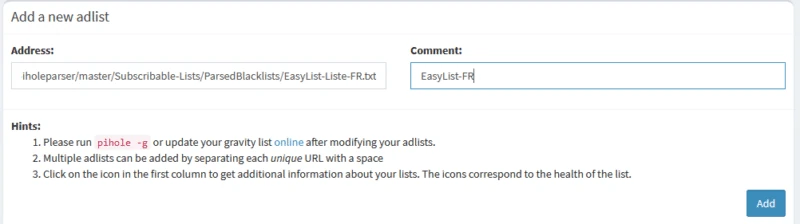


Menambahkan daftar di Pi-Hole


Yang tersisa hanyalah mengklik "**Tambahkan**" untuk menambahkannya. Untuk mengaktifkannya, kita perlu melakukan langkah tambahan untuk "memperingatkan" Pi-Hole untuk mengambil alih daftar ini. Untuk melakukan ini :


- Gunakan baris perintah bawaan
- Baik web Interface


Saya pribadi memilih yang kedua, karena jika Anda perhatikan dengan seksama, tautan ke skrip PHP yang melakukan pembaruan langsung ada di halaman tempat kita berada (kata "online"). Jadi, Anda tinggal mengkliknya, yang akan membawa Anda ke halaman yang hanya memiliki satu pilihan:


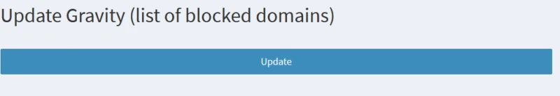


Halaman ini akan menampilkan hasil skrip setelah selesai, yang berarti bahwa daftar tersebut telah diperhitungkan (kecuali jika ada pesan kesalahan yang ditampilkan, tentu saja).


Seperti yang diumumkan di awal tutorial ini, Pi-Hole juga memungkinkan Anda untuk memblokir domain yang diketahui mendistribusikan malware. Untuk memperkuat fitur ini, saya sarankan Anda juga menambahkan daftar domain yang diperbarui secara berkala yang didistribusikan oleh Abuse.ch**, yang secara signifikan akan memperkuat keamanan jaringan Anda, tersedia di [Address] (https://urlhaus.abuse.ch/downloads/hostfile/).


Tentu saja, Anda dapat menambahkan daftar apa pun yang Anda anggap relevan, atau mengelola daftar hitam secara manual melalui menu daftar hitam.


## V. Tes Pi-Hole


Sekarang semuanya sudah siap, yang harus Anda lakukan adalah menguji solusi untuk memastikannya berfungsi dengan baik.


Sebagai contoh, saya akan mencoba menjangkau domain *http://admin.gentbcn.org/* yang ada dalam daftar Abuse.ch karena domain ini dikenal sebagai tempat hosting malware:


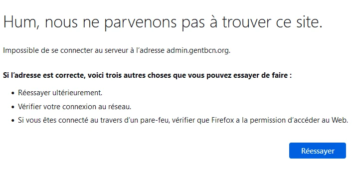


Jelas, saya telah diblokir di suatu tempat. Untuk memastikan bahwa Pi-Hole-lah yang melakukan tugasnya, kita dapat memeriksa log kueri di "Log Kueri" web Interface untuk melihat bahwa itu adalah pemblokiran dari entri daftar:


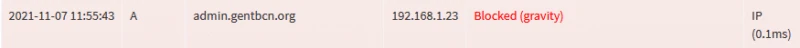


## VI. Kesimpulan


Dalam tutorial ini, kami telah menunjukkan pada Anda cara menyiapkan server DNS yang tidak hanya menghilangkan sebagian besar iklan demi kenyamanan penjelajahan Anda, tetapi juga menambahkan **keamanan Layer dengan memblokir domain-domain penyebar phishing dan malware**.


Semuanya gratis dan ekonomis jika dipasang pada Raspberry-Pi (dalam hal konsumsi daya).
